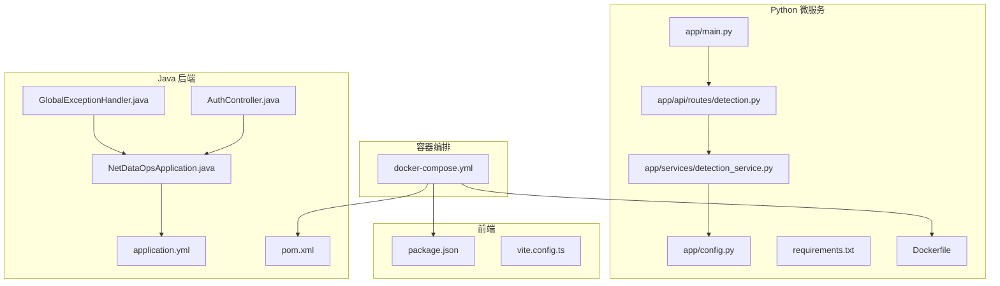
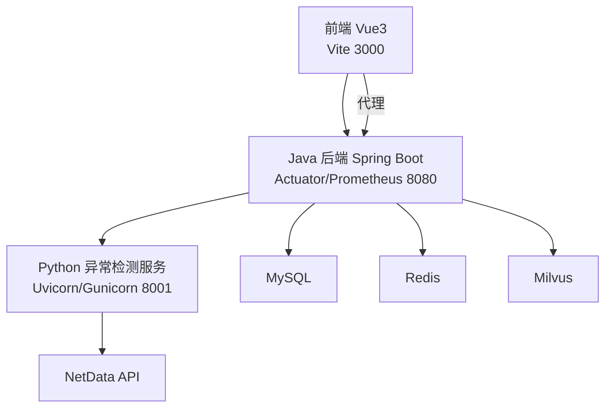
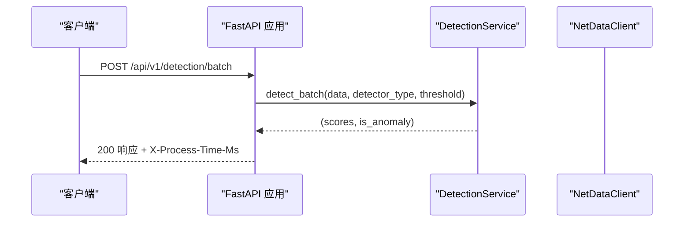
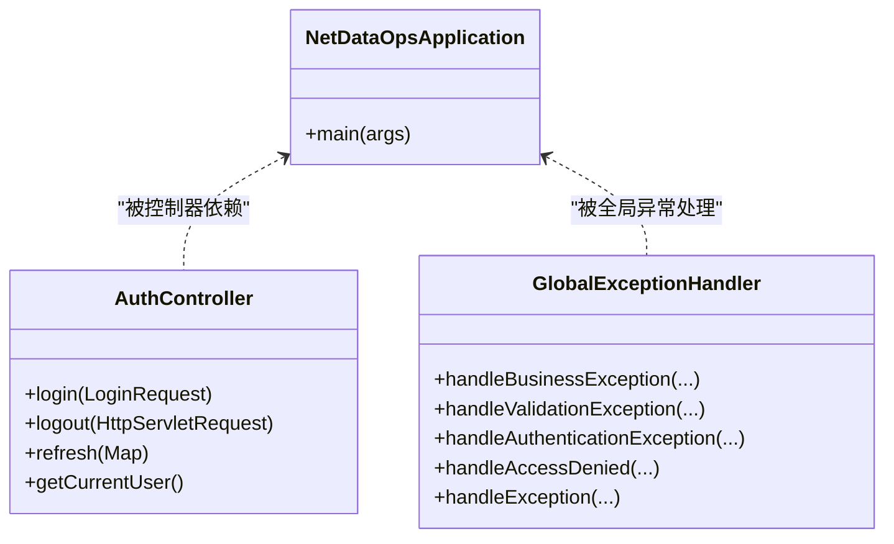
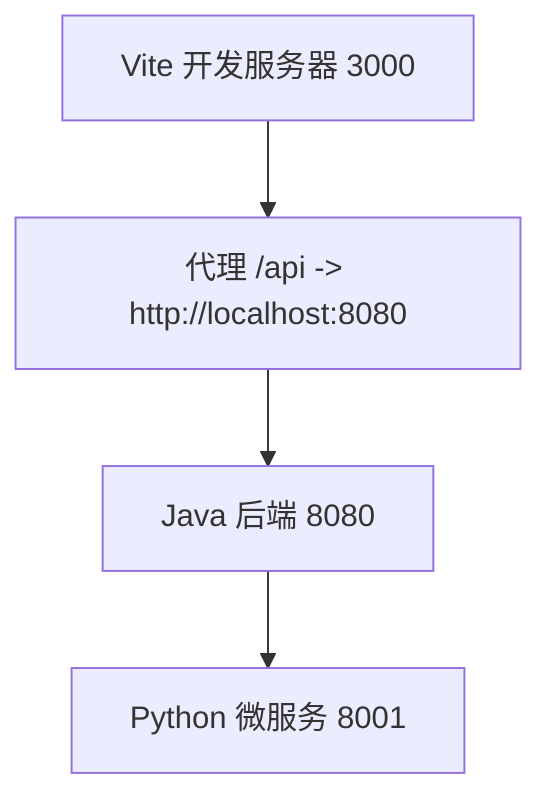

# 调试技巧与工具

<cite>
**本文引用的文件**
- [anomaly-detection-service/README.md](file://anomaly-detection-service/README.md)
- [anomaly-detection-service/Dockerfile](file://anomaly-detection-service/Dockerfile)
- [anomaly-detection-service/pyproject.toml](file://anomaly-detection-service/pyproject.toml)
- [anomaly-detection-service/requirements.txt](file://anomaly-detection-service/requirements.txt)
- [anomaly-detection-service/app/main.py](file://anomaly-detection-service/app/main.py)
- [anomaly-detection-service/app/config.py](file://anomaly-detection-service/app/config.py)
- [anomaly-detection-service/app/api/routes/detection.py](file://anomaly-detection-service/app/api/routes/detection.py)
- [anomaly-detection-service/app/services/detection_service.py](file://anomaly-detection-service/app/services/detection_service.py)
- [netdata-ai-backend/pom.xml](file://netdata-ai-backend/pom.xml)
- [netdata-ai-backend/src/main/resources/application.yml](file://netdata-ai-backend/src/main/resources/application.yml)
- [netdata-ai-backend/src/main/java/com/netdata/ops/NetDataOpsApplication.java](file://netdata-ai-backend/src/main/java/com/netdata/ops/NetDataOpsApplication.java)
- [netdata-ai-backend/src/main/java/com/netdata/ops/controller/AuthController.java](file://netdata-ai-backend/src/main/java/com/netdata/ops/controller/AuthController.java)
- [netdata-ai-backend/src/main/java/com/netdata/ops/exception/GlobalExceptionHandler.java](file://netdata-ai-backend/src/main/java/com/netdata/ops/exception/GlobalExceptionHandler.java)
- [netdata-ai-frontend/package.json](file://netdata-ai-frontend/package.json)
- [netdata-ai-frontend/vite.config.ts](file://netdata-ai-frontend/vite.config.ts)
- [docker-compose.yml](file://docker-compose.yml)
</cite>

## 目录
1. [简介](#简介)
2. [项目结构](#项目结构)
3. [核心组件](#核心组件)
4. [架构总览](#架构总览)
5. [详细组件分析](#详细组件分析)
6. [依赖分析](#依赖分析)
7. [性能考虑](#性能考虑)
8. [故障排查指南](#故障排查指南)
9. [结论](#结论)
10. [附录](#附录)

## 简介
本指南聚焦于本项目的多技术栈调试与工具使用，涵盖：
- Java 后端（Spring Boot）的远程调试、断点设置与性能分析
- Python 微服务（FastAPI）的异常追踪、日志分析与内存监控
- Vue.js 前端（Vite + Vue3）的浏览器调试、网络请求分析与性能监控
- Docker 容器的调试方法与日志收集策略
- 常见问题的调试流程与故障排除
- 开发工具推荐与效率提升技巧

## 项目结构
该项目采用多模块架构：
- Python 异常检测微服务：FastAPI + Uvicorn + Gunicorn（生产）
- Java 后端：Spring Boot + Spring AI + Actuator + Prometheus
- Vue.js 前端：Vite + Vue3 + TypeScript + Element Plus
- Docker Compose：统一编排与日志输出

图表来源
- [docker-compose.yml](file://docker-compose.yml)
- [anomaly-detection-service/app/main.py](file://anomaly-detection-service/app/main.py)
- [anomaly-detection-service/app/config.py](file://anomaly-detection-service/app/config.py)
- [anomaly-detection-service/app/api/routes/detection.py](file://anomaly-detection-service/app/api/routes/detection.py)
- [anomaly-detection-service/app/services/detection_service.py](file://anomaly-detection-service/app/services/detection_service.py)
- [anomaly-detection-service/Dockerfile](file://anomaly-detection-service/Dockerfile)
- [anomaly-detection-service/requirements.txt](file://anomaly-detection-service/requirements.txt)
- [netdata-ai-backend/src/main/java/com/netdata/ops/NetDataOpsApplication.java](file://netdata-ai-backend/src/main/java/com/netdata/ops/NetDataOpsApplication.java)
- [netdata-ai-backend/src/main/resources/application.yml](file://netdata-ai-backend/src/main/resources/application.yml)
- [netdata-ai-backend/pom.xml](file://netdata-ai-backend/pom.xml)
- [netdata-ai-backend/src/main/java/com/netdata/ops/controller/AuthController.java](file://netdata-ai-backend/src/main/java/com/netdata/ops/controller/AuthController.java)
- [netdata-ai-backend/src/main/java/com/netdata/ops/exception/GlobalExceptionHandler.java](file://netdata-ai-backend/src/main/java/com/netdata/ops/exception/GlobalExceptionHandler.java)
- [netdata-ai-frontend/package.json](file://netdata-ai-frontend/package.json)
- [netdata-ai-frontend/vite.config.ts](file://netdata-ai-frontend/vite.config.ts)

章节来源
- [docker-compose.yml](file://docker-compose.yml)
- [anomaly-detection-service/app/main.py](file://anomaly-detection-service/app/main.py)
- [anomaly-detection-service/app/config.py](file://anomaly-detection-service/app/config.py)
- [anomaly-detection-service/app/api/routes/detection.py](file://anomaly-detection-service/app/api/routes/detection.py)
- [anomaly-detection-service/app/services/detection_service.py](file://anomaly-detection-service/app/services/detection_service.py)
- [anomaly-detection-service/Dockerfile](file://anomaly-detection-service/Dockerfile)
- [anomaly-detection-service/requirements.txt](file://anomaly-detection-service/requirements.txt)
- [netdata-ai-backend/src/main/java/com/netdata/ops/NetDataOpsApplication.java](file://netdata-ai-backend/src/main/java/com/netdata/ops/NetDataOpsApplication.java)
- [netdata-ai-backend/src/main/resources/application.yml](file://netdata-ai-backend/src/main/resources/application.yml)
- [netdata-ai-backend/pom.xml](file://netdata-ai-backend/pom.xml)
- [netdata-ai-backend/src/main/java/com/netdata/ops/controller/AuthController.java](file://netdata-ai-backend/src/main/java/com/netdata/ops/controller/AuthController.java)
- [netdata-ai-backend/src/main/java/com/netdata/ops/exception/GlobalExceptionHandler.java](file://netdata-ai-backend/src/main/java/com/netdata/ops/exception/GlobalExceptionHandler.java)
- [netdata-ai-frontend/package.json](file://netdata-ai-frontend/package.json)
- [netdata-ai-frontend/vite.config.ts](file://netdata-ai-frontend/vite.config.ts)

## 核心组件
- Python 微服务：提供异常检测 API（批量/流式/训练），集成 NetData 数据源；支持日志轮转与请求耗时头。
- Java 后端：提供认证、RAG、命令执行审批等能力；启用 Actuator/Prometheus 指标；集中异常处理。
- 前端：Vite 开发服务器，代理后端 API；打包优化与手动分包。

章节来源
- [anomaly-detection-service/app/main.py](file://anomaly-detection-service/app/main.py)
- [anomaly-detection-service/app/api/routes/detection.py](file://anomaly-detection-service/app/api/routes/detection.py)
- [anomaly-detection-service/app/services/detection_service.py](file://anomaly-detection-service/app/services/detection_service.py)
- [netdata-ai-backend/src/main/java/com/netdata/ops/controller/AuthController.java](file://netdata-ai-backend/src/main/java/com/netdata/ops/controller/AuthController.java)
- [netdata-ai-backend/src/main/java/com/netdata/ops/exception/GlobalExceptionHandler.java](file://netdata-ai-backend/src/main/java/com/netdata/ops/exception/GlobalExceptionHandler.java)
- [netdata-ai-frontend/vite.config.ts](file://netdata-ai-frontend/vite.config.ts)

## 架构总览

图表来源
- [docker-compose.yml](file://docker-compose.yml)
- [netdata-ai-backend/src/main/resources/application.yml](file://netdata-ai-backend/src/main/resources/application.yml)
- [anomaly-detection-service/app/api/routes/detection.py](file://anomaly-detection-service/app/api/routes/detection.py)

## 详细组件分析

### Python 异常检测服务（FastAPI）
- 启动与生命周期：通过 lifespan 管理启动/关闭阶段，配置日志、预加载检测器。
- 中间件：CORS 与请求日志中间件，记录请求/响应与耗时。
- 异常处理：全局异常与参数错误处理，返回结构化错误。
- 路由：批量检测、流式检测、训练、从 NetData 拉取并检测。
- 配置：Pydantic Settings，支持环境变量覆盖与端口/阈值/日志等参数。
- Docker：生产使用 gunicorn + uvicorn worker，健康检查与非 root 用户运行。

图表来源
- [anomaly-detection-service/app/main.py](file://anomaly-detection-service/app/main.py)
- [anomaly-detection-service/app/api/routes/detection.py](file://anomaly-detection-service/app/api/routes/detection.py)
- [anomaly-detection-service/app/services/detection_service.py](file://anomaly-detection-service/app/services/detection_service.py)

章节来源
- [anomaly-detection-service/app/main.py](file://anomaly-detection-service/app/main.py)
- [anomaly-detection-service/app/config.py](file://anomaly-detection-service/app/config.py)
- [anomaly-detection-service/app/api/routes/detection.py](file://anomaly-detection-service/app/api/routes/detection.py)
- [anomaly-detection-service/app/services/detection_service.py](file://anomaly-detection-service/app/services/detection_service.py)
- [anomaly-detection-service/Dockerfile](file://anomaly-detection-service/Dockerfile)
- [anomaly-detection-service/requirements.txt](file://anomaly-detection-service/requirements.txt)

### Java 后端（Spring Boot）
- 应用入口：启用异步，主类启动。
- 配置：Profile 切换 dev/prod；数据源、Redis、Jackson、MyBatis-Plus、Spring AI、Milvus、RAG、LLM 降级、异常检测服务调用、安全与限流、Actuator/Prometheus、WebSocket、日志。
- 控制器：认证接口示例。
- 全局异常：统一处理各类异常，返回结构化响应。

图表来源
- [netdata-ai-backend/src/main/java/com/netdata/ops/NetDataOpsApplication.java](file://netdata-ai-backend/src/main/java/com/netdata/ops/NetDataOpsApplication.java)
- [netdata-ai-backend/src/main/java/com/netdata/ops/controller/AuthController.java](file://netdata-ai-backend/src/main/java/com/netdata/ops/controller/AuthController.java)
- [netdata-ai-backend/src/main/java/com/netdata/ops/exception/GlobalExceptionHandler.java](file://netdata-ai-backend/src/main/java/com/netdata/ops/exception/GlobalExceptionHandler.java)

章节来源
- [netdata-ai-backend/src/main/java/com/netdata/ops/NetDataOpsApplication.java](file://netdata-ai-backend/src/main/java/com/netdata/ops/NetDataOpsApplication.java)
- [netdata-ai-backend/src/main/resources/application.yml](file://netdata-ai-backend/src/main/resources/application.yml)
- [netdata-ai-backend/pom.xml](file://netdata-ai-backend/pom.xml)
- [netdata-ai-backend/src/main/java/com/netdata/ops/controller/AuthController.java](file://netdata-ai-backend/src/main/java/com/netdata/ops/controller/AuthController.java)
- [netdata-ai-backend/src/main/java/com/netdata/ops/exception/GlobalExceptionHandler.java](file://netdata-ai-backend/src/main/java/com/netdata/ops/exception/GlobalExceptionHandler.java)

### 前端（Vue3 + Vite）
- 开发：Vite 服务器 3000，代理 /api 到后端 8080。
- 构建：手动分包 element-plus 与 vue-vendor，禁用 sourcemap（可按需开启）。
- 依赖：Vue3、Vue Router、Pinia、Element Plus、Axios、markdown-it、highlight.js 等。

图表来源
- [netdata-ai-frontend/vite.config.ts](file://netdata-ai-frontend/vite.config.ts)
- [netdata-ai-backend/src/main/resources/application.yml](file://netdata-ai-backend/src/main/resources/application.yml)
- [anomaly-detection-service/Dockerfile](file://anomaly-detection-service/Dockerfile)

章节来源
- [netdata-ai-frontend/package.json](file://netdata-ai-frontend/package.json)
- [netdata-ai-frontend/vite.config.ts](file://netdata-ai-frontend/vite.config.ts)

## 依赖分析
- Python 微服务：FastAPI/Uvicorn、Pydantic/Settings、HTTP 客户端、异常检测算法（PyOD/PySAD）、日志（loguru）、测试与质量工具（pytest/ruff/mypy）、生产部署（gunicorn）。
- Java 后端：Web/WebFlux/WebSocket/AOP/Security/Actuator/Prometheus、Spring AI/OpenAI、MyBatis-Plus、MySQL 驱动、Redis、Milvus SDK、Resilience4j、Lombok、Jackson、POI/Commonmark、测试依赖。
- 前端：Vue3、Vue Router、Pinia、Element Plus、Axios、markdown-it、highlight.js、Vite、ESLint、TypeScript。

章节来源
- [anomaly-detection-service/requirements.txt](file://anomaly-detection-service/requirements.txt)
- [anomaly-detection-service/pyproject.toml](file://anomaly-detection-service/pyproject.toml)
- [netdata-ai-backend/pom.xml](file://netdata-ai-backend/pom.xml)
- [netdata-ai-frontend/package.json](file://netdata-ai-frontend/package.json)

## 性能考虑
- Python 微服务
  - 使用请求耗时响应头便于前端/网关侧观测。
  - 生产使用 gunicorn + uvicorn worker，合理设置 workers/timeout/keep-alive。
  - 日志轮转与保留策略，避免磁盘膨胀。
  - 批量检测与阈值配置，避免超大数据量导致内存峰值。
- Java 后端
  - Actuator + Prometheus 指标暴露，结合外部监控系统观察延迟、错误率、线程池与连接池状态。
  - Resilience4j 指标开启，关注熔断器/重试/舱壁/限时器状态。
  - Jackson 时区与日期格式统一，减少序列化开销。
- 前端
  - 构建时手动分包，降低首屏依赖体积。
  - sourcemap 可在调试阶段开启，发布关闭以减小体积。

章节来源
- [anomaly-detection-service/app/main.py](file://anomaly-detection-service/app/main.py)
- [anomaly-detection-service/Dockerfile](file://anomaly-detection-service/Dockerfile)
- [netdata-ai-backend/src/main/resources/application.yml](file://netdata-ai-backend/src/main/resources/application.yml)
- [netdata-ai-frontend/vite.config.ts](file://netdata-ai-frontend/vite.config.ts)

## 故障排查指南

### Java 后端（Spring Boot）
- 远程调试
  - VM 参数：添加 JVM 远程调试参数（端口、暂停等），在 IDE 中以远程模式附加。
  - 断点：在控制器、服务、异常处理器处设置断点，观察请求链路与异常堆栈。
- 性能分析
  - 启用 Actuator 与 Prometheus 指标，采集健康、指标、Prometheus 端点。
  - 使用 JFR/JMC 或 IDE Profiler 分析 CPU/内存/GC。
- 常见问题
  - 认证失败：检查 JWT 密钥、过期时间与请求头 Authorization。
  - 参数校验失败：查看全局异常返回的字段错误信息。
  - 404/405：确认请求路径与方法是否匹配。
  - 熔断/重试：查看 Resilience4j 指标与日志。

章节来源
- [netdata-ai-backend/src/main/resources/application.yml](file://netdata-ai-backend/src/main/resources/application.yml)
- [netdata-ai-backend/src/main/java/com/netdata/ops/exception/GlobalExceptionHandler.java](file://netdata-ai-backend/src/main/java/com/netdata/ops/exception/GlobalExceptionHandler.java)
- [netdata-ai-backend/src/main/java/com/netdata/ops/controller/AuthController.java](file://netdata-ai-backend/src/main/java/com/netdata/ops/controller/AuthController.java)

### Python 微服务（FastAPI）
- 远程调试
  - 使用 IDE 远程调试 attach 到 uvicorn/gunicorn 子进程。
  - 在路由处理函数、服务层方法、异常处理处设置断点。
- 性能分析
  - 使用 cProfile/Py-Spy/Scalene 分析 CPU/内存热点。
  - 关注检测算法的 fit/predict 耗时与数据规模。
- 常见问题
  - NetData 拉取失败：检查 NetData 地址/端口/超时与网络连通性。
  - 检测阈值异常：调整配置中的异常/告警阈值。
  - 日志未落盘：检查日志文件路径与权限。

章节来源
- [anomaly-detection-service/app/main.py](file://anomaly-detection-service/app/main.py)
- [anomaly-detection-service/app/api/routes/detection.py](file://anomaly-detection-service/app/api/routes/detection.py)
- [anomaly-detection-service/app/services/detection_service.py](file://anomaly-detection-service/app/services/detection_service.py)
- [anomaly-detection-service/app/config.py](file://anomaly-detection-service/app/config.py)

### 前端（Vue3 + Vite）
- 浏览器调试
  - Vue DevTools：检查组件层级、Props/State/事件、Pinia Store。
  - Network 面板：观察 /api 调用的请求/响应、耗时、错误码。
  - Performance/Memory：分析渲染性能与内存泄漏。
- 常见问题
  - 代理无效：确认 /api 代理目标与跨域策略。
  - 构建体积过大：检查手动分包与第三方库引入。

章节来源
- [netdata-ai-frontend/vite.config.ts](file://netdata-ai-frontend/vite.config.ts)

### Docker 容器调试与日志
- 启停与状态
  - 使用 compose 启动/停止/查看服务状态，清理数据重建。
- 日志收集
  - Python 微服务：容器内日志文件与标准输出，结合 Docker 日志驱动。
  - Java 后端：stdout/stderr 与日志文件，Prometheus 指标端口。
  - 其他服务（MySQL/Redis/Milvus/Ollama）：查看健康检查与日志。
- 常见问题
  - 端口冲突：检查宿主机端口映射与容器端口。
  - 内存不足：调整各服务 deploy.resources 的内存限制。

章节来源
- [docker-compose.yml](file://docker-compose.yml)
- [anomaly-detection-service/Dockerfile](file://anomaly-detection-service/Dockerfile)
- [netdata-ai-backend/src/main/resources/application.yml](file://netdata-ai-backend/src/main/resources/application.yml)

## 结论
本项目提供了完整的多技术栈调试与监控能力：Python 微服务具备完善的日志与请求耗时观测；Java 后端启用 Actuator/Prometheus 与集中异常处理；前端具备代理与性能分析工具；Docker 编排统一了服务发现与日志收集。按本文提供的调试流程与工具清单，可快速定位问题并优化性能。

## 附录

### 开发工具推荐与效率提升
- Python
  - IDE：PyCharm/VSCode + Python/Debugger/日志面板
  - 性能：Py-Spy/Scalene/cProfile
  - 质量：ruff/mypy/pytest
- Java
  - IDE：IntelliJ IDEA + Spring Assistant
  - 性能：JFR/JMC/VisualVM
  - 监控：Micrometer + Prometheus + Grafana
- 前端
  - IDE：VSCode + Vue/ESLint/TypeScript
  - 调试：Vue DevTools + 浏览器 Network/Performance
- Docker
  - 命令：docker-compose logs/ps/exec/top
  - 可视化：Portainer（可选）