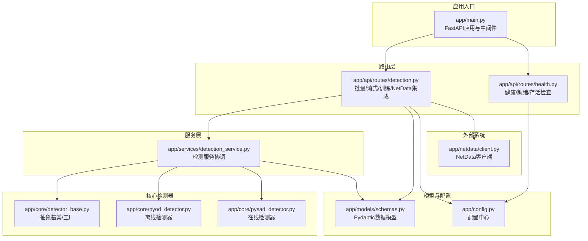
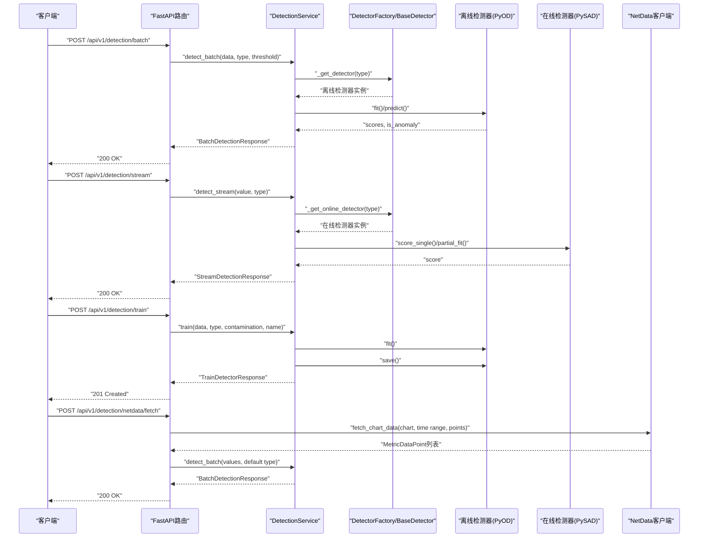
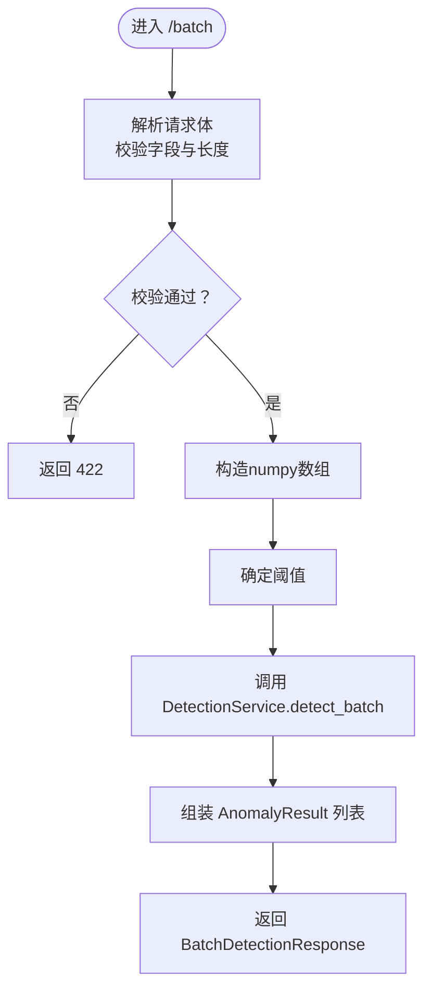
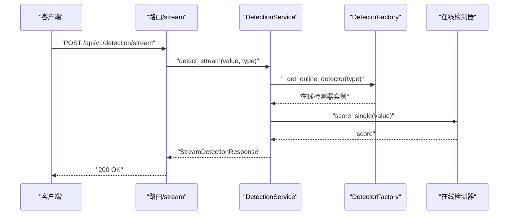
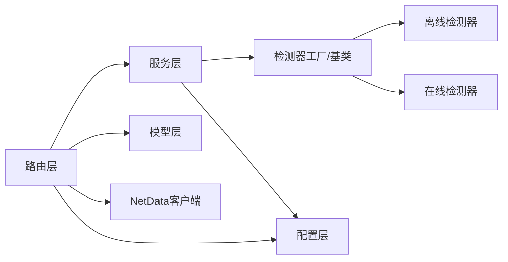

# API接口设计

<cite>
**本文引用的文件**
- [app/main.py](file://app/main.py)
- [app/api/routes/detection.py](file://app/api/routes/detection.py)
- [app/api/routes/health.py](file://app/api/routes/health.py)
- [app/models/schemas.py](file://app/models/schemas.py)
- [app/services/detection_service.py](file://app/services/detection_service.py)
- [app/config.py](file://app/config.py)
- [app/netdata/client.py](file://app/netdata/client.py)
- [app/core/detector_base.py](file://app/core/detector_base.py)
- [app/core/pyod_detector.py](file://app/core/pyod_detector.py)
- [app/core/pysad_detector.py](file://app/core/pysad_detector.py)
- [tests/test_api.py](file://tests/test_api.py)
- [README.md](file://README.md)
</cite>

## 目录
1. [简介](#简介)
2. [项目结构](#项目结构)
3. [核心组件](#核心组件)
4. [架构总览](#架构总览)
5. [详细组件分析](#详细组件分析)
6. [依赖分析](#依赖分析)
7. [性能考量](#性能考量)
8. [故障排查指南](#故障排查指南)
9. [结论](#结论)
10. [附录](#附录)

## 简介
本文件为“异常检测服务”的API接口设计与实现文档，覆盖批量异常检测、流式异常检测、检测器训练以及健康检查等RESTful端点。文档详细说明各接口的HTTP方法、URL模式、请求参数、响应格式、错误码、参数验证规则、数据格式规范、调用限制，并阐述接口版本管理、兼容性保证、性能优化与安全考虑。此外，提供Postman集合与SDK使用建议、常见问题解答。

## 项目结构
后端采用FastAPI框架，按路由、模型、服务层、核心检测器与配置分层组织；NetData客户端负责与外部监控系统对接；测试用例覆盖核心API端点。

**图示来源**
- [app/main.py:76-102](file://app/main.py#L76-L102)
- [app/api/routes/detection.py:39](file://app/api/routes/detection.py#L39)
- [app/api/routes/health.py:22](file://app/api/routes/health.py#L22)
- [app/services/detection_service.py:37](file://app/services/detection_service.py#L37)
- [app/models/schemas.py:28](file://app/models/schemas.py#L28)
- [app/config.py:28](file://app/config.py#L28)
- [app/core/detector_base.py:31](file://app/core/detector_base.py#L31)
- [app/core/pyod_detector.py:31](file://app/core/pyod_detector.py#L31)
- [app/core/pysad_detector.py:37](file://app/core/pysad_detector.py#L37)
- [app/netdata/client.py:30](file://app/netdata/client.py#L30)

**章节来源**
- [app/main.py:76-102](file://app/main.py#L76-L102)
- [README.md:24-42](file://README.md#L24-L42)

## 核心组件
- 路由层：提供批量检测、流式检测、训练检测器、NetData数据获取与检测等端点。
- 服务层：统一协调检测器实例、管理离线/在线检测器生命周期、执行检测与训练。
- 模型层：使用Pydantic定义请求/响应模型，内置字段校验与OpenAPI自动生成。
- 配置层：集中管理应用配置、算法参数、阈值、性能与日志策略。
- 检测器实现：离线（PyOD封装）与在线（PySAD封装），支持工厂注册与扩展。
- NetData客户端：异步HTTP客户端，封装NetData API数据获取与解析。

**章节来源**
- [app/api/routes/detection.py:39](file://app/api/routes/detection.py#L39)
- [app/services/detection_service.py:37](file://app/services/detection_service.py#L37)
- [app/models/schemas.py:28](file://app/models/schemas.py#L28)
- [app/config.py:28](file://app/config.py#L28)
- [app/core/detector_base.py:31](file://app/core/detector_base.py#L31)
- [app/core/pyod_detector.py:31](file://app/core/pyod_detector.py#L31)
- [app/core/pysad_detector.py:37](file://app/core/pysad_detector.py#L37)
- [app/netdata/client.py:30](file://app/netdata/client.py#L30)

## 架构总览
下图展示API请求在系统内的流转与组件交互：

**图示来源**
- [app/api/routes/detection.py:55](file://app/api/routes/detection.py#L55)
- [app/api/routes/detection.py:158](file://app/api/routes/detection.py#L158)
- [app/api/routes/detection.py:224](file://app/api/routes/detection.py#L224)
- [app/api/routes/detection.py:285](file://app/api/routes/detection.py#L285)
- [app/services/detection_service.py:76](file://app/services/detection_service.py#L76)
- [app/services/detection_service.py:120](file://app/services/detection_service.py#L120)
- [app/services/detection_service.py:154](file://app/services/detection_service.py#L154)
- [app/netdata/client.py:138](file://app/netdata/client.py#L138)

## 详细组件分析

### 健康检查接口
- 端点
  - GET /api/health：服务健康状态检查
  - GET /api/ready：就绪检查（Kubernetes就绪探针）
  - GET /api/live：存活检查（Kubernetes存活探针）
- 请求参数：无
- 响应模型：HealthResponse
  - 字段：status（字符串）、version（字符串）、detectors_loaded（字符串数组）、uptime_seconds（数值）
- 错误码：200 成功；5xx 服务异常
- 使用示例
  - curl -i http://host:port/api/health
- 说明
  - 健康检查用于容器编排与监控系统集成，ready/liveness探针便于K8s自动扩缩容与重启策略。

**章节来源**
- [app/api/routes/health.py:25](file://app/api/routes/health.py#L25)
- [app/api/routes/health.py:55](file://app/api/routes/health.py#L55)
- [app/api/routes/health.py:75](file://app/api/routes/health.py#L75)
- [app/models/schemas.py:286](file://app/models/schemas.py#L286)

### 批量异常检测接口
- 端点
  - POST /api/v1/detection/batch
- 请求体模型：BatchDetectionRequest
  - 字段
    - data：MetricDataPoint数组（长度1~10000，最少3个）
    - detector_type：离线检测器类型（isolation_forest、lof、knn）
    - threshold：异常阈值（0~1，可空，为空则使用配置）
    - return_scores：是否返回明细结果（布尔）
- 响应模型：BatchDetectionResponse
  - 字段
    - status（枚举：success/failed/partial）
    - detector_type
    - threshold
    - total_count/anomaly_count（整数）
    - processing_time_ms（毫秒）
    - results：AnomalyResult数组（可空，取决于return_scores）
- 错误码
  - 200 成功
  - 422 参数校验失败
  - 500 服务器内部错误
- 参数验证规则
  - data长度>=3（异常检测需要足够样本）
  - threshold范围[0,1]
  - dataPoint.metric_name长度[1,100]，value数值
- 数据格式规范
  - 时间戳可空，默认使用当前时间
  - labels为键值对字典，用于附加标签
- 调用限制
  - 最大数据点数量受配置max_batch_size限制
- 使用示例
  - curl -H "Content-Type: application/json" -d '{...}' http://host:port/api/v1/detection/batch
- 处理逻辑
  - 转换为numpy数组
  - 选择阈值（请求覆盖优先于配置）
  - 调用DetectionService.detect_batch
  - 构造AnomalyResult并按阈值判定等级（normal/warning/critical）

**图示来源**
- [app/api/routes/detection.py:55](file://app/api/routes/detection.py#L55)
- [app/models/schemas.py:95](file://app/models/schemas.py#L95)
- [app/models/schemas.py:238](file://app/models/schemas.py#L238)
- [app/services/detection_service.py:76](file://app/services/detection_service.py#L76)

**章节来源**
- [app/api/routes/detection.py:55](file://app/api/routes/detection.py#L55)
- [app/models/schemas.py:95](file://app/models/schemas.py#L95)
- [app/models/schemas.py:238](file://app/models/schemas.py#L238)
- [app/services/detection_service.py:76](file://app/services/detection_service.py#L76)

### 流式异常检测接口
- 端点
  - POST /api/v1/detection/stream
- 请求体模型：StreamDetectionRequest
  - 字段
    - data_point：单个MetricDataPoint
    - detector_type：在线检测器类型（half_space_trees、xstream）
    - threshold：异常阈值（0~1，可空）
- 响应模型：StreamDetectionResponse
  - 字段
    - is_anomaly（布尔）
    - anomaly_score（0~1）
    - level（normal/warning/critical）
    - detector_type
    - processing_time_ms（毫秒）
- 错误码
  - 200 成功
  - 422 参数校验失败
  - 500 服务器内部错误
- 参数验证规则
  - threshold范围[0,1]
  - data_point字段必填且符合MetricDataPoint约束
- 数据格式规范
  - 单条数据点，实时检测
- 调用限制
  - 在线检测器需预热，首次调用可能有延迟
- 使用示例
  - curl -H "Content-Type: application/json" -d '{...}' http://host:port/api/v1/detection/stream
- 处理逻辑
  - 选择阈值
  - 调用DetectionService.detect_stream
  - 根据阈值与告警阈值判定等级

**图示来源**
- [app/api/routes/detection.py:158](file://app/api/routes/detection.py#L158)
- [app/models/schemas.py:132](file://app/models/schemas.py#L132)
- [app/models/schemas.py:256](file://app/models/schemas.py#L256)
- [app/services/detection_service.py:120](file://app/services/detection_service.py#L120)

**章节来源**
- [app/api/routes/detection.py:158](file://app/api/routes/detection.py#L158)
- [app/models/schemas.py:132](file://app/models/schemas.py#L132)
- [app/models/schemas.py:256](file://app/models/schemas.py#L256)
- [app/services/detection_service.py:120](file://app/services/detection_service.py#L120)

### 训练检测器接口
- 端点
  - POST /api/v1/detection/train
- 请求体模型：TrainDetectorRequest
  - 字段
    - training_data：MetricDataPoint数组（10~100000）
    - detector_type：离线检测器类型
    - contamination：异常比例（0.01~0.5）
    - model_name：模型名称（可空）
- 响应模型：TrainDetectorResponse
  - 字段
    - status（字符串）
    - detector_type
    - model_name
    - training_samples
    - training_time_ms
- 错误码
  - 201 成功（创建模型）
  - 422 参数校验失败
  - 500 服务器内部错误
- 参数验证规则
  - training_data长度>=10
  - contamination范围[0.01,0.5]
  - model_name长度<=100
- 数据格式规范
  - 仅离线检测器可训练
- 调用限制
  - 训练耗时与数据规模相关
- 使用示例
  - curl -H "Content-Type: application/json" -d '{...}' http://host:port/api/v1/detection/train
- 处理逻辑
  - 转换为numpy数组
  - 调用DetectionService.train
  - 保存模型至本地并返回模型名

**章节来源**
- [app/api/routes/detection.py:224](file://app/api/routes/detection.py#L224)
- [app/models/schemas.py:155](file://app/models/schemas.py#L155)
- [app/models/schemas.py:273](file://app/models/schemas.py#L273)
- [app/services/detection_service.py:154](file://app/services/detection_service.py#L154)

### 从NetData获取数据并检测接口
- 端点
  - POST /api/v1/detection/netdata/fetch
- 请求体模型：NetDataFetchRequest
  - 字段
    - chart：NetData图表名称（如system.cpu）
    - after：起始时间（秒，负数表示相对当前之前的秒数）
    - before：结束时间（秒）
    - points：数据点数量（1~1000）
    - host：目标主机（可空）
- 响应模型：BatchDetectionResponse
  - 使用默认离线检测器与配置阈值
- 错误码
  - 200 成功
  - 404 未获取到数据
  - 500 服务器内部错误
- 参数验证规则
  - points范围[1,1000]
- 数据格式规范
  - 自动解析NetData响应为MetricDataPoint列表
- 调用限制
  - 受NetData API与网络延迟影响
- 使用示例
  - curl -H "Content-Type: application/json" -d '{...}' http://host:port/api/v1/detection/netdata/fetch
- 处理逻辑
  - 调用NetDataClient.fetch_chart_data
  - 转换为numpy数组并执行批量检测

**章节来源**
- [app/api/routes/detection.py:285](file://app/api/routes/detection.py#L285)
- [app/models/schemas.py:185](file://app/models/schemas.py#L185)
- [app/models/schemas.py:238](file://app/models/schemas.py#L238)
- [app/netdata/client.py:138](file://app/netdata/client.py#L138)

## 依赖分析
- 路由层依赖服务层与模型层，部分端点依赖NetData客户端。
- 服务层依赖检测器工厂与具体检测器实现（离线/在线）。
- 配置层为全系统提供阈值、算法参数与性能参数。
- 检测器实现封装第三方库（PyOD/PySAD），通过工厂注册扩展。

**图示来源**
- [app/api/routes/detection.py:39](file://app/api/routes/detection.py#L39)
- [app/services/detection_service.py:37](file://app/services/detection_service.py#L37)
- [app/core/detector_base.py:31](file://app/core/detector_base.py#L31)
- [app/core/pyod_detector.py:31](file://app/core/pyod_detector.py#L31)
- [app/core/pysad_detector.py:37](file://app/core/pysad_detector.py#L37)
- [app/config.py:28](file://app/config.py#L28)
- [app/netdata/client.py:30](file://app/netdata/client.py#L30)

**章节来源**
- [app/api/routes/detection.py:39](file://app/api/routes/detection.py#L39)
- [app/services/detection_service.py:37](file://app/services/detection_service.py#L37)
- [app/core/detector_base.py:31](file://app/core/detector_base.py#L31)
- [app/core/pyod_detector.py:31](file://app/core/pyod_detector.py#L31)
- [app/core/pysad_detector.py:37](file://app/core/pysad_detector.py#L37)
- [app/config.py:28](file://app/config.py#L28)
- [app/netdata/client.py:30](file://app/netdata/client.py#L30)

## 性能考量
- 批量检测
  - 使用numpy向量化计算，减少Python循环开销
  - 离线检测器在首次使用时自动训练，后续复用实例
  - 阈值与等级判定在服务层完成，避免重复计算
- 流式检测
  - 在线检测器需预热，建议在业务低峰期或首次部署时提供预热数据
  - 在线检测器支持增量学习（partial_fit），降低重训成本
- 网络与I/O
  - NetData客户端使用异步HTTP，提高并发能力
  - 结果缓存TTL可通过配置调整
- 资源与并发
  - 服务启动时记录启动时间，健康检查返回运行时长
  - 生产环境建议限制CORS来源，避免跨域风险

**章节来源**
- [app/services/detection_service.py:76](file://app/services/detection_service.py#L76)
- [app/services/detection_service.py:120](file://app/services/detection_service.py#L120)
- [app/netdata/client.py:138](file://app/netdata/client.py#L138)
- [app/config.py:142](file://app/config.py#L142)
- [app/main.py:109](file://app/main.py#L109)

## 故障排查指南
- 常见错误与定位
  - 422 参数校验失败：检查请求体字段类型、长度与范围
  - 500 服务器内部错误：查看服务日志，确认检测器初始化与模型加载状态
  - 404 NetData数据获取失败：确认NetData地址、端口与图表名称正确
- 健康检查
  - /api/health：确认服务版本、运行时长与已加载检测器
  - /api/ready：K8s就绪探针，确保依赖服务可用
  - /api/live：存活探针，确认进程正常
- 单元测试参考
  - 健康端点与根路径测试
  - 批量/流式/训练端点响应与校验
  - OpenAPI文档可用性

**章节来源**
- [tests/test_api.py:32](file://tests/test_api.py#L32)
- [tests/test_api.py:74](file://tests/test_api.py#L74)
- [app/api/routes/health.py:25](file://app/api/routes/health.py#L25)

## 结论
本API设计遵循REST风格，结合离线与在线两类检测器，满足离线分析与实时监控双重场景。通过Pydantic模型实现强类型与自动校验，配合工厂模式与配置中心，具备良好的扩展性与可维护性。建议生产环境启用严格的CORS与限流策略，合理设置阈值与窗口参数，并定期评估检测器性能与模型有效性。

## 附录

### 接口版本管理与兼容性
- 版本前缀：/api/v1/detection
- 兼容性策略
  - 保持现有字段与语义不变
  - 新增字段采用可选方式，避免破坏既有客户端
  - 重大变更通过新增版本端点实现平滑迁移

**章节来源**
- [app/main.py:183](file://app/main.py#L183)

### 错误响应格式
- 统一错误模型：ErrorResponse
  - 字段：error（错误类型）、message（错误详情）、detail（额外信息，可空）
- 全局异常处理器
  - 通用异常返回500，参数错误返回400

**章节来源**
- [app/main.py:145](file://app/main.py#L145)
- [app/models/schemas.py:300](file://app/models/schemas.py#L300)

### 参数验证与数据格式规范
- 请求体字段校验
  - 长度限制：data/max_batch_size、training_data、points
  - 数值范围：threshold/alert_threshold/anomaly_threshold、contamination
  - 必填项：data_point、detector_type
- 数据格式
  - 时间戳可空，默认当前时间
  - labels为键值对字典
  - 异常分数归一化至[0,1]

**章节来源**
- [app/models/schemas.py:95](file://app/models/schemas.py#L95)
- [app/models/schemas.py:155](file://app/models/schemas.py#L155)
- [app/models/schemas.py:185](file://app/models/schemas.py#L185)
- [app/core/detector_base.py:230](file://app/core/detector_base.py#L230)

### 调用限制与最佳实践
- 批量检测
  - 建议每次请求控制在合理范围内，避免超大规模批次导致内存压力
- 流式检测
  - 首次调用可能需要预热，建议在部署阶段提供历史数据
- 训练检测器
  - 建议使用代表性历史数据，合理设置contamination
- NetData集成
  - 明确图表与时间范围，避免过多数据点造成延迟

**章节来源**
- [app/config.py:142](file://app/config.py#L142)
- [app/services/detection_service.py:254](file://app/services/detection_service.py#L254)

### Postman集合与SDK使用建议
- Postman集合
  - 建议包含以下集合：健康检查、批量检测、流式检测、训练检测器、NetData获取并检测
  - 为每个集合设置环境变量：host、port、chart、points、threshold等
- SDK使用
  - 建议前端或客户端SDK封装统一的HTTP客户端，包含重试、超时与错误处理
  - 对流式检测提供轮询或WebSocket订阅（如后续扩展）

[本节为通用建议，不直接分析具体文件]

### 常见问题解答
- Q：如何选择检测器类型？
  - A：高维/大批量数据选isolation_forest；密度不均选lof；低维/小数据选knn；实时监控选half_space_trees/xstream。
- Q：如何设置阈值？
  - A：根据业务需求与历史数据分布设定，配置文件提供默认阈值与告警阈值。
- Q：如何扩展新的检测器？
  - A：实现BaseDetector子类并通过DetectorFactory.register注册，即可在路由中使用。

**章节来源**
- [README.md:33-42](file://README.md#L33-L42)
- [app/core/detector_base.py:288](file://app/core/detector_base.py#L288)