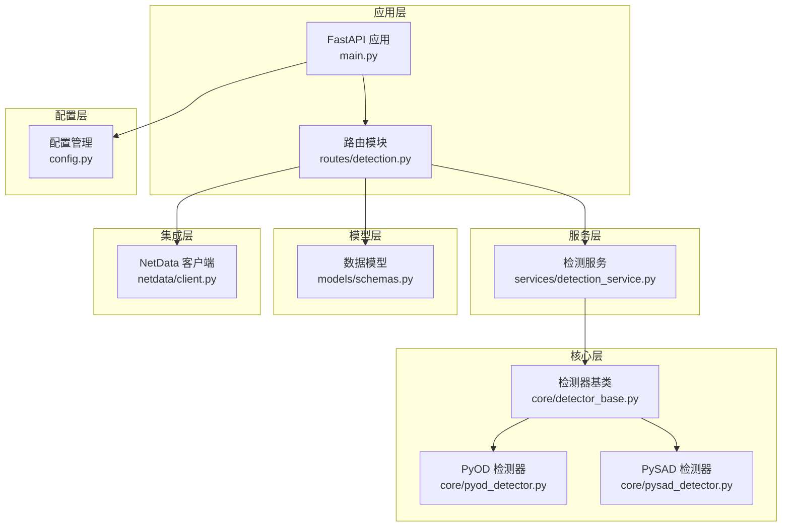
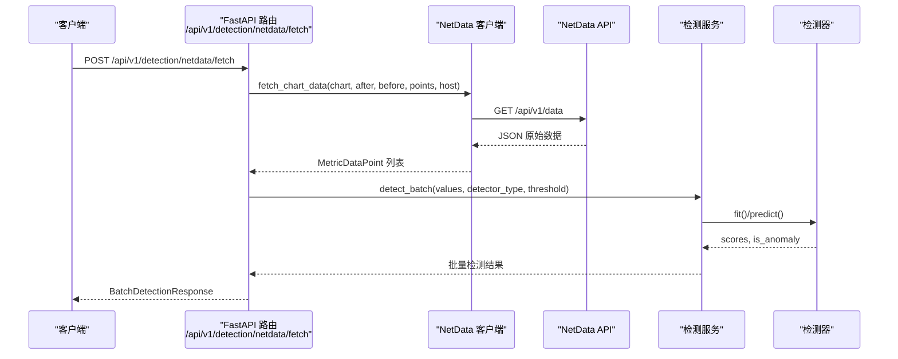
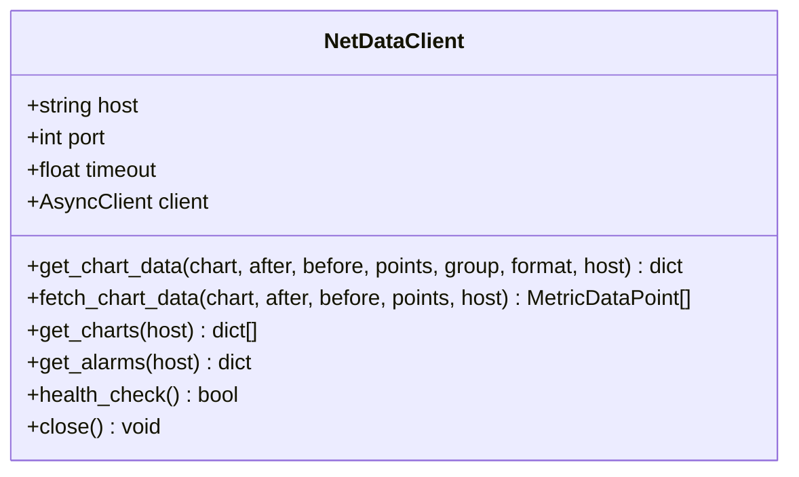
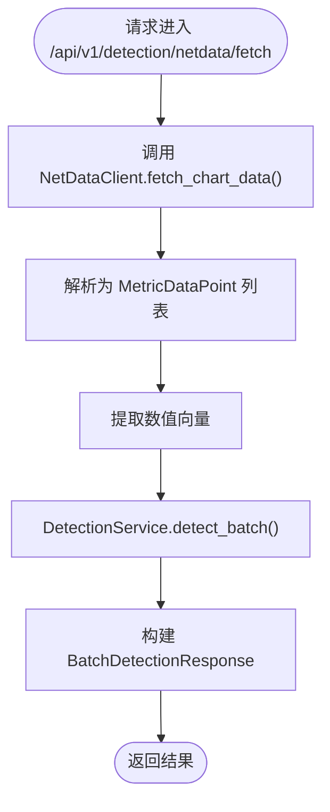
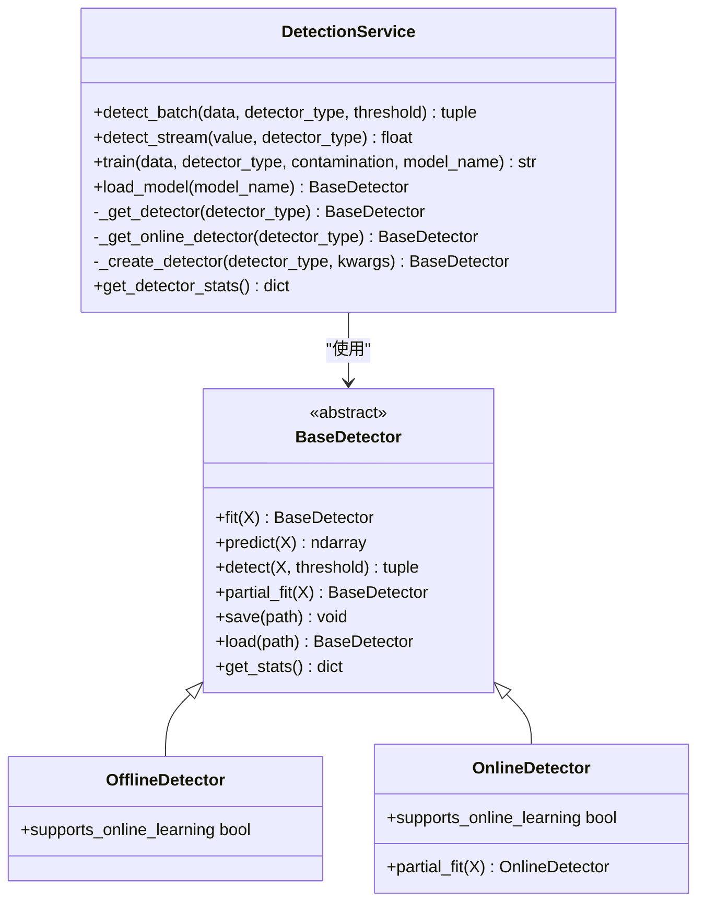
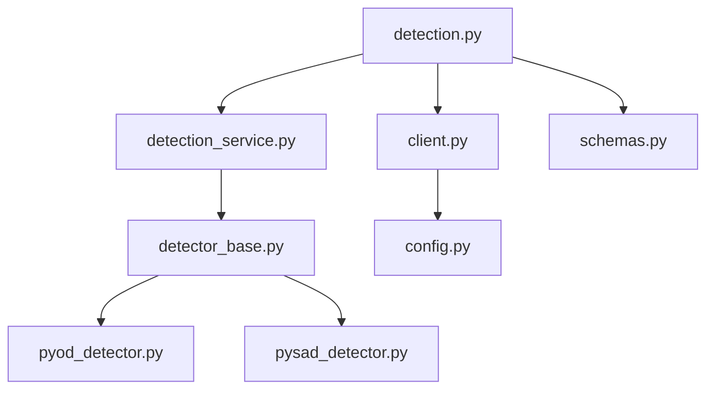

# NetData系统集成

<cite>
**本文引用的文件**
- [client.py](file://anomaly-detection-service/app/netdata/client.py)
- [main.py](file://anomaly-detection-service/app/main.py)
- [config.py](file://anomaly-detection-service/app/config.py)
- [detection_service.py](file://anomaly-detection-service/app/services/detection_service.py)
- [schemas.py](file://anomaly-detection-service/app/models/schemas.py)
- [detection.py](file://anomaly-detection-service/app/api/routes/detection.py)
- [detector_base.py](file://anomaly-detection-service/app/core/detector_base.py)
- [pyod_detector.py](file://anomaly-detection-service/app/core/pyod_detector.py)
- [pysad_detector.py](file://anomaly-detection-service/app/core/pysad_detector.py)
</cite>

## 目录
1. [简介](#简介)
2. [项目结构](#项目结构)
3. [核心组件](#核心组件)
4. [架构总览](#架构总览)
5. [详细组件分析](#详细组件分析)
6. [依赖分析](#依赖分析)
7. [性能考虑](#性能考虑)
8. [故障排查指南](#故障排查指南)
9. [结论](#结论)
10. [附录](#附录)

## 简介
本技术文档围绕 NetData 监控系统的集成实现，聚焦于与 NetData API 的数据交互机制、数据获取、预处理与结果返回的完整流程。文档详细说明了 NetData 客户端的设计架构、连接管理、数据解析与错误处理策略；阐述监控指标的获取方式、数据格式转换、时间序列处理与异常检测结果的回传机制；并提供 NetData 配置要求、网络连接优化、数据缓存策略与故障恢复方案，以及具体的 API 调用示例、数据格式说明与集成最佳实践。

## 项目结构
本项目采用分层架构组织，关键模块如下：
- 应用入口与路由：FastAPI 应用、中间件、异常处理与路由注册
- 配置管理：集中式配置加载与校验
- 模型定义：请求/响应模型与数据验证
- NetData 客户端：异步 HTTP 客户端封装与数据解析
- 检测服务：离线/在线检测器的统一调度与结果构建
- 核心检测器：基于 PyOD 与 PySAD 的检测器实现

**图示来源**
- [main.py:76-102](file://anomaly-detection-service/app/main.py#L76-L102)
- [detection.py:39-49](file://anomaly-detection-service/app/api/routes/detection.py#L39-L49)
- [detection_service.py:37-74](file://anomaly-detection-service/app/services/detection_service.py#L37-L74)
- [detector_base.py:31-62](file://anomaly-detection-service/app/core/detector_base.py#L31-L62)
- [pyod_detector.py:31-104](file://anomaly-detection-service/app/core/pyod_detector.py#L31-L104)
- [pysad_detector.py:37-133](file://anomaly-detection-service/app/core/pysad_detector.py#L37-L133)
- [client.py:30-82](file://anomaly-detection-service/app/netdata/client.py#L30-L82)
- [config.py:28-47](file://anomaly-detection-service/app/config.py#L28-L47)

**章节来源**
- [main.py:76-102](file://anomaly-detection-service/app/main.py#L76-L102)
- [config.py:28-47](file://anomaly-detection-service/app/config.py#L28-L47)

## 核心组件
- NetData 客户端：封装异步 HTTP 客户端，提供数据获取、图表列表查询、告警状态获取与健康检查能力，并将原始响应解析为结构化数据点。
- 检测服务：统一管理离线/在线检测器实例，提供批量与流式检测接口，负责阈值判断与结果构建。
- API 路由：暴露批量检测、流式检测、训练检测器与 NetData 数据获取并检测等接口。
- 数据模型：定义请求/响应模型，确保输入输出的数据一致性与可验证性。
- 检测器实现：基于 PyOD 的离线检测器（隔离森林、LOF、KNN）与基于 PySAD 的在线检测器（半空间树、xStream）。

**章节来源**
- [client.py:30-82](file://anomaly-detection-service/app/netdata/client.py#L30-L82)
- [detection_service.py:37-74](file://anomaly-detection-service/app/services/detection_service.py#L37-L74)
- [detection.py:55-152](file://anomaly-detection-service/app/api/routes/detection.py#L55-L152)
- [schemas.py:63-214](file://anomaly-detection-service/app/models/schemas.py#L63-L214)
- [detector_base.py:31-62](file://anomaly-detection-service/app/core/detector_base.py#L31-L62)
- [pyod_detector.py:31-104](file://anomaly-detection-service/app/core/pyod_detector.py#L31-L104)
- [pysad_detector.py:37-133](file://anomaly-detection-service/app/core/pysad_detector.py#L37-L133)

## 架构总览
下图展示了从 API 请求到 NetData 数据获取与异常检测的整体流程，包括数据获取、预处理与结果返回的关键步骤。

**图示来源**
- [detection.py:291-368](file://anomaly-detection-service/app/api/routes/detection.py#L291-L368)
- [client.py:138-198](file://anomaly-detection-service/app/netdata/client.py#L138-L198)
- [detection_service.py:76-118](file://anomaly-detection-service/app/services/detection_service.py#L76-L118)

## 详细组件分析

### NetData 客户端
- 设计要点
  - 异步 HTTP 客户端封装，支持超时控制与连接复用
  - 提供数据获取、图表列表查询、告警状态获取与健康检查
  - 将 NetData 原始响应解析为结构化数据点，便于后续检测
- 关键接口
  - get_chart_data：调用 /api/v1/data 获取指定图表的时间序列数据
  - fetch_chart_data：解析原始响应为 MetricDataPoint 列表
  - get_charts：获取可用图表列表
  - get_alarms：获取当前告警状态
  - health_check：服务可用性检查
- 错误处理
  - 捕获 HTTP 状态错误与请求异常，记录详细日志并向上抛出

**图示来源**
- [client.py:30-82](file://anomaly-detection-service/app/netdata/client.py#L30-L82)
- [client.py:84-137](file://anomaly-detection-service/app/netdata/client.py#L84-L137)
- [client.py:138-198](file://anomaly-detection-service/app/netdata/client.py#L138-L198)
- [client.py:200-249](file://anomaly-detection-service/app/netdata/client.py#L200-L249)
- [client.py:250-271](file://anomaly-detection-service/app/netdata/client.py#L250-L271)

**章节来源**
- [client.py:30-82](file://anomaly-detection-service/app/netdata/client.py#L30-L82)
- [client.py:84-137](file://anomaly-detection-service/app/netdata/client.py#L84-L137)
- [client.py:138-198](file://anomaly-detection-service/app/netdata/client.py#L138-L198)
- [client.py:200-249](file://anomaly-detection-service/app/netdata/client.py#L200-L249)
- [client.py:250-271](file://anomaly-detection-service/app/netdata/client.py#L250-L271)

### API 路由与数据流
- 路由职责
  - 批量检测：对一组时序数据进行离线异常检测
  - 流式检测：对单条数据进行实时异常检测
  - 训练检测器：使用历史数据训练离线检测器
  - NetData 数据获取并检测：直接从 NetData API 获取指标并进行检测
- 数据处理
  - 将 MetricDataPoint 列表转换为数值矩阵
  - 使用检测服务执行检测，按阈值构建异常等级
  - 返回标准化的响应模型

**图示来源**
- [detection.py:291-368](file://anomaly-detection-service/app/api/routes/detection.py#L291-L368)
- [detection_service.py:76-118](file://anomaly-detection-service/app/services/detection_service.py#L76-L118)

**章节来源**
- [detection.py:55-152](file://anomaly-detection-service/app/api/routes/detection.py#L55-L152)
- [detection.py:158-219](file://anomaly-detection-service/app/api/routes/detection.py#L158-L219)
- [detection.py:224-279](file://anomaly-detection-service/app/api/routes/detection.py#L224-L279)
- [detection.py:285-368](file://anomaly-detection-service/app/api/routes/detection.py#L285-L368)

### 检测服务与检测器
- 检测服务
  - 管理检测器实例池与在线检测器状态
  - 提供批量/流式检测接口，支持阈值覆盖
  - 负责模型训练、保存与加载
- 检测器实现
  - 离线检测器（PyOD）：隔离森林、LOF、KNN
  - 在线检测器（PySAD）：半空间树、xStream
  - 统一的归一化与统计信息收集

**图示来源**
- [detection_service.py:37-74](file://anomaly-detection-service/app/services/detection_service.py#L37-L74)
- [detector_base.py:31-62](file://anomaly-detection-service/app/core/detector_base.py#L31-L62)
- [detector_base.py:257-285](file://anomaly-detection-service/app/core/detector_base.py#L257-L285)
- [pyod_detector.py:31-104](file://anomaly-detection-service/app/core/pyod_detector.py#L31-L104)
- [pysad_detector.py:37-133](file://anomaly-detection-service/app/core/pysad_detector.py#L37-L133)

**章节来源**
- [detection_service.py:76-118](file://anomaly-detection-service/app/services/detection_service.py#L76-L118)
- [detection_service.py:120-152](file://anomaly-detection-service/app/services/detection_service.py#L120-L152)
- [detection_service.py:154-192](file://anomaly-detection-service/app/services/detection_service.py#L154-L192)
- [detector_base.py:112-126](file://anomaly-detection-service/app/core/detector_base.py#L112-L126)
- [pyod_detector.py:31-104](file://anomaly-detection-service/app/core/pyod_detector.py#L31-L104)
- [pysad_detector.py:37-133](file://anomaly-detection-service/app/core/pysad_detector.py#L37-L133)

### 数据模型与配置
- 数据模型
  - MetricDataPoint：单个指标数据点
  - BatchDetectionRequest/Response：批量检测请求/响应
  - StreamDetectionRequest/Response：流式检测请求/响应
  - TrainDetectorRequest/Response：训练检测器请求/响应
  - NetDataFetchRequest：从 NetData 获取数据的请求
- 配置管理
  - 集中管理应用配置，支持环境变量覆盖与类型校验
  - NetData 相关配置项：主机、端口、超时时间

**章节来源**
- [schemas.py:63-214](file://anomaly-detection-service/app/models/schemas.py#L63-L214)
- [config.py:28-47](file://anomaly-detection-service/app/config.py#L28-L47)
- [config.py:65-76](file://anomaly-detection-service/app/config.py#L65-L76)

## 依赖分析
- 组件耦合
  - API 路由依赖检测服务与 NetData 客户端
  - 检测服务依赖检测器工厂与具体检测器实现
  - NetData 客户端依赖配置与日志
- 外部依赖
  - httpx：异步 HTTP 客户端
  - loguru：日志记录
  - pydantic/pydantic-settings：配置与模型验证
  - numpy：数值计算
  - joblib：模型序列化
  - PyOD/PySAD：异常检测算法

**图示来源**
- [detection.py:36-49](file://anomaly-detection-service/app/api/routes/detection.py#L36-L49)
- [detection_service.py:24-37](file://anomaly-detection-service/app/services/detection_service.py#L24-L37)
- [detector_base.py:26-33](file://anomaly-detection-service/app/core/detector_base.py#L26-L33)
- [pyod_detector.py:24-28](file://anomaly-detection-service/app/core/pyod_detector.py#L24-L28)
- [pysad_detector.py:24-34](file://anomaly-detection-service/app/core/pysad_detector.py#L24-L34)
- [client.py:26-27](file://anomaly-detection-service/app/netdata/client.py#L26-L27)
- [schemas.py:25](file://anomaly-detection-service/app/models/schemas.py#L25)

**章节来源**
- [detection.py:36-49](file://anomaly-detection-service/app/api/routes/detection.py#L36-L49)
- [detection_service.py:24-37](file://anomaly-detection-service/app/services/detection_service.py#L24-L37)
- [detector_base.py:26-33](file://anomaly-detection-service/app/core/detector_base.py#L26-L33)
- [pyod_detector.py:24-28](file://anomaly-detection-service/app/core/pyod_detector.py#L24-L28)
- [pysad_detector.py:24-34](file://anomaly-detection-service/app/core/pysad_detector.py#L24-L34)
- [client.py:26-27](file://anomaly-detection-service/app/netdata/client.py#L26-L27)
- [schemas.py:25](file://anomaly-detection-service/app/models/schemas.py#L25)

## 性能考虑
- 连接与超时
  - 使用异步 HTTP 客户端，合理设置超时时间以避免阻塞
  - 建议根据网络状况调整 NetData API 超时参数
- 数据规模
  - 批量检测支持最大样本数量配置，避免一次性处理过多数据导致内存压力
  - 流式检测器具备在线学习能力，适合持续监控场景
- 归一化与阈值
  - 检测器输出分数需进行归一化处理，确保阈值判断一致
  - 阈值配置支持覆盖，便于针对不同指标动态调整
- 缓存与持久化
  - 检测器模型支持序列化保存与加载，减少重复训练开销
  - 可结合外部缓存（如 Redis）缓存热点检测结果（需在上层业务中实现）

[本节为通用性能建议，不直接分析具体文件]

## 故障排查指南
- 健康检查
  - 使用 health_check 接口确认 NetData 服务可达性
- 错误分类
  - HTTP 状态错误：检查 NetData API 地址与端口配置
  - 请求异常：检查网络连通性与代理设置
- 日志定位
  - API 路由与客户端均记录详细日志，便于定位问题
- 常见问题
  - 未获取到数据：确认图表名称与时间范围参数
  - 检测失败：检查输入数据有效性与检测器配置

**章节来源**
- [client.py:250-271](file://anomaly-detection-service/app/netdata/client.py#L250-L271)
- [detection.py:147-152](file://anomaly-detection-service/app/api/routes/detection.py#L147-L152)
- [detection.py:370-377](file://anomaly-detection-service/app/api/routes/detection.py#L370-L377)

## 结论
本集成方案通过 NetData 客户端与检测服务的协同，实现了从 NetData API 获取监控指标、进行异常检测并返回结构化结果的完整闭环。系统具备良好的扩展性与可维护性，支持离线与在线两种检测模式，并提供了完善的配置、日志与错误处理机制。建议在生产环境中结合缓存与限流策略，进一步提升稳定性与性能。

[本节为总结性内容，不直接分析具体文件]

## 附录

### API 调用示例与数据格式
- NetData 数据获取并检测
  - 请求体字段：chart、after、before、points、host
  - 响应体字段：status、detector_type、threshold、total_count、anomaly_count、processing_time_ms、results
- 批量检测
  - 请求体字段：data（MetricDataPoint 列表）、detector_type、threshold、return_scores
  - 响应体字段：同上
- 流式检测
  - 请求体字段：data_point（MetricDataPoint）、detector_type、threshold
  - 响应体字段：is_anomaly、anomaly_score、level、detector_type、processing_time_ms
- 训练检测器
  - 请求体字段：training_data（MetricDataPoint 列表）、detector_type、contamination、model_name
  - 响应体字段：status、detector_type、model_name、training_samples、training_time_ms

**章节来源**
- [detection.py:291-368](file://anomaly-detection-service/app/api/routes/detection.py#L291-L368)
- [detection.py:55-152](file://anomaly-detection-service/app/api/routes/detection.py#L55-L152)
- [detection.py:158-219](file://anomaly-detection-service/app/api/routes/detection.py#L158-L219)
- [detection.py:224-279](file://anomaly-detection-service/app/api/routes/detection.py#L224-L279)
- [schemas.py:185-214](file://anomaly-detection-service/app/models/schemas.py#L185-L214)
- [schemas.py:95-153](file://anomaly-detection-service/app/models/schemas.py#L95-L153)
- [schemas.py:132-153](file://anomaly-detection-service/app/models/schemas.py#L132-L153)
- [schemas.py:155-183](file://anomaly-detection-service/app/models/schemas.py#L155-L183)

### 集成最佳实践
- 配置管理
  - 使用环境变量覆盖默认配置，确保不同环境的一致性
- 网络优化
  - 合理设置超时与重试策略，避免阻塞影响整体性能
- 数据处理
  - 在检测前进行数据有效性校验，确保输入合法
- 结果回传
  - 使用标准化响应模型，便于前端与下游系统消费
- 故障恢复
  - 健康检查与日志记录相结合，快速定位并恢复服务

**章节来源**
- [config.py:28-47](file://anomaly-detection-service/app/config.py#L28-L47)
- [main.py:145-172](file://anomaly-detection-service/app/main.py#L145-L172)
- [client.py:250-271](file://anomaly-detection-service/app/netdata/client.py#L250-L271)