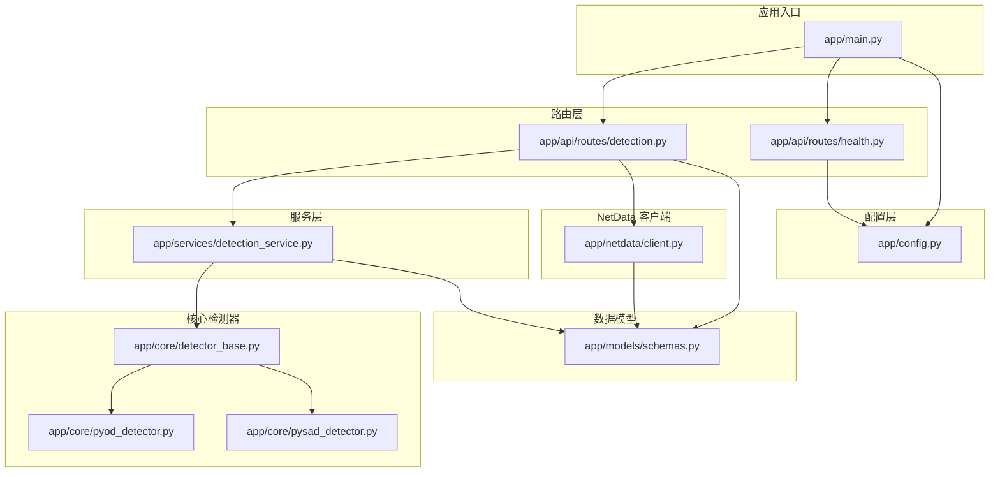
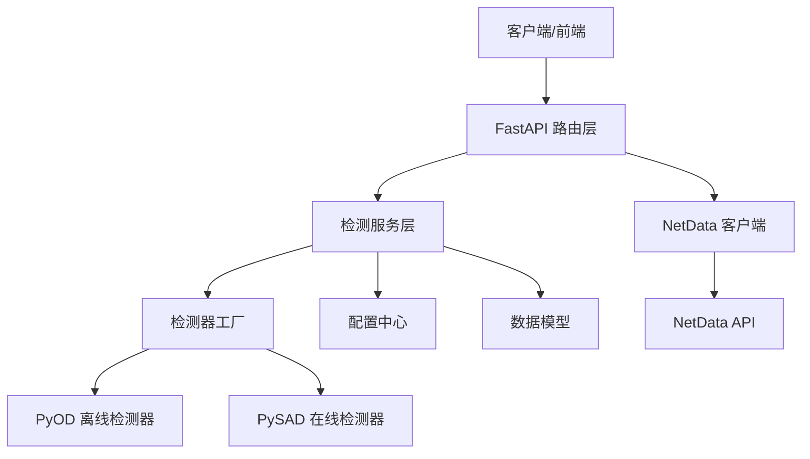
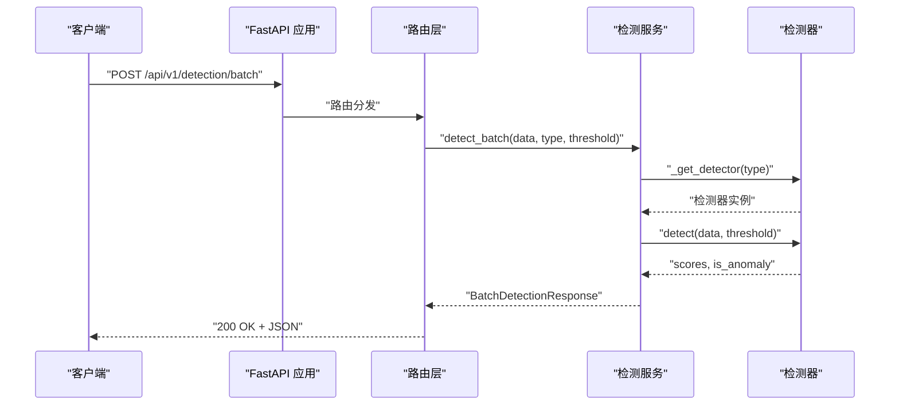
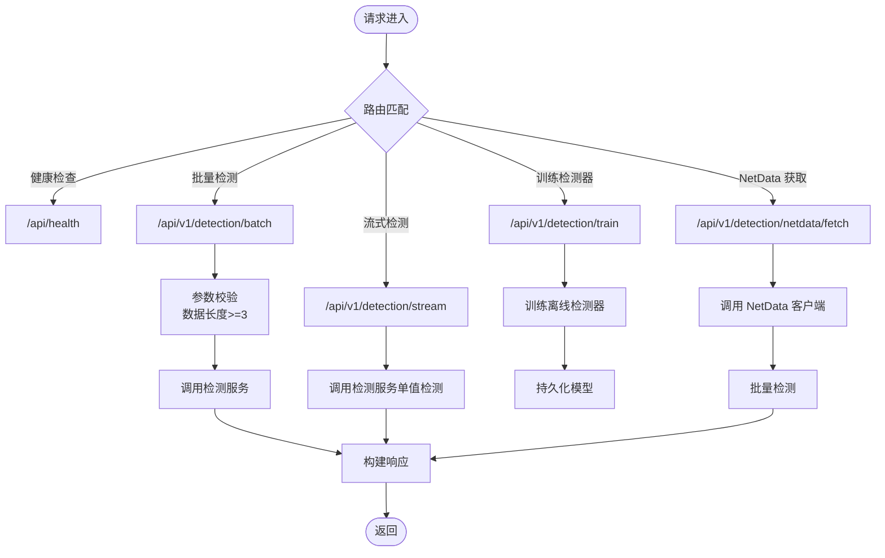
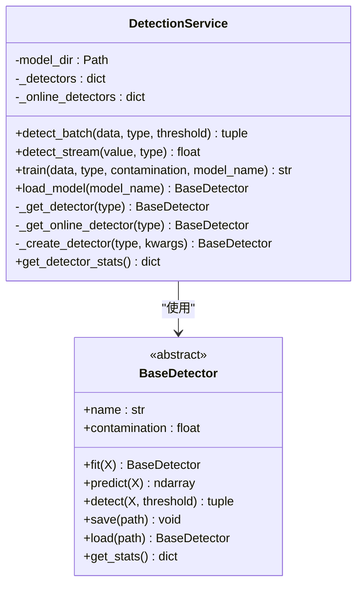
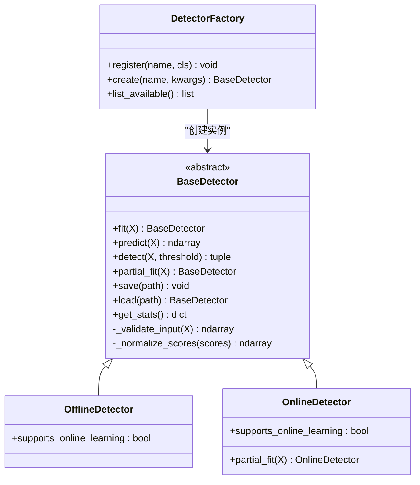
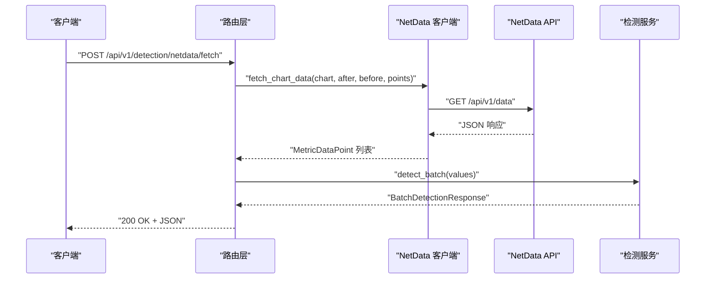
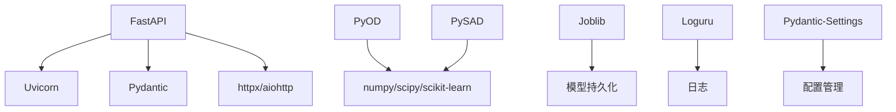

# 异常检测服务

<cite>
**本文引用的文件**
- [app/main.py](file://anomaly-detection-service/app/main.py)
- [app/config.py](file://anomaly-detection-service/app/config.py)
- [app/api/routes/detection.py](file://anomaly-detection-service/app/api/routes/detection.py)
- [app/api/routes/health.py](file://anomaly-detection-service/app/api/routes/health.py)
- [app/services/detection_service.py](file://anomaly-detection-service/app/services/detection_service.py)
- [app/core/detector_base.py](file://anomaly-detection-service/app/core/detector_base.py)
- [app/core/pyod_detector.py](file://anomaly-detection-service/app/core/pyod_detector.py)
- [app/core/pysad_detector.py](file://anomaly-detection-service/app/core/pysad_detector.py)
- [app/netdata/client.py](file://anomaly-detection-service/app/netdata/client.py)
- [app/models/schemas.py](file://anomaly-detection-service/app/models/schemas.py)
- [tests/test_api.py](file://anomaly-detection-service/tests/test_api.py)
- [Dockerfile](file://anomaly-detection-service/Dockerfile)
- [requirements.txt](file://anomaly-detection-service/requirements.txt)
- [README.md](file://anomaly-detection-service/README.md)
</cite>

## 目录
1. [简介](#简介)
2. [项目结构](#项目结构)
3. [核心组件](#核心组件)
4. [架构总览](#架构总览)
5. [详细组件分析](#详细组件分析)
6. [依赖分析](#依赖分析)
7. [性能考虑](#性能考虑)
8. [故障排除指南](#故障排除指南)
9. [结论](#结论)
10. [附录](#附录)

## 简介
本项目是一个基于 FastAPI 的微服务，提供批量异常检测与流式异常检测能力，并与 NetData 监控系统集成，支持直接从 NetData API 获取指标数据进行检测。系统采用模块化设计，通过检测器工厂模式统一管理 PyOD 与 PySAD 的检测器实现，具备良好的扩展性与可维护性。

## 项目结构
项目采用按功能域分层的组织方式：
- app/main.py：应用入口与生命周期管理、中间件与异常处理、路由注册
- app/config.py：集中配置管理，支持环境变量覆盖与类型安全
- app/api/routes/*：API 路由层，负责请求处理与响应封装
- app/services/*：业务服务层，协调检测器与数据处理
- app/core/*：检测器抽象与具体实现（PyOD、PySAD）
- app/netdata/*：NetData 客户端，负责数据获取与预处理
- app/models/schemas.py：Pydantic 数据模型，定义请求/响应结构
- tests/*：API 与检测器单元测试
- Dockerfile/requirements.txt：容器化与依赖管理

**图表来源**
- [app/main.py:1-217](file://anomaly-detection-service/app/main.py#L1-L217)
- [app/config.py:1-183](file://anomaly-detection-service/app/config.py#L1-L183)
- [app/api/routes/detection.py:1-378](file://anomaly-detection-service/app/api/routes/detection.py#L1-L378)
- [app/api/routes/health.py:1-88](file://anomaly-detection-service/app/api/routes/health.py#L1-L88)
- [app/services/detection_service.py:1-334](file://anomaly-detection-service/app/services/detection_service.py#L1-L334)
- [app/core/detector_base.py:1-339](file://anomaly-detection-service/app/core/detector_base.py#L1-L339)
- [app/core/pyod_detector.py:1-287](file://anomaly-detection-service/app/core/pyod_detector.py#L1-L287)
- [app/core/pysad_detector.py:1-358](file://anomaly-detection-service/app/core/pysad_detector.py#L1-L358)
- [app/netdata/client.py:1-301](file://anomaly-detection-service/app/netdata/client.py#L1-L301)
- [app/models/schemas.py:1-329](file://anomaly-detection-service/app/models/schemas.py#L1-L329)

**章节来源**
- [app/main.py:1-217](file://anomaly-detection-service/app/main.py#L1-L217)
- [app/config.py:1-183](file://anomaly-detection-service/app/config.py#L1-L183)
- [app/api/routes/detection.py:1-378](file://anomaly-detection-service/app/api/routes/detection.py#L1-L378)
- [app/api/routes/health.py:1-88](file://anomaly-detection-service/app/api/routes/health.py#L1-L88)
- [app/services/detection_service.py:1-334](file://anomaly-detection-service/app/services/detection_service.py#L1-L334)
- [app/core/detector_base.py:1-339](file://anomaly-detection-service/app/core/detector_base.py#L1-L339)
- [app/core/pyod_detector.py:1-287](file://anomaly-detection-service/app/core/pyod_detector.py#L1-L287)
- [app/core/pysad_detector.py:1-358](file://anomaly-detection-service/app/core/pysad_detector.py#L1-L358)
- [app/netdata/client.py:1-301](file://anomaly-detection-service/app/netdata/client.py#L1-L301)
- [app/models/schemas.py:1-329](file://anomaly-detection-service/app/models/schemas.py#L1-L329)

## 核心组件
- 应用入口与生命周期：定义 FastAPI 实例、CORS 中间件、请求日志中间件、全局异常处理、路由注册与服务启动/关闭逻辑
- 配置管理：集中管理应用、服务、NetData、数据库、Redis、检测器参数、阈值、性能与日志等配置
- 路由层：提供健康检查、批量检测、流式检测、训练检测器、从 NetData 获取并检测等 API
- 服务层：统一检测服务，管理检测器实例池、在线检测器预热、模型训练与持久化
- 检测器抽象与实现：抽象基类定义统一接口；PyOD 实现离线检测器；PySAD 实现在线检测器
- NetData 客户端：异步 HTTP 客户端，封装 NetData API，支持数据获取、图表查询、告警状态获取与健康检查
- 数据模型：使用 Pydantic 定义请求/响应模型，包含枚举类型与字段校验

**章节来源**
- [app/main.py:76-217](file://anomaly-detection-service/app/main.py#L76-L217)
- [app/config.py:28-183](file://anomaly-detection-service/app/config.py#L28-L183)
- [app/api/routes/detection.py:39-378](file://anomaly-detection-service/app/api/routes/detection.py#L39-L378)
- [app/api/routes/health.py:22-88](file://anomaly-detection-service/app/api/routes/health.py#L22-L88)
- [app/services/detection_service.py:37-334](file://anomaly-detection-service/app/services/detection_service.py#L37-L334)
- [app/core/detector_base.py:31-339](file://anomaly-detection-service/app/core/detector_base.py#L31-L339)
- [app/core/pyod_detector.py:31-287](file://anomaly-detection-service/app/core/pyod_detector.py#L31-L287)
- [app/core/pysad_detector.py:37-358](file://anomaly-detection-service/app/core/pysad_detector.py#L37-L358)
- [app/netdata/client.py:30-301](file://anomaly-detection-service/app/netdata/client.py#L30-L301)
- [app/models/schemas.py:28-329](file://anomaly-detection-service/app/models/schemas.py#L28-L329)

## 架构总览
系统采用“路由层-服务层-检测器层-外部系统”的分层架构，通过依赖注入与工厂模式解耦各层，支持离线与在线两种检测模式，并与 NetData 实时监控系统集成。

**图表来源**
- [app/main.py:107-187](file://anomaly-detection-service/app/main.py#L107-L187)
- [app/api/routes/detection.py:41-49](file://anomaly-detection-service/app/api/routes/detection.py#L41-L49)
- [app/services/detection_service.py:254-314](file://anomaly-detection-service/app/services/detection_service.py#L254-L314)
- [app/core/detector_base.py:288-339](file://anomaly-detection-service/app/core/detector_base.py#L288-L339)
- [app/netdata/client.py:66-82](file://anomaly-detection-service/app/netdata/client.py#L66-L82)

## 详细组件分析

### 应用入口与生命周期
- 生命周期管理：启动阶段记录启动信息、配置日志、预加载默认检测器；关闭阶段预留模型持久化位置
- 中间件：CORS 允许跨域访问；HTTP 请求日志中间件记录请求与响应耗时
- 异常处理：全局异常捕获返回统一 JSON；ValueError 映射为 400
- 路由注册：健康检查与异常检测路由，根路径返回服务信息
- 启动方式：本地开发使用 uvicorn，生产使用 gunicorn + uvicorn worker

**图表来源**
- [app/main.py:177-187](file://anomaly-detection-service/app/main.py#L177-L187)
- [app/api/routes/detection.py:62-146](file://anomaly-detection-service/app/api/routes/detection.py#L62-L146)
- [app/services/detection_service.py:76-118](file://anomaly-detection-service/app/services/detection_service.py#L76-L118)

**章节来源**
- [app/main.py:32-71](file://anomaly-detection-service/app/main.py#L32-L71)
- [app/main.py:107-158](file://anomaly-detection-service/app/main.py#L107-L158)
- [app/main.py:177-201](file://anomaly-detection-service/app/main.py#L177-L201)
- [app/main.py:207-217](file://anomaly-detection-service/app/main.py#L207-L217)

### 配置管理
- 配置类 Settings：集中管理应用、服务、NetData、数据库、Redis、检测器参数、阈值、性能与日志等
- 环境变量覆盖：.env 文件与环境变量优先级
- 类型验证：端口范围、阈值范围、参数范围等
- 连接 URL：自动生成 MySQL 与 Redis 连接字符串

**章节来源**
- [app/config.py:28-183](file://anomaly-detection-service/app/config.py#L28-L183)

### 路由层（异常检测与健康检查）
- 健康检查：/api/health、/api/ready、/api/live
- 批量检测：/api/v1/detection/batch，支持离线检测器（isolation_forest、lof、knn）
- 流式检测：/api/v1/detection/stream，支持在线检测器（half_space_trees、xstream）
- 训练检测器：/api/v1/detection/train，支持离线检测器训练与模型持久化
- NetData 集成：/api/v1/detection/netdata/fetch，直接从 NetData 获取数据并检测

**图表来源**
- [app/api/routes/detection.py:55-378](file://anomaly-detection-service/app/api/routes/detection.py#L55-L378)
- [app/api/routes/health.py:25-88](file://anomaly-detection-service/app/api/routes/health.py#L25-L88)

**章节来源**
- [app/api/routes/detection.py:39-378](file://anomaly-detection-service/app/api/routes/detection.py#L39-L378)
- [app/api/routes/health.py:22-88](file://anomaly-detection-service/app/api/routes/health.py#L22-L88)

### 服务层（检测服务）
- 检测器实例池：离线检测器按类型缓存，流式检测器每种类型仅保留一个实例
- 在线检测器预热：使用随机数据初始化状态
- 检测流程：规范化参数、获取/创建检测器、训练（未训练时）、执行检测、统计耗时
- 训练与持久化：生成模型名、fit、保存至 models 目录
- 工厂创建：根据类型创建对应检测器，支持扩展

**图表来源**
- [app/services/detection_service.py:37-334](file://anomaly-detection-service/app/services/detection_service.py#L37-L334)
- [app/core/detector_base.py:31-201](file://anomaly-detection-service/app/core/detector_base.py#L31-L201)

**章节来源**
- [app/services/detection_service.py:57-334](file://anomaly-detection-service/app/services/detection_service.py#L57-L334)

### 检测器抽象与工厂模式
- 抽象基类 BaseDetector：定义统一接口（fit、predict、detect、partial_fit、save/load、stats），提供输入验证与分数归一化
- 离线检测器基类 OfflineDetector：不支持在线学习
- 在线检测器基类 OnlineDetector：支持在线学习（partial_fit）
- 工厂类 DetectorFactory：注册与创建检测器，支持扩展新检测器类型

**图表来源**
- [app/core/detector_base.py:31-339](file://anomaly-detection-service/app/core/detector_base.py#L31-L339)

**章节来源**
- [app/core/detector_base.py:31-339](file://anomaly-detection-service/app/core/detector_base.py#L31-L339)

### PyOD 离线检测器实现
- IsolationForestDetector：隔离森林，适合高维数据，速度快
- LOFDetector：局部异常因子，适合密度不均数据
- KNNDetector：K-近邻，适合低维数据
- 统一归一化：将 PyOD 返回的分数范围映射到 [0,1]

**章节来源**
- [app/core/pyod_detector.py:31-287](file://anomaly-detection-service/app/core/pyod_detector.py#L31-L287)

### PySAD 在线检测器实现
- HalfSpaceTreesDetector：半空间树，真正的流式检测，低延迟，需预热
- xStreamDetector：xStream，适合高维流式数据，支持在线学习
- 分数归一化：使用 Sigmoid 将任意范围分数映射到 (0,1)

**章节来源**
- [app/core/pysad_detector.py:37-358](file://anomaly-detection-service/app/core/pysad_detector.py#L37-L358)

### NetData 客户端与集成
- 异步 HTTP 客户端：支持健康检查、获取图表数据、获取图表列表、获取告警状态
- 数据解析：将 NetData 响应转换为 MetricDataPoint 列表
- 集成点：/api/v1/detection/netdata/fetch 直接从 NetData 获取并检测

**图表来源**
- [app/api/routes/detection.py:291-378](file://anomaly-detection-service/app/api/routes/detection.py#L291-L378)
- [app/netdata/client.py:138-198](file://anomaly-detection-service/app/netdata/client.py#L138-L198)

**章节来源**
- [app/netdata/client.py:30-301](file://anomaly-detection-service/app/netdata/client.py#L30-L301)
- [app/api/routes/detection.py:285-378](file://anomaly-detection-service/app/api/routes/detection.py#L285-L378)

### 数据模型与 API 文档
- 枚举类型：DetectorType、AnomalyLevel、DetectionStatus
- 请求模型：MetricDataPoint、BatchDetectionRequest、StreamDetectionRequest、TrainDetectorRequest、NetDataFetchRequest
- 响应模型：AnomalyResult、BatchDetectionResponse、StreamDetectionResponse、TrainDetectorResponse、HealthResponse、ErrorResponse
- 自动生成 OpenAPI 文档：FastAPI 自动根据 Pydantic 模型生成接口文档

**章节来源**
- [app/models/schemas.py:28-329](file://anomaly-detection-service/app/models/schemas.py#L28-L329)

## 依赖分析
- Web 框架：FastAPI、Uvicorn
- HTTP 客户端：httpx、aiohttp
- 数据处理：numpy、pandas、scipy
- 异常检测：PyOD、PySAD
- 机器学习工具：scikit-learn、joblib
- 日志：loguru
- 配置管理：pydantic-settings、python-dotenv、pyyaml
- 测试：pytest、pytest-asyncio、pytest-cov
- 部署：gunicorn

**图表来源**
- [requirements.txt:20-94](file://anomaly-detection-service/requirements.txt#L20-L94)

**章节来源**
- [requirements.txt:17-94](file://anomaly-detection-service/requirements.txt#L17-L94)

## 性能考虑
- 批量检测性能
  - 使用并行计算（n_jobs=-1）提升 PyOD 训练速度
  - 控制最大批量大小（max_batch_size）避免内存压力
  - 使用 LRU 缓存与实例池减少重复初始化开销
- 流式检测性能
  - 在线检测器预热使用小批量数据，降低首次检测延迟
  - 使用滑动窗口控制内存占用（online_window_size）
  - 分数归一化采用高效函数（Min-Max 或 Sigmoid）
- I/O 与网络
  - NetData 客户端使用异步 HTTP 客户端，提高并发能力
  - 合理设置超时时间（netdata_timeout）与重试策略
- 部署与资源
  - 生产环境使用 gunicorn + uvicorn worker，合理设置 workers 数量
  - 使用非 root 用户运行，确保安全

[本节提供通用指导，无需特定文件引用]

## 故障排除指南
- 健康检查
  - /api/health：确认服务运行状态与运行时长
  - /api/ready：确认依赖服务（MySQL、Redis、NetData）可达
  - /api/live：确认进程存活
- 常见错误
  - 参数校验失败：检查请求体字段类型与范围（如数据点数量、阈值范围）
  - 检测器未训练：离线检测器首次使用会自动训练，确保数据量充足
  - NetData 连接失败：检查 netdata_host、netdata_port、netdata_timeout 配置
  - PySAD 未安装：若使用在线检测器，需安装 pysad==0.1.1
- 日志与调试
  - 启用 debug 模式输出详细日志
  - 查看日志文件（log_file）定位异常
  - 使用 /api/docs 查看接口文档与示例

**章节来源**
- [app/api/routes/health.py:25-88](file://anomaly-detection-service/app/api/routes/health.py#L25-L88)
- [app/api/routes/detection.py:147-152](file://anomaly-detection-service/app/api/routes/detection.py#L147-L152)
- [app/netdata/client.py:131-137](file://anomaly-detection-service/app/netdata/client.py#L131-L137)
- [app/core/pysad_detector.py:28-34](file://anomaly-detection-service/app/core/pysad_detector.py#L28-L34)

## 结论
本项目通过清晰的分层架构与工厂模式，实现了对 PyOD 与 PySAD 检测器的统一接入，提供了批量与流式两种检测模式，并与 NetData 实时监控系统无缝集成。配置中心与类型安全的数据模型保证了系统的可维护性与可扩展性。建议在生产环境中结合性能参数与部署策略进行调优，并持续完善依赖服务的健康检查与容错机制。

[本节为总结性内容，无需特定文件引用]

## 附录

### API 使用示例（路径指引）
- 健康检查
  - GET /api/health
  - GET /api/ready
  - GET /api/live
- 批量检测
  - POST /api/v1/detection/batch
  - 请求体：BatchDetectionRequest
  - 响应体：BatchDetectionResponse
- 流式检测
  - POST /api/v1/detection/stream
  - 请求体：StreamDetectionRequest
  - 响应体：StreamDetectionResponse
- 训练检测器
  - POST /api/v1/detection/train
  - 请求体：TrainDetectorRequest
  - 响应体：TrainDetectorResponse
- NetData 数据获取并检测
  - POST /api/v1/detection/netdata/fetch
  - 请求体：NetDataFetchRequest
  - 响应体：BatchDetectionResponse

**章节来源**
- [app/api/routes/detection.py:55-378](file://anomaly-detection-service/app/api/routes/detection.py#L55-L378)
- [app/api/routes/health.py:25-88](file://anomaly-detection-service/app/api/routes/health.py#L25-L88)
- [app/models/schemas.py:95-329](file://anomaly-detection-service/app/models/schemas.py#L95-L329)

### 错误处理策略
- 全局异常：捕获未处理异常，返回统一 JSON，包含错误类型与消息
- 参数错误：捕获 ValueError，返回 400 与错误信息
- HTTP 异常：捕获 HTTPStatusError 与 RequestError，记录错误并抛出
- 检测器异常：捕获检测器内部异常，包装为 HTTPException

**章节来源**
- [app/main.py:145-172](file://anomaly-detection-service/app/main.py#L145-L172)
- [app/netdata/client.py:131-137](file://anomaly-detection-service/app/netdata/client.py#L131-L137)
- [app/api/routes/detection.py:147-152](file://anomaly-detection-service/app/api/routes/detection.py#L147-L152)

### 容器化与部署
- Docker 镜像：Python 3.11 slim，多阶段构建，非 root 用户运行
- 健康检查：HEALTHCHECK 指向 /api/health
- 生产启动：gunicorn + uvicorn worker，配置 workers、timeout、keep-alive

**章节来源**
- [Dockerfile:15-95](file://anomaly-detection-service/Dockerfile#L15-L95)

### 测试与验证
- API 测试：覆盖健康检查、批量检测、流式检测、训练检测器、OpenAPI 文档
- 测试客户端：TestClient，支持同步与异步测试

**章节来源**
- [tests/test_api.py:1-172](file://anomaly-detection-service/tests/test_api.py#L1-L172)