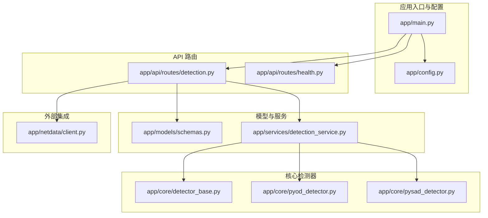
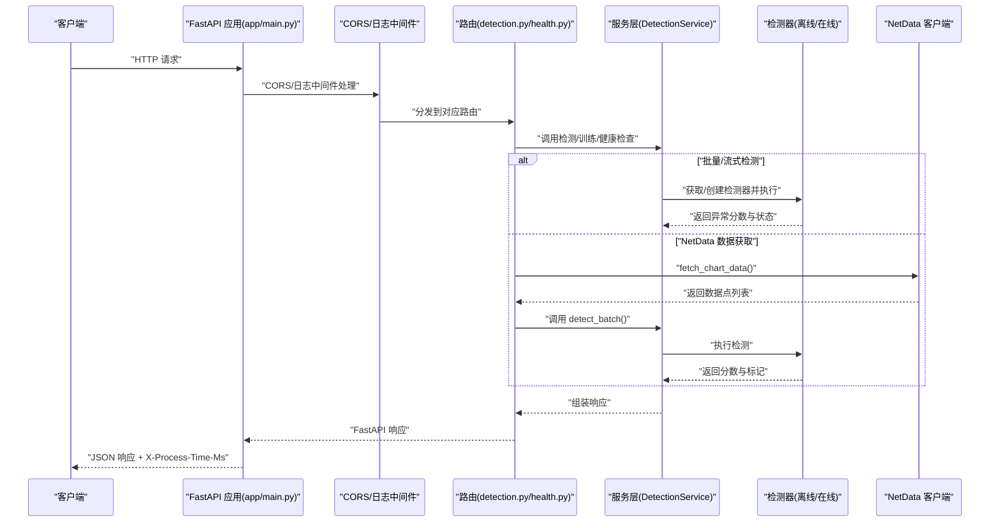
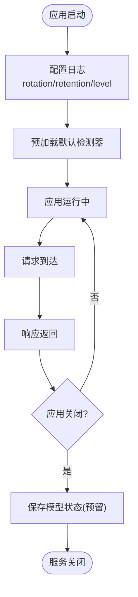
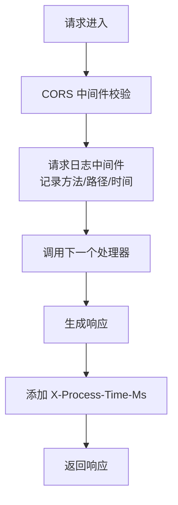
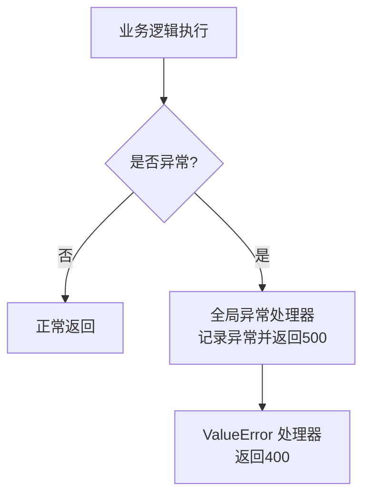
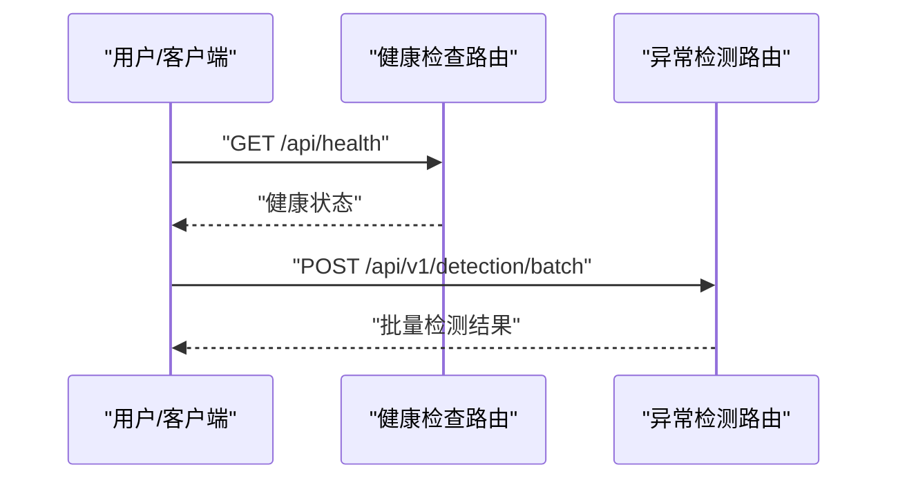
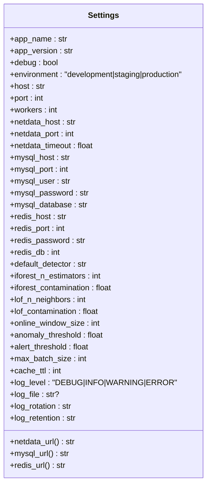
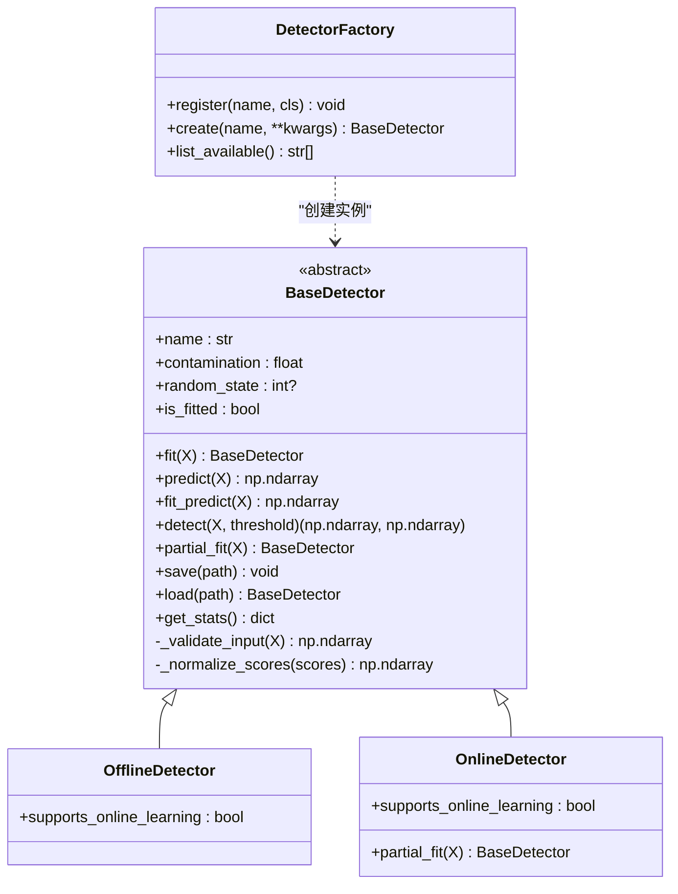
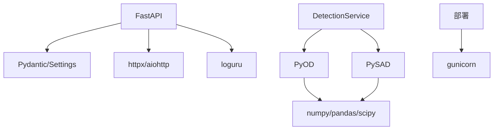

# 服务架构设计

<cite>
**本文引用的文件**
- [app/main.py](file://anomaly-detection-service/app/main.py)
- [app/config.py](file://anomaly-detection-service/app/config.py)
- [app/api/routes/detection.py](file://anomaly-detection-service/app/api/routes/detection.py)
- [app/api/routes/health.py](file://anomaly-detection-service/app/api/routes/health.py)
- [app/models/schemas.py](file://anomaly-detection-service/app/models/schemas.py)
- [app/services/detection_service.py](file://anomaly-detection-service/app/services/detection_service.py)
- [app/netdata/client.py](file://anomaly-detection-service/app/netdata/client.py)
- [app/core/detector_base.py](file://anomaly-detection-service/app/core/detector_base.py)
- [app/core/pyod_detector.py](file://anomaly-detection-service/app/core/pyod_detector.py)
- [app/core/pysad_detector.py](file://anomaly-detection-service/app/core/pysad_detector.py)
- [requirements.txt](file://anomaly-detection-service/requirements.txt)
- [pyproject.toml](file://anomaly-detection-service/pyproject.toml)
- [Dockerfile](file://anomaly-detection-service/Dockerfile)
- [README.md](file://anomaly-detection-service/README.md)
</cite>

## 目录
1. [简介](#简介)
2. [项目结构](#项目结构)
3. [核心组件](#核心组件)
4. [架构总览](#架构总览)
5. [详细组件分析](#详细组件分析)
6. [依赖分析](#依赖分析)
7. [性能考虑](#性能考虑)
8. [故障排除指南](#故障排除指南)
9. [结论](#结论)
10. [附录](#附录)

## 简介
本技术文档围绕基于 FastAPI 的异常检测微服务展开，系统性阐述应用实例创建、生命周期管理、中间件与异常处理机制、CORS 跨域配置、请求日志中间件、全局异常处理器、应用启动流程、资源管理与优雅关闭等关键架构特性。文档还提供配置管理最佳实践、性能优化建议与故障排除方法，并给出部署配置指南与具体代码示例路径。

## 项目结构
该服务采用按功能分层的组织方式：
- 应用入口与配置：app/main.py、app/config.py
- API 路由：app/api/routes/detection.py、app/api/routes/health.py
- 数据模型：app/models/schemas.py
- 业务服务：app/services/detection_service.py
- 第三方集成：app/netdata/client.py
- 检测器实现：app/core/detector_base.py、app/core/pyod_detector.py、app/core/pysad_detector.py
- 依赖与构建：requirements.txt、pyproject.toml、Dockerfile、README.md

**图表来源**
- [app/main.py:1-217](file://anomaly-detection-service/app/main.py#L1-L217)
- [app/config.py:1-183](file://anomaly-detection-service/app/config.py#L1-L183)
- [app/api/routes/detection.py:1-378](file://anomaly-detection-service/app/api/routes/detection.py#L1-L378)
- [app/api/routes/health.py:1-88](file://anomaly-detection-service/app/api/routes/health.py#L1-L88)
- [app/models/schemas.py:1-329](file://anomaly-detection-service/app/models/schemas.py#L1-L329)
- [app/services/detection_service.py:1-334](file://anomaly-detection-service/app/services/detection_service.py#L1-L334)
- [app/core/detector_base.py:1-339](file://anomaly-detection-service/app/core/detector_base.py#L1-L339)
- [app/core/pyod_detector.py:1-287](file://anomaly-detection-service/app/core/pyod_detector.py#L1-L287)
- [app/core/pysad_detector.py:1-358](file://anomaly-detection-service/app/core/pysad_detector.py#L1-L358)
- [app/netdata/client.py:1-301](file://anomaly-detection-service/app/netdata/client.py#L1-L301)

**章节来源**
- [app/main.py:1-217](file://anomaly-detection-service/app/main.py#L1-L217)
- [app/config.py:1-183](file://anomaly-detection-service/app/config.py#L1-L183)
- [README.md:1-42](file://anomaly-detection-service/README.md#L1-L42)

## 核心组件
- 应用实例与生命周期：通过 lifespan 管理启动与关闭阶段，集中初始化日志、预加载默认检测器、记录启动时间等。
- 中间件体系：CORS 跨域中间件与自定义请求日志中间件，统一处理跨域与请求耗时统计。
- 异常处理：全局异常处理器与特定异常（如 ValueError）处理器，保证一致的错误响应格式。
- 路由注册：健康检查与异常检测相关路由，前缀与标签清晰，便于 API 文档生成。
- 配置管理：基于 Pydantic Settings 的类型安全配置，支持环境变量覆盖与默认值。
- 服务层：DetectionService 统一封装离线/在线检测器实例池、训练与加载、阈值判定与结果封装。
- 检测器实现：离线（PyOD）与在线（PySAD）两类检测器，统一抽象基类与工厂模式。
- NetData 集成：异步 HTTP 客户端封装，支持数据拉取、图表查询与健康检查。

**章节来源**
- [app/main.py:32-102](file://anomaly-detection-service/app/main.py#L32-L102)
- [app/main.py:109-139](file://anomaly-detection-service/app/main.py#L109-L139)
- [app/main.py:145-171](file://anomaly-detection-service/app/main.py#L145-L171)
- [app/main.py:177-201](file://anomaly-detection-service/app/main.py#L177-L201)
- [app/config.py:28-183](file://anomaly-detection-service/app/config.py#L28-L183)
- [app/services/detection_service.py:37-334](file://anomaly-detection-service/app/services/detection_service.py#L37-L334)
- [app/core/detector_base.py:31-339](file://anomaly-detection-service/app/core/detector_base.py#L31-L339)
- [app/netdata/client.py:30-301](file://anomaly-detection-service/app/netdata/client.py#L30-L301)

## 架构总览
下图展示从请求进入至响应返回的关键交互路径，涵盖 CORS、日志中间件、路由分发、服务层与检测器实现、以及 NetData 数据获取。

**图表来源**
- [app/main.py:109-139](file://anomaly-detection-service/app/main.py#L109-L139)
- [app/api/routes/detection.py:55-378](file://anomaly-detection-service/app/api/routes/detection.py#L55-L378)
- [app/services/detection_service.py:76-334](file://anomaly-detection-service/app/services/detection_service.py#L76-L334)
- [app/netdata/client.py:138-198](file://anomaly-detection-service/app/netdata/client.py#L138-L198)

## 详细组件分析

### 应用实例与生命周期管理
- 使用 lifespan 管理启动与关闭阶段，启动时初始化日志、预加载默认检测器、记录启动时间；关闭时预留模型持久化扩展点。
- 应用元信息（标题、版本、OpenAPI 文档路径）集中配置，便于统一管理与文档生成。

**图表来源**
- [app/main.py:32-71](file://anomaly-detection-service/app/main.py#L32-L71)

**章节来源**
- [app/main.py:32-102](file://anomaly-detection-service/app/main.py#L32-L102)

### CORS 跨域与请求日志中间件
- CORS 中间件允许任意来源、凭据、方法与头，生产环境建议限制来源与方法。
- 自定义 HTTP 中间件记录请求与响应，计算处理耗时并写入响应头，便于可观测性。

**图表来源**
- [app/main.py:109-139](file://anomaly-detection-service/app/main.py#L109-L139)

**章节来源**
- [app/main.py:109-139](file://anomaly-detection-service/app/main.py#L109-L139)

### 全局异常处理机制
- 全局异常处理器捕获未处理异常，记录异常日志并返回统一的 JSON 错误响应。
- ValueError 专用处理器返回 400 与结构化错误信息，便于前端与客户端识别。

**图表来源**
- [app/main.py:145-171](file://anomaly-detection-service/app/main.py#L145-L171)

**章节来源**
- [app/main.py:145-171](file://anomaly-detection-service/app/main.py#L145-L171)

### 路由与控制器
- 健康检查路由：提供 /api/health、/api/ready、/api/live，返回服务状态、版本、运行时长等。
- 异常检测路由：批量检测、流式检测、训练检测器、从 NetData 获取并检测，统一响应模型与状态码。

**图表来源**
- [app/api/routes/health.py:25-87](file://anomaly-detection-service/app/api/routes/health.py#L25-L87)
- [app/api/routes/detection.py:55-378](file://anomaly-detection-service/app/api/routes/detection.py#L55-L378)

**章节来源**
- [app/api/routes/health.py:25-87](file://anomaly-detection-service/app/api/routes/health.py#L25-L87)
- [app/api/routes/detection.py:55-378](file://anomaly-detection-service/app/api/routes/detection.py#L55-L378)

### 配置管理
- 使用 Pydantic Settings 集中管理应用配置，支持 .env 文件与环境变量覆盖，默认值适配开发环境。
- 关键配置项：服务监听、NetData API、数据库与 Redis 连接、检测器参数、阈值、性能与日志配置等。
- 字段校验确保端口范围等关键参数合法。

**图表来源**
- [app/config.py:28-183](file://anomaly-detection-service/app/config.py#L28-L183)

**章节来源**
- [app/config.py:28-183](file://anomaly-detection-service/app/config.py#L28-L183)

### 服务层与检测器抽象
- DetectionService：统一管理离线/在线检测器实例池、训练与加载、阈值判定、结果封装与统计信息导出。
- 检测器基类：定义统一接口（fit/predict）、可选在线学习（partial_fit）、模型序列化与统计信息。
- 工厂模式：DetectorFactory 注册与创建检测器，支持扩展新算法。

**图表来源**
- [app/core/detector_base.py:31-339](file://anomaly-detection-service/app/core/detector_base.py#L31-L339)

**章节来源**
- [app/services/detection_service.py:37-334](file://anomaly-detection-service/app/services/detection_service.py#L37-L334)
- [app/core/detector_base.py:31-339](file://anomaly-detection-service/app/core/detector_base.py#L31-L339)

### 离线检测器（PyOD）
- IsolationForest、LOF、KNN 三种离线算法封装，统一 fit/predict 接口与分数归一化。
- 参数来自配置，支持并行计算与可复现性控制。

**章节来源**
- [app/core/pyod_detector.py:31-287](file://anomaly-detection-service/app/core/pyod_detector.py#L31-L287)

### 在线检测器（PySAD）
- Half-Space Trees 与 xStream 两种在线算法封装，支持流式评分与在线学习。
- 提供 score_single 作为主要流式接口，内部使用 Sigmoid 归一化分数。

**章节来源**
- [app/core/pysad_detector.py:37-358](file://anomaly-detection-service/app/core/pysad_detector.py#L37-L358)

### NetData 客户端
- 异步 HTTP 客户端封装，支持获取图表数据、解析为数据点、获取图表列表与告警状态、健康检查。
- 支持多主机场景与超时控制，异常统一记录日志并抛出。

**章节来源**
- [app/netdata/client.py:30-301](file://anomaly-detection-service/app/netdata/client.py#L30-L301)

## 依赖分析
- Web 框架与类型系统：FastAPI、Pydantic、Pydantic Settings。
- 异步 HTTP：httpx、aiohttp。
- 数据与算法：numpy、pandas、scipy、PyOD、PySAD（版本兼容性注意）。
- 日志与测试：loguru、pytest、pytest-asyncio、coverage。
- 部署：gunicorn、python-multipart。

**图表来源**
- [requirements.txt:20-94](file://anomaly-detection-service/requirements.txt#L20-L94)
- [pyproject.toml:1-55](file://anomaly-detection-service/pyproject.toml#L1-L55)

**章节来源**
- [requirements.txt:20-94](file://anomaly-detection-service/requirements.txt#L20-L94)
- [pyproject.toml:1-55](file://anomaly-detection-service/pyproject.toml#L1-L55)

## 性能考虑
- 批量检测：合理设置 max_batch_size，避免单次请求过大导致内存压力；离线检测器支持并行计算（n_jobs）。
- 在线检测：根据 online_window_size 控制滑动窗口大小，平衡灵敏度与资源消耗；Half-Space Trees 适合低延迟场景。
- 阈值策略：anomaly_threshold 与 alert_threshold 分层设定，减少误报与漏报。
- 日志与观测：开启 DEBUG 仅限开发环境；生产环境建议 INFO 级别并配置日志轮转与保留策略。
- 部署：使用 gunicorn + uvicorn worker，合理设置 workers 与 keep-alive，结合健康检查与超时配置。

[本节为通用指导，不直接分析具体文件]

## 故障排除指南
- CORS 问题：确认 allow_origins 配置，生产环境需限制来源。
- 异常处理：查看全局异常处理器返回的错误结构，结合日志定位具体异常。
- NetData 连接：检查 netdata_host/port/timeout，使用 health_check 排查连通性。
- 检测器加载：确认 PyOD/PySAD 安装与版本兼容，缺失依赖会导致在线检测不可用。
- 配置校验：端口范围、阈值范围等字段校验失败会抛出异常，检查 .env 与环境变量。

**章节来源**
- [app/main.py:145-171](file://anomaly-detection-service/app/main.py#L145-L171)
- [app/netdata/client.py:250-266](file://anomaly-detection-service/app/netdata/client.py#L250-L266)
- [app/config.py:158-164](file://anomaly-detection-service/app/config.py#L158-L164)

## 结论
该异常检测服务以 FastAPI 为核心，结合 PyOD/PySAD 实现离线与在线检测能力，配合 NetData 集成与完善的中间件、异常处理与配置管理，形成可扩展、可观测、易部署的微服务体系。通过合理的阈值策略、资源管理与部署配置，可在生产环境中稳定提供异常检测服务。

[本节为总结性内容，不直接分析具体文件]

## 附录

### 部署配置指南
- Docker 镜像：使用多阶段构建，非 root 用户运行，健康检查与端口暴露。
- 生产启动：gunicorn + uvicorn worker，配置 workers、timeout、keep-alive、日志输出。
- 环境变量：通过 .env 文件与环境变量覆盖配置项，确保敏感信息不硬编码。

**章节来源**
- [Dockerfile:15-95](file://anomaly-detection-service/Dockerfile#L15-L95)
- [README.md:11-22](file://anomaly-detection-service/README.md#L11-L22)

### API 端点概览
- 健康检查：GET /api/health、/api/ready、/api/live
- 异常检测：POST /api/v1/detection/batch、/api/v1/detection/stream、/api/v1/detection/train
- NetData 集成：POST /api/v1/detection/netdata/fetch

**章节来源**
- [README.md:24-42](file://anomaly-detection-service/README.md#L24-L42)
- [app/api/routes/detection.py:55-378](file://anomaly-detection-service/app/api/routes/detection.py#L55-L378)
- [app/api/routes/health.py:25-87](file://anomaly-detection-service/app/api/routes/health.py#L25-L87)