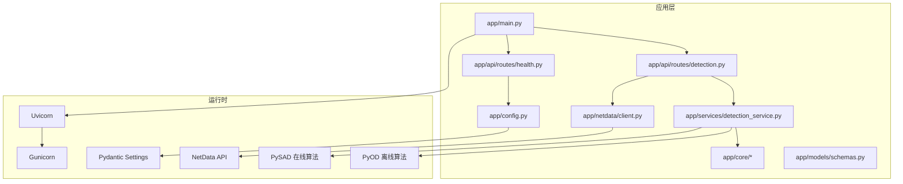
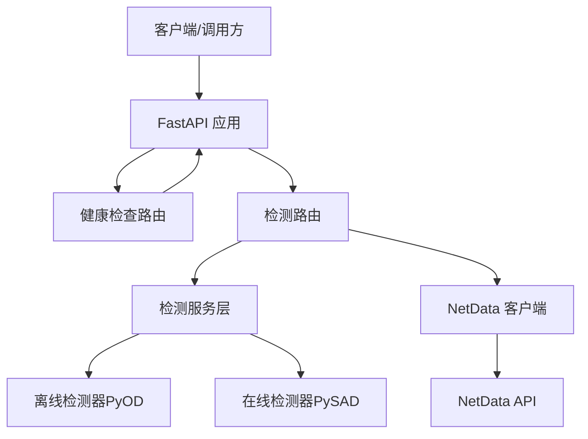
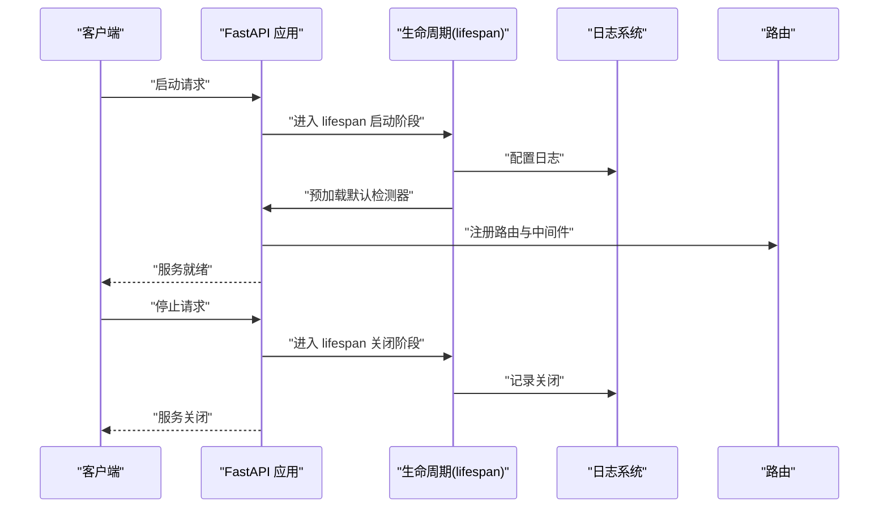
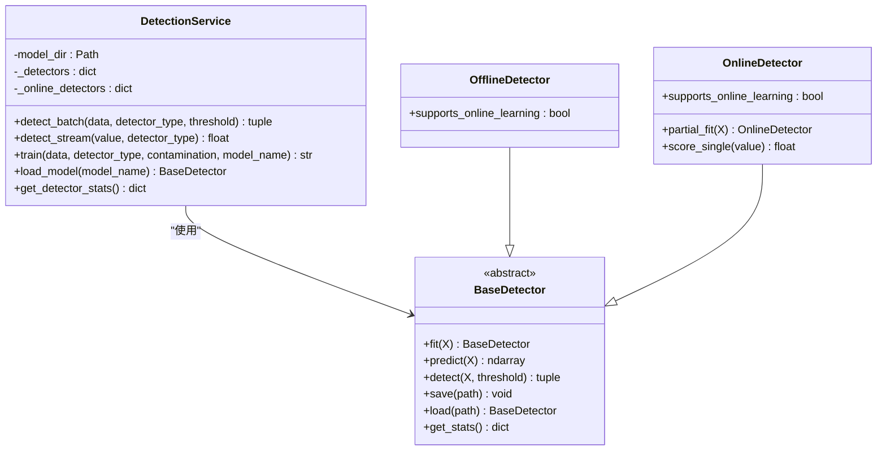
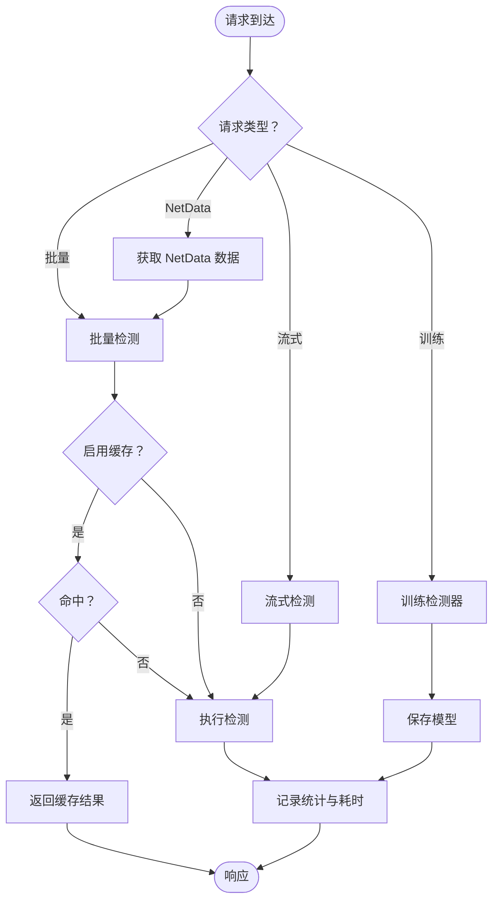
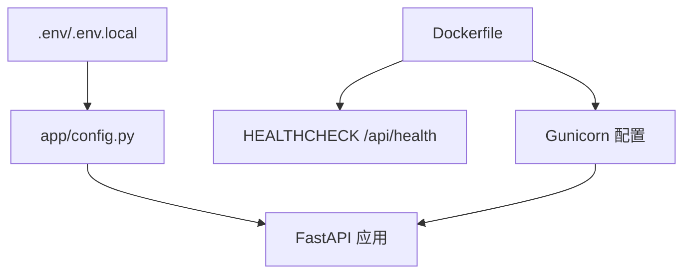
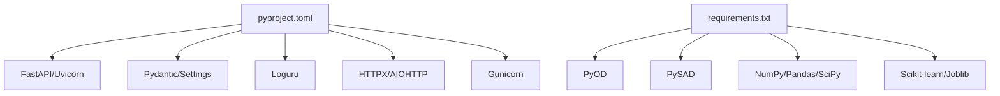

# 服务管理与监控

<cite>
**本文引用的文件**
- [README.md](file://anomaly-detection-service/README.md)
- [Dockerfile](file://anomaly-detection-service/Dockerfile)
- [pyproject.toml](file://anomaly-detection-service/pyproject.toml)
- [requirements.txt](file://anomaly-detection-service/requirements.txt)
- [app/main.py](file://anomaly-detection-service/app/main.py)
- [app/config.py](file://anomaly-detection-service/app/config.py)
- [app/services/detection_service.py](file://anomaly-detection-service/app/services/detection_service.py)
- [app/api/routes/detection.py](file://anomaly-detection-service/app/api/routes/detection.py)
- [app/api/routes/health.py](file://anomaly-detection-service/app/api/routes/health.py)
- [app/core/detector_base.py](file://anomaly-detection-service/app/core/detector_base.py)
- [app/core/pyod_detector.py](file://anomaly-detection-service/app/core/pyod_detector.py)
- [app/core/pysad_detector.py](file://anomaly-detection-service/app/core/pysad_detector.py)
- [app/netdata/client.py](file://anomaly-detection-service/app/netdata/client.py)
- [app/models/schemas.py](file://anomaly-detection-service/app/models/schemas.py)
</cite>

## 目录
1. [简介](#简介)
2. [项目结构](#项目结构)
3. [核心组件](#核心组件)
4. [架构总览](#架构总览)
5. [详细组件分析](#详细组件分析)
6. [依赖分析](#依赖分析)
7. [性能考虑](#性能考虑)
8. [故障排查指南](#故障排查指南)
9. [结论](#结论)
10. [附录](#附录)

## 简介
本技术文档围绕“异常检测服务”的管理与监控展开，涵盖服务启动、停止、重启与状态监控机制；检测服务的核心功能实现（检测任务调度、结果缓存、性能监控与资源管理）；Docker 容器化部署配置、环境变量设置、日志管理与健康检查策略；以及服务性能优化建议、内存管理、并发控制与故障恢复方案。文档同时提供监控指标定义、告警配置思路、日志分析方法与运维最佳实践。

## 项目结构
异常检测服务采用 FastAPI + Uvicorn/Gunicorn 的生产就绪架构，结合 PyOD 与 PySAD 提供离线与在线异常检测能力，并通过 NetData API 获取实时监控指标。项目采用模块化组织，核心目录与职责如下：
- app/main.py：应用入口与生命周期管理（启动/关闭日志、中间件、异常处理、路由注册）
- app/config.py：集中式配置管理（环境变量、端口、阈值、数据库/缓存连接、检测器参数）
- app/api/routes/*：REST API 路由（健康检查、批量/流式检测、训练、NetData 集成）
- app/services/detection_service.py：检测服务层（检测器实例池、训练/加载、统计信息）
- app/core/*：检测器抽象与具体实现（离线：Isolation Forest、LOF、KNN；在线：Half-Space Trees、xStream）
- app/netdata/client.py：NetData 异步客户端（数据抓取、图表查询、健康检查）
- app/models/schemas.py：Pydantic 数据模型（请求/响应、枚举、校验）
- Dockerfile、pyproject.toml、requirements.txt：容器化与依赖管理

**图示来源**
- [app/main.py:1-217](file://anomaly-detection-service/app/main.py#L1-L217)
- [app/config.py:1-183](file://anomaly-detection-service/app/config.py#L1-L183)
- [app/services/detection_service.py:1-334](file://anomaly-detection-service/app/services/detection_service.py#L1-L334)
- [app/api/routes/detection.py:1-378](file://anomaly-detection-service/app/api/routes/detection.py#L1-L378)
- [app/api/routes/health.py:1-88](file://anomaly-detection-service/app/api/routes/health.py#L1-L88)
- [app/core/detector_base.py:1-339](file://anomaly-detection-service/app/core/detector_base.py#L1-L339)
- [app/core/pyod_detector.py:1-287](file://anomaly-detection-service/app/core/pyod_detector.py#L1-L287)
- [app/core/pysad_detector.py:1-358](file://anomaly-detection-service/app/core/pysad_detector.py#L1-L358)
- [app/netdata/client.py:1-301](file://anomaly-detection-service/app/netdata/client.py#L1-L301)
- [app/models/schemas.py:1-329](file://anomaly-detection-service/app/models/schemas.py#L1-L329)

**章节来源**
- [README.md:1-42](file://anomaly-detection-service/README.md#L1-L42)
- [app/main.py:1-217](file://anomaly-detection-service/app/main.py#L1-L217)
- [app/config.py:1-183](file://anomaly-detection-service/app/config.py#L1-L183)

## 核心组件
- 应用入口与生命周期：通过 lifespan 管理启动/关闭阶段，配置日志、预加载默认检测器，注册路由与中间件，设置全局异常处理器。
- 配置中心：集中管理应用、服务、NetData、数据库、Redis、检测器参数、阈值、性能与日志等配置项，支持环境变量覆盖与类型校验。
- 检测服务层：维护离线/在线检测器实例池，提供批量/流式检测、训练与模型持久化，聚合统计信息。
- 检测器实现：离线（PyOD）与在线（PySAD）两类算法封装，统一接口与工厂注册，支持参数化与归一化输出。
- NetData 客户端：异步 HTTP 客户端，提供图表数据获取、告警查询与健康检查。
- API 路由：批量检测、流式检测、训练、NetData 集成，统一响应模型与异常处理。
- 数据模型：Pydantic 定义的请求/响应模型、枚举与字段校验，自动生成 OpenAPI 文档。

**章节来源**
- [app/main.py:29-102](file://anomaly-detection-service/app/main.py#L29-L102)
- [app/config.py:28-183](file://anomaly-detection-service/app/config.py#L28-L183)
- [app/services/detection_service.py:37-334](file://anomaly-detection-service/app/services/detection_service.py#L37-L334)
- [app/core/detector_base.py:31-339](file://anomaly-detection-service/app/core/detector_base.py#L31-L339)
- [app/core/pyod_detector.py:31-287](file://anomaly-detection-service/app/core/pyod_detector.py#L31-L287)
- [app/core/pysad_detector.py:37-358](file://anomaly-detection-service/app/core/pysad_detector.py#L37-L358)
- [app/netdata/client.py:30-301](file://anomaly-detection-service/app/netdata/client.py#L30-L301)
- [app/api/routes/detection.py:39-378](file://anomaly-detection-service/app/api/routes/detection.py#L39-L378)
- [app/models/schemas.py:28-329](file://anomaly-detection-service/app/models/schemas.py#L28-L329)

## 架构总览
服务采用“应用层 + 核心算法层 + 外部系统集成层”的分层架构。应用层负责 HTTP 接口与生命周期；核心算法层封装 PyOD/PySAD；外部系统通过 NetData 客户端对接监控系统。

**图示来源**
- [app/main.py:177-187](file://anomaly-detection-service/app/main.py#L177-L187)
- [app/api/routes/health.py:25-88](file://anomaly-detection-service/app/api/routes/health.py#L25-L88)
- [app/api/routes/detection.py:55-378](file://anomaly-detection-service/app/api/routes/detection.py#L55-L378)
- [app/services/detection_service.py:76-334](file://anomaly-detection-service/app/services/detection_service.py#L76-L334)
- [app/core/pyod_detector.py:31-287](file://anomaly-detection-service/app/core/pyod_detector.py#L31-L287)
- [app/core/pysad_detector.py:37-358](file://anomaly-detection-service/app/core/pysad_detector.py#L37-L358)
- [app/netdata/client.py:138-198](file://anomaly-detection-service/app/netdata/client.py#L138-L198)

## 详细组件分析

### 服务生命周期与启动/停止/重启/状态监控
- 启动流程：应用启动时通过 lifespan 记录启动时间、配置日志、预加载默认检测器；注册路由与中间件；设置全局异常处理器。
- 停止流程：lifespan 关闭阶段记录服务关闭事件，预留模型持久化扩展点。
- 重启策略：生产环境使用 Gunicorn + Uvicorn Worker，可通过进程信号优雅重启；开发环境使用 uvicorn --reload。
- 状态监控：提供 /api/health、/api/ready、/api/live 三个探针，返回健康状态、就绪状态与存活状态；可作为 Kubernetes 探针使用。

**图示来源**
- [app/main.py:32-71](file://anomaly-detection-service/app/main.py#L32-L71)
- [app/api/routes/health.py:31-87](file://anomaly-detection-service/app/api/routes/health.py#L31-L87)

**章节来源**
- [app/main.py:32-71](file://anomaly-detection-service/app/main.py#L32-L71)
- [app/api/routes/health.py:25-88](file://anomaly-detection-service/app/api/routes/health.py#L25-L88)

### 检测服务核心功能实现
- 检测器实例池：离线/在线检测器分别维护实例池，按类型复用，避免重复初始化。
- 批量检测：将 MetricDataPoint 转换为数值矩阵，调用检测器 predict，按阈值判定异常并分级。
- 流式检测：针对单值进行实时评分，支持在线学习（部分在线检测器），并提供单值评分接口。
- 训练与持久化：支持离线检测器训练，生成模型名并保存至 models 目录，便于后续加载复用。
- 统计信息：聚合离线/在线检测器的训练耗时、预测次数、样本计数等指标，便于性能监控与资源管理。

**图示来源**
- [app/services/detection_service.py:37-334](file://anomaly-detection-service/app/services/detection_service.py#L37-L334)
- [app/core/detector_base.py:31-201](file://anomaly-detection-service/app/core/detector_base.py#L31-L201)

**章节来源**
- [app/services/detection_service.py:76-334](file://anomaly-detection-service/app/services/detection_service.py#L76-L334)
- [app/core/detector_base.py:31-339](file://anomaly-detection-service/app/core/detector_base.py#L31-L339)

### 检测任务调度与结果缓存
- 任务调度：API 路由根据请求类型（批量/流式/训练）调度检测服务层执行；NetData 集成路由在获取数据后统一走检测流程。
- 结果缓存：配置中提供缓存 TTL（秒），可在网关或上游代理层实现结果缓存；服务内部未见显式缓存实现，建议在 API 网关或反向代理层引入缓存策略以降低重复请求压力。
- 性能监控：路由层在响应头添加处理耗时；检测服务层记录处理耗时与异常计数；可结合日志与指标系统采集关键指标。

**图示来源**
- [app/api/routes/detection.py:55-378](file://anomaly-detection-service/app/api/routes/detection.py#L55-L378)
- [app/services/detection_service.py:76-193](file://anomaly-detection-service/app/services/detection_service.py#L76-L193)
- [app/config.py:144-146](file://anomaly-detection-service/app/config.py#L144-L146)

**章节来源**
- [app/api/routes/detection.py:55-378](file://anomaly-detection-service/app/api/routes/detection.py#L55-L378)
- [app/config.py:144-146](file://anomaly-detection-service/app/config.py#L144-L146)

### Docker 容器化部署配置、环境变量与健康检查
- 镜像与运行：基于 Python 3.11-slim，设置环境变量提升稳定性；分阶段构建，最终运行阶段使用非 root 用户；暴露端口 8001。
- 健康检查：HEALTHCHECK 使用 curl 调用 /api/health，支持 Kubernetes liveness/readiness 探针。
- 生产启动：使用 gunicorn + uvicorn worker，配置 workers、timeout、keep-alive、日志输出等参数。
- 环境变量：通过 .env 文件与环境变量覆盖配置；配置中心支持端口、阈值、NetData/数据库/Redis 连接等。

**图示来源**
- [Dockerfile:15-95](file://anomaly-detection-service/Dockerfile#L15-L95)
- [app/config.py:42-47](file://anomaly-detection-service/app/config.py#L42-L47)
- [app/main.py:207-217](file://anomaly-detection-service/app/main.py#L207-L217)

**章节来源**
- [Dockerfile:15-95](file://anomaly-detection-service/Dockerfile#L15-L95)
- [app/config.py:42-47](file://anomaly-detection-service/app/config.py#L42-L47)
- [app/main.py:207-217](file://anomaly-detection-service/app/main.py#L207-L217)

### 日志管理与异常处理
- 日志：使用 loguru 在 lifespan 中配置日志轮转与保留策略；请求中间件记录请求/响应与耗时；异常处理器统一返回结构化错误。
- 异常：全局捕获 Exception 与 ValueError，分别返回 500/400，并在调试模式下返回详细信息。

**章节来源**
- [app/main.py:47-53](file://anomaly-detection-service/app/main.py#L47-L53)
- [app/main.py:119-139](file://anomaly-detection-service/app/main.py#L119-L139)
- [app/main.py:145-172](file://anomaly-detection-service/app/main.py#L145-L172)

### NetData 集成与监控指标
- NetData 客户端：异步 HTTP 客户端，支持获取图表数据、图表列表、告警状态与健康检查；支持多主机场景。
- 指标获取：路由 /api/v1/detection/netdata/fetch 从 NetData 拉取指标并执行批量检测。
- 指标定义：CPU、内存、负载、网络、磁盘、进程、容器等常用图表常量，便于统一管理。

**章节来源**
- [app/netdata/client.py:30-301](file://anomaly-detection-service/app/netdata/client.py#L30-L301)
- [app/api/routes/detection.py:285-378](file://anomaly-detection-service/app/api/routes/detection.py#L285-L378)

## 依赖分析
- 运行时依赖：FastAPI、Uvicorn、Pydantic/Settings、PyOD、PySAD、NumPy/Pandas/SciPy、Scikit-learn、Joblib、Loguru、HTTPX/AIOHTTP、Gunicorn。
- 代码质量：Ruff、Mypy、PyTest、Coverage 配置于 pyproject.toml。
- 依赖锁定：requirements.txt 明确版本范围，注意 PySAD 与 NumPy 的兼容性。

**图示来源**
- [pyproject.toml:10-55](file://anomaly-detection-service/pyproject.toml#L10-L55)
- [requirements.txt:17-94](file://anomaly-detection-service/requirements.txt#L17-L94)

**章节来源**
- [pyproject.toml:10-55](file://anomaly-detection-service/pyproject.toml#L10-L55)
- [requirements.txt:17-94](file://anomaly-detection-service/requirements.txt#L17-L94)

## 性能考虑
- 并发与吞吐：生产使用 Gunicorn + Uvicorn Worker，合理设置 workers 数量与 keep-alive；请求中间件记录耗时，便于定位瓶颈。
- 内存管理：在线检测器使用滑动窗口，需关注窗口大小与样本数；离线检测器训练时并行度由 n_jobs 控制，注意 CPU/内存占用。
- 检测器参数：调整 Isolation Forest 的 n_estimators、LOF 的 n_neighbors、在线检测器的 window_size，平衡准确率与延迟。
- 缓存策略：在网关层引入结果缓存（TTL 依据业务需求），减少重复检测请求；服务内部暂未实现缓存。
- I/O 优化：NetData 客户端使用异步 HTTP 客户端，降低等待时间；合理设置超时与重试策略。

[本节为通用性能指导，不直接分析具体文件]

## 故障排查指南
- 健康检查失败：确认 /api/health 可访问，查看容器健康检查配置与日志；检查 NetData 连通性。
- 检测异常：检查请求参数（阈值范围、数据长度）、检测器类型与参数；查看检测器统计信息与训练耗时。
- 模型加载失败：确认模型文件存在且格式正确；检查模型目录权限。
- 日志定位：开启调试模式（debug=true）以获取详细异常堆栈；关注请求耗时与异常级别日志。

**章节来源**
- [app/api/routes/health.py:31-87](file://anomaly-detection-service/app/api/routes/health.py#L31-L87)
- [app/services/detection_service.py:194-212](file://anomaly-detection-service/app/services/detection_service.py#L194-L212)
- [app/main.py:145-172](file://anomaly-detection-service/app/main.py#L145-L172)

## 结论
该异常检测服务通过清晰的分层架构与模块化设计，实现了从数据接入、检测执行到结果输出的完整闭环。配合 Docker 容器化与健康检查，具备良好的可运维性。建议在生产环境中完善结果缓存、增强资源监控与告警、优化检测器参数与并发配置，并持续改进模型训练与评估流程。

[本节为总结性内容，不直接分析具体文件]

## 附录

### 监控指标定义与告警配置
- 指标类别
  - 基础指标：请求总量、成功率、错误率、平均/95 分位响应时间、并发请求数
  - 检测指标：异常计数、异常占比、检测耗时、训练耗时、模型样本数
  - 资源指标：CPU 使用率、内存占用、磁盘 IO、网络带宽
  - 外部系统：NetData 连接状态、数据拉取成功率、告警数量
- 告警规则示例
  - 响应时间超过阈值持续一段时间
  - 异常占比超过阈值
  - 检测耗时异常升高
  - NetData 连接失败或数据为空
  - 模型训练失败或样本不足

[本节为通用运维建议，不直接分析具体文件]

### 日志分析与运维最佳实践
- 日志规范：统一时间戳、请求 ID、模块、级别、耗时；区分调试与生产日志级别
- 日志轮转：按大小与时间轮转，保留周期合理设置
- 告警联动：将关键错误与异常分数阈值纳入告警系统
- 变更管理：通过环境变量与配置文件管理参数变更，避免硬编码

[本节为通用运维建议，不直接分析具体文件]