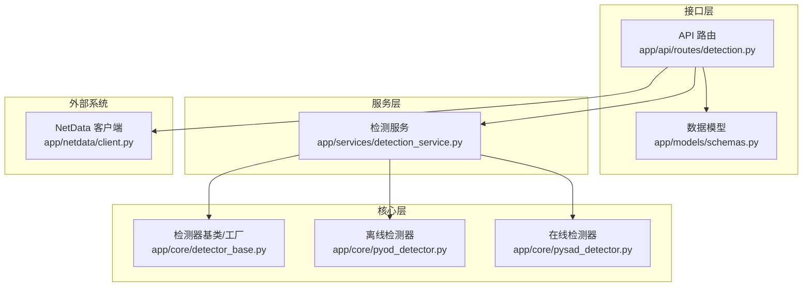
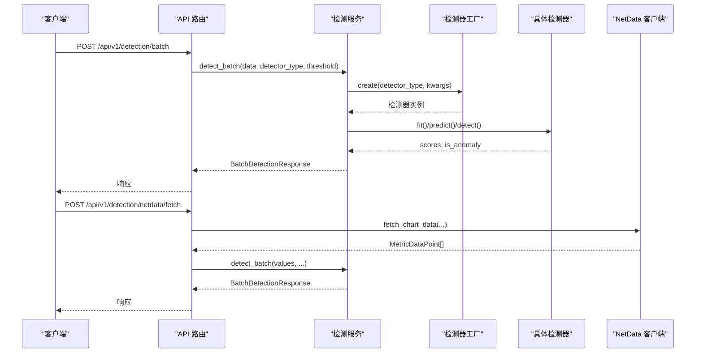
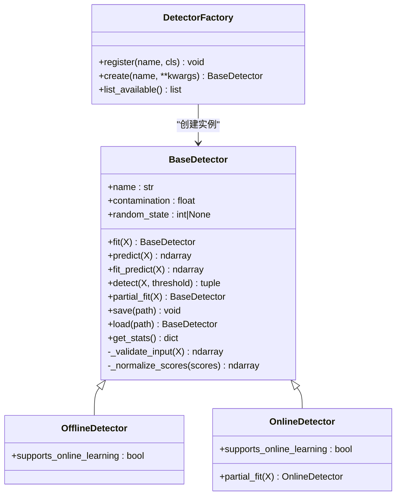
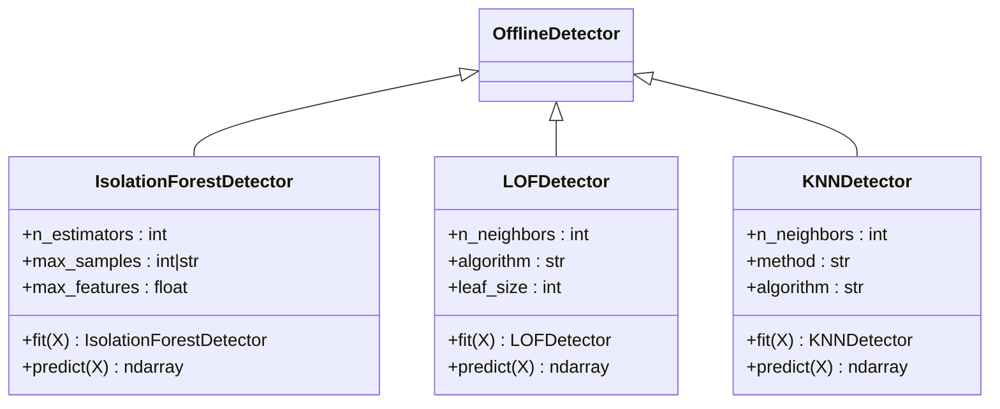
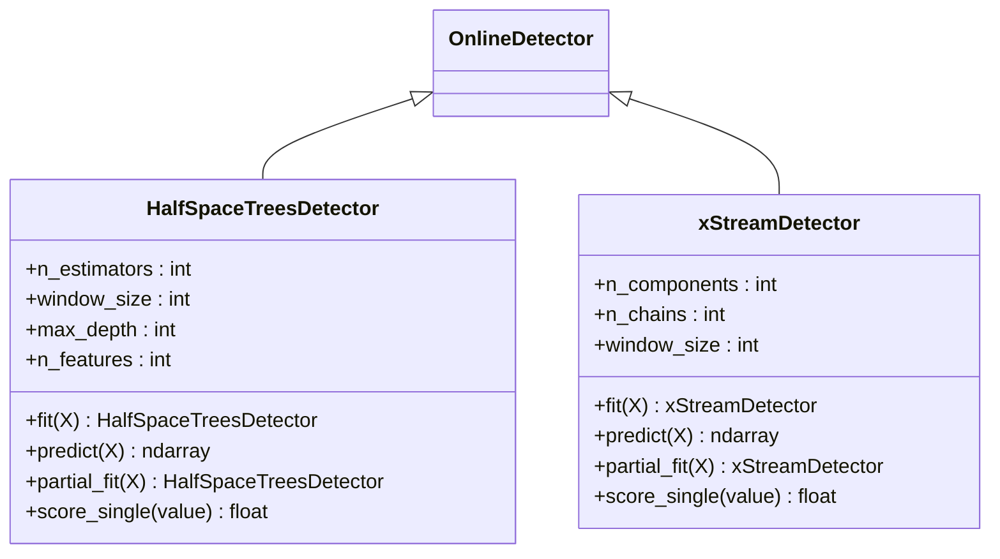
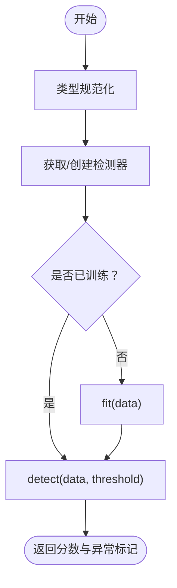
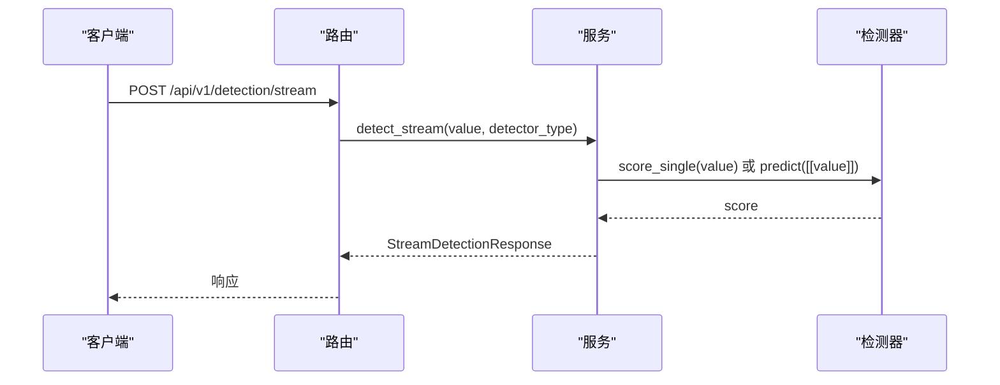
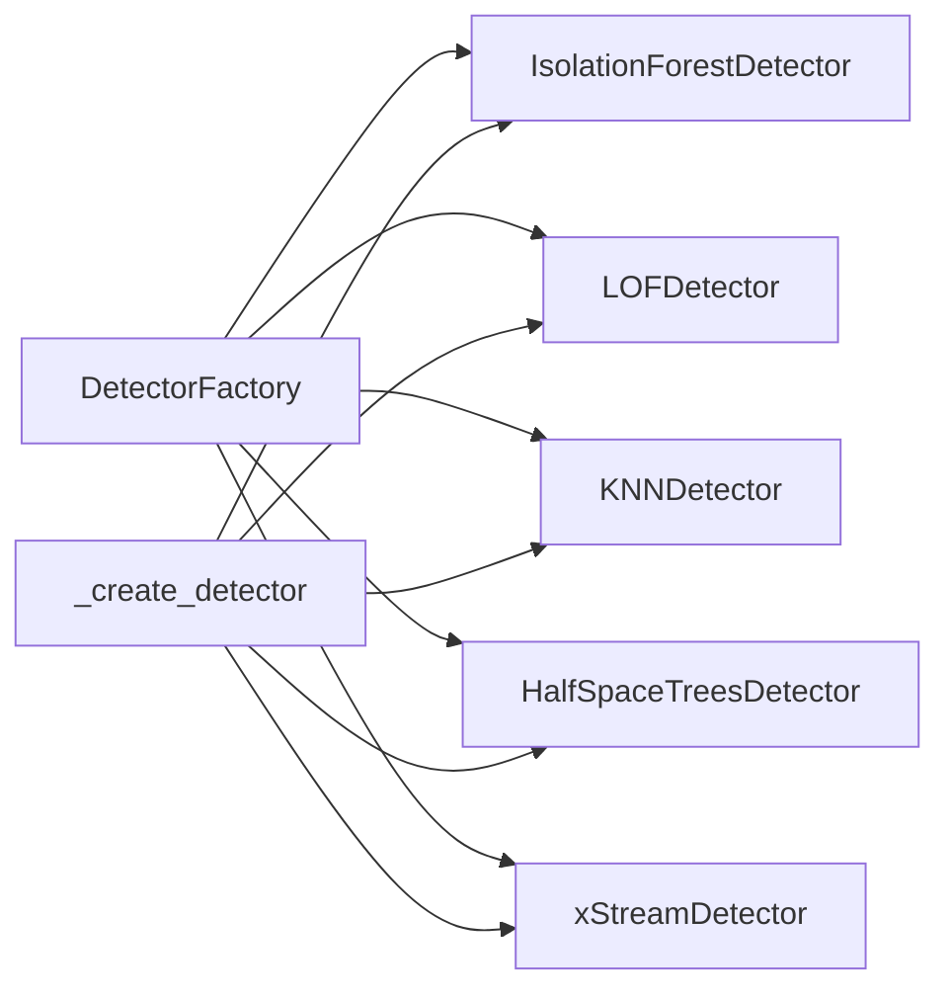

# 检测算法集成

<cite>
**本文引用的文件**
- [detector_base.py](file://anomaly-detection-service/app/core/detector_base.py)
- [pyod_detector.py](file://anomaly-detection-service/app/core/pyod_detector.py)
- [pysad_detector.py](file://anomaly-detection-service/app/core/pysad_detector.py)
- [detection_service.py](file://anomaly-detection-service/app/services/detection_service.py)
- [detection.py](file://anomaly-detection-service/app/api/routes/detection.py)
- [schemas.py](file://anomaly-detection-service/app/models/schemas.py)
- [config.py](file://anomaly-detection-service/app/config.py)
- [client.py](file://anomaly-detection-service/app/netdata/client.py)
- [main.py](file://anomaly-detection-service/app/main.py)
- [requirements.txt](file://anomaly-detection-service/requirements.txt)
- [test_detectors.py](file://anomaly-detection-service/tests/test_detectors.py)
- [README.md](file://anomaly-detection-service/README.md)
</cite>

## 目录
1. [简介](#简介)
2. [项目结构](#项目结构)
3. [核心组件](#核心组件)
4. [架构总览](#架构总览)
5. [详细组件分析](#详细组件分析)
6. [依赖关系分析](#依赖关系分析)
7. [性能考量](#性能考量)
8. [故障排查指南](#故障排查指南)
9. [结论](#结论)
10. [附录](#附录)

## 简介
本项目为基于 PyOD 与 PySAD 的异常检测算法集成方案，提供离线与在线两类检测能力：
- 离线检测：Isolation Forest（隔离森林）、LOF（局部异常因子）、KNN（K 近邻）
- 在线检测：Half-Space Trees（半空间树）、xStream（流式检测）

系统采用统一的检测器基类、工厂模式与模板方法，实现算法的可插拔扩展；通过 FastAPI 提供批量与流式检测 API，并可直接对接 NetData 监控系统获取指标数据。

## 项目结构
- 核心层
  - 检测器基类与工厂：app/core/detector_base.py、app/core/pyod_detector.py、app/core/pysad_detector.py
  - 检测服务：app/services/detection_service.py
- 接口层
  - API 路由：app/api/routes/detection.py
  - 数据模型：app/models/schemas.py
- 配置与入口
  - 配置：app/config.py
  - NetData 客户端：app/netdata/client.py
  - 应用入口：app/main.py
- 依赖与测试
  - 依赖：requirements.txt
  - 单元测试：tests/test_detectors.py
  - 说明：README.md

**图示来源**
- [detection.py:1-378](file://anomaly-detection-service/app/api/routes/detection.py#L1-L378)
- [detection_service.py:1-334](file://anomaly-detection-service/app/services/detection_service.py#L1-L334)
- [detector_base.py:1-339](file://anomaly-detection-service/app/core/detector_base.py#L1-L339)
- [pyod_detector.py:1-287](file://anomaly-detection-service/app/core/pyod_detector.py#L1-L287)
- [pysad_detector.py:1-358](file://anomaly-detection-service/app/core/pysad_detector.py#L1-L358)
- [client.py:1-301](file://anomaly-detection-service/app/netdata/client.py#L1-L301)

**章节来源**
- [main.py:1-217](file://anomaly-detection-service/app/main.py#L1-L217)
- [README.md:1-42](file://anomaly-detection-service/README.md#L1-L42)

## 核心组件
- 检测器基类与工厂
  - BaseDetector：定义统一接口（fit/predict/detect/partial_fit/save/load/get_stats），内置输入校验与分数归一化
  - OfflineDetector/OnlineDetector：离线/在线检测器基类，区分是否支持在线学习
  - DetectorFactory：注册与创建检测器实例，支持扩展新算法
- 离线检测器（PyOD）
  - IsolationForestDetector：适合高维数据、速度快
  - LOFDetector：适合密度不均数据、能检测局部异常
  - KNNDetector：低维数据、简单有效
- 在线检测器（PySAD）
  - HalfSpaceTreesDetector：真正的流式检测、低延迟、需预热
  - xStreamDetector：高维流式数据、检测精度高
- 检测服务
  - DetectionService：管理检测器实例池、批量/流式检测、模型训练与持久化
- API 路由
  - 批量检测、流式检测、训练检测器、从 NetData 获取数据并检测
- 数据模型
  - DetectorType、AnomalyLevel、DetectionStatus、请求/响应模型等

**章节来源**
- [detector_base.py:31-339](file://anomaly-detection-service/app/core/detector_base.py#L31-L339)
- [pyod_detector.py:31-287](file://anomaly-detection-service/app/core/pyod_detector.py#L31-L287)
- [pysad_detector.py:37-358](file://anomaly-detection-service/app/core/pysad_detector.py#L37-L358)
- [detection_service.py:37-334](file://anomaly-detection-service/app/services/detection_service.py#L37-L334)
- [detection.py:1-378](file://anomaly-detection-service/app/api/routes/detection.py#L1-L378)
- [schemas.py:31-329](file://anomaly-detection-service/app/models/schemas.py#L31-L329)

## 架构总览
系统采用“API 路由 -> 服务层 -> 核心层”的分层架构，核心层通过工厂模式解耦具体算法实现，便于扩展与替换。

**图示来源**
- [detection.py:55-378](file://anomaly-detection-service/app/api/routes/detection.py#L55-L378)
- [detection_service.py:76-334](file://anomaly-detection-service/app/services/detection_service.py#L76-L334)
- [detector_base.py:288-339](file://anomaly-detection-service/app/core/detector_base.py#L288-L339)
- [client.py:138-198](file://anomaly-detection-service/app/netdata/client.py#L138-L198)

## 详细组件分析

### 检测器基类与工厂
- 设计要点
  - 抽象基类定义统一接口，子类只需实现 fit/predict
  - detect 将预测分数转换为布尔异常判断
  - partial_fit 为在线学习预留，默认抛出异常
  - 输入校验确保数值有效性，分数归一化保证输出范围一致
  - 工厂模式通过注册表创建实例，支持扩展新算法
- 扩展机制
  - 继承 OfflineDetector 或 OnlineDetector
  - 在模块末尾通过 DetectorFactory.register 注册
  - 可在 DetectionService._create_detector 中按类型映射参数

**图示来源**
- [detector_base.py:31-339](file://anomaly-detection-service/app/core/detector_base.py#L31-L339)

**章节来源**
- [detector_base.py:31-339](file://anomaly-detection-service/app/core/detector_base.py#L31-L339)

### 离线检测器（PyOD）
- Isolation Forest（隔离森林）
  - 适合高维数据、速度快、无需假设分布
  - 参数：n_estimators、max_samples、max_features、contamination
  - 适用场景：CPU/内存使用率、网络流量、多维指标联合检测
- LOF（局部异常因子）
  - 能检测局部密度差异导致的异常
  - 参数：n_neighbors、algorithm、leaf_size、contamination
  - 适用场景：不同时段流量基准不同、多模态分布
- KNN（K 近邻）
  - 基于距离的简单方法
  - 参数：n_neighbors、method、algorithm、contamination
  - 适用场景：低维指标、小样本

**图示来源**
- [pyod_detector.py:31-287](file://anomaly-detection-service/app/core/pyod_detector.py#L31-L287)

**章节来源**
- [pyod_detector.py:31-287](file://anomaly-detection-service/app/core/pyod_detector.py#L31-L287)

### 在线检测器（PySAD）
- Half-Space Trees（半空间树）
  - 真正的流式检测，低延迟、固定内存占用
  - 需要预热数据，对概念漂移敏感
  - 参数：n_estimators、window_size、max_depth、n_features
  - 适用场景：实时监控告警、单指标流式监控
- xStream（流式检测）
  - 适合高维流式数据，检测精度高
  - 参数：n_components、n_chains、window_size
  - 适用场景：多维指标联合检测、复杂特征异常检测

**图示来源**
- [pysad_detector.py:37-358](file://anomaly-detection-service/app/core/pysad_detector.py#L37-L358)

**章节来源**
- [pysad_detector.py:37-358](file://anomaly-detection-service/app/core/pysad_detector.py#L37-L358)

### 检测服务（DetectionService）
- 职责
  - 管理离线/在线检测器实例池
  - 提供 detect_batch/detect_stream 接口
  - 训练与持久化模型
  - 统计信息聚合
- 关键流程
  - detect_batch：按需创建/复用检测器，必要时先 fit 再 detect
  - detect_stream：按类型创建在线检测器，支持 score_single 或回退 predict
  - _create_detector：根据 DetectorType 映射默认参数与构造函数

**图示来源**
- [detection_service.py:76-118](file://anomaly-detection-service/app/services/detection_service.py#L76-L118)

**章节来源**
- [detection_service.py:37-334](file://anomaly-detection-service/app/services/detection_service.py#L37-L334)

### API 路由与数据模型
- 路由
  - 批量检测：/api/v1/detection/batch
  - 流式检测：/api/v1/detection/stream
  - 训练检测器：/api/v1/detection/train
  - NetData 获取并检测：/api/v1/detection/netdata/fetch
- 数据模型
  - DetectorType：枚举离线/在线检测器类型
  - AnomalyLevel：异常等级（normal/warning/critical）
  - 请求/响应模型：BatchDetectionRequest、StreamDetectionRequest、TrainDetectorRequest、NetDataFetchRequest 等

**图示来源**
- [detection.py:158-219](file://anomaly-detection-service/app/api/routes/detection.py#L158-L219)
- [detection_service.py:120-152](file://anomaly-detection-service/app/services/detection_service.py#L120-L152)

**章节来源**
- [detection.py:1-378](file://anomaly-detection-service/app/api/routes/detection.py#L1-L378)
- [schemas.py:31-329](file://anomaly-detection-service/app/models/schemas.py#L31-L329)

## 依赖关系分析
- 检测器注册与创建
  - PyOD 检测器在模块末尾注册到工厂
  - PySAD 检测器仅在安装 PySAD 时注册
  - DetectionService._create_detector 支持通过工厂创建任意已注册类型
- 外部依赖
  - PyOD：离线算法实现
  - PySAD：在线算法实现（可选）
  - NumPy/SciPy：数值计算
  - FastAPI/uvicorn：Web 服务
  - httpx/aiohttp：异步 HTTP 客户端
  - loguru：日志

**图示来源**
- [pyod_detector.py:277-287](file://anomaly-detection-service/app/core/pyod_detector.py#L277-L287)
- [pysad_detector.py:348-350](file://anomaly-detection-service/app/core/pysad_detector.py#L348-L350)
- [detection_service.py:263-314](file://anomaly-detection-service/app/services/detection_service.py#L263-L314)

**章节来源**
- [requirements.txt:1-94](file://anomaly-detection-service/requirements.txt#L1-L94)
- [pyod_detector.py:277-287](file://anomaly-detection-service/app/core/pyod_detector.py#L277-L287)
- [pysad_detector.py:348-350](file://anomaly-detection-service/app/core/pysad_detector.py#L348-L350)
- [detection_service.py:263-314](file://anomaly-detection-service/app/services/detection_service.py#L263-L314)

## 性能考量
- 离线算法
  - Isolation Forest：树数量与特征采样影响速度与稳定性，建议在高维场景优先使用
  - LOF：邻居数与算法实现影响性能，数据量大时注意内存与时间开销
  - KNN：复杂度随样本数平方增长，适合中小规模低维数据
- 在线算法
  - Half-Space Trees：固定内存占用，适合实时流式检测，需预热以获得稳定阈值
  - xStream：高维数据表现更好，计算复杂度较高
- 通用优化
  - 输入数据预处理（缺失值、异常值、标准化）
  - 分批处理与缓存策略
  - 并行化与异步 I/O（服务端已采用异步 HTTP 客户端）

[本节为通用指导，无需源码引用]

## 故障排查指南
- 常见问题
  - 未训练即预测：离线检测器在 predict 前必须调用 fit
  - 输入数据非法：空数组、NaN/Inf 值会触发校验异常
  - 在线检测器不支持在线学习：若调用 partial_fit 会抛出异常
  - PySAD 未安装：在线检测器导入失败，需安装 pysad==0.1.1
- 定位方法
  - 查看服务日志（loguru 输出）
  - 使用 API 响应中的 processing_time_ms 评估性能瓶颈
  - 通过 get_detector_stats 获取检测器统计信息
- 单元测试参考
  - 工厂注册与创建、异常分数范围、边界条件、在线检测器流式评分

**章节来源**
- [detector_base.py:203-228](file://anomaly-detection-service/app/core/detector_base.py#L203-L228)
- [detector_base.py:128-143](file://anomaly-detection-service/app/core/detector_base.py#L128-L143)
- [pysad_detector.py:32-34](file://anomaly-detection-service/app/core/pysad_detector.py#L32-L34)
- [test_detectors.py:1-231](file://anomaly-detection-service/tests/test_detectors.py#L1-L231)

## 结论
本项目通过统一的检测器基类、工厂模式与服务层封装，实现了对 PyOD 与 PySAD 算法的无缝集成。离线检测器适合批量分析与模型训练，而在线检测器满足实时监控需求。配合 NetData 集成与完善的 API，系统具备良好的可扩展性与工程落地能力。

[本节为总结，无需源码引用]

## 附录

### 检测器选择指南
- 离线场景
  - 高维数据、快速检测：Isolation Forest
  - 密度不均、局部异常：LOF
  - 低维数据、小样本：KNN
- 在线场景
  - 实时流式检测、低延迟：Half-Space Trees
  - 高维流式数据、高精度：xStream

**章节来源**
- [pyod_detector.py:10-17](file://anomaly-detection-service/app/core/pyod_detector.py#L10-L17)
- [pysad_detector.py:10-16](file://anomaly-detection-service/app/core/pysad_detector.py#L10-L16)

### 参数调优策略
- Isolation Forest
  - n_estimators：在准确性和性能之间权衡，建议 50–200
  - contamination：根据历史经验设定，影响异常阈值
- LOF
  - n_neighbors：通常 5–50，结合数据密度调整
  - algorithm/leaf_size：大数据量时考虑“ball_tree”或“kd_tree”
- KNN
  - n_neighbors：小样本时较小，避免过拟合
- Half-Space Trees
  - window_size：平衡响应速度与稳定性
  - n_estimators/max_depth：控制模型复杂度
- xStream
  - n_components/n_chains：高维数据增加以提升检测精度

**章节来源**
- [pyod_detector.py:54-67](file://anomaly-detection-service/app/core/pyod_detector.py#L54-L67)
- [pyod_detector.py:150-162](file://anomaly-detection-service/app/core/pyod_detector.py#L150-L162)
- [pyod_detector.py:223-235](file://anomaly-detection-service/app/core/pyod_detector.py#L223-L235)
- [pysad_detector.py:67-93](file://anomaly-detection-service/app/core/pysad_detector.py#L67-L93)
- [pysad_detector.py:262-285](file://anomaly-detection-service/app/core/pysad_detector.py#L262-L285)

### 性能对比与实际应用案例
- 性能对比
  - Isolation Forest：高维、大批量、速度快
  - LOF：局部异常敏感、计算复杂度高
  - KNN：简单直观、复杂度高
  - Half-Space Trees：实时、低延迟、固定内存
  - xStream：高维、高精度、计算成本较高
- 应用案例
  - CPU/内存使用率异常检测（Isolation Forest）
  - 网络流量异常（LOF/Half-Space Trees）
  - 多维指标联合检测（Isolation Forest/xStream）
  - 实时监控告警（Half-Space Trees）

**章节来源**
- [pyod_detector.py:35-51](file://anomaly-detection-service/app/core/pyod_detector.py#L35-L51)
- [pyod_detector.py:133-147](file://anomaly-detection-service/app/core/pyod_detector.py#L133-L147)
- [pyod_detector.py:206-221](file://anomaly-detection-service/app/core/pyod_detector.py#L206-L221)
- [pysad_detector.py:39-57](file://anomaly-detection-service/app/core/pysad_detector.py#L39-L57)
- [pysad_detector.py:245-259](file://anomaly-detection-service/app/core/pysad_detector.py#L245-L259)

### 最佳实践建议
- 数据准备
  - 清洗 NaN/Inf，标准化/归一化
  - 合理设置 contamination，避免过拟合或漏检
- 算法选择
  - 先用 Isolation Forest 进行快速探索
  - 局部异常场景优先 LOF
  - 实时流式场景优先 Half-Space Trees，高维场景考虑 xStream
- 部署与监控
  - 使用配置中心集中管理阈值与参数
  - 记录 processing_time_ms 与异常等级分布
  - 定期评估与重训练

[本节为通用指导，无需源码引用]