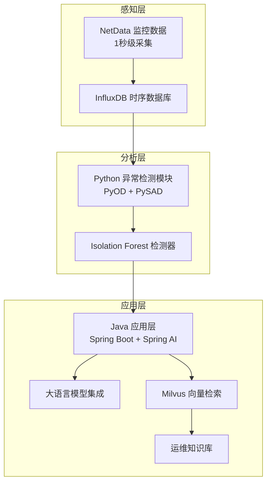
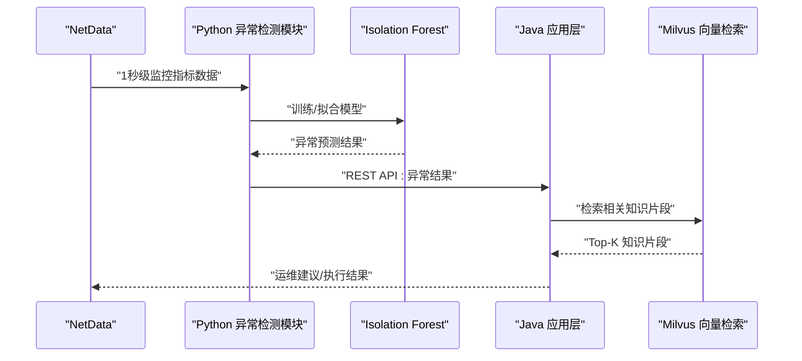
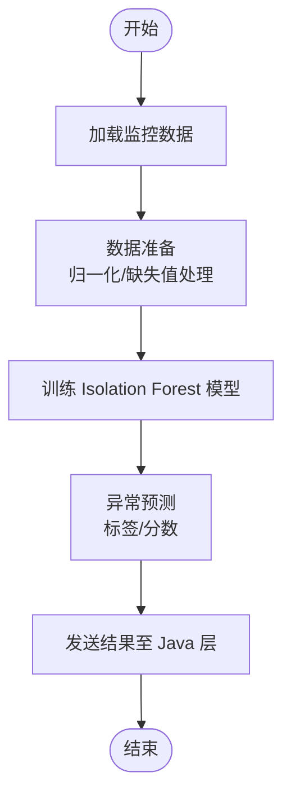
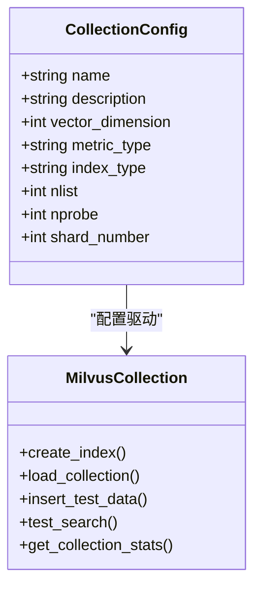
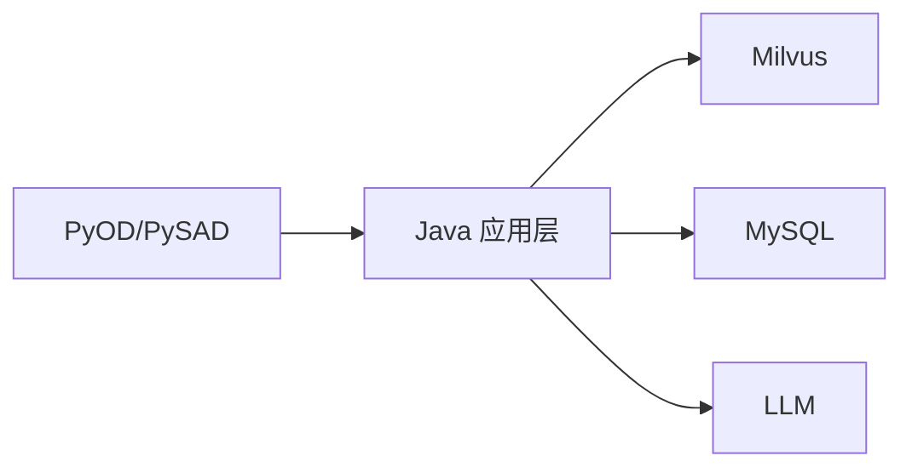

# PyOD 算法集成

<cite>
**本文引用的文件**
- [开题报告_精简版.md](file://开题报告_精简版.md)
- [init_milvus.py](file://scripts/init_milvus.py)
- [test_milvus_connection.py](file://tests/test_milvus_connection.py)
- [milvus_collection.yaml](file://config/milvus_collection.yaml)
- [docker-compose.yml](file://docker-compose.yml)
- [init.sql](file://sql/init.sql)
</cite>

## 目录
1. [简介](#简介)
2. [项目结构](#项目结构)
3. [核心组件](#核心组件)
4. [架构总览](#架构总览)
5. [详细组件分析](#详细组件分析)
6. [依赖分析](#依赖分析)
7. [性能考虑](#性能考虑)
8. [故障排查指南](#故障排查指南)
9. [结论](#结论)
10. [附录](#附录)

## 简介
本文件围绕 PyOD 在异常检测系统中的集成展开，重点覆盖无监督异常检测算法（以 Isolation Forest 为例）的实现、配置与调优策略，并结合系统整体架构说明从数据采集到异常检测再到结果处理的完整流程。同时给出与 Java 层交互的接口约定与后续处理建议，帮助读者快速落地基于 NetData 监控数据的异常检测能力。

## 项目结构
本项目采用“感知层-分析层-应用层”的分层架构，其中 Python 异常检测层负责使用 PyOD/PySAD 进行无监督与流式异常检测；Java 应用层负责与 LLM/RAG 集成、知识检索与决策执行。系统通过 Docker Compose 编排 Milvus、MySQL 等基础设施，便于本地开发与部署。

图表来源
- [开题报告_精简版.md:118-152](file://开题报告_精简版.md#L118-L152)
- [docker-compose.yml:23-154](file://docker-compose.yml#L23-L154)

章节来源
- [开题报告_精简版.md:118-152](file://开题报告_精简版.md#L118-L152)
- [docker-compose.yml:23-154](file://docker-compose.yml#L23-L154)

## 核心组件
- 异常检测模块（Python）
  - 使用 PyOD 进行无监督异常检测，使用 PySAD 进行流式异常检测。
  - 典型流程：加载监控数据 → 训练 Isolation Forest 模型 → 异常预测 → 通过 REST API 发送结果至 Java 层。
- Java 应用层
  - 与 LLM 集成，使用 Prompt Template 管理提示词。
  - 与 Milvus 集成进行向量检索与关键词检索，混合检索结果。
  - 提供安全审核与执行机制，支持命令执行与审计。
- 向量检索与知识库（Milvus）
  - 使用 BGE-M3 生成 1024 维向量，采用 IVF_FLAT 索引与 COSINE 相似度度量。
  - 支持搜索参数 nprobe、Top-K 返回等配置。

章节来源
- [开题报告_精简版.md:163-196](file://开题报告_精简版.md#L163-L196)
- [开题报告_精简版.md:198-301](file://开题报告_精简版.md#L198-L301)
- [init_milvus.py:75-104](file://scripts/init_milvus.py#L75-L104)
- [milvus_collection.yaml:39-101](file://config/milvus_collection.yaml#L39-L101)

## 架构总览
下图展示了异常检测模块与 Java 应用层之间的交互关系，以及与 Milvus 的检索链路。

图表来源
- [开题报告_精简版.md:170-189](file://开题报告_精简版.md#L170-L189)
- [开题报告_精简版.md:198-301](file://开题报告_精简版.md#L198-L301)

章节来源
- [开题报告_精简版.md:170-189](file://开题报告_精简版.md#L170-L189)
- [开题报告_精简版.md:198-301](file://开题报告_精简版.md#L198-L301)

## 详细组件分析

### Isolation Forest 检测器
- 角色与职责
  - 作为无监督异常检测器，对高维时序监控数据进行异常识别。
  - 通过树的构造与样本路径长度差异判断异常程度。
- 关键参数与调优
  - contamination：异常比例先验估计，直接影响异常阈值与假阳性率。
  - n_estimators：树的数量，影响模型稳定性与计算成本。
  - max_samples：每棵树使用的样本数，通常与数据规模匹配。
  - random_state：随机种子，保证实验可复现。
- 训练与预测流程
  - 数据准备：将 NetData 采集的多维指标转换为二维数组。
  - 模型拟合：使用 fit 方法训练。
  - 预测：predict 返回 0/1 标签；decision_function 或 score_samples 可获得异常分数。
- 与 Java 层交互
  - 将异常标签与异常分数通过 REST API 发送，Java 层据此生成运维建议。

图表来源
- [开题报告_精简版.md:170-189](file://开题报告_精简版.md#L170-L189)

章节来源
- [开题报告_精简版.md:170-189](file://开题报告_精简版.md#L170-L189)

### 异常检测结果格式与后续处理
- 结果字段
  - 异常时间：检测发生的时间戳。
  - 异常指标：触发异常的具体监控指标名称。
  - 异常值：该指标在该时刻的实际观测值。
  - 历史基线：用于对比的历史区间统计信息（如均值、分位数）。
  - 异常分数：模型输出的异常程度评分。
  - 检测器类型：使用的检测器名称（如 Isolation Forest）。
- 后续处理
  - Java 层接收异常结果后，结合 Milvus 检索到的知识片段，生成自然语言建议。
  - 对高风险操作执行安全审核与人工确认，再决定是否执行。

章节来源
- [开题报告_精简版.md:163-169](file://开题报告_精简版.md#L163-L169)
- [开题报告_精简版.md:198-301](file://开题_report_精简版.md#L198-L301)

### 向量检索与知识库（Milvus）
- 集合结构
  - 字段：id（主键自增）、content（内容片段）、embedding（1024维向量）、source（来源）、title（标题）、chunk_index（片段索引）、created_at（时间戳）。
- 索引与搜索
  - 索引类型：IVF_FLAT；nlist 控制聚类中心数量。
  - 搜索参数：nprobe 控制搜索的聚类数量；Top-K 返回结果。
  - 度量：COSINE 余弦相似度。
- 初始化与测试
  - 提供初始化脚本与连接测试脚本，便于验证 Milvus 服务可用性与索引性能。

图表来源
- [init_milvus.py:75-104](file://scripts/init_milvus.py#L75-L104)
- [milvus_collection.yaml:22-101](file://config/milvus_collection.yaml#L22-L101)

章节来源
- [init_milvus.py:133-320](file://scripts/init_milvus.py#L133-L320)
- [init_milvus.py:321-433](file://scripts/init_milvus.py#L321-L433)
- [milvus_collection.yaml:39-101](file://config/milvus_collection.yaml#L39-L101)

### 数据库与表结构（异常检测结果）
- 表：anomaly_detection
  - 字段：host、metric_name、metric_value、anomaly_score、is_anomaly、detector_type、detection_time、created_at。
  - 用途：持久化异常检测结果，便于回溯与审计。
- 与 Java 层的配合
  - Java 层可将异常检测结果写入该表，便于前端展示与工单流转。

章节来源
- [init.sql:201-214](file://sql/init.sql#L201-L214)

## 依赖分析
- Python 异常检测层依赖
  - PyOD：提供 Isolation Forest 等无监督异常检测算法。
  - NumPy/Pandas：数据处理与特征工程。
  - requests：与 Java 层进行 REST 通信。
- Java 应用层依赖
  - Spring Boot/Spring AI：与 LLM 集成与提示词管理。
  - Milvus SDK：向量检索与关键词检索。
  - MySQL 驱动：持久化异常检测结果。
- 基础设施依赖
  - Milvus：向量数据库，支撑 RAG 检索。
  - MySQL：关系数据库，支撑业务数据与审计。
  - Docker Compose：服务编排与资源分配。

图表来源
- [开题报告_精简版.md:95-117](file://开题报告_精简版.md#L95-L117)
- [docker-compose.yml:23-154](file://docker-compose.yml#L23-L154)

章节来源
- [开题报告_精简版.md:95-117](file://开题报告_精简版.md#L95-L117)
- [docker-compose.yml:23-154](file://docker-compose.yml#L23-L154)

## 性能考虑
- Isolation Forest 参数调优
  - contamination：建议从 0.01~0.1 范围内网格搜索，结合业务误报成本与漏检成本确定最优值。
  - n_estimators：在数据规模较小（<10K）时可取 100~200；数据规模较大时可取 200~500，注意内存与训练时间权衡。
  - max_samples：默认为全部样本，若数据量极大可设为较小值以提升速度。
- Milvus 检索性能
  - nlist 与 nprobe：nlist 增大可提升召回，nprobe 增大可提升精度但降低速度；建议在测试集上进行 A/B 调参。
  - 索引类型：IVF_FLAT 在中等规模数据（10-50 万）表现均衡，建议优先尝试。
- 端到端延迟
  - Python 异常检测与 Java LLM 推理需尽量并行化，避免阻塞；合理拆分批处理与缓存热点数据。

## 故障排查指南
- Milvus 连接与健康检查
  - 使用连接测试脚本验证 gRPC 连接与健康检查端点可达性。
  - 若健康检查失败，检查 Milvus 容器日志与资源分配。
- 初始化脚本常见问题
  - 向量维度固定为 1024（BGE-M3），创建 Collection 后不可更改，需在初始化前确认。
  - 索引创建后需加载到内存方可搜索，确保执行 load_collection。
- 数据库表结构
  - 确认 anomaly_detection 表已创建，字段与 Java 层写入逻辑一致。

章节来源
- [test_milvus_connection.py:33-79](file://tests/test_milvus_connection.py#L33-L79)
- [test_milvus_connection.py:81-116](file://tests/test_milvus_connection.py#L81-L116)
- [init_milvus.py:271-294](file://scripts/init_milvus.py#L271-L294)
- [init_milvus.py:296-319](file://scripts/init_milvus.py#L296-L319)
- [init.sql:201-214](file://sql/init.sql#L201-L214)

## 结论
通过 PyOD（特别是 Isolation Forest）与 Java 应用层的协同，系统能够实现对 NetData 监控数据的高效异常检测，并结合 Milvus 的向量检索与 LLM 推理生成可执行的运维建议。合理的参数调优与基础设施配置是保障系统性能与稳定性的关键。建议在开发过程中持续进行 A/B 测试与回归验证，确保异常检测与知识检索的准确性与鲁棒性。

## 附录
- 代码示例路径（不含具体代码内容）
  - 加载 NetData 监控数据与训练 Isolation Forest 模型：[开题报告_精简版.md:170-189](file://开题报告_精简版.md#L170-L189)
  - Java 端知识检索与混合检索：[开题报告_精简版.md:198-221](file://开题报告_精简版.md#L198-L221)
  - Java 端智能问答与提示词模板：[开题报告_精简版.md:230-266](file://开题报告_精简版.md#L230-L266)
  - Java 端命令执行与安全审核：[开题报告_精简版.md:275-301](file://开题报告_精简版.md#L275-L301)
- 配置参考
  - Milvus Collection 配置：[milvus_collection.yaml:22-101](file://config/milvus_collection.yaml#L22-L101)
  - Milvus 初始化脚本：[init_milvus.py:457-516](file://scripts/init_milvus.py#L457-L516)
  - Milvus 连接测试：[test_milvus_connection.py:118-148](file://tests/test_milvus_connection.py#L118-L148)
  - Docker Compose 编排：[docker-compose.yml:23-154](file://docker-compose.yml#L23-L154)
  - 异常检测结果表结构：[init.sql:201-214](file://sql/init.sql#L201-L214)