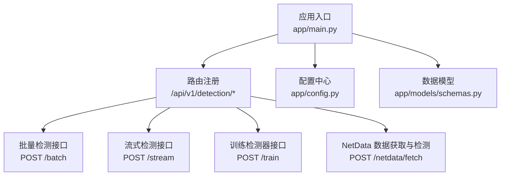
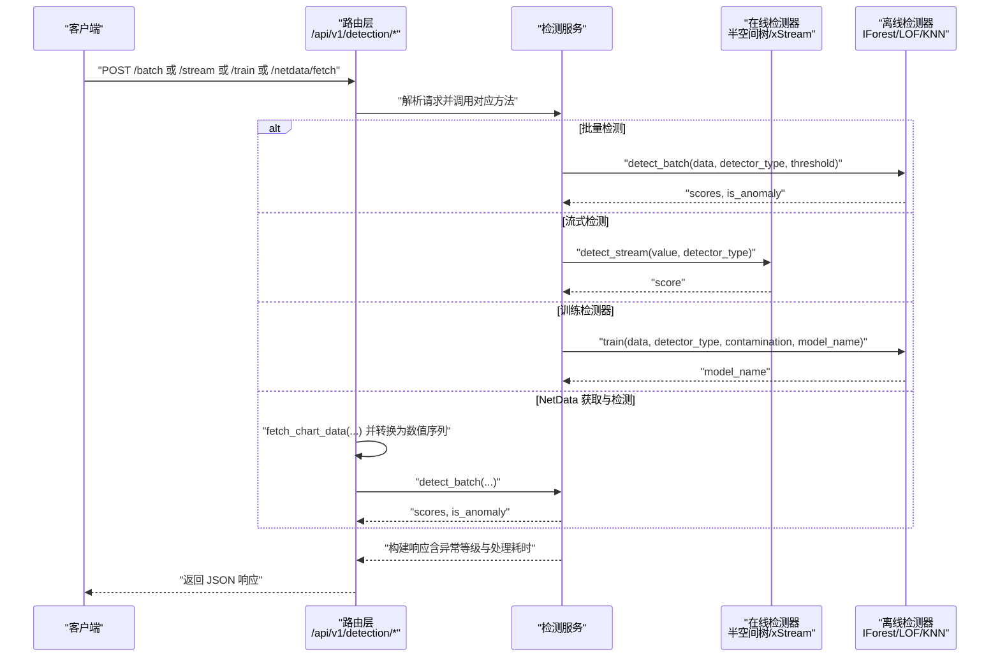
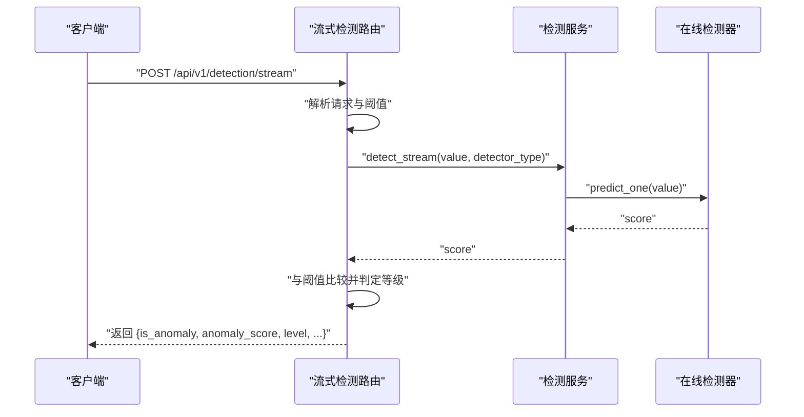
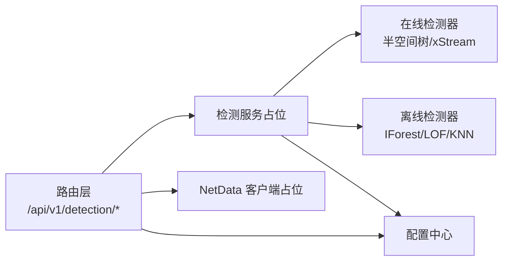

# PySAD 流式检测

<cite>
**本文引用的文件**
- [app/main.py](file://anomaly-detection-service/app/main.py)
- [app/api/routes/detection.py](file://anomaly-detection-service/app/api/routes/detection.py)
- [app/config.py](file://anomaly-detection-service/app/config.py)
- [app/models/schemas.py](file://anomaly-detection-service/app/models/schemas.py)
</cite>

## 目录
1. [简介](#简介)
2. [项目结构](#项目结构)
3. [核心组件](#核心组件)
4. [架构总览](#架构总览)
5. [详细组件分析](#详细组件分析)
6. [依赖关系分析](#依赖关系分析)
7. [性能考量](#性能考量)
8. [故障排查指南](#故障排查指南)
9. [结论](#结论)
10. [附录](#附录)

## 简介
本技术文档围绕 PySAD 在实时监控场景中的流式异常检测能力展开，结合项目现有实现，系统阐述在线异常检测的工作机制、滑动窗口策略、增量学习能力与实时性能优化，并对比流式检测与批量检测的差异及适用场景。文档同时提供配置参数说明、代码实现示例路径、高并发性能优化策略与常见问题排查建议。

## 项目结构
该项目采用 FastAPI 微服务架构，核心模块包括：
- 应用入口与生命周期管理
- 路由层（批量检测、流式检测、训练、NetData 集成）
- 配置中心（含 PySAD 在线检测参数）
- 数据模型（请求/响应、枚举、校验规则）

**图表来源**
- [app/main.py:76-102](file://anomaly-detection-service/app/main.py#L76-L102)
- [app/api/routes/detection.py:55-378](file://anomaly-detection-service/app/api/routes/detection.py#L55-L378)
- [app/config.py:105-137](file://anomaly-detection-service/app/config.py#L105-L137)
- [app/models/schemas.py:31-58](file://anomaly-detection-service/app/models/schemas.py#L31-L58)

**章节来源**
- [app/main.py:76-102](file://anomaly-detection-service/app/main.py#L76-L102)
- [app/api/routes/detection.py:55-378](file://anomaly-detection-service/app/api/routes/detection.py#L55-L378)
- [app/config.py:105-137](file://anomaly-detection-service/app/config.py#L105-L137)
- [app/models/schemas.py:31-58](file://anomaly-detection-service/app/models/schemas.py#L31-L58)

## 核心组件
- 应用入口与生命周期
  - 负责创建 FastAPI 实例、注册中间件（CORS、请求日志）、全局异常处理、注册路由与应用生命周期钩子。
  - 提供服务启动/关闭阶段的日志记录与资源管理占位。
- 路由层
  - 批量检测：接收多条时序数据，调用检测服务执行离线算法（隔离森林、LOF、KNN）。
  - 流式检测：接收单条数据点，调用检测服务执行在线算法（半空间树、xStream）。
  - 训练检测器：使用历史数据训练离线检测器并可持久化。
  - NetData 集成：从 NetData API 获取指标数据并进行批量检测。
- 配置中心
  - 包含 PySAD 在线检测相关参数（如滑动窗口大小），以及异常阈值、告警阈值、批处理上限等。
- 数据模型
  - 定义检测器类型枚举（离线/在线）、异常等级、请求/响应模型与字段校验规则。

**章节来源**
- [app/main.py:32-71](file://anomaly-detection-service/app/main.py#L32-L71)
- [app/main.py:107-140](file://anomaly-detection-service/app/main.py#L107-L140)
- [app/api/routes/detection.py:55-378](file://anomaly-detection-service/app/api/routes/detection.py#L55-L378)
- [app/config.py:105-137](file://anomaly-detection-service/app/config.py#L105-L137)
- [app/models/schemas.py:31-58](file://anomaly-detection-service/app/models/schemas.py#L31-L58)

## 架构总览
下图展示了从客户端请求到检测服务执行再到响应返回的整体流程，突出流式检测与批量检测的差异与集成点。

**图表来源**
- [app/api/routes/detection.py:55-378](file://anomaly-detection-service/app/api/routes/detection.py#L55-L378)
- [app/models/schemas.py:31-58](file://anomaly-detection-service/app/models/schemas.py#L31-L58)

## 详细组件分析

### 流式检测接口与工作机制
- 接口职责
  - 处理单条数据点的实时异常检测，返回异常标志、异常分数与异常等级。
  - 支持在线检测器类型：半空间树、xStream。
- 输入输出
  - 请求体包含数据点（时间戳、指标名、数值、主机、标签）与检测器类型；可选阈值覆盖默认值。
  - 响应包含是否异常、异常分数、异常等级、检测器类型与处理耗时。
- 处理流程
  - 解析请求，获取阈值（默认来自配置）。
  - 调用检测服务执行流式检测，得到异常分数后与阈值比较判定异常等级。
  - 记录处理耗时并返回响应。

**图表来源**
- [app/api/routes/detection.py:158-219](file://anomaly-detection-service/app/api/routes/detection.py#L158-L219)

**章节来源**
- [app/api/routes/detection.py:158-219](file://anomaly-detection-service/app/api/routes/detection.py#L158-L219)
- [app/models/schemas.py:132-153](file://anomaly-detection-service/app/models/schemas.py#L132-L153)

### 滑动窗口策略与增量学习
- 滑动窗口
  - 配置项 online_window_size 控制在线检测器的窗口大小，决定用于评估当前样本的历史样本数量。
- 增量学习
  - 在线检测器（半空间树、xStream）支持增量更新，能够适应数据分布的动态变化。
- 实时性能
  - 单条数据的检测开销极小，适合高并发实时监控场景。

**章节来源**
- [app/config.py:125-128](file://anomaly-detection-service/app/config.py#L125-L128)
- [app/models/schemas.py:39-41](file://anomaly-detection-service/app/models/schemas.py#L39-L41)

### 流式检测与批量检测的区别
- 数据形态
  - 流式检测：单条数据点，实时处理。
  - 批量检测：多条时序数据，离线处理。
- 算法选择
  - 流式检测：半空间树、xStream（在线/增量）。
  - 批量检测：隔离森林、LOF、KNN（离线/静态）。
- 适用场景
  - 流式检测：实时告警、在线学习、低延迟响应。
  - 批量检测：历史分析、模型验证、离线报表。
- 性能权衡
  - 流式检测延迟低、内存占用小，但可能受窗口大小与漂移适应性影响。
  - 批量检测可利用全局统计信息，但无法满足实时性需求。

**章节来源**
- [app/main.py:84-96](file://anomaly-detection-service/app/main.py#L84-L96)
- [app/api/routes/detection.py:62-153](file://anomaly-detection-service/app/api/routes/detection.py#L62-L153)

### 配置参数说明（与流式检测相关）
- 在线检测参数
  - online_window_size：滑动窗口大小，默认值与取值范围见配置文件。
- 阈值参数
  - anomaly_threshold：异常阈值（0-1），默认值与取值范围见配置文件。
  - alert_threshold：告警阈值（触发严重告警），默认值与取值范围见配置文件。
- 其他性能参数
  - max_batch_size：批量检测最大数量。
  - cache_ttl：结果缓存 TTL（秒）。

**章节来源**
- [app/config.py:125-137](file://anomaly-detection-service/app/config.py#L125-L137)

### 代码实现示例（路径指引）
- 流式数据接入
  - 路由定义与请求解析：[app/api/routes/detection.py:158-219](file://anomaly-detection-service/app/api/routes/detection.py#L158-L219)
  - 数据模型定义：[app/models/schemas.py:132-153](file://anomaly-detection-service/app/models/schemas.py#L132-L153)
- 实时异常检测
  - 调用检测服务执行流式检测：[app/api/routes/detection.py:188-191](file://anomaly-detection-service/app/api/routes/detection.py#L188-L191)
  - 检测服务方法（占位）：[app/api/routes/detection.py:42-44](file://anomaly-detection-service/app/api/routes/detection.py#L42-L44)
- 检测结果输出
  - 构建响应与异常等级判定：[app/api/routes/detection.py:195-211](file://anomaly-detection-service/app/api/routes/detection.py#L195-L211)
  - 响应模型定义：[app/models/schemas.py:256-271](file://anomaly-detection-service/app/models/schemas.py#L256-L271)

**章节来源**
- [app/api/routes/detection.py:158-219](file://anomaly-detection-service/app/api/routes/detection.py#L158-L219)
- [app/models/schemas.py:132-153](file://anomaly-detection-service/app/models/schemas.py#L132-L153)
- [app/models/schemas.py:256-271](file://anomaly-detection-service/app/models/schemas.py#L256-L271)

### 高并发场景下的性能表现与优化策略
- 并发与吞吐
  - 使用异步路由与异步检测服务方法，减少阻塞，提升并发处理能力。
  - 合理设置 workers 与连接池，避免 CPU/IO 抖动。
- 低延迟优化
  - 将在线检测器的 predict_one 作为纯计算步骤，避免外部 I/O。
  - 使用阈值缓存与轻量级日志记录，降低响应路径开销。
- 资源控制
  - 通过 max_batch_size 与 cache_ttl 控制内存与缓存压力。
  - 对异常等级判定与阈值比较进行向量化与分支优化（在服务实现中）。

**章节来源**
- [app/main.py:107-140](file://anomaly-detection-service/app/main.py#L107-L140)
- [app/config.py:142-145](file://anomaly-detection-service/app/config.py#L142-L145)

## 依赖关系分析
- 组件耦合
  - 路由层依赖检测服务与 NetData 客户端（占位），检测服务再依赖具体算法实现。
  - 配置中心集中提供阈值、窗口大小等参数，被路由层与检测服务共同消费。
- 外部依赖
  - PySAD 在线检测器（半空间树、xStream）与 PyOD 离线检测器（隔离森林、LOF、KNN）。
  - NetData API 用于获取指标数据。
- 可能的循环依赖
  - 当前结构清晰，无明显循环导入；检测服务与路由层通过函数调用解耦。

**图表来源**
- [app/api/routes/detection.py:42-49](file://anomaly-detection-service/app/api/routes/detection.py#L42-L49)
- [app/config.py:105-137](file://anomaly-detection-service/app/config.py#L105-L137)

**章节来源**
- [app/api/routes/detection.py:42-49](file://anomaly-detection-service/app/api/routes/detection.py#L42-L49)
- [app/config.py:105-137](file://anomaly-detection-service/app/config.py#L105-L137)

## 性能考量
- 算法复杂度
  - 在线检测器（半空间树、xStream）通常为 O(d) 每样本，其中 d 为特征维度；窗口大小影响评估成本。
  - 离线检测器（IF、LOF、KNN）在批量场景下可利用矩阵运算，但不适合实时流式。
- 实时性优化
  - 将阈值与等级判定逻辑置于内存中，避免重复计算。
  - 使用异步 I/O 与连接池，减少等待时间。
- 资源与稳定性
  - 合理设置 online_window_size，避免过大导致内存压力与延迟上升。
  - 通过 anomaly_threshold 与 alert_threshold 控制误报与漏报平衡。

[本节为通用性能讨论，无需特定文件来源]

## 故障排查指南
- 常见异常与处理
  - 全局异常：捕获未处理异常并返回统一错误格式，便于前端与监控系统识别。
  - 参数错误：对非法阈值、数据长度不足等情况进行明确提示。
- 日志与可观测性
  - 请求/响应日志包含处理耗时（毫秒），可用于定位慢请求。
  - 应用生命周期日志记录启动/关闭阶段的关键事件。
- 建议排查步骤
  - 检查请求体字段是否符合模型校验规则。
  - 核对配置中心的阈值与窗口参数是否合理。
  - 观察处理耗时与异常等级分布，判断是否存在数据漂移或阈值设置不当。

**章节来源**
- [app/main.py:145-172](file://anomaly-detection-service/app/main.py#L145-L172)
- [app/main.py:119-139](file://anomaly-detection-service/app/main.py#L119-L139)
- [app/models/schemas.py:123-129](file://anomaly-detection-service/app/models/schemas.py#L123-L129)

## 结论
本项目以 FastAPI 为基础，提供了完整的流式异常检测能力，支持在线检测器（半空间树、xStream）与离线检测器（隔离森林、LOF、KNN）。通过滑动窗口与增量学习，流式检测能够在实时监控场景中实现低延迟与自适应调整；配合合理的阈值与窗口参数，可在误报率与检测灵敏度之间取得良好平衡。建议在高并发场景中结合异步处理与资源控制策略，持续优化实时性能与稳定性。

[本节为总结性内容，无需特定文件来源]

## 附录

### API 定义概览（与流式检测相关）
- 批量检测
  - 方法与路径：POST /api/v1/detection/batch
  - 请求体：包含数据点列表、检测器类型、阈值与返回选项
  - 响应体：包含状态、检测器类型、阈值、总数、异常数、处理耗时与结果列表
- 流式检测
  - 方法与路径：POST /api/v1/detection/stream
  - 请求体：包含单个数据点、检测器类型、阈值
  - 响应体：包含是否异常、异常分数、异常等级、检测器类型、处理耗时
- 训练检测器
  - 方法与路径：POST /api/v1/detection/train
  - 请求体：包含训练数据、检测器类型、异常比例与模型名称
  - 响应体：包含状态、检测器类型、模型名称、训练样本数、训练耗时
- NetData 获取与检测
  - 方法与路径：POST /api/v1/detection/netdata/fetch
  - 请求体：包含图表名、时间范围、点数与主机
  - 响应体：与批量检测一致

**章节来源**
- [app/api/routes/detection.py:55-378](file://anomaly-detection-service/app/api/routes/detection.py#L55-L378)