# 异常检测 API 设计

<cite>
**本文档引用的文件**
- [main.py](file://anomaly-detection-service/app/main.py)
- [detection.py](file://anomaly-detection-service/app/api/routes/detection.py)
- [health.py](file://anomaly-detection-service/app/api/routes/health.py)
- [detection_service.py](file://anomaly-detection-service/app/services/detection_service.py)
- [schemas.py](file://anomaly-detection-service/app/models/schemas.py)
- [config.py](file://anomaly-detection-service/app/config.py)
- [detector_base.py](file://anomaly-detection-service/app/core/detector_base.py)
- [pyod_detector.py](file://anomaly-detection-service/app/core/pyod_detector.py)
- [client.py](file://anomaly-detection-service/app/netdata/client.py)
- [test_api.py](file://anomaly-detection-service/tests/test_api.py)
</cite>

## 目录
1. [简介](#简介)
2. [项目结构](#项目结构)
3. [核心组件](#核心组件)
4. [架构概览](#架构概览)
5. [详细组件分析](#详细组件分析)
6. [依赖关系分析](#依赖关系分析)
7. [性能考虑](#性能考虑)
8. [故障排除指南](#故障排除指南)
9. [结论](#结论)

## 简介

面向 NetData 监控数据的智能运维异常检测服务，基于 Python FastAPI 框架构建，集成了 PyOD 和 PySAD 异常检测算法。该服务提供实时异常检测能力，支持批量检测和流式检测两种模式，能够与 NetData 监控系统无缝集成。

## 项目结构

异常检测服务采用模块化设计，主要包含以下核心模块：

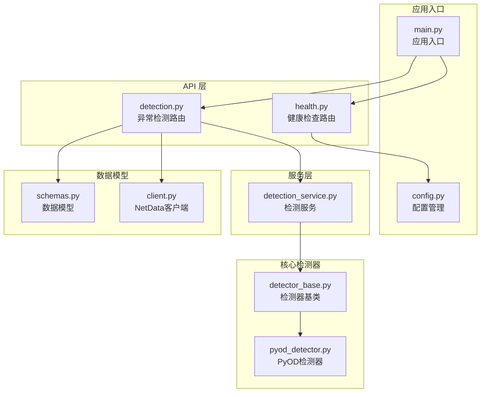

**图表来源**
- [main.py:1-217](file://anomaly-detection-service/app/main.py#L1-L217)
- [detection.py:1-378](file://anomaly-detection-service/app/api/routes/detection.py#L1-L378)
- [detection_service.py:1-334](file://anomaly-detection-service/app/services/detection_service.py#L1-L334)

**章节来源**
- [main.py:1-217](file://anomaly-detection-service/app/main.py#L1-L217)
- [config.py:1-183](file://anomaly-detection-service/app/config.py#L1-L183)

## 核心组件

### API 路由组件

服务提供三个主要的 API 接口：

1. **批量异常检测** (`/api/v1/detection/batch`)
2. **流式异常检测** (`/api/v1/detection/stream`)
3. **模型训练** (`/api/v1/detection/train`)
4. **健康检查** (`/api/health`, `/api/ready`, `/api/live`)

### 检测器类型

支持多种异常检测算法：

| 检测器类型 | 算法 | 适用场景 | 在线/离线 |
|------------|------|----------|-----------|
| isolation_forest | 隔离森林 | 高维数据，快速检测 | 离线 |
| lof | 局部异常因子 | 密度不均数据 | 离线 |
| knn | K-近邻 | 低维数据 | 离线 |
| half_space_trees | 半空间树 | 实时流式检测 | 在线 |
| xstream | xStream | 高维流式数据 | 在线 |

**章节来源**
- [detection.py:31-45](file://anomaly-detection-service/app/api/routes/detection.py#L31-L45)
- [schemas.py:31-42](file://anomaly-detection-service/app/models/schemas.py#L31-L42)

## 架构概览

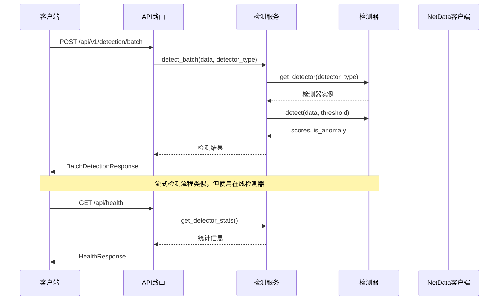

**图表来源**
- [detection.py:55-153](file://anomaly-detection-service/app/api/routes/detection.py#L55-L153)
- [detection_service.py:76-118](file://anomaly-detection-service/app/services/detection_service.py#L76-L118)
- [health.py:31-52](file://anomaly-detection-service/app/api/routes/health.py#L31-L52)

## 详细组件分析

### 批量异常检测接口

#### 接口定义
- **URL**: `/api/v1/detection/batch`
- **方法**: POST
- **功能**: 对一批时序数据进行异常检测

#### 请求参数

| 参数名 | 类型 | 必填 | 描述 | 默认值 |
|--------|------|------|------|--------|
| data | List[MetricDataPoint] | 是 | 待检测的数据点列表 | - |
| detector_type | DetectorType | 否 | 检测器类型 | isolation_forest |
| threshold | float | 否 | 异常阈值(0-1) | 配置文件中的异常阈值 |
| return_scores | bool | 否 | 是否返回异常分数 | true |

#### 响应数据结构

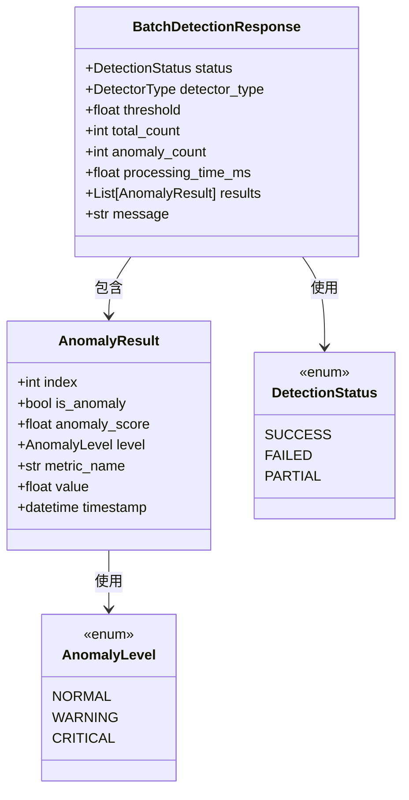

**图表来源**
- [schemas.py:238-254](file://anomaly-detection-service/app/models/schemas.py#L238-L254)
- [schemas.py:219-236](file://anomaly-detection-service/app/models/schemas.py#L219-L236)

#### 检测流程

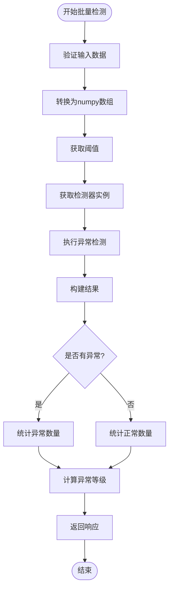

**图表来源**
- [detection.py:79-145](file://anomaly-detection-service/app/api/routes/detection.py#L79-L145)

**章节来源**
- [detection.py:55-153](file://anomaly-detection-service/app/api/routes/detection.py#L55-L153)
- [schemas.py:95-130](file://anomaly-detection-service/app/models/schemas.py#L95-L130)

### 流式异常检测接口

#### 接口定义
- **URL**: `/api/v1/detection/stream`
- **方法**: POST
- **功能**: 对单条数据进行实时异常检测

#### 请求参数

| 参数名 | 类型 | 必填 | 描述 | 默认值 |
|--------|------|------|------|--------|
| data_point | MetricDataPoint | 是 | 待检测的数据点 | - |
| detector_type | DetectorType | 否 | 在线检测器类型 | half_space_trees |
| threshold | float | 否 | 异常阈值(0-1) | 配置文件中的异常阈值 |

#### 响应数据结构

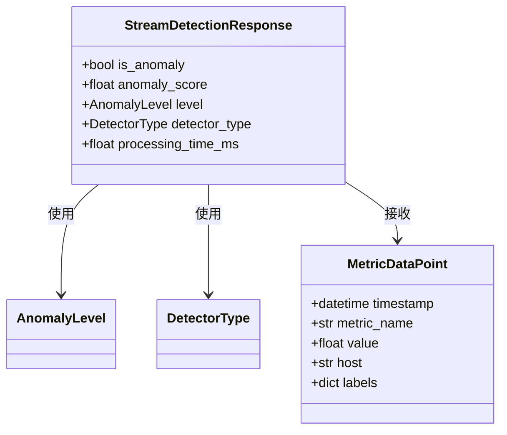

**图表来源**
- [schemas.py:256-271](file://anomaly-detection-service/app/models/schemas.py#L256-L271)
- [schemas.py:63-93](file://anomaly-detection-service/app/models/schemas.py#L63-L93)

#### 流式检测机制

流式检测使用在线检测器，支持实时数据处理：

1. **半空间树检测器** (`half_space_trees`): 适合实时监控场景
2. **xStream检测器** (`xstream`): 适合高维流式数据

**章节来源**
- [detection.py:158-219](file://anomaly-detection-service/app/api/routes/detection.py#L158-L219)
- [schemas.py:132-153](file://anomaly-detection-service/app/models/schemas.py#L132-L153)

### 模型训练接口

#### 接口定义
- **URL**: `/api/v1/detection/train`
- **方法**: POST
- **功能**: 使用历史数据训练离线检测器

#### 请求参数

| 参数名 | 类型 | 必填 | 描述 | 默认值 |
|--------|------|------|------|--------|
| training_data | List[MetricDataPoint] | 是 | 训练数据 | - |
| detector_type | DetectorType | 否 | 检测器类型 | isolation_forest |
| contamination | float | 否 | 预期异常比例(0.01-0.5) | 0.1 |
| model_name | str | 否 | 模型名称 | 自动生成 |

#### 响应数据结构

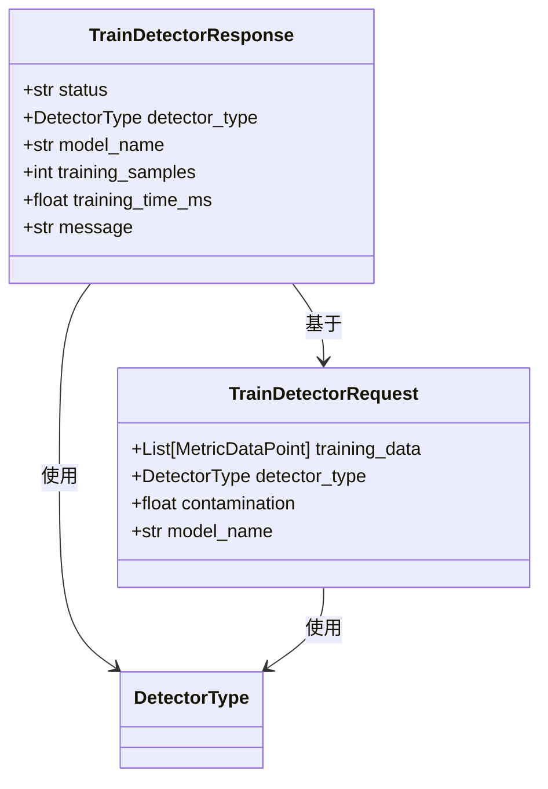

**图表来源**
- [schemas.py:273-284](file://anomaly-detection-service/app/models/schemas.py#L273-L284)
- [schemas.py:155-183](file://anomaly-detection-service/app/models/schemas.py#L155-L183)

#### 训练流程

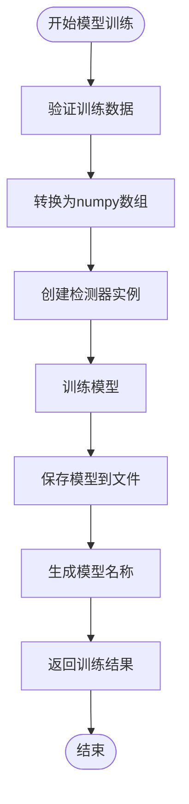

**图表来源**
- [detection_service.py:154-192](file://anomaly-detection-service/app/services/detection_service.py#L154-L192)

**章节来源**
- [detection.py:224-279](file://anomaly-detection-service/app/api/routes/detection.py#L224-L279)
- [schemas.py:155-183](file://anomaly-detection-service/app/models/schemas.py#L155-L183)

### 健康检查接口

#### 接口定义
- **URL**: `/api/health`
- **方法**: GET
- **功能**: 检查服务运行状态

#### 响应数据结构

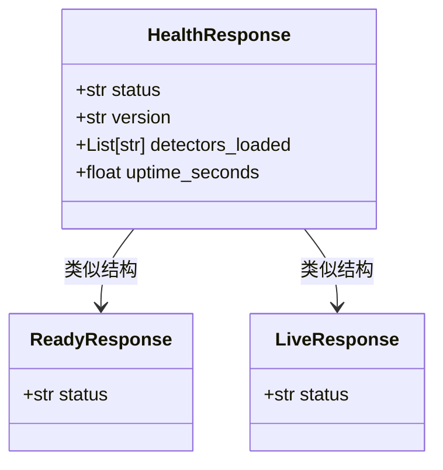

**图表来源**
- [schemas.py:286-298](file://anomaly-detection-service/app/models/schemas.py#L286-L298)

#### 健康检查机制

服务提供三种健康检查端点：

1. **/api/health**: 主要健康检查，返回服务状态、版本信息和运行时间
2. **/api/ready**: 就绪检查，用于 Kubernetes 就绪探针
3. **/api/live**: 存活检查，用于 Kubernetes 存活探针

**章节来源**
- [health.py:25-88](file://anomaly-detection-service/app/api/routes/health.py#L25-L88)
- [schemas.py:286-298](file://anomaly-detection-service/app/models/schemas.py#L286-L298)

## 依赖关系分析

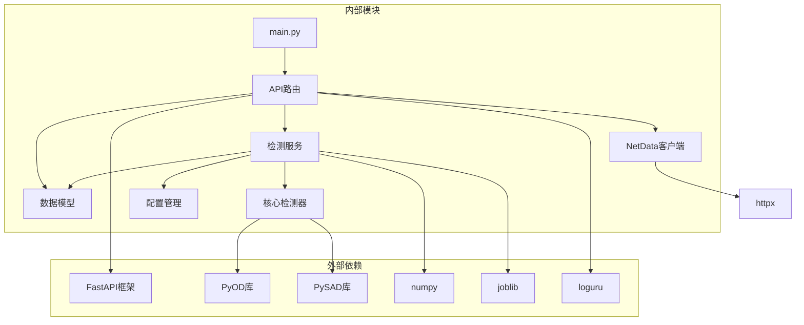

**图表来源**
- [main.py:21-27](file://anomaly-detection-service/app/main.py#L21-L27)
- [detection_service.py:24-34](file://anomaly-detection-service/app/services/detection_service.py#L24-L34)

### 检测器工厂模式

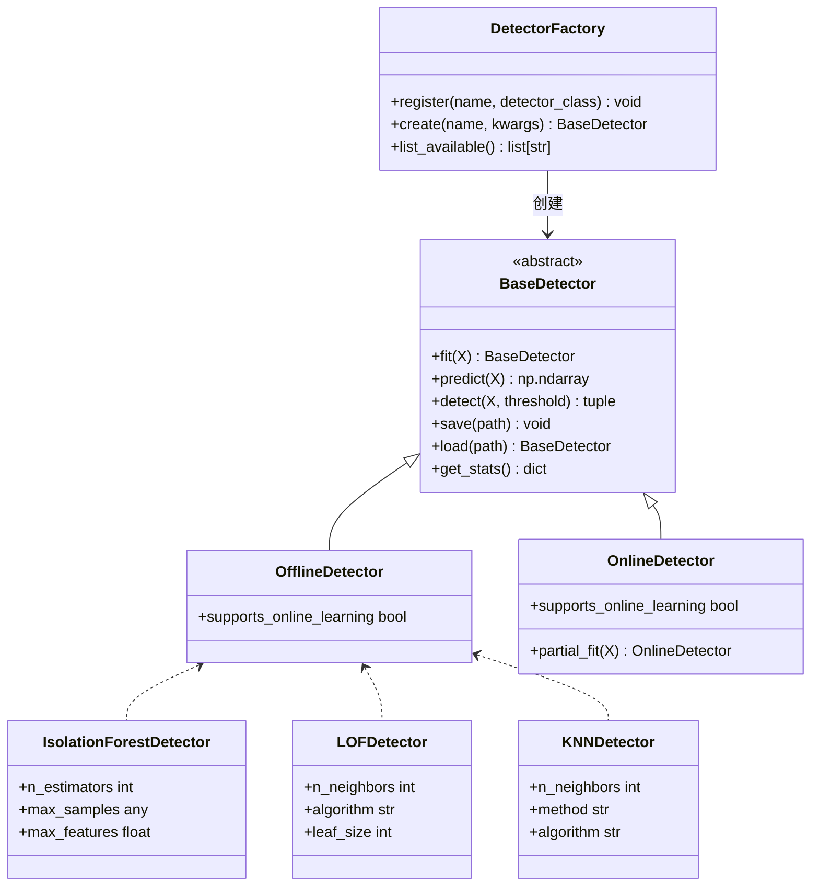

**图表来源**
- [detector_base.py:31-339](file://anomaly-detection-service/app/core/detector_base.py#L31-L339)
- [pyod_detector.py:31-287](file://anomaly-detection-service/app/core/pyod_detector.py#L31-L287)

**章节来源**
- [detector_base.py:288-339](file://anomaly-detection-service/app/core/detector_base.py#L288-L339)
- [pyod_detector.py:274-287](file://anomaly-detection-service/app/core/pyod_detector.py#L274-L287)

## 性能考虑

### 配置参数优化

| 配置项 | 默认值 | 优化建议 | 说明 |
|--------|--------|----------|------|
| anomaly_threshold | 0.7 | 0.6-0.8 | 异常检测阈值，影响误报率 |
| alert_threshold | 0.85 | 0.8-0.9 | 告警阈值，触发告警 |
| iforest_n_estimators | 100 | 50-200 | 隔离森林树数量，影响精度 |
| online_window_size | 100 | 50-500 | 在线检测滑动窗口大小 |
| max_batch_size | 10000 | 1000-50000 | 批量检测最大数量 |

### 检测器性能对比

| 检测器类型 | 训练时间 | 检测速度 | 内存占用 | 适用场景 |
|------------|----------|----------|----------|----------|
| isolation_forest | 中等 | 快速 | 低 | 高维数据 |
| lof | 较慢 | 中等 | 中等 | 密度不均数据 |
| knn | 快速 | 快速 | 中等 | 低维数据 |
| half_space_trees | 快速 | 极快 | 低 | 实时监控 |
| xstream | 中等 | 中等 | 中等 | 高维流式数据 |

## 故障排除指南

### 常见错误类型

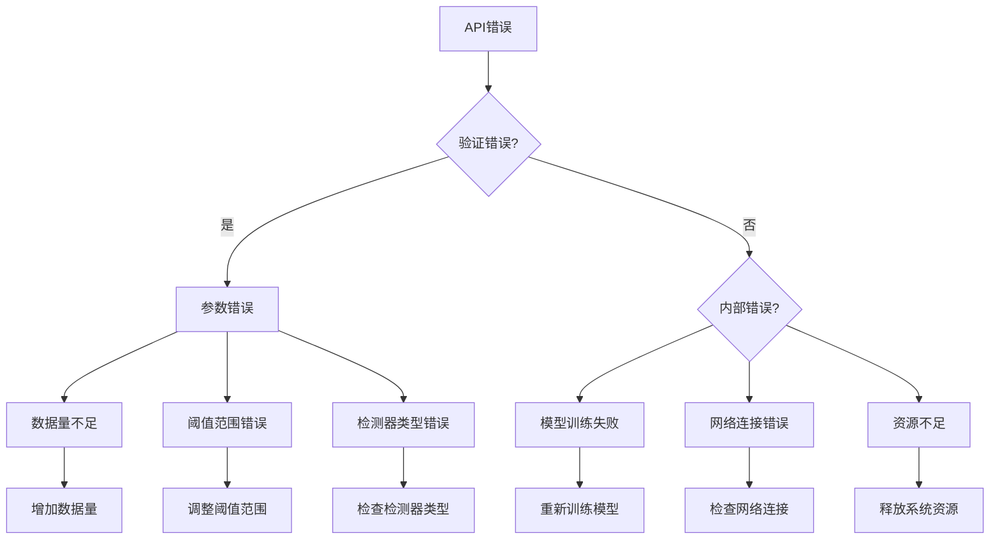

### 错误处理策略

1. **参数验证错误**: 返回 422 状态码和详细错误信息
2. **模型训练失败**: 返回 500 状态码和错误详情
3. **网络连接错误**: 返回 503 状态码和连接失败信息
4. **资源不足**: 返回 507 状态码和资源限制信息

**章节来源**
- [main.py:145-172](file://anomaly-detection-service/app/main.py#L145-L172)
- [detection.py:147-152](file://anomaly-detection-service/app/api/routes/detection.py#L147-L152)

## 结论

异常检测 API 设计提供了完整的实时异常检测解决方案，具有以下特点：

1. **模块化架构**: 清晰的分层设计，便于维护和扩展
2. **多算法支持**: 集成多种异常检测算法，适应不同场景需求
3. **高性能设计**: 优化的检测流程和资源配置
4. **完善的监控**: 全面的健康检查和错误处理机制
5. **易用性强**: 清晰的 API 接口和详细的文档说明

该设计为 NetData 监控系统提供了强大的异常检测能力，能够满足智能运维场景下的实时监控和告警需求。