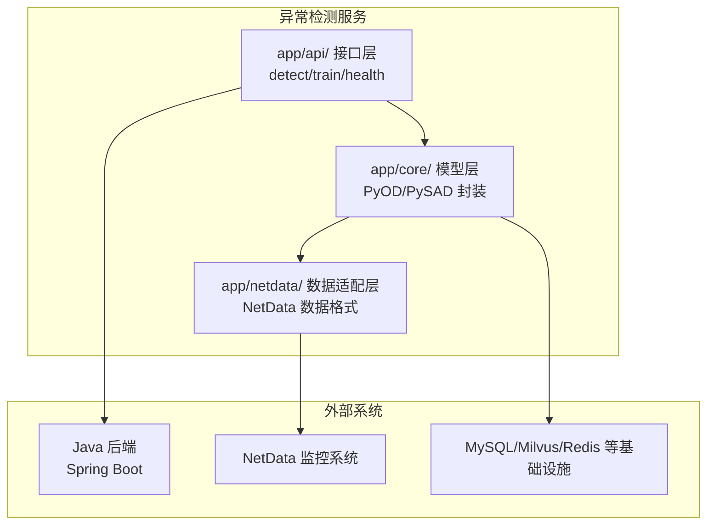
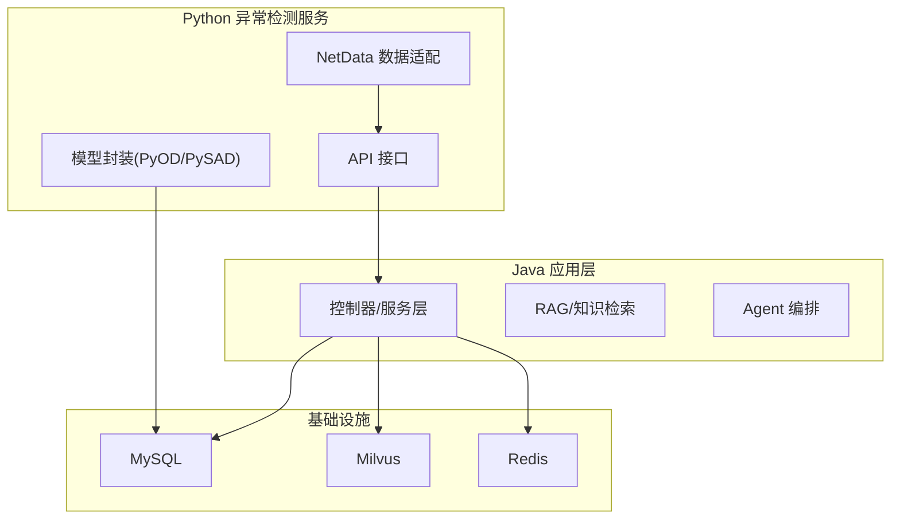
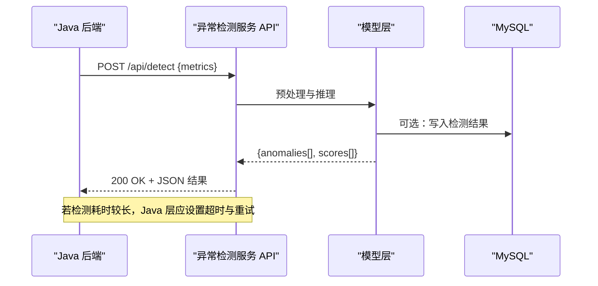
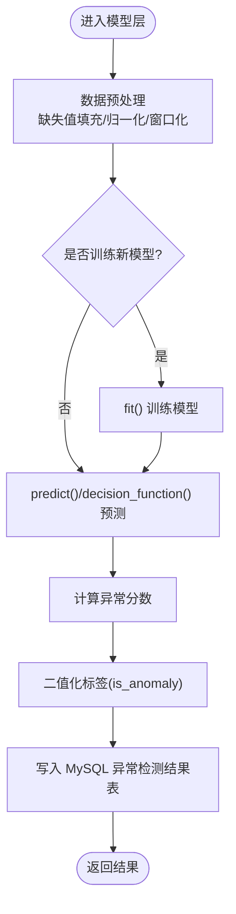
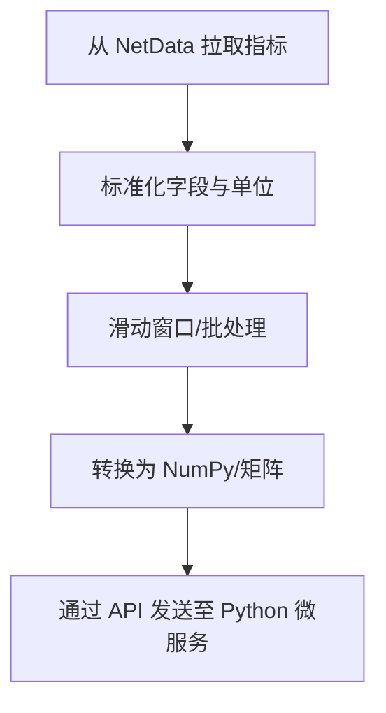
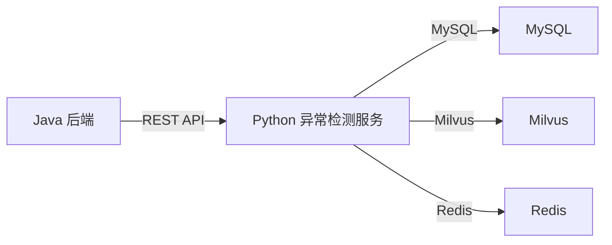

# 异常检测服务架构

<cite>
**本文引用的文件**
- [PROJECT_CONTEXT.md](file://PROJECT_CONTEXT.md)
- [开题报告_精简版.md](file://开题报告_精简版.md)
- [docker-compose.yml](file://docker-compose.yml)
- [config/milvus_collection.yaml](file://config/milvus_collection.yaml)
- [scripts/init_milvus.py](file://scripts/init_milvus.py)
- [sql/init.sql](file://sql/init.sql)
- [tests/test_milvus_connection.py](file://tests/test_milvus_connection.py)
</cite>

## 目录
1. [简介](#简介)
2. [项目结构](#项目结构)
3. [核心组件](#核心组件)
4. [架构总览](#架构总览)
5. [详细组件分析](#详细组件分析)
6. [依赖分析](#依赖分析)
7. [性能考虑](#性能考虑)
8. [故障排查指南](#故障排查指南)
9. [结论](#结论)
10. [附录](#附录)

## 简介
本文件面向“异常检测服务”这一核心子系统，围绕基于 Python FastAPI 的异常检测微服务展开，系统性阐述其整体设计思路、分层架构（数据采集层、异常检测层、结果处理层）、Python+Java 混合架构的优势与实现策略、与 Java 后端的数据交换机制（REST API 通信协议、数据格式定义、错误处理策略），以及服务启动配置、环境依赖与部署要求。该服务聚焦于面向 NetData 监控数据的异常检测，采用 PyOD/PySAD 算法，通过 REST API 将检测结果回传至 Java 后端，支撑上层智能问答与执行 Agent。

## 项目结构
异常检测服务位于独立目录中，采用三层结构：
- api：对外暴露 REST 接口（如 detect、train、health）
- core：封装 PyOD/PySAD 检测模型与训练流程
- netdata：适配 NetData 数据格式与采集接口

图表来源
- [PROJECT_CONTEXT.md:135-139](file://PROJECT_CONTEXT.md#L135-L139)

章节来源
- [PROJECT_CONTEXT.md:120-149](file://PROJECT_CONTEXT.md#L120-L149)

## 核心组件
- 接口层（API）
  - 提供异常检测触发、模型训练、健康检查等接口，作为与 Java 后端交互的入口。
- 模型层（Core）
  - 封装 PyOD/PySAD 检测器，负责数据预处理、模型训练与预测、异常评分与标签输出。
- 数据适配层（NetData）
  - 解析 NetData 的指标数据，转换为检测器可接受的时序/矩阵格式，补充时间戳与指标元信息。

章节来源
- [PROJECT_CONTEXT.md:135-139](file://PROJECT_CONTEXT.md#L135-L139)
- [开题报告_精简版.md:163-168](file://开题报告_精简版.md#L163-L168)

## 架构总览
异常检测服务采用“Python 微服务 + Java 应用层”的混合架构：
- Python 层专注于异常检测算法与实时数据处理，利用 PyOD/PySAD 的成熟生态与高性能实现。
- Java 层负责业务编排、智能推理、知识检索与执行调度，通过 REST API 与 Python 微服务通信。
- 基础设施层提供 MySQL、Milvus、Redis 等支撑组件，保障数据持久化、向量检索与缓存。

图表来源
- [PROJECT_CONTEXT.md:25-39](file://PROJECT_CONTEXT.md#L25-L39)
- [开题报告_精简版.md:118-152](file://开题报告_精简版.md#L118-L152)

## 详细组件分析

### 接口层（API）
职责
- 对外提供异常检测触发接口（如 detect），接收 NetData 指标数据或模型训练请求。
- 提供健康检查接口（health），便于运维与编排系统探测服务可用性。
- 将检测结果以结构化 JSON 返回，供 Java 后端消费。

数据交换协议
- HTTP/1.1，JSON 请求/响应体。
- 常见字段：host、metric_name、metric_value、timestamp、detector_type、anomaly_score、is_anomaly 等。
- 错误响应：HTTP 状态码 + 错误码/消息体，Java 层需设置合理的超时与重试策略。

图表来源
- [开题报告_精简版.md:167-168](file://开题报告_精简版.md#L167-L168)
- [PROJECT_CONTEXT.md:114](file://PROJECT_CONTEXT.md#L114)

章节来源
- [开题报告_精简版.md:163-168](file://开题报告_精简版.md#L163-L168)

### 模型层（Core）
职责
- 封装 PyOD/PySAD 检测器，提供统一的 fit/predict/infer 接口。
- 支持批量推理与流式推理，满足不同场景需求。
- 输出异常标签与异常分数，便于上层做阈值判定与告警聚合。

实现策略
- 无监督异常检测：基于历史窗口数据训练模型，滚动预测。
- 流式异常检测：基于滑动窗口与在线学习策略，适应指标趋势变化。
- 结果落库：将检测结果写入 MySQL 的异常检测结果表，便于后续分析与可视化。

图表来源
- [开题报告_精简版.md:165-168](file://开题报告_精简版.md#L165-L168)
- [sql/init.sql:201-217](file://sql/init.sql#L201-L217)

章节来源
- [开题报告_精简版.md:165-168](file://开题报告_精简版.md#L165-L168)
- [sql/init.sql:201-217](file://sql/init.sql#L201-L217)

### 数据适配层（NetData）
职责
- 从 NetData 的 REST API/WS 接口拉取指标数据，按时间序列组织。
- 将指标转换为检测器输入格式（如二维数组/DataFrame），附加时间戳与指标名。
- 与 Java 层约定数据格式，确保双方字段一致。

图表来源
- [开题报告_精简版.md:158-161](file://开题报告_精简版.md#L158-L161)

章节来源
- [开题报告_精简版.md:158-161](file://开题报告_精简版.md#L158-L161)

### 与 Java 后端的数据交换机制
- 通信协议：REST API（HTTP/1.1），JSON。
- 数据格式：异常检测结果包含 host、metric_name、metric_value、anomaly_score、is_anomaly、detector_type、detection_time 等字段。
- 错误处理：Java 层需设置合理超时（如 30-60 秒）与指数退避重试，避免 PyOD 处理大数据时的超时问题；Python 层返回标准错误码与消息，Java 层记录重试次数与失败原因。

章节来源
- [PROJECT_CONTEXT.md:114](file://PROJECT_CONTEXT.md#L114)
- [开题报告_精简版.md:167-168](file://开题报告_精简版.md#L167-L168)

## 依赖分析
- 技术栈与版本
  - 后端框架：Spring Boot 3.3.x（Java）
  - AI 框架：Spring AI 1.0.x
  - 异常检测：Python FastAPI + PyOD + PySAD
  - 向量数据库：Milvus 2.4
  - LLM：DeepSeek-V3 API（主）+ Ollama（本地调试）
  - 前端：Vue 3 + Element Plus
  - 关系数据库：MySQL 8.0
  - 缓存：Redis 7.x
  - 容器编排：Docker Compose

- 组件耦合与协作
  - Python 微服务与 Java 后端通过 REST API 解耦，便于独立演进与弹性伸缩。
  - 模型层与数据适配层内聚，接口清晰，便于替换检测算法或数据源。
  - 基础设施层（MySQL/Milvus/Redis）为两侧提供统一的数据与缓存能力。

图表来源
- [PROJECT_CONTEXT.md:25-39](file://PROJECT_CONTEXT.md#L25-L39)

章节来源
- [PROJECT_CONTEXT.md:25-39](file://PROJECT_CONTEXT.md#L25-L39)

## 性能考虑
- 检测延迟
  - Python 微服务应采用异步/并发处理（如多进程/多线程）与批量化推理，缩短端到端延迟。
  - 对于大数据量场景，建议分批处理与增量训练，避免一次性加载全部历史数据。
- 超时与重试
  - Java 层设置合理的超时与重试策略，避免 PyOD 处理超时导致的阻塞。
- 资源分配
  - Python 微服务容器应配置足够的 CPU/内存，确保模型推理与数据 IO 不成为瓶颈。
- 数据库与缓存
  - MySQL 异常检测结果表建立合适索引，减少查询延迟。
  - Redis 用于热点数据与临时状态缓存，降低数据库压力。

## 故障排查指南
- 健康检查
  - 通过 health 接口确认服务可用性，若失败检查日志与依赖服务（MySQL/Milvus/Redis）连通性。
- 数据格式问题
  - 确认 NetData 指标字段与 Python 微服务期望一致，避免解析失败。
- 检测结果异常
  - 检查模型训练数据质量与窗口参数，必要时重新训练或调整阈值。
- 数据库写入失败
  - 核查 MySQL 连接、权限与表结构，关注异常检测结果表的索引与约束。
- Milvus 相关
  - 参考 Milvus 配置与初始化脚本，确保 Collection、索引与搜索参数正确。

章节来源
- [开题报告_精简版.md:167-168](file://开题报告_精简版.md#L167-L168)
- [sql/init.sql:201-217](file://sql/init.sql#L201-L217)
- [config/milvus_collection.yaml:1-186](file://config/milvus_collection.yaml#L1-L186)
- [scripts/init_milvus.py:1-516](file://scripts/init_milvus.py#L1-L516)
- [tests/test_milvus_connection.py](file://tests/test_milvus_connection.py)

## 结论
异常检测服务通过 Python+Java 混合架构，充分发挥 Python 在异常检测领域的生态优势与 Java 在业务编排与智能推理方面的成熟能力。服务采用清晰的分层设计与 REST API 通信协议，配合完善的基础设施与错误处理策略，能够稳定支撑上层智能运维 Agent 的异常检测与根因分析需求。建议在后续阶段完善模型训练流水线、接入更多检测器与数据源，并持续优化端到端延迟与稳定性。

## 附录

### 启动配置与环境依赖
- 基础设施
  - 使用 Docker Compose 一键启动 Milvus、MySQL、Redis、Ollama 等服务。
  - 确保宿主机资源充足（尤其 Milvus 需要较高内存）。
- Python 微服务
  - 依赖：FastAPI、PyOD、PySAD、NumPy、Pandas、SQLAlchemy（可选，用于写入 MySQL）。
  - 部署：容器化部署，暴露健康检查与检测接口端口。
- Java 后端
  - 依赖：Spring Boot 3.3.x、Spring AI 1.0.x、MyBatis-Plus、Milvus SDK、Redis 客户端。
  - 配置：REST 调用超时与重试策略、数据库连接池、缓存策略。

章节来源
- [docker-compose.yml:1-357](file://docker-compose.yml#L1-L357)
- [PROJECT_CONTEXT.md:25-39](file://PROJECT_CONTEXT.md#L25-L39)