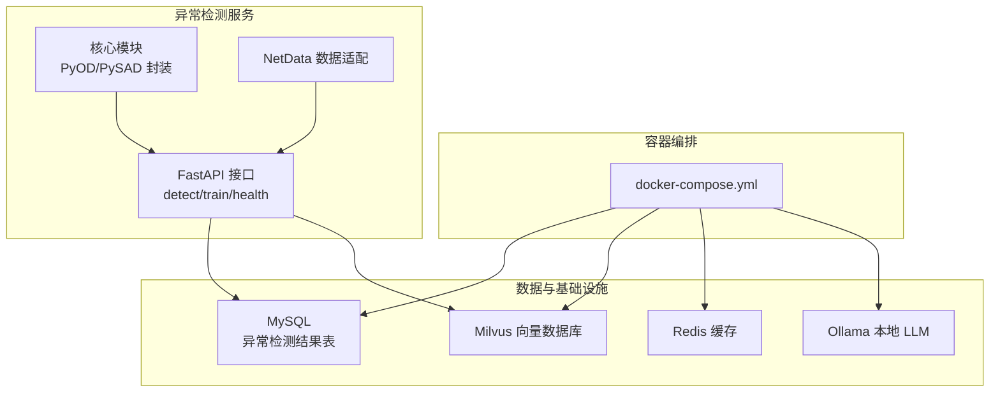
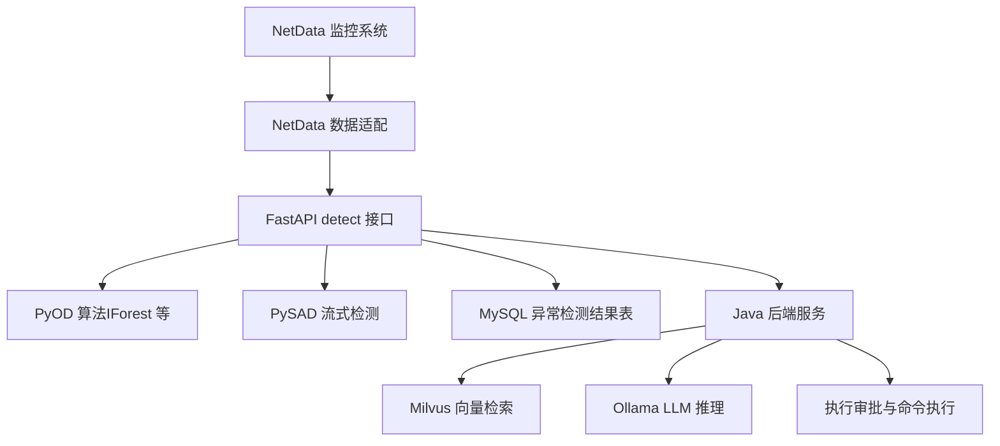
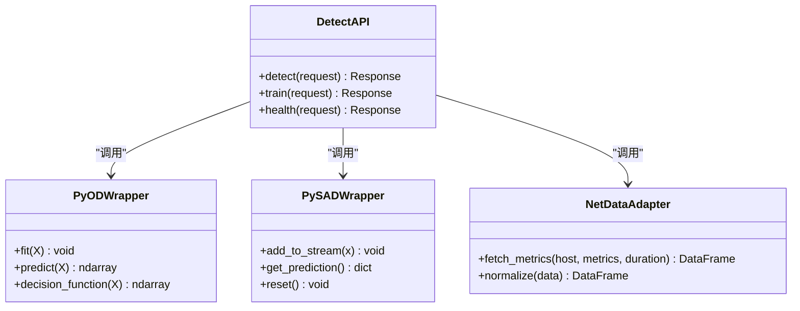
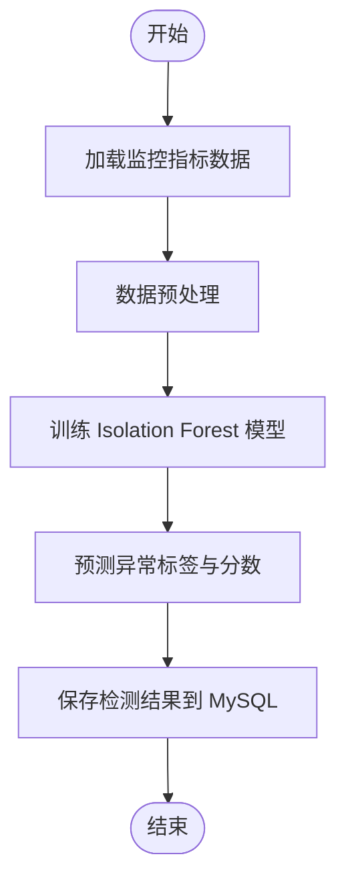
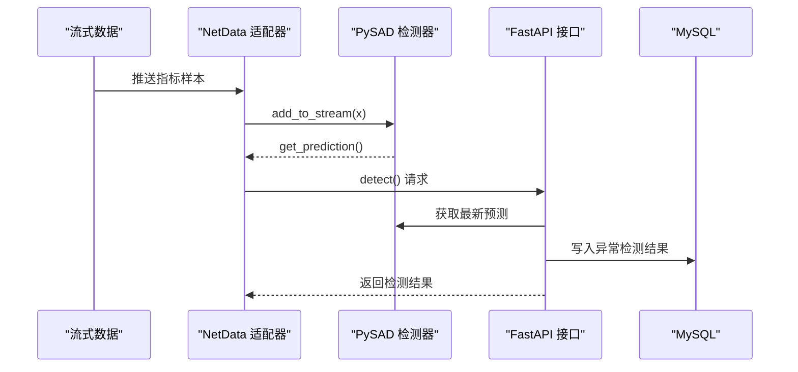
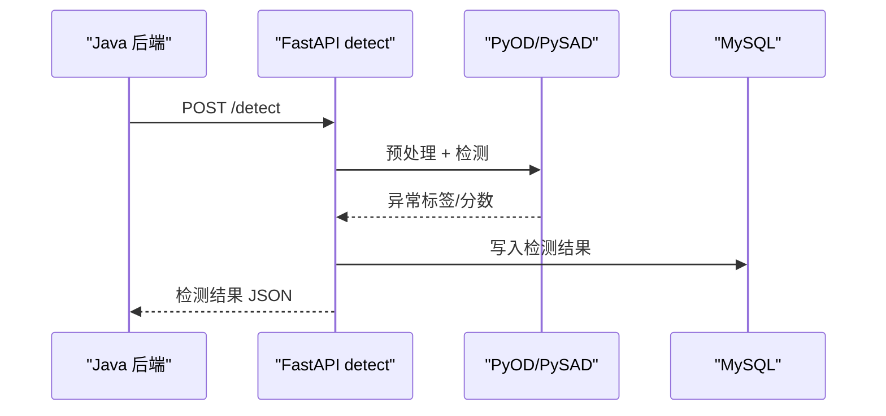
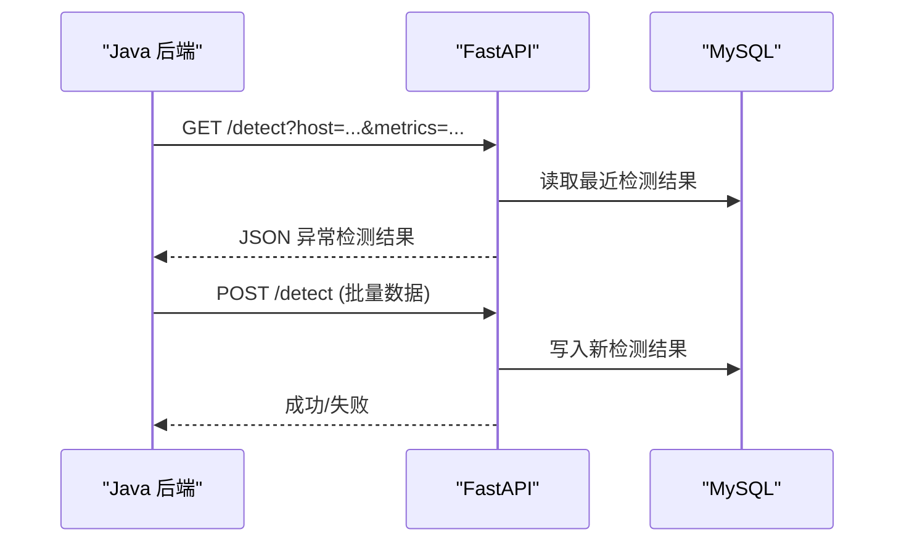
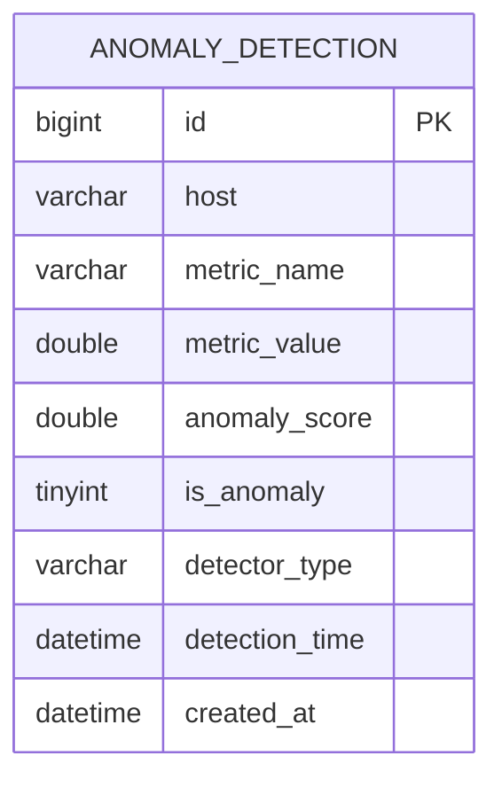
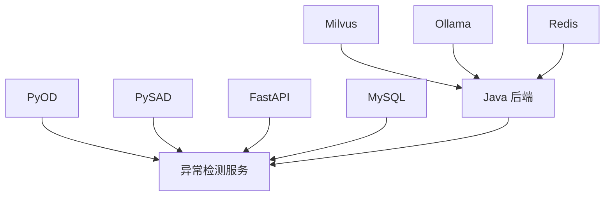

# 异常检测系统

<cite>
**本文引用的文件**
- [PROJECT_CONTEXT.md](file://PROJECT_CONTEXT.md)
- [docker-compose.yml](file://docker-compose.yml)
- [config/milvus_collection.yaml](file://config/milvus_collection.yaml)
- [scripts/init_milvus.py](file://scripts/init_milvus.py)
- [tests/test_milvus_connection.py](file://tests/test_milvus_connection.py)
- [sql/init.sql](file://sql/init.sql)
- [docs/prompts/orchestrator-system-prompt.md](file://docs/prompts/orchestrator-system-prompt.md)
- [docs/prompts/shared-safety-constraints.md](file://docs/prompts/shared-safety-constraints.md)
- [修改说明.md](file://修改说明.md)
- [开题报告_精简版.md](file://开题报告_精简版.md)
</cite>

## 目录
1. [简介](#简介)
2. [项目结构](#项目结构)
3. [核心组件](#核心组件)
4. [架构总览](#架构总览)
5. [详细组件分析](#详细组件分析)
6. [依赖分析](#依赖分析)
7. [性能考虑](#性能考虑)
8. [故障排除指南](#故障排除指南)
9. [结论](#结论)
10. [附录](#附录)

## 简介
本文件为面向 NetData 监控数据的异常检测服务技术文档，聚焦 Python FastAPI 异常检测微服务的设计与实现，涵盖：
- 基于 NetData 的监控数据接入与适配
- PyOD 算法集（如 Isolation Forest）的集成与配置
- PySAD 流式检测算法的应用与实时性能优化
- 异常检测 API 的接口定义与参数说明
- 与 Java 后端服务的数据交换机制与通信协议
- 异常检测结果格式与后续处理流程

该系统采用“Python 异常检测 + Java 应用层”的混合架构，异常检测服务通过 REST API 将检测结果传递给 Java 后端，由后端进行智能问答、根因分析与自动化执行。

## 项目结构
项目采用分层与模块化组织，异常检测服务位于独立目录，配合数据库与容器编排共同运行。

**图表来源**
- [docker-compose.yml:23-357](file://docker-compose.yml#L23-L357)
- [PROJECT_CONTEXT.md:120-149](file://PROJECT_CONTEXT.md#L120-L149)

**章节来源**
- [PROJECT_CONTEXT.md:120-149](file://PROJECT_CONTEXT.md#L120-L149)
- [docker-compose.yml:23-357](file://docker-compose.yml#L23-L357)

## 核心组件
- 异常检测服务（Python FastAPI）
  - 接口：detect、train、health
  - 算法：PyOD（Isolation Forest 等）、PySAD（流式检测）
  - 数据适配：NetData 监控指标
- Java 后端服务
  - Spring Boot + Spring AI
  - 负责智能问答、根因分析与执行审批
- 数据与中间件
  - MySQL：存储异常检测结果
  - Milvus：RAG 知识库向量检索
  - Redis：会话与缓存
  - Ollama：本地 LLM 推理

**章节来源**
- [PROJECT_CONTEXT.md:25-40](file://PROJECT_CONTEXT.md#L25-L40)
- [开题报告_精简版.md:93-117](file://开题报告_精简版.md#L93-L117)

## 架构总览
异常检测服务与 Java 后端通过 REST API 交互，形成“异常检测 + 智能推理 + 自动执行”的闭环。

**图表来源**
- [开题报告_精简版.md:163-169](file://开题报告_精简版.md#L163-L169)
- [开题报告_精简版.md:170-189](file://开题报告_精简版.md#L170-L189)
- [开题报告_精简版.md:198-221](file://开题报告_精简版.md#L198-L221)
- [开题报告_精简版.md:230-266](file://开题报告_精简版.md#L230-L266)
- [开题报告_精简版.md:275-301](file://开题报告_精简版.md#L275-L301)

## 详细组件分析

### FastAPI 异常检测服务
- 模块划分
  - api：REST 接口（detect、train、health）
  - core：算法封装（PyOD/PySAD）
  - netdata：NetData 数据适配
- 设计思路
  - 以接口为中心，职责清晰
  - 算法封装与数据适配解耦
  - 与 Java 后端通过 REST API 通信

**图表来源**
- [开题报告_精简版.md:163-169](file://开题报告_精简版.md#L163-L169)
- [开题报告_精简版.md:170-189](file://开题报告_精简版.md#L170-L189)

**章节来源**
- [开题报告_精简版.md:163-169](file://开题报告_精简版.md#L163-L169)
- [开题报告_精简版.md:170-189](file://开题报告_精简版.md#L170-L189)

### PyOD 算法集成（Isolation Forest 等）
- 集成方式
  - 使用 Isolation Forest 进行无监督异常检测
  - 支持 contamination 参数控制异常比例
  - predict/decision_function 输出异常标签与分数
- 配置要点
  - 数据预处理：归一化、缺失值处理
  - 模型训练：滑动窗口或批量训练
  - 结果落库：MySQL 异常检测结果表

**图表来源**
- [开题报告_精简版.md:170-189](file://开题报告_精简版.md#L170-L189)
- [sql/init.sql:199-217](file://sql/init.sql#L199-L217)

**章节来源**
- [开题报告_精简版.md:170-189](file://开题报告_精简版.md#L170-L189)
- [sql/init.sql:199-217](file://sql/init.sql#L199-L217)

### PySAD 流式检测算法
- 应用场景
  - 实时流式数据异常检测
  - 在线学习与增量更新
- 优化策略
  - 窗口大小与采样频率平衡
  - 内存与计算资源控制
  - 与 PyOD 的结果融合

**图表来源**
- [开题报告_精简版.md:163-169](file://开题报告_精简版.md#L163-L169)
- [开题报告_精简版.md:170-189](file://开题报告_精简版.md#L170-L189)
- [sql/init.sql:199-217](file://sql/init.sql#L199-L217)

**章节来源**
- [开题报告_精简版.md:163-169](file://开题报告_精简版.md#L163-L169)
- [sql/init.sql:199-217](file://sql/init.sql#L199-L217)

### 异常检测 API 说明
- detect 接口
  - 功能：对传入的监控指标序列进行异常检测
  - 输入：指标序列、时间窗口、检测器类型
  - 输出：异常标签、异常分数、检测时间
- train 接口
  - 功能：训练异常检测模型（离线/批量）
  - 输入：历史指标数据、标签（如有）
  - 输出：模型状态、训练指标
- health 接口
  - 功能：服务健康检查
  - 输出：服务状态、依赖组件状态

**图表来源**
- [开题报告_精简版.md:163-169](file://开题报告_精简版.md#L163-L169)
- [开题报告_精简版.md:170-189](file://开题报告_精简版.md#L170-L189)
- [sql/init.sql:199-217](file://sql/init.sql#L199-L217)

**章节来源**
- [开题报告_精简版.md:163-169](file://开题报告_精简版.md#L163-L169)
- [sql/init.sql:199-217](file://sql/init.sql#L199-L217)

### 与 Java 后端的数据交换机制
- 通信协议
  - REST API：HTTP/HTTPS
  - 超时与重试：Java 端需设置合理超时与重试策略，避免大数据传输超时
- 数据格式
  - JSON：请求与响应
  - 时间戳：统一使用 UTC
- 交互流程
  - Java 后端调用 detect 接口获取异常检测结果
  - 异常检测服务将结果写入 MySQL
  - Java 后端读取结果并进行后续推理与执行

**图表来源**
- [开题报告_精简版.md:163-169](file://开题报告_精简版.md#L163-L169)
- [开题报告_精简版.md:170-189](file://开题报告_精简版.md#L170-L189)
- [PROJECT_CONTEXT.md:114-116](file://PROJECT_CONTEXT.md#L114-L116)

**章节来源**
- [开题报告_精简版.md:163-169](file://开题报告_精简版.md#L163-L169)
- [PROJECT_CONTEXT.md:114-116](file://PROJECT_CONTEXT.md#L114-L116)

### 异常检测结果格式与后续处理
- 结果格式
  - 字段：host、metric_name、metric_value、anomaly_score、is_anomaly、detector_type、detection_time
  - 存储：MySQL 异常检测结果表
- 后续处理
  - Java 后端读取结果，结合 Milvus 知识库与 LLM 进行根因分析与建议生成
  - 对高风险异常触发执行审批流程

**图表来源**
- [sql/init.sql:199-217](file://sql/init.sql#L199-L217)

**章节来源**
- [sql/init.sql:199-217](file://sql/init.sql#L199-L217)

## 依赖分析
- 外部依赖
  - PyOD：无监督异常检测算法库
  - PySAD：流式异常检测算法库
  - FastAPI：异步 Web 框架
  - MySQL：关系型数据库
  - Milvus：向量数据库（用于 RAG）
  - Redis：缓存与会话
  - Ollama：本地 LLM 推理
- 服务依赖
  - Java 后端依赖异常检测服务的 REST API
  - 异常检测服务依赖 MySQL 与 Milvus

**图表来源**
- [PROJECT_CONTEXT.md:25-40](file://PROJECT_CONTEXT.md#L25-L40)
- [docker-compose.yml:23-357](file://docker-compose.yml#L23-L357)

**章节来源**
- [PROJECT_CONTEXT.md:25-40](file://PROJECT_CONTEXT.md#L25-L40)
- [docker-compose.yml:23-357](file://docker-compose.yml#L23-L357)

## 性能考虑
- 数据预处理
  - 归一化与缺失值处理，减少噪声对检测的影响
- 模型训练
  - 批量训练与增量训练结合，平衡准确率与实时性
- 流式检测
  - 控制窗口大小与采样频率，避免内存与计算压力
- 通信优化
  - Java 端设置合理的超时与重试策略，避免大数据传输超时
- 存储优化
  - MySQL 索引优化（host、metric_name、is_anomaly、detection_time）
  - Milvus 索引参数（nlist、nprobe）按数据规模调优

**章节来源**
- [开题报告_精简版.md:325-334](file://开题报告_精简版.md#L325-L334)
- [PROJECT_CONTEXT.md:114-116](file://PROJECT_CONTEXT.md#L114-L116)
- [config/milvus_collection.yaml:70-94](file://config/milvus_collection.yaml#L70-L94)

## 故障排除指南
- Milvus 连接与健康检查
  - 使用测试脚本验证 gRPC 连接与健康检查端点
  - 检查容器日志与端口映射
- 数据库初始化
  - 确认 MySQL 初始化脚本执行成功
  - 核对异常检测结果表结构
- Python 依赖
  - 确保安装 PyOD、PySAD、FastAPI 等依赖
  - 检查 Python 环境与版本兼容性
- Java 通信
  - 检查异常检测服务端口与防火墙
  - 配置合理的超时与重试策略

**章节来源**
- [tests/test_milvus_connection.py:33-116](file://tests/test_milvus_connection.py#L33-L116)
- [sql/init.sql:199-217](file://sql/init.sql#L199-L217)
- [开题报告_精简版.md:325-334](file://开题报告_精简版.md#L325-L334)

## 结论
本异常检测服务以 Python FastAPI 为核心，结合 PyOD 与 PySAD 实现离线与在线异常检测，并通过 REST API 与 Java 后端紧密协作，支撑智能运维问答与执行系统。系统采用清晰的模块划分与接口设计，具备良好的扩展性与可维护性。后续可在模型融合、流式窗口优化与通信协议改进等方面持续优化。

## 附录
- 安全约束与合规
  - 命令执行需经安全审核与人工审批
  - 日志审计与敏感信息脱敏
- Prompt 管理与配置
  - 使用集中式 Prompt 管理，避免硬编码
  - LLM 切换通过 Profile 配置，支持 API 与本地模型

**章节来源**
- [docs/prompts/shared-safety-constraints.md:29-128](file://docs/prompts/shared-safety-constraints.md#L29-L128)
- [docs/prompts/orchestrator-system-prompt.md:70-106](file://docs/prompts/orchestrator-system-prompt.md#L70-L106)
- [修改说明.md:198-217](file://修改说明.md#L198-L217)