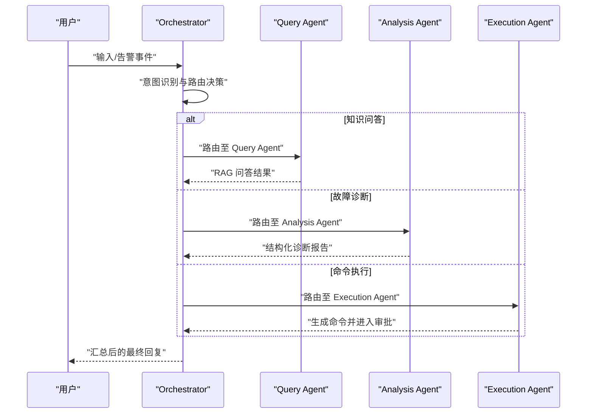
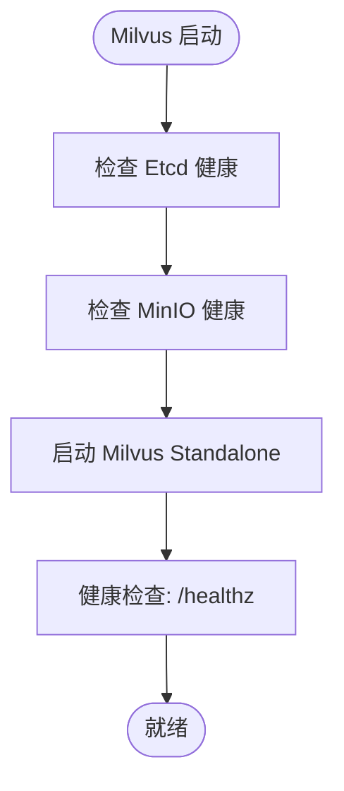

# 快速开始

<cite>
**本文引用的文件**
- [docker-compose.yml](file://docker-compose.yml)
- [verify-env.sh](file://scripts/verify-env.sh)
- [verify-env.ps1](file://scripts/verify-env.ps1)
- [PROJECT_CONTEXT.md](file://PROJECT_CONTEXT.md)
- [开题报告_精简版.md](file://开题报告_精简版.md)
- [milvus_collection.yaml](file://config/milvus_collection.yaml)
- [init.sql](file://sql/init.sql)
- [orchestrator-system-prompt.md](file://docs/prompts/orchestrator-system-prompt.md)
- [shared-safety-constraints.md](file://docs/prompts/shared-safety-constraints.md)
</cite>

## 目录
1. [简介](#简介)
2. [项目结构](#项目结构)
3. [核心组件](#核心组件)
4. [架构概览](#架构概览)
5. [详细组件分析](#详细组件分析)
6. [依赖关系分析](#依赖关系分析)
7. [性能考虑](#性能考虑)
8. [故障排查指南](#故障排查指南)
9. [结论](#结论)
10. [附录](#附录)

## 简介
本指南面向新手开发者，帮助你在最短时间内成功运行智能运维问答系统。系统基于 NetData 监控数据，结合 RAG（检索增强生成）与多 Agent 协同，提供自然语言问答、智能故障诊断与安全的人机协作执行能力。你将学会：
- 环境准备与验证（Docker、端口、资源）
- 一键部署（Docker Compose）
- 系统启动与访问
- 常见问题排查与解决方案

## 项目结构
系统采用 Docker Compose 编排，核心服务包括：
- Milvus 向量数据库（Standalone 模式）
- MySQL 关系数据库
- Redis 缓存
- Ollama 本地 LLM 推理
- 可选：Neo4j 知识图谱（进阶功能）

```mermaid
graph TB
subgraph "网络: netdata-ops-network"
MYSQL["MySQL<br/>3306"]
REDIS["Redis<br/>6379"]
MILVUS_ETCD["Milvus Etcd<br/>2379"]
MILVUS_MINIO["Milvus MinIO<br/>9000/9001"]
MILVUS_STANDALONE["Milvus Standalone<br/>19530/9091"]
OLLAMA["Ollama<br/>11434"]
# NEO4J["Neo4j<br/>7474/7687"]
end
MYSQL --- MILVUS_MINIO
MYSQL --- REDIS
MILVUS_STANDALONE --- MILVUS_ETCD
MILVUS_STANDALONE --- MILVUS_MINIO
OLLAMA --- REDIS
```

图表来源
- [docker-compose.yml:23-357](file://docker-compose.yml#L23-L357)

章节来源
- [docker-compose.yml:1-357](file://docker-compose.yml#L1-L357)
- [PROJECT_CONTEXT.md:120-149](file://PROJECT_CONTEXT.md#L120-L149)

## 核心组件
- Milvus（向量数据库）：用于 RAG 检索，Standalone 模式便于开发与演示。
- MySQL：存储用户、对话、命令执行审计、告警记录等结构化数据。
- Redis：会话缓存、RAG 结果缓存、分布式锁、实时告警去重。
- Ollama：本地 LLM 推理服务，支持离线与隐私保护场景。
- Neo4j（可选）：知识图谱，用于 Graph RAG 与实体关系建模。

章节来源
- [docker-compose.yml:23-357](file://docker-compose.yml#L23-L357)
- [PROJECT_CONTEXT.md:25-39](file://PROJECT_CONTEXT.md#L25-L39)

## 架构概览
系统采用“编排代理 + 多子 Agent”的协作模式：
- Orchestrator Agent：意图识别、任务路由、结果汇总
- Query Agent：RAG 问答
- Analysis Agent：ReAct 诊断
- Execution Agent：命令生成、风险评估、人工审批、执行与记录



图表来源
- [orchestrator-system-prompt.md:1-291](file://docs/prompts/orchestrator-system-prompt.md#L1-L291)

章节来源
- [开题报告_精简版.md:118-152](file://开题报告_精简版.md#L118-L152)
- [orchestrator-system-prompt.md:37-57](file://docs/prompts/orchestrator-system-prompt.md#L37-L57)

## 详细组件分析

### Milvus 向量数据库
- 模式：Standalone，便于开发与演示
- 依赖：Etcd（集群协调）、MinIO（对象存储后端）
- 端口：19530（gRPC SDK）、9091（Metrics）
- 健康检查：Prometheus 指标端口健康检查
- 资源：建议分配 4G 内存起步



图表来源
- [docker-compose.yml:99-154](file://docker-compose.yml#L99-L154)
- [milvus_collection.yaml:1-186](file://config/milvus_collection.yaml#L1-L186)

章节来源
- [docker-compose.yml:99-154](file://docker-compose.yml#L99-L154)
- [milvus_collection.yaml:1-186](file://config/milvus_collection.yaml#L1-L186)

### MySQL 关系数据库
- 版本：8.0，使用 mysql_native_password 兼容旧客户端
- 端口：3306
- 初始化：首次启动自动执行 sql/init.sql
- 时区：Asia/Shanghai

章节来源
- [docker-compose.yml:163-208](file://docker-compose.yml#L163-L208)
- [init.sql:1-274](file://sql/init.sql#L1-L274)

### Redis 缓存
- 版本：7.2-alpine，体积小、启动快
- 端口：6379
- 持久化：AOF（通过配置文件启用）

章节来源
- [docker-compose.yml:218-246](file://docker-compose.yml#L218-L246)

### Ollama 本地 LLM
- 端口：11434
- 模型存储：建议预留足够磁盘空间
- GPU 支持：可选 nvidia-docker 配置

章节来源
- [docker-compose.yml:258-290](file://docker-compose.yml#L258-L290)

### Neo4j（可选）
- 端口：7474（HTTP）、7687（Bolt）
- 插件：APoc
- 资源：建议 2G 内存起步

章节来源
- [docker-compose.yml:291-323](file://docker-compose.yml#L291-L323)

## 依赖关系分析
- 服务依赖
  - Milvus Standalone 依赖 Etcd 与 MinIO
  - MySQL 依赖初始化脚本与配置文件
  - Redis 依赖持久化配置
  - Ollama 依赖模型存储空间
- 网络隔离：使用自定义桥接网络，服务间通过容器名互访
- 卷管理：开发环境使用绑定挂载，生产环境推荐命名卷

```mermaid
graph LR
MYSQL["MySQL"] --> INIT["初始化脚本 init.sql"]
MYSQL --> REDIS["Redis"]
MILVUS["Milvus Standalone"] --> ETCD["Etcd"]
MILVUS --> MINIO["MinIO"]
OLLAMA["Ollama"] --> REDIS
# NEO4J["Neo4j"] --> REDIS
```

图表来源
- [docker-compose.yml:23-357](file://docker-compose.yml#L23-L357)
- [init.sql:1-274](file://sql/init.sql#L1-L274)

章节来源
- [docker-compose.yml:327-357](file://docker-compose.yml#L327-L357)

## 性能考虑
- 资源分配
  - Milvus：建议至少 4G 内存，Docker 总内存 ≥ 8G
  - Ollama：CPU/GPU 密集型，建议 8G+ 内存
- 端口与网络
  - 确保端口未被占用（MySQL、Redis、Milvus、Ollama、MinIO）
  - 使用自定义网络减少冲突
- 数据持久化
  - 绑定挂载便于开发调试，注意权限与磁盘空间
  - 生产环境建议使用命名卷提升性能与可移植性

[本节为通用建议，不直接分析具体文件]

## 故障排查指南

### 环境准备与验证
- Docker 与 Compose
  - 检查 Docker 服务状态与版本
  - 检查 Docker Compose（V1/V2）是否可用
- 端口占用
  - 检查 3306、6379、19530、9091、11434、9000、9001 是否被占用
- 配置文件
  - 确认 docker-compose.yml、.env、配置目录存在
- 数据目录
  - 确认 data/mysql、data/redis、data/milvus、data/ollama 存在且可写
- 健康检查
  - 使用脚本检查各服务健康状态
  - 若不健康，查看对应服务日志

章节来源
- [verify-env.sh:64-286](file://scripts/verify-env.sh#L64-L286)
- [verify-env.ps1:35-227](file://scripts/verify-env.ps1#L35-L227)

### 常见问题与解决方案
- Milvus 启动缓慢或不健康
  - 增加 Docker 内存分配（≥ 4G）
  - 等待健康检查通过（Milvus 启动较慢）
- Ollama 模型加载慢
  - 确认模型存储目录空间充足
  - 首次拉取模型需网络，建议提前准备
- MySQL 初始化失败
  - 检查初始化脚本语法与字符集设置
  - 确认时区配置正确
- Redis 连接失败
  - 检查密码配置与持久化配置文件
- 端口冲突
  - 修改 .env 中对应端口变量或释放占用端口

章节来源
- [docker-compose.yml:106-138](file://docker-compose.yml#L106-L138)
- [docker-compose.yml:187-199](file://docker-compose.yml#L187-L199)
- [docker-compose.yml:229-237](file://docker-compose.yml#L229-L237)
- [docker-compose.yml:274-280](file://docker-compose.yml#L274-L280)

### 系统启动与访问
- 启动
  - 使用 Docker Compose 一键启动：docker-compose up -d
  - 查看服务状态：docker-compose ps
- 访问
  - Milvus：gRPC 端口 19530，Metrics 端口 9091
  - MinIO：API 端口 9000，控制台 9001
  - MySQL：端口 3306
  - Redis：端口 6379
  - Ollama：端口 11434
- 验证
  - 使用脚本进行健康检查与连接测试
  - 登录 MySQL/Redis 验证连接
  - curl 检查 Milvus/Ollama 健康端点

章节来源
- [docker-compose.yml:11-21](file://docker-compose.yml#L11-L21)
- [verify-env.sh:289-318](file://scripts/verify-env.sh#L289-L318)
- [verify-env.ps1:230-248](file://scripts/verify-env.ps1#L230-L248)

## 结论
通过本指南，你可以完成环境准备、一键部署与系统验证。建议在开发阶段重点关注 Milvus 与 Ollama 的资源分配，确保端口与网络配置正确。随着系统逐步完善，可引入 Neo4j、前端与后端服务，构建完整的智能运维平台。

[本节为总结，不直接分析具体文件]

## 附录

### 环境准备清单
- Docker Desktop（Linux/macOS/Windows）
- Docker Compose（V1 或 V2）
- 至少 8GB 内存（建议 16GB+）
- 开放端口：3306、6379、19530、9091、11434、9000、9001
- .env 配置文件（复制 .env.example 并修改密码）

章节来源
- [verify-env.sh:68-97](file://scripts/verify-env.sh#L68-L97)
- [verify-env.ps1:39-71](file://scripts/verify-env.ps1#L39-L71)

### 环境验证脚本使用方法
- Linux/macOS
  - chmod +x scripts/verify-env.sh
  - ./scripts/verify-env.sh
- Windows
  - PowerShell：Set-ExecutionPolicy -ExecutionPolicy RemoteSigned -Scope CurrentUser
  - .\scripts\verify-env.ps1

章节来源
- [verify-env.sh:8-14](file://scripts/verify-env.sh#L8-L14)
- [verify-env.ps1:7-12](file://scripts/verify-env.ps1#L7-L12)

### 安全与合规
- 命令执行安全：严格区分可自动执行、需审批与绝对禁止的命令
- 数据脱敏：日志与输出中避免泄露敏感信息
- 权限控制：基于角色的最小权限原则
- 审计日志：记录所有关键操作，保留至少 90 天

章节来源
- [shared-safety-constraints.md:29-96](file://docs/prompts/shared-safety-constraints.md#L29-L96)
- [shared-safety-constraints.md:233-260](file://docs/prompts/shared-safety-constraints.md#L233-L260)