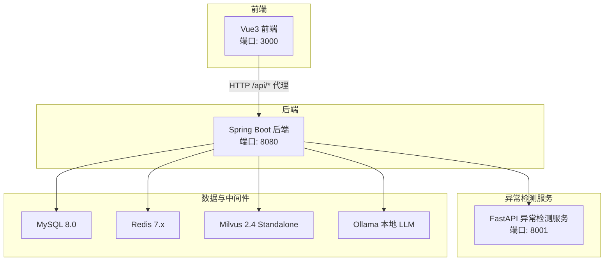
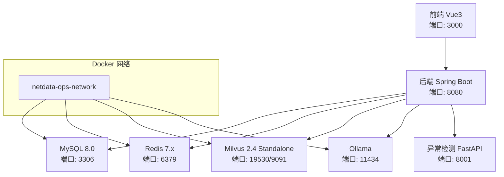
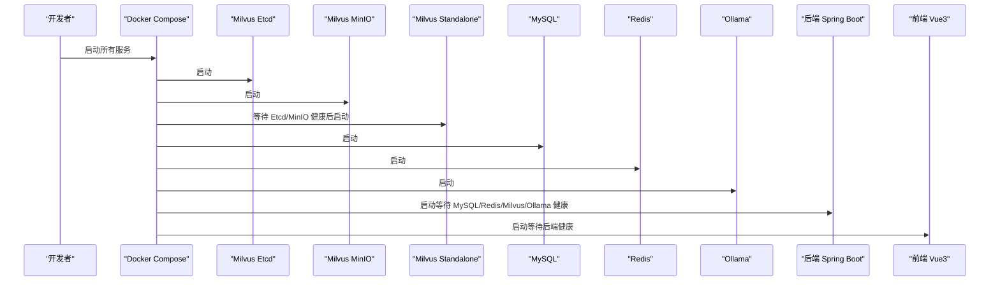
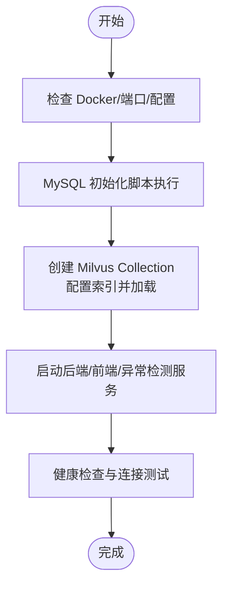
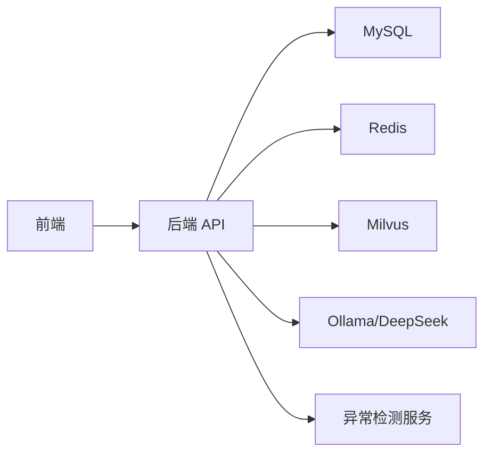

# 快速开始

<cite>
**本文引用的文件**
- [docker-compose.yml](file://docker-compose.yml)
- [verify-env.sh](file://scripts/verify-env.sh)
- [verify-env.ps1](file://scripts/verify-env.ps1)
- [init_milvus.py](file://scripts/init_milvus.py)
- [milvus_collection.yaml](file://config/milvus_collection.yaml)
- [init.sql](file://sql/init.sql)
- [application.yml](file://netdata-ai-backend/src/main/resources/application.yml)
- [pom.xml](file://netdata-ai-backend/pom.xml)
- [package.json](file://netdata-ai-frontend/package.json)
- [vite.config.ts](file://netdata-ai-frontend/vite.config.ts)
- [Dockerfile（异常检测服务）](file://anomaly-detection-service/Dockerfile)
- [requirements.txt（异常检测服务）](file://anomaly-detection-service/requirements.txt)
- [pyproject.toml（异常检测服务）](file://anomaly-detection-service/pyproject.toml)
- [README.md（异常检测服务）](file://anomaly-detection-service/README.md)
- [deployment_guide.md](file://docs/deployment_guide.md)
</cite>

## 目录
1. [简介](#简介)
2. [项目结构](#项目结构)
3. [核心组件](#核心组件)
4. [架构总览](#架构总览)
5. [详细组件分析](#详细组件分析)
6. [依赖关系分析](#依赖关系分析)
7. [性能考虑](#性能考虑)
8. [故障排查指南](#故障排查指南)
9. [结论](#结论)
10. [附录](#附录)

## 简介
本“快速开始”旨在帮助开发者在本地或容器环境中快速搭建并运行整个系统。内容覆盖环境要求、依赖安装与配置、Docker Compose 部署流程（含启动顺序与依赖关系）、本地开发环境初始化（数据库、Milvus、缓存与服务启动）、常见问题排查以及基本使用与验证步骤。

## 项目结构
系统采用多模块架构，包含：
- 后端服务（Spring Boot）：负责认证授权、RAG、命令执行、WebSocket 实时通知、与前端及异常检测服务交互
- 前端（Vue3 + Vite）：提供登录、聊天、知识库、告警、执行审批等界面
- 异常检测服务（FastAPI + PyOD/PySAD）：提供批量与流式异常检测能力，并对接 NetData 指标
- 数据与中间件：MySQL（关系数据）、Redis（缓存/会话/锁）、Milvus（向量检索）、Ollama（本地 LLM）

图表来源
- [docker-compose.yml](file://docker-compose.yml)
- [vite.config.ts](file://netdata-ai-frontend/vite.config.ts)
- [application.yml](file://netdata-ai-backend/src/main/resources/application.yml)

章节来源
- [docker-compose.yml](file://docker-compose.yml)
- [vite.config.ts](file://netdata-ai-frontend/vite.config.ts)
- [application.yml](file://netdata-ai-backend/src/main/resources/application.yml)

## 核心组件
- 后端服务（Spring Boot 3.3.x，JDK 17+）
  - 使用 Spring Web/WebFlux、Security/JWT、MyBatis-Plus、Redis、Milvus SDK、Spring AI OpenAI Starter
  - 配置文件支持 dev/prod 两套 Profile，分别对接 Ollama 与 DeepSeek API
- 前端（Vue3 + Vite，Node.js 20.x）
  - 通过代理将 /api 请求转发至后端 8080
- 异常检测服务（FastAPI + PyOD/PySAD，Python 3.10+）
  - 提供健康检查、批量/流式异常检测、训练接口
- 数据与中间件
  - MySQL：初始化 SQL 脚本包含用户、知识库、对话、执行审计、告警、命令模板等表
  - Redis：会话、缓存、分布式锁、去重
  - Milvus：向量集合、索引、搜索参数配置
  - Ollama：本地 LLM 推理（开发环境）

章节来源
- [pom.xml](file://netdata-ai-backend/pom.xml)
- [application.yml](file://netdata-ai-backend/src/main/resources/application.yml)
- [package.json](file://netdata-ai-frontend/package.json)
- [vite.config.ts](file://netdata-ai-frontend/vite.config.ts)
- [Dockerfile（异常检测服务）](file://anomaly-detection-service/Dockerfile)
- [requirements.txt（异常检测服务）](file://anomaly-detection-service/requirements.txt)
- [init.sql](file://sql/init.sql)
- [milvus_collection.yaml](file://config/milvus_collection.yaml)

## 架构总览
系统通过 Docker Compose 编排，服务间通过自定义桥接网络互通。后端通过环境变量连接 MySQL/Redis/Milvus/Ollama；前端通过 Vite 代理访问后端 API；异常检测服务独立运行并通过 HTTP 客户端与后端交互。

图表来源
- [docker-compose.yml](file://docker-compose.yml)
- [application.yml](file://netdata-ai-backend/src/main/resources/application.yml)

章节来源
- [docker-compose.yml](file://docker-compose.yml)
- [application.yml](file://netdata-ai-backend/src/main/resources/application.yml)

## 详细组件分析

### 环境要求与准备
- 软件要求
  - Docker 24.0+、Docker Compose 2.20+
  - JDK 17+（后端）
  - Node.js 20.x（前端）
  - Python 3.10+（异常检测服务）
- 硬件建议
  - 内存 8GB+（推荐 16GB+），CPU 4 核+，SSD 50GB+（推荐 100GB+）
- Docker 资源
  - 建议为 Docker 分配至少 8GB 内存，Milvus 需要较多内存

章节来源
- [deployment_guide.md](file://docs/deployment_guide.md)
- [verify-env.sh](file://scripts/verify-env.sh)
- [verify-env.ps1](file://scripts/verify-env.ps1)

### 依赖安装与配置
- 后端（Spring Boot）
  - 使用 Maven 构建，JDK 17+，依赖包括 Spring Web、Security、MyBatis-Plus、Redis、Milvus SDK、Spring AI OpenAI Starter
- 前端（Vue3）
  - 使用 npm 安装依赖，Vite 代理后端 API 至 8080
- 异常检测服务（FastAPI）
  - 使用 Python 3.10+，依赖 PyOD/PySAD、FastAPI/Uvicorn、Pydantic、httpx/aiohttp 等

章节来源
- [pom.xml](file://netdata-ai-backend/pom.xml)
- [package.json](file://netdata-ai-frontend/package.json)
- [requirements.txt（异常检测服务）](file://anomaly-detection-service/requirements.txt)

### Docker Compose 部署流程
- 步骤
  1) 复制示例环境文件并修改密码
     - 复制 .env.example 为 .env，按需修改数据库、缓存、LLM 等敏感配置
  2) 启动所有服务
     - docker-compose up -d
  3) 查看服务状态与日志
     - docker-compose ps
     - docker-compose logs -f
- 服务启动顺序与依赖
  - Milvus 依赖 etcd 与 MinIO，需等待其健康后再启动
  - MySQL、Redis、Ollama 启动后，后端服务再启动
  - 前端依赖后端 API，需等待后端健康检查通过

图表来源
- [docker-compose.yml](file://docker-compose.yml)

章节来源
- [docker-compose.yml](file://docker-compose.yml)

### 本地开发环境初始化
- 数据库初始化
  - MySQL 首次启动会执行 sql/init.sql，创建用户、知识库、对话、执行审计、告警、命令模板等表，并插入默认管理员与常用命令模板
- Milvus 初始化
  - 使用 scripts/init_milvus.py 创建 Collection（ops_knowledge_base），配置索引（IVF_FLAT），加载到内存，并可插入测试数据验证
  - 配置文件参考 config/milvus_collection.yaml，定义字段、索引、搜索参数等
- 缓存与中间件
  - Redis 默认配置位于 config/redis/redis.conf（如存在），可按需挂载
- 后端服务
  - 通过 application.yml 设置数据源、Redis、Milvus、RAG、LLM（dev 使用 Ollama，prod 使用 DeepSeek API）、安全与限流等
- 前端服务
  - 通过 Vite 本地开发服务器运行，代理 /api 请求至后端 8080
- 异常检测服务
  - 通过 Dockerfile 构建镜像，暴露 8001 端口，健康检查端点 /api/health

图表来源
- [init.sql](file://sql/init.sql)
- [init_milvus.py](file://scripts/init_milvus.py)
- [milvus_collection.yaml](file://config/milvus_collection.yaml)
- [application.yml](file://netdata-ai-backend/src/main/resources/application.yml)
- [vite.config.ts](file://netdata-ai-frontend/vite.config.ts)
- [Dockerfile（异常检测服务）](file://anomaly-detection-service/Dockerfile)

章节来源
- [init.sql](file://sql/init.sql)
- [init_milvus.py](file://scripts/init_milvus.py)
- [milvus_collection.yaml](file://config/milvus_collection.yaml)
- [application.yml](file://netdata-ai-backend/src/main/resources/application.yml)
- [vite.config.ts](file://netdata-ai-frontend/vite.config.ts)
- [Dockerfile（异常检测服务）](file://anomaly-detection-service/Dockerfile)

### 基本使用与验证步骤
- 访问前端
  - 前端开发服务器默认端口 3000，登录默认管理员账号（来自初始化脚本）
- 后端 API
  - Swagger UI：http://localhost:8080/swagger-ui.html
  - Actuator 健康检查：http://localhost:8080/actuator/health
- 异常检测服务
  - API 文档：http://localhost:8001/api/docs
  - 健康检查：http://localhost:8001/api/health
- 数据库与中间件
  - MySQL：docker exec -it netdata-ops-mysql mysql -u ops_user -p
  - Redis：docker exec -it netdata-ops-redis redis-cli -a redis123456 ping
  - Milvus：curl http://localhost:9091/healthz
  - Ollama：curl http://localhost:11434/api/tags

章节来源
- [deployment_guide.md](file://docs/deployment_guide.md)
- [verify-env.sh](file://scripts/verify-env.sh)
- [verify-env.ps1](file://scripts/verify-env.ps1)
- [README.md（异常检测服务）](file://anomaly-detection-service/README.md)

## 依赖关系分析
- 后端对中间件的依赖
  - MySQL：JDBC 连接、MyBatis-Plus 映射
  - Redis：连接池、缓存、分布式锁、会话
  - Milvus：Java SDK、向量检索、索引与集合配置
  - LLM：Spring AI OpenAI Starter，开发环境 Ollama，生产环境 DeepSeek API
- 前端对后端的依赖
  - 通过 Vite 代理将 /api 请求转发至后端 8080
- 异常检测服务
  - 与后端通过 HTTP 客户端交互，提供检测接口

图表来源
- [application.yml](file://netdata-ai-backend/src/main/resources/application.yml)
- [vite.config.ts](file://netdata-ai-frontend/vite.config.ts)
- [docker-compose.yml](file://docker-compose.yml)

章节来源
- [application.yml](file://netdata-ai-backend/src/main/resources/application.yml)
- [vite.config.ts](file://netdata-ai-frontend/vite.config.ts)
- [docker-compose.yml](file://docker-compose.yml)

## 性能考虑
- Milvus
  - 选择 IVF_FLAT 索引，nlist/nprobe 参数根据数据规模调整
  - 向量维度固定 1024（BGE-M3），创建后不可更改
- 后端
  - 启用 Actuator 与 Prometheus 指标导出，便于监控
  - 合理配置 Redis 连接池与超时参数
- 前端
  - Vite 构建产物拆分 vendor chunk，提升缓存命中率

章节来源
- [milvus_collection.yaml](file://config/milvus_collection.yaml)
- [application.yml](file://netdata-ai-backend/src/main/resources/application.yml)
- [vite.config.ts](file://netdata-ai-frontend/vite.config.ts)

## 故障排查指南
- 环境检查
  - 使用 verify-env.sh（Linux/macOS）或 verify-env.ps1（Windows）检查 Docker、端口占用、配置文件、数据目录与服务健康状态
- 常见问题
  - 端口被占用：修改 .env 中对应端口或释放占用进程
  - Docker 内存不足：在 Docker Desktop 设置中提高分配内存（建议 ≥ 8GB）
  - Milvus 启动缓慢：等待健康检查通过，必要时查看日志
  - LLM 无法连接：确认 Ollama/DeepSeek 配置与网络连通性
- 快速定位
  - 查看服务日志：docker-compose logs -f <service>
  - 进入容器调试：docker exec -it <container> bash

章节来源
- [verify-env.sh](file://scripts/verify-env.sh)
- [verify-env.ps1](file://scripts/verify-env.ps1)
- [docker-compose.yml](file://docker-compose.yml)

## 结论
通过本指南，您可以在本地快速完成系统环境准备、Docker Compose 编排与服务启动，并完成数据库与 Milvus 的初始化。随后即可登录前端、调用后端 API 与异常检测服务，进行基本功能验证。遇到问题时，可借助环境检查脚本与日志进行定位与修复。

## 附录
- 端口与服务映射（开发环境）
  - 前端：3000 → Vue3
  - 后端：8080 → Spring Boot
  - 异常检测：8001 → FastAPI
  - MySQL：3306 → 3306
  - Redis：6379 → 6379
  - Milvus：19530/9091 → 19530/9091
  - Ollama：11434 → 11434
  - MinIO API/Console：9000/9001 → 9000/9001

章节来源
- [docker-compose.yml](file://docker-compose.yml)
- [deployment_guide.md](file://docs/deployment_guide.md)