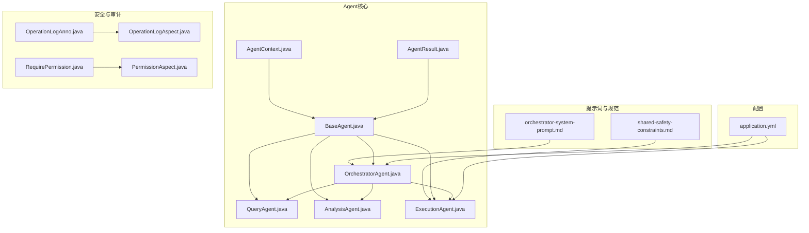
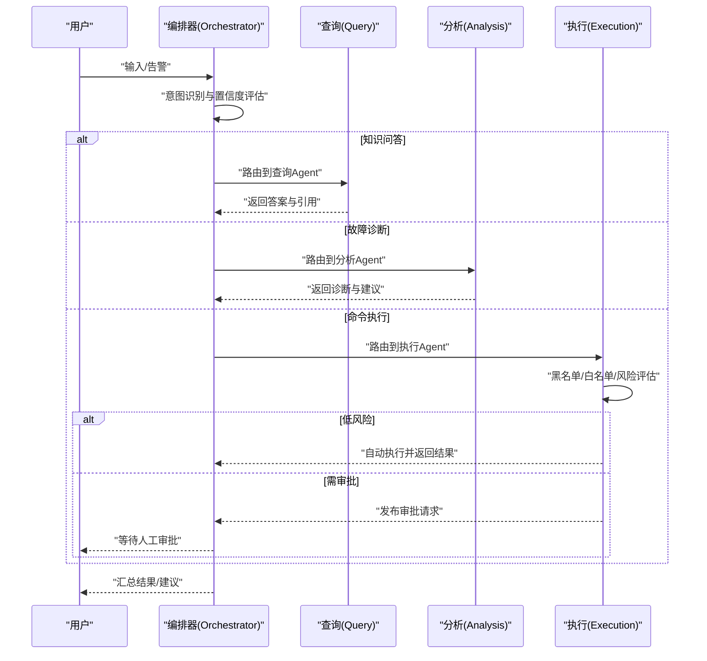
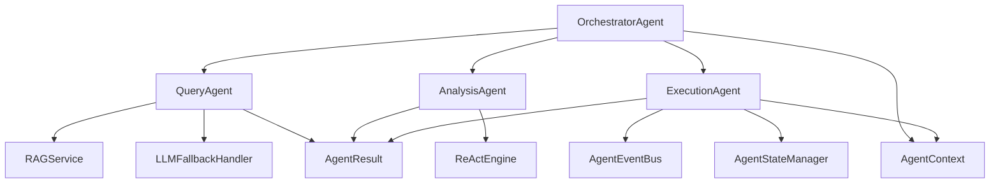

# 共享安全约束提示词

<cite>
**本文引用的文件**
- [shared-safety-constraints.md](file://docs/prompts/shared-safety-constraints.md)
- [orchestrator-system-prompt.md](file://docs/prompts/orchestrator-system-prompt.md)
- [BaseAgent.java](file://netdata-ai-backend/src/main/java/com/netdata/ops/core/agent/BaseAgent.java)
- [OrchestratorAgent.java](file://netdata-ai-backend/src/main/java/com/netdata/ops/core/agent/OrchestratorAgent.java)
- [QueryAgent.java](file://netdata-ai-backend/src/main/java/com/netdata/ops/core/agent/QueryAgent.java)
- [AnalysisAgent.java](file://netdata-ai-backend/src/main/java/com/netdata/ops/core/agent/AnalysisAgent.java)
- [ExecutionAgent.java](file://netdata-ai-backend/src/main/java/com/netdata/ops/core/agent/ExecutionAgent.java)
- [AgentContext.java](file://netdata-ai-backend/src/main/java/com/netdata/ops/core/agent/AgentContext.java)
- [AgentResult.java](file://netdata-ai-backend/src/main/java/com/netdata/ops/core/agent/AgentResult.java)
- [application.yml](file://netdata-ai-backend/src/main/resources/application.yml)
- [OperationLogAnno.java](file://netdata-ai-backend/src/main/java/com/netdata/ops/annotation/OperationLogAnno.java)
- [RequirePermission.java](file://netdata-ai-backend/src/main/java/com/netdata/ops/annotation/RequirePermission.java)
- [OperationLogAspect.java](file://netdata-ai-backend/src/main/java/com/netdata/ops/aspect/OperationLogAspect.java)
- [PermissionAspect.java](file://netdata-ai-backend/src/main/java/com/netdata/ops/aspect/PermissionAspect.java)
</cite>

## 目录
1. [引言](#引言)
2. [项目结构](#项目结构)
3. [核心组件](#核心组件)
4. [架构总览](#架构总览)
5. [详细组件分析](#详细组件分析)
6. [依赖分析](#依赖分析)
7. [性能考虑](#性能考虑)
8. [故障排查指南](#故障排查指南)
9. [结论](#结论)
10. [附录](#附录)

## 引言
本文件围绕“共享安全约束提示词”主题，系统化梳理并阐述本项目的安全设计理念、边界定义、风险评估与合规流程，以及在多Agent协作中的安全协调机制。文档同时覆盖知识查询、故障诊断与命令执行三大Agent类型的约束应用，动态调整与实时监控方法，安全事件检测与响应恢复流程，以及审计日志与合规报告生成的完整闭环。

## 项目结构
本项目后端采用Java/Spring生态，核心Agent体系位于netdata-ai-backend模块，安全约束与系统提示词分别沉淀在docs/prompts目录与Agent实现中。整体结构如下：



图表来源
- [shared-safety-constraints.md:1-396](file://docs/prompts/shared-safety-constraints.md#L1-L396)
- [orchestrator-system-prompt.md:1-291](file://docs/prompts/orchestrator-system-prompt.md#L1-L291)
- [BaseAgent.java:1-480](file://netdata-ai-backend/src/main/java/com/netdata/ops/core/agent/BaseAgent.java#L1-L480)
- [OrchestratorAgent.java:1-254](file://netdata-ai-backend/src/main/java/com/netdata/ops/core/agent/OrchestratorAgent.java#L1-L254)
- [QueryAgent.java:1-179](file://netdata-ai-backend/src/main/java/com/netdata/ops/core/agent/QueryAgent.java#L1-L179)
- [AnalysisAgent.java:1-260](file://netdata-ai-backend/src/main/java/com/netdata/ops/core/agent/AnalysisAgent.java#L1-L260)
- [ExecutionAgent.java:1-409](file://netdata-ai-backend/src/main/java/com/netdata/ops/core/agent/ExecutionAgent.java#L1-L409)
- [AgentContext.java:1-131](file://netdata-ai-backend/src/main/java/com/netdata/ops/core/agent/AgentContext.java#L1-L131)
- [AgentResult.java:1-194](file://netdata-ai-backend/src/main/java/com/netdata/ops/core/agent/AgentResult.java#L1-L194)
- [application.yml:157-189](file://netdata-ai-backend/src/main/resources/application.yml#L157-L189)
- [OperationLogAnno.java:1-29](file://netdata-ai-backend/src/main/java/com/netdata/ops/annotation/OperationLogAnno.java#L1-L29)
- [RequirePermission.java:1-20](file://netdata-ai-backend/src/main/java/com/netdata/ops/annotation/RequirePermission.java#L1-L20)
- [OperationLogAspect.java:1-127](file://netdata-ai-backend/src/main/java/com/netdata/ops/aspect/OperationLogAspect.java#L1-L127)
- [PermissionAspect.java:1-40](file://netdata-ai-backend/src/main/java/com/netdata/ops/aspect/PermissionAspect.java#L1-L40)

章节来源
- [shared-safety-constraints.md:1-396](file://docs/prompts/shared-safety-constraints.md#L1-L396)
- [application.yml:157-189](file://netdata-ai-backend/src/main/resources/application.yml#L157-L189)

## 核心组件
- 共享安全约束提示词：定义最小权限、防御优先、审计追溯三大原则，明确命令执行黑名单、灰/白名单、数据脱敏、网络安全、输入安全、权限矩阵与审批流程、错误处理与审计日志规范、安全检查清单及应急响应。
- Orchestrator系统提示词：定义意图识别、路由决策、输出格式、安全边界（禁止直接生成执行命令）、超时控制与禁止事项。
- Agent基础框架：统一超时控制、TraceId链路追踪、生命周期钩子、拦截器链、指标采集、重试能力，为各Agent提供一致的安全执行基座。
- 安全审计与权限：通过注解与AOP实现操作日志与权限校验，结合配置中心的JWT与限流策略，强化边界控制。

章节来源
- [shared-safety-constraints.md:7-26](file://docs/prompts/shared-safety-constraints.md#L7-L26)
- [orchestrator-system-prompt.md:109-137](file://docs/prompts/orchestrator-system-prompt.md#L109-L137)
- [BaseAgent.java:16-37](file://netdata-ai-backend/src/main/java/com/netdata/ops/core/agent/BaseAgent.java#L16-L37)

## 架构总览
多Agent协作的安全架构以编排器为核心，负责意图识别与路由；查询Agent提供知识问答；分析Agent进行故障诊断；执行Agent承担命令审批与执行。安全约束贯穿上下文传递、状态同步与冲突解决，通过黑名单/白名单、风险评估、审批流程与审计日志实现闭环。



图表来源
- [OrchestratorAgent.java:70-93](file://netdata-ai-backend/src/main/java/com/netdata/ops/core/agent/OrchestratorAgent.java#L70-L93)
- [ExecutionAgent.java:133-182](file://netdata-ai-backend/src/main/java/com/netdata/ops/core/agent/ExecutionAgent.java#L133-L182)
- [QueryAgent.java:61-98](file://netdata-ai-backend/src/main/java/com/netdata/ops/core/agent/QueryAgent.java#L61-L98)
- [AnalysisAgent.java:46-58](file://netdata-ai-backend/src/main/java/com/netdata/ops/core/agent/AnalysisAgent.java#L46-L58)

## 详细组件分析

### 共享安全约束提示词（设计与原则）
- 核心原则
  - 最小权限：仅使用完成任务所需的最小权限，禁止使用root执行非必要操作，敏感操作必须审批。
  - 防御优先：遇到不确定情况选择更安全方案，宁可拒绝操作，任何可疑操作需人工确认。
  - 审计追溯：所有操作必须记录日志，包含操作人、时间、内容、结果，日志保留至少90天。
- 命令执行安全
  - 绝对禁止：系统销毁、权限开放、防火墙清空、密码修改、系统关机/重启、Fork炸弹、危险脚本执行等。
  - 需审批：服务操作、进程操作、配置修改、数据操作、网络操作等。
  - 自动执行：信息查询、日志查看、服务状态、临时文件清理等。
- 数据安全
  - 敏感数据识别：密码、证书、配置、用户数据等；脱敏与加密传输。
  - 日志安全：避免在日志中泄露敏感信息。
- 网络安全
  - 外部API调用仅允许白名单域名；禁止未知来源下载执行；禁止开放高危端口。
- 用户输入安全
  - 输入验证：SQL注入、命令注入、XSS防护；输入长度限制。
- 权限控制
  - 角色权限矩阵：viewer、operator、admin、super-admin；越权审批。
  - 审批流程：查询类直接执行，低风险自动执行，中风险operator审批，高风险admin审批，极高风险super-admin审批+双重确认。
- 错误处理与异常恢复
  - 错误信息脱敏；异常恢复与回滚。
- 审计日志规范
  - 日志格式与必须记录事件。
- 安全检查清单与应急响应
  - 命令执行前、数据处理、用户输入检查；安全事件响应流程与紧急联系人。

章节来源
- [shared-safety-constraints.md:7-26](file://docs/prompts/shared-safety-constraints.md#L7-L26)
- [shared-safety-constraints.md:29-127](file://docs/prompts/shared-safety-constraints.md#L29-L127)
- [shared-safety-constraints.md:130-169](file://docs/prompts/shared-safety-constraints.md#L130-L169)
- [shared-safety-constraints.md:172-196](file://docs/prompts/shared-safety-constraints.md#L172-L196)
- [shared-safety-constraints.md:199-231](file://docs/prompts/shared-safety-constraints.md#L199-L231)
- [shared-safety-constraints.md:233-259](file://docs/prompts/shared-safety-constraints.md#L233-L259)
- [shared-safety-constraints.md:262-293](file://docs/prompts/shared-safety-constraints.md#L262-L293)
- [shared-safety-constraints.md:296-324](file://docs/prompts/shared-safety-constraints.md#L296-L324)
- [shared-safety-constraints.md:326-387](file://docs/prompts/shared-safety-constraints.md#L326-L387)

### Orchestrator系统提示词（路由与安全边界）
- 角色与能力：精准识别意图、智能路由、结果汇总。
- 意图分类：知识问答、故障诊断、命令执行、混合意图。
- 路由决策：单一意图与混合意图的执行顺序与并行策略；紧急程度评估。
- 输出格式：JSON结构字段与说明。
- 约束条件：置信度处理（低于阈值请求澄清）、安全边界（禁止直接生成执行命令、必须Human-in-the-loop审批）、超时控制与禁止事项。

章节来源
- [orchestrator-system-prompt.md:3-137](file://docs/prompts/orchestrator-system-prompt.md#L3-L137)
- [orchestrator-system-prompt.md:139-282](file://docs/prompts/orchestrator-system-prompt.md#L139-L282)

### Agent基础框架（安全执行基座）
- 模板方法与基础设施：超时控制、TraceId链路追踪、生命周期钩子、拦截器链、指标采集、重试能力。
- 上下文与结果：AgentContext封装会话、用户、意图、历史、元数据、链路追踪、截止时间、重试次数、优先级、开始时间；AgentResult封装业务结果、工具调用历史、Token消耗、缓存命中、重试次数等。
- 可配置参数：超时、最大重试次数、重试间隔；上下文验证。

章节来源
- [BaseAgent.java:88-222](file://netdata-ai-backend/src/main/java/com/netdata/ops/core/agent/BaseAgent.java#L88-L222)
- [BaseAgent.java:224-295](file://netdata-ai-backend/src/main/java/com/netdata/ops/core/agent/BaseAgent.java#L224-L295)
- [BaseAgent.java:312-360](file://netdata-ai-backend/src/main/java/com/netdata/ops/core/agent/BaseAgent.java#L312-L360)
- [BaseAgent.java:361-404](file://netdata-ai-backend/src/main/java/com/netdata/ops/core/agent/BaseAgent.java#L361-L404)
- [AgentContext.java:27-129](file://netdata-ai-backend/src/main/java/com/netdata/ops/core/agent/AgentContext.java#L27-L129)
- [AgentResult.java:25-193](file://netdata-ai-backend/src/main/java/com/netdata/ops/core/agent/AgentResult.java#L25-L193)

### 知识查询Agent（QueryAgent）
- 职责：RAG检索+LLM生成，构建带编号引用的Prompt上下文，返回结构化答案与来源引用。
- 安全要点：兜底提示词与异常保护，避免LLM异常导致整体失败；引用列表用于审计追溯。

章节来源
- [QueryAgent.java:13-33](file://netdata-ai-backend/src/main/java/com/netdata/ops/core/agent/QueryAgent.java#L13-L33)
- [QueryAgent.java:61-98](file://netdata-ai-backend/src/main/java/com/netdata/ops/core/agent/QueryAgent.java#L61-L98)
- [QueryAgent.java:100-124](file://netdata-ai-backend/src/main/java/com/netdata/ops/core/agent/QueryAgent.java#L100-L124)

### 故障诊断Agent（AnalysisAgent）
- 职责：委托ReAct引擎执行推理循环，动态决策工具选择，转换为AgentResult并生成诊断报告与命令建议。
- 安全要点：超时时间延长以适配ReAct；工具调用历史便于审计与回溯。

章节来源
- [AnalysisAgent.java:12-30](file://netdata-ai-backend/src/main/java/com/netdata/ops/core/agent/AnalysisAgent.java#L12-L30)
- [AnalysisAgent.java:46-58](file://netdata-ai-backend/src/main/java/com/netdata/ops/core/agent/AnalysisAgent.java#L46-L58)
- [AnalysisAgent.java:104-132](file://netdata-ai-backend/src/main/java/com/netdata/ops/core/agent/AnalysisAgent.java#L104-L132)
- [AnalysisAgent.java:252-259](file://netdata-ai-backend/src/main/java/com/netdata/ops/core/agent/AnalysisAgent.java#L252-L259)

### 命令执行Agent（ExecutionAgent）
- 职责：解析命令、黑名单/白名单/风险评估、生成审批请求、执行命令、记录审计日志。
- 安全要点：黑名单命令绝对禁止；白名单命令自动执行；中高风险命令进入审批流程；事件总线与状态管理保障状态同步与冲突解决；风险评估维度包含命令类型、影响范围、可逆性、执行频率。

```mermaid
flowchart TD
Start(["开始"]) --> Extract["提取命令"]
Extract --> Black{"黑名单匹配?"}
Black --> |是| Deny["拒绝执行并返回建议"]
Black --> |否| White{"白名单匹配?"}
White --> |是| AutoExec["自动执行"]
White --> |否| Risk["风险评估"]
Risk --> Score{"分数"}
Score --> |< 低阈值| AutoExec
Score --> |≥ 高阈值| Approve["创建审批请求并发布事件"]
Score --> |[低,中) 阈值| Approve
AutoExec --> Log["记录审计日志"]
Approve --> Log
Deny --> Log
Log --> End(["结束"])
```

图表来源
- [ExecutionAgent.java:133-182](file://netdata-ai-backend/src/main/java/com/netdata/ops/core/agent/ExecutionAgent.java#L133-L182)
- [ExecutionAgent.java:216-241](file://netdata-ai-backend/src/main/java/com/netdata/ops/core/agent/ExecutionAgent.java#L216-L241)
- [ExecutionAgent.java:326-379](file://netdata-ai-backend/src/main/java/com/netdata/ops/core/agent/ExecutionAgent.java#L326-L379)

章节来源
- [ExecutionAgent.java:13-38](file://netdata-ai-backend/src/main/java/com/netdata/ops/core/agent/ExecutionAgent.java#L13-L38)
- [ExecutionAgent.java:133-182](file://netdata-ai-backend/src/main/java/com/netdata/ops/core/agent/ExecutionAgent.java#L133-L182)
- [ExecutionAgent.java:216-241](file://netdata-ai-backend/src/main/java/com/netdata/ops/core/agent/ExecutionAgent.java#L216-L241)
- [ExecutionAgent.java:326-379](file://netdata-ai-backend/src/main/java/com/netdata/ops/core/agent/ExecutionAgent.java#L326-L379)

### 安全协调机制（上下文传递、状态同步、冲突解决）
- 上下文传递的安全控制：AgentContext携带traceId、deadline、retryCount、priority、startTime等，确保跨Agent调用时时间预算与链路追踪一致。
- 状态同步的安全保障：ExecutionAgent通过事件总线与状态管理器协同，审批状态在系统内一致更新，避免竞态。
- 冲突解决的安全策略：当混合意图并行执行失败时，降级为串行执行，确保安全与一致性。

章节来源
- [AgentContext.java:74-107](file://netdata-ai-backend/src/main/java/com/netdata/ops/core/agent/AgentContext.java#L74-L107)
- [OrchestratorAgent.java:120-145](file://netdata-ai-backend/src/main/java/com/netdata/ops/core/agent/OrchestratorAgent.java#L120-L145)
- [ExecutionAgent.java:91-129](file://netdata-ai-backend/src/main/java/com/netdata/ops/core/agent/ExecutionAgent.java#L91-L129)

### 不同Agent类型中的安全限制应用
- 知识查询Agent：严格的数据脱敏与引用溯源，避免泄露敏感信息；兜底提示词与异常保护。
- 故障诊断Agent：工具调用历史与诊断报告用于审计；超时控制保障系统稳定性。
- 命令执行Agent：黑名单/白名单/风险评估三道防线；审批流程与事件驱动状态管理。

章节来源
- [QueryAgent.java:100-124](file://netdata-ai-backend/src/main/java/com/netdata/ops/core/agent/QueryAgent.java#L100-L124)
- [AnalysisAgent.java:104-132](file://netdata-ai-backend/src/main/java/com/netdata/ops/core/agent/AnalysisAgent.java#L104-L132)
- [ExecutionAgent.java:133-182](file://netdata-ai-backend/src/main/java/com/netdata/ops/core/agent/ExecutionAgent.java#L133-L182)

### 动态调整机制与实时监控
- 动态调整：命令执行安全配置（黑名单、白名单、风险阈值）通过配置中心集中管理，支持热更新与灰度发布。
- 实时监控：Actuator暴露健康检查、指标与Resilience4j熔断/重试/舱壁/限时器监控，结合日志与审计实现可观测性。

章节来源
- [application.yml:157-189](file://netdata-ai-backend/src/main/resources/application.yml#L157-L189)
- [application.yml:204-237](file://netdata-ai-backend/src/main/resources/application.yml#L204-L237)

### 安全事件检测、响应与恢复
- 检测：异常恢复与回滚、黑名单拦截、风险评估阈值触发、审计日志与操作日志。
- 响应：立即阻断可疑操作、记录事件详情、通知安全团队、评估影响范围、执行修复措施。
- 恢复：自动回滚、人工审批、系统自愈与告警收敛。

章节来源
- [shared-safety-constraints.md:262-293](file://docs/prompts/shared-safety-constraints.md#L262-L293)
- [shared-safety-constraints.md:360-387](file://docs/prompts/shared-safety-constraints.md#L360-L387)
- [ExecutionAgent.java:326-379](file://netdata-ai-backend/src/main/java/com/netdata/ops/core/agent/ExecutionAgent.java#L326-L379)

### 安全审计日志与合规报告
- 审计日志：统一的日志格式与必须记录事件；操作日志AOP自动记录；权限校验AOP保障访问控制。
- 合规报告：基于审计日志与操作日志生成合规性报告，支持导出与归档。

章节来源
- [shared-safety-constraints.md:296-324](file://docs/prompts/shared-safety-constraints.md#L296-L324)
- [OperationLogAspect.java:37-53](file://netdata-ai-backend/src/main/java/com/netdata/ops/aspect/OperationLogAspect.java#L37-L53)
- [OperationLogAspect.java:55-109](file://netdata-ai-backend/src/main/java/com/netdata/ops/aspect/OperationLogAspect.java#L55-L109)
- [PermissionAspect.java:22-38](file://netdata-ai-backend/src/main/java/com/netdata/ops/aspect/PermissionAspect.java#L22-L38)

## 依赖分析
- 组件耦合与内聚：OrchestratorAgent聚合Query/Analysis/Execution三个子Agent，通过意图识别与路由实现高内聚低耦合；ExecutionAgent通过事件总线与状态管理器实现松耦合的状态同步。
- 外部依赖：Spring AI（OpenAI/Ollama）、Milvus向量库、Redis缓存、MySQL持久化、WebSocket实时通知。
- 安全依赖：JWT认证、权限注解与AOP、限流与熔断（Resilience4j）。



图表来源
- [OrchestratorAgent.java:38-68](file://netdata-ai-backend/src/main/java/com/netdata/ops/core/agent/OrchestratorAgent.java#L38-L68)
- [QueryAgent.java:38-49](file://netdata-ai-backend/src/main/java/com/netdata/ops/core/agent/QueryAgent.java#L38-L49)
- [AnalysisAgent.java:35-44](file://netdata-ai-backend/src/main/java/com/netdata/ops/core/agent/AnalysisAgent.java#L35-L44)
- [ExecutionAgent.java:43-89](file://netdata-ai-backend/src/main/java/com/netdata/ops/core/agent/ExecutionAgent.java#L43-L89)

章节来源
- [OrchestratorAgent.java:38-68](file://netdata-ai-backend/src/main/java/com/netdata/ops/core/agent/OrchestratorAgent.java#L38-L68)
- [QueryAgent.java:38-49](file://netdata-ai-backend/src/main/java/com/netdata/ops/core/agent/QueryAgent.java#L38-L49)
- [AnalysisAgent.java:35-44](file://netdata-ai-backend/src/main/java/com/netdata/ops/core/agent/AnalysisAgent.java#L35-L44)
- [ExecutionAgent.java:43-89](file://netdata-ai-backend/src/main/java/com/netdata/ops/core/agent/ExecutionAgent.java#L43-L89)

## 性能考虑
- 超时与重试：BaseAgent统一提供超时控制与可配置重试，避免LLM调用卡死；AnalysisAgent延长超时以适配ReAct。
- 并行执行：混合意图场景下使用CompletableFuture并行执行，失败时降级为串行，兼顾性能与可靠性。
- 指标与可观测性：通过AgentMetrics与Actuator集成Resilience4j指标，实现性能与稳定性监控。

章节来源
- [BaseAgent.java:224-266](file://netdata-ai-backend/src/main/java/com/netdata/ops/core/agent/BaseAgent.java#L224-L266)
- [OrchestratorAgent.java:120-145](file://netdata-ai-backend/src/main/java/com/netdata/ops/core/agent/OrchestratorAgent.java#L120-L145)
- [AnalysisAgent.java:252-259](file://netdata-ai-backend/src/main/java/com/netdata/ops/core/agent/AnalysisAgent.java#L252-L259)
- [application.yml:204-237](file://netdata-ai-backend/src/main/resources/application.yml#L204-L237)

## 故障排查指南
- 链路追踪：通过MDC中的traceId串联日志，定位问题根因。
- 超时与异常：检查BaseAgent的超时与异常钩子，确认是否触发onTimeout/onError。
- 审计与日志：核查操作日志与审计日志，确认审批状态与执行结果。
- 权限与配置：确认权限注解与JWT配置，检查命令执行安全配置是否正确加载。

章节来源
- [BaseAgent.java:166-222](file://netdata-ai-backend/src/main/java/com/netdata/ops/core/agent/BaseAgent.java#L166-L222)
- [OperationLogAspect.java:55-109](file://netdata-ai-backend/src/main/java/com/netdata/ops/aspect/OperationLogAspect.java#L55-L109)
- [application.yml:191-202](file://netdata-ai-backend/src/main/resources/application.yml#L191-L202)

## 结论
本项目通过“共享安全约束提示词”与“系统提示词”的协同，结合统一的Agent基础框架与严格的命令执行安全策略，实现了多Agent协作下的安全边界、风险评估与合规闭环。通过事件驱动的状态管理、完善的审计日志与权限控制，以及可观测性的指标体系，系统在保证安全性的同时，兼顾了性能与可维护性。

## 附录
- 配置项速览：命令执行安全配置（黑名单、白名单、风险阈值）、JWT与限流、Actuator与Resilience4j监控。
- 注解与AOP：OperationLogAnno与RequirePermission配合OperationLogAspect与PermissionAspect实现操作日志与权限校验。

章节来源
- [application.yml:157-189](file://netdata-ai-backend/src/main/resources/application.yml#L157-L189)
- [application.yml:191-202](file://netdata-ai-backend/src/main/resources/application.yml#L191-L202)
- [application.yml:204-237](file://netdata-ai-backend/src/main/resources/application.yml#L204-L237)
- [OperationLogAnno.java:12-28](file://netdata-ai-backend/src/main/java/com/netdata/ops/annotation/OperationLogAnno.java#L12-L28)
- [RequirePermission.java:12-19](file://netdata-ai-backend/src/main/java/com/netdata/ops/annotation/RequirePermission.java#L12-L19)
- [OperationLogAspect.java:37-53](file://netdata-ai-backend/src/main/java/com/netdata/ops/aspect/OperationLogAspect.java#L37-L53)
- [PermissionAspect.java:22-38](file://netdata-ai-backend/src/main/java/com/netdata/ops/aspect/PermissionAspect.java#L22-L38)