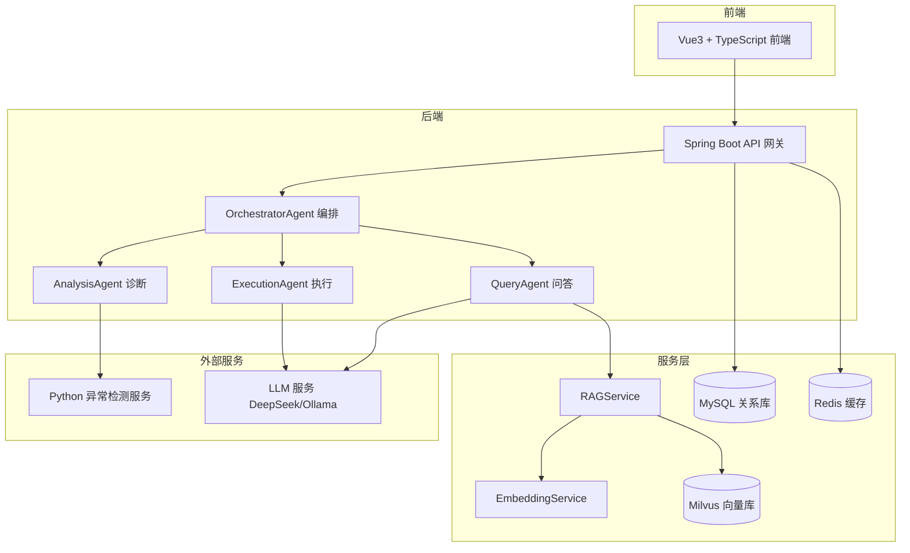
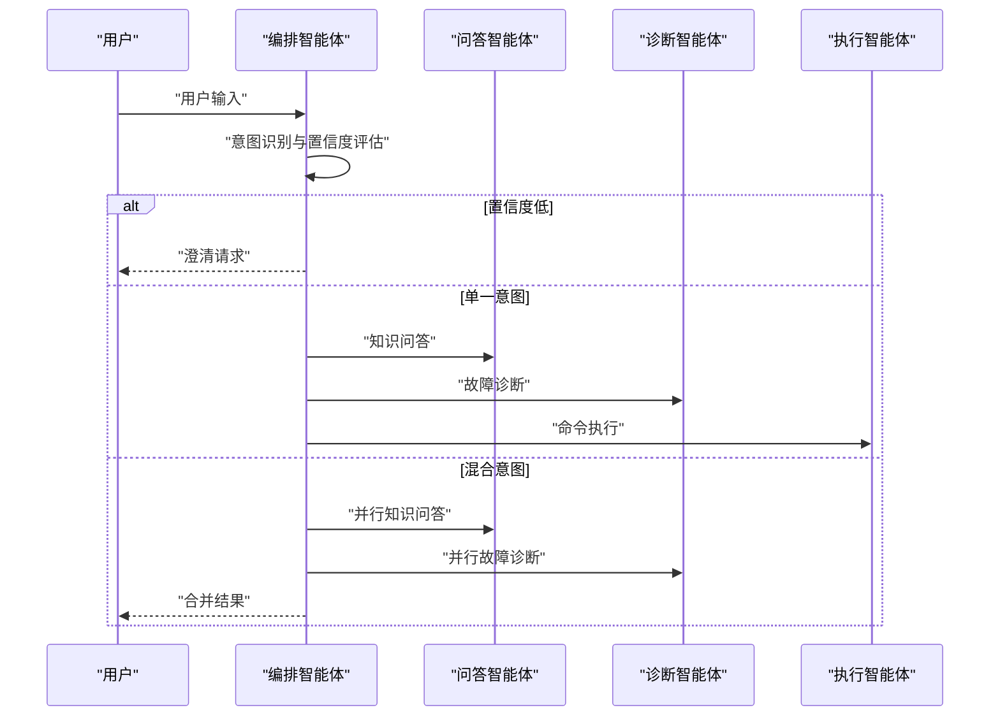
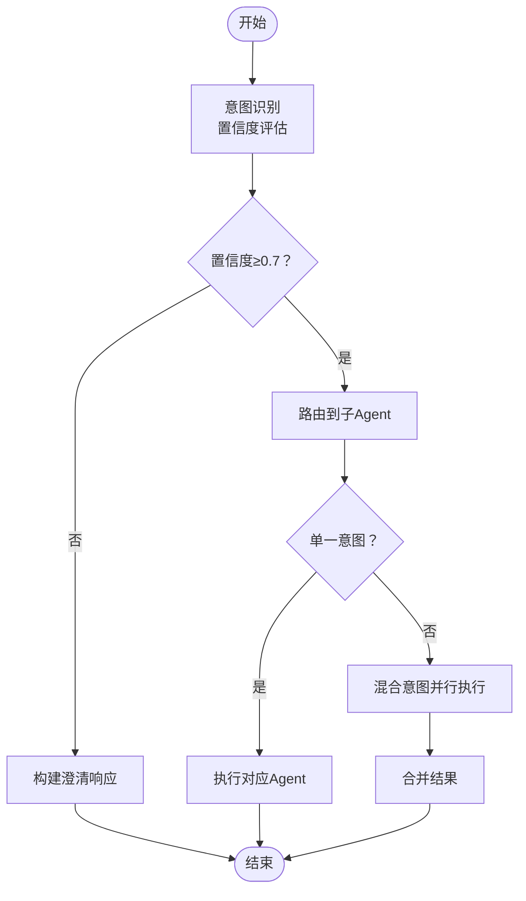
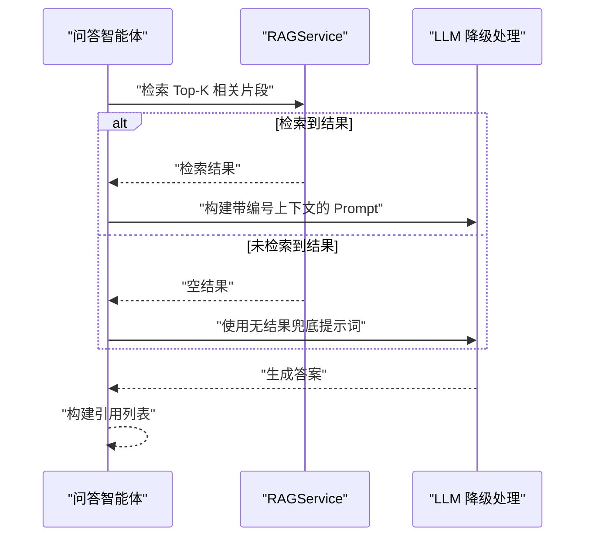
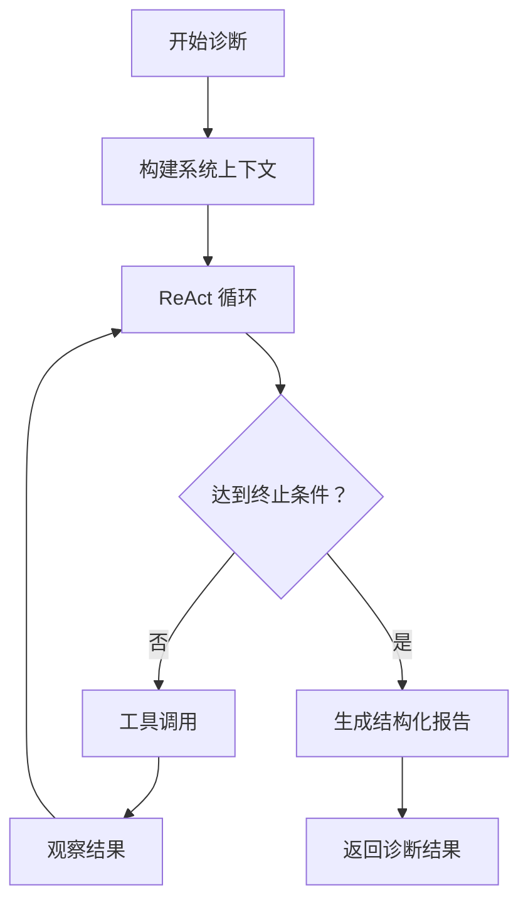
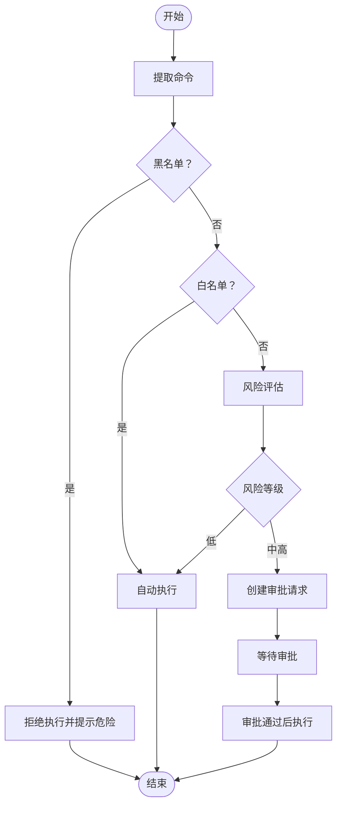
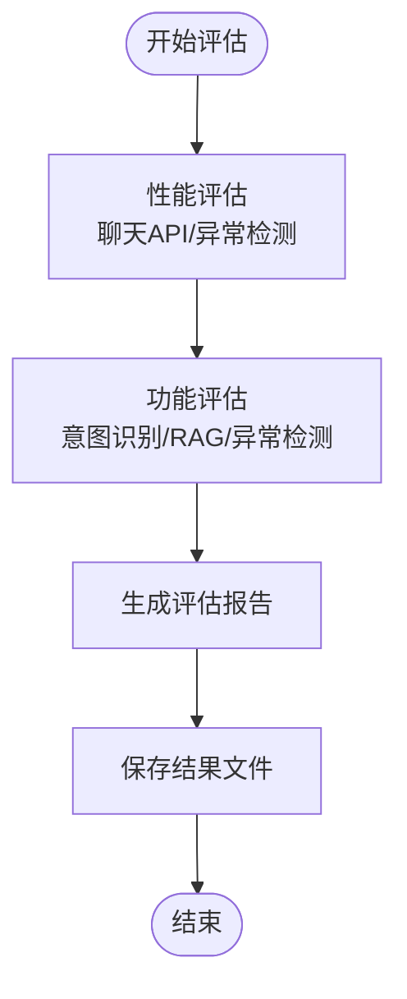
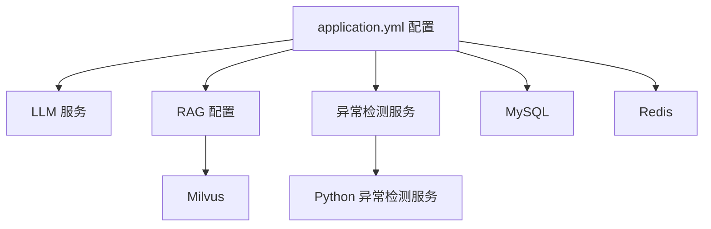

# 提示词优化策略

<cite>
**本文档引用的文件**
- [orchestrator-system-prompt.md](file://docs/prompts/orchestrator-system-prompt.md)
- [shared-safety-constraints.md](file://docs/prompts/shared-safety-constraints.md)
- [run_evaluation.py](file://evaluation/run_evaluation.py)
- [test_cases.json](file://evaluation/test_cases.json)
- [OrchestratorAgent.java](file://netdata-ai-backend/src/main/java/com/netdata/ops/core/agent/OrchestratorAgent.java)
- [QueryAgent.java](file://netdata-ai-backend/src/main/java/com/netdata/ops/core/agent/QueryAgent.java)
- [AnalysisAgent.java](file://netdata-ai-backend/src/main/java/com/netdata/ops/core/agent/AnalysisAgent.java)
- [ExecutionAgent.java](file://netdata-ai-backend/src/main/java/com/netdata/ops/core/agent/ExecutionAgent.java)
- [application.yml](file://netdata-ai-backend/src/main/resources/application.yml)
- [system_architecture.md](file://docs/system_architecture.md)
- [evaluation_report.md](file://docs/evaluation_report.md)
- [analysis-agent-system-prompt.md](file://docs/prompts/analysis-agent-system-prompt.md)
- [schemas.py](file://anomaly-detection-service/app/models/schemas.py)
- [detection_service.py](file://anomaly-detection-service/app/services/detection_service.py)
</cite>

## 目录
1. [简介](#简介)
2. [项目结构](#项目结构)
3. [核心组件](#核心组件)
4. [架构概览](#架构概览)
5. [详细组件分析](#详细组件分析)
6. [依赖分析](#依赖分析)
7. [性能考虑](#性能考虑)
8. [故障排除指南](#故障排除指南)
9. [结论](#结论)
10. [附录](#附录)

## 简介
本文件面向提示词优化策略，结合系统现有的提示词工程实践与评估体系，提供一套可落地的提示词效果评估方法论、A/B测试实施方案、迭代改进流程、个性化定制策略以及性能监控与预警机制。文档以实际代码与配置为依据，确保技术细节可追溯、可验证。

## 项目结构
系统采用前后端分离与多智能体协作架构，提示词贯穿编排智能体（Orchestrator）、问答智能体（QueryAgent）、诊断智能体（AnalysisAgent）与执行智能体（ExecutionAgent），并通过统一的评估脚本与测试用例进行指标采集与验证。

**图表来源**
- [system_architecture.md:21-134](file://docs/system_architecture.md#L21-L134)
- [application.yml:14-314](file://netdata-ai-backend/src/main/resources/application.yml#L14-L314)

**章节来源**
- [system_architecture.md:1-921](file://docs/system_architecture.md#L1-L921)
- [application.yml:1-314](file://netdata-ai-backend/src/main/resources/application.yml#L1-L314)

## 核心组件
- 编排智能体（OrchestratorAgent）：负责意图识别、路由决策与结果汇总，支持混合意图并行执行与降级策略。
- 问答智能体（QueryAgent）：基于 RAG 的知识检索与 LLM 答案生成，支持无结果兜底与引用标注。
- 诊断智能体（AnalysisAgent）：基于 ReAct 循环的推理诊断，整合指标、异常检测与知识库，生成结构化报告。
- 执行智能体（ExecutionAgent）：命令风险评估、审批流程与执行，内置黑白名单与分布式锁。
- 评估系统（Evaluation）：统一的性能与功能评估脚本，支持延迟、吞吐量、准确率、召回率等指标采集。

**章节来源**
- [OrchestratorAgent.java:1-261](file://netdata-ai-backend/src/main/java/com/netdata/ops/core/agent/OrchestratorAgent.java#L1-L261)
- [QueryAgent.java:1-181](file://netdata-ai-backend/src/main/java/com/netdata/ops/core/agent/QueryAgent.java#L1-L181)
- [AnalysisAgent.java:1-261](file://netdata-ai-backend/src/main/java/com/netdata/ops/core/agent/AnalysisAgent.java#L1-L261)
- [ExecutionAgent.java:1-425](file://netdata-ai-backend/src/main/java/com/netdata/ops/core/agent/ExecutionAgent.java#L1-L425)
- [run_evaluation.py:1-528](file://evaluation/run_evaluation.py#L1-L528)

## 架构概览
提示词在系统中的作用贯穿意图识别、问答生成、诊断推理与执行建议四个层面。编排智能体通过系统提示词进行意图分类与路由；问答智能体通过检索提示词与上下文构建进行答案生成；诊断智能体通过 ReAct 提示词驱动工具调用与推理；执行智能体通过安全约束提示词保障命令执行安全。

**图表来源**
- [orchestrator-system-prompt.md:26-136](file://docs/prompts/orchestrator-system-prompt.md#L26-L136)
- [analysis-agent-system-prompt.md:16-441](file://docs/prompts/analysis-agent-system-prompt.md#L16-L441)
- [shared-safety-constraints.md:1-396](file://docs/prompts/shared-safety-constraints.md#L1-L396)

**章节来源**
- [orchestrator-system-prompt.md:1-291](file://docs/prompts/orchestrator-system-prompt.md#L1-L291)
- [analysis-agent-system-prompt.md:1-441](file://docs/prompts/analysis-agent-system-prompt.md#L1-L441)
- [shared-safety-constraints.md:1-396](file://docs/prompts/shared-safety-constraints.md#L1-L396)

## 详细组件分析

### 编排智能体（OrchestratorAgent）
- 意图识别：双级分类器（规则快速路径 + LLM 语义分类），置信度阈值 0.7，低置信度触发澄清。
- 路由策略：单一意图直路由，混合意图支持并行执行与降级为串行。
- 结果汇总：合并多个子 Agent 的诊断与知识结果，生成统一回复。

**图表来源**
- [OrchestratorAgent.java:73-152](file://netdata-ai-backend/src/main/java/com/netdata/ops/core/agent/OrchestratorAgent.java#L73-L152)
- [orchestrator-system-prompt.md:109-136](file://docs/prompts/orchestrator-system-prompt.md#L109-L136)

**章节来源**
- [OrchestratorAgent.java:1-261](file://netdata-ai-backend/src/main/java/com/netdata/ops/core/agent/OrchestratorAgent.java#L1-L261)
- [orchestrator-system-prompt.md:1-291](file://docs/prompts/orchestrator-system-prompt.md#L1-L291)

### 问答智能体（QueryAgent）
- RAG 检索：向量 + BM25 + RRF 融合，构建带编号引用的上下文。
- LLM 生成：支持无结果兜底提示词，标注“无佐证”。
- 引用标注：构建来源引用列表，便于审计与溯源。

**图表来源**
- [QueryAgent.java:63-100](file://netdata-ai-backend/src/main/java/com/netdata/ops/core/agent/QueryAgent.java#L63-L100)
- [QueryAgent.java:128-180](file://netdata-ai-backend/src/main/java/com/netdata/ops/core/agent/QueryAgent.java#L128-L180)

**章节来源**
- [QueryAgent.java:1-181](file://netdata-ai-backend/src/main/java/com/netdata/ops/core/agent/QueryAgent.java#L1-L181)

### 诊断智能体（AnalysisAgent）
- ReAct 推理循环：思考→行动→观察→再思考，支持工具调用与多轮推理。
- 结构化报告：摘要、根因、证据、建议、命令建议等字段。
- 超时控制：默认 2 分钟，满足复杂诊断场景。

**图表来源**
- [AnalysisAgent.java:47-133](file://netdata-ai-backend/src/main/java/com/netdata/ops/core/agent/AnalysisAgent.java#L47-L133)
- [analysis-agent-system-prompt.md:16-441](file://docs/prompts/analysis-agent-system-prompt.md#L16-L441)

**章节来源**
- [AnalysisAgent.java:1-261](file://netdata-ai-backend/src/main/java/com/netdata/ops/core/agent/AnalysisAgent.java#L1-L261)
- [analysis-agent-system-prompt.md:1-441](file://docs/prompts/analysis-agent-system-prompt.md#L1-L441)

### 执行智能体（ExecutionAgent）
- 命令解析与提取：去除前缀，标准化命令。
- 黑白名单与风险评估：命令类型、影响范围、可逆性、执行频率四维评估。
- 审批与执行：灰名单触发审批，审批通过后分布式锁防重复执行。

**图表来源**
- [ExecutionAgent.java:149-198](file://netdata-ai-backend/src/main/java/com/netdata/ops/core/agent/ExecutionAgent.java#L149-L198)
- [ExecutionAgent.java:340-395](file://netdata-ai-backend/src/main/java/com/netdata/ops/core/agent/ExecutionAgent.java#L340-L395)

**章节来源**
- [ExecutionAgent.java:1-425](file://netdata-ai-backend/src/main/java/com/netdata/ops/core/agent/ExecutionAgent.java#L1-L425)
- [shared-safety-constraints.md:29-127](file://docs/prompts/shared-safety-constraints.md#L29-L127)

### 评估系统（Evaluation）
- 指标体系：性能（延迟、吞吐量、资源占用）、功能（意图识别准确率、RAG 召回率、异常检测 F1、诊断准确率）。
- 测试用例：意图分类、RAG 评估、异常检测、命令风险评估、端到端场景。
- 报告输出：JSON 结果与摘要，包含各模块指标与状态。

**图表来源**
- [run_evaluation.py:440-523](file://evaluation/run_evaluation.py#L440-L523)
- [test_cases.json:1-241](file://evaluation/test_cases.json#L1-L241)

**章节来源**
- [run_evaluation.py:1-528](file://evaluation/run_evaluation.py#L1-L528)
- [test_cases.json:1-241](file://evaluation/test_cases.json#L1-L241)
- [evaluation_report.md:1-224](file://docs/evaluation_report.md#L1-L224)

## 依赖分析
- 配置依赖：后端通过 application.yml 统一配置 LLM、RAG、异常检测服务与安全策略。
- 数据依赖：Milvus 向量库、MySQL 关系库、Redis 缓存。
- 外部服务：Python 异常检测服务、LLM 服务（DeepSeek/Ollama）。

**图表来源**
- [application.yml:14-314](file://netdata-ai-backend/src/main/resources/application.yml#L14-L314)

**章节来源**
- [application.yml:1-314](file://netdata-ai-backend/src/main/resources/application.yml#L1-L314)

## 性能考虑
- 延迟与吞吐：评估脚本提供 P50/P90/P99 延迟与吞吐量指标，目标分别为 ≤500ms、≤1000ms、≤2000ms 与 ≥30 QPS。
- 缓存与异步：Redis 缓存检索结果，异步线程池处理非关键步骤。
- 资源占用：容器化部署下，Milvus、MySQL、Redis、Java 服务与可选 Ollama 的资源需求明确。

**章节来源**
- [evaluation_report.md:123-180](file://docs/evaluation_report.md#L123-L180)
- [system_architecture.md:731-794](file://docs/system_architecture.md#L731-L794)

## 故障排除指南
- 意图识别低置信度：编排智能体返回澄清请求，引导用户提供更多信息。
- 混合意图识别准确率偏低：评估报告指出混合意图识别准确率有待提升，建议引入 LLM 增强分类与增加训练数据。
- 命令执行风险评估：黑白名单与灰名单策略确保高风险命令必须审批，审批超时自动取消。

**章节来源**
- [OrchestratorAgent.java:234-259](file://netdata-ai-backend/src/main/java/com/netdata/ops/core/agent/OrchestratorAgent.java#L234-L259)
- [evaluation_report.md:183-207](file://docs/evaluation_report.md#L183-L207)
- [ExecutionAgent.java:340-395](file://netdata-ai-backend/src/main/java/com/netdata/ops/core/agent/ExecutionAgent.java#L340-L395)

## 结论
本系统已形成完善的提示词工程与评估闭环：通过编排、问答、诊断、执行四层提示词体系，结合统一的评估脚本与测试用例，实现了对意图识别、RAG 检索、异常检测与端到端性能的全面验证。建议后续在混合意图识别、Reranker 延迟优化与多轮对话上下文方面持续迭代，以进一步提升提示词质量与用户体验。

## 附录

### A. 提示词效果评估方法论与指标体系
- 功能指标
  - 意图识别：准确率、精确率、召回率、F1 分数
  - RAG 检索：召回率@K、精确率@K、MRR
  - 异常检测：精确率、召回率、F1 分数
  - 诊断准确率：结构化报告的根因与建议一致性
- 性能指标
  - 延迟：P50、P90、P99、平均延迟
  - 吞吐量：QPS
  - 资源占用：CPU、内存、磁盘
- 用户体验指标
  - 响应质量评分（可结合用户调查或 A/B 测试）

**章节来源**
- [run_evaluation.py:84-108](file://evaluation/run_evaluation.py#L84-L108)
- [evaluation_report.md:40-160](file://docs/evaluation_report.md#L40-L160)

### B. A/B 测试设计与实施
- 实验组设置
  - 对比不同提示词版本（如基础版 vs 增强版 ReAct 提示词）
  - 对比不同检索策略（纯向量 vs 混合检索 + RRF）
- 样本选择
  - 使用 test_cases.json 中的测试用例，按意图类型与场景分层抽样
- 统计分析
  - 使用评估脚本采集指标，比较组间差异的显著性（如 t-test 或 Mann–Whitney U 检验）
  - 关注延迟、准确率、F1 分数与用户满意度

**章节来源**
- [test_cases.json:1-241](file://evaluation/test_cases.json#L1-L241)
- [run_evaluation.py:440-523](file://evaluation/run_evaluation.py#L440-L523)

### C. 提示词迭代改进流程
- 问题识别：通过评估报告与用户反馈定位提示词薄弱环节（如混合意图识别、Reranker 延迟）
- 方案设计：引入 LLM 增强分类、优化检索融合策略、完善 ReAct 工具调用
- 效果验证：A/B 测试与回归评估，确保指标提升且不引入新问题
- 持续优化：建立提示词版本管理与灰度发布机制

**章节来源**
- [evaluation_report.md:183-207](file://docs/evaluation_report.md#L183-L207)
- [system_architecture.md:731-794](file://docs/system_architecture.md#L731-L794)

### D. 个性化定制策略
- 用户画像分析：基于历史对话、偏好与角色权限，构建用户画像
- 偏好学习：通过用户反馈与行为数据，学习个性化提示风格与检索偏好
- 自适应调整：根据用户画像与偏好动态调整提示词模板与检索策略

[本节为概念性内容，不直接分析具体文件]

### E. 提示词性能监控与预警机制
- 监控指标：延迟分布、吞吐量、错误率、用户满意度
- 预警阈值：针对 P95 延迟、F1 分数、资源占用设定阈值
- 告警联动：异常检测服务与后端指标集成，触发自动降级或扩容

**章节来源**
- [schemas.py:286-329](file://anomaly-detection-service/app/models/schemas.py#L286-L329)
- [detection_service.py:315-334](file://anomaly-detection-service/app/services/detection_service.py#L315-L334)
- [application.yml:204-237](file://netdata-ai-backend/src/main/resources/application.yml#L204-L237)