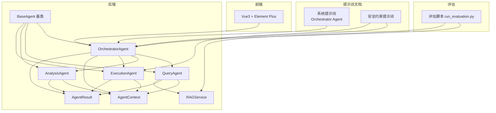
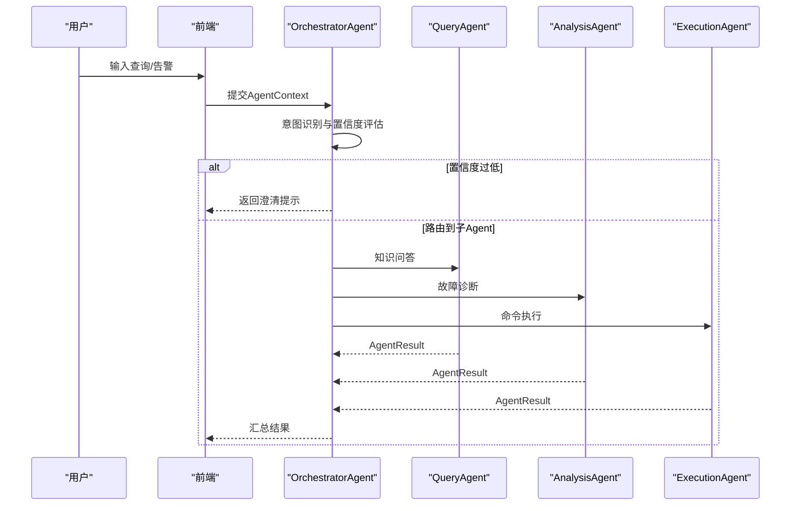
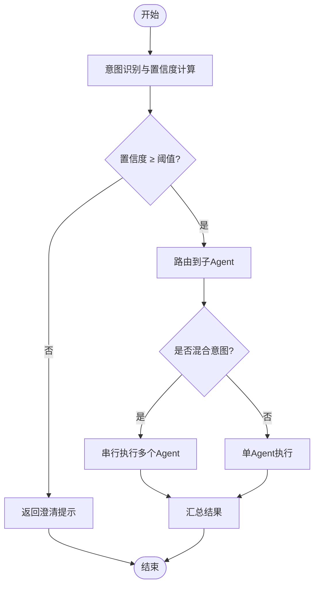
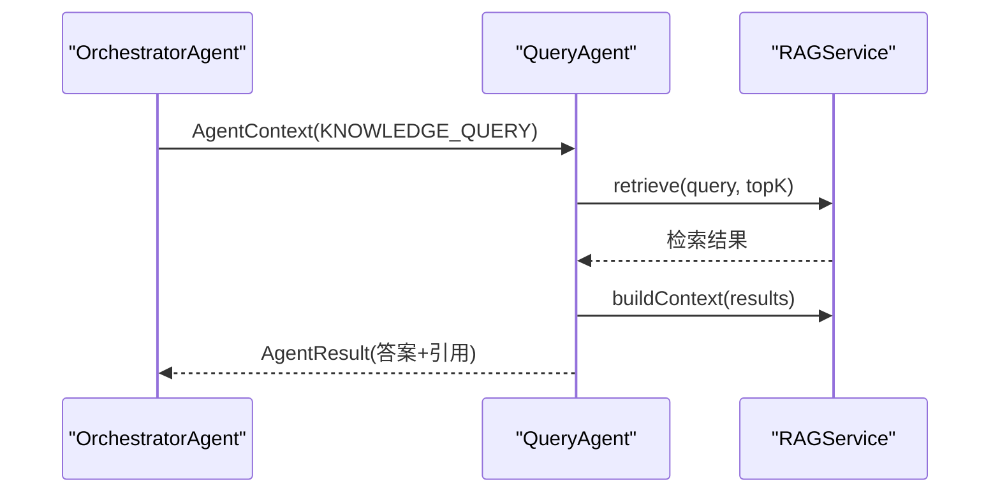
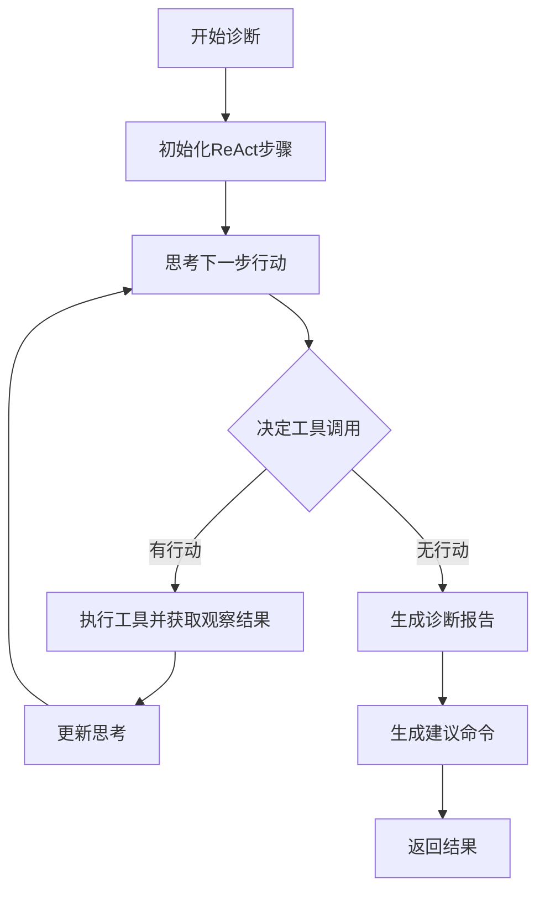
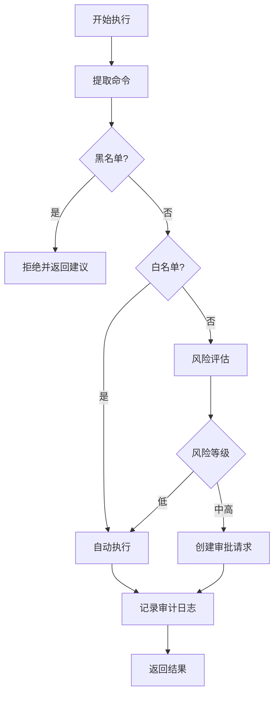
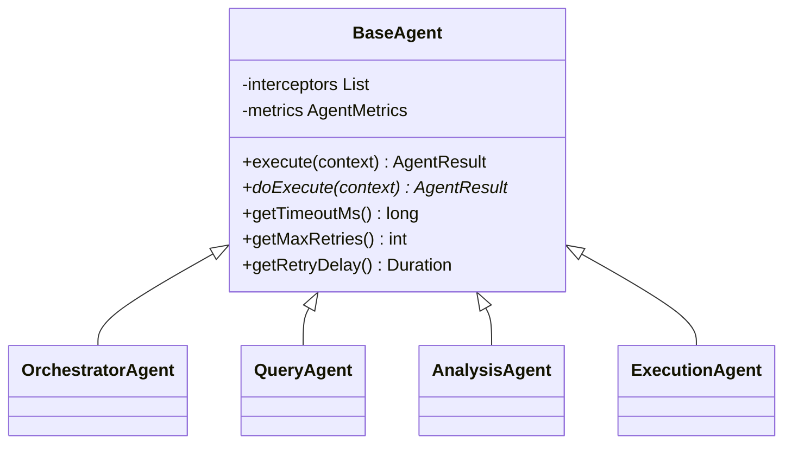
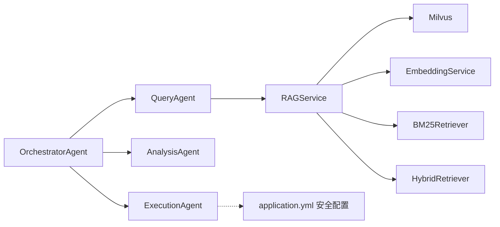

# 提示词库与系统设计

<cite>
**本文引用的文件**
- [orchestrator-system-prompt.md](file://docs/prompts/orchestrator-system-prompt.md)
- [shared-safety-constraints.md](file://docs/prompts/shared-safety-constraints.md)
- [application.yml](file://netdata-ai-backend/src/main/resources/application.yml)
- [BaseAgent.java](file://netdata-ai-backend/src/main/java/com/netdata/ops/core/agent/BaseAgent.java)
- [OrchestratorAgent.java](file://netdata-ai-backend/src/main/java/com/netdata/ops/core/agent/OrchestratorAgent.java)
- [QueryAgent.java](file://netdata-ai-backend/src/main/java/com/netdata/ops/core/agent/QueryAgent.java)
- [AnalysisAgent.java](file://netdata-ai-backend/src/main/java/com/netdata/ops/core/agent/AnalysisAgent.java)
- [ExecutionAgent.java](file://netdata-ai-backend/src/main/java/com/netdata/ops/core/agent/ExecutionAgent.java)
- [AgentContext.java](file://netdata-ai-backend/src/main/java/com/netdata/ops/core/agent/AgentContext.java)
- [AgentResult.java](file://netdata-ai-backend/src/main/java/com/netdata/ops/core/agent/AgentResult.java)
- [RAGService.java](file://netdata-ai-backend/src/main/java/com/netdata/ops/core/rag/RAGService.java)
- [run_evaluation.py](file://evaluation/run_evaluation.py)
- [README.md（前端）](file://netdata-ai-frontend/README.md)
</cite>

## 目录
1. [简介](#简介)
2. [项目结构](#项目结构)
3. [核心组件](#核心组件)
4. [架构总览](#架构总览)
5. [详细组件分析](#详细组件分析)
6. [依赖分析](#依赖分析)
7. [性能考量](#性能考量)
8. [故障排查指南](#故障排查指南)
9. [结论](#结论)
10. [附录](#附录)

## 简介
本文件面向提示词库与系统设计，围绕AI代理系统的提示词设计原则、安全约束提示词、系统设计原则、提示词优化策略、多Agent协作提示词协调机制、提示词全生命周期管理以及效果监控与评估方法论进行系统化阐述。文档结合后端Java Agent体系与前端Vue3交互层，给出可落地的工程化实践。

## 项目结构
系统由“提示词文档”“后端Agent编排与执行”“前端交互”“评估脚本”四部分组成：
- 提示词文档：系统提示词与安全约束提示词，定义意图分类、路由规则、输出格式、安全边界等。
- 后端Agent：编排器、查询Agent、分析Agent、执行Agent，统一通过基类提供超时、重试、指标、拦截器等基础设施。
- 前端：Vue3 + TypeScript + Element Plus，提供对话、告警、知识库、审批等功能页面。
- 评估脚本：Python评估器，覆盖性能与功能指标，支撑A/B测试与迭代改进。

**图表来源**
- [OrchestratorAgent.java:107-112](file://netdata-ai-backend/src/main/java/com/netdata/ops/core/agent/OrchestratorAgent.java#L107-L112)
- [BaseAgent.java:107-222](file://netdata-ai-backend/src/main/java/com/netdata/ops/core/agent/BaseAgent.java#L107-L222)
- [QueryAgent.java:44-79](file://netdata-ai-backend/src/main/java/com/netdata/ops/core/agent/QueryAgent.java#L44-L79)
- [AnalysisAgent.java:56-103](file://netdata-ai-backend/src/main/java/com/netdata/ops/core/agent/AnalysisAgent.java#L56-L103)
- [ExecutionAgent.java:80-129](file://netdata-ai-backend/src/main/java/com/netdata/ops/core/agent/ExecutionAgent.java#L80-L129)
- [AgentContext.java:27-129](file://netdata-ai-backend/src/main/java/com/netdata/ops/core/agent/AgentContext.java#L27-L129)
- [AgentResult.java:25-194](file://netdata-ai-backend/src/main/java/com/netdata/ops/core/agent/AgentResult.java#L25-L194)
- [RAGService.java:116-130](file://netdata-ai-backend/src/main/java/com/netdata/ops/core/rag/RAGService.java#L116-L130)
- [run_evaluation.py:197-215](file://evaluation/run_evaluation.py#L197-L215)

**章节来源**
- [README.md（前端）:1-54](file://netdata-ai-frontend/README.md#L1-L54)

## 核心组件
- 系统提示词（Orchestrator Agent）
  - 明确定义角色、任务、意图分类、路由规则、输出格式、约束条件、当前上下文与示例，确保编排器具备稳定的意图识别与路由能力。
- 安全约束提示词
  - 覆盖最小权限、防御优先、审计追溯三大原则，明确命令黑名单、白名单、审批流程、数据脱敏、网络安全、用户输入安全、错误处理与应急响应。
- Agent基类与编排
  - BaseAgent提供模板方法、超时控制、重试、指标采集、拦截器链、TraceId链路追踪等横切能力；OrchestratorAgent负责意图识别与任务路由。
- 专业Agent
  - QueryAgent：RAG检索与答案生成；AnalysisAgent：ReAct循环诊断；ExecutionAgent：命令解析、风险评估与审批。
- 上下文与结果
  - AgentContext封装会话、用户、查询、意图、历史、TraceId、截止时间、重试次数、优先级等；AgentResult统一承载业务结果与运行元信息。
- 配置与安全
  - application.yml集中管理LLM、Milvus、RAG、命令执行安全、JWT、限流、监控等配置，体现生产级安全与可运维性。

**章节来源**
- [orchestrator-system-prompt.md:1-291](file://docs/prompts/orchestrator-system-prompt.md#L1-L291)
- [shared-safety-constraints.md:1-396](file://docs/prompts/shared-safety-constraints.md#L1-L396)
- [BaseAgent.java:89-222](file://netdata-ai-backend/src/main/java/com/netdata/ops/core/agent/BaseAgent.java#L89-L222)
- [OrchestratorAgent.java:86-112](file://netdata-ai-backend/src/main/java/com/netdata/ops/core/agent/OrchestratorAgent.java#L86-L112)
- [QueryAgent.java:44-79](file://netdata-ai-backend/src/main/java/com/netdata/ops/core/agent/QueryAgent.java#L44-L79)
- [AnalysisAgent.java:56-103](file://netdata-ai-backend/src/main/java/com/netdata/ops/core/agent/AnalysisAgent.java#L56-L103)
- [ExecutionAgent.java:80-129](file://netdata-ai-backend/src/main/java/com/netdata/ops/core/agent/ExecutionAgent.java#L80-L129)
- [AgentContext.java:27-129](file://netdata-ai-backend/src/main/java/com/netdata/ops/core/agent/AgentContext.java#L27-L129)
- [AgentResult.java:25-194](file://netdata-ai-backend/src/main/java/com/netdata/ops/core/agent/AgentResult.java#L25-L194)
- [application.yml:14-314](file://netdata-ai-backend/src/main/resources/application.yml#L14-L314)

## 架构总览
系统采用“提示词驱动 + Agent编排”的架构：提示词定义意图与安全边界，编排器识别意图并路由到专业Agent；专业Agent在各自领域内完成任务；结果统一由编排器汇总输出。评估脚本贯穿全生命周期，支撑A/B测试与持续优化。

**图表来源**
- [OrchestratorAgent.java:86-112](file://netdata-ai-backend/src/main/java/com/netdata/ops/core/agent/OrchestratorAgent.java#L86-L112)
- [QueryAgent.java:44-79](file://netdata-ai-backend/src/main/java/com/netdata/ops/core/agent/QueryAgent.java#L44-L79)
- [AnalysisAgent.java:56-103](file://netdata-ai-backend/src/main/java/com/netdata/ops/core/agent/AnalysisAgent.java#L56-L103)
- [ExecutionAgent.java:80-129](file://netdata-ai-backend/src/main/java/com/netdata/ops/core/agent/ExecutionAgent.java#L80-L129)

## 详细组件分析

### 编排器Agent（OrchestratorAgent）
- 意图识别：基于关键词正则匹配与得分统计，计算置信度，超过阈值则路由，否则返回澄清提示。
- 路由策略：单一意图直连对应Agent；混合意图按既定顺序串行执行。
- 安全约束：禁止直接生成执行命令，涉及删除/修改/重启的操作必须经执行Agent与审批流程。
- 输出格式：严格遵循JSON结构，包含意图、置信度、路由计划、提取实体、紧急程度与可选直接回复。

**图表来源**
- [OrchestratorAgent.java:123-163](file://netdata-ai-backend/src/main/java/com/netdata/ops/core/agent/OrchestratorAgent.java#L123-L163)
- [OrchestratorAgent.java:168-175](file://netdata-ai-backend/src/main/java/com/netdata/ops/core/agent/OrchestratorAgent.java#L168-L175)
- [orchestrator-system-prompt.md:109-136](file://docs/prompts/orchestrator-system-prompt.md#L109-L136)

**章节来源**
- [OrchestratorAgent.java:86-235](file://netdata-ai-backend/src/main/java/com/netdata/ops/core/agent/OrchestratorAgent.java#L86-L235)
- [orchestrator-system-prompt.md:1-291](file://docs/prompts/orchestrator-system-prompt.md#L1-L291)

### 查询Agent（QueryAgent）
- 职责：RAG检索、上下文构建、答案生成与来源引用。
- 流程：检索Top-K → 构建Prompt上下文 → LLM生成（简化实现为拼接检索结果）→ 返回答案与引用。

**图表来源**
- [QueryAgent.java:44-79](file://netdata-ai-backend/src/main/java/com/netdata/ops/core/agent/QueryAgent.java#L44-L79)
- [RAGService.java:116-130](file://netdata-ai-backend/src/main/java/com/netdata/ops/core/rag/RAGService.java#L116-L130)

**章节来源**
- [QueryAgent.java:1-107](file://netdata-ai-backend/src/main/java/com/netdata/ops/core/agent/QueryAgent.java#L1-L107)
- [RAGService.java:116-130](file://netdata-ai-backend/src/main/java/com/netdata/ops/core/rag/RAGService.java#L116-L130)

### 分析Agent（AnalysisAgent）
- 职责：ReAct循环（思考→行动→观察），调用工具获取数据，分析根因并生成诊断报告与建议命令。
- 工具：历史指标、异常检测、关联告警、知识库查询、服务状态检查。
- 限制：最大迭代次数，超时控制，异常检测服务调用。

**图表来源**
- [AnalysisAgent.java:56-103](file://netdata-ai-backend/src/main/java/com/netdata/ops/core/agent/AnalysisAgent.java#L56-L103)
- [AnalysisAgent.java:108-136](file://netdata-ai-backend/src/main/java/com/netdata/ops/core/agent/AnalysisAgent.java#L108-L136)

**章节来源**
- [AnalysisAgent.java:1-290](file://netdata-ai-backend/src/main/java/com/netdata/ops/core/agent/AnalysisAgent.java#L1-L290)

### 执行Agent（ExecutionAgent）
- 职责：命令解析、黑名单/白名单/灰名单检查、风险评估、审批请求、执行与审计。
- 风险评估：命令类型、影响范围、可逆性、执行频率四个维度加权。
- 安全机制：黑名单禁止、白名单自动、灰名单审批；审批通过后执行并记录审计日志。

**图表来源**
- [ExecutionAgent.java:80-129](file://netdata-ai-backend/src/main/java/com/netdata/ops/core/agent/ExecutionAgent.java#L80-L129)
- [ExecutionAgent.java:163-188](file://netdata-ai-backend/src/main/java/com/netdata/ops/core/agent/ExecutionAgent.java#L163-L188)

**章节来源**
- [ExecutionAgent.java:1-335](file://netdata-ai-backend/src/main/java/com/netdata/ops/core/agent/ExecutionAgent.java#L1-L335)
- [shared-safety-constraints.md:29-127](file://docs/prompts/shared-safety-constraints.md#L29-L127)

### Agent基类（BaseAgent）
- 模板方法：统一执行流程，包含TraceId、截止时间、前置/后置拦截器、异常与超时处理、指标上报。
- 超时与重试：CompletableFuture + 可配置超时与重试次数，支持嵌套调用时间预算传递。
- 生命周期钩子：onStart/onComplete/onError/onTimeout可选覆盖，便于审计与降级。
- 可观测性：AgentMetrics指标采集、AgentResult扩展字段（工具调用历史、Token消耗、缓存命中、重试次数）。

**图表来源**
- [BaseAgent.java:39-416](file://netdata-ai-backend/src/main/java/com/netdata/ops/core/agent/BaseAgent.java#L39-L416)
- [OrchestratorAgent.java:31-84](file://netdata-ai-backend/src/main/java/com/netdata/ops/core/agent/OrchestratorAgent.java#L31-L84)
- [QueryAgent.java:34-41](file://netdata-ai-backend/src/main/java/com/netdata/ops/core/agent/QueryAgent.java#L34-L41)
- [AnalysisAgent.java:39-54](file://netdata-ai-backend/src/main/java/com/netdata/ops/core/agent/AnalysisAgent.java#L39-L54)
- [ExecutionAgent.java:37-78](file://netdata-ai-backend/src/main/java/com/netdata/ops/core/agent/ExecutionAgent.java#L37-L78)

**章节来源**
- [BaseAgent.java:1-480](file://netdata-ai-backend/src/main/java/com/netdata/ops/core/agent/BaseAgent.java#L1-L480)

### 上下文与结果（AgentContext / AgentResult）
- AgentContext：封装会话、用户、查询、意图、历史、TraceId、截止时间、重试次数、优先级、开始时间等，支撑跨Agent上下文传递与链路追踪。
- AgentResult：统一承载成功标志、响应内容、来源引用、建议命令、诊断报告、错误信息、执行耗时、TraceId、工具调用历史、Token消耗、缓存命中、重试次数等。

**章节来源**
- [AgentContext.java:1-131](file://netdata-ai-backend/src/main/java/com/netdata/ops/core/agent/AgentContext.java#L1-L131)
- [AgentResult.java:1-194](file://netdata-ai-backend/src/main/java/com/netdata/ops/core/agent/AgentResult.java#L1-L194)

### 配置与安全（application.yml）
- LLM与降级：OpenAI风格API与Ollama本地模型双配置，支持Profile切换。
- Milvus与RAG：向量维度、切分策略、检索Top-K、RRF融合参数、相似度阈值。
- 命令执行安全：黑名单、白名单、风险阈值。
- 安全与限流：JWT、速率限制、Actuator监控、Resilience4j集成。
- 日志与WebSocket：统一日志格式、文件滚动、WebSocket路径与跨域。

**章节来源**
- [application.yml:14-314](file://netdata-ai-backend/src/main/resources/application.yml#L14-L314)

## 依赖分析
- 组件耦合
  - OrchestratorAgent依赖Query/Analysis/Execution三个子Agent，体现编排职责；BaseAgent为所有Agent提供横切能力，提升内聚性与可维护性。
  - QueryAgent依赖RAGService，RAGService依赖文档切分、向量化、Milvus向量存储、BM25检索与混合检索器。
- 外部依赖
  - LLM服务（DeepSeek/Ollama）、异常检测服务、Milvus、Redis、MySQL、Spring AI/WebClient、Resilience4j、Actuator。
- 安全边界
  - 命令执行安全规则与黑名单/白名单在配置与Agent中双重体现，确保跨层一致。

**图表来源**
- [OrchestratorAgent.java:33-84](file://netdata-ai-backend/src/main/java/com/netdata/ops/core/agent/OrchestratorAgent.java#L33-L84)
- [QueryAgent.java:36-41](file://netdata-ai-backend/src/main/java/com/netdata/ops/core/agent/QueryAgent.java#L36-L41)
- [RAGService.java:37-41](file://netdata-ai-backend/src/main/java/com/netdata/ops/core/rag/RAGService.java#L37-L41)
- [application.yml:159-183](file://netdata-ai-backend/src/main/resources/application.yml#L159-L183)

**章节来源**
- [OrchestratorAgent.java:33-84](file://netdata-ai-backend/src/main/java/com/netdata/ops/core/agent/OrchestratorAgent.java#L33-L84)
- [QueryAgent.java:36-41](file://netdata-ai-backend/src/main/java/com/netdata/ops/core/agent/QueryAgent.java#L36-L41)
- [RAGService.java:37-41](file://netdata-ai-backend/src/main/java/com/netdata/ops/core/rag/RAGService.java#L37-L41)
- [application.yml:159-183](file://netdata-ai-backend/src/main/resources/application.yml#L159-L183)

## 性能考量
- 超时与重试：BaseAgent内置超时控制与可配置重试，避免LLM调用卡死；AnalysisAgent异常检测服务调用设置超时。
- 指标采集：通过AgentMetrics记录执行耗时、超时与失败次数；Actuator暴露Prometheus指标；Resilience4j集成熔断与重试监控。
- 资源与吞吐：RAG检索Top-K与RRF融合参数、向量维度固定（BGE-M3 1024维）平衡召回与性能；LLM降级配置保障可用性。
- 评估脚本：提供P50/P90/P99延迟、吞吐量、意图识别准确率、RAG召回/MRR、异常检测Precision/Recall/F1等指标，支撑A/B测试与回归评估。

**章节来源**
- [BaseAgent.java:224-295](file://netdata-ai-backend/src/main/java/com/netdata/ops/core/agent/BaseAgent.java#L224-L295)
- [AnalysisAgent.java:184-205](file://netdata-ai-backend/src/main/java/com/netdata/ops/core/agent/AnalysisAgent.java#L184-L205)
- [application.yml:206-236](file://netdata-ai-backend/src/main/resources/application.yml#L206-L236)
- [run_evaluation.py:174-196](file://evaluation/run_evaluation.py#L174-L196)
- [run_evaluation.py:264-300](file://evaluation/run_evaluation.py#L264-L300)
- [run_evaluation.py:301-327](file://evaluation/run_evaluation.py#L301-L327)
- [run_evaluation.py:329-376](file://evaluation/run_evaluation.py#L329-L376)

## 故障排查指南
- 链路追踪：AgentContext与AgentResult均携带TraceId，日志中自动关联；前端WebSocket推送审批与告警通知，便于端到端定位。
- 超时与异常：BaseAgent对超时与异常分别上报指标并返回标准化错误；AnalysisAgent对异常检测服务调用增加超时保护。
- 安全拦截：ExecutionAgent黑名单/白名单/灰名单检查失败时返回建议与风险等级；application.yml中命令执行安全阈值可调。
- 配置校验：Profile切换、LLM与降级配置、Milvus连接、RAG参数、JWT与限流配置均在application.yml中集中管理，便于快速核对。

**章节来源**
- [BaseAgent.java:166-222](file://netdata-ai-backend/src/main/java/com/netdata/ops/core/agent/BaseAgent.java#L166-L222)
- [ExecutionAgent.java:94-129](file://netdata-ai-backend/src/main/java/com/netdata/ops/core/agent/ExecutionAgent.java#L94-L129)
- [application.yml:141-202](file://netdata-ai-backend/src/main/resources/application.yml#L141-L202)

## 结论
本系统通过“提示词驱动 + Agent编排 + 工业级基础设施”的设计，实现了意图识别、知识问答、故障诊断与命令执行的闭环。提示词文档明确了系统提示词与安全约束，Agent基类提供了超时、重试、指标、拦截器等横切能力，配合评估脚本与监控体系，支撑持续优化与稳定运行。建议在后续迭代中：
- 引入LLM分类替代关键词匹配，提升意图识别鲁棒性；
- 增强提示词版本管理与A/B测试流水线；
- 完善前端审批与告警可视化，提升用户体验；
- 优化RAG检索策略与向量维度参数，平衡召回与性能。

## 附录

### 提示词设计原则与结构化组织
- 角色与任务：明确Agent身份、核心能力与职责边界，避免越权与歧义。
- 意图分类与路由：建立清晰的意图类型与关键词映射，定义路由决策规则与混合意图执行顺序。
- 输出格式与约束：统一JSON结构、字段说明与禁止事项，确保下游解析一致性。
- 安全边界：最小权限、防御优先、审计追溯，结合黑名单/白名单/审批流程形成闭环。

**章节来源**
- [orchestrator-system-prompt.md:3-136](file://docs/prompts/orchestrator-system-prompt.md#L3-L136)
- [shared-safety-constraints.md:7-27](file://docs/prompts/shared-safety-constraints.md#L7-L27)

### 安全约束提示词设计理念
- 安全原则：最小权限、防御优先、审计追溯，贯穿命令执行、数据处理、网络安全与用户输入。
- 风险评估与合规：命令风险阈值、审批流程分级、日志脱敏与安全检查清单，确保可审计、可追溯、可合规。

**章节来源**
- [shared-safety-constraints.md:29-396](file://docs/prompts/shared-safety-constraints.md#L29-L396)
- [application.yml:159-189](file://netdata-ai-backend/src/main/resources/application.yml#L159-L189)

### 系统设计原则与可扩展性
- 模块化设计：Agent职责单一、接口清晰，编排器负责协调，便于替换与扩展。
- 可扩展性：BaseAgent提供横切能力，新增Agent仅需实现doExecute；RAGService支持批量入库与统计。
- 可维护性：统一日志、TraceId、指标与异常处理，降低维护成本。

**章节来源**
- [BaseAgent.java:16-37](file://netdata-ai-backend/src/main/java/com/netdata/ops/core/agent/BaseAgent.java#L16-L37)
- [RAGService.java:57-91](file://netdata-ai-backend/src/main/java/com/netdata/ops/core/rag/RAGService.java#L57-L91)

### 提示词优化策略与A/B测试
- A/B测试：通过评估脚本对比不同提示词版本的意图识别准确率、RAG召回/MRR、异常检测F1等指标。
- 效果评估：延迟、吞吐量、资源占用与用户体验评分综合评估。
- 迭代改进：基于指标反馈调整提示词结构、关键词映射与路由规则，持续优化。

**章节来源**
- [run_evaluation.py:133-216](file://evaluation/run_evaluation.py#L133-L216)
- [run_evaluation.py:257-327](file://evaluation/run_evaluation.py#L257-L327)
- [run_evaluation.py:329-434](file://evaluation/run_evaluation.py#L329-L434)

### 多Agent协作中的提示词协调机制
- 上下文传递：AgentContext携带会话、历史、TraceId与截止时间，确保跨Agent一致性。
- 状态同步：AgentResult统一承载工具调用历史、Token消耗、缓存命中与重试次数，便于审计与优化。
- 冲突解决：编排器依据紧急程度与路由规则进行决策，避免重复执行与资源竞争。

**章节来源**
- [AgentContext.java:27-129](file://netdata-ai-backend/src/main/java/com/netdata/ops/core/agent/AgentContext.java#L27-L129)
- [AgentResult.java:25-194](file://netdata-ai-backend/src/main/java/com/netdata/ops/core/agent/AgentResult.java#L25-L194)
- [OrchestratorAgent.java:168-175](file://netdata-ai-backend/src/main/java/com/netdata/ops/core/agent/OrchestratorAgent.java#L168-L175)

### 提示词管理全生命周期
- 创建：基于提示词模板与领域知识，明确角色、任务、意图与安全约束。
- 测试：通过评估脚本与单元测试验证意图识别、RAG检索与异常检测效果。
- 上线：纳入配置中心与监控体系，启用日志与指标采集。
- 迭代：基于A/B测试与监控指标持续优化提示词结构与关键词映射。

**章节来源**
- [orchestrator-system-prompt.md:1-291](file://docs/prompts/orchestrator-system-prompt.md#L1-L291)
- [shared-safety-constraints.md:1-396](file://docs/prompts/shared-safety-constraints.md#L1-L396)
- [run_evaluation.py:440-523](file://evaluation/run_evaluation.py#L440-L523)

### 提示词效果监控与性能评估方法论
- 性能指标：P50/P90/P99延迟、吞吐量、资源占用。
- 功能指标：意图识别准确率/精确率/召回/F1、RAG召回/MRR、异常检测Precision/Recall/F1。
- 用户体验：响应质量评分与前端交互指标。
- 方法论：异步评估、批量测试、指标聚合与报告生成，支撑持续改进。

**章节来源**
- [run_evaluation.py:64-128](file://evaluation/run_evaluation.py#L64-L128)
- [run_evaluation.py:174-196](file://evaluation/run_evaluation.py#L174-L196)
- [run_evaluation.py:264-300](file://evaluation/run_evaluation.py#L264-L300)
- [run_evaluation.py:301-327](file://evaluation/run_evaluation.py#L301-L327)
- [run_evaluation.py:329-376](file://evaluation/run_evaluation.py#L329-L376)