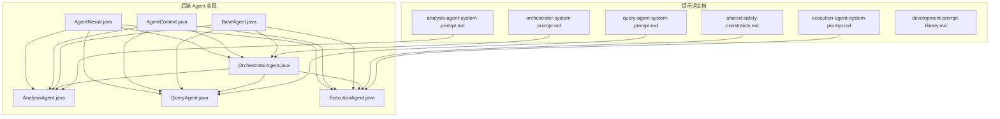
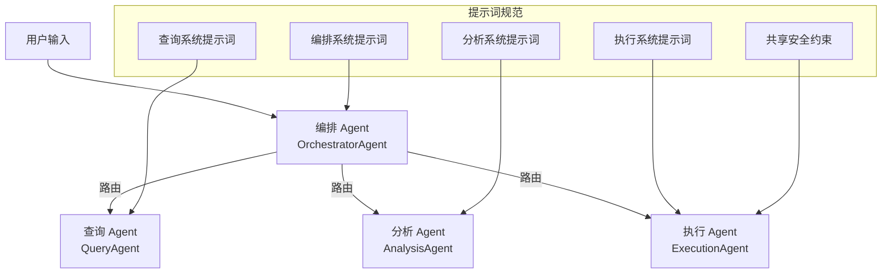
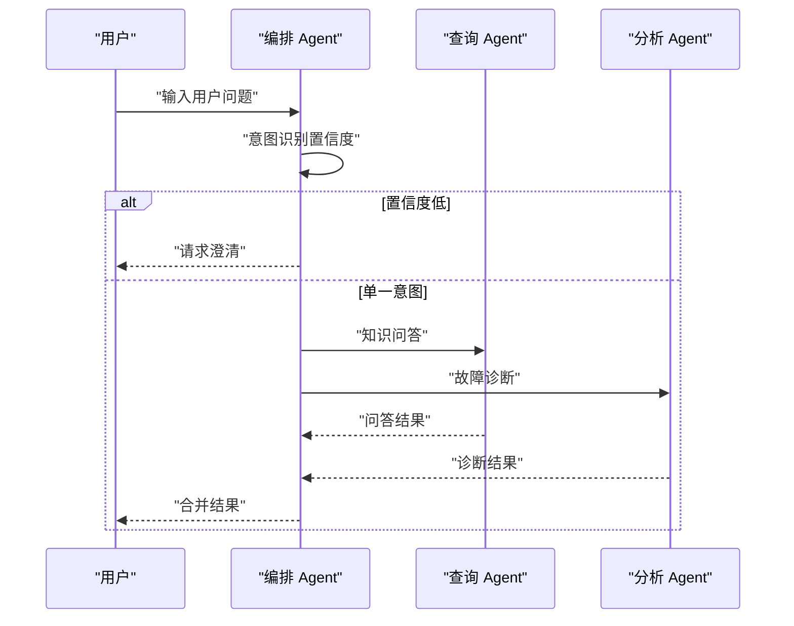
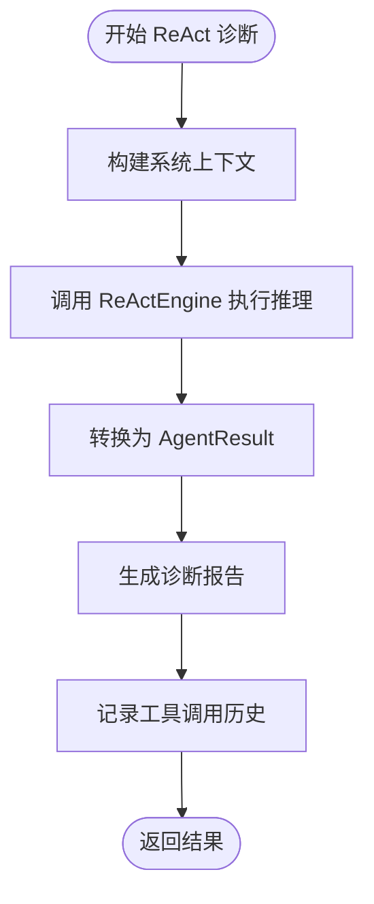
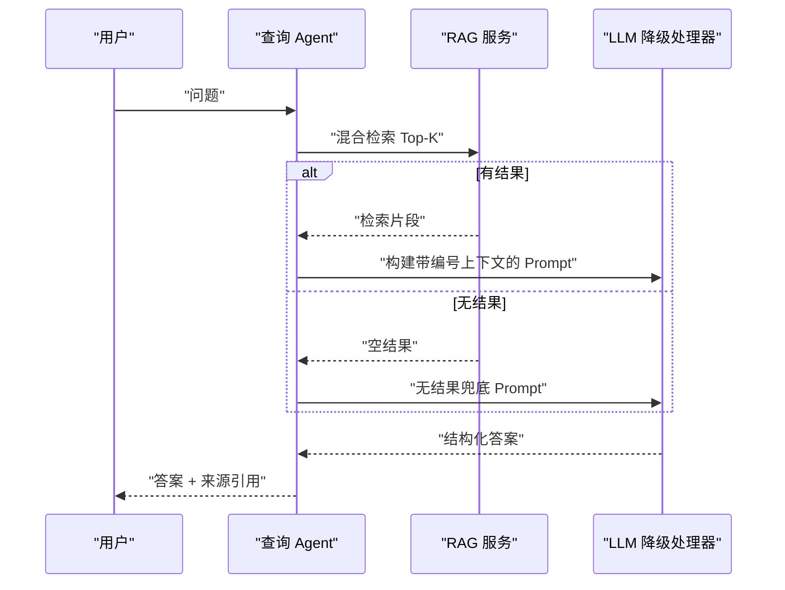
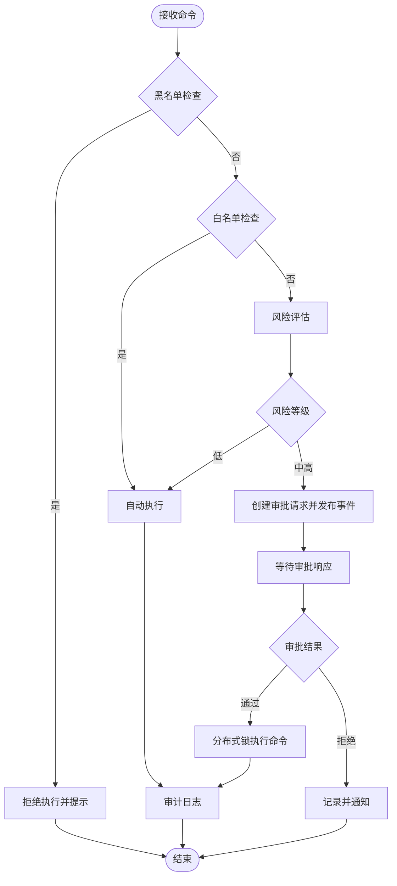
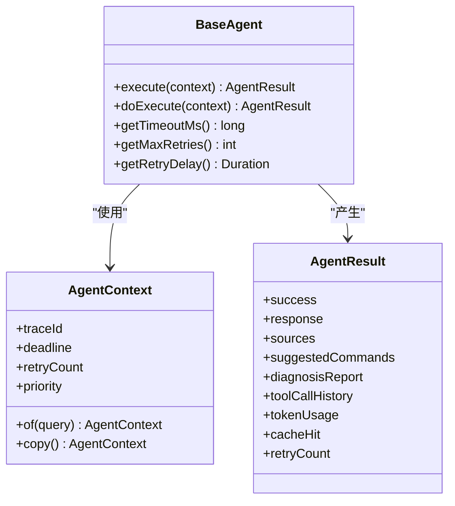
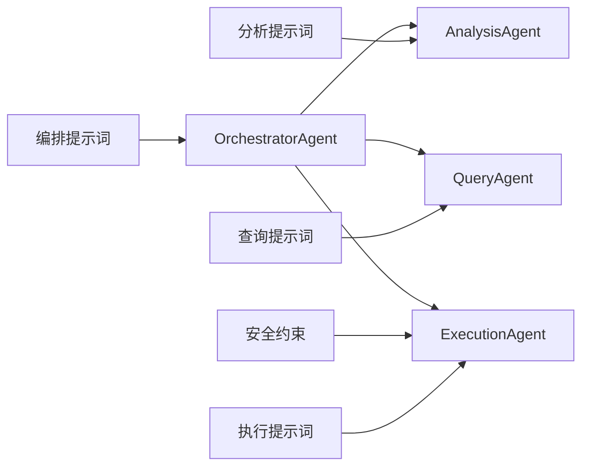

# 提示词管理生命周期

<cite>
**本文引用的文件**
- [orchestrator-system-prompt.md](file://docs/prompts/orchestrator-system-prompt.md)
- [analysis-agent-system-prompt.md](file://docs/prompts/analysis-agent-system-prompt.md)
- [query-agent-system-prompt.md](file://docs/prompts/query-agent-system-prompt.md)
- [execution-agent-system-prompt.md](file://docs/prompts/execution-agent-system-prompt.md)
- [shared-safety-constraints.md](file://docs/prompts/shared-safety-constraints.md)
- [development-prompt-library.md](file://docs/prompts/development-prompt-library.md)
- [OrchestratorAgent.java](file://netdata-ai-backend/src/main/java/com/netdata/ops/core/agent/OrchestratorAgent.java)
- [AnalysisAgent.java](file://netdata-ai-backend/src/main/java/com/netdata/ops/core/agent/AnalysisAgent.java)
- [QueryAgent.java](file://netdata-ai-backend/src/main/java/com/netdata/ops/core/agent/QueryAgent.java)
- [ExecutionAgent.java](file://netdata-ai-backend/src/main/java/com/netdata/ops/core/agent/ExecutionAgent.java)
- [BaseAgent.java](file://netdata-ai-backend/src/main/java/com/netdata/ops/core/agent/BaseAgent.java)
- [AgentContext.java](file://netdata-ai-backend/src/main/java/com/netdata/ops/core/agent/AgentContext.java)
- [AgentResult.java](file://netdata-ai-backend/src/main/java/com/netdata/ops/core/agent/AgentResult.java)
</cite>

## 目录
1. [简介](#简介)
2. [项目结构](#项目结构)
3. [核心组件](#核心组件)
4. [架构总览](#架构总览)
5. [详细组件分析](#详细组件分析)
6. [依赖分析](#依赖分析)
7. [性能考虑](#性能考虑)
8. [故障排查指南](#故障排查指南)
9. [结论](#结论)
10. [附录](#附录)

## 简介
本文件围绕提示词管理生命周期，系统化阐述提示词从创建、测试到上线的全生命周期管理流程，涵盖需求分析、设计开发、测试验证、部署上线与维护更新等阶段；同时给出版本控制策略、发布流程与质量控制标准、监控与维护机制、变更管理流程与工具支持，以及提示词文档管理与知识传承机制。本文以项目中已沉淀的提示词文档与后端 Agent 实现为依据，结合开发阶段 Prompt 模板库，形成可落地的提示词工程化管理方法。

## 项目结构
提示词相关资产主要分布在 docs/prompts 目录，包含各 Agent 的系统提示词与共享安全约束；后端 Java 代码实现了 Multi-Agent 编排与执行，Agent 的职责、上下文与结果结构均与提示词设计一一对应。

**图表来源**
- [orchestrator-system-prompt.md:1-291](file://docs/prompts/orchestrator-system-prompt.md#L1-L291)
- [analysis-agent-system-prompt.md:1-441](file://docs/prompts/analysis-agent-system-prompt.md#L1-L441)
- [query-agent-system-prompt.md:1-253](file://docs/prompts/query-agent-system-prompt.md#L1-L253)
- [execution-agent-system-prompt.md:1-377](file://docs/prompts/execution-agent-system-prompt.md#L1-L377)
- [shared-safety-constraints.md:1-396](file://docs/prompts/shared-safety-constraints.md#L1-L396)
- [development-prompt-library.md:1-468](file://docs/prompts/development-prompt-library.md#L1-L468)
- [OrchestratorAgent.java:1-261](file://netdata-ai-backend/src/main/java/com/netdata/ops/core/agent/OrchestratorAgent.java#L1-L261)
- [AnalysisAgent.java:1-261](file://netdata-ai-backend/src/main/java/com/netdata/ops/core/agent/AnalysisAgent.java#L1-L261)
- [QueryAgent.java:1-181](file://netdata-ai-backend/src/main/java/com/netdata/ops/core/agent/QueryAgent.java#L1-L181)
- [ExecutionAgent.java:1-425](file://netdata-ai-backend/src/main/java/com/netdata/ops/core/agent/ExecutionAgent.java#L1-L425)
- [BaseAgent.java:1-488](file://netdata-ai-backend/src/main/java/com/netdata/ops/core/agent/BaseAgent.java#L1-L488)
- [AgentContext.java:1-152](file://netdata-ai-backend/src/main/java/com/netdata/ops/core/agent/AgentContext.java#L1-L152)
- [AgentResult.java:1-194](file://netdata-ai-backend/src/main/java/com/netdata/ops/core/agent/AgentResult.java#L1-L194)

**章节来源**
- [orchestrator-system-prompt.md:1-291](file://docs/prompts/orchestrator-system-prompt.md#L1-L291)
- [analysis-agent-system-prompt.md:1-441](file://docs/prompts/analysis-agent-system-prompt.md#L1-L441)
- [query-agent-system-prompt.md:1-253](file://docs/prompts/query-agent-system-prompt.md#L1-L253)
- [execution-agent-system-prompt.md:1-377](file://docs/prompts/execution-agent-system-prompt.md#L1-L377)
- [shared-safety-constraints.md:1-396](file://docs/prompts/shared-safety-constraints.md#L1-L396)
- [development-prompt-library.md:1-468](file://docs/prompts/development-prompt-library.md#L1-L468)

## 核心组件
- 编排 Agent（OrchestratorAgent）：负责意图识别、任务路由与结果汇总，支持混合意图并行执行与降级策略。
- 分析 Agent（AnalysisAgent）：基于 ReAct 循环进行故障诊断，动态决策工具调用，输出诊断报告与建议命令。
- 查询 Agent（QueryAgent）：基于 RAG 的知识问答，构建带编号引用的上下文，输出结构化答案与来源列表。
- 执行 Agent（ExecutionAgent）：实现 Human-in-the-Loop 审批流程，包含黑名单/白名单/灰名单命令分类与风险评估。
- 基类与上下文（BaseAgent、AgentContext、AgentResult）：提供统一的超时控制、重试、拦截器链、链路追踪、指标采集与结果封装。

**章节来源**
- [OrchestratorAgent.java:1-261](file://netdata-ai-backend/src/main/java/com/netdata/ops/core/agent/OrchestratorAgent.java#L1-L261)
- [AnalysisAgent.java:1-261](file://netdata-ai-backend/src/main/java/com/netdata/ops/core/agent/AnalysisAgent.java#L1-L261)
- [QueryAgent.java:1-181](file://netdata-ai-backend/src/main/java/com/netdata/ops/core/agent/QueryAgent.java#L1-L181)
- [ExecutionAgent.java:1-425](file://netdata-ai-backend/src/main/java/com/netdata/ops/core/agent/ExecutionAgent.java#L1-L425)
- [BaseAgent.java:1-488](file://netdata-ai-backend/src/main/java/com/netdata/ops/core/agent/BaseAgent.java#L1-L488)
- [AgentContext.java:1-152](file://netdata-ai-backend/src/main/java/com/netdata/ops/core/agent/AgentContext.java#L1-L152)
- [AgentResult.java:1-194](file://netdata-ai-backend/src/main/java/com/netdata/ops/core/agent/AgentResult.java#L1-L194)

## 架构总览
提示词驱动的 Multi-Agent 架构通过系统提示词定义各 Agent 的角色、能力与约束，后端实现严格遵循提示词规范，确保一致性与可追溯性。

**图表来源**
- [OrchestratorAgent.java:1-261](file://netdata-ai-backend/src/main/java/com/netdata/ops/core/agent/OrchestratorAgent.java#L1-L261)
- [AnalysisAgent.java:1-261](file://netdata-ai-backend/src/main/java/com/netdata/ops/core/agent/AnalysisAgent.java#L1-L261)
- [QueryAgent.java:1-181](file://netdata-ai-backend/src/main/java/com/netdata/ops/core/agent/QueryAgent.java#L1-L181)
- [ExecutionAgent.java:1-425](file://netdata-ai-backend/src/main/java/com/netdata/ops/core/agent/ExecutionAgent.java#L1-L425)
- [orchestrator-system-prompt.md:1-291](file://docs/prompts/orchestrator-system-prompt.md#L1-L291)
- [analysis-agent-system-prompt.md:1-441](file://docs/prompts/analysis-agent-system-prompt.md#L1-L441)
- [query-agent-system-prompt.md:1-253](file://docs/prompts/query-agent-system-prompt.md#L1-L253)
- [execution-agent-system-prompt.md:1-377](file://docs/prompts/execution-agent-system-prompt.md#L1-L377)
- [shared-safety-constraints.md:1-396](file://docs/prompts/shared-safety-constraints.md#L1-L396)

## 详细组件分析

### 编排 Agent（OrchestratorAgent）
- 意图识别：采用双级分类（规则快速路径 + LLM 语义分类），置信度低于阈值时请求澄清。
- 任务路由：单一意图直路由，混合意图并行执行两个子 Agent，最终合并结果。
- 超时与降级：混合意图执行设置超时，失败时降级为串行执行，保证系统可用性。
- 输出格式：严格遵循提示词中定义的 JSON 结构，包含意图、置信度、路由计划、提取实体、紧急程度与可选直接回复。

**图表来源**
- [OrchestratorAgent.java:74-152](file://netdata-ai-backend/src/main/java/com/netdata/ops/core/agent/OrchestratorAgent.java#L74-L152)
- [orchestrator-system-prompt.md:70-136](file://docs/prompts/orchestrator-system-prompt.md#L70-L136)

**章节来源**
- [OrchestratorAgent.java:1-261](file://netdata-ai-backend/src/main/java/com/netdata/ops/core/agent/OrchestratorAgent.java#L1-L261)
- [orchestrator-system-prompt.md:1-291](file://docs/prompts/orchestrator-system-prompt.md#L1-L291)

### 分析 Agent（AnalysisAgent）
- ReAct 循环：通过 ReActEngine 执行推理，动态决策工具调用顺序，最终输出结构化诊断报告。
- 上下文构建：根据 AgentContext 构建系统提示上下文，包含意图、置信度、历史对话与元数据。
- 结果转换：将 ReAct 结果转换为 AgentResult，包含摘要、根因、证据、建议与工具调用历史。

**图表来源**
- [AnalysisAgent.java:47-133](file://netdata-ai-backend/src/main/java/com/netdata/ops/core/agent/AnalysisAgent.java#L47-L133)
- [analysis-agent-system-prompt.md:16-44](file://docs/prompts/analysis-agent-system-prompt.md#L16-L44)

**章节来源**
- [AnalysisAgent.java:1-261](file://netdata-ai-backend/src/main/java/com/netdata/ops/core/agent/AnalysisAgent.java#L1-L261)
- [analysis-agent-system-prompt.md:1-441](file://docs/prompts/analysis-agent-system-prompt.md#L1-L441)

### 查询 Agent（QueryAgent）
- RAG 检索：混合检索（向量 + BM25 + RRF 融合），构建带编号引用的上下文。
- LLM 调用：使用 LLMFallbackHandler，具备降级、熔断与重试能力，保障系统稳定性。
- 结果封装：输出结构化答案与来源引用列表，无检索结果时仍给出参考建议。

**图表来源**
- [QueryAgent.java:63-100](file://netdata-ai-backend/src/main/java/com/netdata/ops/core/agent/QueryAgent.java#L63-L100)
- [query-agent-system-prompt.md:45-95](file://docs/prompts/query-agent-system-prompt.md#L45-L95)

**章节来源**
- [QueryAgent.java:1-181](file://netdata-ai-backend/src/main/java/com/netdata/ops/core/agent/QueryAgent.java#L1-L181)
- [query-agent-system-prompt.md:1-253](file://docs/prompts/query-agent-system-prompt.md#L1-L253)

### 执行 Agent（ExecutionAgent）
- 命令解析：从用户输入中提取命令，支持简单前缀去除。
- 安全框架：黑名单（禁止）、白名单（自动）、灰名单（审批）三类命令分类。
- 风险评估：四维评分（命令类型、影响范围、可逆性、执行频率），映射风险等级。
- 审批与执行：审批通过后分布式锁防重复执行，记录审计日志。

**图表来源**
- [ExecutionAgent.java:149-198](file://netdata-ai-backend/src/main/java/com/netdata/ops/core/agent/ExecutionAgent.java#L149-L198)
- [execution-agent-system-prompt.md:17-118](file://docs/prompts/execution-agent-system-prompt.md#L17-L118)

**章节来源**
- [ExecutionAgent.java:1-425](file://netdata-ai-backend/src/main/java/com/netdata/ops/core/agent/ExecutionAgent.java#L1-L425)
- [execution-agent-system-prompt.md:1-377](file://docs/prompts/execution-agent-system-prompt.md#L1-L377)
- [shared-safety-constraints.md:29-127](file://docs/prompts/shared-safety-constraints.md#L29-L127)

### 基类与上下文（BaseAgent、AgentContext、AgentResult）
- 基类（BaseAgent）：模板方法 + 拦截器链 + 超时控制 + 重试 + 指标采集 + 链路追踪，屏蔽横切关注点。
- 上下文（AgentContext）：封装查询、意图、历史、元数据、链路追踪、截止时间、重试次数、优先级等。
- 结果（AgentResult）：统一封装业务结果、错误信息、来源引用、建议命令、诊断报告、工具调用历史、Token 消耗、缓存命中与重试次数。

**图表来源**
- [BaseAgent.java:89-226](file://netdata-ai-backend/src/main/java/com/netdata/ops/core/agent/BaseAgent.java#L89-L226)
- [AgentContext.java:27-151](file://netdata-ai-backend/src/main/java/com/netdata/ops/core/agent/AgentContext.java#L27-L151)
- [AgentResult.java:25-194](file://netdata-ai-backend/src/main/java/com/netdata/ops/core/agent/AgentResult.java#L25-L194)

**章节来源**
- [BaseAgent.java:1-488](file://netdata-ai-backend/src/main/java/com/netdata/ops/core/agent/BaseAgent.java#L1-L488)
- [AgentContext.java:1-152](file://netdata-ai-backend/src/main/java/com/netdata/ops/core/agent/AgentContext.java#L1-L152)
- [AgentResult.java:1-194](file://netdata-ai-backend/src/main/java/com/netdata/ops/core/agent/AgentResult.java#L1-L194)

## 依赖分析
提示词与实现之间的依赖关系如下：

**图表来源**
- [orchestrator-system-prompt.md:1-291](file://docs/prompts/orchestrator-system-prompt.md#L1-L291)
- [analysis-agent-system-prompt.md:1-441](file://docs/prompts/analysis-agent-system-prompt.md#L1-L441)
- [query-agent-system-prompt.md:1-253](file://docs/prompts/query-agent-system-prompt.md#L1-L253)
- [execution-agent-system-prompt.md:1-377](file://docs/prompts/execution-agent-system-prompt.md#L1-L377)
- [shared-safety-constraints.md:1-396](file://docs/prompts/shared-safety-constraints.md#L1-L396)
- [OrchestratorAgent.java:1-261](file://netdata-ai-backend/src/main/java/com/netdata/ops/core/agent/OrchestratorAgent.java#L1-L261)
- [AnalysisAgent.java:1-261](file://netdata-ai-backend/src/main/java/com/netdata/ops/core/agent/AnalysisAgent.java#L1-L261)
- [QueryAgent.java:1-181](file://netdata-ai-backend/src/main/java/com/netdata/ops/core/agent/QueryAgent.java#L1-L181)
- [ExecutionAgent.java:1-425](file://netdata-ai-backend/src/main/java/com/netdata/ops/core/agent/ExecutionAgent.java#L1-L425)

**章节来源**
- [OrchestratorAgent.java:1-261](file://netdata-ai-backend/src/main/java/com/netdata/ops/core/agent/OrchestratorAgent.java#L1-L261)
- [AnalysisAgent.java:1-261](file://netdata-ai-backend/src/main/java/com/netdata/ops/core/agent/AnalysisAgent.java#L1-L261)
- [QueryAgent.java:1-181](file://netdata-ai-backend/src/main/java/com/netdata/ops/core/agent/QueryAgent.java#L1-L181)
- [ExecutionAgent.java:1-425](file://netdata-ai-backend/src/main/java/com/netdata/ops/core/agent/ExecutionAgent.java#L1-L425)

## 性能考虑
- 超时与重试：基类统一提供超时控制与重试机制，避免 LLM 调用阻塞；不同 Agent 可覆盖超时与重试策略（如 AnalysisAgent 提供更长超时）。
- 并行执行：编排 Agent 对混合意图采用并行子 Agent 执行，失败时降级为串行，平衡吞吐与可用性。
- 指标采集：通过 AgentMetrics 记录执行耗时、超时与成功率，支撑容量规划与性能优化。
- LLM 降级：查询 Agent 使用 LLMFallbackHandler，在主模型不可用时自动切换到备用模型，保障服务连续性。

**章节来源**
- [BaseAgent.java:228-303](file://netdata-ai-backend/src/main/java/com/netdata/ops/core/agent/BaseAgent.java#L228-L303)
- [AnalysisAgent.java:254-260](file://netdata-ai-backend/src/main/java/com/netdata/ops/core/agent/AnalysisAgent.java#L254-L260)
- [QueryAgent.java:102-126](file://netdata-ai-backend/src/main/java/com/netdata/ops/core/agent/QueryAgent.java#L102-L126)

## 故障排查指南
- 链路追踪：每次执行生成 traceId 并写入 MDC，便于跨模块日志关联与问题定位。
- 超时处理：超时路径触发 onTimeout 钩子并记录指标，便于识别慢依赖与瓶颈。
- 异常处理：异常路径触发 onError 钩子与异常拦截器，统一记录错误信息与堆栈。
- 审计日志：执行 Agent 在审批通过后记录审计日志，包含审批人、执行时间、命令与结果，满足合规要求。
- 安全检查：黑名单命令直接拒绝，白名单自动执行，灰名单进入审批流程，确保操作安全可控。

**章节来源**
- [BaseAgent.java:170-226](file://netdata-ai-backend/src/main/java/com/netdata/ops/core/agent/BaseAgent.java#L170-L226)
- [ExecutionAgent.java:108-145](file://netdata-ai-backend/src/main/java/com/netdata/ops/core/agent/ExecutionAgent.java#L108-L145)
- [shared-safety-constraints.md:29-127](file://docs/prompts/shared-safety-constraints.md#L29-L127)

## 结论
提示词管理生命周期应贯穿需求、设计、开发、测试、上线与维护全过程。本项目通过系统化的提示词文档与严格的 Agent 实现，形成了可追溯、可审计、可降级、可扩展的提示词工程化管理体系。建议在后续迭代中持续完善版本控制、发布流程与监控指标，确保提示词质量与系统稳定性。

## 附录

### 提示词版本控制策略
- 版本号管理：提示词文档末尾包含版本、更新时间与维护者信息，建议采用语义化版本（如 1.0.0、1.0.1、1.1.0）。
- 变更记录：每次更新在版本信息中记录变更摘要与责任人，便于回溯。
- 回滚机制：通过版本标签与文档备份实现快速回滚；后端实现层面通过配置与缓存策略支持快速切换。

**章节来源**
- [orchestrator-system-prompt.md:286-291](file://docs/prompts/orchestrator-system-prompt.md#L286-L291)
- [analysis-agent-system-prompt.md:436-441](file://docs/prompts/analysis-agent-system-prompt.md#L436-L441)
- [query-agent-system-prompt.md:248-253](file://docs/prompts/query-agent-system-prompt.md#L248-L253)
- [execution-agent-system-prompt.md:372-377](file://docs/prompts/execution-agent-system-prompt.md#L372-L377)
- [shared-safety-constraints.md:390-396](file://docs/prompts/shared-safety-constraints.md#L390-L396)

### 发布流程与质量控制
- 代码审查：提示词变更需经维护者审核，必要时邀请安全与运维专家参与评审。
- 性能测试：对关键路径（意图识别、RAG 检索、ReAct 诊断、命令执行）进行压测与回归测试。
- 安全评估：执行 Agent 的黑名单/白名单/灰名单策略需定期审计，确保覆盖最新高危命令。

**章节来源**
- [shared-safety-constraints.md:29-127](file://docs/prompts/shared-safety-constraints.md#L29-L127)
- [execution-agent-system-prompt.md:17-118](file://docs/prompts/execution-agent-system-prompt.md#L17-L118)

### 监控与维护机制
- 效果跟踪：通过 AgentMetrics 与日志分析，监控响应时间、成功率、错误率与 Token 消耗。
- 问题诊断：利用 traceId 串联链路日志，结合工具调用历史与审计日志定位问题。
- 及时修复：建立变更发布窗口与回滚预案，确保问题在最短时间内得到修复。

**章节来源**
- [BaseAgent.java:170-226](file://netdata-ai-backend/src/main/java/com/netdata/ops/core/agent/BaseAgent.java#L170-L226)
- [AgentResult.java:96-111](file://netdata-ai-backend/src/main/java/com/netdata/ops/core/agent/AgentResult.java#L96-L111)

### 提示词变更管理流程与工具支持
- 变更流程：需求提出 → 提示词设计 → 开发实现 → 测试验证 → 代码评审 → 发布上线 → 回归测试 → 监控反馈。
- 工具支持：开发阶段 Prompt 模板库提供标准化模板，便于快速生成与验证提示词；Agent 基类提供统一的超时、重试与指标采集能力，降低变更风险。

**章节来源**
- [development-prompt-library.md:1-468](file://docs/prompts/development-prompt-library.md#L1-L468)
- [BaseAgent.java:89-106](file://netdata-ai-backend/src/main/java/com/netdata/ops/core/agent/BaseAgent.java#L89-L106)

### 提示词文档管理与知识传承
- 文档化：将提示词与实现映射关系文档化，形成“提示词 → Agent 实现”的对照表。
- 知识传承：通过版本信息、变更记录与评审意见，沉淀提示词演进的历史与决策依据；对新成员提供 Prompt 模板库与开发流程培训。

**章节来源**
- [orchestrator-system-prompt.md:286-291](file://docs/prompts/orchestrator-system-prompt.md#L286-L291)
- [development-prompt-library.md:430-468](file://docs/prompts/development-prompt-library.md#L430-L468)