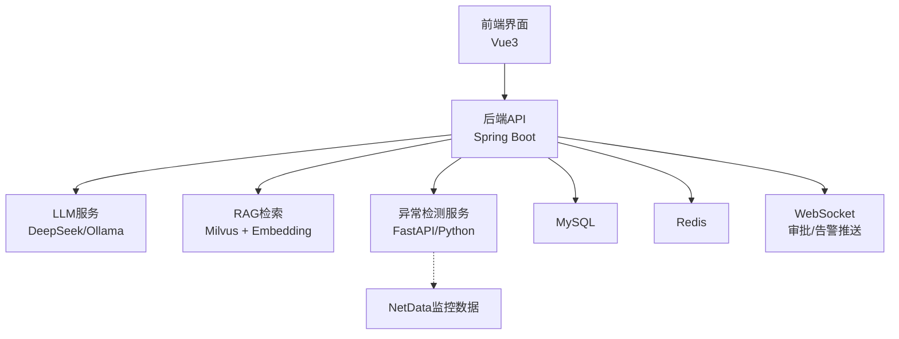
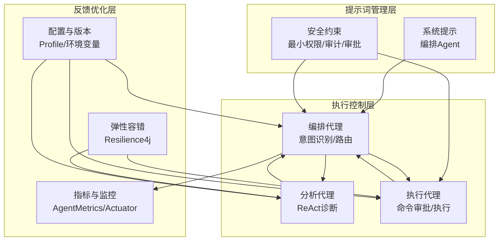
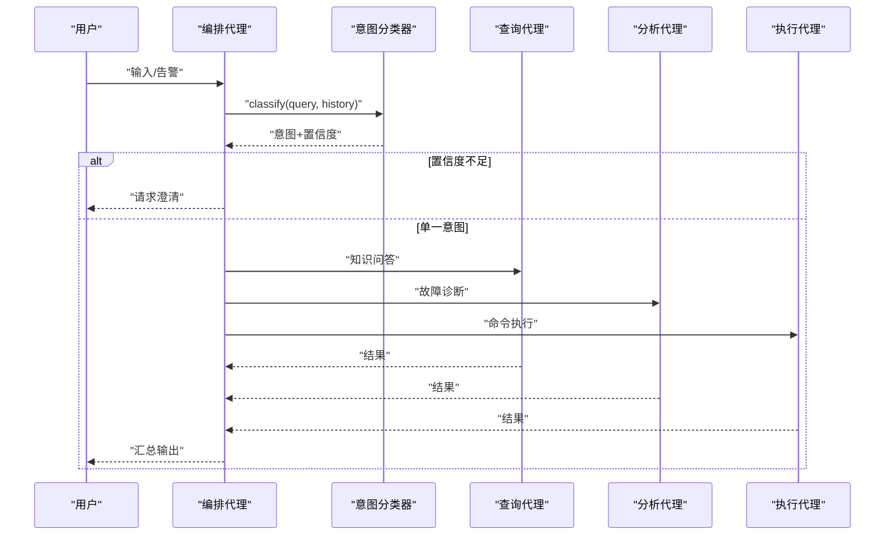
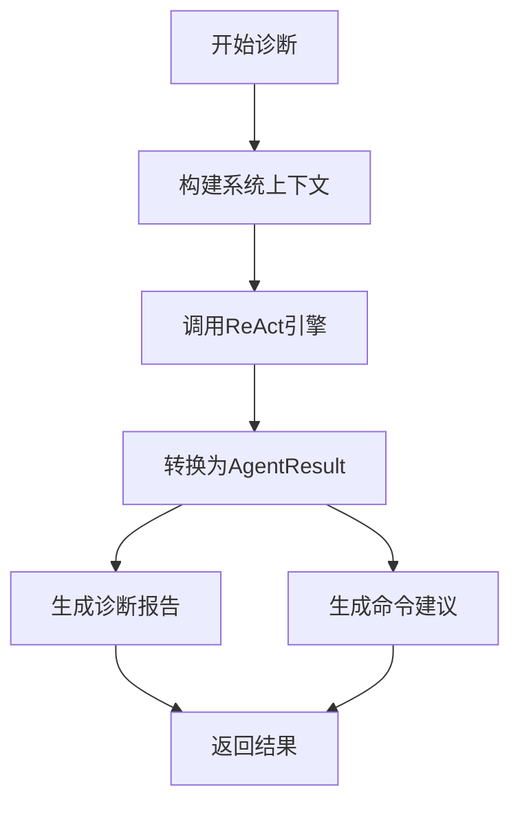
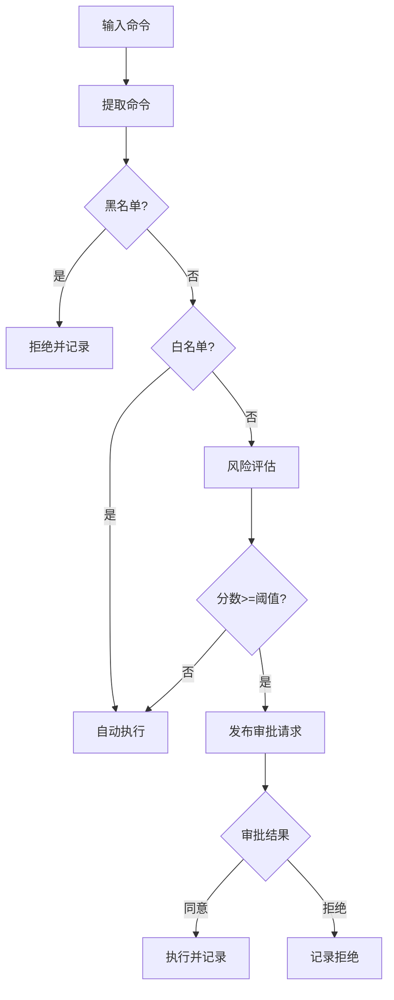
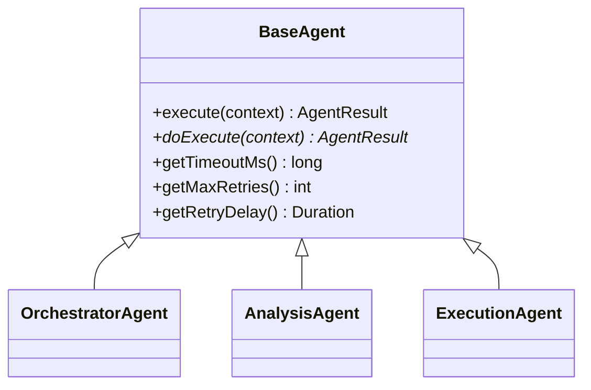
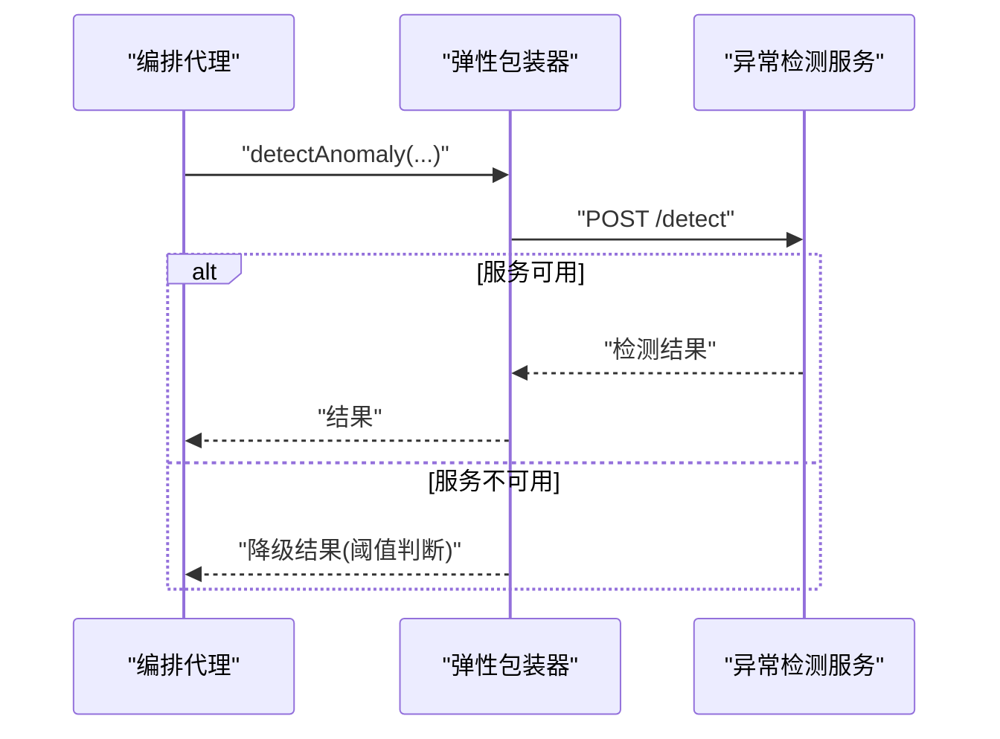
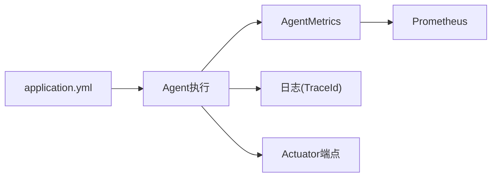
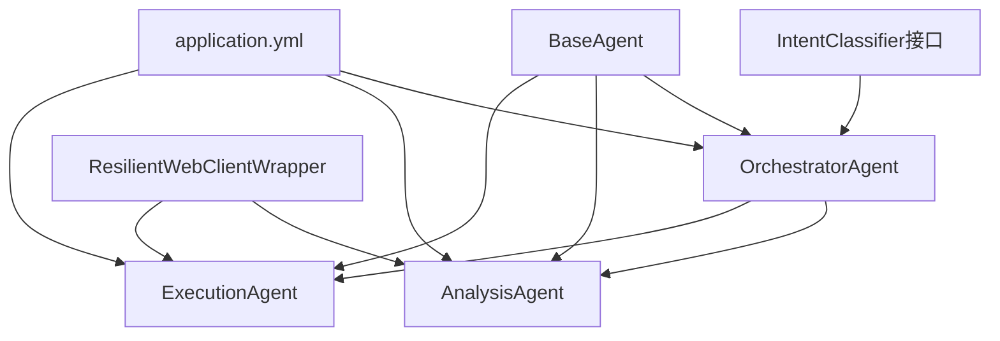

# 系统设计原则

<cite>
**本文引用的文件**
- [orchestrator-system-prompt.md](file://docs/prompts/orchestrator-system-prompt.md)
- [shared-safety-constraints.md](file://docs/prompts/shared-safety-constraints.md)
- [OrchestratorAgent.java](file://netdata-ai-backend/src/main/java/com/netdata/ops/core/agent/OrchestratorAgent.java)
- [ExecutionAgent.java](file://netdata-ai-backend/src/main/java/com/netdata/ops/core/agent/ExecutionAgent.java)
- [AnalysisAgent.java](file://netdata-ai-backend/src/main/java/com/netdata/ops/core/agent/AnalysisAgent.java)
- [BaseAgent.java](file://netdata-ai-backend/src/main/java/com/netdata/ops/core/agent/BaseAgent.java)
- [IntentClassifier.java](file://netdata-ai-backend/src/main/java/com/netdata/ops/core/agent/intent/IntentClassifier.java)
- [application.yml](file://netdata-ai-backend/src/main/resources/application.yml)
- [deployment_guide.md](file://docs/deployment_guide.md)
- [config.py](file://anomaly-detection-service/app/config.py)
- [ResilientWebClientWrapper.java](file://netdata-ai-backend/src/main/java/com/netdata/ops/core/ai/ResilientWebClientWrapper.java)
- [ResilienceConfig.java](file://netdata-ai-backend/src/main/java/com/netdata/ops/config/ResilienceConfig.java)
- [AgentMetrics.java](file://netdata-ai-backend/src/main/java/com/netdata/ops/core/agent/AgentMetrics.java)
- [AgentActuatorEndpoint.java](file://netdata-ai-backend/src/main/java/com/netdata/ops/core/agent/AgentActuatorEndpoint.java)
</cite>

## 目录
1. [引言](#引言)
2. [项目结构](#项目结构)
3. [核心组件](#核心组件)
4. [架构总览](#架构总览)
5. [详细组件分析](#详细组件分析)
6. [依赖关系分析](#依赖关系分析)
7. [性能考虑](#性能考虑)
8. [故障排查指南](#故障排查指南)
9. [结论](#结论)
10. [附录](#附录)

## 引言
本文件围绕“提示词系统”与“智能运维多Agent系统”的设计原则，系统阐述模块化、可扩展、可维护的架构思想，以及分层设计（提示词管理层、执行控制层、反馈优化层）的职责划分。同时给出准确性与效率、安全性与便利性、一致性与灵活性的平衡策略，版本管理与向后兼容的保障机制，性能优化与监控质量保证，以及容错与灾备策略。

## 项目结构
系统采用前后端分离与多服务编排的工程化布局：
- 后端（Spring Boot）：多Agent编排与执行、RAG检索、安全与审计、监控与指标
- 异常检测服务（FastAPI/Python）：独立的异常检测微服务，提供降级与弹性能力
- 前端（Vue3）：用户交互界面，WebSocket 实时通知
- 基础设施：MySQL、Redis、Milvus、Nginx、Prometheus/Grafana

图表来源
- [application.yml:14-314](file://netdata-ai-backend/src/main/resources/application.yml#L14-L314)
- [deployment_guide.md:398-563](file://docs/deployment_guide.md#L398-L563)

章节来源
- [application.yml:14-314](file://netdata-ai-backend/src/main/resources/application.yml#L14-L314)
- [deployment_guide.md:398-563](file://docs/deployment_guide.md#L398-L563)

## 核心组件
- 编排代理（OrchestratorAgent）：意图识别、路由决策、混合意图并行执行与降级
- 分析代理（AnalysisAgent）：ReAct推理闭环，动态工具选择，生成诊断报告与建议
- 执行代理（ExecutionAgent）：命令解析、风险评估、审批流程、审计日志
- 基类（BaseAgent）：模板方法+超时/重试/拦截器/指标/TraceId，统一生命周期与可观测性
- 意图分类器接口（IntentClassifier）：规则+LLM双级分类，支持缓存与回退
- 配置与部署（application.yml、deployment_guide.md、anomaly-detection-service配置）：环境隔离、Profile切换、外部服务集成
- 容错与弹性（ResilientWebClientWrapper、ResilienceConfig）：重试/熔断/超时/降级
- 监控与指标（AgentMetrics、AgentActuatorEndpoint、application.yml Actuator）：Prometheus指标、自定义端点

章节来源
- [OrchestratorAgent.java:11-258](file://netdata-ai-backend/src/main/java/com/netdata/ops/core/agent/OrchestratorAgent.java#L11-L258)
- [AnalysisAgent.java:12-260](file://netdata-ai-backend/src/main/java/com/netdata/ops/core/agent/AnalysisAgent.java#L12-L260)
- [ExecutionAgent.java:13-409](file://netdata-ai-backend/src/main/java/com/netdata/ops/core/agent/ExecutionAgent.java#L13-L409)
- [BaseAgent.java:16-488](file://netdata-ai-backend/src/main/java/com/netdata/ops/core/agent/BaseAgent.java#L16-L488)
- [IntentClassifier.java:7-31](file://netdata-ai-backend/src/main/java/com/netdata/ops/core/agent/intent/IntentClassifier.java#L7-L31)
- [application.yml:14-314](file://netdata-ai-backend/src/main/resources/application.yml#L14-L314)
- [deployment_guide.md:398-563](file://docs/deployment_guide.md#L398-L563)
- [config.py:28-183](file://anomaly-detection-service/app/config.py#L28-L183)
- [ResilientWebClientWrapper.java:31-262](file://netdata-ai-backend/src/main/java/com/netdata/ops/core/ai/ResilientWebClientWrapper.java#L31-L262)
- [ResilienceConfig.java:20-156](file://netdata-ai-backend/src/main/java/com/netdata/ops/config/ResilienceConfig.java#L20-L156)
- [AgentMetrics.java:45-75](file://netdata-ai-backend/src/main/java/com/netdata/ops/core/agent/AgentMetrics.java#L45-L75)
- [AgentActuatorEndpoint.java:170-208](file://netdata-ai-backend/src/main/java/com/netdata/ops/core/agent/AgentActuatorEndpoint.java#L170-L208)

## 架构总览
系统采用“提示词驱动 + 多Agent编排 + 安全控制 + 弹性容错 + 全链路可观测”的分层设计：

- 提示词管理层：通过系统提示与约束（如编排提示、安全约束）定义Agent行为边界与输出格式，确保一致性与可解释性
- 执行控制层：编排代理负责意图识别与路由，分析代理负责诊断，执行代理负责审批与执行，形成闭环
- 反馈优化层：指标采集、告警与审计、降级策略、重试与熔断、版本与配置管理

图表来源
- [orchestrator-system-prompt.md:1-291](file://docs/prompts/orchestrator-system-prompt.md#L1-L291)
- [shared-safety-constraints.md:1-396](file://docs/prompts/shared-safety-constraints.md#L1-L396)
- [OrchestratorAgent.java:11-258](file://netdata-ai-backend/src/main/java/com/netdata/ops/core/agent/OrchestratorAgent.java#L11-L258)
- [AnalysisAgent.java:12-260](file://netdata-ai-backend/src/main/java/com/netdata/ops/core/agent/AnalysisAgent.java#L12-L260)
- [ExecutionAgent.java:13-409](file://netdata-ai-backend/src/main/java/com/netdata/ops/core/agent/ExecutionAgent.java#L13-L409)
- [AgentMetrics.java:45-75](file://netdata-ai-backend/src/main/java/com/netdata/ops/core/agent/AgentMetrics.java#L45-L75)
- [ResilientWebClientWrapper.java:31-262](file://netdata-ai-backend/src/main/java/com/netdata/ops/core/ai/ResilientWebClientWrapper.java#L31-L262)
- [application.yml:204-237](file://netdata-ai-backend/src/main/resources/application.yml#L204-L237)

## 详细组件分析

### 编排代理（OrchestratorAgent）
- 双级意图分类：规则快速路径 + LLM语义分类，结合置信度阈值与缓存，兼顾准确性与效率
- 混合意图并行：通过CompletableFuture并行调用多个子Agent，失败时自动降级为串行
- 输出格式与实体抽取：严格遵循JSON结构，包含意图、置信度、路由计划、实体与紧急度
- 安全边界：禁止直接生成执行命令，涉及删除/修改/重启的操作必须经执行代理与审批

图表来源
- [OrchestratorAgent.java:70-149](file://netdata-ai-backend/src/main/java/com/netdata/ops/core/agent/OrchestratorAgent.java#L70-L149)
- [IntentClassifier.java:20-30](file://netdata-ai-backend/src/main/java/com/netdata/ops/core/agent/intent/IntentClassifier.java#L20-L30)
- [orchestrator-system-prompt.md:70-136](file://docs/prompts/orchestrator-system-prompt.md#L70-L136)

章节来源
- [OrchestratorAgent.java:70-258](file://netdata-ai-backend/src/main/java/com/netdata/ops/core/agent/OrchestratorAgent.java#L70-L258)
- [orchestrator-system-prompt.md:26-136](file://docs/prompts/orchestrator-system-prompt.md#L26-L136)

### 分析代理（AnalysisAgent）
- ReAct动态推理：将工具选择与调用交给LLM，避免硬编码流程，提升灵活性
- 诊断报告与建议：从最终答案抽取摘要、根因、建议，形成结构化输出
- 超时控制：覆盖基类超时，适配较长推理时间

图表来源
- [AnalysisAgent.java:46-132](file://netdata-ai-backend/src/main/java/com/netdata/ops/core/agent/AnalysisAgent.java#L46-L132)

章节来源
- [AnalysisAgent.java:12-260](file://netdata-ai-backend/src/main/java/com/netdata/ops/core/agent/AnalysisAgent.java#L12-L260)

### 执行代理（ExecutionAgent）
- 命令解析与安全：黑名单/白名单/灰名单三色管控，风险评估四维打分
- 审批流程：事件总线发布审批请求，审批通过后执行，记录审计日志
- 人类在回路：高风险命令必须人工审批，确保安全与可追溯

图表来源
- [ExecutionAgent.java:133-379](file://netdata-ai-backend/src/main/java/com/netdata/ops/core/agent/ExecutionAgent.java#L133-L379)
- [shared-safety-constraints.md:29-127](file://docs/prompts/shared-safety-constraints.md#L29-L127)

章节来源
- [ExecutionAgent.java:13-409](file://netdata-ai-backend/src/main/java/com/netdata/ops/core/agent/ExecutionAgent.java#L13-L409)
- [shared-safety-constraints.md:1-396](file://docs/prompts/shared-safety-constraints.md#L1-L396)

### 基类（BaseAgent）与通用能力
- 模板方法：统一执行流程，封装超时、重试、拦截器、指标、TraceId
- 生命周期钩子：onStart/onComplete/onError/onTimeout，便于扩展
- 可配置超时/重试/延迟，适配不同Agent特性

图表来源
- [BaseAgent.java:87-424](file://netdata-ai-backend/src/main/java/com/netdata/ops/core/agent/BaseAgent.java#L87-L424)

章节来源
- [BaseAgent.java:16-488](file://netdata-ai-backend/src/main/java/com/netdata/ops/core/agent/BaseAgent.java#L16-L488)

### 容错与弹性（ResilientWebClientWrapper + Resilience4j）
- 重试/熔断/超时/降级：对外部服务（异常检测）提供统一弹性策略
- 降级策略：Python服务不可用时，以阈值规则降级返回，保证基本可用
- 指标与可观测：记录熔断状态、失败率、重试事件

图表来源
- [ResilientWebClientWrapper.java:144-236](file://netdata-ai-backend/src/main/java/com/netdata/ops/core/ai/ResilientWebClientWrapper.java#L144-L236)
- [ResilienceConfig.java:110-156](file://netdata-ai-backend/src/main/java/com/netdata/ops/config/ResilienceConfig.java#L110-L156)

章节来源
- [ResilientWebClientWrapper.java:31-262](file://netdata-ai-backend/src/main/java/com/netdata/ops/core/ai/ResilientWebClientWrapper.java#L31-L262)
- [ResilienceConfig.java:20-156](file://netdata-ai-backend/src/main/java/com/netdata/ops/config/ResilienceConfig.java#L20-L156)

### 监控与质量保证
- 指标采集：执行耗时、成功/失败计数、超时计数
- Actuator端点：自定义Agent指标查询，支持分聚合统计
- 日志与TraceId：MDC自动注入traceId，统一链路追踪
- 配置与Profile：开发/生产环境隔离，敏感信息从环境变量读取

图表来源
- [AgentMetrics.java:45-75](file://netdata-ai-backend/src/main/java/com/netdata/ops/core/agent/AgentMetrics.java#L45-L75)
- [AgentActuatorEndpoint.java:170-208](file://netdata-ai-backend/src/main/java/com/netdata/ops/core/agent/AgentActuatorEndpoint.java#L170-L208)
- [application.yml:204-237](file://netdata-ai-backend/src/main/resources/application.yml#L204-L237)

章节来源
- [AgentMetrics.java:45-75](file://netdata-ai-backend/src/main/java/com/netdata/ops/core/agent/AgentMetrics.java#L45-L75)
- [AgentActuatorEndpoint.java:170-208](file://netdata-ai-backend/src/main/java/com/netdata/ops/core/agent/AgentActuatorEndpoint.java#L170-L208)
- [application.yml:204-237](file://netdata-ai-backend/src/main/resources/application.yml#L204-L237)

## 依赖关系分析
- 组件耦合：编排代理依赖意图分类器接口，分析/执行代理继承基类，体现高内聚、低耦合
- 外部依赖：LLM、Milvus、Redis、MySQL、异常检测服务，通过配置与容错包装解耦
- 配置与部署：Profile区分环境，Docker Compose统一编排，Actuator暴露监控指标

图表来源
- [IntentClassifier.java:20-30](file://netdata-ai-backend/src/main/java/com/netdata/ops/core/agent/intent/IntentClassifier.java#L20-L30)
- [OrchestratorAgent.java:37-68](file://netdata-ai-backend/src/main/java/com/netdata/ops/core/agent/OrchestratorAgent.java#L37-L68)
- [AnalysisAgent.java:35-44](file://netdata-ai-backend/src/main/java/com/netdata/ops/core/agent/AnalysisAgent.java#L35-L44)
- [ExecutionAgent.java:83-89](file://netdata-ai-backend/src/main/java/com/netdata/ops/core/agent/ExecutionAgent.java#L83-L89)
- [ResilientWebClientWrapper.java:55-75](file://netdata-ai-backend/src/main/java/com/netdata/ops/core/ai/ResilientWebClientWrapper.java#L55-L75)
- [application.yml:14-314](file://netdata-ai-backend/src/main/resources/application.yml#L14-L314)

章节来源
- [IntentClassifier.java:7-31](file://netdata-ai-backend/src/main/java/com/netdata/ops/core/agent/intent/IntentClassifier.java#L7-L31)
- [OrchestratorAgent.java:37-68](file://netdata-ai-backend/src/main/java/com/netdata/ops/core/agent/OrchestratorAgent.java#L37-L68)
- [AnalysisAgent.java:35-44](file://netdata-ai-backend/src/main/java/com/netdata/ops/core/agent/AnalysisAgent.java#L35-L44)
- [ExecutionAgent.java:83-89](file://netdata-ai-backend/src/main/java/com/netdata/ops/core/agent/ExecutionAgent.java#L83-L89)
- [ResilientWebClientWrapper.java:55-75](file://netdata-ai-backend/src/main/java/com/netdata/ops/core/ai/ResilientWebClientWrapper.java#L55-L75)
- [application.yml:14-314](file://netdata-ai-backend/src/main/resources/application.yml#L14-L314)

## 性能考虑
- 准确性与效率平衡
  - 双级意图分类：规则快速命中+LLM语义兜底，避免昂贵推理的重复调用
  - 混合意图并行：通过CompletableFuture并行执行，缩短端到端时延
  - 超时与重试：基类统一超时控制与指数退避重试，防止雪崩
- 安全性与便利性平衡
  - 三色命令管控：黑名单禁用、白名单自动、灰名单审批，兼顾效率与安全
  - 审批流程：高风险操作必须人工确认，降低误操作风险
- 一致性与灵活性平衡
  - 系统提示与约束：统一输出格式与安全边界，保证一致性；ReAct动态推理与意图分类器接口提供灵活扩展
- 性能优化最佳实践
  - 缓存：Redis缓存意图分类结果，减少重复计算
  - 弹性：Resilience4j重试/熔断/超时/降级，保障外部依赖故障下的稳定性
  - 指标：Prometheus+Actuator，持续观测关键路径耗时与失败率

章节来源
- [OrchestratorAgent.java:21-26](file://netdata-ai-backend/src/main/java/com/netdata/ops/core/agent/OrchestratorAgent.java#L21-L26)
- [BaseAgent.java:23-30](file://netdata-ai-backend/src/main/java/com/netdata/ops/core/agent/BaseAgent.java#L23-L30)
- [shared-safety-constraints.md:29-127](file://docs/prompts/shared-safety-constraints.md#L29-L127)
- [ResilientWebClientWrapper.java:31-45](file://netdata-ai-backend/src/main/java/com/netdata/ops/core/ai/ResilientWebClientWrapper.java#L31-L45)
- [application.yml:47-59](file://netdata-ai-backend/src/main/resources/application.yml#L47-L59)

## 故障排查指南
- 链路追踪与日志
  - 使用MDC traceId串联请求，便于定位问题
  - 日志格式包含traceId、类名、消息，便于集中检索
- 指标与端点
  - 通过Actuator端点查询Agent耗时统计、超时次数、执行总数
  - Prometheus抓取agent.execution.duration、agent.execution.timeout等指标
- 容错与降级
  - Python异常检测服务不可用时，自动降级为阈值判断，记录降级标记
  - 熔断器状态与失败率可用于快速判断外部依赖健康状况
- 配置与环境
  - Profile切换（dev/prod）与环境变量覆盖，确保敏感信息不泄露
  - Docker Compose健康检查与日志输出，便于快速定位容器问题

章节来源
- [BaseAgent.java:112-126](file://netdata-ai-backend/src/main/java/com/netdata/ops/core/agent/BaseAgent.java#L112-L126)
- [AgentActuatorEndpoint.java:170-208](file://netdata-ai-backend/src/main/java/com/netdata/ops/core/agent/AgentActuatorEndpoint.java#L170-L208)
- [ResilientWebClientWrapper.java:242-261](file://netdata-ai-backend/src/main/java/com/netdata/ops/core/ai/ResilientWebClientWrapper.java#L242-L261)
- [application.yml:204-237](file://netdata-ai-backend/src/main/resources/application.yml#L204-L237)
- [deployment_guide.md:542-563](file://docs/deployment_guide.md#L542-L563)

## 结论
本系统以“提示词+多Agent+安全+弹性+可观测”为核心设计，通过分层职责划分与平衡策略，实现高可用、可扩展、可维护的智能运维平台。提示词系统确保一致性与可解释性，编排代理实现意图识别与路由，分析与执行代理分别承担诊断与审批执行，配合弹性容错与监控指标，形成闭环的质量保障体系。

## 附录
- 版本管理与向后兼容
  - 提示词与约束文档版本信息明确，便于追踪演进
  - 基类提供增强构造函数，新功能可渐进式升级，不影响既有子类
  - 配置文件支持Profile与环境变量，保证部署一致性与可移植性
- 容灾与备份
  - Docker Compose编排，健康检查与日志持久化
  - MySQL备份与恢复流程，确保数据可恢复

章节来源
- [orchestrator-system-prompt.md:286-291](file://docs/prompts/orchestrator-system-prompt.md#L286-L291)
- [shared-safety-constraints.md:390-396](file://docs/prompts/shared-safety-constraints.md#L390-L396)
- [BaseAgent.java:69-85](file://netdata-ai-backend/src/main/java/com/netdata/ops/core/agent/BaseAgent.java#L69-L85)
- [deployment_guide.md:791-800](file://docs/deployment_guide.md#L791-L800)