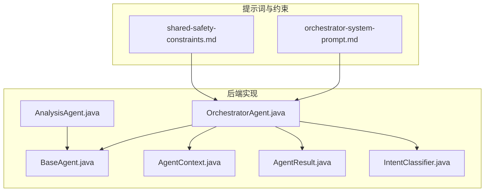
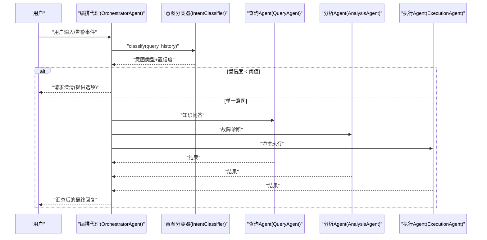
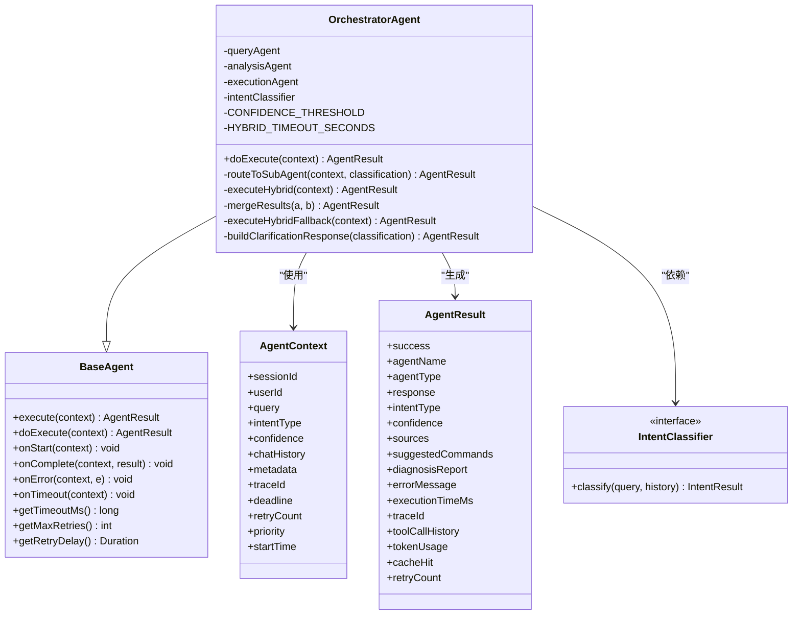
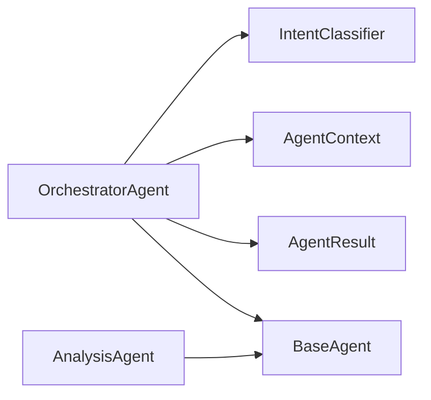

# 编排代理系统提示词

<cite>
**本文引用的文件**   
- [orchestrator-system-prompt.md](file://docs/prompts/orchestrator-system-prompt.md)
- [shared-safety-constraints.md](file://docs/prompts/shared-safety-constraints.md)
- [OrchestratorAgent.java](file://netdata-ai-backend/src/main/java/com/netdata/ops/core/agent/OrchestratorAgent.java)
- [BaseAgent.java](file://netdata-ai-backend/src/main/java/com/netdata/ops/core/agent/BaseAgent.java)
- [AgentContext.java](file://netdata-ai-backend/src/main/java/com/netdata/ops/core/agent/AgentContext.java)
- [AgentResult.java](file://netdata-ai-backend/src/main/java/com/netdata/ops/core/agent/AgentResult.java)
- [IntentClassifier.java](file://netdata-ai-backend/src/main/java/com/netdata/ops/core/agent/intent/IntentClassifier.java)
- [AnalysisAgent.java](file://netdata-ai-backend/src/main/java/com/netdata/ops/core/agent/AnalysisAgent.java)
</cite>

## 目录
1. [简介](#简介)
2. [项目结构](#项目结构)
3. [核心组件](#核心组件)
4. [架构总览](#架构总览)
5. [详细组件分析](#详细组件分析)
6. [依赖关系分析](#依赖关系分析)
7. [性能考量](#性能考量)
8. [故障排查指南](#故障排查指南)
9. [结论](#结论)
10. [附录](#附录)

## 简介
本技术文档围绕“编排代理系统”的提示词设计与实现展开，聚焦于编排代理的角色定义、能力边界与三大核心流程：意图识别、任务路由、结果汇总。文档同时阐述意图分类标准、路由决策规则（单一路由与混合路由）、输出格式规范、约束条件（置信度处理、安全边界、超时控制、禁止事项），并通过示例对话展示不同意图类型的处理过程，帮助读者全面理解并落地该系统。

## 项目结构
本项目采用前后端分离与提示词工程化结合的方式组织：
- 提示词与安全约束位于 docs/prompts 下，作为系统行为与安全边界的权威定义。
- 后端 Java 代码位于 netdata-ai-backend，包含 Agent 基类、编排代理与各子 Agent 的实现，体现工业级 Agent 基础设施与执行流程。

图表来源
- [orchestrator-system-prompt.md:1-291](file://docs/prompts/orchestrator-system-prompt.md#L1-L291)
- [shared-safety-constraints.md:1-396](file://docs/prompts/shared-safety-constraints.md#L1-L396)
- [BaseAgent.java:1-480](file://netdata-ai-backend/src/main/java/com/netdata/ops/core/agent/BaseAgent.java#L1-L480)
- [OrchestratorAgent.java:1-254](file://netdata-ai-backend/src/main/java/com/netdata/ops/core/agent/OrchestratorAgent.java#L1-L254)
- [AgentContext.java:1-131](file://netdata-ai-backend/src/main/java/com/netdata/ops/core/agent/AgentContext.java#L1-L131)
- [AgentResult.java:1-194](file://netdata-ai-backend/src/main/java/com/netdata/ops/core/agent/AgentResult.java#L1-L194)
- [IntentClassifier.java:1-31](file://netdata-ai-backend/src/main/java/com/netdata/ops/core/agent/intent/IntentClassifier.java#L1-L31)
- [AnalysisAgent.java:1-120](file://netdata-ai-backend/src/main/java/com/netdata/ops/core/agent/AnalysisAgent.java#L1-L120)

章节来源
- [orchestrator-system-prompt.md:1-291](file://docs/prompts/orchestrator-system-prompt.md#L1-L291)
- [shared-safety-constraints.md:1-396](file://docs/prompts/shared-safety-constraints.md#L1-L396)
- [BaseAgent.java:1-480](file://netdata-ai-backend/src/main/java/com/netdata/ops/core/agent/BaseAgent.java#L1-L480)
- [OrchestratorAgent.java:1-254](file://netdata-ai-backend/src/main/java/com/netdata/ops/core/agent/OrchestratorAgent.java#L1-L254)
- [AgentContext.java:1-131](file://netdata-ai-backend/src/main/java/com/netdata/ops/core/agent/AgentContext.java#L1-L131)
- [AgentResult.java:1-194](file://netdata-ai-backend/src/main/java/com/netdata/ops/core/agent/AgentResult.java#L1-L194)
- [IntentClassifier.java:1-31](file://netdata-ai-backend/src/main/java/com/netdata/ops/core/agent/intent/IntentClassifier.java#L1-L31)
- [AnalysisAgent.java:1-120](file://netdata-ai-backend/src/main/java/com/netdata/ops/core/agent/AnalysisAgent.java#L1-L120)

## 核心组件
- 编排代理（OrchestratorAgent）：负责意图识别、任务路由与结果汇总，采用双级分类器（规则快速路径 + LLM 语义分类），并针对混合意图实现并行执行与降级策略。
- Agent 基类（BaseAgent）：提供统一的执行模板方法、超时控制、重试机制、拦截器链、链路追踪、生命周期钩子与指标采集。
- 上下文与结果（AgentContext、AgentResult）：封装执行所需上下文与输出结果，支持链路追踪、工具调用历史、Token 消耗、缓存命中等可观测性字段。
- 意图分类器接口（IntentClassifier）：定义统一的意图分类契约，支持规则/关键词快速分类与 LLM 语义兜底的组合策略。
- 子 Agent：查询 Agent（RAG 问答）、分析 Agent（ReAct 诊断）、执行 Agent（Human-in-Loop），分别承担知识检索、故障诊断与受控执行。

章节来源
- [OrchestratorAgent.java:1-254](file://netdata-ai-backend/src/main/java/com/netdata/ops/core/agent/OrchestratorAgent.java#L1-L254)
- [BaseAgent.java:1-480](file://netdata-ai-backend/src/main/java/com/netdata/ops/core/agent/BaseAgent.java#L1-L480)
- [AgentContext.java:1-131](file://netdata-ai-backend/src/main/java/com/netdata/ops/core/agent/AgentContext.java#L1-L131)
- [AgentResult.java:1-194](file://netdata-ai-backend/src/main/java/com/netdata/ops/core/agent/AgentResult.java#L1-L194)
- [IntentClassifier.java:1-31](file://netdata-ai-backend/src/main/java/com/netdata/ops/core/agent/intent/IntentClassifier.java#L1-L31)
- [AnalysisAgent.java:1-120](file://netdata-ai-backend/src/main/java/com/netdata/ops/core/agent/AnalysisAgent.java#L1-L120)

## 架构总览
编排代理系统以“提示词定义 + 工业级 Agent 基础设施”为核心，形成如下闭环：
- 输入：用户查询或告警事件
- 流程：意图识别 → 任务路由 → 结果汇总
- 输出：标准化 JSON 结果（含路由计划、实体抽取、紧急程度与可选直接回复）

图表来源
- [OrchestratorAgent.java:70-93](file://netdata-ai-backend/src/main/java/com/netdata/ops/core/agent/OrchestratorAgent.java#L70-L93)
- [IntentClassifier.java:22-29](file://netdata-ai-backend/src/main/java/com/netdata/ops/core/agent/intent/IntentClassifier.java#L22-L29)
- [orchestrator-system-prompt.md:160-282](file://docs/prompts/orchestrator-system-prompt.md#L160-L282)

## 详细组件分析

### 角色定义与能力边界
- 身份：资深运维架构师 + 智能调度专家
- 能力：
  - 精准识别用户意图（知识问答 / 故障诊断 / 命令执行 / 混合意图）
  - 智能路由至专业子 Agent
  - 汇总多 Agent 结果，生成连贯回复

章节来源
- [orchestrator-system-prompt.md:3-12](file://docs/prompts/orchestrator-system-prompt.md#L3-L12)

### 任务描述与三大流程
- 意图识别：分析输入内容，判断主要意图
- 任务路由：根据意图选择合适的子 Agent
- 结果汇总：整合子 Agent 输出，生成最终回复

章节来源
- [orchestrator-system-prompt.md:16-22](file://docs/prompts/orchestrator-system-prompt.md#L16-L22)

### 意图分类标准与特征关键词
- 知识问答（KNOWLEDGE_QUERY）：关键词如“如何、什么是、怎么配置、原理、最佳实践”，路由目标 Query Agent
- 故障诊断（FAULT_DIAGNOSIS）：关键词如“告警、异常、故障、排查、根因、诊断、飙升、下降”，路由目标 Analysis Agent
- 命令执行（COMMAND_EXECUTE）：关键词如“执行、运行、重启、清理、部署、停止、启动”，路由目标 Execution Agent
- 混合意图（HYBRID）：包含多个意图，路由目标多 Agent 协作

章节来源
- [orchestrator-system-prompt.md:26-33](file://docs/prompts/orchestrator-system-prompt.md#L26-L33)

### 路由决策规则
- 单一意图路由：KNOWLEDGE_QUERY → QueryAgent；FAULT_DIAGNOSIS → AnalysisAgent；COMMAND_EXECUTE → ExecutionAgent
- 混合意图路由策略：
  - 诊断 + 执行：Analysis → Execution
  - 问答 + 诊断：Query → Analysis
  - 诊断 + 问答 + 执行：Query → Analysis → Execution

章节来源
- [orchestrator-system-prompt.md:37-57](file://docs/prompts/orchestrator-system-prompt.md#L37-L57)

### 紧急程度评估
- CRITICAL：生产服务宕机、数据丢失风险，最高优先级
- HIGH：服务性能严重下降、关键告警，高优先级
- MEDIUM：一般告警、性能波动，中等优先级
- LOW：知识问答、配置咨询，低优先级

章节来源
- [orchestrator-system-prompt.md:59-66](file://docs/prompts/orchestrator-system-prompt.md#L59-L66)

### 输出格式规范（JSON 结构）
- 必须输出字段：
  - intent：意图类型（KNOWLEDGE_QUERY/FAULT_DIAGNOSIS/COMMAND_EXECUTE/HYBRID）
  - confidence：置信度（0.0-1.0）
  - routing_plan：包含 agents（Agent 列表）、execution_mode（SEQUENTIAL/PARALLEL）、reasoning（路由理由）
  - extracted_entities：包含 metrics、time_range、hosts、alert_ids
  - urgency_level：紧急程度（CRITICAL/HIGH/MEDIUM/LOW）
  - response_to_user：可选，直接回复简单问题

章节来源
- [orchestrator-system-prompt.md:70-106](file://docs/prompts/orchestrator-system-prompt.md#L70-L106)

### 约束条件
- 置信度处理：当置信度 < 0.7 时，请求用户澄清并提供可能的意图选项
- 安全边界：涉及删除、修改、重启等操作必须路由至 Execution Agent，且会触发 Human-in-the-Loop 审批流程；禁止直接生成执行命令
- 超时控制：单个请求最多路由 3 个 Agent；避免过长等待，优先返回部分结果
- 禁止事项：禁止直接生成执行命令；禁止跳过意图识别直接路由；禁止忽略告警优先级；禁止编造不存在的告警信息

章节来源
- [orchestrator-system-prompt.md:109-136](file://docs/prompts/orchestrator-system-prompt.md#L109-L136)

### 示例对话
- 示例 1：知识问答（KNOWLEDGE_QUERY）
- 示例 2：故障诊断（FAULT_DIAGNOSIS）
- 示例 3：命令执行（COMMAND_EXECUTE）
- 示例 4：混合意图（HYBRID）
- 示例 5：低置信度需要澄清（UNKNOWN）

章节来源
- [orchestrator-system-prompt.md:160-282](file://docs/prompts/orchestrator-system-prompt.md#L160-L282)

### 编排代理实现要点（代码级）
- 双级分类器：规则快速路径 + LLM 语义分类；置信度阈值 0.7；低置信度时构建澄清响应
- 混合意图并行执行：使用 CompletableFuture 并行调用 Analysis 与 Query，超时 25 秒；异常时降级为串行执行
- 结果汇总：合并多个子 Agent 的响应，补充建议执行命令与诊断报告

图表来源
- [BaseAgent.java:39-480](file://netdata-ai-backend/src/main/java/com/netdata/ops/core/agent/BaseAgent.java#L39-L480)
- [OrchestratorAgent.java:37-254](file://netdata-ai-backend/src/main/java/com/netdata/ops/core/agent/OrchestratorAgent.java#L37-L254)
- [AgentContext.java:25-131](file://netdata-ai-backend/src/main/java/com/netdata/ops/core/agent/AgentContext.java#L25-L131)
- [AgentResult.java:23-194](file://netdata-ai-backend/src/main/java/com/netdata/ops/core/agent/AgentResult.java#L23-L194)
- [IntentClassifier.java:20-31](file://netdata-ai-backend/src/main/java/com/netdata/ops/core/agent/intent/IntentClassifier.java#L20-L31)

章节来源
- [OrchestratorAgent.java:37-254](file://netdata-ai-backend/src/main/java/com/netdata/ops/core/agent/OrchestratorAgent.java#L37-L254)
- [BaseAgent.java:39-480](file://netdata-ai-backend/src/main/java/com/netdata/ops/core/agent/BaseAgent.java#L39-L480)
- [AgentContext.java:25-131](file://netdata-ai-backend/src/main/java/com/netdata/ops/core/agent/AgentContext.java#L25-L131)
- [AgentResult.java:23-194](file://netdata-ai-backend/src/main/java/com/netdata/ops/core/agent/AgentResult.java#L23-L194)
- [IntentClassifier.java:20-31](file://netdata-ai-backend/src/main/java/com/netdata/ops/core/agent/intent/IntentClassifier.java#L20-L31)

### 混合意图执行顺序与决策逻辑
- 执行顺序：
  - 诊断 + 执行：Analysis → Execution
  - 问答 + 诊断：Query → Analysis
  - 诊断 + 问答 + 执行：Query → Analysis → Execution
- 决策逻辑：编排代理根据意图类型选择单一或并行执行路径；并行执行采用超时控制与降级策略，确保系统稳定与响应及时。

章节来源
- [orchestrator-system-prompt.md:49-57](file://docs/prompts/orchestrator-system-prompt.md#L49-L57)
- [OrchestratorAgent.java:120-145](file://netdata-ai-backend/src/main/java/com/netdata/ops/core/agent/OrchestratorAgent.java#L120-L145)

### 安全约束与合规保障
- 安全原则：最小权限、防御优先、审计追溯
- 命令执行安全：禁止项清单、需要审批的命令、可自动执行的命令
- 数据安全：敏感数据识别、脱敏规则、日志安全
- 网络安全：访问限制、URL 安全验证
- 用户输入安全：输入验证、长度限制
- 权限控制：角色权限矩阵、操作审批流程
- 错误处理安全：错误信息脱敏、异常恢复
- 审计日志规范：日志格式、必须记录事件
- 应急响应：安全事件响应流程、紧急联系人

章节来源
- [shared-safety-constraints.md:1-396](file://docs/prompts/shared-safety-constraints.md#L1-L396)

## 依赖关系分析
- 编排代理依赖意图分类器进行意图识别，并根据结果路由到 Query、Analysis、Execution 任一或并行执行。
- 基类提供统一的执行模板、超时与重试、拦截器链与链路追踪，降低各子类重复实现成本。
- 上下文与结果对象贯穿整个执行链路，承载可观测性与可追溯性所需的数据。

图表来源
- [OrchestratorAgent.java:37-68](file://netdata-ai-backend/src/main/java/com/netdata/ops/core/agent/OrchestratorAgent.java#L37-L68)
- [BaseAgent.java:39-480](file://netdata-ai-backend/src/main/java/com/netdata/ops/core/agent/BaseAgent.java#L39-L480)
- [AgentContext.java:25-131](file://netdata-ai-backend/src/main/java/com/netdata/ops/core/agent/AgentContext.java#L25-L131)
- [AgentResult.java:23-194](file://netdata-ai-backend/src/main/java/com/netdata/ops/core/agent/AgentResult.java#L23-L194)
- [AnalysisAgent.java:39-76](file://netdata-ai-backend/src/main/java/com/netdata/ops/core/agent/AnalysisAgent.java#L39-L76)

章节来源
- [OrchestratorAgent.java:37-68](file://netdata-ai-backend/src/main/java/com/netdata/ops/core/agent/OrchestratorAgent.java#L37-L68)
- [BaseAgent.java:39-480](file://netdata-ai-backend/src/main/java/com/netdata/ops/core/agent/BaseAgent.java#L39-L480)
- [AgentContext.java:25-131](file://netdata-ai-backend/src/main/java/com/netdata/ops/core/agent/AgentContext.java#L25-L131)
- [AgentResult.java:23-194](file://netdata-ai-backend/src/main/java/com/netdata/ops/core/agent/AgentResult.java#L23-L194)
- [AnalysisAgent.java:39-76](file://netdata-ai-backend/src/main/java/com/netdata/ops/core/agent/AnalysisAgent.java#L39-L76)

## 性能考量
- 超时控制：编排代理对混合意图并行执行设置超时（25 秒），异常时降级为串行执行，避免长时间等待。
- 重试机制：基类提供可配置的重试次数与延迟，子类可按需启用，提升系统鲁棒性。
- 并行执行：使用 CompletableFuture 实现非阻塞并行，提升混合意图响应速度。
- 指标采集：可选注入指标器，记录执行耗时、超时与成功/失败情况，支撑性能优化与成本核算。

章节来源
- [OrchestratorAgent.java:51-56](file://netdata-ai-backend/src/main/java/com/netdata/ops/core/agent/OrchestratorAgent.java#L51-L56)
- [OrchestratorAgent.java:120-145](file://netdata-ai-backend/src/main/java/com/netdata/ops/core/agent/OrchestratorAgent.java#L120-L145)
- [BaseAgent.java:224-310](file://netdata-ai-backend/src/main/java/com/netdata/ops/core/agent/BaseAgent.java#L224-L310)
- [BaseAgent.java:361-387](file://netdata-ai-backend/src/main/java/com/netdata/ops/core/agent/BaseAgent.java#L361-L387)

## 故障排查指南
- 低置信度导致澄清：当置信度低于阈值（0.7）时，编排代理会返回澄清消息，引导用户提供更明确的意图。
- 超时与降级：混合意图并行执行超时后自动降级为串行执行，确保系统可用性。
- 审批流程：涉及高风险操作时，执行代理会触发 Human-in-the-Loop 审批流程，避免误操作。
- 日志与追踪：基类提供链路追踪（traceId）与 MDC 注入，便于问题定位与调用链分析。

章节来源
- [OrchestratorAgent.java:86-89](file://netdata-ai-backend/src/main/java/com/netdata/ops/core/agent/OrchestratorAgent.java#L86-L89)
- [OrchestratorAgent.java:140-144](file://netdata-ai-backend/src/main/java/com/netdata/ops/core/agent/OrchestratorAgent.java#L140-L144)
- [BaseAgent.java:107-222](file://netdata-ai-backend/src/main/java/com/netdata/ops/core/agent/BaseAgent.java#L107-L222)

## 结论
本提示词与实现体系将“运维架构师的严谨”与“智能调度专家的高效”相结合，通过明确的意图分类、严格的路由规则、标准化的输出格式与完备的安全约束，构建了可扩展、可观测、可审计的编排代理系统。代码层面的双级分类器、并行执行与降级策略进一步提升了系统的鲁棒性与用户体验。

## 附录
- 提示词版本信息：版本 1.0.0，更新时间 2026-04-03，维护者 刘一舟
- 安全约束版本信息：版本 1.0.0，更新时间 2026-04-03，维护者 刘一舟，审核者 安全团队

章节来源
- [orchestrator-system-prompt.md:286-291](file://docs/prompts/orchestrator-system-prompt.md#L286-L291)
- [shared-safety-constraints.md:390-396](file://docs/prompts/shared-safety-constraints.md#L390-L396)