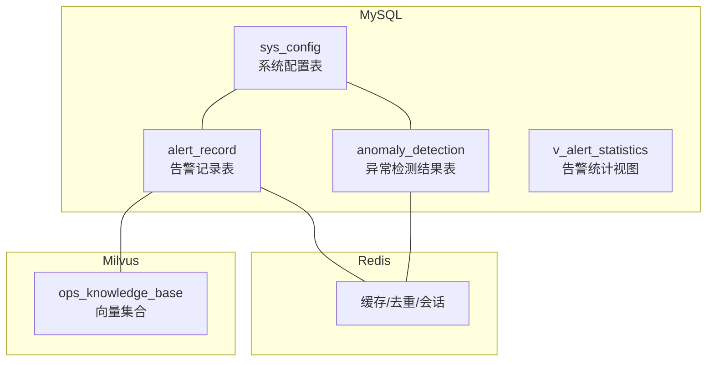
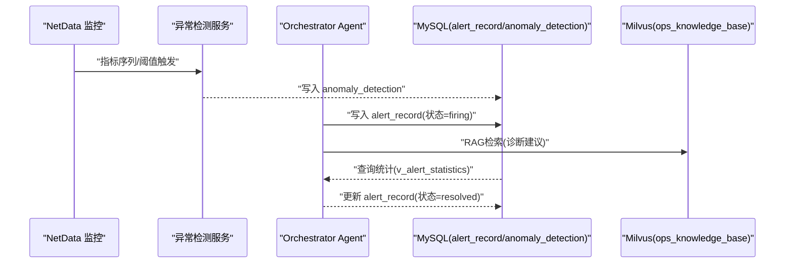
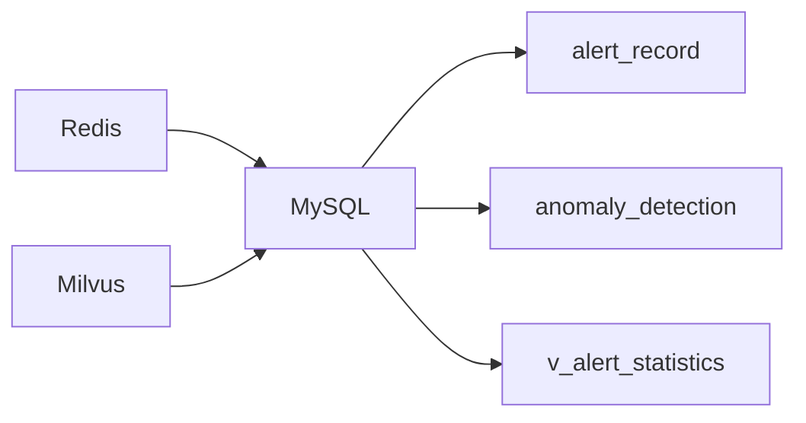

# 告警管理数据库

<cite>
**本文引用的文件**
- [init.sql](file://sql/init.sql)
- [docker-compose.yml](file://docker-compose.yml)
- [milvus_collection.yaml](file://config/milvus_collection.yaml)
- [init_milvus.py](file://scripts/init_milvus.py)
- [test_milvus_connection.py](file://tests/test_milvus_connection.py)
- [PROJECT_CONTEXT.md](file://PROJECT_CONTEXT.md)
- [orchestrator-system-prompt.md](file://docs/prompts/orchestrator-system-prompt.md)
- [shared-safety-constraints.md](file://docs/prompts/shared-safety-constraints.md)
</cite>

## 目录
1. [简介](#简介)
2. [项目结构](#项目结构)
3. [核心组件](#核心组件)
4. [架构总览](#架构总览)
5. [详细组件分析](#详细组件分析)
6. [依赖分析](#依赖分析)
7. [性能考量](#性能考量)
8. [故障排查指南](#故障排查指南)
9. [结论](#结论)
10. [附录](#附录)

## 简介
本文件为“智能运维系统告警管理”数据库设计文档，聚焦于告警记录表 alert_record、异常检测结果表 anomaly_detection 以及告警统计视图 v_alert_statistics 的结构与设计思路，并结合系统整体架构说明告警状态流转机制、诊断结果的数据存储格式、查询优化、历史归档策略与性能监控考虑。文档同时给出与系统其他组件（MySQL、Redis、Milvus）的集成关系与最佳实践，帮助读者在理解业务需求的同时掌握数据库层面的设计要点。

## 项目结构
本项目采用多服务容器编排，MySQL 用于关系型数据（用户、命令审计、告警记录、异常检测、配置等），Redis 用于缓存与实时告警去重，Milvus 用于向量检索（与告警诊断相关的知识检索）。告警管理数据库位于 MySQL 中，初始化脚本集中定义了表结构、索引与视图。

图表来源
- [init.sql:173-217](file://sql/init.sql#L173-L217)
- [docker-compose.yml:163-207](file://docker-compose.yml#L163-L207)
- [milvus_collection.yaml:22-28](file://config/milvus_collection.yaml#L22-L28)

章节来源
- [init.sql:173-274](file://sql/init.sql#L173-L274)
- [docker-compose.yml:163-207](file://docker-compose.yml#L163-L207)

## 核心组件
本节围绕告警管理数据库的三大核心对象展开：
- 告警记录表 alert_record：承载告警生命周期的完整数据
- 异常检测结果表 anomaly_detection：承载异常检测的中间结果
- 告警统计视图 v_alert_statistics：提供按日期与严重级别的聚合统计

章节来源
- [init.sql:173-217](file://sql/init.sql#L173-L217)
- [init.sql:249-259](file://sql/init.sql#L249-L259)

## 架构总览
告警管理数据库在系统中的作用与交互如下：
- 告警来源：来自 NetData 监控数据，经异常检测服务与 Orchestrator Agent 的意图识别后进入数据库
- 数据存储：告警记录与异常检测结果分别写入 alert_record 与 anomaly_detection
- 统计分析：通过 v_alert_statistics 提供告警趋势与平均解决时长
- 知识检索：Milvus 向量集合用于与告警相关的知识检索，辅助诊断

图表来源
- [init.sql:173-217](file://sql/init.sql#L173-L217)
- [init.sql:249-259](file://sql/init.sql#L249-L259)
- [milvus_collection.yaml:22-28](file://config/milvus_collection.yaml#L22-L28)
- [PROJECT_CONTEXT.md:43-55](file://PROJECT_CONTEXT.md#L43-L55)

## 详细组件分析

### 告警记录表 alert_record 设计
- 表结构概览
  - 主键：自增 id
  - 唯一标识：alert_id（UNIQUE）
  - 来源字段：source（默认 netdata）
  - 严重程度：severity（枚举：info/warning/critical）
  - 告警名称与消息：alert_name、message
  - 主机与指标：host、metric_name、metric_value、threshold
  - 状态：status（默认 firing，后续可更新为 resolved）
  - 诊断结果：diagnosis_result（JSON 格式，便于结构化存储）
  - 解决时间：resolved_at（当状态变为 resolved 时填充）
  - 时间戳：created_at（默认当前时间）

- 字段设计思路
  - 唯一标识 alert_id：便于外部系统关联与幂等处理
  - 严重程度 severity：支持按严重级别过滤与统计
  - 主机与指标：便于按主机/指标维度聚合与告警收敛
  - 状态 status：firing/resolved 的状态机驱动告警生命周期
  - 诊断结果 diagnosis_result：JSON 存储结构化诊断建议，便于前端渲染与后续分析
  - 解决时间 resolved_at：用于计算平均解决时长等指标

- 索引设计
  - 唯一索引：uk_alert_id，保证告警唯一性
  - 普通索引：idx_severity、idx_status、idx_created_at，支撑常见查询与统计

- 状态流转机制
  - 初始：写入时状态为 firing
  - 结束：当问题被解决或告警恢复时，更新状态为 resolved，并填充 resolved_at
  - 统计视图：v_alert_statistics 基于 created_at 与 resolved_at 计算平均解决时长

- 诊断结果的数据存储格式
  - 采用 JSON 格式，便于存储结构化诊断建议、根因分析、修复步骤等
  - 建议在应用层约定 JSON 字段规范，确保不同来源的诊断结果具有一致性

- 查询优化建议
  - 按日期与严重级别聚合：利用 idx_created_at 与 idx_severity
  - 按主机与指标过滤：利用 idx_host 与 idx_metric_name（若扩展）
  - 分页与时间窗口：限定 created_at 范围，避免全表扫描

- 历史归档策略
  - 建议按月/季度归档历史数据，保留最近 90 天的活跃告警
  - 归档表可按年份拆分，保留诊断结果与统计字段的轻量版本

- 性能监控考虑
  - 高并发写入：使用批量插入与事务合并提交
  - 读多写少场景：对高频查询字段建立合适索引，避免过度索引导致写入性能下降

章节来源
- [init.sql:173-196](file://sql/init.sql#L173-L196)

### 异常检测结果表 anomaly_detection 设计
- 表结构概览
  - 主键：自增 id
  - 主机与指标：host、metric_name
  - 指标值与异常分数：metric_value（DOUBLE）、anomaly_score（DOUBLE）
  - 是否异常：is_anomaly（TINYINT）
  - 检测器类型：detector_type（字符串）
  - 检测时间：detection_time（DATETIME）
  - 时间戳：created_at（默认当前时间）

- 字段设计思路
  - 指标值与异常分数：支持数值型比较与阈值判定
  - 是否异常：布尔化标记，便于快速筛选
  - 检测时间：便于按时间窗口聚合与趋势分析
  - 检测器类型：便于区分不同算法的检测效果与调参

- 索引设计
  - 普通索引：idx_host、idx_metric_name、idx_is_anomaly、idx_detection_time
  - 支撑异常告警的快速检索与统计

- 与告警记录的关系
  - 异常检测结果可作为告警生成的前置条件，当 is_anomaly=1 且满足阈值时，触发 alert_record 的创建
  - 诊断建议可结合 Milvus 的向量检索结果，形成结构化的诊断报告

- 查询优化建议
  - 按主机与指标过滤：利用现有索引
  - 时间窗口查询：限定 detection_time 范围
  - 聚合统计：按日期与指标维度做预聚合，减少在线查询压力

- 历史归档策略
  - 建议保留最近 90 天的异常检测记录，长期归档到冷存储
  - 可按月拆分归档表，保留关键字段用于统计分析

- 性能监控考虑
  - 异常检测服务写入量大，建议批量写入与异步处理
  - 对高频指标与主机建立物化视图或缓存，降低查询成本

章节来源
- [init.sql:199-217](file://sql/init.sql#L199-L217)

### 告警统计视图 v_alert_statistics 查询逻辑
- 视图定义
  - 按日期（created_at 日期）与严重级别（severity）分组
  - 统计总数 total_count、已解决数 resolved_count、平均解决时长 avg_resolution_minutes
  - 解决时长计算：resolved_at - created_at（若未解决则使用当前时间）

- 分析功能
  - 趋势分析：按日期观察告警总量与解决率的变化
  - 严重级别对比：比较 info/warning/critical 的分布与解决效率
  - 响应时效：通过 avg_resolution_minutes 评估运维响应质量

- 查询优化建议
  - 在 alert_record 上确保 idx_created_at 与 idx_severity 索引有效
  - 若统计频率高，可考虑物化视图或定时刷新的汇总表

章节来源
- [init.sql:249-259](file://sql/init.sql#L249-L259)

## 依赖分析
- MySQL 与 Redis
  - MySQL 存储告警与异常检测数据，Redis 用于缓存与实时去重
  - 告警去重：基于 alert_id 与主机+指标组合在 Redis 中做短期去重
- MySQL 与 Milvus
  - 告警诊断建议通过 Milvus 向量检索获取，再写入 alert_record 的 diagnosis_result
  - Milvus 集合 ops_knowledge_base 用于知识检索，提升诊断准确性

图表来源
- [docker-compose.yml:163-207](file://docker-compose.yml#L163-L207)
- [milvus_collection.yaml:22-28](file://config/milvus_collection.yaml#L22-L28)

章节来源
- [docker-compose.yml:163-207](file://docker-compose.yml#L163-L207)
- [milvus_collection.yaml:22-28](file://config/milvus_collection.yaml#L22-L28)

## 性能考量
- 写入性能
  - 批量插入：异常检测与告警写入建议批量提交，减少事务开销
  - 异步处理：将高吞吐的异常检测结果写入队列，后台批量落库
- 读取性能
  - 索引优化：针对高频查询字段建立合适索引，避免全表扫描
  - 分页与时间窗口：限定查询范围，避免大结果集
- 存储与归档
  - 历史数据归档：按月/季度归档，保留关键统计字段
  - 冷热分离：近期活跃数据放热存储，历史数据迁移至冷存储
- 监控与告警
  - 数据库性能指标：慢查询、锁等待、缓冲池命中率
  - 告警统计：通过 v_alert_statistics 监控响应时效与解决率

## 故障排查指南
- 告警未落库
  - 检查异常检测服务是否正常写入 anomaly_detection
  - 核对 alert_record 的唯一索引 uk_alert_id 是否冲突
- 告警状态未更新
  - 确认 resolved_at 是否正确更新
  - 检查统计视图 v_alert_statistics 的 created_at 与 resolved_at 计算逻辑
- Milvus 诊断建议缺失
  - 确认 ops_knowledge_base 集合已创建并加载
  - 检查向量检索接口是否正常返回 Top-K 结果
- Redis 去重失效
  - 检查 Redis 连接与键过期策略
  - 确认去重键的生成规则与告警去重策略一致

章节来源
- [test_milvus_connection.py:33-78](file://tests/test_milvus_connection.py#L33-L78)
- [init_milvus.py:133-242](file://scripts/init_milvus.py#L133-L242)

## 结论
本数据库设计围绕告警生命周期与异常检测结果，提供了结构清晰、索引合理的表结构与视图。通过 JSON 格式存储诊断结果，既保证了灵活性，也为后续的结构化分析与前端渲染提供了便利。配合 Redis 的实时去重与 Milvus 的向量检索，系统能够在高并发场景下稳定地完成告警生成、诊断与统计分析。建议在生产环境中持续关注索引与归档策略，确保查询性能与存储成本的平衡。

## 附录
- 系统整体架构与 Agent 模式
  - Orchestrator-Subagent 模式：Orchestrator 负责意图识别与路由，Query/Analysis/Execution 三个子 Agent 分别承担问答、诊断与执行
  - 安全约束：严格的命令审批与审计日志，确保高风险操作受控
- Milvus 向量集合配置
  - 集合名称：ops_knowledge_base
  - 向量维度：1024（BGE-M3 固定）
  - 索引类型：IVF_FLAT，nlist 与 nprobe 参数需结合数据规模调优

章节来源
- [PROJECT_CONTEXT.md:43-55](file://PROJECT_CONTEXT.md#L43-L55)
- [shared-safety-constraints.md:235-258](file://docs/prompts/shared-safety-constraints.md#L235-L258)
- [milvus_collection.yaml:22-28](file://config/milvus_collection.yaml#L22-L28)