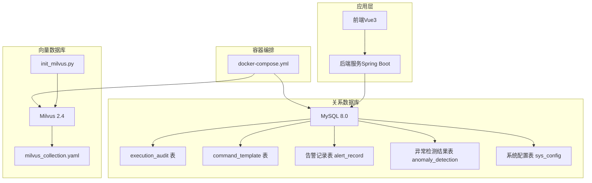
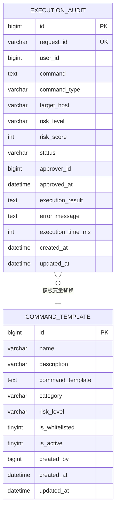
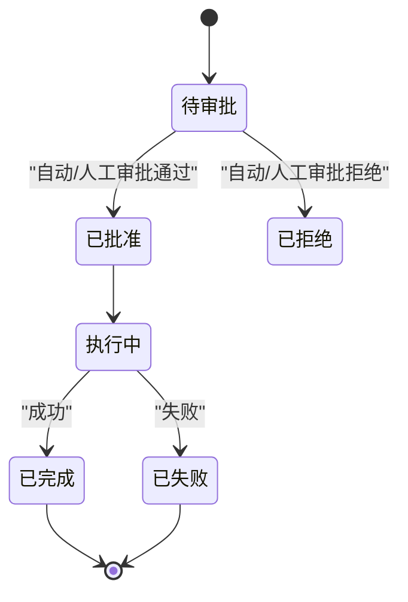
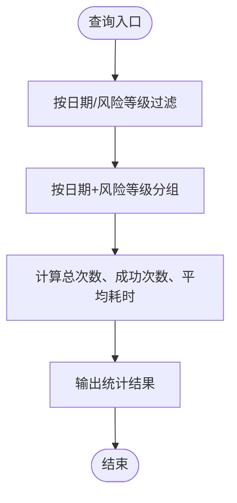
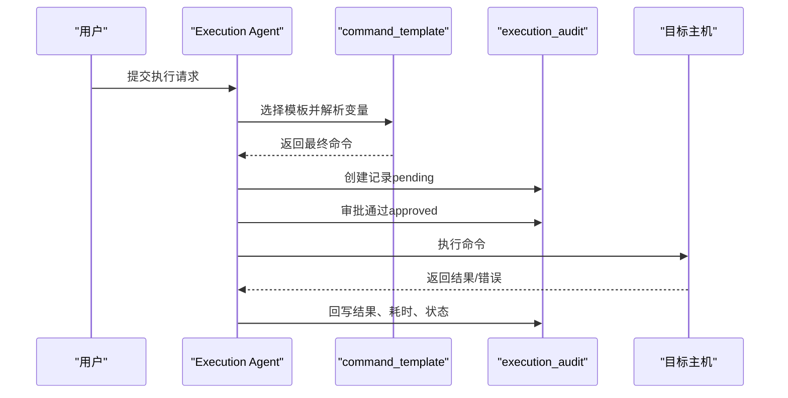
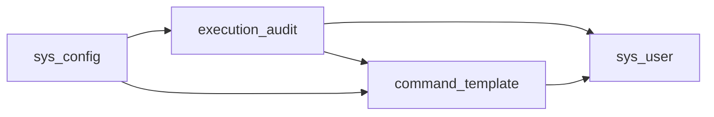

# 命令执行审计数据库

<cite>
**本文引用的文件**
- [init.sql](file://sql/init.sql)
- [milvus_collection.yaml](file://config/milvus_collection.yaml)
- [docker-compose.yml](file://docker-compose.yml)
- [init_milvus.py](file://scripts/init_milvus.py)
- [PROJECT_CONTEXT.md](file://PROJECT_CONTEXT.md)
- [shared-safety-constraints.md](file://docs/prompts/shared-safety-constraints.md)
</cite>

## 目录
1. [简介](#简介)
2. [项目结构](#项目结构)
3. [核心组件](#核心组件)
4. [架构总览](#架构总览)
5. [详细组件分析](#详细组件分析)
6. [依赖分析](#依赖分析)
7. [性能考虑](#性能考虑)
8. [故障排查指南](#故障排查指南)
9. [结论](#结论)
10. [附录](#附录)

## 简介
本文件为“智能运维系统命令执行审计”数据库设计的权威文档，聚焦于两个核心表：execution_audit（命令执行审计表）与 command_template（命令模板表）。文档从表结构、字段语义、索引设计、业务状态机、查询统计视图到性能优化策略进行全面阐述，并结合项目上下文与安全约束，给出可落地的实践建议。

## 项目结构
本项目采用容器化编排，MySQL 作为关系型数据存储，承载用户、对话、命令执行审计、命令模板、告警与异常检测等核心数据；Milvus 作为向量数据库支撑 RAG 知识库；Redis 用于缓存与分布式锁；Ollama/DeepSeek 作为 LLM 推理后端。命令执行审计属于 MySQL 数据域，与 Orchestrator-Subagent 架构中的 Execution Agent 紧密关联。

图表来源
- [docker-compose.yml:163-208](file://docker-compose.yml#L163-L208)
- [init.sql:114-159](file://sql/init.sql#L114-L159)
- [milvus_collection.yaml:22-139](file://config/milvus_collection.yaml#L22-L139)
- [init_milvus.py:133-242](file://scripts/init_milvus.py#L133-L242)

章节来源
- [docker-compose.yml:163-208](file://docker-compose.yml#L163-L208)
- [PROJECT_CONTEXT.md:120-149](file://PROJECT_CONTEXT.md#L120-L149)

## 核心组件
本节聚焦两个关键表的结构与业务含义，以及它们之间的关系与索引设计。

- execution_audit（命令执行审计表）
  - 审计ID：自增主键，唯一标识一次执行请求
  - 请求ID：全局唯一标识一次执行请求，便于跨系统追踪
  - 执行用户ID：发起执行的用户
  - 执行命令：完整命令文本（支持变量替换后的最终命令）
  - 命令类型：命令类别（如 status、logs、operation、cleanup 等）
  - 目标主机：执行的目标主机
  - 风险等级：low/medium/high/critical
  - 风险分数：1-100 的数值评分
  - 状态：pending/approved/rejected/executing/completed/failed
  - 审批人ID：审批该请求的用户
  - 审批时间：审批发生的时间
  - 执行结果：执行输出（文本）
  - 错误信息：执行失败时的错误描述
  - 执行耗时：毫秒
  - 时间戳：创建与更新时间

- command_template（命令模板表）
  - 模板ID：自增主键
  - 模板名称：模板标识
  - 描述：模板说明
  - 命令模板：支持变量替换的模板文本（如 {{service_name}}、{{lines:100}}）
  - 分类：命令分类（如 status、logs、operation、cleanup）
  - 默认风险等级：模板的默认风险等级（medium）
  - 白名单状态：是否为白名单命令（is_whitelisted）
  - 启用状态：是否启用（is_active）
  - 创建人：模板创建者
  - 时间戳：创建与更新时间

章节来源
- [init.sql:114-159](file://sql/init.sql#L114-L159)

## 架构总览
命令执行审计贯穿“生成命令—风险评估—人工审批—执行—记录”的完整生命周期。execution_audit 与 command_template 通过模板变量替换与风险评估共同驱动执行流程，同时通过视图提供统计分析能力。

图表来源
- [init.sql:114-159](file://sql/init.sql#L114-L159)

## 详细组件分析

### execution_audit 表结构与字段语义
- 主键与唯一约束
  - 主键：自增 bigint，保证每条审计记录唯一
  - 唯一索引：request_id，确保请求幂等与跨系统追踪
- 字段设计要点
  - 命令类型与目标主机：便于按类型与主机聚合统计
  - 风险等级与分数：支持分级治理与自动化策略
  - 审批人与审批时间：满足合规审计
  - 执行耗时：衡量执行效率与潜在性能问题
  - 结果与错误信息：支持事后复盘与故障定位
- 索引设计
  - idx_user_id：按用户过滤
  - idx_status：按状态过滤与调度
  - idx_risk_level：按风险等级过滤
  - idx_created_at：按时间窗口统计

章节来源
- [init.sql:114-138](file://sql/init.sql#L114-L138)

### command_template 表结构与字段语义
- 模板变量语法
  - 变量占位符：{{variable}}，支持默认值语法 {{variable:default}}
  - 作用：在执行前将模板与用户输入/上下文变量合并，生成最终命令
- 分类与默认风险等级
  - 分类：status、logs、operation、cleanup 等，便于模板治理
  - 默认风险等级：medium，可在模板层面设定基线
- 白名单与启用状态
  - is_whitelisted：白名单命令可走简化审批或自动执行
  - is_active：启用/停用模板，便于灰度与回滚
- 索引设计
  - idx_category：按分类筛选
  - idx_is_whitelisted：快速定位白名单模板

章节来源
- [init.sql:143-159](file://sql/init.sql#L143-L159)

### 命令执行生命周期与状态机
- 状态流转
  - pending：提交后初始状态
  - approved/rejected：审批结果
  - executing：执行中
  - completed/failed：执行结束
- 自动化与人工审批
  - 低风险命令可自动批准（受系统配置控制）
  - 中高风险需人工审批
- 审批与执行
  - 审批人ID与审批时间记录在 execution_audit
  - 执行结果、错误信息、耗时在执行完成后回写

图表来源
- [init.sql:124-124](file://sql/init.sql#L124-L124)
- [shared-safety-constraints.md:244-258](file://docs/prompts/shared-safety-constraints.md#L244-L258)

章节来源
- [shared-safety-constraints.md:244-258](file://docs/prompts/shared-safety-constraints.md#L244-L258)

### 审计数据查询统计视图
- v_execution_statistics
  - 按日期与风险等级统计：总次数、成功次数、平均耗时
  - 仅统计 completed/failed 的记录，便于评估执行质量
- v_alert_statistics
  - 按日期与严重程度统计：告警总数、已解决数、平均解决时长
  - 与执行统计联动，辅助分析告警驱动的执行行为

图表来源
- [init.sql:264-273](file://sql/init.sql#L264-L273)

章节来源
- [init.sql:249-273](file://sql/init.sql#L249-L273)

### 命令模板与变量替换流程
- 模板选择与变量解析
  - 依据用户输入与上下文，选择合适的 command_template
  - 解析模板中的 {{variable}} 与 {{variable:default}}，生成最终命令
- 风险评估与白名单
  - 读取模板默认风险等级
  - 若模板 is_whitelisted，则可走自动批准或简化流程
- 执行与回写
  - 执行完成后，将结果、错误、耗时回写至 execution_audit

图表来源
- [init.sql:114-159](file://sql/init.sql#L114-L159)
- [init.sql:161-170](file://sql/init.sql#L161-L170)

章节来源
- [init.sql:161-170](file://sql/init.sql#L161-L170)

## 依赖分析
- 表间依赖
  - execution_audit.user_id 与 sys_user.id：用户身份关联
  - execution_audit.approver_id 与 sys_user.id：审批人身份关联
  - execution_audit.request_id 唯一：跨系统追踪
- 外部依赖
  - MySQL：关系数据存储
  - Milvus：向量检索（与审计无直接外键，但共享系统配置）
  - Redis：缓存与分布式锁（用于防止重复执行等）
  - LLM：DeepSeek/Ollama，用于生成命令与风险评估

图表来源
- [init.sql:26-41](file://sql/init.sql#L26-L41)
- [init.sql:114-159](file://sql/init.sql#L114-L159)
- [init.sql:222-244](file://sql/init.sql#L222-L244)

章节来源
- [init.sql:26-41](file://sql/init.sql#L26-L41)
- [init.sql:222-244](file://sql/init.sql#L222-L244)

## 性能考虑
- 索引与查询优化
  - execution_audit 建议复合索引：(status, risk_level, created_at)、(user_id, status, created_at)
  - 避免 SELECT *，仅取必要字段
  - 使用 LIMIT 与分页，避免全表扫描
- 统计视图
  - v_execution_statistics 已按日期与风险等级分组，建议定期物化或缓存热点结果
- 数据量增长
  - 审计表建议按月/季度分区或归档，减少热数据扫描
- I/O 与并发
  - 执行耗时与错误信息字段为 TEXT，建议在高频写入场景下控制单条记录大小
- 安全与合规
  - 遵循安全约束，避免敏感信息泄露；错误信息脱敏输出

[本节为通用性能建议，不直接分析具体文件]

## 故障排查指南
- 常见问题定位
  - 审批状态异常：检查 execution_audit.approver_id 与 approved_at 是否正确回写
  - 执行耗时异常：检查 execution_time_ms 是否为空，是否存在超时未回写
  - 风险评估偏差：核对 command_template.risk_level 与 is_whitelisted 是否符合预期
- 日志与审计
  - 严格记录命令生成、风险评估、审批、执行全过程
  - 对失败场景记录 error_message，便于复盘
- 安全与权限
  - 严格遵循安全约束，禁止高危命令执行
  - 审批流程与权限矩阵必须严格执行

章节来源
- [shared-safety-constraints.md:29-95](file://docs/prompts/shared-safety-constraints.md#L29-L95)
- [shared-safety-constraints.md:296-323](file://docs/prompts/shared-safety-constraints.md#L296-L323)

## 结论
本设计以 execution_audit 与 command_template 为核心，配合系统配置与统计视图，构建了完整的命令执行审计与治理闭环。通过明确的状态机、索引与查询优化策略，既能满足日常运营的可观测性需求，也能支撑未来扩展与合规要求。

[本节为总结性内容，不直接分析具体文件]

## 附录
- 相关配置与脚本
  - Milvus Collection 配置：向量维度、索引类型、搜索参数
  - Milvus 初始化脚本：连接、创建集合、索引、加载、测试
  - Docker Compose：MySQL、Redis、Milvus、Ollama 服务编排

章节来源
- [milvus_collection.yaml:22-139](file://config/milvus_collection.yaml#L22-L139)
- [init_milvus.py:133-242](file://scripts/init_milvus.py#L133-L242)
- [docker-compose.yml:163-208](file://docker-compose.yml#L163-L208)