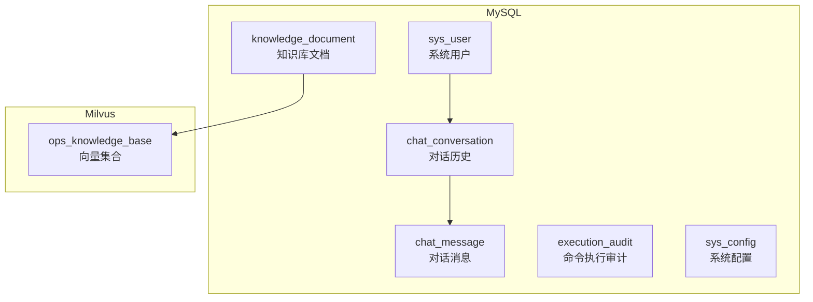
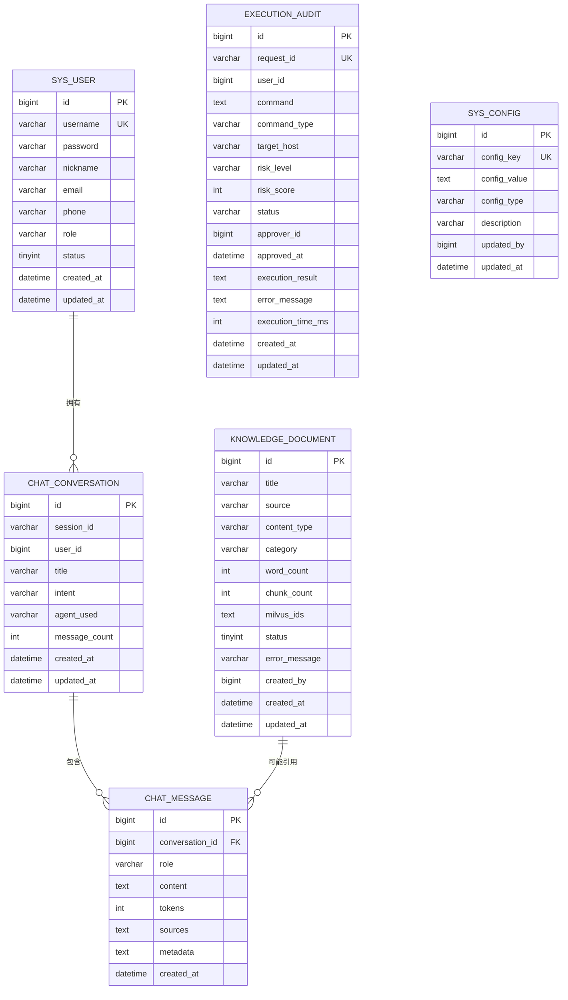
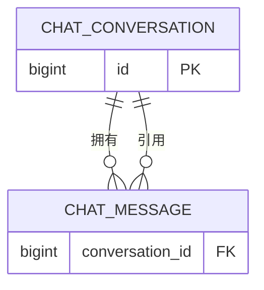
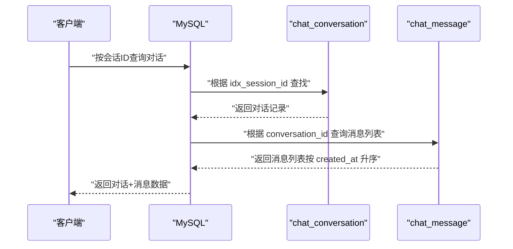
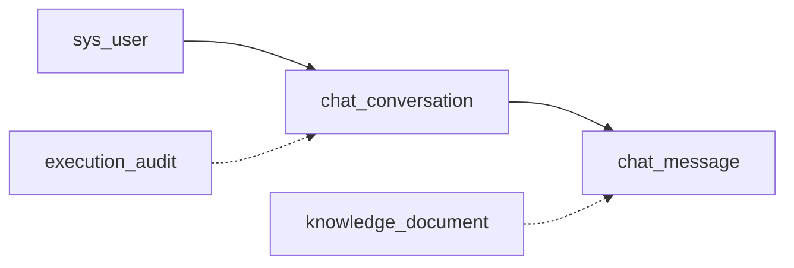

# 对话历史管理数据库

<cite>
**本文引用的文件**
- [init.sql](file://sql/init.sql)
- [milvus_collection.yaml](file://config/milvus_collection.yaml)
- [init_milvus.py](file://scripts/init_milvus.py)
- [PROJECT_CONTEXT.md](file://PROJECT_CONTEXT.md)
</cite>

## 目录
1. [简介](#简介)
2. [项目结构](#项目结构)
3. [核心组件](#核心组件)
4. [架构总览](#架构总览)
5. [详细组件分析](#详细组件分析)
6. [依赖分析](#依赖分析)
7. [性能考虑](#性能考虑)
8. [故障排查指南](#故障排查指南)
9. [结论](#结论)
10. [附录](#附录)

## 简介
本文件聚焦于智能运维系统中的“对话历史管理”数据库设计，围绕两个核心表展开：chat_conversation（对话历史表）与 chat_message（对话消息表）。文档将详细说明：
- 字段含义与设计考量
- 外键关联关系与级联删除机制
- 数据模型图与查询优化策略
- 数据访问模式、性能与扩展性设计

同时，结合项目上下文，明确对话历史与 RAG 知识库、异常检测、命令执行等模块的边界与协作方式，帮助读者在整体系统中理解对话历史数据的职责与价值。

## 项目结构
本项目采用“MySQL 关系数据库 + Milvus 向量数据库”的双数据库架构：
- MySQL：承载结构化业务数据，如用户、对话历史、消息、命令审计、配置等。
- Milvus：承载知识库向量数据，支撑 RAG 检索与重排。

图表来源
- [init.sql:25-41](file://sql/init.sql#L25-L41)
- [init.sql:75-90](file://sql/init.sql#L75-L90)
- [init.sql:95-109](file://sql/init.sql#L95-L109)
- [init.sql:114-138](file://sql/init.sql#L114-L138)
- [init.sql:51-70](file://sql/init.sql#L51-L70)
- [init.sql:222-233](file://sql/init.sql#L222-L233)
- [milvus_collection.yaml:22-28](file://config/milvus_collection.yaml#L22-L28)

章节来源
- [PROJECT_CONTEXT.md:120-149](file://PROJECT_CONTEXT.md#L120-L149)
- [init.sql:18-246](file://sql/init.sql#L18-L246)

## 核心组件
本节聚焦对话历史管理的两个核心表：chat_conversation 与 chat_message。

- chat_conversation（对话历史表）
  - 作用：记录一次完整的对话会话，包含会话标识、用户、标题、意图、Agent 使用、消息数量以及时间戳。
  - 关键字段：id、session_id、user_id、title、intent、agent_used、message_count、created_at、updated_at。
  - 设计要点：为 session_id、user_id、created_at 建立索引，便于按会话、用户、时间范围检索。

- chat_message（对话消息表）
  - 作用：记录对话中的每一条消息，包含消息角色、内容、Token 数量、引用来源、元数据以及时间戳。
  - 关键字段：id、conversation_id、role、content、tokens、sources、metadata、created_at。
  - 设计要点：conversation_id 建有索引，并设置外键约束，且 ON DELETE CASCADE，确保当对话被删除时，其消息级联删除。

章节来源
- [init.sql:75-90](file://sql/init.sql#L75-L90)
- [init.sql:95-109](file://sql/init.sql#L95-L109)

## 架构总览
下图展示对话历史数据在系统中的位置与关系，以及与知识库向量集合的协作关系。

图表来源
- [init.sql:25-41](file://sql/init.sql#L25-L41)
- [init.sql:75-90](file://sql/init.sql#L75-L90)
- [init.sql:95-109](file://sql/init.sql#L95-L109)
- [init.sql:51-70](file://sql/init.sql#L51-L70)
- [init.sql:114-138](file://sql/init.sql#L114-L138)
- [init.sql:222-233](file://sql/init.sql#L222-L233)

## 详细组件分析

### 表：chat_conversation（对话历史）
- 字段说明与设计考虑
  - id：自增主键，唯一标识一次对话。
  - session_id：会话标识，用于跨组件、跨模块的会话关联，需建立索引以便快速查找。
  - user_id：关联 sys_user 的外键，便于按用户维度聚合对话。
  - title：对话标题，便于前端展示与检索。
  - intent：对话意图类型，便于后续统计与路由。
  - agent_used：使用的 Agent 名称，便于审计与性能分析。
  - message_count：消息数量，便于快速展示与分页控制。
  - created_at/updated_at：时间戳，便于按时间排序与统计。

- 索引策略
  - idx_session_id：按会话检索。
  - idx_user_id：按用户检索。
  - idx_created_at：按时间范围检索。

- 典型查询模式
  - 按用户与时间范围查询对话列表。
  - 按会话ID查询对话详情。
  - 按意图类型与Agent统计对话分布。

章节来源
- [init.sql:75-90](file://sql/init.sql#L75-L90)

### 表：chat_message（对话消息）
- 字段说明与设计考虑
  - id：自增主键，唯一标识一条消息。
  - conversation_id：外键，指向 chat_conversation，建立索引以加速按对话查询。
  - role：消息角色，取值通常为 user/assistant/system，便于前端渲染与分析。
  - content：消息内容，TEXT 类型，支持长文本。
  - tokens：Token 数量，便于成本与性能统计。
  - sources：引用来源（JSON），记录消息中引用的知识库片段或外部链接。
  - metadata：元数据（JSON），记录消息的结构化附加信息（如工具调用、节点信息等）。
  - created_at：消息创建时间，便于按时间顺序展示。

- 外键与级联删除
  - 外键约束：conversation_id 引用 chat_conversation(id)。
  - 级联删除：ON DELETE CASCADE，当删除某条对话时，其所有消息将被自动删除，保证数据一致性。

- 典型查询模式
  - 按对话ID查询消息列表（按时间升序）。
  - 按角色过滤（如仅显示 assistant 回答）。
  - 按时间范围与会话ID组合查询。

章节来源
- [init.sql:95-109](file://sql/init.sql#L95-L109)

### 外键关系与级联删除机制

图表来源
- [init.sql:108-108](file://sql/init.sql#L108-L108)

章节来源
- [init.sql:108-108](file://sql/init.sql#L108-L108)

### 查询流程示意（按会话ID获取对话与消息）

图表来源
- [init.sql:87-89](file://sql/init.sql#L87-L89)
- [init.sql:106-107](file://sql/init.sql#L106-L107)
- [init.sql:108-108](file://sql/init.sql#L108-L108)

## 依赖分析
- 对话历史与用户的关系
  - chat_conversation.user_id 外键关联 sys_user.id，便于按用户维度聚合与权限控制。
- 对话历史与消息的关系
  - chat_message.conversation_id 外键关联 chat_conversation.id，且 ON DELETE CASCADE，确保删除对话时消息同步删除。
- 对话历史与知识库文档的关系
  - chat_message.sources 与 knowledge_document.milvus_ids 通过 JSON 存储的向量ID进行间接关联，便于溯源与审计。
- 对话历史与命令执行的关系
  - chat_conversation.intent 可用于标记“执行”意图，execution_audit.request_id 与对话会话ID可建立映射，便于审计与回溯。

图表来源
- [init.sql:25-41](file://sql/init.sql#L25-L41)
- [init.sql:75-90](file://sql/init.sql#L75-L90)
- [init.sql:95-109](file://sql/init.sql#L95-L109)
- [init.sql:51-70](file://sql/init.sql#L51-L70)
- [init.sql:114-138](file://sql/init.sql#L114-L138)

章节来源
- [init.sql:25-41](file://sql/init.sql#L25-L41)
- [init.sql:75-90](file://sql/init.sql#L75-L90)
- [init.sql:95-109](file://sql/init.sql#L95-L109)
- [init.sql:51-70](file://sql/init.sql#L51-L70)
- [init.sql:114-138](file://sql/init.sql#L114-L138)

## 性能考虑
- 索引设计
  - chat_conversation：idx_session_id、idx_user_id、idx_created_at，满足按会话、用户、时间范围的高频查询。
  - chat_message：idx_conversation_id、idx_created_at，满足按对话查询消息与按时间排序。
- 外键与级联删除
  - 外键约束保证参照完整性；ON DELETE CASCADE 简化了删除流程，避免孤儿消息。
- 数据类型与存储
  - TEXT 类型用于 content、sources、metadata，满足长文本与 JSON 存储需求；BIGINT 用于自增主键，确保高并发下的唯一性。
- 查询优化建议
  - 按会话ID查询对话详情时，优先使用 idx_session_id。
  - 消息查询按 conversation_id + created_at 排序，利用 idx_conversation_id + idx_created_at 组合索引。
  - 若需按用户聚合对话，使用 idx_user_id + idx_created_at。
- 扩展性设计
  - chat_conversation.message_count 可用于前端分页与提示，减少每次查询消息总数的成本。
  - 若未来需要按意图、Agent、角色等维度统计，可在现有索引基础上增加复合索引或物化视图（如 v_alert_statistics、v_execution_statistics 的思路）。

[本节为通用性能指导，不直接分析具体文件]

## 故障排查指南
- 删除对话后消息未删除
  - 检查外键约束与级联删除设置是否生效。
  - 章节来源
    - [init.sql:108-108](file://sql/init.sql#L108-L108)
- 查询性能差
  - 确认是否命中索引：按会话ID查询使用 idx_session_id；按用户查询使用 idx_user_id；按时间范围查询使用 idx_created_at。
  - 章节来源
    - [init.sql:87-89](file://sql/init.sql#L87-L89)
    - [init.sql:106-107](file://sql/init.sql#L106-L107)
- 消息内容过大导致存储与传输压力
  - 使用 TEXT 类型存储，必要时拆分消息或压缩内容；前端按需懒加载。
- 溯源困难
  - sources 与 metadata 采用 JSON 存储，建议规范字段命名与结构，便于解析与审计。

章节来源
- [init.sql:95-109](file://sql/init.sql#L95-L109)
- [init.sql:75-90](file://sql/init.sql#L75-L90)

## 结论
对话历史管理数据库以 chat_conversation 与 chat_message 为核心，通过外键与级联删除保障数据一致性，配合索引提升查询效率。该设计既满足当前对话管理需求，也为后续按用户、时间、意图、Agent 等维度的统计与扩展提供了良好基础。结合 Milvus 知识库与命令执行审计，形成从“问答—诊断—执行—审计”的闭环数据流，支撑智能运维系统的整体能力。

[本节为总结性内容，不直接分析具体文件]

## 附录
- 与 Milvus 的关系
  - 知识库文档表 knowledge_document 与向量集合 ops_knowledge_base 关联，对话消息中的 sources 可与 Milvus 中的 embedding 字段建立映射，便于溯源与审计。
  - 章节来源
    - [init.sql:51-70](file://sql/init.sql#L51-L70)
    - [milvus_collection.yaml:22-28](file://config/milvus_collection.yaml#L22-L28)
    - [init_milvus.py:133-242](file://scripts/init_milvus.py#L133-L242)

- 项目背景与模块边界
  - 项目采用 Orchestrator-Subagent 架构，对话历史服务于问答、诊断、执行等 Agent 的上下文管理与审计。
  - 章节来源
    - [PROJECT_CONTEXT.md:43-61](file://PROJECT_CONTEXT.md#L43-L61)