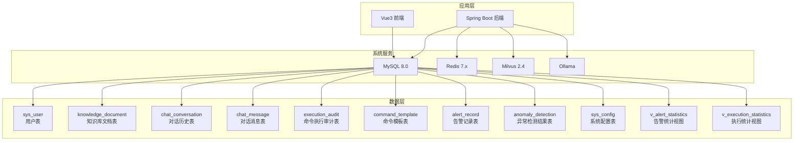
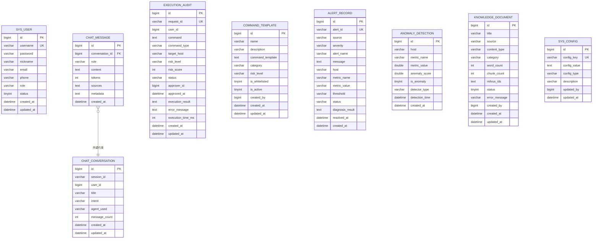
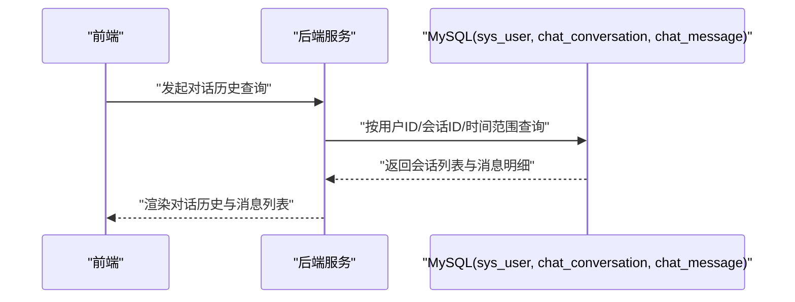
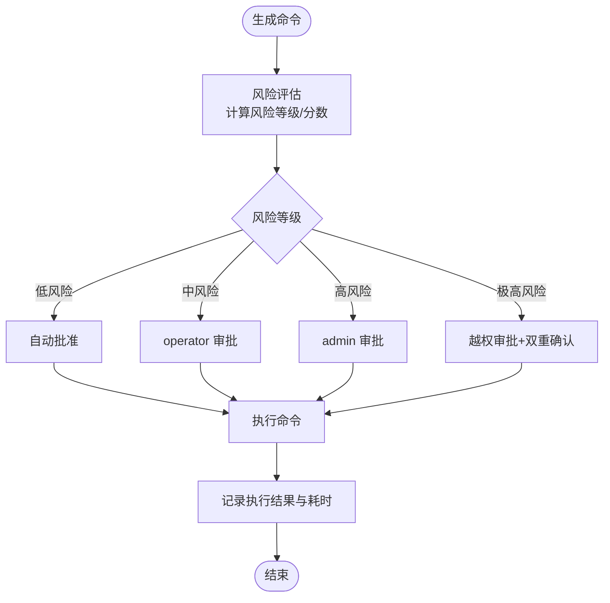
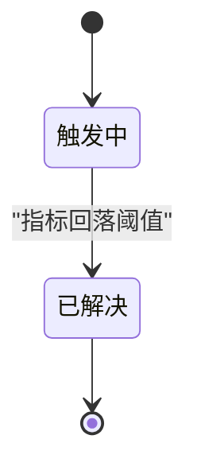
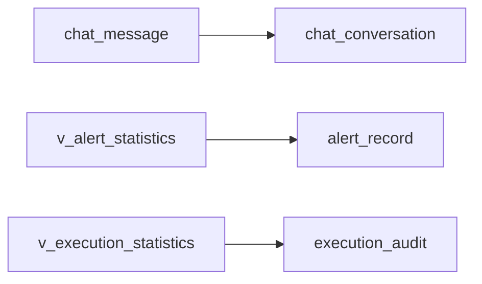

# 数据库设计

<cite>
**本文引用的文件**
- [init.sql](file://sql/init.sql)
- [docker-compose.yml](file://docker-compose.yml)
- [PROJECT_CONTEXT.md](file://PROJECT_CONTEXT.md)
- [orchestrator-system-prompt.md](file://docs/prompts/orchestrator-system-prompt.md)
- [shared-safety-constraints.md](file://docs/prompts/shared-safety-constraints.md)
</cite>

## 目录
1. [简介](#简介)
2. [项目结构](#项目结构)
3. [核心组件](#核心组件)
4. [架构总览](#架构总览)
5. [详细组件分析](#详细组件分析)
6. [依赖分析](#依赖分析)
7. [性能考虑](#性能考虑)
8. [故障排查指南](#故障排查指南)
9. [结论](#结论)
10. [附录](#附录)

## 简介
本文件为“面向 NetData 监控数据的智能运维问答与执行系统”的数据库设计文档，聚焦 MySQL 关系数据库的整体设计思路与表结构规划。系统采用“编排器-子代理”模式，围绕用户管理、对话历史、命令执行审计、告警记录与统计分析等核心业务域，提供统一的数据层支撑。本文将从数据库整体架构、表结构设计、索引策略、视图与统计分析、以及与后端服务的集成方式等方面进行全面阐述，并给出性能优化与运维建议。

## 项目结构
数据库初始化脚本位于 sql/init.sql，Docker Compose 配置文件 docker-compose.yml 中定义了 MySQL 服务及其初始化脚本挂载。项目上下文文档 PROJECT_CONTEXT.md 提供了系统整体的技术栈与模块划分，便于理解数据库在系统中的职责边界。

图表来源
- [docker-compose.yml:155-208](file://docker-compose.yml#L155-L208)
- [init.sql:22-274](file://init.sql#L22-L274)

章节来源
- [docker-compose.yml:155-208](file://docker-compose.yml#L155-L208)
- [PROJECT_CONTEXT.md:120-149](file://PROJECT_CONTEXT.md#L120-L149)

## 核心组件
本节概述数据库中与智能运维系统密切相关的表与视图，涵盖用户管理、对话历史、命令执行审计、告警记录与统计分析等模块。

- 用户管理与权限控制
  - sys_user：系统用户表，包含用户名、角色、状态、创建/更新时间等字段，支撑登录认证与权限控制。
- 对话历史管理
  - chat_conversation：会话表，记录会话ID、用户ID、标题、意图、Agent使用、消息数量、时间戳等。
  - chat_message：消息表，记录消息内容、角色、Token数、来源与元数据，外键关联会话表。
- 命令执行审计
  - execution_audit：执行审计表，记录请求ID、用户ID、命令、类型、目标主机、风险等级/分数、状态、审批信息、执行结果与耗时等。
  - command_template：命令模板表，支持模板名称、描述、模板内容、分类、默认风险等级、白名单标记、启用状态等。
- 告警管理与统计
  - alert_record：告警记录表，记录告警唯一标识、来源、严重程度、名称、消息、主机、指标、阈值、状态、诊断结果、解决时间与创建时间。
  - v_alert_statistics：告警统计视图，按日期与严重程度聚合告警总数、已解决数与平均解决时长。
  - v_execution_statistics：执行统计视图，按日期与风险等级聚合执行总数、成功数与平均耗时。
- 系统配置与知识库
  - sys_config：系统配置表，键值对形式存储 LLM、RAG、执行策略等配置。
  - knowledge_document：知识库文档表，记录文档标题、来源、内容类型、分类、字数、切片数量、Milvus 向量ID列表、状态与错误信息等。

章节来源
- [init.sql:22-274](file://init.sql#L22-L274)

## 架构总览
数据库层承担以下职责：
- 用户与权限：sys_user 提供登录认证与角色权限基础。
- 对话与检索：chat_conversation 与 chat_message 支撑对话历史与消息检索。
- 执行与审计：execution_audit 与 command_template 记录命令生成、风险评估、审批与执行全过程。
- 告警与诊断：alert_record 与 anomaly_detection 记录告警与异常检测结果，配合视图进行统计分析。
- 配置与元数据：sys_config 与 knowledge_document 提供系统配置与知识库元数据。

图表来源
- [init.sql:22-274](file://init.sql#L22-L274)

## 详细组件分析

### 用户管理系统（sys_user）
- 设计要点
  - 主键自增 id，唯一索引 username，支持按角色与状态快速筛选。
  - 密码采用 BCrypt 加密存储，角色字段支持 admin/operator/viewer，状态字段支持启用/禁用。
  - 创建/更新时间字段用于审计与排序。
- 登录认证流程（概念性说明）
  - 前端提交用户名与密码，后端通过 sys_user 校验用户存在性与状态，验证 BCrypt 密码。
  - 成功后颁发会话令牌，后续接口调用携带令牌进行鉴权。
- 权限控制机制（概念性说明）
  - 基于角色的最小权限原则：viewer 只能查询，operator 可执行低风险命令，admin 可审批与执行高风险命令。
  - 审批流：低风险命令可自动执行，中高风险需经相应角色审批，极高风险需越权审批与双重确认。

章节来源
- [init.sql:22-41](file://init.sql#L22-L41)
- [shared-safety-constraints.md:233-258](file://docs/prompts/shared-safety-constraints.md#L233-L258)

### 对话历史管理（chat_conversation 与 chat_message）
- 设计要点
  - 会话表：以 session_id 唯一标识一次用户交互，记录用户ID、标题、意图、Agent使用、消息数量与时间戳。
  - 消息表：记录消息内容、角色（user/assistant/system）、Token数、来源与元数据，外键关联会话表并级联删除。
  - 索引策略：会话表按 session_id、user_id、created_at 建立索引；消息表按 conversation_id、created_at 建立索引。
- 历史查询接口支持（概念性说明）
  - 支持按会话ID查询完整对话链路，按时间范围筛选消息，按用户ID聚合会话列表，按意图/Agent进行过滤与统计。

图表来源
- [init.sql:72-109](file://init.sql#L72-L109)

章节来源
- [init.sql:72-109](file://init.sql#L72-L109)

### 命令执行审计系统（execution_audit 与 command_template）
- 设计要点
  - execution_audit：记录请求ID、用户ID、命令、类型、目标主机、风险等级/分数、状态（待审批/已批准/执行中/已完成/失败）、审批人与时间、执行结果与错误信息、执行耗时与时间戳。
  - command_template：记录模板名称、描述、模板内容（支持变量替换）、分类、默认风险等级、白名单标记与启用状态。
  - 索引策略：按 user_id、status、risk_level、created_at 建立索引，支持快速筛选与统计。
- 风险评估与审批流程（概念性说明）
  - 风险评估：根据命令模板的默认风险等级与用户输入参数计算风险分数。
  - 审批流程：低风险自动通过，中风险需 operator 审批，高风险需 admin 审批，极高风险需越权审批与双重确认。
  - 执行与回滚：执行前记录审计，执行后更新状态与结果，失败时记录错误信息并可执行回滚。

图表来源
- [init.sql:112-138](file://init.sql#L112-L138)
- [init.sql:141-159](file://init.sql#L141-L159)
- [shared-safety-constraints.md:28-126](file://docs/prompts/shared-safety-constraints.md#L28-L126)

章节来源
- [init.sql:112-159](file://init.sql#L112-L159)
- [shared-safety-constraints.md:28-126](file://docs/prompts/shared-safety-constraints.md#L28-L126)

### 告警管理系统（alert_record 与统计视图）
- 设计要点
  - alert_record：记录告警唯一标识、来源、严重程度、名称、消息、主机、指标、阈值、状态、诊断结果、解决时间与创建时间。
  - 统计视图：v_alert_statistics 按日期与严重程度聚合告警总数、已解决数与平均解决时长；v_execution_statistics 按日期与风险等级聚合执行总数、成功数与平均耗时。
  - 索引策略：按 severity、status、created_at 建立索引，支持快速筛选与统计。
- 状态流转机制（概念性说明）
  - firing → resolved：告警触发后持续监控，当指标回落阈值以下时标记为已解决，记录解决时间并更新诊断结果。

图表来源
- [init.sql:173-196](file://init.sql#L173-L196)
- [init.sql:249-274](file://init.sql#L249-L274)

章节来源
- [init.sql:173-196](file://init.sql#L173-L196)
- [init.sql:249-274](file://init.sql#L249-L274)

### 系统配置与知识库（sys_config 与 knowledge_document）
- 设计要点
  - sys_config：键值对配置表，支持字符串、数值、布尔类型，记录描述与更新人，唯一索引 config_key。
  - knowledge_document：记录文档标题、来源、内容类型、分类、字数、切片数量、Milvus 向量ID列表、状态与错误信息等，支持按来源、分类、状态快速检索。
- 集成关系
  - 后端通过 sys_config 动态调整 LLM、RAG、执行策略等行为；知识库文档与 Milvus 向量集合配合实现混合检索。

章节来源
- [init.sql:220-244](file://init.sql#L220-L244)
- [init.sql:48-70](file://init.sql#L48-L70)

## 依赖分析
- 外键关系
  - chat_message.conversation_id → chat_conversation.id（级联删除）
- 视图依赖
  - v_alert_statistics 依赖 alert_record
  - v_execution_statistics 依赖 execution_audit
- 服务依赖
  - 后端服务通过 JDBC 连接 MySQL，读写上述表与视图；Redis 用于会话与缓存；Milvus 用于知识库向量检索。

图表来源
- [init.sql:108](file://init.sql#L108)
- [init.sql:249-274](file://init.sql#L249-L274)

章节来源
- [init.sql:108](file://init.sql#L108)
- [init.sql:249-274](file://init.sql#L249-L274)

## 性能考虑
- 索引策略
  - sys_user：uk_username、idx_role、idx_status
  - chat_conversation：idx_session_id、idx_user_id、idx_created_at
  - chat_message：idx_conversation_id、idx_created_at
  - execution_audit：uk_request_id、idx_user_id、idx_status、idx_risk_level、idx_created_at
  - alert_record：uk_alert_id、idx_severity、idx_status、idx_created_at
  - anomaly_detection：idx_host、idx_metric_name、idx_is_anomaly、idx_detection_time
  - sys_config：uk_config_key
- 查询优化建议
  - 使用覆盖索引减少回表：如按 created_at 范围查询时尽量包含所需列。
  - 合理使用分页：对历史查询接口添加 LIMIT/OFFSET，避免一次性返回大量数据。
  - 统计视图定期刷新：可结合定时任务或物化视图（MySQL 8.0+可用）降低热查询压力。
- 连接与事务
  - 后端使用连接池，避免长事务；对高频写入表（如 chat_message、execution_audit）采用批量写入。
- 存储引擎与字符集
  - 全部表使用 InnoDB，utf8mb4 字符集，满足多语言与表情符号需求。

[本节为通用性能指导，不直接分析特定文件]

## 故障排查指南
- 登录与权限问题
  - 检查 sys_user 中用户状态与角色是否正确；确认密码为 BCrypt 加密。
- 对话历史查询异常
  - 核对 chat_conversation.session_id 与 chat_message.conversation_id 关联是否一致；确认索引是否生效。
- 命令执行审计缺失
  - 检查 execution_audit.request_id 是否重复；确认审批流程是否正确推进状态。
- 告警统计异常
  - 检查 alert_record.created_at 与 v_alert_statistics 聚合逻辑；确认 resolved_at 是否为空导致平均时长异常。
- 配置不生效
  - 检查 sys_config.config_key 是否唯一且拼写正确；确认后端读取逻辑是否正确。

章节来源
- [init.sql:22-274](file://init.sql#L22-L274)
- [shared-safety-constraints.md:233-258](file://docs/prompts/shared-safety-constraints.md#L233-L258)

## 结论
本数据库设计围绕智能运维系统的核心业务域，提供了清晰的表结构与索引策略，配合视图实现关键统计分析。通过 sys_user、chat_conversation/chat_message、execution_audit/command_template、alert_record/anomaly_detection、sys_config/knowledge_document 等表，系统实现了从用户管理、对话历史、命令执行审计到告警管理的全链路数据支撑。建议在后续开发中持续关注查询性能与数据一致性，结合业务增长逐步引入分区、归档与物化视图等优化手段。

[本节为总结性内容，不直接分析特定文件]

## 附录
- 数据访问模式
  - 用户登录：sys_user 唯一索引 username 查询，BCrypt 验证。
  - 对话查询：chat_conversation 按 user_id/created_at，chat_message 按 conversation_id/created_at。
  - 命令审计：execution_audit 按 user_id/status/risk_level/created_at。
  - 告警统计：alert_record 按 severity/status/created_at，视图聚合。
- 索引与约束
  - 唯一索引：sys_user.username、execution_audit.request_id、alert_record.alert_id、sys_config.config_key。
  - 普通索引：各表按业务查询热点建立的复合索引。
- 配置项参考
  - LLM 提供商、模型、温度、最大 Token 数、RAG Top-K、相似度阈值、自动批准低风险命令、最大等待时间等。

章节来源
- [init.sql:22-244](file://init.sql#L22-L244)
- [docker-compose.yml:155-208](file://docker-compose.yml#L155-L208)