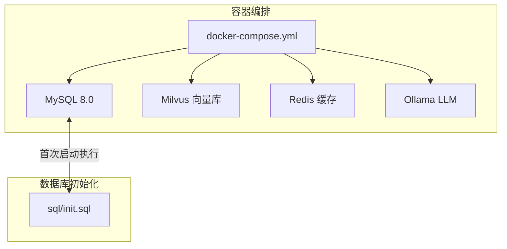
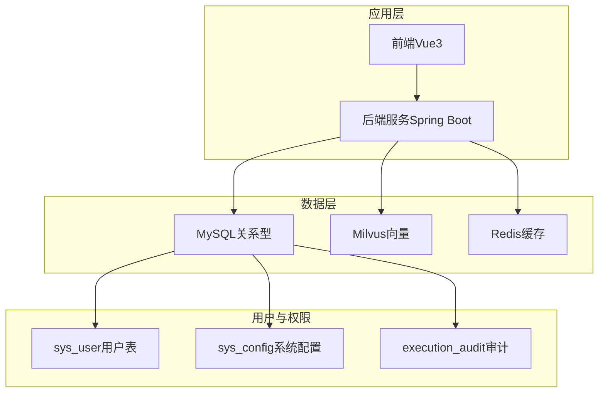
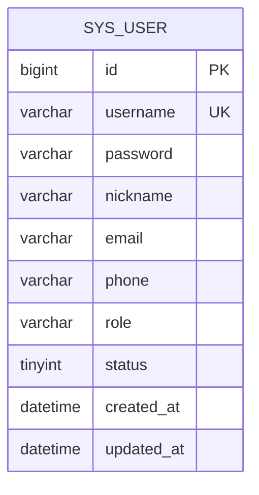
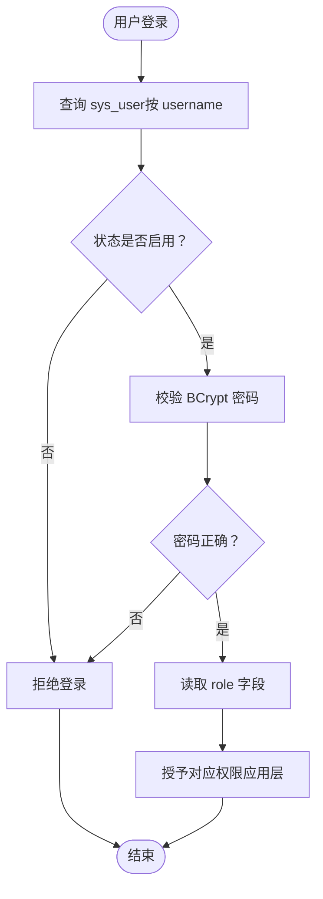
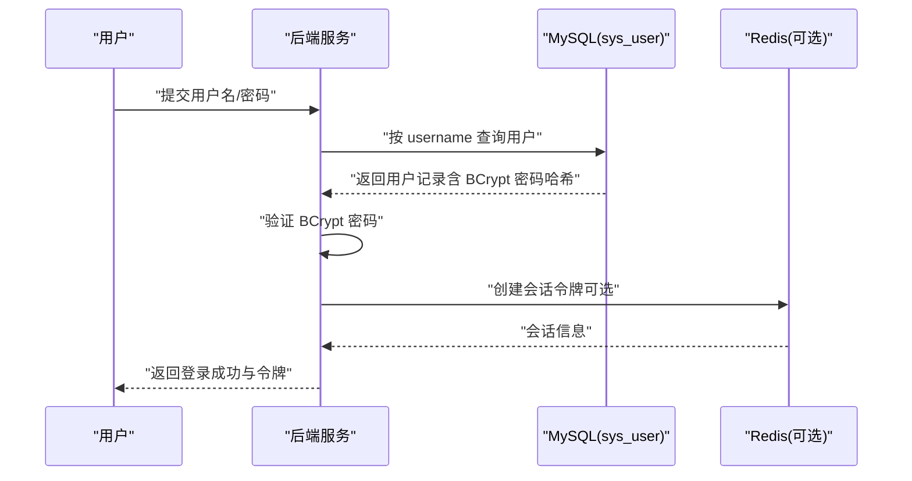
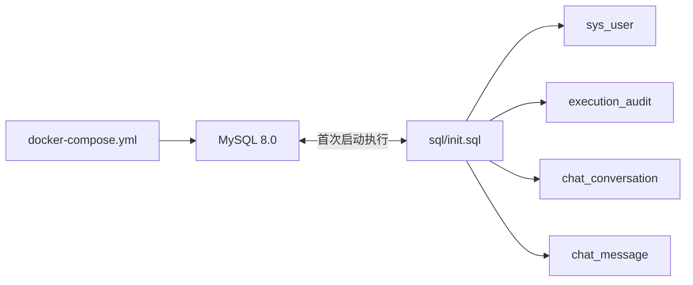

# 用户管理系统数据库

<cite>
**本文引用的文件**
- [init.sql](file://sql/init.sql)
- [docker-compose.yml](file://docker-compose.yml)
- [PROJECT_CONTEXT.md](file://PROJECT_CONTEXT.md)
- [milvus_collection.yaml](file://config/milvus_collection.yaml)
- [init_milvus.py](file://scripts/init_milvus.py)
</cite>

## 目录
1. [简介](#简介)
2. [项目结构](#项目结构)
3. [核心组件](#核心组件)
4. [架构总览](#架构总览)
5. [详细组件分析](#详细组件分析)
6. [依赖分析](#依赖分析)
7. [性能考虑](#性能考虑)
8. [故障排查指南](#故障排查指南)
9. [结论](#结论)
10. [附录](#附录)

## 简介
本文件为“智能运维问答与执行系统”的用户管理系统数据库设计文档，聚焦于关系型数据库中的用户表（sys_user）结构与权限控制机制，以及登录认证流程的数据库支持。文档基于仓库中的初始化脚本与容器编排配置，系统性阐述字段设计、约束、索引策略、角色权限模型、登录认证流程、数据访问模式、安全与性能优化建议，并提供可视化图表辅助理解。

## 项目结构
本项目采用容器化编排，MySQL 作为关系型数据库承载用户、配置、审计等结构化数据。初始化脚本负责创建表结构、索引与基础数据。

**图表来源**
- [docker-compose.yml:163-208](file://docker-compose.yml#L163-L208)
- [init.sql:1-246](file://sql/init.sql#L1-L246)

**章节来源**
- [docker-compose.yml:163-208](file://docker-compose.yml#L163-L208)
- [init.sql:1-246](file://sql/init.sql#L1-L246)

## 核心组件
- 用户表（sys_user）：存储系统用户的基本信息、角色与状态，支撑登录认证与权限控制。
- 系统配置表（sys_config）：存储系统运行参数，如 LLM 提供商、温度、Top-K 等。
- 命令执行审计表（execution_audit）：记录命令执行的请求、审批、执行与结果，用于审计与溯源。
- 知识库文档表（knowledge_document）：存储文档元数据，配合 Milvus 向量库实现 RAG。
- 对话历史与消息表（chat_conversation、chat_message）：支持聊天与检索增强问答。

**章节来源**
- [init.sql:25-46](file://sql/init.sql#L25-L46)
- [init.sql:222-233](file://sql/init.sql#L222-L233)
- [init.sql:114-138](file://sql/init.sql#L114-L138)
- [init.sql:51-70](file://sql/init.sql#L51-L70)
- [init.sql:75-109](file://sql/init.sql#L75-L109)

## 架构总览
用户管理数据库在系统中的作用与交互如下：

**图表来源**
- [docker-compose.yml:163-208](file://docker-compose.yml#L163-L208)
- [init.sql:25-46](file://sql/init.sql#L25-L46)
- [init.sql:222-233](file://sql/init.sql#L222-L233)
- [init.sql:114-138](file://sql/init.sql#L114-L138)

## 详细组件分析

### sys_user 表结构与设计要点
- 字段设计
  - id：自增主键，BIGINT，唯一标识用户。
  - username：唯一用户名，VARCHAR(50)，NOT NULL，唯一索引。
  - password：BCrypt 加密密码，VARCHAR(255)，NOT NULL。
  - nickname：昵称，VARCHAR(100)，可空。
  - email：邮箱，VARCHAR(100)，可空。
  - phone：手机号，VARCHAR(20)，可空。
  - role：角色，VARCHAR(20)，默认 viewer，支持 admin/operator/viewer。
  - status：状态，TINYINT，默认 1（启用），0（禁用）。
  - created_at / updated_at：时间戳，默认 CURRENT_TIMESTAMP，更新时自动更新。
- 约束与索引
  - 主键：id。
  - 唯一索引：uk_username(username)。
  - 普通索引：idx_role(role)、idx_status(status)。
- 设计思路
  - 用户名唯一，保证登录入口唯一性。
  - 角色字段支持三种角色，便于在应用层实现 RBAC。
  - 状态字段支持启用/禁用，便于账号治理。
  - 时间字段自动维护，减少应用侧逻辑。
- 安全与合规
  - 密码字段使用 BCrypt 加密，符合安全最佳实践。
  - 默认角色 viewer，遵循最小权限原则。

**图表来源**
- [init.sql:25-41](file://sql/init.sql#L25-L41)

**章节来源**
- [init.sql:25-41](file://sql/init.sql#L25-L41)
- [init.sql:44-46](file://sql/init.sql#L44-L46)

### 角色权限控制机制（数据库层面）
- 角色枚举值
  - admin：超级管理员，拥有最高权限。
  - operator：运维操作员，可执行部分命令并参与审批。
  - viewer：只读访客，仅可查看信息。
- 权限分配策略
  - 数据库层面：通过 role 字段区分角色，应用层在查询与写入时根据角色判定权限。
  - 索引策略：idx_role 支持按角色过滤与统计。
  - 状态控制：idx_status 支持按启用/禁用筛选。
- 审计与追踪
  - 命令执行审计表（execution_audit）记录 user_id、approver_id、status、risk_level 等，便于审计与回溯。

**图表来源**
- [init.sql:25-41](file://sql/init.sql#L25-L41)
- [init.sql:114-138](file://sql/init.sql#L114-L138)

**章节来源**
- [init.sql:25-41](file://sql/init.sql#L25-L41)
- [init.sql:114-138](file://sql/init.sql#L114-L138)

### 登录认证流程（数据库支持）
- 密码加密存储
  - password 字段存储 BCrypt 加密后的哈希值，不保存明文。
- 会话管理
  - 会话通常由应用层（Spring Security/JWT）管理，数据库不直接存储会话。
  - 可结合 Redis 存储会话令牌与用户信息，实现分布式会话。
- 安全约束
  - 登录失败次数与速率限制建议在应用层实现，数据库层面通过 status 控制账号启用状态。
  - 建议对登录接口进行限流与防护（如 WAF/Rate Limit）。

**图表来源**
- [init.sql:25-41](file://sql/init.sql#L25-L41)
- [docker-compose.yml:218-246](file://docker-compose.yml#L218-L246)

**章节来源**
- [init.sql:25-41](file://sql/init.sql#L25-L41)
- [docker-compose.yml:218-246](file://docker-compose.yml#L218-L246)

### 用户表结构图与索引策略
- 结构图
  - 参见“sys_user 表结构与设计要点”中的 ER 图。
- 索引策略
  - uk_username：保证用户名唯一，登录与注册校验高效。
  - idx_role：按角色过滤与统计报表。
  - idx_status：按启用/禁用筛选，支持批量封禁与启用。
- 性能建议
  - 登录查询通常按 username 唯一命中 uk_username。
  - 角色与状态过滤可利用 idx_role 与 idx_status。
  - 若存在大量角色/状态组合查询，可评估复合索引（需结合实际查询模式）。

**章节来源**
- [init.sql:25-41](file://sql/init.sql#L25-L41)

### 数据访问模式
- 常见查询
  - 登录：按 username 唯一查询。
  - 用户列表：按 role/status 分页过滤。
  - 用户详情：按 id 查询。
- 写入与更新
  - 新增用户：username/password/nickname/role/status。
  - 更新用户：仅允许有限字段更新，避免泄露敏感信息。
- 审计关联
  - execution_audit.user_id 关联 sys_user.id，用于审计与溯源。

**章节来源**
- [init.sql:25-41](file://sql/init.sql#L25-L41)
- [init.sql:114-138](file://sql/init.sql#L114-L138)

### 安全考虑
- 密码安全
  - 使用 BCrypt 存储密码，避免明文与弱加密。
- 账号治理
  - 通过 status 字段实现启用/禁用控制。
  - 通过 role 字段实现最小权限与职责分离。
- 数据脱敏
  - 日志与错误信息中避免输出敏感字段（如密码）。
- 传输安全
  - 建议在应用层启用 HTTPS 与安全头，数据库连接使用 TLS（如需）。

**章节来源**
- [init.sql:25-41](file://sql/init.sql#L25-L41)
- [PROJECT_CONTEXT.md:130-166](file://PROJECT_CONTEXT.md#L130-L166)

## 依赖分析
- MySQL 初始化脚本依赖
  - sys_user 表依赖 uk_username 唯一索引与 idx_role/idx_status 索引。
  - execution_audit 表外键依赖 chat_conversation 表（在 init.sql 中定义）。
- 容器编排依赖
  - MySQL 8.0 通过 docker-compose.yml 挂载初始化脚本，首次启动自动执行。
  - Redis 用于会话缓存与审计结果缓存（可选）。

**图表来源**
- [init.sql:25-41](file://sql/init.sql#L25-L41)
- [init.sql:75-109](file://sql/init.sql#L75-L109)
- [docker-compose.yml:163-208](file://docker-compose.yml#L163-L208)

**章节来源**
- [init.sql:25-41](file://sql/init.sql#L25-L41)
- [init.sql:75-109](file://sql/init.sql#L75-L109)
- [docker-compose.yml:163-208](file://docker-compose.yml#L163-L208)

## 性能考虑
- 索引优化
  - uk_username：登录与注册高频唯一查询。
  - idx_role/idx_status：角色与状态过滤。
- 查询优化
  - 登录查询尽量命中唯一索引，避免全表扫描。
  - 分页查询时使用合适的排序字段与覆盖索引。
- 缓存策略
  - 用户基本信息可在应用层缓存，降低数据库压力。
  - 审计统计可使用视图（init.sql 中已提供 v_alert_statistics、v_execution_statistics）。
- 容器资源
  - MySQL 与 Milvus 对内存较为敏感，docker-compose 已为其分配资源，建议在生产环境按负载调整。

**章节来源**
- [init.sql:25-41](file://sql/init.sql#L25-L41)
- [init.sql:251-274](file://sql/init.sql#L251-L274)
- [docker-compose.yml:163-208](file://docker-compose.yml#L163-L208)

## 故障排查指南
- 登录失败
  - 检查 username 是否存在且 status=1。
  - 确认 BCrypt 密码校验是否通过。
- 用户名冲突
  - uk_username 唯一索引冲突，需更换用户名。
- 审计缺失
  - 确认 execution_audit.user_id 是否正确关联 sys_user.id。
  - 检查外键约束与级联删除（chat_message 的外键）。
- 容器启动问题
  - MySQL 健康检查失败：检查环境变量与数据卷挂载。
  - Milvus 启动缓慢：适当增加资源限制与等待时间。

**章节来源**
- [init.sql:25-41](file://sql/init.sql#L25-L41)
- [init.sql:108-109](file://sql/init.sql#L108-L109)
- [docker-compose.yml:193-199](file://docker-compose.yml#L193-L199)
- [docker-compose.yml:132-139](file://docker-compose.yml#L132-L139)

## 结论
sys_user 表以简洁明确的字段与索引设计支撑了用户管理与权限控制的核心需求。结合 BCrypt 密码存储、角色枚举与状态字段，系统实现了安全、可审计、可扩展的用户管理体系。配合 init.sql 中的视图与外键约束，进一步完善了审计与数据一致性保障。建议在应用层补充会话管理与访问控制策略，并持续监控与优化索引与查询性能。

## 附录
- 角色枚举值
  - admin：超级管理员
  - operator：运维操作员
  - viewer：只读访客
- 状态枚举值
  - 0：禁用
  - 1：启用
- 相关配置
  - MySQL 时区设置为 Asia/Shanghai。
  - 默认认证插件设置为 mysql_native_password 以兼容旧客户端。

**章节来源**
- [init.sql:25-41](file://sql/init.sql#L25-L41)
- [docker-compose.yml:166-192](file://docker-compose.yml#L166-L192)