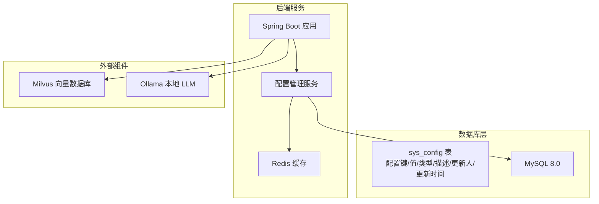
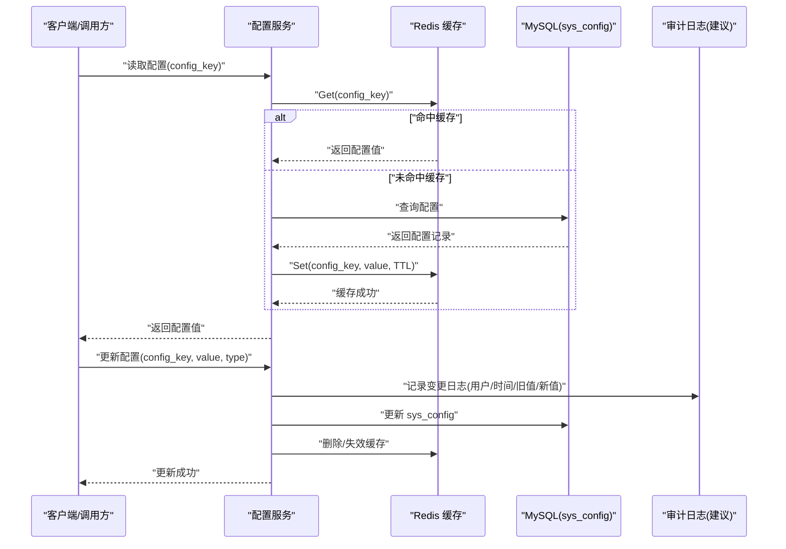
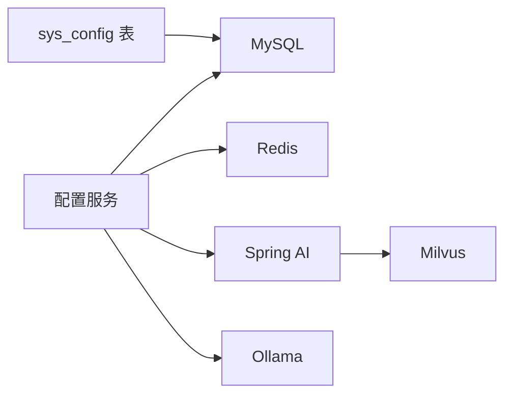

# 系统配置管理数据库

<cite>
**本文引用的文件**
- [init.sql](file://sql/init.sql)
- [PROJECT_CONTEXT.md](file://PROJECT_CONTEXT.md)
- [docker-compose.yml](file://docker-compose.yml)
- [milvus_collection.yaml](file://config/milvus_collection.yaml)
- [shared-safety-constraints.md](file://docs/prompts/shared-safety-constraints.md)
</cite>

## 目录
1. [简介](#简介)
2. [项目结构](#项目结构)
3. [核心组件](#核心组件)
4. [架构总览](#架构总览)
5. [详细组件分析](#详细组件分析)
6. [依赖分析](#依赖分析)
7. [性能考量](#性能考量)
8. [故障排查指南](#故障排查指南)
9. [结论](#结论)
10. [附录](#附录)

## 简介
本文件围绕智能运维系统中的“系统配置管理数据库”展开，聚焦于 sys_config 表的结构设计、配置分类与作用域、类型安全与默认值管理、查询接口与缓存策略、以及配置变更的日志与版本管理建议。文档以仓库中的 SQL 初始化脚本为权威依据，并结合项目上下文与容器编排配置，给出可落地的设计与实践建议。

## 项目结构
- 数据库初始化脚本定义了 sys_config 表及其默认配置项。
- 项目上下文明确了系统采用 Spring Boot + Spring AI + Milvus + MySQL + Redis 的技术栈。
- docker-compose.yml 提供了 MySQL、Redis、Milvus、Ollama 等服务的一键部署与依赖关系。
- 配置文件（如 Milvus Collection 配置）体现了系统对向量维度、索引类型等关键参数的约束与设计。

图表来源
- [init.sql:220-246](file://sql/init.sql#L220-L246)
- [PROJECT_CONTEXT.md:25-40](file://PROJECT_CONTEXT.md#L25-L40)
- [docker-compose.yml:155-290](file://docker-compose.yml#L155-L290)

章节来源
- [init.sql:220-246](file://sql/init.sql#L220-L246)
- [PROJECT_CONTEXT.md:25-40](file://PROJECT_CONTEXT.md#L25-L40)
- [docker-compose.yml:155-290](file://docker-compose.yml#L155-L290)

## 核心组件
- sys_config 表：统一存储系统配置键值、类型、描述、更新人与更新时间，提供默认配置初始化与唯一键约束。
- 默认配置项：涵盖 LLM 提供商、模型参数、RAG 检索参数、命令执行安全策略等。
- 缓存与查询：建议在后端引入 Redis 缓存与懒加载策略，减少数据库压力。
- 审计与版本：建议在配置变更时记录审计日志与版本号，便于回溯与治理。

章节来源
- [init.sql:220-246](file://sql/init.sql#L220-L246)

## 架构总览
系统配置管理贯穿后端服务与数据库层，后端通过配置服务统一读取与缓存 sys_config，结合 Redis 提升查询性能；同时，配置变更需纳入审计与版本管理，确保可追溯与可回滚。

图表来源
- [init.sql:220-246](file://sql/init.sql#L220-L246)
- [docker-compose.yml:210-246](file://docker-compose.yml#L210-L246)

## 详细组件分析

### sys_config 表结构与字段设计
- 字段说明
  - id：自增主键，唯一标识每条配置记录。
  - config_key：配置键，唯一约束，便于按键精确查询。
  - config_value：配置值，采用 TEXT 存储，便于支持字符串、数字、布尔等任意 JSON 序列化形式。
  - config_type：配置类型，枚举值（string/number/boolean），用于类型校验与转换。
  - description：配置描述，便于维护与文档化。
  - updated_by：更新人，记录最后一次修改的用户ID。
  - updated_at：更新时间，自动更新，便于审计与版本追踪。
- 索引与约束
  - 主键：id
  - 唯一键：uk_config_key，保证每个配置键唯一
  - 建议索引：按 config_key 查询频繁，可考虑在 config_key 上建立索引（当前已由唯一键隐含）

章节来源
- [init.sql:220-246](file://sql/init.sql#L220-L246)

### 配置分类与作用域
- LLM 提供商配置
  - llm.provider：字符串，取值范围 deepseek/ollama，用于切换推理后端。
  - llm.model：字符串，模型名称，如 deepseek-chat。
  - llm.temperature：数值，控制生成随机性。
  - llm.max_tokens：数值，最大生成 token 数。
- RAG 检索配置
  - rag.top_k：数值，检索返回 Top-K。
  - rag.similarity_threshold：数值，相似度阈值。
- 命令执行安全配置
  - execution.auto_approve_low_risk：布尔，是否自动批准低风险命令。
  - execution.max_wait_time：数值，命令执行最大等待时间（秒）。

章节来源
- [init.sql:235-244](file://sql/init.sql#L235-L244)

### 类型安全存储与默认值管理
- 类型安全
  - config_type 字段用于声明配置值的预期类型，后端在读取时进行类型转换与校验，避免运行期类型错误。
  - 建议在后端实现类型转换器：将字符串值转换为期望的 Java/Python 类型（如 int、float、bool），并在转换失败时抛出明确异常。
- 默认值管理
  - 初始化脚本提供默认配置，确保系统首次启动即可正常运行。
  - 建议在后端实现“默认值回退”策略：若数据库中缺失某配置键，则使用内置默认值；同时记录该回退行为以便审计。

章节来源
- [init.sql:235-244](file://sql/init.sql#L235-L244)

### 配置查询接口设计思路
- 接口设计
  - GET /configs/{config_key}：按键查询配置值，返回 {config_key, config_value, config_type, description, updated_by, updated_at}
  - GET /configs：列出所有配置键（分页/过滤），返回简要信息
  - PUT /configs/{config_key}：更新配置值，要求提供 config_type 与 config_value
  - DELETE /configs/{config_key}：删除配置键（谨慎操作）
- 参数与响应
  - 请求体：包含 config_type 与 config_value
  - 响应体：包含更新后的配置记录与更新时间
- 错误处理
  - 未知键：返回 404
  - 类型不匹配：返回 400
  - 权限不足：返回 403
  - 并发更新：建议使用乐观锁或更新时间戳校验

章节来源
- [init.sql:220-246](file://sql/init.sql#L220-L246)

### 缓存策略
- 缓存层次
  - 应用层缓存：使用 Redis 缓存 sys_config，键为 config_key，值为序列化的配置对象，设置 TTL（如 5-15 分钟）。
  - 懒加载与失效：首次访问未命中时从数据库加载并写入缓存；更新配置后主动失效对应键。
- 缓存一致性
  - 读路径：先查缓存，未命中再查数据库，随后写入缓存。
  - 写路径：更新数据库后删除缓存键，下次读取时重新加载。
- 缓存粒度
  - 可按配置键分组缓存，或按命名空间（如 llm.*、rag.*、execution.*）分组，便于批量失效。

章节来源
- [docker-compose.yml:210-246](file://docker-compose.yml#L210-L246)
- [init.sql:220-246](file://sql/init.sql#L220-L246)

### 配置变更的日志追踪与版本管理
- 审计日志
  - 建议新增配置审计表（如 sys_config_audit），记录每次变更的用户、时间、旧值、新值、变更原因等。
  - 变更事件：INSERT/UPDATE/DELETE sys_config 触发审计记录写入。
- 版本管理
  - 可在 sys_config_audit 中增加版本号字段，实现配置版本追踪。
  - 回滚策略：根据版本号回滚到历史配置，或提供“撤销变更”按钮。
- 安全与合规
  - 对敏感配置（如 LLM API 密钥）进行脱敏显示与最小权限访问控制。
  - 审批流程：高风险配置变更需审批（如执行审批流程中的审批人角色）。

章节来源
- [shared-safety-constraints.md:244-325](file://docs/prompts/shared-safety-constraints.md#L244-L325)

## 依赖分析
- 数据库依赖
  - sys_config 表依赖 MySQL 8.0，使用 utf8mb4 字符集与唯一键约束保证数据完整性。
- 后端依赖
  - Spring Boot + Spring AI：用于 LLM 客户端与 Prompt 管理，配置项直接影响推理行为。
  - Redis：用于配置缓存与会话缓存，提升查询性能。
  - Milvus：向量检索依赖，其 Collection 配置（如维度、索引类型）与 RAG 配置相互影响。
- 外部服务
  - Ollama：本地 LLM 推理后端，与 llm.provider 配置联动。

图表来源
- [init.sql:220-246](file://sql/init.sql#L220-L246)
- [docker-compose.yml:155-290](file://docker-compose.yml#L155-L290)
- [PROJECT_CONTEXT.md:25-40](file://PROJECT_CONTEXT.md#L25-L40)

章节来源
- [init.sql:220-246](file://sql/init.sql#L220-L246)
- [docker-compose.yml:155-290](file://docker-compose.yml#L155-L290)
- [PROJECT_CONTEXT.md:25-40](file://PROJECT_CONTEXT.md#L25-L40)

## 性能考量
- 查询性能
  - 使用 Redis 缓存高频配置键，降低数据库压力。
  - 对 config_key 建立索引（当前唯一键已提供索引能力）。
- 写入性能
  - 批量更新配置时，采用事务与批量写入，减少锁竞争。
  - 更新后统一失效缓存，避免脏读。
- 缓存命中率
  - 配置键访问具有长尾特征，建议对热点键设置更短 TTL 与更高命中率策略。
- 数据库与缓存一致性
  - 采用“先写数据库，后删缓存”的顺序，确保最终一致。

## 故障排查指南
- 配置读取失败
  - 检查 config_key 是否正确，是否存在大小写差异。
  - 确认 config_type 与实际值类型是否匹配。
- 缓存未命中
  - 检查 Redis 连接与键空间，确认 TTL 是否过期。
  - 确认写入后是否正确删除缓存键。
- 配置变更未生效
  - 检查 sys_config_audit 是否记录变更日志。
  - 确认后端是否正确处理了缓存失效与重新加载。
- 审计与回滚
  - 若需回滚，根据 sys_config_audit 的版本号进行回滚操作，并通知相关用户。

章节来源
- [shared-safety-constraints.md:296-325](file://docs/prompts/shared-safety-constraints.md#L296-L325)

## 结论
sys_config 表为系统配置提供了统一、可扩展的数据层支撑。通过类型安全存储、默认值管理、缓存策略与审计日志，可在保证运行稳定性的同时，满足配置变更的可追溯与可回滚需求。建议在后端实现配置服务与缓存层，结合项目上下文的技术栈，构建高性能、可维护的配置管理体系。

## 附录
- 关键配置键与含义
  - llm.provider：LLM 提供商（deepseek/ollama）
  - llm.model：模型名称
  - llm.temperature：温度参数
  - llm.max_tokens：最大 token 数
  - rag.top_k：RAG 检索 Top-K
  - rag.similarity_threshold：RAG 相似度阈值
  - execution.auto_approve_low_risk：是否自动批准低风险命令
  - execution.max_wait_time：命令执行最大等待时间（秒）

章节来源
- [init.sql:235-244](file://sql/init.sql#L235-L244)