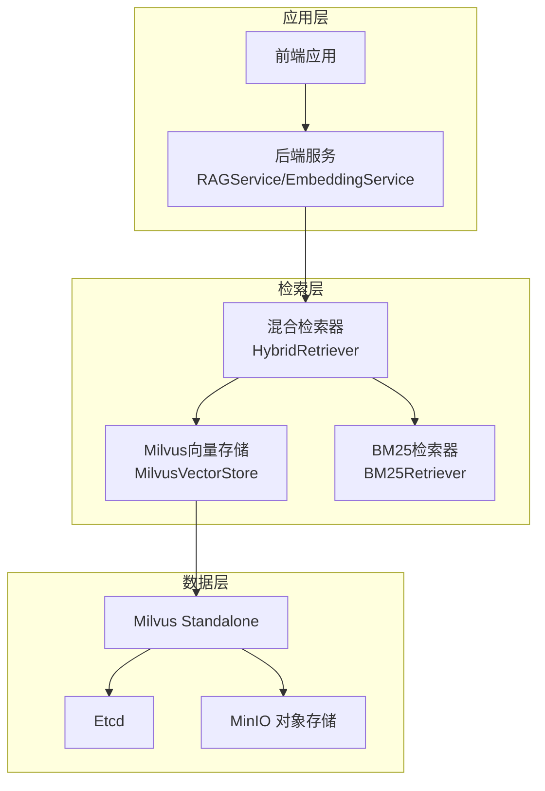
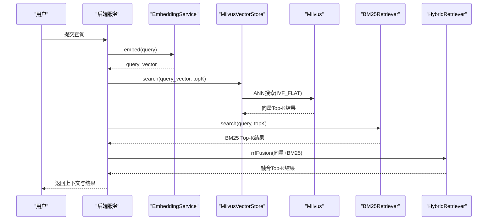
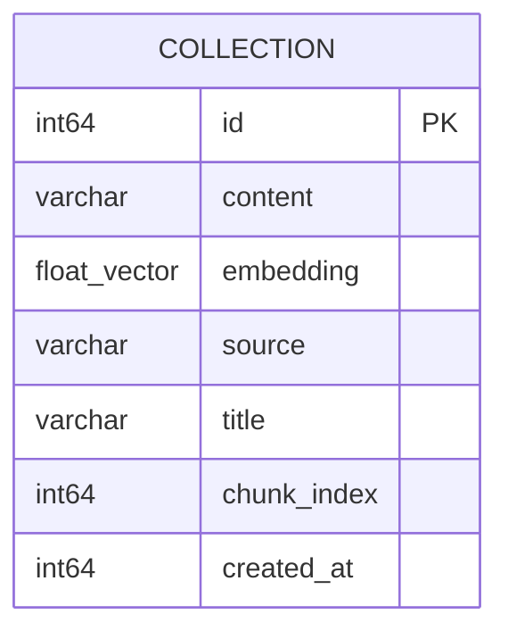
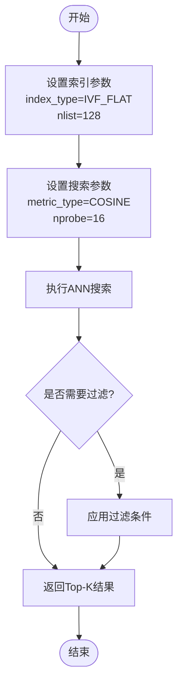
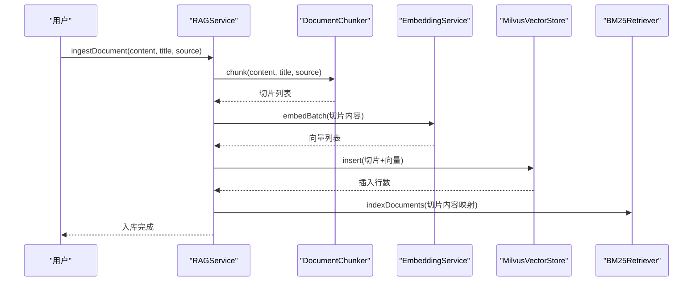
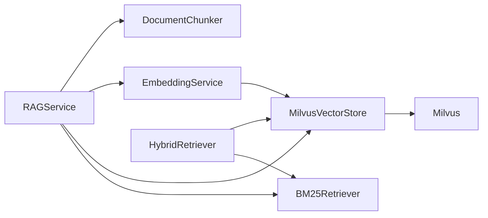

# Milvus向量数据库设计

<cite>
**本文引用的文件**
- [milvus_collection.yaml](file://config/milvus_collection.yaml)
- [init_milvus.py](file://scripts/init_milvus.py)
- [MilvusVectorStore.java](file://netdata-ai-backend/src/main/java/com/netdata/ops/core/rag/MilvusVectorStore.java)
- [docker-compose.yml](file://docker-compose.yml)
- [application.yml](file://netdata-ai-backend/src/main/resources/application.yml)
- [RAGService.java](file://netdata-ai-backend/src/main/java/com/netdata/ops/core/rag/RAGService.java)
- [EmbeddingService.java](file://netdata-ai-backend/src/main/java/com/netdata/ops/core/rag/EmbeddingService.java)
- [HybridRetriever.java](file://netdata-ai-backend/src/main/java/com/netdata/ops/core/rag/HybridRetriever.java)
- [BM25Retriever.java](file://netdata-ai-backend/src/main/java/com/netdata/ops/core/rag/BM25Retriever.java)
- [DocumentChunker.java](file://netdata-ai-backend/src/main/java/com/netdata/ops/core/rag/DocumentChunker.java)
- [test_milvus_connection.py](file://tests/test_milvus_connection.py)
- [run_evaluation.py](file://evaluation/run_evaluation.py)
</cite>

## 目录
1. [简介](#简介)
2. [项目结构](#项目结构)
3. [核心组件](#核心组件)
4. [架构总览](#架构总览)
5. [详细组件分析](#详细组件分析)
6. [依赖关系分析](#依赖关系分析)
7. [性能考量](#性能考量)
8. [故障排查指南](#故障排查指南)
9. [结论](#结论)
10. [附录](#附录)

## 简介
本文件面向Milvus向量数据库在智能运维知识库场景下的设计与实现，围绕向量集合（Collection）结构、索引类型选择、相似度计算、检索优化、数据生命周期、批量导入与增量更新、查询语法与过滤排序、集群与高可用、压缩与存储优化、以及性能基准测试与调优建议进行全面阐述。文档同时结合项目中的Python初始化脚本、Java向量存储客户端、RAG检索流程与评估脚本，给出可落地的工程实践。

## 项目结构
该项目采用前后端分离架构，向量数据库Milvus通过独立容器运行，后端服务通过gRPC/HTTP与Milvus交互；前端负责用户交互与展示。RAG服务负责文档入库、向量化、存储、检索与上下文构建；嵌入服务负责调用本地或外部Embedding模型；BM25检索器提供关键词检索能力；混合检索器整合向量与BM25结果并通过RRF融合。

图表来源
- [docker-compose.yml:23-155](file://docker-compose.yml#L23-L155)
- [MilvusVectorStore.java:80-209](file://netdata-ai-backend/src/main/java/com/netdata/ops/core/rag/MilvusVectorStore.java#L80-L209)
- [RAGService.java:37-41](file://netdata-ai-backend/src/main/java/com/netdata/ops/core/rag/RAGService.java#L37-L41)

章节来源
- [docker-compose.yml:23-155](file://docker-compose.yml#L23-L155)
- [application.yml:101-109](file://netdata-ai-backend/src/main/resources/application.yml#L101-L109)

## 核心组件
- 向量集合（Collection）结构：包含主键、内容、向量、来源、标题、切片索引、创建时间戳等字段，向量维度固定为1024，相似度度量为COSINE。
- 索引配置：采用IVF_FLAT索引，nlist为128，nprobe为16，top_k为5，输出字段包含content、source、title、chunk_index。
- 向量存储客户端：封装Milvus连接、Collection创建、索引创建、插入、搜索、删除、统计查询等操作。
- 检索流程：EmbeddingService将查询文本向量化，MilvusVectorStore执行向量搜索，BM25Retriever进行关键词检索，HybridRetriever使用RRF融合，最终构建RAG上下文。
- 数据生命周期：支持按ID或过滤条件删除；支持统计查询；未启用TTL。
- 配置与部署：Docker Compose提供Milvus Standalone、Etcd、MinIO组合部署；应用配置文件提供Milvus连接参数与RAG检索参数。

章节来源
- [milvus_collection.yaml:22-140](file://config/milvus_collection.yaml#L22-L140)
- [init_milvus.py:142-251](file://scripts/init_milvus.py#L142-L251)
- [MilvusVectorStore.java:117-209](file://netdata-ai-backend/src/main/java/com/netdata/ops/core/rag/MilvusVectorStore.java#L117-L209)
- [application.yml:101-137](file://netdata-ai-backend/src/main/resources/application.yml#L101-L137)

## 架构总览
系统采用“文档入库—向量化—存储—检索—融合—生成”的RAG链路。向量检索与BM25检索互补，通过RRF融合提升召回与排序稳定性。Milvus作为向量数据库，提供高维向量的快速近似最近邻搜索；Etcd与MinIO分别承担元数据与对象存储职责；后端服务通过Milvus客户端进行统一管理。

图表来源
- [RAGService.java:116-130](file://netdata-ai-backend/src/main/java/com/netdata/ops/core/rag/RAGService.java#L116-L130)
- [EmbeddingService.java:72-93](file://netdata-ai-backend/src/main/java/com/netdata/ops/core/rag/EmbeddingService.java#L72-L93)
- [MilvusVectorStore.java:274-324](file://netdata-ai-backend/src/main/java/com/netdata/ops/core/rag/MilvusVectorStore.java#L274-L324)
- [BM25Retriever.java:132-178](file://netdata-ai-backend/src/main/java/com/netdata/ops/core/rag/BM25Retriever.java#L132-L178)
- [HybridRetriever.java:64-100](file://netdata-ai-backend/src/main/java/com/netdata/ops/core/rag/HybridRetriever.java#L64-L100)

## 详细组件分析

### 向量集合（Collection）结构设计
- 字段定义
  - id：INT64主键，自增
  - content：VARCHAR，最大长度8000
  - embedding：FLOAT_VECTOR，维度1024
  - source：VARCHAR，最大长度512
  - title：VARCHAR，最大长度256
  - chunk_index：INT64，同一文档的片段索引
  - created_at：INT64，创建时间戳
- 相似度度量：COSINE
- 分片数量：1（Standalone模式）
- 动态字段：禁用，确保数据结构一致性
- 分区与TTL：未启用

图表来源
- [milvus_collection.yaml:105-140](file://config/milvus_collection.yaml#L105-L140)
- [init_milvus.py:179-229](file://scripts/init_milvus.py#L179-L229)

章节来源
- [milvus_collection.yaml:22-140](file://config/milvus_collection.yaml#L22-L140)
- [init_milvus.py:142-251](file://scripts/init_milvus.py#L142-L251)

### 索引类型选择与查询优化策略
- 索引类型：IVF_FLAT
  - 适用场景：中等数据量（预期10-50万条），可调节精度
  - nlist：128（聚类中心数量）
  - nprobe：16（搜索的聚类数量，越大越准确但越慢）
  - top_k：5（返回结果数量）
- 相似度度量：COSINE（适合文本语义检索）
- 搜索参数：metric_type=COSINE，params={nprobe}
- 输出字段：content、source、title、chunk_index
- 查询语法与过滤
  - 支持过滤条件（如“source == 'xxx'”）
  - 支持一致性级别（BOUNDED）

图表来源
- [milvus_collection.yaml:70-101](file://config/milvus_collection.yaml#L70-L101)
- [MilvusVectorStore.java:286-324](file://netdata-ai-backend/src/main/java/com/netdata/ops/core/rag/MilvusVectorStore.java#L286-L324)

章节来源
- [milvus_collection.yaml:54-101](file://config/milvus_collection.yaml#L54-L101)
- [init_milvus.py:253-303](file://scripts/init_milvus.py#L253-L303)
- [MilvusVectorStore.java:186-192](file://netdata-ai-backend/src/main/java/com/netdata/ops/core/rag/MilvusVectorStore.java#L186-L192)

### 文档嵌入向量的存储结构、相似度计算与检索性能
- 存储结构：embedding字段为1024维FLOAT_VECTOR，与BGE-M3模型输出维度一致；内容字段存储切片文本，便于检索后回填。
- 相似度计算：COSINE相似度，由Milvus在底层实现；EmbeddingService提供余弦相似度计算方法用于评估或对比。
- 检索性能：通过IVF_FLAT索引与nprobe参数平衡精度与速度；Standalone模式下内存占用约4GB，建议根据数据规模调整nlist与nprobe。

章节来源
- [milvus_collection.yaml:39-49](file://config/milvus_collection.yaml#L39-L49)
- [EmbeddingService.java:135-161](file://netdata-ai-backend/src/main/java/com/netdata/ops/core/rag/EmbeddingService.java#L135-L161)
- [docker-compose.yml:148-154](file://docker-compose.yml#L148-L154)

### 向量数据的生命周期管理、批量导入与增量更新
- 生命周期管理
  - 统计查询：支持获取Collection行数与可用性
  - 删除：支持按ID删除与按过滤条件删除
  - TTL：未启用
- 批量导入
  - RAGService负责文档入库：切分→向量化→存储→更新BM25索引
  - MilvusVectorStore支持批量插入
- 增量更新
  - 删除支持按过滤条件（如source），但BM25索引目前不支持按条件删除，需重建索引

图表来源
- [RAGService.java:57-91](file://netdata-ai-backend/src/main/java/com/netdata/ops/core/rag/RAGService.java#L57-L91)
- [DocumentChunker.java:81-104](file://netdata-ai-backend/src/main/java/com/netdata/ops/core/rag/DocumentChunker.java#L81-L104)
- [EmbeddingService.java:101-133](file://netdata-ai-backend/src/main/java/com/netdata/ops/core/rag/EmbeddingService.java#L101-L133)
- [MilvusVectorStore.java:217-254](file://netdata-ai-backend/src/main/java/com/netdata/ops/core/rag/MilvusVectorStore.java#L217-L254)

章节来源
- [RAGService.java:177-200](file://netdata-ai-backend/src/main/java/com/netdata/ops/core/rag/RAGService.java#L177-L200)
- [MilvusVectorStore.java:331-368](file://netdata-ai-backend/src/main/java/com/netdata/ops/core/rag/MilvusVectorStore.java#L331-L368)

### 向量检索的查询语法、过滤条件与排序规则
- 查询语法
  - 向量搜索：指定anns_field为embedding，设置metric_type与nprobe
  - 过滤条件：支持字符串表达式（如“source == 'xxx'”）
  - 输出字段：可指定返回字段列表
- 排序规则
  - Milvus返回结果按相似度分数排序
  - 混合检索使用RRF算法对向量与BM25结果进行融合排序

章节来源
- [MilvusVectorStore.java:286-324](file://netdata-ai-backend/src/main/java/com/netdata/ops/core/rag/MilvusVectorStore.java#L286-L324)
- [HybridRetriever.java:134-193](file://netdata-ai-backend/src/main/java/com/netdata/ops/core/rag/HybridRetriever.java#L134-L193)

### 集群配置、副本策略与高可用设计
- 当前部署：Standalone模式，使用Etcd与MinIO作为依赖，适合开发与演示
- 高可用建议
  - 生产环境可迁移到Cluster模式，启用多副本与分片
  - 配置Etcd高可用与MinIO纠删码
  - 通过负载均衡与健康检查保障服务可用性

章节来源
- [docker-compose.yml:27-31](file://docker-compose.yml#L27-L31)
- [docker-compose.yml:99-155](file://docker-compose.yml#L99-L155)

### 向量数据的压缩存储、内存管理与磁盘空间优化
- 压缩存储
  - 启用数据压缩：DATA_COORD_ENABLECOMPACTION=true
  - 压缩丢弃比例：DATA_COORD_COMPACTION_DROPRATIO（未显式设置）
- 内存管理
  - Milvus Standalone分配4GB内存，建议根据数据规模调整
  - 合理设置nlist与nprobe以平衡内存占用与查询性能
- 磁盘空间优化
  - MinIO对象存储容量：ETCD_QUOTA_BACKEND_BYTES=8GB
  - 建议定期清理历史数据与冗余索引

章节来源
- [docker-compose.yml:118-123](file://docker-compose.yml#L118-L123)
- [docker-compose.yml:39-43](file://docker-compose.yml#L39-L43)
- [docker-compose.yml:148-154](file://docker-compose.yml#L148-L154)

### 性能基准测试与调优建议
- 基准测试
  - 使用评估脚本测量延迟、吞吐量与功能指标
  - 支持聊天API与异常检测API的性能评估
- 调优建议
  - 索引参数：根据数据规模调整nlist与nprobe
  - 搜索参数：top_k与输出字段影响返回大小与网络传输
  - 混合检索：调整向量Top-K与BM25 Top-K及RRF融合参数
  - 系统资源：为Milvus分配充足内存，监控CPU与磁盘I/O

章节来源
- [run_evaluation.py:197-241](file://evaluation/run_evaluation.py#L197-L241)
- [application.yml:125-137](file://netdata-ai-backend/src/main/resources/application.yml#L125-L137)

## 依赖关系分析
- 后端服务依赖Milvus客户端进行向量存储与检索
- RAG服务依赖文档切分、嵌入向量化、向量存储与BM25检索
- 混合检索器依赖向量存储与BM25检索器，并通过RRF融合
- 应用配置文件提供Milvus连接参数与RAG检索参数

图表来源
- [RAGService.java:37-41](file://netdata-ai-backend/src/main/java/com/netdata/ops/core/rag/RAGService.java#L37-L41)
- [HybridRetriever.java:42-44](file://netdata-ai-backend/src/main/java/com/netdata/ops/core/rag/HybridRetriever.java#L42-L44)
- [EmbeddingService.java:38-48](file://netdata-ai-backend/src/main/java/com/netdata/ops/core/rag/EmbeddingService.java#L38-L48)

章节来源
- [RAGService.java:37-41](file://netdata-ai-backend/src/main/java/com/netdata/ops/core/rag/RAGService.java#L37-L41)
- [HybridRetriever.java:42-44](file://netdata-ai-backend/src/main/java/com/netdata/ops/core/rag/HybridRetriever.java#L42-L44)

## 性能考量
- 索引与搜索
  - IVF_FLAT在中等数据量下具备良好平衡；nlist与nprobe直接影响精度与速度
  - 输出字段越少，网络传输与解析开销越低
- 检索融合
  - RRF融合无需调参，鲁棒性好；向量Top-K与BM25 Top-K应结合业务需求调整
- 系统资源
  - Milvus内存占用与数据规模、索引类型密切相关；建议预留20%以上内存余量
  - MinIO与Etcd的磁盘空间与网络带宽同样重要

## 故障排查指南
- 连接与健康检查
  - 使用连接测试脚本验证gRPC连接与健康检查端点
  - 关注Docker容器日志与健康检查状态
- 常见问题
  - 连接失败：检查主机、端口与网络连通性
  - 搜索无结果：确认索引是否创建、加载，nprobe是否合理
  - 删除无效：确认过滤条件语法与字段类型

章节来源
- [test_milvus_connection.py:33-79](file://tests/test_milvus_connection.py#L33-L79)
- [test_milvus_connection.py:81-116](file://tests/test_milvus_connection.py#L81-L116)

## 结论
本设计以Milvus为核心，结合向量检索与BM25关键词检索，通过RRF融合实现稳定高效的RAG检索。Collection结构清晰、索引参数合理、检索流程完整，具备良好的扩展性与可维护性。建议在生产环境中迁移到Cluster模式，完善TTL与增量更新机制，并持续通过评估脚本进行性能监控与调优。

## 附录
- 配置文件与参数
  - Collection基础配置、向量配置、索引配置、搜索配置、字段定义、分区与保留策略
  - 应用配置文件中的Milvus连接参数与RAG检索参数
- 初始化与测试
  - Python初始化脚本用于创建Collection、索引与插入测试数据
  - 连接测试脚本用于验证服务可用性
- 评估与报告
  - 性能评估脚本用于生成延迟、吞吐量与功能指标报告

章节来源
- [milvus_collection.yaml:1-186](file://config/milvus_collection.yaml#L1-L186)
- [application.yml:101-137](file://netdata-ai-backend/src/main/resources/application.yml#L101-L137)
- [init_milvus.py:466-525](file://scripts/init_milvus.py#L466-L525)
- [test_milvus_connection.py:118-144](file://tests/test_milvus_connection.py#L118-L144)
- [run_evaluation.py:440-523](file://evaluation/run_evaluation.py#L440-L523)