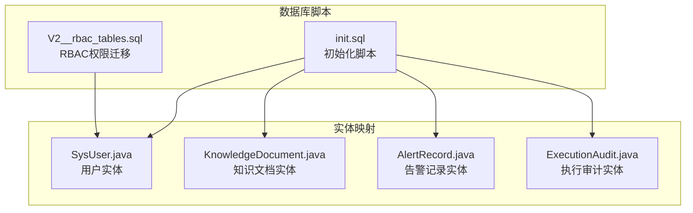
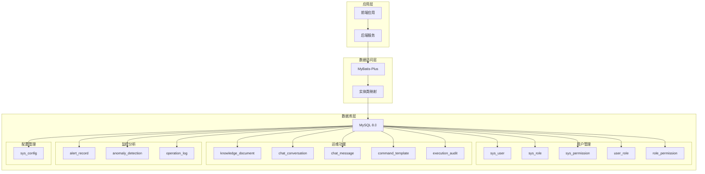
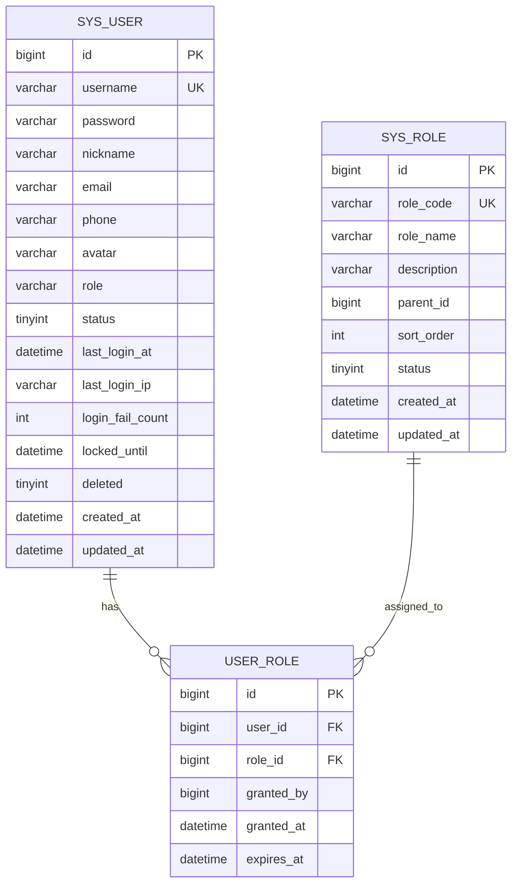
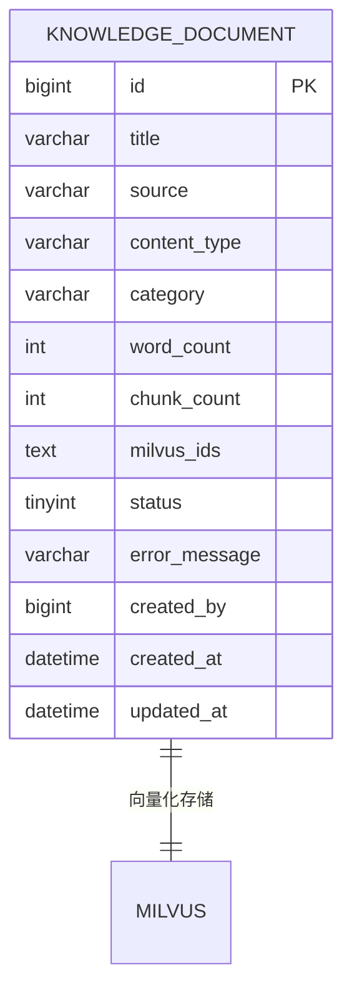
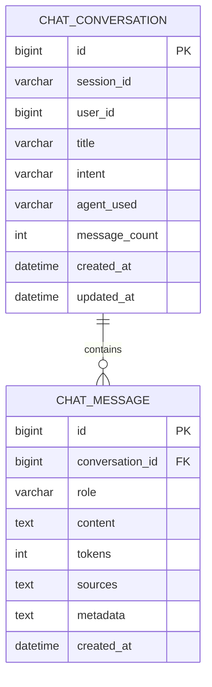
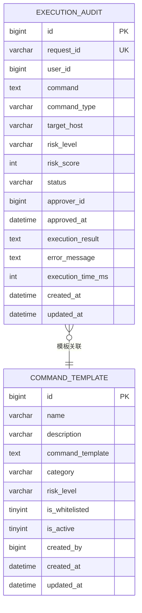
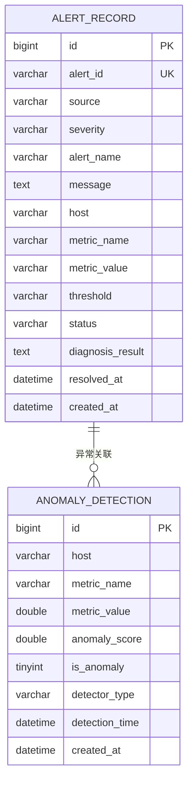
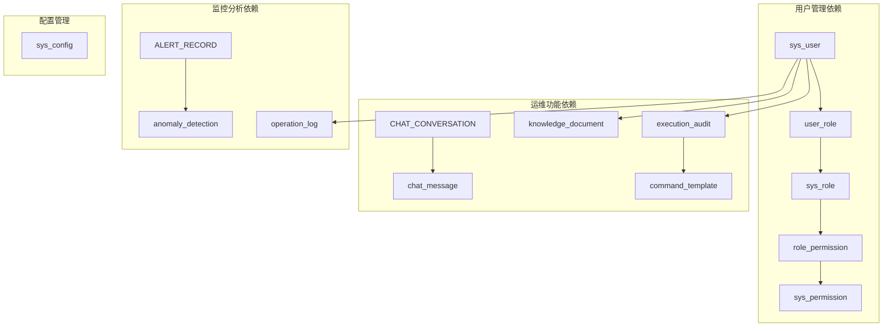

# MySQL数据库设计

<cite>
**本文档引用的文件**
- [init.sql](file://sql/init.sql)
- [V2__rbac_tables.sql](file://sql/V2__rbac_tables.sql)
- [SysUser.java](file://netdata-ai-backend/src/main/java/com/netdata/ops/entity/SysUser.java)
- [KnowledgeDocument.java](file://netdata-ai-backend/src/main/java/com/netdata/ops/entity/KnowledgeDocument.java)
- [AlertRecord.java](file://netdata-ai-backend/src/main/java/com/netdata/ops/entity/AlertRecord.java)
- [ExecutionAudit.java](file://netdata-ai-backend/src/main/java/com/netdata/ops/entity/ExecutionAudit.java)
</cite>

## 目录
1. [简介](#简介)
2. [项目结构](#项目结构)
3. [核心组件](#核心组件)
4. [架构概览](#架构概览)
5. [详细组件分析](#详细组件分析)
6. [依赖分析](#依赖分析)
7. [性能考虑](#性能考虑)
8. [故障排除指南](#故障排除指南)
9. [结论](#结论)
10. [附录](#附录)

## 简介

本文件为智能运维问答与执行系统的MySQL数据库设计技术文档。系统采用MySQL作为核心数据存储，结合MyBatis-Plus框架实现ORM映射，支持完整的运维能力，包括AI问答、知识库管理、命令执行审计、告警管理和异常检测等功能。

系统数据库设计遵循以下原则：
- **规范化设计**：通过合理的表结构设计和外键约束保证数据一致性
- **性能优化**：针对高频查询场景建立合适的索引策略
- **扩展性考虑**：支持RBAC权限模型和灵活的配置管理
- **安全性保障**：内置账户安全控制和操作审计机制

## 项目结构

数据库相关文件主要位于sql目录，包含初始化脚本和RBAC权限管理迁移脚本：

**图表来源**
- [init.sql:1-274](file://sql/init.sql#L1-L274)
- [V2__rbac_tables.sql:1-256](file://sql/V2__rbac_tables.sql#L1-L256)

**章节来源**
- [init.sql:1-274](file://sql/init.sql#L1-L274)
- [V2__rbac_tables.sql:1-256](file://sql/V2__rbac_tables.sql#L1-L256)

## 核心组件

系统数据库由以下核心表组成：

### 用户管理系统
- **sys_user**：系统用户表，支持基础认证和RBAC权限管理
- **sys_role**：角色表，支持角色继承和层级管理
- **sys_permission**：权限表，定义系统所有可用权限
- **user_role**：用户角色关联表，实现多对多关系
- **role_permission**：角色权限关联表，建立权限继承关系

### 运维功能表
- **knowledge_document**：知识库文档表，支持文档管理和向量化检索
- **chat_conversation**：对话历史表，记录AI问答交互历史
- **chat_message**：对话消息表，存储具体的对话内容
- **command_template**：命令模板表，提供标准化的运维命令模板
- **execution_audit**：命令执行审计表，跟踪所有运维操作

### 监控与分析表
- **alert_record**：告警记录表，接收和存储监控告警信息
- **anomaly_detection**：异常检测结果表，存储AI异常检测结果
- **operation_log**：操作审计日志表，记录系统所有重要操作

**章节来源**
- [init.sql:25-217](file://sql/init.sql#L25-L217)
- [V2__rbac_tables.sql:38-185](file://sql/V2__rbac_tables.sql#L38-L185)

## 架构概览

系统采用分层架构设计，数据库层提供统一的数据访问接口：

**图表来源**
- [init.sql:25-244](file://sql/init.sql#L25-L244)
- [V2__rbac_tables.sql:38-185](file://sql/V2__rbac_tables.sql#L38-L185)

## 详细组件分析

### 用户表设计 (sys_user)

用户表是系统的核心表之一，支持基础认证和RBAC权限管理：

**图表来源**
- [init.sql:26-41](file://sql/init.sql#L26-L41)
- [V2__rbac_tables.sql:39-53](file://sql/V2__rbac_tables.sql#L39-L53)
- [V2__rbac_tables.sql:77-90](file://sql/V2__rbac_tables.sql#L77-L90)

**字段设计说明**：
- **id**: 主键，自增BIGINT类型
- **username**: 唯一用户名，VARCHAR(50)，用于登录认证
- **password**: 加密密码，VARCHAR(255)，支持BCrypt加密
- **role**: 兼容字段，保留原有角色标识
- **status**: 用户状态，0禁用/1启用
- **安全字段**: last_login_at、last_login_ip、login_fail_count、locked_until
- **逻辑删除**: deleted字段支持软删除

**索引策略**：
- 主键索引：PRIMARY KEY(id)
- 唯一索引：UK_USERNAME(username)
- 普通索引：IDX_STATUS(status)

**章节来源**
- [init.sql:26-41](file://sql/init.sql#L26-L41)
- [V2__rbac_tables.sql:23-29](file://sql/V2__rbac_tables.sql#L23-L29)

### 知识文档表 (knowledge_document)

知识文档表支持文档的全生命周期管理：

**图表来源**
- [init.sql:52-70](file://sql/init.sql#L52-L70)

**字段设计说明**：
- **id**: 主键，自增BIGINT
- **title**: 文档标题，VARCHAR(256)
- **source**: 文档来源，支持URL或文件路径
- **content_type**: 内容类型，默认markdown
- **category**: 文档分类，支持业务分类管理
- **milvus_ids**: 向量化ID列表，JSON格式存储
- **status**: 处理状态，0处理中/1已入库/2失败

**索引策略**：
- 主键索引：PRIMARY KEY(id)
- 普通索引：IDX_SOURCE(source(255))、IDX_CATEGORY(category)、IDX_STATUS(status)

**章节来源**
- [init.sql:52-70](file://sql/init.sql#L52-L70)

### 对话历史表 (chat_conversation)

对话历史表记录AI问答的完整会话信息：

**图表来源**
- [init.sql:76-90](file://sql/init.sql#L76-L90)
- [init.sql:96-109](file://sql/init.sql#L96-L109)

**字段设计说明**：
- **session_id**: 唯一会话标识符
- **user_id**: 关联用户，支持用户行为追踪
- **intent**: 对话意图类型，支持智能路由
- **agent_used**: 使用的AI Agent类型
- **message_count**: 统计消息数量

**索引策略**：
- 主键索引：PRIMARY KEY(id)
- 普通索引：IDX_SESSION_ID(session_id)、IDX_USER_ID(user_id)、IDX_CREATED_AT(created_at)

**外键关系**：
- chat_message.conversation_id → chat_conversation.id (CASCADE删除)

**章节来源**
- [init.sql:76-109](file://sql/init.sql#L76-L109)

### 命令执行审计表 (execution_audit)

命令执行审计表提供完整的运维操作追踪：

**图表来源**
- [init.sql:115-138](file://sql/init.sql#L115-L138)
- [init.sql:144-159](file://sql/init.sql#L144-L159)

**字段设计说明**：
- **request_id**: 唯一请求标识，支持幂等性
- **command**: 执行的具体命令内容
- **risk_level**: 风险等级，支持自动化审批决策
- **status**: 执行状态，完整的生命周期管理
- **execution_time_ms**: 性能监控指标

**索引策略**：
- 主键索引：PRIMARY KEY(id)
- 唯一索引：UK_REQUEST_ID(request_id)
- 普通索引：IDX_USER_ID(user_id)、IDX_STATUS(status)、IDX_RISK_LEVEL(risk_level)、IDX_CREATED_AT(created_at)

**章节来源**
- [init.sql:115-138](file://sql/init.sql#L115-L138)

### 告警记录表 (alert_record)

告警记录表接收和存储监控系统的告警信息：

**图表来源**
- [init.sql:176-196](file://sql/init.sql#L176-L196)
- [init.sql:202-217](file://sql/init.sql#L202-L217)

**字段设计说明**：
- **alert_id**: 告警唯一标识，支持去重和关联
- **severity**: 严重程度分级，支持自动化处理
- **status**: 告警状态，firing/resolved完整生命周期
- **diagnosis_result**: AI诊断结果，JSON格式存储

**索引策略**：
- 主键索引：PRIMARY KEY(id)
- 唯一索引：UK_ALERT_ID(alert_id)
- 普通索引：IDX_SEVERITY(severity)、IDX_STATUS(status)、IDX_CREATED_AT(created_at)

**章节来源**
- [init.sql:176-196](file://sql/init.sql#L176-L196)

### 异常检测结果表 (anomaly_detection)

异常检测结果表存储AI异常检测的输出：

**字段设计说明**：
- **host**: 异常发生的主机
- **metric_name**: 异常的监控指标
- **anomaly_score**: 异常分数，支持阈值判断
- **is_anomaly**: 布尔型异常标识
- **detection_time**: 检测发生的时间点

**索引策略**：
- 主键索引：PRIMARY KEY(id)
- 普通索引：IDX_HOST(host)、IDX_METRIC_NAME(metric_name)、IDX_IS_ANOMALY(is_anomaly)、IDX_DETECTION_TIME(detection_time)

**章节来源**
- [init.sql:202-217](file://sql/init.sql#L202-L217)

### 系统配置表 (sys_config)

系统配置表提供集中化的配置管理：

**字段设计说明**：
- **config_key**: 配置键，唯一标识
- **config_value**: 配置值，支持多种数据类型
- **config_type**: 配置类型，string/number/boolean
- **description**: 配置描述信息

**初始化配置**：
- LLM提供商配置
- RAG检索参数
- 自动审批策略
- 系统运行参数

**章节来源**
- [init.sql:223-244](file://sql/init.sql#L223-L244)

## 依赖分析

系统表之间的依赖关系体现了清晰的业务逻辑：

**图表来源**
- [init.sql:25-244](file://sql/init.sql#L25-L244)
- [V2__rbac_tables.sql:38-185](file://sql/V2__rbac_tables.sql#L38-L185)

**外键约束分析**：
- chat_message.conversation_id → chat_conversation.id (CASCADE)
- execution_audit.user_id → sys_user.id (RESTRICT)
- user_role.user_id → sys_user.id (CASCADE)
- user_role.role_id → sys_role.id (CASCADE)
- role_permission.role_id → sys_role.id (CASCADE)
- role_permission.permission_id → sys_permission.id (CASCADE)

**章节来源**
- [init.sql:108-108](file://sql/init.sql#L108-L108)
- [V2__rbac_tables.sql:152-154](file://sql/V2__rbac_tables.sql#L152-L154)

## 性能考虑

### 索引优化策略

**复合索引设计**：
- 告警统计查询：(severity, created_at)
- 执行审计查询：(status, risk_level, created_at)
- 用户登录查询：(username, status)
- 文档检索查询：(category, status, created_at)

**查询性能优化**：
- 使用覆盖索引减少回表查询
- 合理利用前缀索引降低存储开销
- 定期分析表统计信息优化查询计划

### 存储引擎选择

所有表均采用InnoDB存储引擎，具备以下优势：
- 支持事务处理和外键约束
- 提供行级锁定和高并发性能
- 支持崩溃恢复和数据持久化

### 分区策略建议

对于大数据量的表，建议实施分区策略：
- 按时间分区：execution_audit、alert_record、anomaly_detection
- 按状态分区：execution_audit.status、alert_record.status
- 按风险等级分区：execution_audit.risk_level

## 故障排除指南

### 常见问题诊断

**连接问题**：
- 检查MySQL服务状态和端口监听
- 验证用户权限和访问限制
- 确认字符集设置匹配

**索引失效排查**：
- 使用EXPLAIN分析查询执行计划
- 检查索引选择性和统计信息
- 识别可能导致索引失效的查询模式

**性能问题定位**：
- 监控慢查询日志
- 分析锁等待和死锁情况
- 评估缓冲池命中率

### 数据一致性检查

**外键约束验证**：
- 检查引用完整性
- 验证级联删除和更新行为
- 确认删除保护机制

**数据完整性校验**：
- 定期执行数据质量检查
- 监控重复数据和异常值
- 验证业务规则约束

**章节来源**
- [init.sql:20-20](file://sql/init.sql#L20-L20)
- [V2__rbac_tables.sql:18-18](file://sql/V2__rbac_tables.sql#L18-L18)

## 结论

本数据库设计方案充分考虑了智能运维系统的业务需求，通过规范化的表结构设计、完善的索引策略和严格的外键约束，确保了数据的一致性和完整性。RBAC权限模型的引入为系统的安全管理提供了坚实基础，而视图设计则简化了复杂查询的执行。

系统设计在保证功能完整性的同时，注重性能优化和扩展性，能够满足未来业务发展的需求。通过合理的索引策略和分区方案，系统能够在大数据量场景下保持良好的查询性能。

## 附录

### 视图设计说明

**v_alert_statistics告警统计视图**：
- 按日期和严重级别聚合告警数据
- 计算解决率和平均解决时间
- 支持告警趋势分析和SLA监控

**v_execution_statistics执行统计视图**：
- 按日期和风险等级统计执行结果
- 计算成功率和平均执行时间
- 支持运维效率分析和风险评估

### 初始化数据

系统提供完整的初始化数据，包括：
- 默认管理员账户
- 常用命令模板
- 系统配置参数
- RBAC权限体系

**章节来源**
- [init.sql:251-273](file://sql/init.sql#L251-L273)
- [V2__rbac_tables.sql:189-253](file://sql/V2__rbac_tables.sql#L189-L253)