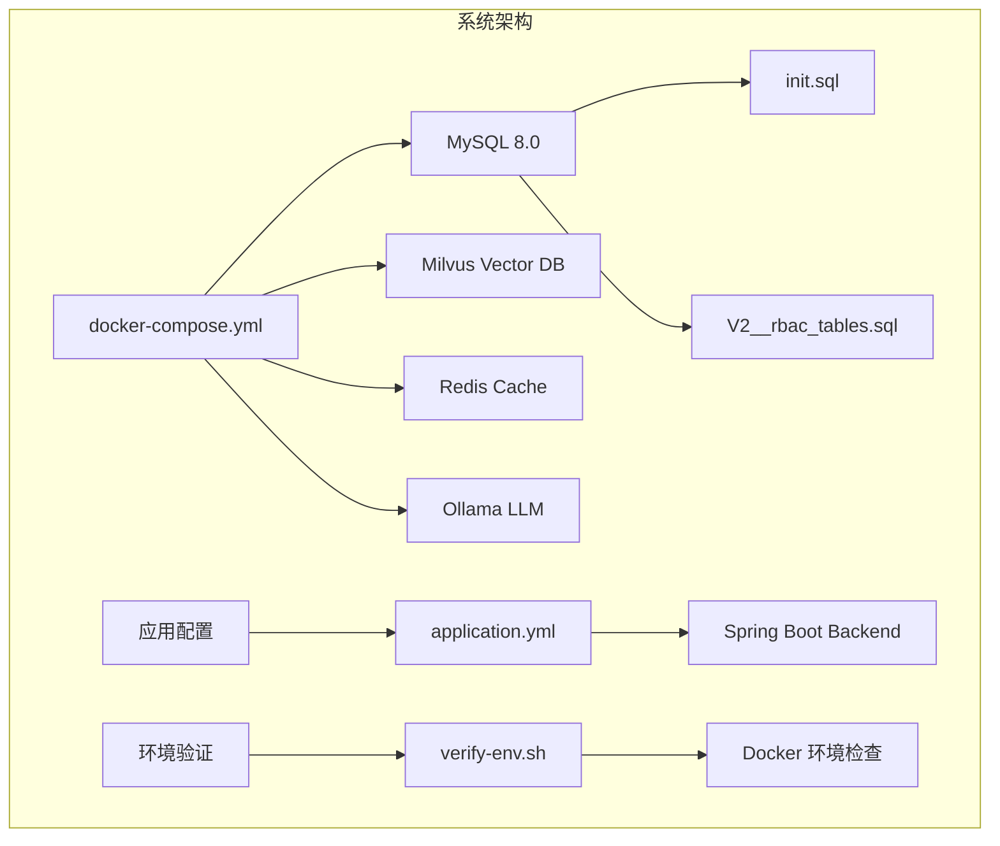
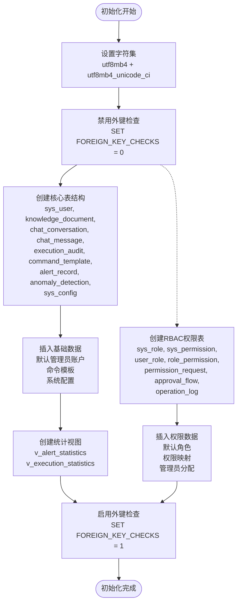
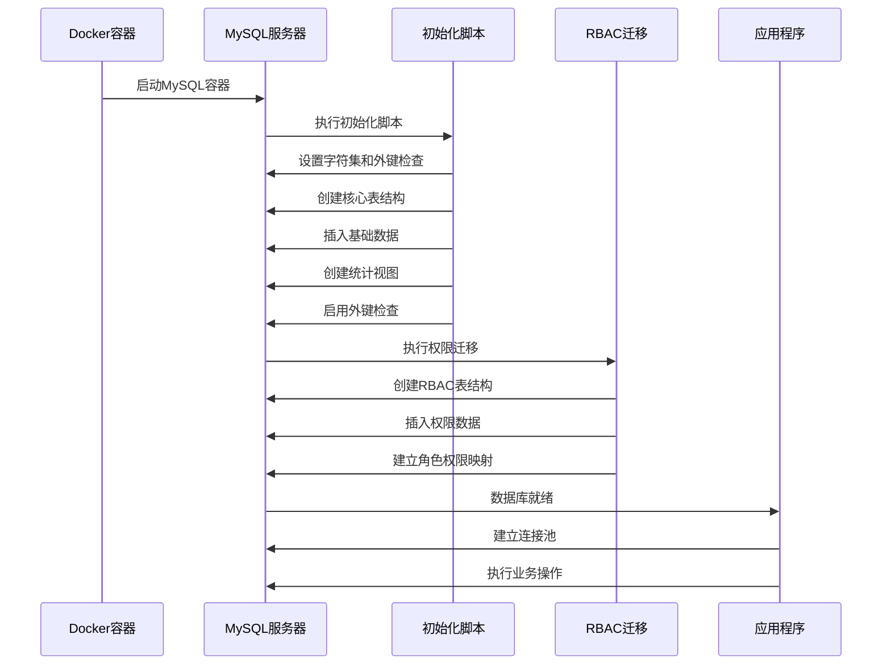
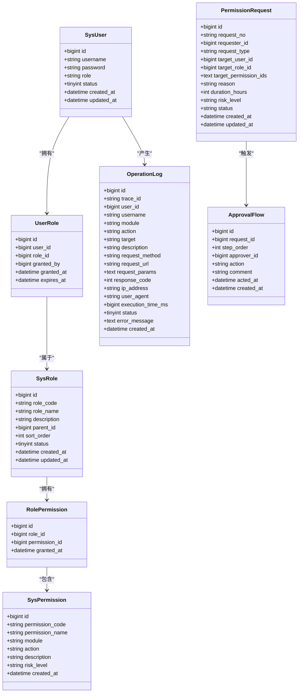
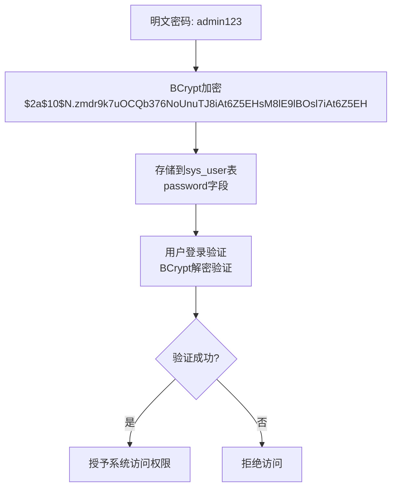
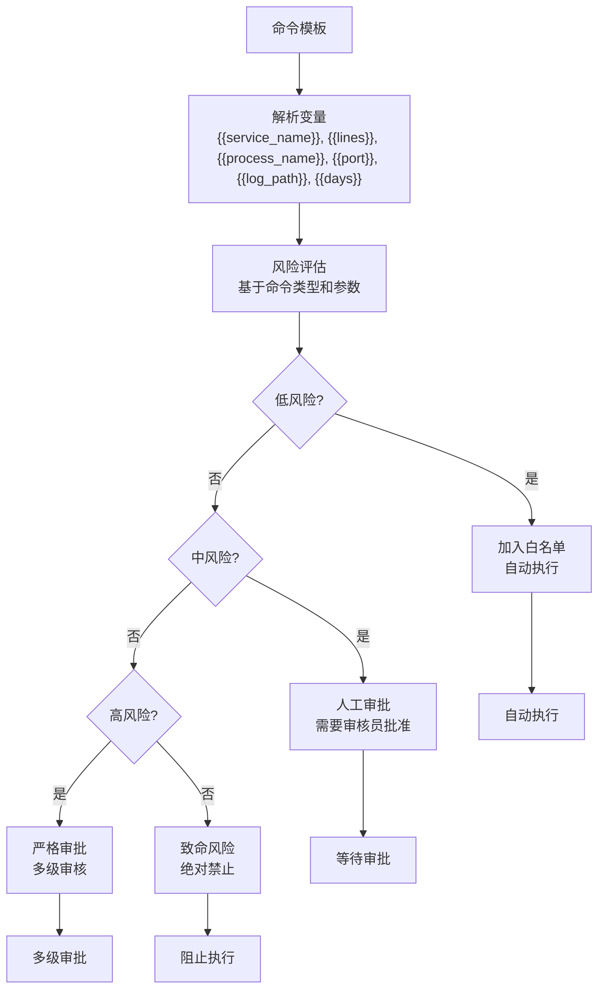
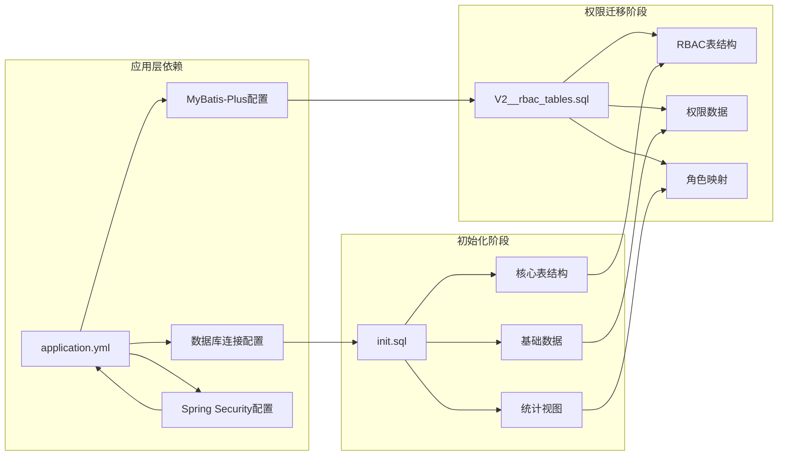
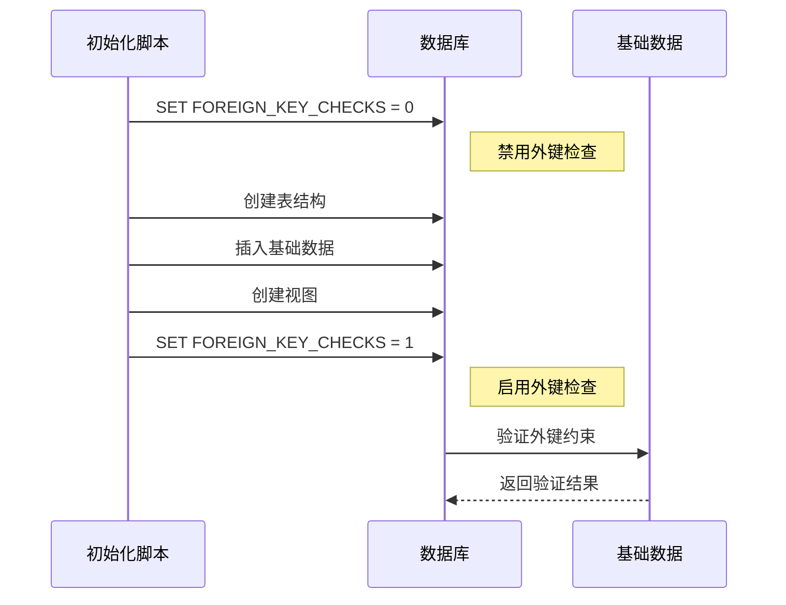
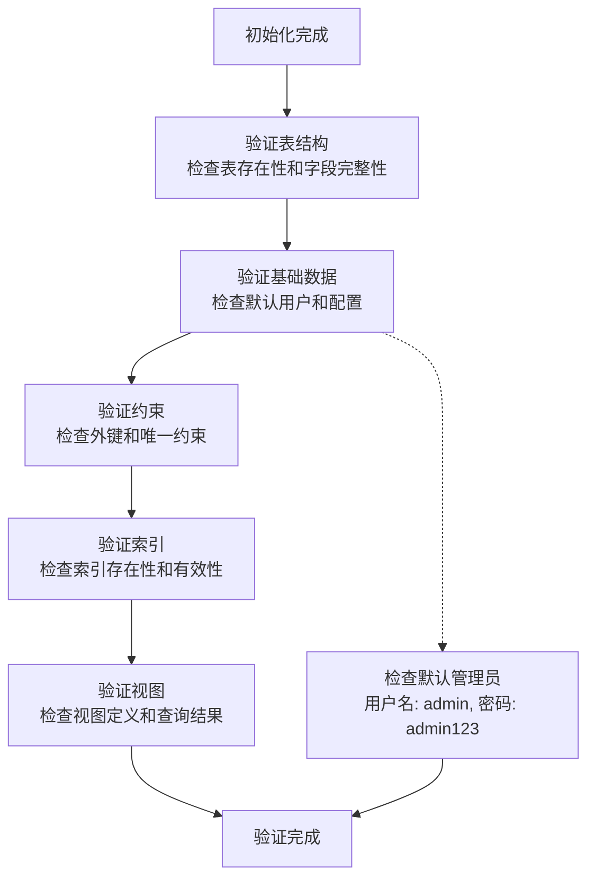

# 数据库初始化与基础数据

<cite>
**本文档引用的文件**
- [init.sql](file://sql/init.sql)
- [V2__rbac_tables.sql](file://sql/V2__rbac_tables.sql)
- [application.yml](file://netdata-ai-backend/src/main/resources/application.yml)
- [docker-compose.yml](file://docker-compose.yml)
- [SecurityConfig.java](file://netdata-ai-backend/src/main/java/com/netdata/ops/config/SecurityConfig.java)
- [SecurityUser.java](file://netdata-ai-backend/src/main/java/com/netdata/ops/security/SecurityUser.java)
- [shared-safety-constraints.md](file://docs/prompts/shared-safety-constraints.md)
</cite>

## 目录
1. [简介](#简介)
2. [项目结构](#项目结构)
3. [核心组件](#核心组件)
4. [架构概览](#架构概览)
5. [详细组件分析](#详细组件分析)
6. [依赖关系分析](#依赖关系分析)
7. [性能考虑](#性能考虑)
8. [故障排除指南](#故障排除指南)
9. [结论](#结论)

## 简介

本文档详细阐述了智能运维问答与执行系统的MySQL数据库初始化脚本和基础数据创建技术方案。该系统采用Docker容器化部署，通过初始化脚本自动创建数据库表结构、配置字符集和外键约束，并建立完整的权限管理体系。文档重点分析了数据库初始化架构、字符集设置策略、外键检查控制机制、事务管理策略，以及默认管理员账户创建过程中的BCrypt密码加密机制和安全配置最佳实践。

系统支持多种命令模板，包括系统状态查询、日志查看、服务管理和清理操作等常用运维命令，建立了完善的模板分类体系和风险等级评估机制。同时，文档提供了基础数据的业务价值说明，涵盖模板分类、风险评估和白名单管理等方面。

## 项目结构

智能运维系统采用微服务架构，数据库初始化脚本位于`sql/`目录下，配合Docker Compose进行容器化部署：

**图表来源**
- [docker-compose.yml:156-209](file://docker-compose.yml#L156-L209)
- [init.sql:1-274](file://sql/init.sql#L1-L274)
- [V2__rbac_tables.sql:1-256](file://sql/V2__rbac_tables.sql#L1-L256)

**章节来源**
- [docker-compose.yml:1-358](file://docker-compose.yml#L1-L358)
- [init.sql:1-274](file://sql/init.sql#L1-L274)
- [V2__rbac_tables.sql:1-256](file://sql/V2__rbac_tables.sql#L1-L256)

## 核心组件

### 数据库初始化脚本架构

系统采用双阶段初始化策略，确保数据库结构和权限体系的完整建立：

**图表来源**
- [init.sql:18-246](file://sql/init.sql#L18-L246)
- [V2__rbac_tables.sql:17-255](file://sql/V2__rbac_tables.sql#L17-L255)

### 字符集与排序规则配置

系统采用UTF-8多字节字符集，确保国际化支持和多语言环境下的数据完整性：

- **字符集设置**: `utf8mb4` - 支持完整的UTF-8字符集，包括emoji表情符号
- **排序规则**: `utf8mb4_unicode_ci` - 基于Unicode标准的排序规则，提供准确的比较和排序
- **引擎选择**: InnoDB - 支持事务、外键约束和行级锁定

**章节来源**
- [init.sql:18-20](file://sql/init.sql#L18-L20)
- [V2__rbac_tables.sql:17-18](file://sql/V2__rbac_tables.sql#L17-L18)

## 架构概览

### 数据库初始化执行流程

**图表来源**
- [docker-compose.yml:186-193](file://docker-compose.yml#L186-L193)
- [init.sql:18-246](file://sql/init.sql#L18-L246)
- [V2__rbac_tables.sql:17-255](file://sql/V2__rbac_tables.sql#L17-L255)

### 权限管理架构

系统采用RBAC（基于角色的访问控制）模型，建立了完整的权限管理体系：

**图表来源**
- [V2__rbac_tables.sql:38-185](file://sql/V2__rbac_tables.sql#L38-L185)

**章节来源**
- [V2__rbac_tables.sql:1-256](file://sql/V2__rbac_tables.sql#L1-L256)

## 详细组件分析

### 默认管理员账户创建机制

#### BCrypt密码加密实现

系统采用BCrypt算法对管理员密码进行加密存储，确保密码安全性和系统防护能力：

**图表来源**
- [init.sql:43-46](file://sql/init.sql#L43-L46)
- [SecurityConfig.java:17](file://netdata-ai-backend/src/main/java/com/netdata/ops/config/SecurityConfig.java#L17)

#### 安全配置最佳实践

系统在密码安全方面采用了多项最佳实践：

- **加密强度**: 使用BCrypt算法，成本因子为10，提供10^10次迭代的计算复杂度
- **盐值随机化**: 每次加密都生成唯一的随机盐值，防止彩虹表攻击
- **不可逆性**: BCrypt是单向哈希函数，无法从加密结果反推出原始密码
- **性能平衡**: 在安全性和性能之间取得平衡，确保系统响应速度

**章节来源**
- [init.sql:29](file://sql/init.sql#L29)
- [SecurityConfig.java:17-18](file://netdata-ai-backend/src/main/java/com/netdata/ops/config/SecurityConfig.java#L17-L18)

### 常用命令模板系统

#### 模板分类体系

系统建立了完整的命令模板分类体系，涵盖运维操作的各个方面：

| 分类 | 模板数量 | 示例命令 | 风险等级 |
|------|----------|----------|----------|
| 状态查询 | 4 | systemctl status, ps aux, netstat, df -h | 低 |
| 日志查看 | 1 | journalctl -u service | 低 |
| 服务管理 | 1 | systemctl restart service | 中 |
| 清理操作 | 1 | find /var/log -name "*.log" -mtime +7 -delete | 中 |

#### 风险等级评估机制

系统采用多维度风险评估机制，为每个命令模板分配相应的风险等级：

**图表来源**
- [init.sql:161-170](file://sql/init.sql#L161-L170)

#### 白名单管理机制

系统实现了严格的白名单管理机制，确保只有安全的命令能够自动执行：

**白名单命令示例**:
- `systemctl status {{service_name}}` - 服务状态查询
- `journalctl -u {{service_name}} -n {{lines:100}}` - 日志查看
- `ps aux \| grep {{process_name}}` - 进程查询
- `netstat -tulnp \| grep {{port}}` - 端口检查
- `df -h` - 磁盘使用情况
- `free -h` - 内存使用情况

**黑名单管理**:
系统同时维护黑名单，禁止执行危险命令：
- `rm -rf /*` - 系统删除
- `rm -rf /` - 根目录删除
- `mkfs` - 文件系统格式化
- `dd if=` - 磁盘写入
- `> /dev/sd` - 设备直接写入

**章节来源**
- [init.sql:161-170](file://sql/init.sql#L161-L170)
- [application.yml:161-182](file://netdata-ai-backend/src/main/resources/application.yml#L161-L182)
- [shared-safety-constraints.md:31-66](file://docs/prompts/shared-safety-constraints.md#L31-L66)

### 基础数据业务价值

#### 系统配置管理

系统提供了灵活的配置管理系统，支持运行时动态调整：

| 配置项 | 类型 | 默认值 | 业务价值 |
|--------|------|--------|----------|
| llm.provider | string | deepseek | LLM提供商选择 |
| llm.model | string | deepseek-chat | 模型名称配置 |
| llm.temperature | number | 0.7 | 对话创造性控制 |
| llm.max_tokens | number | 4096 | 输出长度限制 |
| rag.top_k | number | 5 | 检索结果数量 |
| rag.similarity_threshold | number | 0.7 | 相似度阈值 |
| execution.auto_approve_low_risk | boolean | true | 自动审批开关 |
| execution.max_wait_time | number | 3600 | 等待时间限制 |

#### 统计视图设计

系统建立了两个重要的统计视图，为运营分析提供数据支撑：

**告警统计视图** (`v_alert_statistics`):
- 按日期和严重程度分组
- 统计告警总数和解决率
- 计算平均解决时间

**执行统计视图** (`v_execution_statistics`):
- 按日期和风险等级分组
- 统计执行总数和成功率
- 计算平均执行时间

**章节来源**
- [init.sql:235-244](file://sql/init.sql#L235-L244)
- [init.sql:249-274](file://sql/init.sql#L249-L274)

## 依赖关系分析

### 数据库初始化依赖关系

**图表来源**
- [init.sql:18-246](file://sql/init.sql#L18-L246)
- [V2__rbac_tables.sql:17-255](file://sql/V2__rbac_tables.sql#L17-L255)
- [application.yml:31-84](file://netdata-ai-backend/src/main/resources/application.yml#L31-L84)

### 外键约束管理策略

系统采用"先禁用后启用"的外键约束管理策略，确保数据迁移的完整性和一致性：

**图表来源**
- [init.sql:20](file://sql/init.sql#L20)
- [init.sql:246](file://sql/init.sql#L246)
- [V2__rbac_tables.sql:18](file://sql/V2__rbac_tables.sql#L18)
- [V2__rbac_tables.sql:255](file://sql/V2__rbac_tables.sql#L255)

**章节来源**
- [init.sql:18-246](file://sql/init.sql#L18-L246)
- [V2__rbac_tables.sql:17-255](file://sql/V2__rbac_tables.sql#L17-L255)

## 性能考虑

### 字符集性能优化

系统采用UTF-8多字节字符集，在保证国际化支持的同时考虑了性能影响：

- **存储开销**: `utf8mb4`相比`utf8`增加存储空间，但支持完整的Unicode字符
- **索引效率**: 对于英文字符，性能影响较小；对于中文字符，索引大小适中
- **内存使用**: 查询和排序操作的内存使用量略有增加

### 索引设计策略

系统针对高频查询场景建立了合理的索引策略：

**用户表索引**:
- `uk_username`: 唯一索引，确保用户名唯一性
- `idx_role`: 角色查询索引
- `idx_status`: 状态过滤索引

**审计表索引**:
- `idx_user_id`: 用户查询索引
- `idx_status`: 状态过滤索引
- `idx_risk_level`: 风险等级查询索引
- `idx_created_at`: 时间范围查询索引

**章节来源**
- [init.sql:38-41](file://sql/init.sql#L38-L41)
- [init.sql:134-138](file://sql/init.sql#L134-L138)

## 故障排除指南

### 常见初始化错误及解决方案

#### 字符集配置错误

**问题症状**:
- 数据库启动失败
- 字符显示乱码
- 排序规则异常

**解决方案**:
1. 检查MySQL配置文件中的字符集设置
2. 确保`init.sql`中字符集设置正确
3. 验证客户端连接字符集配置

#### 外键约束冲突

**问题症状**:
- 数据插入失败
- 外键约束错误
- 初始化脚本执行中断

**解决方案**:
1. 检查表创建顺序
2. 确保外键检查在正确时机启用
3. 验证相关表的数据完整性

#### 权限配置问题

**问题症状**:
- 应用程序连接数据库失败
- 权限不足导致操作失败

**解决方案**:
1. 检查MySQL用户权限配置
2. 验证应用连接字符串
3. 确认防火墙和网络配置

**章节来源**
- [docker-compose.yml:186-193](file://docker-compose.yml#L186-L193)
- [application.yml:31-42](file://netdata-ai-backend/src/main/resources/application.yml#L31-L42)

### 数据完整性验证方案

系统提供了多层次的数据完整性验证机制：

**图表来源**
- [init.sql:43-46](file://sql/init.sql#L43-L46)
- [init.sql:235-244](file://sql/init.sql#L235-L244)

## 结论

智能运维问答与执行系统的数据库初始化脚本展现了现代数据库设计的最佳实践。通过采用UTF-8多字节字符集、外键约束管理策略和RBAC权限体系，系统在保证数据完整性的同时提供了强大的扩展性和安全性。

初始化脚本的双阶段设计（核心表结构+RBAC权限）确保了系统启动的稳定性和一致性。BCrypt密码加密机制和白名单/黑名单管理为系统安全提供了坚实保障。常用的命令模板系统结合风险评估机制，既满足了运维需求，又有效控制了操作风险。

通过Docker容器化部署和环境验证脚本，系统实现了高度的可移植性和可维护性。统计视图和配置管理为系统的运营分析和动态调整提供了有力支持。

该架构方案为类似的企业级运维系统提供了优秀的参考模板，体现了现代软件工程中安全性、可维护性和可扩展性的平衡设计。