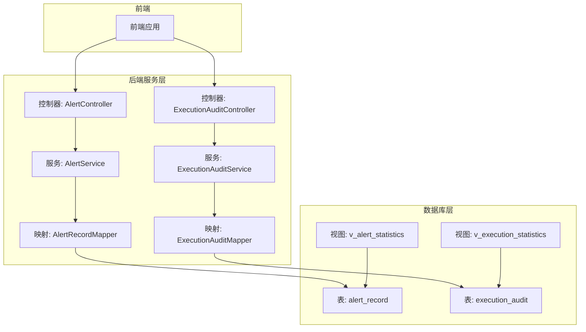
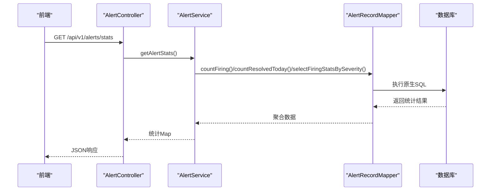
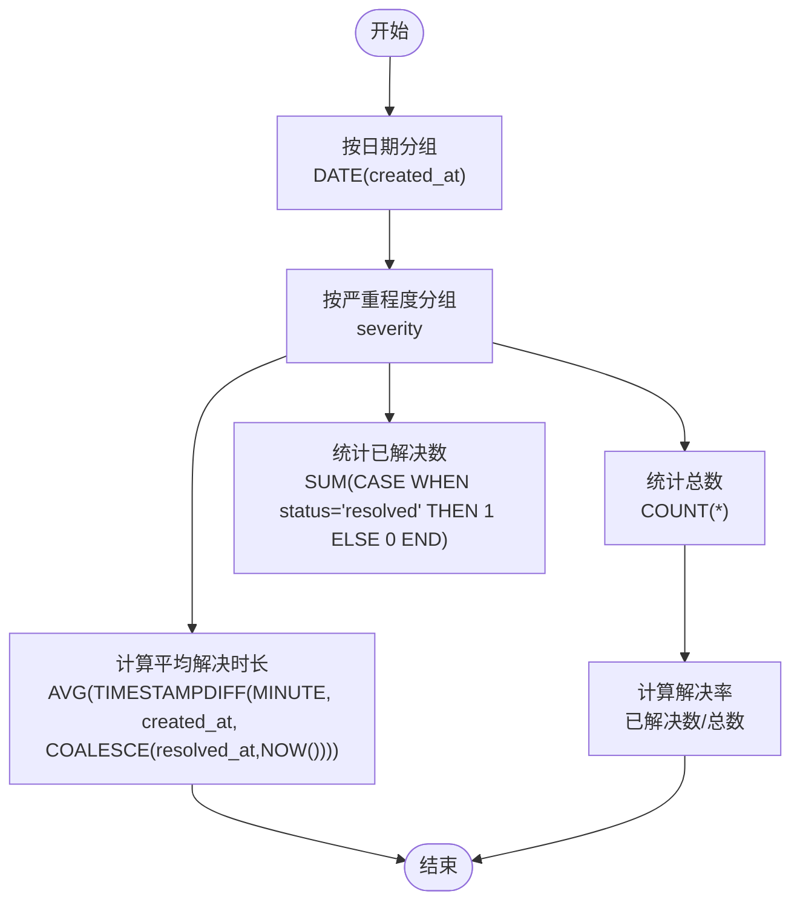
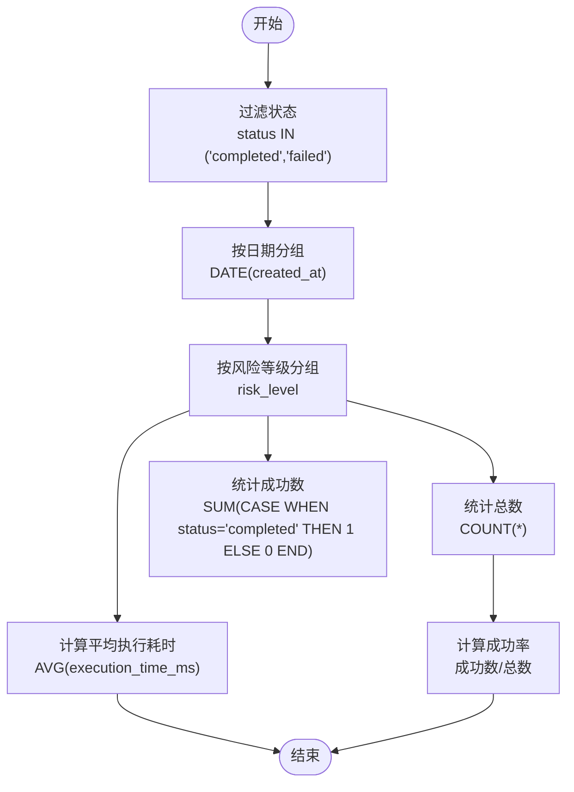
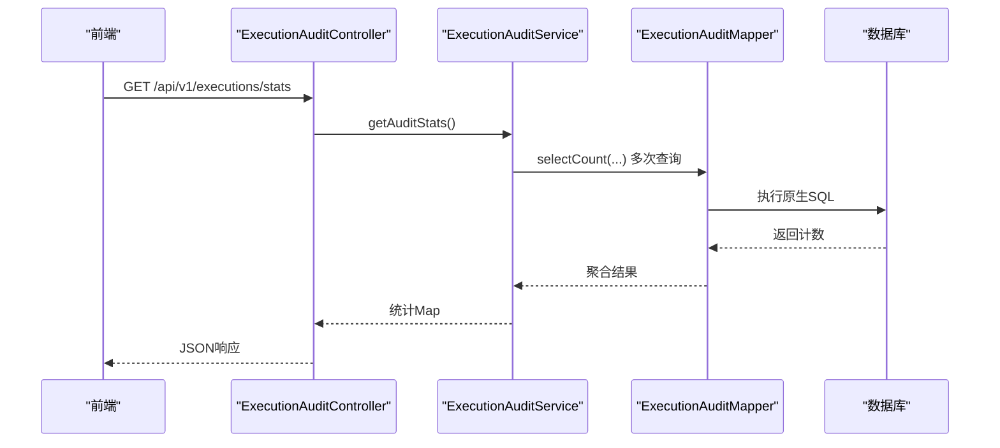
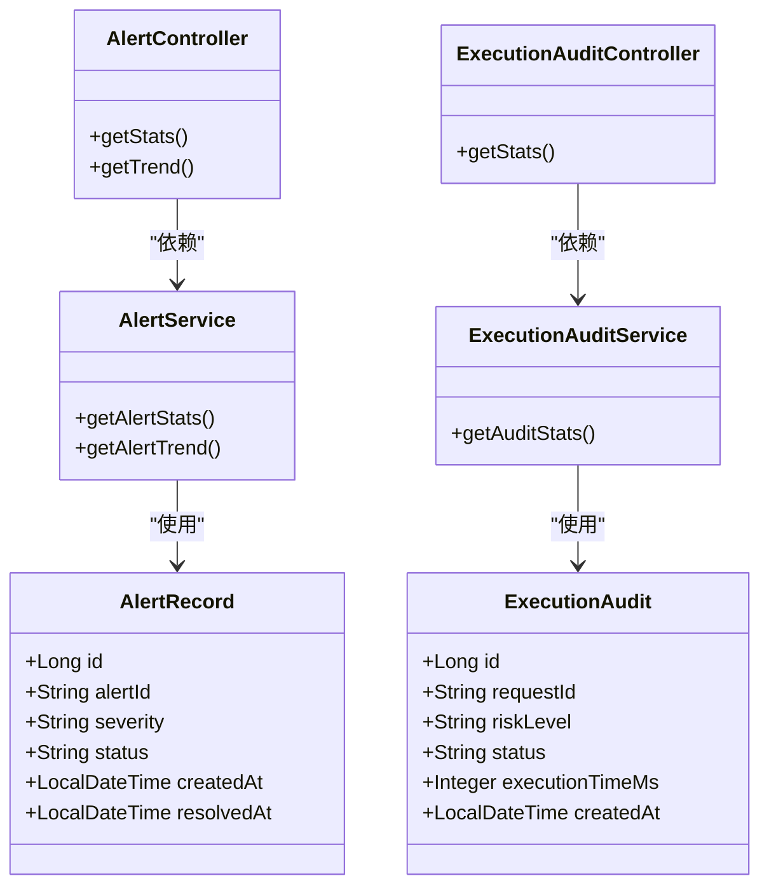

# 数据库视图与统计

<cite>
**本文档引用的文件**
- [init.sql](file://sql/init.sql)
- [AlertRecord.java](file://netdata-ai-backend/src/main/java/com/netdata/ops/entity/AlertRecord.java)
- [AlertRecordMapper.java](file://netdata-ai-backend/src/main/java/com/netdata/ops/mapper/AlertRecordMapper.java)
- [AlertService.java](file://netdata-ai-backend/src/main/java/com/netdata/ops/service/AlertService.java)
- [AlertController.java](file://netdata-ai-backend/src/main/java/com/netdata/ops/controller/AlertController.java)
- [ExecutionAudit.java](file://netdata-ai-backend/src/main/java/com/netdata/ops/entity/ExecutionAudit.java)
- [ExecutionAuditMapper.java](file://netdata-ai-backend/src/main/java/com/netdata/ops/mapper/ExecutionAuditMapper.java)
- [ExecutionAuditService.java](file://netdata-ai-backend/src/main/java/com/netdata/ops/service/ExecutionAuditService.java)
- [ExecutionAuditController.java](file://netdata-ai-backend/src/main/java/com/netdata/ops/controller/ExecutionAuditController.java)
</cite>

## 目录
1. [简介](#简介)
2. [项目结构](#项目结构)
3. [核心组件](#核心组件)
4. [架构总览](#架构总览)
5. [详细组件分析](#详细组件分析)
6. [依赖关系分析](#依赖关系分析)
7. [性能考虑](#性能考虑)
8. [故障排查指南](#故障排查指南)
9. [结论](#结论)
10. [附录](#附录)

## 简介
本文件围绕MySQL数据库中的两个关键统计视图展开：v_alert_statistics（告警统计视图）与 v_execution_statistics（执行统计视图）。文档将深入解析其查询逻辑、聚合口径、统计指标含义，并结合后端服务层与控制器层的调用方式，给出性能优化策略、数据一致性保障与刷新机制建议，以及在运营报表、趋势分析与容量规划中的典型应用场景。

## 项目结构
- 数据库初始化脚本位于 sql/init.sql，其中定义了 v_alert_statistics 与 v_execution_statistics 两个视图，以及相关的表结构与索引。
- 后端采用Spring Boot + MyBatis-Plus，实体类映射到对应表，服务层负责业务逻辑与统计口径，控制器层对外暴露REST接口。
- 前端通过API访问后端接口获取统计数据，用于可视化展示与报表生成。

图表来源
- [init.sql:248-273](file://sql/init.sql#L248-L273)
- [AlertController.java:87-98](file://netdata-ai-backend/src/main/java/com/netdata/ops/controller/AlertController.java#L87-L98)
- [ExecutionAuditController.java:72-77](file://netdata-ai-backend/src/main/java/com/netdata/ops/controller/ExecutionAuditController.java#L72-L77)
- [AlertService.java:154-170](file://netdata-ai-backend/src/main/java/com/netdata/ops/service/AlertService.java#L154-L170)
- [ExecutionAuditService.java:201-230](file://netdata-ai-backend/src/main/java/com/netdata/ops/service/ExecutionAuditService.java#L201-L230)

章节来源
- [init.sql:248-273](file://sql/init.sql#L248-L273)
- [AlertController.java:1-108](file://netdata-ai-backend/src/main/java/com/netdata/ops/controller/AlertController.java#L1-L108)
- [ExecutionAuditController.java:1-94](file://netdata-ai-backend/src/main/java/com/netdata/ops/controller/ExecutionAuditController.java#L1-L94)
- [AlertService.java:1-237](file://netdata-ai-backend/src/main/java/com/netdata/ops/service/AlertService.java#L1-L237)
- [ExecutionAuditService.java:1-297](file://netdata-ai-backend/src/main/java/com/netdata/ops/service/ExecutionAuditService.java#L1-L297)

## 核心组件
- v_alert_statistics（告警统计视图）
  - 按日期与严重程度分组，统计当日告警总数、已解决数与平均解决时长（分钟）。
  - 解决率 = 已解决数 / 总数；平均解决时间基于告警创建时间到解决时间（若未解决则到当前时间）。
- v_execution_statistics（执行统计视图）
  - 按日期与风险等级分组，统计当日执行总数、成功数与平均执行耗时（毫秒）。
  - 成功率 = 成功数 / 总数；平均执行时间仅对已完成或失败的记录计算。

章节来源
- [init.sql:248-273](file://sql/init.sql#L248-L273)

## 架构总览
后端通过控制器接收前端请求，服务层根据业务需求选择直接查询表或调用统计接口（当前实现主要针对告警趋势与概览统计使用原生SQL，执行统计通过服务层聚合），映射层负责与数据库交互，视图作为轻量统计工具供高频查询场景使用。

图表来源
- [AlertController.java:87-92](file://netdata-ai-backend/src/main/java/com/netdata/ops/controller/AlertController.java#L87-L92)
- [AlertService.java:154-170](file://netdata-ai-backend/src/main/java/com/netdata/ops/service/AlertService.java#L154-L170)
- [AlertRecordMapper.java:14-23](file://netdata-ai-backend/src/main/java/com/netdata/ops/mapper/AlertRecordMapper.java#L14-L23)

## 详细组件分析

### v_alert_statistics 告警统计视图
- 查询逻辑
  - 以创建日期（日期截断）与严重程度分组。
  - 聚合：
    - 总数：COUNT(*)
    - 已解决数：SUM(CASE WHEN status = 'resolved' THEN 1 ELSE 0 END)
    - 平均解决时长（分钟）：AVG(TIMESTAMPDIFF(MINUTE, created_at, COALESCE(resolved_at, NOW())))
  - 统计口径
    - 解决率 = 已解决数 / 总数
    - 平均解决时间 = 所有告警从创建到解决（或当前）的分钟数均值
- 典型业务应用
  - 运营日报：按严重程度分组的告警趋势与解决效率对比
  - SLA监控：跟踪关键业务系统的平均解决时间变化
  - 趋势分析：识别某类严重程度告警的爆发周期与恢复速度
- 性能与一致性
  - 建议在 created_at 上建立索引以加速日期分组与范围扫描
  - 若数据量极大，可考虑物化视图或分区表（按日期分区）以降低扫描成本
  - 视图本身不存储数据，查询时实时聚合，天然具备“近实时”特性

图表来源
- [init.sql:251-259](file://sql/init.sql#L251-L259)

章节来源
- [init.sql:248-259](file://sql/init.sql#L248-L259)

### v_execution_statistics 执行统计视图
- 查询逻辑
  - 以创建日期（日期截断）与风险等级分组。
  - 过滤条件：仅统计已完成或失败的执行记录，避免将“待执行/审批中”等状态纳入成功率与耗时计算。
  - 聚合：
    - 总数：COUNT(*)
    - 成功数：SUM(CASE WHEN status = 'completed' THEN 1 ELSE 0 END)
    - 平均执行耗时（毫秒）：AVG(execution_time_ms)
  - 统计口径
    - 成功率 = 成功数 / 总数
    - 平均执行时间 = 已完成/失败记录的平均耗时
- 典型业务应用
  - 运营报表：按风险等级统计执行成功率与平均耗时，识别高风险命令的稳定性问题
  - 容量规划：结合平均耗时与峰值并发，评估执行节点资源负载
  - 趋势分析：观察不同风险等级命令的成功率变化，指导策略调整（如提升审批门槛或引入自动批准）
- 性能与一致性
  - 建议在 created_at 与 risk_level 上建立复合索引，加速日期+风险维度的分组聚合
  - 对 execution_time_ms 建立索引有助于AVG计算的快速扫描
  - 视图同样为“近实时”，适合高频查询场景

图表来源
- [init.sql:264-273](file://sql/init.sql#L264-L273)

章节来源
- [init.sql:261-273](file://sql/init.sql#L261-L273)

### 后端服务与控制器中的统计调用
- 告警统计
  - 控制器：GET /api/v1/alerts/stats
  - 服务层：getAlertStats() 调用多个原生SQL统计方法（如按严重程度的“正在告警”分布、今日已解决数等）
  - 映射层：AlertRecordMapper 提供原生SQL查询
- 执行统计
  - 控制器：GET /api/v1/executions/stats
  - 服务层：getAuditStats() 聚合计数（待处理、已执行、已拒绝、失败、总数）与风险分布
  - 当前实现未直接使用 v_execution_statistics 视图，而是通过服务层聚合；若业务侧对性能要求较高，可考虑在服务层直接查询视图以减少复杂聚合

图表来源
- [ExecutionAuditController.java:72-77](file://netdata-ai-backend/src/main/java/com/netdata/ops/controller/ExecutionAuditController.java#L72-L77)
- [ExecutionAuditService.java:201-230](file://netdata-ai-backend/src/main/java/com/netdata/ops/service/ExecutionAuditService.java#L201-L230)
- [ExecutionAuditMapper.java:1-10](file://netdata-ai-backend/src/main/java/com/netdata/ops/mapper/ExecutionAuditMapper.java#L1-L10)

章节来源
- [AlertController.java:87-92](file://netdata-ai-backend/src/main/java/com/netdata/ops/controller/AlertController.java#L87-L92)
- [AlertService.java:154-170](file://netdata-ai-backend/src/main/java/com/netdata/ops/service/AlertService.java#L154-L170)
- [AlertRecordMapper.java:14-23](file://netdata-ai-backend/src/main/java/com/netdata/ops/mapper/AlertRecordMapper.java#L14-L23)
- [ExecutionAuditController.java:72-77](file://netdata-ai-backend/src/main/java/com/netdata/ops/controller/ExecutionAuditController.java#L72-L77)
- [ExecutionAuditService.java:201-230](file://netdata-ai-backend/src/main/java/com/netdata/ops/service/ExecutionAuditService.java#L201-L230)
- [ExecutionAuditMapper.java:1-10](file://netdata-ai-backend/src/main/java/com/netdata/ops/mapper/ExecutionAuditMapper.java#L1-L10)

## 依赖关系分析
- 实体类与表结构
  - AlertRecord 映射 alert_record 表，字段覆盖严重程度、状态、创建/解决时间等
  - ExecutionAudit 映射 execution_audit 表，字段覆盖风险等级、状态、执行耗时等
- 控制器与服务层
  - 控roller 仅负责参数校验与权限控制，具体统计逻辑在 service 层
  - service 层通过 Mapper 调用原生SQL或MyBatis-Plus条件构造器
- 视图与查询
  - v_alert_statistics 与 v_execution_statistics 作为统计视图，可被服务层直接查询以提升性能
  - 当前服务层对告警统计使用原生SQL，执行统计通过服务层聚合；未来可统一迁移到视图查询

图表来源
- [AlertRecord.java:11-55](file://netdata-ai-backend/src/main/java/com/netdata/ops/entity/AlertRecord.java#L11-L55)
- [ExecutionAudit.java:1-50](file://netdata-ai-backend/src/main/java/com/netdata/ops/entity/ExecutionAudit.java#L1-L50)
- [AlertController.java:87-98](file://netdata-ai-backend/src/main/java/com/netdata/ops/controller/AlertController.java#L87-L98)
- [ExecutionAuditController.java:72-77](file://netdata-ai-backend/src/main/java/com/netdata/ops/controller/ExecutionAuditController.java#L72-L77)
- [AlertService.java:154-202](file://netdata-ai-backend/src/main/java/com/netdata/ops/service/AlertService.java#L154-L202)
- [ExecutionAuditService.java:201-230](file://netdata-ai-backend/src/main/java/com/netdata/ops/service/ExecutionAuditService.java#L201-L230)

章节来源
- [AlertRecord.java:1-56](file://netdata-ai-backend/src/main/java/com/netdata/ops/entity/AlertRecord.java#L1-L56)
- [ExecutionAudit.java:1-50](file://netdata-ai-backend/src/main/java/com/netdata/ops/entity/ExecutionAudit.java#L1-L50)
- [AlertController.java:1-108](file://netdata-ai-backend/src/main/java/com/netdata/ops/controller/AlertController.java#L1-L108)
- [ExecutionAuditController.java:1-94](file://netdata-ai-backend/src/main/java/com/netdata/ops/controller/ExecutionAuditController.java#L1-L94)
- [AlertService.java:1-237](file://netdata-ai-backend/src/main/java/com/netdata/ops/service/AlertService.java#L1-L237)
- [ExecutionAuditService.java:1-297](file://netdata-ai-backend/src/main/java/com/netdata/ops/service/ExecutionAuditService.java#L1-L297)

## 性能考虑
- 视图与索引
  - 告警统计：在 alert_record.created_at 与 severity 上建立复合索引，提升按日期+严重程度分组的聚合性能
  - 执行统计：在 execution_audit.created_at 与 risk_level 上建立复合索引；同时确保 execution_time_ms 字段具备索引以优化AVG计算
- 物化视图与分区
  - 对于超大规模数据，建议将视图结果物化为独立统计表，定期（如每小时/每天）刷新，显著降低在线查询压力
  - 按日期对表进行分区（如按日/月），可进一步缩短扫描范围
- 查询计划优化
  - 使用 EXPLAIN 分析GROUP BY与WHERE条件的执行计划，确保索引被有效利用
  - 避免在WHERE子句中对列进行函数运算（如DATE(created_at)），尽量使用范围查询以命中索引
- 缓存策略
  - 对高频报表（如最近7天趋势）可引入Redis缓存，设置合理TTL，减少数据库压力

## 故障排查指南
- 视图查询慢
  - 检查索引是否存在且生效；确认WHERE/GROUP BY使用的列是否被索引覆盖
  - 使用 EXPLAIN 分析执行计划，关注是否发生全表扫描或临时表/文件排序
- 统计口径不一致
  - 确认告警视图与执行视图的过滤条件（如状态集合）是否符合业务约定
  - 对比服务层与视图层的统计口径，避免重复计算或遗漏
- 数据延迟
  - 视图为近实时，若业务对实时性要求极高，可考虑缩短物化刷新周期或采用事件驱动的增量更新
- 权限与接口调用
  - 确保控制器上的权限注解正确配置，避免越权访问导致统计结果为空或异常

## 结论
v_alert_statistics 与 v_execution_statistics 两个视图提供了高效的按日期与关键维度（严重程度/风险等级）的聚合统计能力。结合合理的索引、物化视图与查询计划优化，可在保证数据一致性的同时显著提升报表与趋势分析的性能。建议在现有服务层统计基础上逐步引入视图查询，统一统计口径并提升整体系统稳定性与可维护性。

## 附录
- 业务应用场景
  - 运营报表：每日/每周告警解决率与执行成功率报表
  - 趋势分析：按严重程度/风险等级的趋势变化，辅助策略迭代
  - 容量规划：基于平均执行耗时与并发量评估资源需求
- 刷新机制与一致性
  - 可采用定时任务（如每小时）将视图结果写入物化统计表，前端轮询最新统计
  - 通过事务与幂等设计保证刷新过程的数据一致性，避免脏读与重复统计
- 统计口径标准化
  - 明确“已解决”“已完成/失败”的判定标准，统一字段命名与单位（分钟/毫秒）
  - 在接口文档中明确返回字段含义与计算公式，便于前后端协作与审计