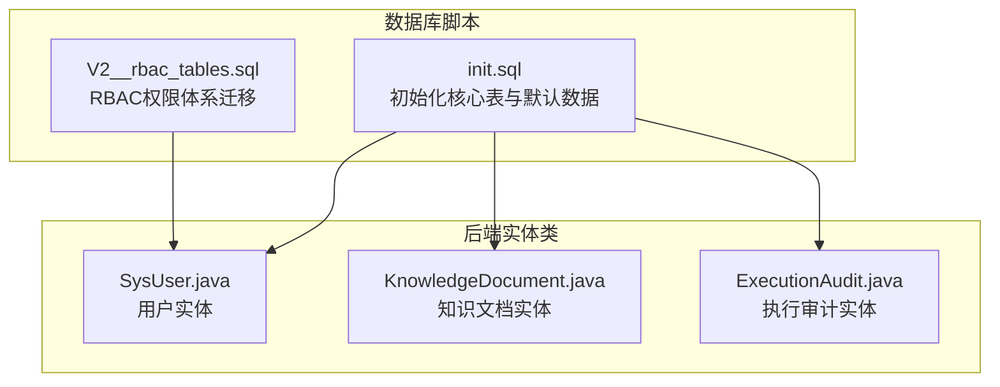
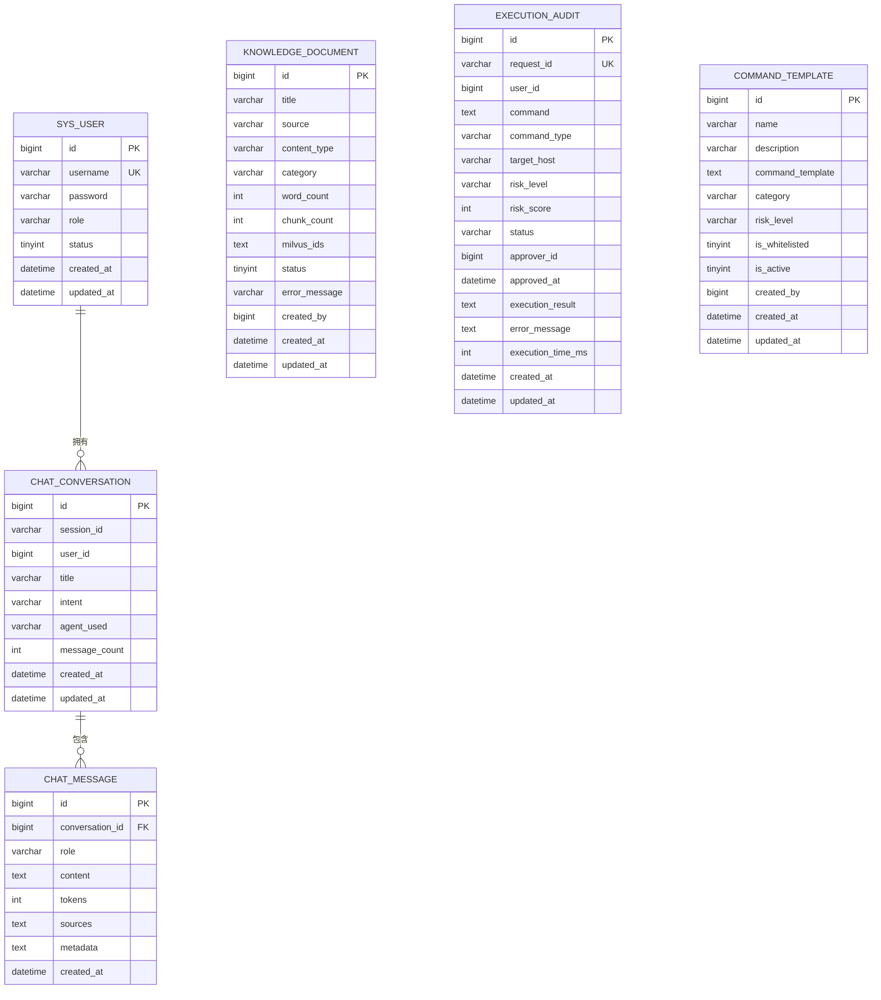
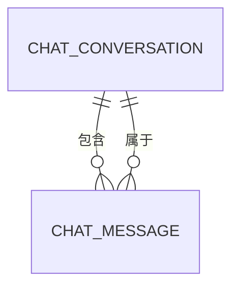
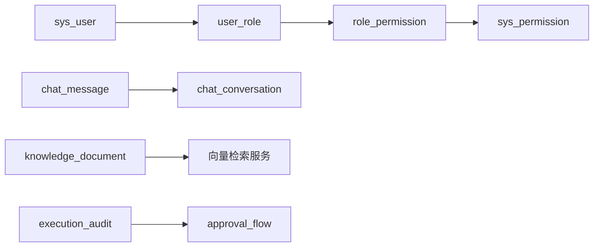

# 核心业务表结构

<cite>
**本文档引用的文件**
- [init.sql](file://sql/init.sql)
- [V2__rbac_tables.sql](file://sql/V2__rbac_tables.sql)
- [SysUser.java](file://netdata-ai-backend/src/main/java/com/netdata/ops/entity/SysUser.java)
- [KnowledgeDocument.java](file://netdata-ai-backend/src/main/java/com/netdata/ops/entity/KnowledgeDocument.java)
- [ExecutionAudit.java](file://netdata-ai-backend/src/main/java/com/netdata/ops/entity/ExecutionAudit.java)
</cite>

## 目录
1. [简介](#简介)
2. [项目结构](#项目结构)
3. [核心组件](#核心组件)
4. [架构总览](#架构总览)
5. [详细组件分析](#详细组件分析)
6. [依赖分析](#依赖分析)
7. [性能考虑](#性能考虑)
8. [故障排查指南](#故障排查指南)
9. [结论](#结论)

## 简介
本文件聚焦于MySQL数据库中的核心业务表结构，围绕以下主题展开：
- sys_user 用户表：认证字段、角色权限字段、状态管理字段与时间戳字段的设计理念
- knowledge_document 知识文档表：文档元数据、处理状态与向量化ID管理
- chat_conversation 与 chat_message 对话历史与消息表：一对多关系、外键约束与级联删除
- execution_audit 命令执行审计表：风险评估、状态跟踪与性能监控字段
- command_template 命令模板表：模板化设计与变量替换机制
- 各表索引策略、性能优化建议与典型查询场景

## 项目结构
核心表结构由初始化SQL脚本定义，并在后续版本中通过迁移脚本扩展了RBAC权限体系。后端实体类映射了关键表的字段与注解，便于ORM层的统一管理。

**图表来源**
- [init.sql:1-274](file://sql/init.sql#L1-L274)
- [V2__rbac_tables.sql:1-256](file://sql/V2__rbac_tables.sql#L1-L256)
- [SysUser.java:1-57](file://netdata-ai-backend/src/main/java/com/netdata/ops/entity/SysUser.java#L1-L57)
- [KnowledgeDocument.java:1-47](file://netdata-ai-backend/src/main/java/com/netdata/ops/entity/KnowledgeDocument.java#L1-L47)
- [ExecutionAudit.java:1-54](file://netdata-ai-backend/src/main/java/com/netdata/ops/entity/ExecutionAudit.java#L1-L54)

**章节来源**
- [init.sql:1-274](file://sql/init.sql#L1-L274)
- [V2__rbac_tables.sql:1-256](file://sql/V2__rbac_tables.sql#L1-L256)

## 核心组件
- sys_user 用户表：承载用户认证与安全控制字段，支持角色兼容与逻辑删除
- knowledge_document 知识文档表：记录文档元数据、处理状态与向量化ID集合
- chat_conversation 与 chat_message 对话表：以会话为中心的历史与消息存储，具备级联删除
- execution_audit 命令执行审计表：记录命令执行全生命周期的风险与性能指标
- command_template 命令模板表：模板化命令与变量替换，支持风险等级与白名单控制

**章节来源**
- [init.sql:25-41](file://sql/init.sql#L25-L41)
- [init.sql:51-70](file://sql/init.sql#L51-L70)
- [init.sql:75-109](file://sql/init.sql#L75-L109)
- [init.sql:114-138](file://sql/init.sql#L114-L138)
- [init.sql:143-159](file://sql/init.sql#L143-L159)

## 架构总览
下图展示了核心业务表之间的关系与关键字段映射，体现用户、知识、对话与执行审计的业务闭环。

**图表来源**
- [init.sql:25-41](file://sql/init.sql#L25-L41)
- [init.sql:51-70](file://sql/init.sql#L51-L70)
- [init.sql:75-109](file://sql/init.sql#L75-L109)
- [init.sql:114-138](file://sql/init.sql#L114-L138)
- [init.sql:143-159](file://sql/init.sql#L143-L159)

## 详细组件分析

### sys_user 用户表
- 设计要点
  - 认证字段：username（唯一索引）、password（BCrypt加密）
  - 角色权限字段：role（兼容保留），配合RBAC迁移脚本逐步替换为user_role关联表
  - 状态管理字段：status（0禁用/1启用），新增last_login_at、last_login_ip、login_fail_count、locked_until等安全控制字段
  - 时间戳字段：created_at、updated_at，支持自动更新
  - 逻辑删除：deleted字段用于软删除
- 字段映射与注解
  - 实体类中对应字段与填充策略，确保createdAt/updatedAt自动维护
- 典型查询场景
  - 登录校验：按username精确匹配
  - 权限查询：结合user_role与role_permission进行权限树构建
  - 账户安全：按last_login_at与locked_until进行登录限制
- 性能优化建议
  - 为username建立唯一索引；为role/status建立普通索引
  - 登录失败计数与锁定时间应配合应用层策略使用，避免频繁扫描

**章节来源**
- [init.sql:25-41](file://sql/init.sql#L25-L41)
- [V2__rbac_tables.sql:20-34](file://sql/V2__rbac_tables.sql#L20-L34)
- [SysUser.java:11-56](file://netdata-ai-backend/src/main/java/com/netdata/ops/entity/SysUser.java#L11-L56)

### knowledge_document 知识文档表
- 设计要点
  - 文档元数据：title、source（全文检索/定位）、content_type、category
  - 处理状态：status（0处理中/1已入库/2失败），error_message用于错误记录
  - 向量化ID管理：milvus_ids以JSON文本存储多个向量ID，支撑RAG检索
  - 统计信息：word_count、chunk_count
  - 时间戳与归属：created_by、created_at、updated_at
- 字段映射与注解
  - 实体类中对应字段，时间字段采用MyBatis Plus自动填充
- 典型查询场景
  - 按source精确匹配或前缀匹配；按category过滤；按status筛选处理结果
  - 分页查询与统计：结合created_at与category进行分页与聚合
- 性能优化建议
  - 为source建立前缀索引；为category/status建立复合索引
  - milvus_ids作为JSON存储，查询时避免全表解析，建议在应用层缓存与批量处理

**章节来源**
- [init.sql:51-70](file://sql/init.sql#L51-L70)
- [KnowledgeDocument.java:11-46](file://netdata-ai-backend/src/main/java/com/netdata/ops/entity/KnowledgeDocument.java#L11-L46)

### chat_conversation 与 chat_message 对话表
- 设计要点
  - 一对多关系：chat_conversation为父表，chat_message为子表
  - 外键约束：chat_message.conversation_id -> chat_conversation.id
  - 级联删除：ON DELETE CASCADE，删除会话时自动删除其消息
  - 会话标识：session_id用于前端会话管理；user_id关联用户
  - 消息属性：role（user/assistant/system）、content、tokens、sources、metadata
- 关系图

**图表来源**
- [init.sql:75-109](file://sql/init.sql#L75-L109)

- 典型查询场景
  - 获取某用户的最近会话列表：按user_id与created_at倒序
  - 查询某会话的所有消息：按conversation_id与created_at排序
  - 删除会话：触发级联删除，保证数据一致性
- 性能优化建议
  - 为session_id建立索引；为conversation_id建立索引
  - created_at建立索引以支持时间范围查询

**章节来源**
- [init.sql:75-109](file://sql/init.sql#L75-L109)

### execution_audit 命令执行审计表
- 设计要点
  - 请求与执行：request_id（唯一）、user_id、command、command_type、target_host
  - 风险评估：risk_level（low/medium/high/critical）、risk_score（1-100）
  - 状态跟踪：status（pending/approved/rejected/executing/completed/failed）
  - 审批与结果：approver_id、approved_at、execution_result、error_message
  - 性能监控：execution_time_ms
  - 时间戳：created_at、updated_at
- 字段映射与注解
  - 实体类中对应字段，时间字段采用自动填充
- 典型查询场景
  - 按用户查询执行历史：按user_id与created_at分页
  - 按风险等级与状态统计：支持仪表板与报表
  - 按执行耗时排序：识别慢查询与异常执行
- 性能优化建议
  - 为request_id建立唯一索引；为user_id/status/risk_level建立索引
  - created_at建立索引以支持时间序列分析

**章节来源**
- [init.sql:114-138](file://sql/init.sql#L114-L138)
- [ExecutionAudit.java:11-53](file://netdata-ai-backend/src/main/java/com/netdata/ops/entity/ExecutionAudit.java#L11-L53)

### command_template 命令模板表
- 设计要点
  - 模板化设计：command_template字段支持变量占位符（如{{var}}）
  - 变量替换机制：后端在执行前进行变量注入与校验
  - 风险控制：risk_level（默认medium）、is_whitelisted（白名单）
  - 生命周期：category、is_active、created_by、created_at、updated_at
- 典型查询场景
  - 按分类与风险等级筛选模板
  - 按名称或描述模糊匹配模板
  - 白名单快速通道：优先选择is_whitelisted=1的模板
- 性能优化建议
  - 为category/is_whitelisted建立索引
  - 模板内容较大时，注意查询时的字段选择与缓存

**章节来源**
- [init.sql:143-159](file://sql/init.sql#L143-L159)

## 依赖分析
- 表间依赖
  - chat_message 外键依赖 chat_conversation
  - sys_user 与 RBAC表（sys_role、sys_permission、user_role、role_permission）共同构成权限模型
- 字段依赖
  - sys_user 的role字段与user_role表形成角色继承与权限映射
  - knowledge_document 的milvus_ids与向量检索服务耦合
  - execution_audit 的request_id与审批流程表（approval_flow）协同

**图表来源**
- [init.sql:75-109](file://sql/init.sql#L75-L109)
- [V2__rbac_tables.sql:38-105](file://sql/V2__rbac_tables.sql#L38-L105)

**章节来源**
- [init.sql:75-109](file://sql/init.sql#L75-L109)
- [V2__rbac_tables.sql:38-105](file://sql/V2__rbac_tables.sql#L38-L105)

## 性能考虑
- 索引策略
  - sys_user：uk_username、idx_role、idx_status
  - knowledge_document：idx_source、idx_category、idx_status
  - chat_conversation：idx_session_id、idx_user_id、idx_created_at
  - chat_message：idx_conversation_id、idx_created_at
  - execution_audit：uk_request_id、idx_user_id、idx_status、idx_risk_level、idx_created_at
  - command_template：idx_category、idx_is_whitelisted
- 查询优化建议
  - 使用覆盖索引减少回表
  - 对高频过滤字段（status、risk_level、category）建立复合索引
  - 对时间字段建立索引，支持时间窗口查询
- 存储与归档
  - 对历史审计与对话消息定期归档，降低热数据压力
  - 对大字段（content、command、execution_result）进行压缩或外部存储

[本节为通用性能指导，无需特定文件引用]

## 故障排查指南
- 登录失败与账户锁定
  - 检查login_fail_count与locked_until字段，确认是否触发锁定
  - 核对last_login_at与last_login_ip，排查异常登录
- 知识文档入库异常
  - 查看status与error_message字段，定位处理阶段与错误原因
  - 检查milvus_ids是否为空或格式异常
- 对话数据不一致
  - 确认chat_message的外键约束与级联删除是否生效
  - 检查conversation_id是否存在且有效
- 命令执行审计异常
  - 根据status与error_message判断执行阶段与失败原因
  - 结合execution_time_ms识别性能瓶颈
- 模板变量替换失败
  - 核对command_template中的变量占位符是否完整
  - 检查变量注入逻辑与必填项校验

**章节来源**
- [init.sql:25-41](file://sql/init.sql#L25-L41)
- [init.sql:51-70](file://sql/init.sql#L51-L70)
- [init.sql:75-109](file://sql/init.sql#L75-L109)
- [init.sql:114-138](file://sql/init.sql#L114-L138)
- [init.sql:143-159](file://sql/init.sql#L143-L159)

## 结论
本文档基于初始化与迁移脚本，系统梳理了核心业务表的字段设计、关系模型与性能优化策略。通过合理的索引与查询设计，结合RBAC权限体系与审计追踪，可有效支撑系统的认证、知识管理、对话交互与命令执行等关键能力。建议在生产环境中持续监控关键指标（如执行耗时、处理状态分布），并根据业务增长迭代索引与归档策略。