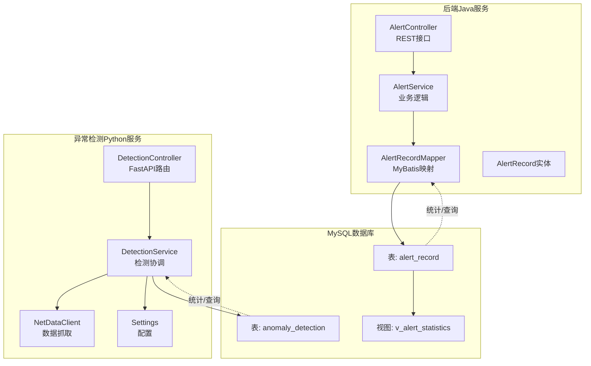
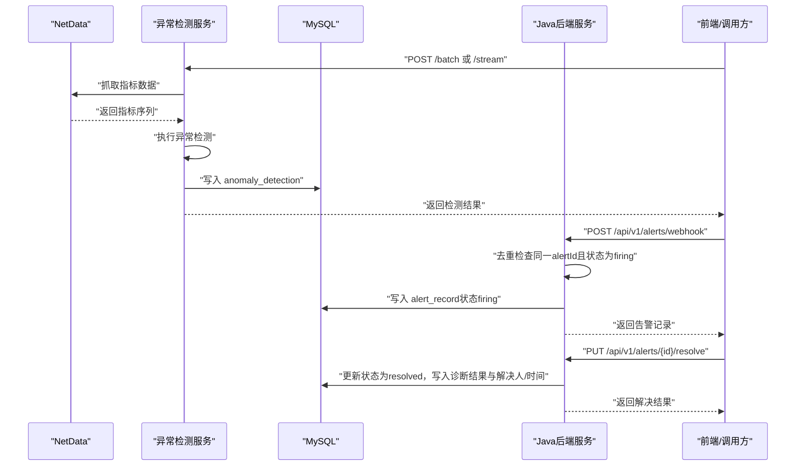
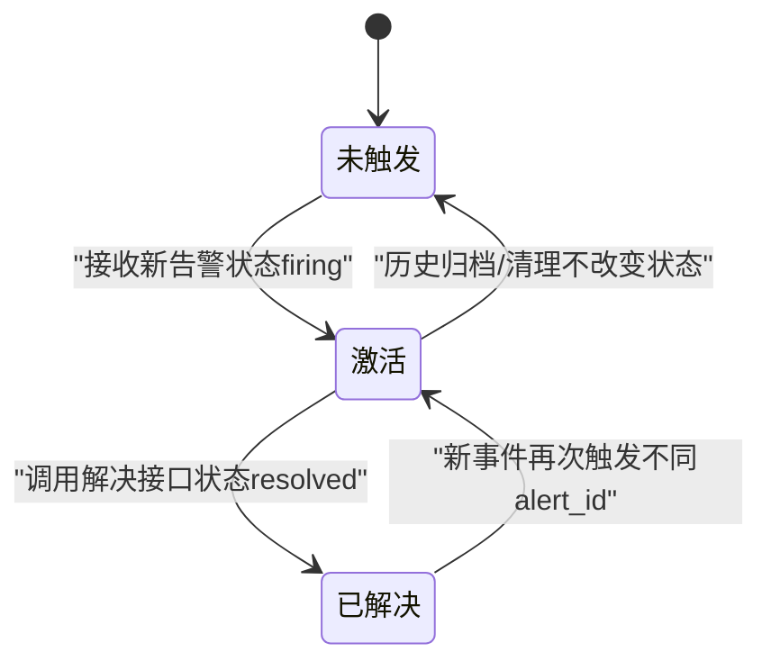
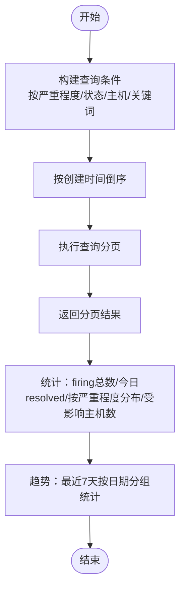
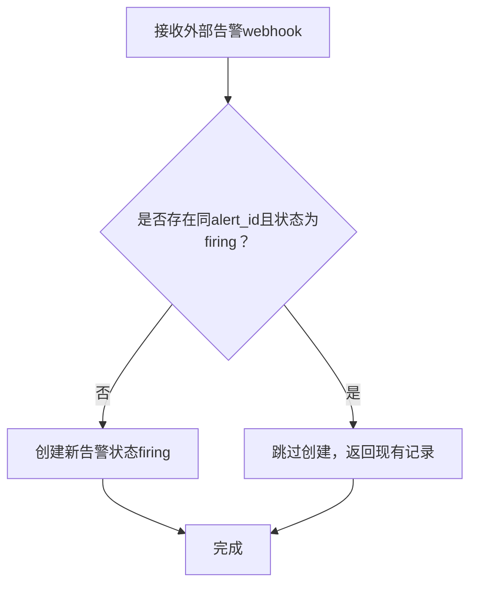
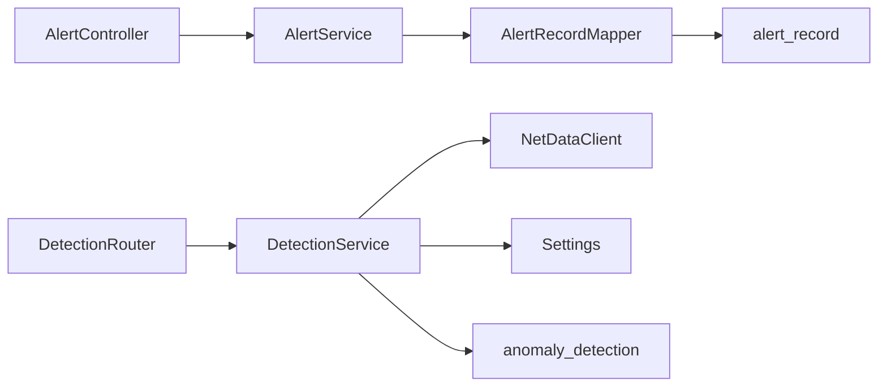

# 监控告警表设计

<cite>
**本文引用的文件**
- [AlertRecord.java](file://netdata-ai-backend/src/main/java/com/netdata/ops/entity/AlertRecord.java)
- [AlertRecordMapper.java](file://netdata-ai-backend/src/main/java/com/netdata/ops/mapper/AlertRecordMapper.java)
- [AlertService.java](file://netdata-ai-backend/src/main/java/com/netdata/ops/service/AlertService.java)
- [AlertController.java](file://netdata-ai-backend/src/main/java/com/netdata/ops/controller/AlertController.java)
- [init.sql](file://sql/init.sql)
- [application.yml](file://netdata-ai-backend/src/main/resources/application.yml)
- [schemas.py](file://anomaly-detection-service/app/models/schemas.py)
- [detection.py](file://anomaly-detection-service/app/api/routes/detection.py)
- [detection_service.py](file://anomaly-detection-service/app/services/detection_service.py)
- [config.py](file://anomaly-detection-service/app/config.py)
- [client.py](file://anomaly-detection-service/app/netdata/client.py)
</cite>

## 目录
1. [简介](#简介)
2. [项目结构](#项目结构)
3. [核心组件](#核心组件)
4. [架构总览](#架构总览)
5. [详细组件分析](#详细组件分析)
6. [依赖关系分析](#依赖关系分析)
7. [性能考虑](#性能考虑)
8. [故障排查指南](#故障排查指南)
9. [结论](#结论)

## 简介
本文聚焦于MySQL数据库中监控告警相关的两张核心表：告警记录表（alert_record）与异常检测结果表（anomaly_detection），并结合后端服务实现，系统性阐述字段设计、状态管理、存储策略、查询优化与历史归档、阈值与触发条件配置、以及告警去重机制。同时，补充异常检测服务如何产生异常检测结果，并与告警系统联动的流程说明。

## 项目结构
该系统由两部分组成：
- 后端Java服务（netdata-ai-backend）：负责告警记录的接收、存储、查询、状态变更与统计分析。
- 异常检测Python服务（anomaly-detection-service）：负责基于NetData指标数据的异常检测，输出异常分数与等级，并可将结果写入MySQL。

**图表来源**
- [AlertController.java:19-107](file://netdata-ai-backend/src/main/java/com/netdata/ops/controller/AlertController.java#L19-L107)
- [AlertService.java:27-236](file://netdata-ai-backend/src/main/java/com/netdata/ops/service/AlertService.java#L27-L236)
- [AlertRecordMapper.java:12-24](file://netdata-ai-backend/src/main/java/com/netdata/ops/mapper/AlertRecordMapper.java#L12-L24)
- [AlertRecord.java:13-55](file://netdata-ai-backend/src/main/java/com/netdata/ops/entity/AlertRecord.java#L13-L55)
- [detection.py:52-378](file://anomaly-detection-service/app/api/routes/detection.py#L52-L378)
- [detection_service.py:37-334](file://anomaly-detection-service/app/services/detection_service.py#L37-L334)
- [client.py:30-301](file://anomaly-detection-service/app/netdata/client.py#L30-L301)
- [init.sql:173-274](file://sql/init.sql#L173-L274)

**章节来源**
- [AlertController.java:19-107](file://netdata-ai-backend/src/main/java/com/netdata/ops/controller/AlertController.java#L19-L107)
- [AlertService.java:27-236](file://netdata-ai-backend/src/main/java/com/netdata/ops/service/AlertService.java#L27-L236)
- [AlertRecordMapper.java:12-24](file://netdata-ai-backend/src/main/java/com/netdata/ops/mapper/AlertRecordMapper.java#L12-L24)
- [AlertRecord.java:13-55](file://netdata-ai-backend/src/main/java/com/netdata/ops/entity/AlertRecord.java#L13-L55)
- [detection.py:52-378](file://anomaly-detection-service/app/api/routes/detection.py#L52-L378)
- [detection_service.py:37-334](file://anomaly-detection-service/app/services/detection_service.py#L37-L334)
- [client.py:30-301](file://anomaly-detection-service/app/netdata/client.py#L30-L301)
- [init.sql:173-274](file://sql/init.sql#L173-L274)

## 核心组件
- 告警记录表（alert_record）
  - 字段涵盖告警标识、来源、严重程度、指标信息、阈值、状态、诊断结果、解决人与时间等。
  - 提供按严重程度、状态、创建时间等维度的索引，支撑高频查询与统计。
- 异常检测结果表（anomaly_detection）
  - 字段包含主机、指标名称、指标值、异常分数、是否异常、检测器类型、检测时间等。
  - 提供按主机、指标名、是否异常、检测时间的索引，便于异常趋势与定位分析。
- Java后端服务
  - 控制器提供分页查询、详情、解决、统计、趋势、触发AI诊断等接口。
  - 服务层实现去重、状态变更、批量解决、统计聚合与趋势计算。
  - Mapper提供按严重程度与状态的统计查询。
- Python异常检测服务
  - 提供批量/流式检测、训练、从NetData抓取数据并检测等能力。
  - 将检测结果写入MySQL的anomaly_detection表。

**章节来源**
- [AlertRecord.java:13-55](file://netdata-ai-backend/src/main/java/com/netdata/ops/entity/AlertRecord.java#L13-L55)
- [AlertRecordMapper.java:12-24](file://netdata-ai-backend/src/main/java/com/netdata/ops/mapper/AlertRecordMapper.java#L12-L24)
- [AlertService.java:27-236](file://netdata-ai-backend/src/main/java/com/netdata/ops/service/AlertService.java#L27-L236)
- [AlertController.java:19-107](file://netdata-ai-backend/src/main/java/com/netdata/ops/controller/AlertController.java#L19-L107)
- [init.sql:173-217](file://sql/init.sql#L173-L217)
- [detection.py:52-378](file://anomaly-detection-service/app/api/routes/detection.py#L52-L378)
- [detection_service.py:37-334](file://anomaly-detection-service/app/services/detection_service.py#L37-L334)

## 架构总览
下图展示告警数据从异常检测服务到MySQL，再到Java后端服务的流转过程，以及状态管理的关键节点。

**图表来源**
- [detection.py:52-378](file://anomaly-detection-service/app/api/routes/detection.py#L52-L378)
- [client.py:138-198](file://anomaly-detection-service/app/netdata/client.py#L138-L198)
- [detection_service.py:76-152](file://anomaly-detection-service/app/services/detection_service.py#L76-L152)
- [AlertController.java:69-85](file://netdata-ai-backend/src/main/java/com/netdata/ops/controller/AlertController.java#L69-L85)
- [AlertService.java:94-128](file://netdata-ai-backend/src/main/java/com/netdata/ops/service/AlertService.java#L94-L128)
- [AlertService.java:70-92](file://netdata-ai-backend/src/main/java/com/netdata/ops/service/AlertService.java#L70-L92)

## 详细组件分析

### 告警记录表（alert_record）字段设计
- 主键与唯一标识
  - id：自增主键；alert_id：唯一标识，用于去重判断。
- 基本信息
  - source：告警来源，默认“netdata”。
  - severity：严重程度，取值“info/warning/critical”。
  - alert_name/message：告警名称与消息文本。
  - host：告警主机。
- 指标与阈值
  - metric_name/metric_value/threshold：指标名称、指标值、阈值。
- 状态与诊断
  - status：状态，取值“firing/resolved”，默认“firing”。
  - diagnosis_result：诊断结果（JSON字符串，用于存放AI诊断内容）。
- 解决信息
  - resolved_by/resolved_at：解决人ID与解决时间。
- 时间戳
  - created_at/updated_at：创建与更新时间，自动填充。

字段设计要点
- 唯一键：uk_alert_id确保同一告警在系统中的唯一性，便于去重。
- 索引：idx_severity、idx_status、idx_created_at支持高频查询与统计。
- 存储：诊断结果采用TEXT类型，便于存放结构化JSON。

**章节来源**
- [AlertRecord.java:13-55](file://netdata-ai-backend/src/main/java/com/netdata/ops/entity/AlertRecord.java#L13-L55)
- [init.sql:173-196](file://sql/init.sql#L173-L196)

### 异常检测结果表（anomaly_detection）字段定义
- 主键与标识
  - id：自增主键。
- 主机与指标
  - host：主机名或IP。
  - metric_name：指标名称。
  - metric_value：指标值（数值型）。
- 检测结果
  - anomaly_score：异常分数（0-1之间，越大越异常）。
  - is_anomaly：布尔型，指示是否异常。
  - detector_type：检测器类型（如 isolation_forest、half_space_trees 等）。
- 时间戳
  - detection_time：检测时间；created_at：入库时间。

字段设计要点
- 索引：idx_host、idx_metric_name、idx_is_anomaly、idx_detection_time，支撑异常趋势与定位分析。
- 数据类型：anomaly_score与metric_value采用DOUBLE，便于统计与排序。

**章节来源**
- [schemas.py:219-236](file://anomaly-detection-service/app/models/schemas.py#L219-L236)
- [init.sql:199-217](file://sql/init.sql#L199-L217)

### 告警状态管理机制（firing 与 resolved）
- 状态含义
  - firing：告警处于激活状态，尚未解决。
  - resolved：告警已被确认并解决。
- 状态转换
  - 创建告警：默认状态为firing。
  - 解决告警：通过PUT /api/v1/alerts/{id}/resolve将状态更新为resolved，并写入诊断结果、解决人与解决时间。
- 去重策略
  - 当同一alert_id且状态为firing的记录已存在时，不再重复创建，避免重复告警风暴。

**图表来源**
- [AlertService.java:94-128](file://netdata-ai-backend/src/main/java/com/netdata/ops/service/AlertService.java#L94-L128)
- [AlertService.java:70-92](file://netdata-ai-backend/src/main/java/com/netdata/ops/service/AlertService.java#L70-L92)

**章节来源**
- [AlertService.java:94-128](file://netdata-ai-backend/src/main/java/com/netdata/ops/service/AlertService.java#L94-L128)
- [AlertService.java:70-92](file://netdata-ai-backend/src/main/java/com/netdata/ops/service/AlertService.java#L70-L92)

### 告警数据存储策略与查询优化
- 存储策略
  - 表结构：使用InnoDB引擎，UTF8MB4字符集，支持TEXT类型字段。
  - 索引：为高频查询字段建立索引，减少全表扫描。
  - 视图：提供v_alert_statistics视图，按日期与严重程度聚合统计，便于报表与看板。
- 查询优化
  - 分页查询：按创建时间倒序，支持按严重程度、状态、主机、关键词过滤。
  - 统计查询：提供按严重程度分组的firing统计、当日resolved计数、受影响主机数等。
  - 趋势分析：按最近7天日期分组统计各类别告警数量，支持折线图展示。

**图表来源**
- [AlertService.java:34-57](file://netdata-ai-backend/src/main/java/com/netdata/ops/service/AlertService.java#L34-L57)
- [AlertRecordMapper.java:14-23](file://netdata-ai-backend/src/main/java/com/netdata/ops/mapper/AlertRecordMapper.java#L14-L23)

**章节来源**
- [AlertService.java:34-57](file://netdata-ai-backend/src/main/java/com/netdata/ops/service/AlertService.java#L34-L57)
- [AlertRecordMapper.java:14-23](file://netdata-ai-backend/src/main/java/com/netdata/ops/mapper/AlertRecordMapper.java#L14-L23)

### 历史数据归档机制
- 归档策略
  - 可基于时间维度（如保留最近90天）定期归档至冷存储或压缩表，释放热表空间。
  - 归档前建议导出统计视图（v_alert_statistics）以保留历史趋势。
- 影响与建议
  - 归档不影响当前活跃告警（firing）状态，仅影响历史查询与报表。
  - 建议保留诊断结果与解决记录，以便事后分析。

[本节为通用建议，无需具体文件引用]

### 告警触发条件配置、阈值管理与去重机制
- 触发条件与阈值
  - 异常检测服务内部配置异常分数阈值（anomaly_threshold）与告警阈值（alert_threshold），用于判定异常等级与是否触发告警。
  - 批量/流式检测接口支持传入自定义阈值，若未传入则使用默认配置。
- 阈值管理
  - 配置集中于Python服务的Settings，支持环境变量覆盖，便于在不同环境（开发/生产）灵活调整。
- 去重机制
  - Java后端在接收外部告警时，若同一alert_id且状态为firing的记录已存在，则跳过重复创建，避免重复告警风暴。

**图表来源**
- [AlertService.java:94-128](file://netdata-ai-backend/src/main/java/com/netdata/ops/service/AlertService.java#L94-L128)

**章节来源**
- [config.py:132-137](file://anomaly-detection-service/app/config.py#L132-L137)
- [detection.py:110-117](file://anomaly-detection-service/app/api/routes/detection.py#L110-L117)
- [AlertService.java:94-128](file://netdata-ai-backend/src/main/java/com/netdata/ops/service/AlertService.java#L94-L128)

## 依赖关系分析
- Java后端
  - AlertController依赖AlertService；AlertService依赖AlertRecordMapper；AlertRecordMapper依赖MySQL表alert_record。
- Python异常检测
  - detection.py路由依赖DetectionService；DetectionService依赖NetDataClient与配置；最终将结果写入MySQL表anomaly_detection。
- 数据库
  - init.sql定义表结构与索引；v_alert_statistics视图用于统计分析。

**图表来源**
- [AlertController.java:25-26](file://netdata-ai-backend/src/main/java/com/netdata/ops/controller/AlertController.java#L25-L26)
- [AlertService.java](file://netdata-ai-backend/src/main/java/com/netdata/ops/service/AlertService.java#L29)
- [AlertRecordMapper.java:12-24](file://netdata-ai-backend/src/main/java/com/netdata/ops/mapper/AlertRecordMapper.java#L12-L24)
- [detection.py:42-49](file://anomaly-detection-service/app/api/routes/detection.py#L42-L49)
- [detection_service.py:57-74](file://anomaly-detection-service/app/services/detection_service.py#L57-L74)
- [client.py:44-64](file://anomaly-detection-service/app/netdata/client.py#L44-L64)

**章节来源**
- [AlertController.java:25-26](file://netdata-ai-backend/src/main/java/com/netdata/ops/controller/AlertController.java#L25-L26)
- [AlertService.java](file://netdata-ai-backend/src/main/java/com/netdata/ops/service/AlertService.java#L29)
- [AlertRecordMapper.java:12-24](file://netdata-ai-backend/src/main/java/com/netdata/ops/mapper/AlertRecordMapper.java#L12-L24)
- [detection.py:42-49](file://anomaly-detection-service/app/api/routes/detection.py#L42-L49)
- [detection_service.py:57-74](file://anomaly-detection-service/app/services/detection_service.py#L57-L74)
- [client.py:44-64](file://anomaly-detection-service/app/netdata/client.py#L44-L64)

## 性能考虑
- 索引与分区
  - 建议在created_at上建立索引以支持时间范围查询；对于超大数据量，可考虑按月分区。
- 批量写入
  - 异常检测服务支持批量检测与批量写入，减少网络往返与事务开销。
- 缓存与限流
  - Java后端可通过Redis缓存热点统计结果；配合Spring Security与RateLimit拦截器控制访问频率。
- 查询优化
  - 使用分页与条件过滤，避免一次性返回大量数据；统计查询尽量走索引与视图。

[本节提供通用指导，无需具体文件引用]

## 故障排查指南
- 告警未入库或重复
  - 检查alert_id是否唯一；确认是否已有状态为firing的同alert_id记录。
  - 关注后端日志中的“告警已存在，跳过”提示。
- 解决告警失败
  - 确认告警状态是否已是resolved；检查解决接口的请求体是否包含诊断结果。
- 统计与趋势异常
  - 检查v_alert_statistics视图是否正确；确认查询条件与时间范围。
- 异常检测结果缺失
  - 检查Python服务的配置项（anomaly_threshold、alert_threshold）与NetData连接状态；确认写入MySQL的权限与连接参数。

**章节来源**
- [AlertService.java:70-92](file://netdata-ai-backend/src/main/java/com/netdata/ops/service/AlertService.java#L70-L92)
- [AlertService.java:94-128](file://netdata-ai-backend/src/main/java/com/netdata/ops/service/AlertService.java#L94-L128)
- [AlertRecordMapper.java:14-23](file://netdata-ai-backend/src/main/java/com/netdata/ops/mapper/AlertRecordMapper.java#L14-L23)
- [application.yml:31-42](file://netdata-ai-backend/src/main/resources/application.yml#L31-L42)
- [config.py:132-137](file://anomaly-detection-service/app/config.py#L132-L137)

## 结论
本文系统梳理了MySQL中监控告警相关表的设计与实现，明确了alert_record与anomaly_detection的字段职责、状态流转、去重策略与统计查询路径，并给出了存储与查询优化、历史归档与阈值管理的实践建议。通过Java后端与Python异常检测服务的协同，实现了从异常检测到告警入库、状态管理与统计分析的完整闭环。