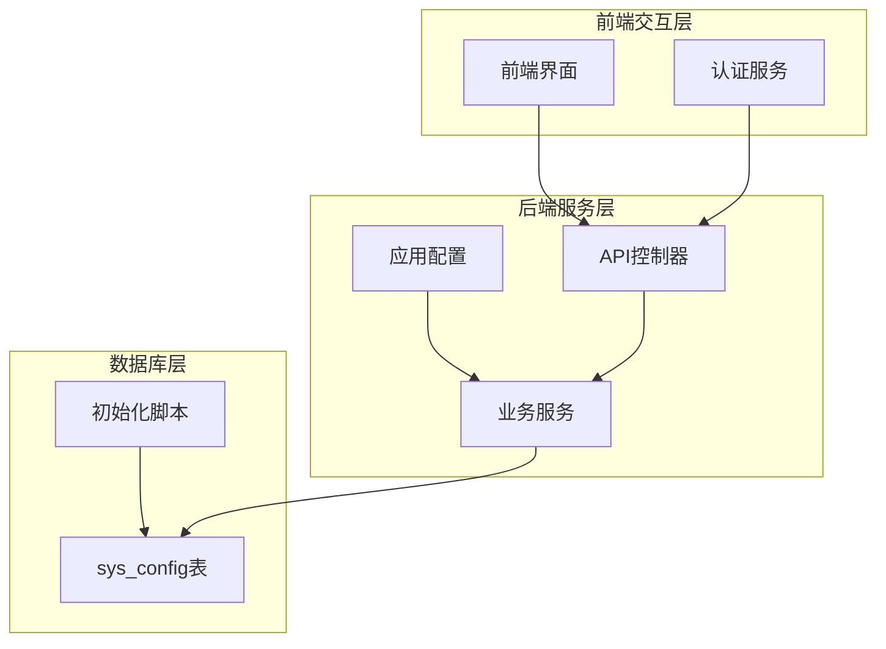
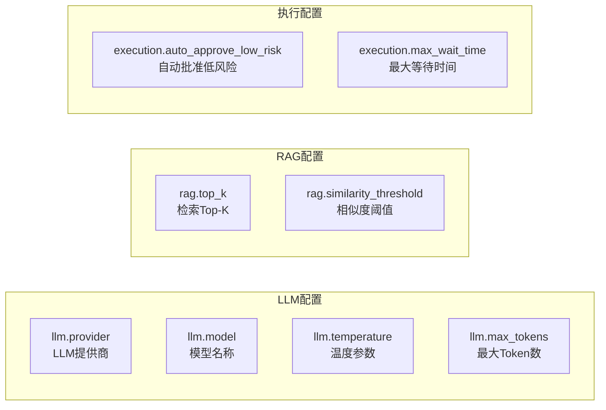
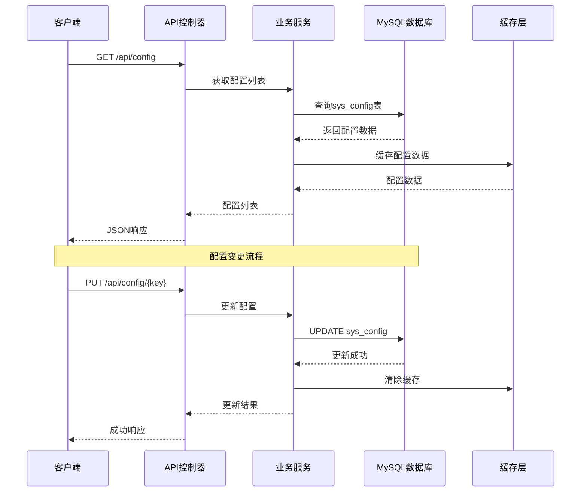
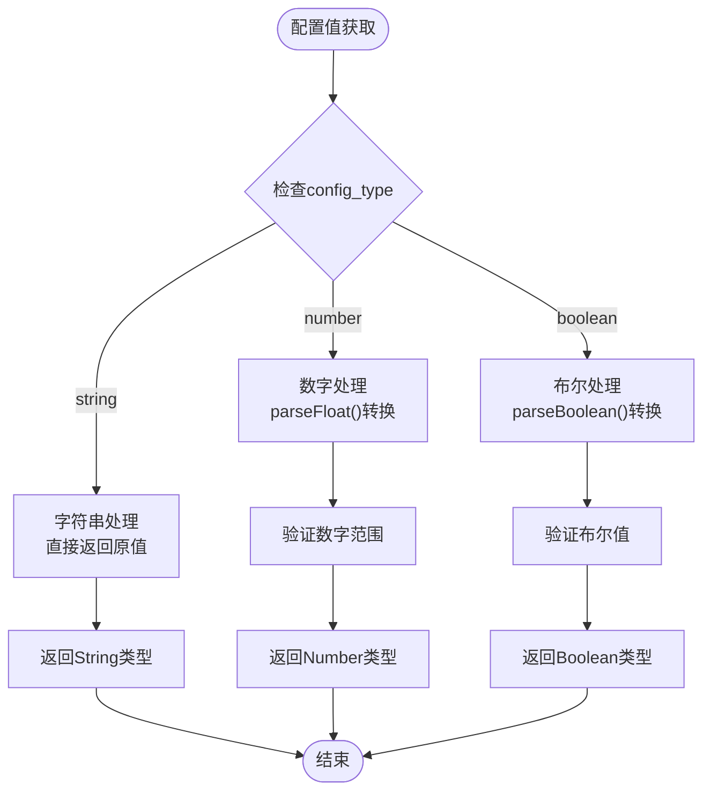
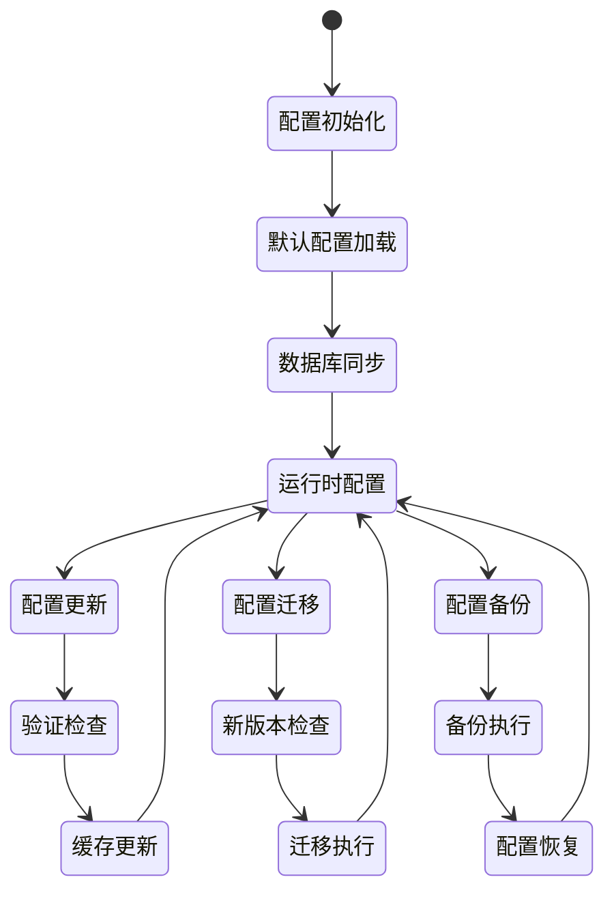
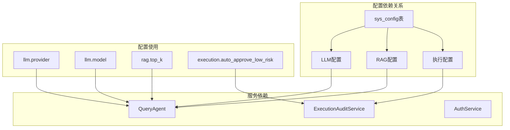

# 系统配置表设计

<cite>
**本文档引用的文件**
- [init.sql](file://sql/init.sql)
- [application.yml](file://netdata-ai-backend/src/main/resources/application.yml)
- [docker-compose.yml](file://docker-compose.yml)
- [RAGService.java](file://netdata-ai-backend/src/main/java/com/netdata/ops/core/rag/RAGService.java)
- [HybridRetriever.java](file://netdata-ai-backend/src/main/java/com/netdata/ops/core/rag/HybridRetriever.java)
- [MilvusVectorStore.java](file://netdata-ai-backend/src/main/java/com/netdata/ops/core/rag/MilvusVectorStore.java)
- [AuthService.java](file://netdata-ai-backend/src/main/java/com/netdata/ops/service/AuthService.java)
- [OpsController.java](file://netdata-ai-backend/src/main/java/com/netdata/ops/controller/OpsController.java)
</cite>

## 目录
1. [简介](#简介)
2. [项目结构](#项目结构)
3. [核心组件](#核心组件)
4. [架构概览](#架构概览)
5. [详细组件分析](#详细组件分析)
6. [依赖分析](#依赖分析)
7. [性能考虑](#性能考虑)
8. [故障排除指南](#故障排除指南)
9. [结论](#结论)

## 简介

本文档详细阐述了MySQL数据库中sys_config系统配置表的设计与实现。该配置表采用统一的键值对存储模式，支持多种数据类型的配置项管理，为整个智能运维平台提供了灵活的配置管理机制。

系统配置表设计遵循以下核心原则：
- **统一存储**：所有配置项通过单一表进行管理
- **类型安全**：通过config_type字段确保数据类型一致性
- **分类管理**：通过配置键的命名规范实现逻辑分组
- **版本控制**：通过更新时间和更新人字段实现配置变更追踪

## 项目结构

智能运维平台的配置管理涉及多个层面的集成：

**图表来源**
- [init.sql:220-244](file://sql/init.sql#L220-L244)
- [application.yml:14-77](file://netdata-ai-backend/src/main/resources/application.yml#L14-L77)

**章节来源**
- [init.sql:220-244](file://sql/init.sql#L220-L244)
- [application.yml:14-77](file://netdata-ai-backend/src/main/resources/application.yml#L14-L77)

## 核心组件

### 系统配置表结构

sys_config表采用标准化的数据库设计，确保配置管理的完整性：

| 字段名 | 数据类型 | 约束条件 | 描述 |
|--------|----------|----------|------|
| id | BIGINT | PRIMARY KEY, AUTO_INCREMENT | 配置ID主键 |
| config_key | VARCHAR(100) | NOT NULL, UNIQUE | 配置键名，采用层级命名规范 |
| config_value | TEXT | NOT NULL | 配置值，统一存储为文本格式 |
| config_type | VARCHAR(50) | DEFAULT 'string' | 配置类型：string/number/boolean |
| description | VARCHAR(500) | DEFAULT NULL | 配置描述信息 |
| updated_by | BIGINT | DEFAULT NULL | 更新人ID |
| updated_at | DATETIME | NOT NULL, DEFAULT CURRENT_TIMESTAMP ON UPDATE CURRENT_TIMESTAMP | 更新时间戳 |

### 配置分类体系

系统配置按照功能域进行逻辑分组：

**图表来源**
- [init.sql:236-244](file://sql/init.sql#L236-L244)

**章节来源**
- [init.sql:223-233](file://sql/init.sql#L223-L233)
- [init.sql:236-244](file://sql/init.sql#L236-L244)

## 架构概览

系统配置管理的整体架构采用分层设计，确保配置的统一管理和高效访问：

**图表来源**
- [OpsController.java:37-51](file://netdata-ai-backend/src/main/java/com/netdata/ops/controller/OpsController.java#L37-L51)
- [init.sql:220-244](file://sql/init.sql#L220-L244)

## 详细组件分析

### 配置数据类型处理机制

系统支持三种主要的数据类型，每种类型都有特定的存储和转换规则：

#### 字符串类型 (string)
- **用途**：用于存储文本信息，如提供商名称、模型标识等
- **存储方式**：直接存储原始字符串值
- **示例**：`llm.provider` = "deepseek"

#### 数字类型 (number)
- **用途**：用于存储数值配置，如温度参数、最大Token数等
- **存储方式**：以字符串形式存储数字，便于统一处理
- **示例**：`llm.temperature` = "0.7"

#### 布尔类型 (boolean)
- **用途**：用于存储开关类配置
- **存储方式**：使用"true"/"false"字符串表示
- **示例**：`execution.auto_approve_low_risk` = "true"

### 配置值转换流程

**图表来源**
- [init.sql:227](file://sql/init.sql#L227)

### 配置分类管理实现

系统通过配置键的层级命名实现逻辑分类：

#### LLM配置管理
LLM配置直接影响语言模型的调用行为：

| 配置项 | 类型 | 默认值 | 说明 |
|--------|------|--------|------|
| llm.provider | string | "deepseek" | LLM提供商选择 |
| llm.model | string | "deepseek-chat" | 模型名称 |
| llm.temperature | number | "0.7" | 生成随机性参数 |
| llm.max_tokens | number | "4096" | 最大生成Token数 |

#### RAG配置管理
RAG配置控制检索增强生成的行为：

| 配置项 | 类型 | 默认值 | 说明 |
|--------|------|--------|------|
| rag.top_k | number | "5" | 检索结果数量 |
| rag.similarity_threshold | number | "0.7" | 相似度阈值 |

#### 执行配置管理
执行配置影响命令执行的安全策略：

| 配置项 | 类型 | 默认值 | 说明 |
|--------|------|--------|------|
| execution.auto_approve_low_risk | boolean | "true" | 自动批准低风险命令 |
| execution.max_wait_time | number | "3600" | 最大等待时间(秒) |

**章节来源**
- [init.sql:236-244](file://sql/init.sql#L236-L244)

### 配置管理最佳实践

#### 配置版本控制
系统通过以下机制实现配置版本控制：
- **更新时间追踪**：`updated_at`字段自动记录每次变更时间
- **更新人追踪**：`updated_by`字段记录变更操作员
- **变更历史**：结合审计日志实现完整的变更追踪

#### 动态配置更新
系统支持运行时配置更新：
- **缓存机制**：配置变更后自动清除缓存，确保新配置及时生效
- **类型验证**：更新时进行数据类型验证，防止配置污染
- **回滚机制**：通过版本控制实现配置回滚

#### 配置验证机制
系统实施多层次的配置验证：
- **数据库约束**：唯一性约束确保配置键的唯一性
- **类型约束**：config_type字段限制配置值类型
- **业务验证**：应用层进行业务逻辑验证

### 配置迁移策略

系统提供完整的配置迁移方案：

**图表来源**
- [init.sql:235-244](file://sql/init.sql#L235-L244)

### 配置备份恢复方案

系统提供完善的配置备份和恢复机制：

#### 备份策略
- **定期备份**：每日自动备份sys_config表数据
- **增量备份**：记录配置变更历史，支持增量恢复
- **全量备份**：定期进行完整配置备份

#### 恢复策略
- **时间点恢复**：支持指定时间点的配置恢复
- **增量恢复**：基于变更历史进行增量恢复
- **批量恢复**：支持批量配置项的恢复操作

**章节来源**
- [init.sql:220-244](file://sql/init.sql#L220-L244)

## 依赖分析

系统配置与其他组件的依赖关系：

**图表来源**
- [init.sql:236-244](file://sql/init.sql#L236-L244)
- [RAGService.java:1-51](file://netdata-ai-backend/src/main/java/com/netdata/ops/core/rag/RAGService.java#L1-L51)
- [AuthService.java:35](file://netdata-ai-backend/src/main/java/com/netdata/ops/service/AuthService.java#L35)

**章节来源**
- [RAGService.java:1-51](file://netdata-ai-backend/src/main/java/com/netdata/ops/core/rag/RAGService.java#L1-L51)
- [HybridRetriever.java:46-56](file://netdata-ai-backend/src/main/java/com/netdata/ops/core/rag/HybridRetriever.java#L46-L56)
- [AuthService.java:35](file://netdata-ai-backend/src/main/java/com/netdata/ops/service/AuthService.java#L35)

## 性能考虑

### 配置访问优化
- **索引设计**：config_key字段建立唯一索引，确保查询性能
- **缓存策略**：配置数据采用LRU缓存，减少数据库访问频率
- **批量加载**：支持批量获取配置，避免多次数据库往返

### 存储优化
- **数据压缩**：配置值采用压缩存储，节省空间
- **分区策略**：对于大量配置项，可考虑按类别分区存储
- **归档机制**：历史配置自动归档，保持活跃配置的高性能

## 故障排除指南

### 常见配置问题

#### 配置键冲突
**问题**：重复的config_key导致插入失败
**解决方案**：检查唯一约束，修改配置键名称

#### 类型转换错误
**问题**：配置值与config_type不匹配
**解决方案**：重新设置正确的config_type，确保配置值格式正确

#### 缓存不同步
**问题**：配置更新后缓存未刷新
**解决方案**：手动清除缓存或等待自动刷新

### 监控和诊断

系统提供以下监控指标：
- 配置访问延迟
- 配置更新成功率
- 缓存命中率
- 数据库连接状态

**章节来源**
- [init.sql:231-232](file://sql/init.sql#L231-L232)

## 结论

sys_config系统配置表设计体现了现代配置管理的核心理念：统一性、灵活性和可靠性。通过标准化的表结构、清晰的分类体系和完善的管理机制，为整个智能运维平台提供了坚实的基础配置支撑。

该设计的主要优势包括：
- **统一管理**：所有配置集中在一个表中，便于维护
- **类型安全**：通过config_type确保数据类型一致性
- **扩展性强**：支持任意数量的配置项和新的配置类型
- **版本控制**：完整的变更追踪和回滚能力
- **性能优化**：缓存机制和索引设计确保高效访问

未来可以考虑的改进方向：
- 增加配置分组和标签功能
- 实现配置模板和继承机制
- 添加配置导入导出功能
- 增强配置变更的审批流程