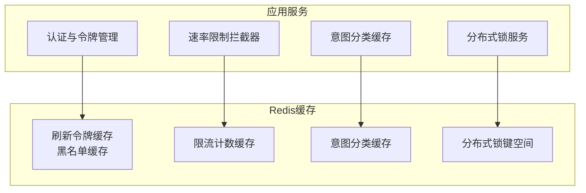
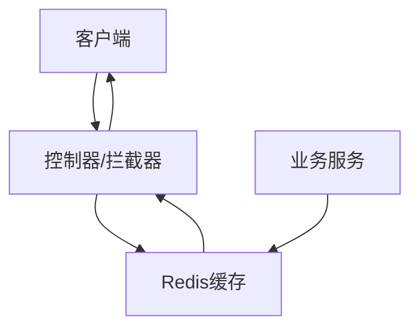
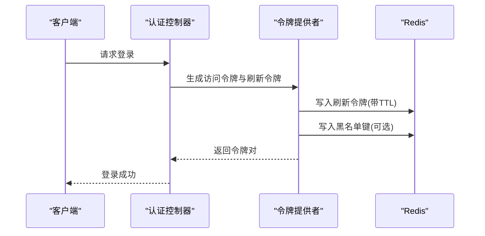
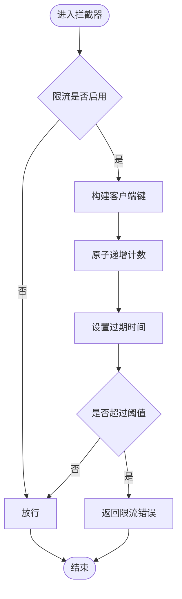
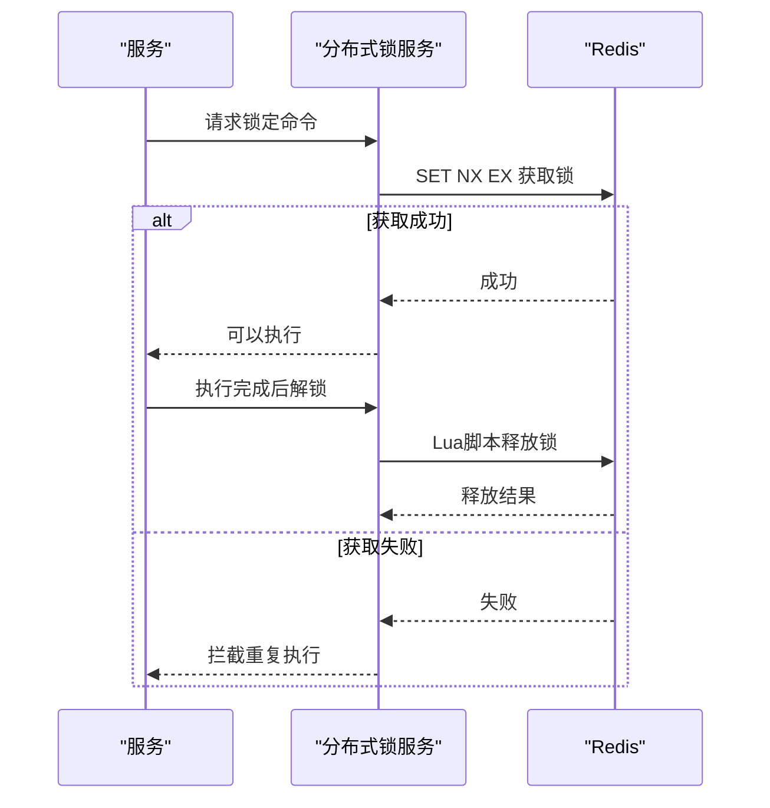
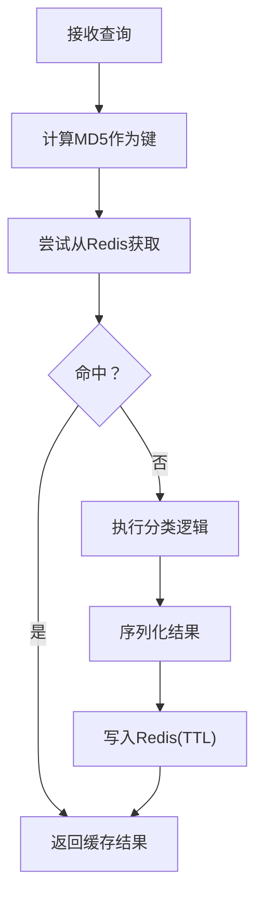
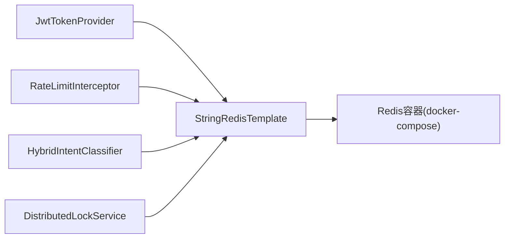

# Redis缓存设计

<cite>
**本文引用的文件**
- [JwtTokenProvider.java](file://netdata-ai-backend/src/main/java/com/netdata/ops/security/JwtTokenProvider.java)
- [RateLimitInterceptor.java](file://netdata-ai-backend/src/main/java/com/netdata/ops/interceptor/RateLimitInterceptor.java)
- [DistributedLockService.java](file://netdata-ai-backend/src/main/java/com/netdata/ops/core/agent/DistributedLockService.java)
- [HybridIntentClassifier.java](file://netdata-ai-backend/src/main/java/com/netdata/ops/core/agent/intent/HybridIntentClassifier.java)
- [docker-compose.yml](file://docker-compose.yml)
- [application.yml](file://netdata-ai-backend/src/main/resources/application.yml)
</cite>

## 目录
1. [引言](#引言)
2. [项目结构](#项目结构)
3. [核心组件](#核心组件)
4. [架构总览](#架构总览)
5. [详细组件分析](#详细组件分析)
6. [依赖关系分析](#依赖关系分析)
7. [性能考虑](#性能考虑)
8. [故障排查指南](#故障排查指南)
9. [结论](#结论)
10. [附录](#附录)

## 引言
本技术文档围绕Redis缓存系统在NetData AI后端中的设计与实现展开，重点覆盖以下方面：
- 缓存数据结构设计：会话管理缓存、用户权限缓存、API令牌缓存、临时数据缓存的键值设计
- 缓存策略：LRU淘汰机制、过期时间设置、内存优化策略
- 分布式锁实现与Redis事务处理机制
- 缓存穿透、击穿、雪崩的防护策略
- Redis集群配置、主从复制与哨兵模式
- 性能监控、命中率优化与内存使用分析
- 缓存数据序列化方案与持久化策略
- 缓存与数据库一致性保证机制

## 项目结构
本项目采用Spring Boot微服务架构，Redis作为缓存层与分布式锁中心，主要涉及以下模块：
- 安全认证与令牌管理：基于JWT与Redis黑名单实现令牌缓存与失效控制
- 速率限制：基于Redis的滑动窗口限流
- 分布式锁：基于SET NX EX原子操作与Lua脚本的安全释放
- 意图分类缓存：对意图分类结果进行缓存，提升响应速度
- Redis容器编排：通过docker-compose部署Redis实例并启用AOF持久化

图表来源
- [JwtTokenProvider.java:30-42](file://netdata-ai-backend/src/main/java/com/netdata/ops/security/JwtTokenProvider.java#L30-L42)
- [RateLimitInterceptor.java:26-34](file://netdata-ai-backend/src/main/java/com/netdata/ops/interceptor/RateLimitInterceptor.java#L26-L34)
- [HybridIntentClassifier.java:141-162](file://netdata-ai-backend/src/main/java/com/netdata/ops/core/agent/intent/HybridIntentClassifier.java#L141-L162)
- [DistributedLockService.java:39-45](file://netdata-ai-backend/src/main/java/com/netdata/ops/core/agent/DistributedLockService.java#L39-L45)

章节来源
- [docker-compose.yml:219-242](file://docker-compose.yml#L219-L242)

## 核心组件
- 令牌提供与缓存：负责访问令牌与刷新令牌的生成，并将刷新令牌与黑名单存入Redis，结合TTL实现过期与失效控制
- 速率限制：基于滑动窗口算法在Redis中维护请求计数，实现每分钟请求数限制
- 分布式锁：基于SET NX EX获取锁，使用Lua脚本原子释放，防止重复执行与死锁
- 意图分类缓存：对分类结果进行序列化存储，使用MD5作为键，配合TTL提升命中率
- Redis容器：通过docker-compose部署，启用AOF持久化，提供健康检查与资源限制

章节来源
- [JwtTokenProvider.java:47-75](file://netdata-ai-backend/src/main/java/com/netdata/ops/security/JwtTokenProvider.java#L47-L75)
- [RateLimitInterceptor.java:35-60](file://netdata-ai-backend/src/main/java/com/netdata/ops/interceptor/RateLimitInterceptor.java#L35-L60)
- [DistributedLockService.java:126-160](file://netdata-ai-backend/src/main/java/com/netdata/ops/core/agent/DistributedLockService.java#L126-L160)
- [HybridIntentClassifier.java:141-162](file://netdata-ai-backend/src/main/java/com/netdata/ops/core/agent/intent/HybridIntentClassifier.java#L141-L162)

## 架构总览
下图展示了Redis在系统中的角色与各组件交互关系：

图表来源
- [RateLimitInterceptor.java:35-60](file://netdata-ai-backend/src/main/java/com/netdata/ops/interceptor/RateLimitInterceptor.java#L35-L60)
- [JwtTokenProvider.java:47-75](file://netdata-ai-backend/src/main/java/com/netdata/ops/security/JwtTokenProvider.java#L47-L75)
- [HybridIntentClassifier.java:141-162](file://netdata-ai-backend/src/main/java/com/netdata/ops/core/agent/intent/HybridIntentClassifier.java#L141-L162)

## 详细组件分析

### 令牌提供与缓存（API令牌缓存）
- 功能概述：生成访问令牌与刷新令牌，刷新令牌写入Redis并设置过期时间，同时维护黑名单键空间用于撤销
- 键空间设计：
  - 刷新令牌键：以固定前缀加令牌ID构成，便于批量清理与审计
  - 黑名单键：以固定前缀加令牌ID构成，用于快速判断令牌是否失效
- 过期策略：刷新令牌与访问令牌分别设置独立TTL，访问令牌短、刷新令牌长，降低泄露风险
- 序列化方案：令牌为JWT字符串，无需额外序列化；黑名单键存储为布尔或空值标记
- 一致性保障：黑名单写入与令牌撤销在同一事务中完成，确保状态一致

图表来源
- [JwtTokenProvider.java:47-75](file://netdata-ai-backend/src/main/java/com/netdata/ops/security/JwtTokenProvider.java#L47-L75)
- [JwtTokenProvider.java:30-42](file://netdata-ai-backend/src/main/java/com/netdata/ops/security/JwtTokenProvider.java#L30-L42)

章节来源
- [JwtTokenProvider.java:47-75](file://netdata-ai-backend/src/main/java/com/netdata/ops/security/JwtTokenProvider.java#L47-L75)
- [application.yml](file://netdata-ai-backend/src/main/resources/application.yml)

### 速率限制（临时数据缓存）
- 功能概述：基于滑动窗口算法在Redis中记录每分钟请求数，超过阈值则拒绝请求
- 键空间设计：以客户端标识为前缀，结合时间片构建键，支持精确到秒的粒度
- 过期策略：键按时间片自动过期，避免长期占用内存
- 临时性：仅用于短期流量控制，不涉及持久化

图表来源
- [RateLimitInterceptor.java:35-60](file://netdata-ai-backend/src/main/java/com/netdata/ops/interceptor/RateLimitInterceptor.java#L35-L60)

章节来源
- [RateLimitInterceptor.java:29-34](file://netdata-ai-backend/src/main/java/com/netdata/ops/interceptor/RateLimitInterceptor.java#L29-L34)
- [RateLimitInterceptor.java:35-60](file://netdata-ai-backend/src/main/java/com/netdata/ops/interceptor/RateLimitInterceptor.java#L35-L60)

### 分布式锁（临时数据缓存）
- 功能概述：基于Redis实现分布式锁，防止高风险命令重复执行
- 锁键设计：以命令内容哈希作为锁键，避免Key过长；以traceId作为持有者标识
- 原子操作：使用SET NX EX获取锁，Lua脚本原子释放，确保安全性
- 自动释放：默认TTL到期自动释放，防止死锁
- 适用场景：审批后命令唯一执行、Agent并发控制

图表来源
- [DistributedLockService.java:126-160](file://netdata-ai-backend/src/main/java/com/netdata/ops/core/agent/DistributedLockService.java#L126-L160)

章节来源
- [DistributedLockService.java:39-45](file://netdata-ai-backend/src/main/java/com/netdata/ops/core/agent/DistributedLockService.java#L39-L45)
- [DistributedLockService.java:126-160](file://netdata-ai-backend/src/main/java/com/netdata/ops/core/agent/DistributedLockService.java#L126-L160)

### 意图分类缓存（临时数据缓存）
- 功能概述：对意图分类结果进行缓存，使用MD5作为键，配合TTL提升命中率
- 键空间设计：以固定前缀加MD5(query)构成，避免Key过长
- 序列化方案：将分类结果序列化为JSON字符串存储
- 过期策略：统一TTL，平衡命中率与数据新鲜度

图表来源
- [HybridIntentClassifier.java:141-162](file://netdata-ai-backend/src/main/java/com/netdata/ops/core/agent/intent/HybridIntentClassifier.java#L141-L162)

章节来源
- [HybridIntentClassifier.java:141-162](file://netdata-ai-backend/src/main/java/com/netdata/ops/core/agent/intent/HybridIntentClassifier.java#L141-L162)

### 缓存穿透、击穿、雪崩的防护策略
- 缓存穿透：对不存在的查询结果也进行缓存，使用特殊值标记，设置短TTL，防止恶意攻击
- 缓存击穿：热点键设置互斥锁或后台异步更新，避免瞬时高并发导致数据库压力
- 缓存雪崩：为TTL增加抖动，分批过期，避免集中过期造成级联失效

[本节为通用策略说明，不直接分析具体文件]

## 依赖关系分析
- 组件耦合：各缓存组件均依赖StringRedisTemplate，通过统一的Redis客户端访问
- 外部依赖：Redis容器由docker-compose管理，提供AOF持久化与健康检查
- 接口契约：分布式锁服务通过Lua脚本保证原子性，速率限制与令牌缓存遵循键空间约定

图表来源
- [JwtTokenProvider.java:28](file://netdata-ai-backend/src/main/java/com/netdata/ops/security/JwtTokenProvider.java#L28)
- [RateLimitInterceptor.java:26](file://netdata-ai-backend/src/main/java/com/netdata/ops/interceptor/RateLimitInterceptor.java#L26)
- [HybridIntentClassifier.java:141-146](file://netdata-ai-backend/src/main/java/com/netdata/ops/core/agent/intent/HybridIntentClassifier.java#L141-L146)
- [DistributedLockService.java:34](file://netdata-ai-backend/src/main/java/com/netdata/ops/core/agent/DistributedLockService.java#L34)
- [docker-compose.yml:219-242](file://docker-compose.yml#L219-L242)

章节来源
- [docker-compose.yml:219-242](file://docker-compose.yml#L219-L242)

## 性能考虑
- 内存优化：使用MD5与哈希作为键，避免Key过长；合理设置TTL，减少无效数据占用
- 命中率优化：对热点键采用互斥更新与预热策略；为不同业务设置差异化TTL
- 持久化策略：启用AOF持久化，兼顾数据安全与性能；定期备份与快照
- 监控指标：通过Micrometer对接Prometheus/Grafana，关注命中率、内存使用、延迟与错误率

[本节提供通用指导，不直接分析具体文件]

## 故障排查指南
- Redis连接问题：检查docker-compose中的健康检查与端口映射，确认密码与网络配置
- 缓存未生效：核对键空间前缀与TTL设置，确认序列化格式正确
- 分布式锁异常：检查Lua脚本执行结果与锁持有者标识，避免跨实例误删
- 限流误判：核查客户端键构建规则与时间片粒度，确保阈值配置合理

章节来源
- [docker-compose.yml:232-238](file://docker-compose.yml#L232-L238)

## 结论
本Redis缓存系统通过明确的键空间设计、合理的过期策略与序列化方案，在认证、限流、分布式锁与临时缓存等方面实现了高可用与高性能。建议后续引入Redis集群与哨兵模式以进一步提升可用性与扩展性，并完善监控与告警体系。

[本节为总结性内容，不直接分析具体文件]

## 附录
- Redis容器配置要点：镜像版本、端口映射、AOF持久化、健康检查与资源限制
- 键空间命名规范：前缀统一、长度控制、语义清晰
- 最佳实践：TTL抖动、互斥更新、降级策略、监控告警

章节来源
- [docker-compose.yml:219-242](file://docker-compose.yml#L219-L242)