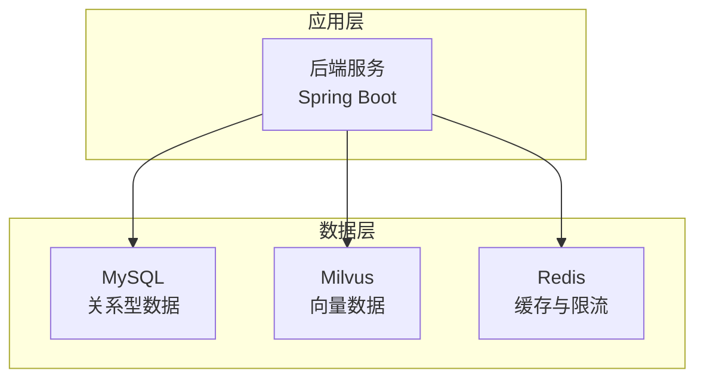
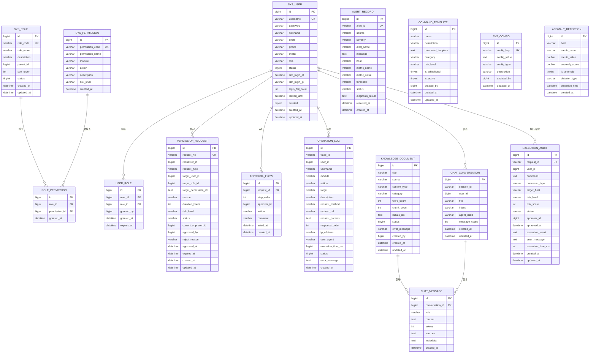
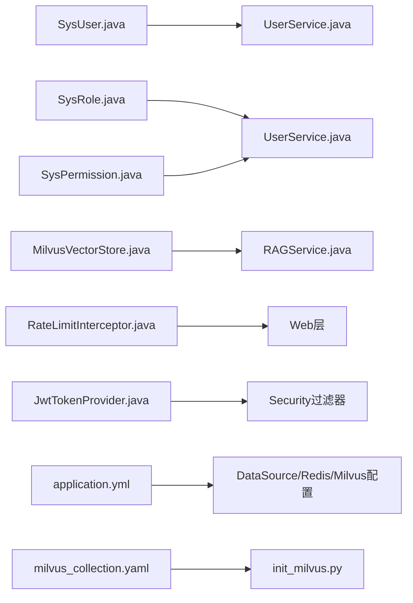

# 数据模型设计

<cite>
**本文引用的文件**
- [init.sql](file://sql/init.sql)
- [V2__rbac_tables.sql](file://sql/V2__rbac_tables.sql)
- [milvus_collection.yaml](file://config/milvus_collection.yaml)
- [init_milvus.py](file://scripts/init_milvus.py)
- [application.yml](file://netdata-ai-backend/src/main/resources/application.yml)
- [SysUser.java](file://netdata-ai-backend/src/main/java/com/netdata/ops/entity/SysUser.java)
- [SysRole.java](file://netdata-ai-backend/src/main/java/com/netdata/ops/entity/SysRole.java)
- [SysPermission.java](file://netdata-ai-backend/src/main/java/com/netdata/ops/entity/SysPermission.java)
- [AlertRecord.java](file://netdata-ai-backend/src/main/java/com/netdata/ops/entity/AlertRecord.java)
- [KnowledgeDocument.java](file://netdata-ai-backend/src/main/java/com/netdata/ops/entity/KnowledgeDocument.java)
- [MilvusVectorStore.java](file://netdata-ai-backend/src/main/java/com/netdata/ops/core/rag/MilvusVectorStore.java)
- [RateLimitInterceptor.java](file://netdata-ai-backend/src/main/java/com/netdata/ops/interceptor/RateLimitInterceptor.java)
- [JwtTokenProvider.java](file://netdata-ai-backend/src/main/java/com/netdata/ops/security/JwtTokenProvider.java)
- [docker-compose.yml](file://docker-compose.yml)
</cite>

## 目录
1. [简介](#简介)
2. [项目结构](#项目结构)
3. [核心组件](#核心组件)
4. [架构总览](#架构总览)
5. [详细组件分析](#详细组件分析)
6. [依赖分析](#依赖分析)
7. [性能考量](#性能考量)
8. [故障排查指南](#故障排查指南)
9. [结论](#结论)
10. [附录](#附录)

## 简介
本设计文档围绕系统数据模型展开，覆盖关系型数据库（MySQL）、向量数据库（Milvus）与缓存（Redis）三部分。文档详细说明：
- MySQL 表结构设计：用户、角色、权限、告警记录、知识文档等字段定义与关系约束
- Milvus 集合设计：向量维度、索引类型、查询优化策略与一致性设置
- Redis 缓存设计：会话管理、权限缓存与临时数据存储策略
- ER 关系图与数据模型图：实体间关系与约束
- 数据访问模式、事务处理与并发控制
- 数据迁移策略、版本管理与备份恢复
- 数据安全与隐私保护设计

## 项目结构
系统采用三层数据层：
- 关系型数据库：MySQL（初始化脚本与实体映射）
- 向量数据库：Milvus（集合结构与索引配置）
- 缓存：Redis（限流、会话、权限缓存）



**图表来源**
- [application.yml:31-59](file://netdata-ai-backend/src/main/resources/application.yml#L31-L59)
- [milvus_collection.yaml:22-35](file://config/milvus_collection.yaml#L22-L35)
- [docker-compose.yml:219-242](file://docker-compose.yml#L219-L242)

**章节来源**
- [application.yml:31-59](file://netdata-ai-backend/src/main/resources/application.yml#L31-L59)
- [milvus_collection.yaml:22-35](file://config/milvus_collection.yaml#L22-L35)
- [docker-compose.yml:219-242](file://docker-compose.yml#L219-L242)

## 核心组件
本节概述三大数据组件的设计要点与职责边界。

- MySQL（关系型）
  - 用户、角色、权限、审批、操作审计等RBAC相关表
  - 告警记录、异常检测、命令模板、聊天历史、系统配置等业务表
  - 支持逻辑删除、自动时间戳填充、索引优化

- Milvus（向量）
  - ops_knowledge_base 集合，1024维向量，COSINE 相似度，IVF_FLAT 索引
  - 支持插入、搜索、删除、统计查询
  - 提供一致性级别与输出字段控制

- Redis（缓存）
  - 会话与令牌黑名单：JWT Access/Refresh Token生命周期管理
  - 权限缓存：用户权限键空间
  - 限流：基于滑动窗口的请求频率限制
  - 其他：RAG检索结果缓存、分布式锁、实时告警去重（容器编排注释）

**章节来源**
- [init.sql:26-274](file://sql/init.sql#L26-L274)
- [V2__rbac_tables.sql:23-256](file://sql/V2__rbac_tables.sql#L23-L256)
- [milvus_collection.yaml:105-140](file://config/milvus_collection.yaml#L105-L140)
- [MilvusVectorStore.java:117-209](file://netdata-ai-backend/src/main/java/com/netdata/ops/core/rag/MilvusVectorStore.java#L117-L209)
- [application.yml:47-59](file://netdata-ai-backend/src/main/resources/application.yml#L47-L59)
- [RateLimitInterceptor.java:24-68](file://netdata-ai-backend/src/main/java/com/netdata/ops/interceptor/RateLimitInterceptor.java#L24-L68)
- [JwtTokenProvider.java:23-194](file://netdata-ai-backend/src/main/java/com/netdata/ops/security/JwtTokenProvider.java#L23-L194)

## 架构总览
系统数据模型整体关系如下：



**图表来源**
- [init.sql:26-274](file://sql/init.sql#L26-L274)
- [V2__rbac_tables.sql:38-185](file://sql/V2__rbac_tables.sql#L38-L185)

**章节来源**
- [init.sql:26-274](file://sql/init.sql#L26-L274)
- [V2__rbac_tables.sql:38-185](file://sql/V2__rbac_tables.sql#L38-L185)

## 详细组件分析

### MySQL 表结构与关系设计

- 用户表（sys_user）
  - 主键：id；唯一键：username；索引：role、status
  - 新增安全字段：avatar、last_login_at、last_login_ip、login_fail_count、locked_until、deleted（逻辑删除）
  - 与角色通过 user_role 关联，支持多角色与临时授权

- 角色表（sys_role）
  - 主键：id；唯一键：role_code；支持父子继承（parent_id）
  - 排序字段：sort_order；状态：status

- 权限表（sys_permission）
  - 主键：id；唯一键：permission_code；模块与操作类型：module、action
  - 风险等级：risk_level；创建时间：createdAt

- 用户-角色关联（user_role）
  - 主键：id；唯一组合：user_id, role_id；支持授权人、授权时间、过期时间

- 角色-权限关联（role_permission）
  - 主键：id；唯一组合：role_id, permission_id；授权时间：granted_at

- 权限审批请求（permission_request）
  - 主键：id；唯一键：request_no；类型：request_type；状态：status；审批流程通过 approval_flow

- 审批流程记录（approval_flow）
  - 主键：id；复合索引：request_id, step_order；记录每一步审批人与动作

- 操作审计日志（operation_log）
  - 主键：id；索引：trace_id、user_id、module_action、created_at
  - 记录请求方法、URL、参数（脱敏）、响应码、耗时、结果与错误

- 知识库文档（knowledge_document）
  - 主键：id；索引：source、category、status
  - 记录标题、来源、内容类型、分类、字数、切片数、Milvus ID 列表、状态与错误信息

- 告警记录（alert_record）
  - 主键：id；唯一键：alert_id；索引：severity、status、created_at
  - 记录来源、严重程度、指标名称与值、阈值、状态、诊断结果与解决时间

- 对话历史（chat_conversation）
  - 主键：id；索引：session_id、user_id、created_at

- 对话消息（chat_message）
  - 主键：id；外键：conversation_id → chat_conversation；索引：created_at
  - 记录角色（user/assistant/system）、内容、Token数、来源与元数据

- 命令执行审计（execution_audit）
  - 主键：id；唯一键：request_id；索引：user_id、status、risk_level、created_at
  - 记录命令、类型、目标主机、风险等级/分数、状态、审批人与时间、结果与耗时

- 命令模板（command_template）
  - 主键：id；索引：category、is_whitelisted
  - 记录模板名称、描述、模板内容、分类、默认风险等级、白名单开关与状态

- 系统配置（sys_config）
  - 主键：id；唯一键：config_key
  - 记录配置键、值、类型与描述

- 异常检测结果（anomaly_detection）
  - 主键：id；索引：host、metric_name、is_anomaly、detection_time

- 视图
  - v_alert_statistics：按日期与严重程度聚合告警统计
  - v_execution_statistics：按日期与风险等级聚合执行统计

**章节来源**
- [init.sql:26-274](file://sql/init.sql#L26-L274)
- [V2__rbac_tables.sql:38-185](file://sql/V2__rbac_tables.sql#L38-L185)

### Milvus 向量集合设计

- 集合名称与描述
  - 名称：ops_knowledge_base
  - 描述：智能运维知识库向量集合，存储运维文档的向量表示
  - 分片数：shard_number=1（单机模式）

- 字段定义
  - id：主键，INT64，自增
  - content：VARCHAR，最大长度8000，文档内容片段
  - embedding：FLOAT_VECTOR，维度1024（BGE-M3固定）
  - source：VARCHAR，最大长度512，文档来源（URL或文件名）
  - title：VARCHAR，最大长度256，文档标题
  - chunk_index：INT64，同一文档的片段索引
  - created_at：INT64，创建时间戳

- 索引与搜索
  - 索引类型：IVF_FLAT
  - nlist：128（聚类中心数量）
  - 搜索参数：nprobe=16，Top-K=5
  - 输出字段：content、source、title、chunk_index

- 一致性与可用性
  - 客户端在 @PostConstruct 中初始化连接，若连接失败则降级为不可用状态
  - 提供 isAvailable() 检查与 getStats() 统计接口

- 索引类型选择指南
  - 数据量 < 10万：FLAT（精确）
  - 数据量 10-100万：IVF_FLAT（平衡）
  - 数据量 100-1000万：IVF_PQ/HNSW
  - 数据量 > 1000万：GPU_IVF_FLAT/HNSW+分片

**章节来源**
- [milvus_collection.yaml:22-140](file://config/milvus_collection.yaml#L22-L140)
- [init_milvus.py:84-113](file://scripts/init_milvus.py#L84-L113)
- [init_milvus.py:253-303](file://scripts/init_milvus.py#L253-L303)
- [init_milvus.py:389-442](file://scripts/init_milvus.py#L389-L442)
- [MilvusVectorStore.java:117-209](file://netdata-ai-backend/src/main/java/com/netdata/ops/core/rag/MilvusVectorStore.java#L117-L209)
- [MilvusVectorStore.java:274-324](file://netdata-ai-backend/src/main/java/com/netdata/ops/core/rag/MilvusVectorStore.java#L274-L324)

### Redis 缓存设计

- 会话与令牌管理
  - Access Token：短期有效，携带用户ID与角色列表
  - Refresh Token：长期有效，存储于 Redis，注销时校验与清理
  - Token 黑名单：登出后将JTI加入黑名单，短时有效

- 权限缓存
  - 键前缀：user:perms:{userId}
  - 用户角色变更或权限调整时清除对应缓存键

- 请求限流
  - 使用 Redis ZSET 实现滑动窗口限流
  - 键：rate_limit:{clientKey}，值为请求时间戳，过期时间2分钟
  - 默认每分钟上限：60次，可通过配置覆盖

- 其他用途（容器编排注释）
  - RAG检索结果缓存、分布式锁（防重复执行）、实时告警去重

**章节来源**
- [application.yml:47-59](file://netdata-ai-backend/src/main/resources/application.yml#L47-L59)
- [JwtTokenProvider.java:23-194](file://netdata-ai-backend/src/main/java/com/netdata/ops/security/JwtTokenProvider.java#L23-L194)
- [RateLimitInterceptor.java:24-68](file://netdata-ai-backend/src/main/java/com/netdata/ops/interceptor/RateLimitInterceptor.java#L24-L68)
- [docker-compose.yml:219-242](file://docker-compose.yml#L219-L242)

### 数据访问模式、事务处理与并发控制

- 事务处理
  - 用户创建/更新/删除、角色分配、密码重置等关键操作使用 @Transactional
  - 逻辑删除：通过设置 deleted=1 实现软删除，配合 MyBatis Plus 全局逻辑删除字段

- 并发控制
  - 用户名/邮箱唯一性检查在事务内进行
  - 权限缓存一致性：角色变更后主动清除缓存键
  - 限流：基于 Redis ZSET 的原子操作，避免竞态

- 自动填充
  - MyBatis Plus 自动填充 createdAt/updatedAt 字段
  - 逻辑删除字段 deleted 配置为全局逻辑删除

**章节来源**
- [UserService.java:79-115](file://netdata-ai-backend/src/main/java/com/netdata/ops/service/UserService.java#L79-L115)
- [UserService.java:142-161](file://netdata-ai-backend/src/main/java/com/netdata/ops/service/UserService.java#L142-L161)
- [UserService.java:166-187](file://netdata-ai-backend/src/main/java/com/netdata/ops/service/UserService.java#L166-L187)
- [MyBatisPlusConfig.java:24-40](file://netdata-ai-backend/src/main/java/com/netdata/ops/config/MyBatisPlusConfig.java#L24-L40)

### 数据迁移策略、版本管理与备份恢复

- MySQL 迁移
  - 初始脚本：创建基础表与视图
  - RBAC 迁移：新增角色、权限、审批与审计表，并对 sys_user 增加安全字段
  - 版本命名：V2__rbac_tables.sql，便于顺序执行与回滚

- Milvus 集合
  - 通过 init_milvus.py 或 milvus_collection.yaml 定义集合结构与索引
  - 集合创建后向量维度不可更改，需谨慎规划

- 备份与恢复
  - MySQL：mysqldump 备份，Docker 环境下持久化卷保存数据
  - Milvus：ETCD/存储后端备份（需遵循 Milvus 官方备份流程）
  - Redis：AOF/RDB 持久化，容器挂载数据卷

**章节来源**
- [init.sql:10-20](file://sql/init.sql#L10-L20)
- [V2__rbac_tables.sql:1-15](file://sql/V2__rbac_tables.sql#L1-L15)
- [milvus_collection.yaml:11-16](file://config/milvus_collection.yaml#L11-L16)
- [init_milvus.py:19-30](file://scripts/init_milvus.py#L19-L30)
- [docker-compose.yml:225-228](file://docker-compose.yml#L225-L228)

### 数据安全与隐私保护

- 认证与授权
  - JWT：Access/Refresh Token 生命周期管理，黑名单机制
  - RBAC：细粒度权限编码（module:action），风险等级标注

- 数据保护
  - 密码：BCrypt 加密存储
  - 登录失败：累计失败次数与锁定截止时间
  - 逻辑删除：软删除避免误删，审计日志记录操作轨迹

- 传输与存储
  - MySQL/Redis/Milvus 连接建议使用 TLS（容器编排未启用 TLS）
  - 敏感配置通过环境变量注入

**章节来源**
- [init.sql:43-46](file://sql/init.sql#L43-L46)
- [SysUser.java:28-49](file://netdata-ai-backend/src/main/java/com/netdata/ops/entity/SysUser.java#L28-L49)
- [JwtTokenProvider.java:23-194](file://netdata-ai-backend/src/main/java/com/netdata/ops/security/JwtTokenProvider.java#L23-L194)
- [application.yml:31-59](file://netdata-ai-backend/src/main/resources/application.yml#L31-L59)

## 依赖分析



**图表来源**
- [SysUser.java:12-16](file://netdata-ai-backend/src/main/java/com/netdata/ops/entity/SysUser.java#L12-L16)
- [UserService.java:35-38](file://netdata-ai-backend/src/main/java/com/netdata/ops/service/UserService.java#L35-L38)
- [MilvusVectorStore.java:44-57](file://netdata-ai-backend/src/main/java/com/netdata/ops/core/rag/MilvusVectorStore.java#L44-L57)
- [RateLimitInterceptor.java:26-27](file://netdata-ai-backend/src/main/java/com/netdata/ops/interceptor/RateLimitInterceptor.java#L26-L27)
- [JwtTokenProvider.java:28-41](file://netdata-ai-backend/src/main/java/com/netdata/ops/security/JwtTokenProvider.java#L28-L41)
- [application.yml:31-109](file://netdata-ai-backend/src/main/resources/application.yml#L31-L109)
- [milvus_collection.yaml:22-109](file://config/milvus_collection.yaml#L22-L109)
- [init_milvus.py:84-113](file://scripts/init_milvus.py#L84-L113)

**章节来源**
- [SysUser.java:12-16](file://netdata-ai-backend/src/main/java/com/netdata/ops/entity/SysUser.java#L12-L16)
- [UserService.java:35-38](file://netdata-ai-backend/src/main/java/com/netdata/ops/service/UserService.java#L35-L38)
- [MilvusVectorStore.java:44-57](file://netdata-ai-backend/src/main/java/com/netdata/ops/core/rag/MilvusVectorStore.java#L44-L57)
- [RateLimitInterceptor.java:26-27](file://netdata-ai-backend/src/main/java/com/netdata/ops/interceptor/RateLimitInterceptor.java#L26-L27)
- [JwtTokenProvider.java:28-41](file://netdata-ai-backend/src/main/java/com/netdata/ops/security/JwtTokenProvider.java#L28-L41)
- [application.yml:31-109](file://netdata-ai-backend/src/main/resources/application.yml#L31-L109)
- [milvus_collection.yaml:22-109](file://config/milvus_collection.yaml#L22-L109)
- [init_milvus.py:84-113](file://scripts/init_milvus.py#L84-L113)

## 性能考量
- MySQL
  - 合理索引：角色、状态、来源、分类、严重程度、风险等级、创建时间等高频过滤字段
  - 分页：单次最大500条，避免超大结果集
  - 逻辑删除：软删除减少物理删除成本

- Milvus
  - nlist/nprobe：根据数据规模调整，平衡精度与性能
  - 索引类型：IVF_FLAT 适中规模；超大规模考虑 GPU 或 HNSW
  - 输出字段最小化：仅返回必要字段，降低网络与解析开销

- Redis
  - 限流窗口：ZSET 原子操作，避免热点竞争
  - 过期策略：合理设置TTL，避免无限增长
  - 键空间：权限缓存键前缀统一，便于批量清理

[本节为通用指导，无需具体文件分析]

## 故障排查指南
- Milvus 连接失败
  - 检查 host/port 与容器连通性
  - 查看 init_milvus.py 日志与 Milvus 容器健康状态
  - 确认集合存在或允许自动创建

- Redis 限流频繁触发
  - 检查客户端Key生成策略与滑动窗口参数
  - 确认过期时间与统计周期一致

- JWT 黑名单无效
  - 确认登出流程是否写入黑名单
  - 检查 Redis 中黑名单键是否存在且未过期

- 权限缓存未刷新
  - 角色变更后是否调用清除缓存逻辑
  - 缓存键前缀是否一致

**章节来源**
- [init_milvus.py:129-139](file://scripts/init_milvus.py#L129-L139)
- [RateLimitInterceptor.java:48-61](file://netdata-ai-backend/src/main/java/com/netdata/ops/interceptor/RateLimitInterceptor.java#L48-L61)
- [JwtTokenProvider.java:157-164](file://netdata-ai-backend/src/main/java/com/netdata/ops/security/JwtTokenProvider.java#L157-L164)
- [UserService.java:229-231](file://netdata-ai-backend/src/main/java/com/netdata/ops/service/UserService.java#L229-L231)

## 结论
本设计文档系统化梳理了系统的数据模型：MySQL 提供完善的RBAC与业务数据支撑，Milvus 提供高效率的语义检索能力，Redis 提供会话、权限与限流等关键缓存能力。通过合理的索引、事务与并发控制策略，以及清晰的迁移与安全设计，系统在功能完整性与性能稳定性之间取得良好平衡。

[本节为总结性内容，无需具体文件分析]

## 附录

### 数据模型图（代码级类图）
```mermaid
classDiagram
class SysUser {
+Long id
+String username
+String password
+String nickname
+String email
+String phone
+String avatar
+String role
+Integer status
+LocalDateTime lastLoginAt
+String lastLoginIp
+Integer loginFailCount
+LocalDateTime lockedUntil
+Integer deleted
+LocalDateTime createdAt
+LocalDateTime updatedAt
}
class SysRole {
+Long id
+String roleCode
+String roleName
+String description
+Long parentId
+Integer sortOrder
+Integer status
+LocalDateTime createdAt
+LocalDateTime updatedAt
}
class SysPermission {
+Long id
+String permissionCode
+String permissionName
+String module
+String action
+String description
+String riskLevel
+LocalDateTime createdAt
}
class User_Role {
+Long id
+Long userId
+Long roleId
+Long grantedBy
+LocalDateTime grantedAt
+LocalDateTime expiresAt
}
class Role_Permission {
+Long id
+Long roleId
+Long permissionId
+LocalDateTime grantedAt
}
class KnowledgeDocument {
+Long id
+String title
+String source
+String contentType
+String category
+Integer wordCount
+Integer chunkCount
+String milvusIds
+Integer status
+String errorMessage
+Long createdBy
+LocalDateTime createdAt
+LocalDateTime updatedAt
}
class AlertRecord {
+Long id
+String alertId
+String source
+String severity
+String alertName
+String message
+String host
+String metricName
+String metricValue
+String threshold
+String status
+String diagnosisResult
+Long resolvedBy
+LocalDateTime resolvedAt
+LocalDateTime createdAt
+LocalDateTime updatedAt
}
SysUser ||--o{ User_Role : "拥有"
SysRole ||--o{ Role_Permission : "授予"
SysPermission ||--o{ Role_Permission : "被授予"
KnowledgeDocument ||--o{ AlertRecord : "引用"
```

**图表来源**
- [SysUser.java:13-56](file://netdata-ai-backend/src/main/java/com/netdata/ops/entity/SysUser.java#L13-L56)
- [SysRole.java:13-38](file://netdata-ai-backend/src/main/java/com/netdata/ops/entity/SysRole.java#L13-L38)
- [SysPermission.java:12-45](file://netdata-ai-backend/src/main/java/com/netdata/ops/entity/SysPermission.java#L12-L45)
- [KnowledgeDocument.java:12-46](file://netdata-ai-backend/src/main/java/com/netdata/ops/entity/KnowledgeDocument.java#L12-L46)
- [AlertRecord.java:12-55](file://netdata-ai-backend/src/main/java/com/netdata/ops/entity/AlertRecord.java#L12-L55)