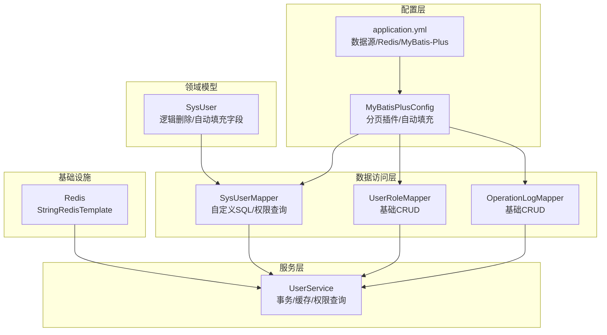
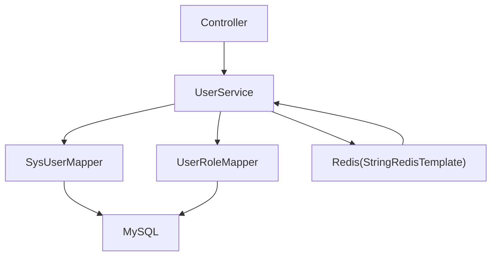
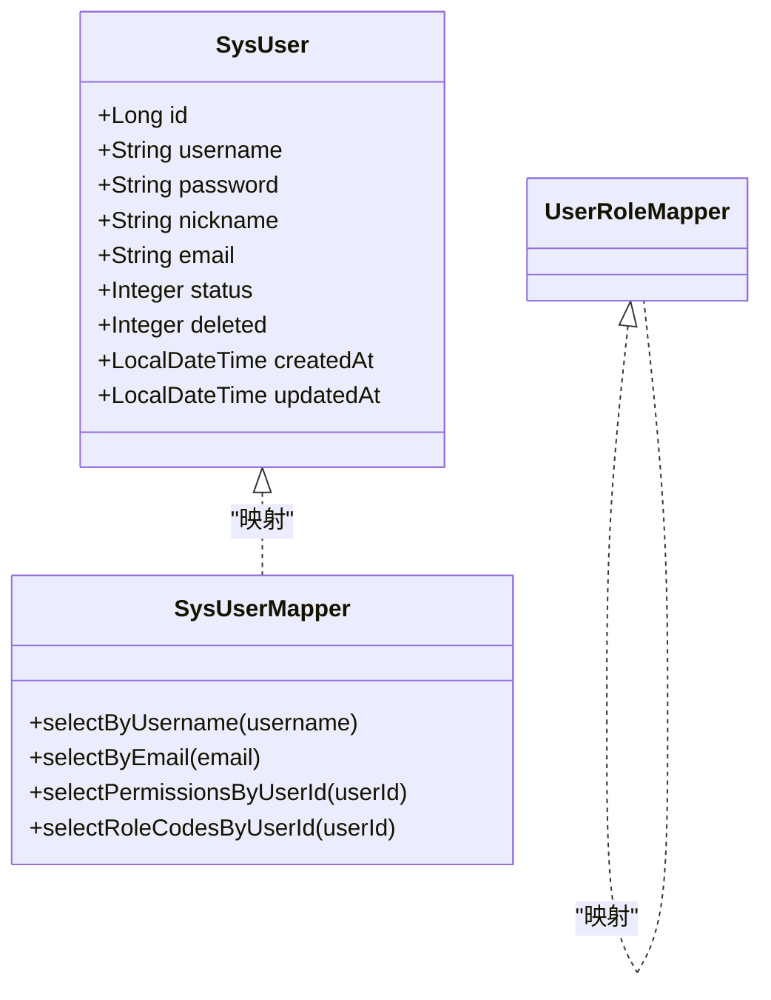
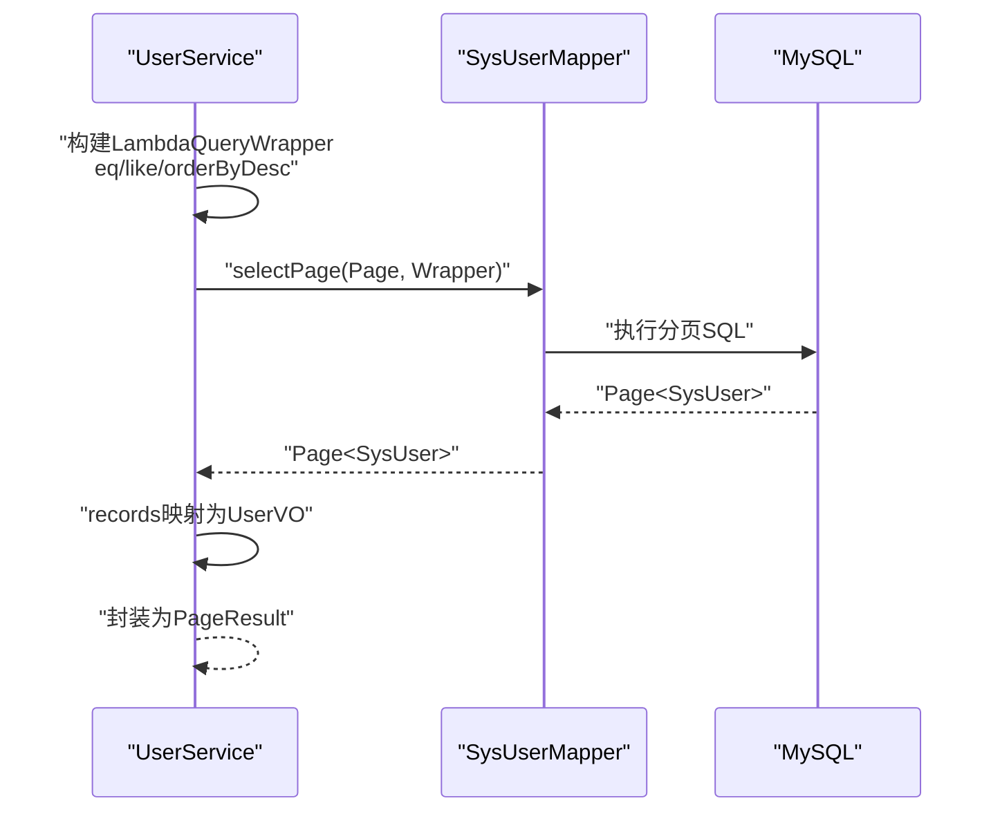
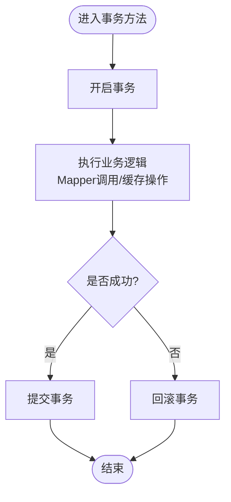
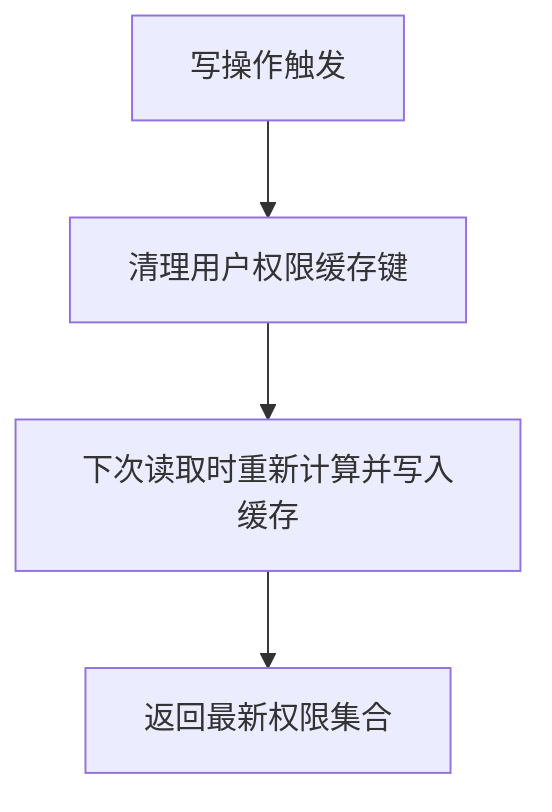
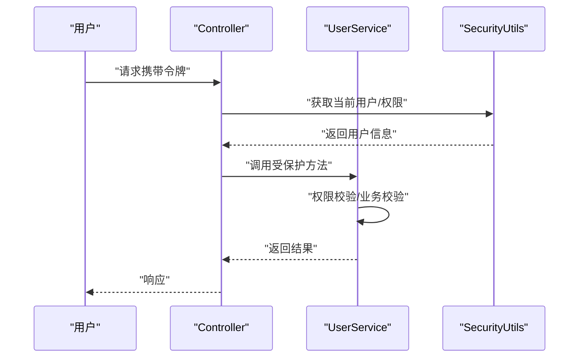
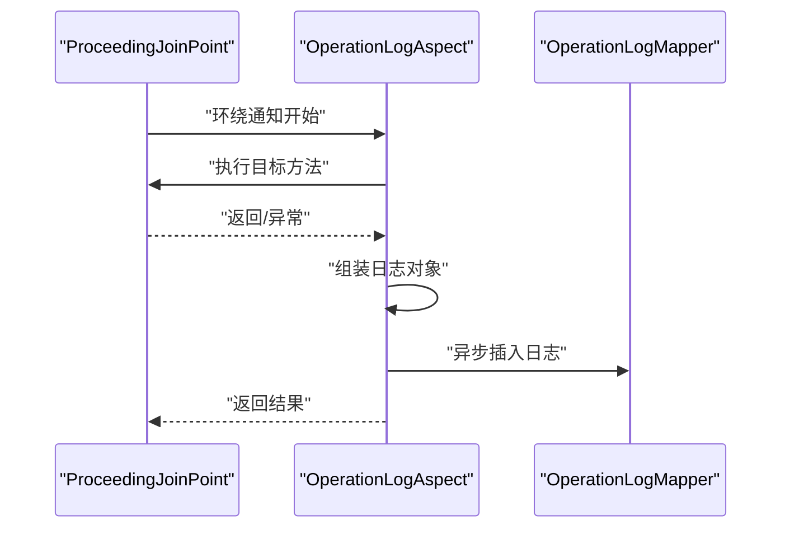
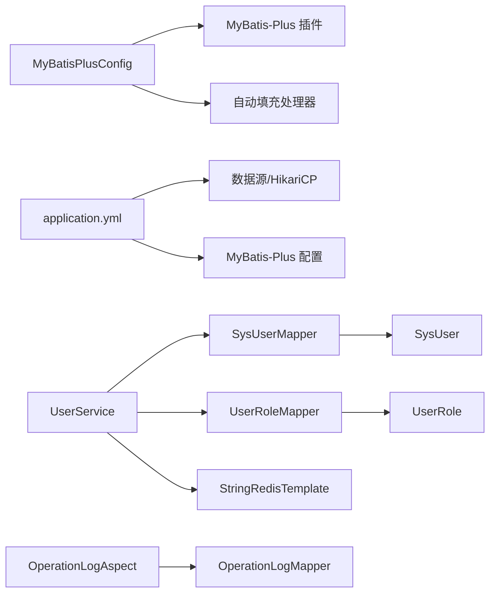

# 数据访问模式

<cite>
**本文引用的文件**
- [MyBatisPlusConfig.java](file://netdata-ai-backend/src/main/java/com/netdata/ops/config/MyBatisPlusConfig.java)
- [SysUser.java](file://netdata-ai-backend/src/main/java/com/netdata/ops/entity/SysUser.java)
- [SysUserMapper.java](file://netdata-ai-backend/src/main/java/com/netdata/ops/mapper/SysUserMapper.java)
- [UserRoleMapper.java](file://netdata-ai-backend/src/main/java/com/netdata/ops/mapper/UserRoleMapper.java)
- [UserService.java](file://netdata-ai-backend/src/main/java/com/netdata/ops/service/UserService.java)
- [application.yml](file://netdata-ai-backend/src/main/resources/application.yml)
- [GlobalExceptionHandler.java](file://netdata-ai-backend/src/main/java/com/netdata/ops/exception/GlobalExceptionHandler.java)
- [BusinessException.java](file://netdata-ai-backend/src/main/java/com/netdata/ops/exception/BusinessException.java)
- [OperationLogAspect.java](file://netdata-ai-backend/src/main/java/com/netdata/ops/aspect/OperationLogAspect.java)
- [OperationLogAnno.java](file://netdata-ai-backend/src/main/java/com/netdata/ops/annotation/OperationLogAnno.java)
- [OperationLogMapper.java](file://netdata-ai-backend/src/main/java/com/netdata/ops/mapper/OperationLogMapper.java)
- [PageResult.java](file://netdata-ai-backend/src/main/java/com/netdata/ops/dto/response/PageResult.java)
- [SecurityUtils.java](file://netdata-ai-backend/src/main/java/com/netdata/ops/util/SecurityUtils.java)
</cite>

## 目录
1. [引言](#引言)
2. [项目结构](#项目结构)
3. [核心组件](#核心组件)
4. [架构总览](#架构总览)
5. [详细组件分析](#详细组件分析)
6. [依赖分析](#依赖分析)
7. [性能考虑](#性能考虑)
8. [故障排查指南](#故障排查指南)
9. [结论](#结论)
10. [附录](#附录)

## 引言
本文件系统性阐述系统的数据访问模式，围绕 MyBatis-Plus 的数据访问层设计展开，覆盖通用 Mapper 接口、条件构造器与分页查询的使用范式；深入说明事务管理策略（声明式事务、手动事务控制）；解释缓存策略（基于 Redis 的应用层缓存与 MyBatis-Plus 二级缓存配置现状）；给出性能优化建议（批量操作、连接池与 SQL 优化）；明确安全控制（SQL 注入防护、参数绑定、权限验证）；并提供监控与日志记录方案以及异常处理与错误恢复机制。

## 项目结构
本项目采用典型的分层架构：控制器层、服务层、数据访问层（Mapper/Entity）、配置层与基础设施（Redis、数据库）。数据访问层以 MyBatis-Plus 为核心，结合 Spring Boot 自动装配与配置文件完成初始化与行为定制。

图示来源
- [MyBatisPlusConfig.java:18-51](file://netdata-ai-backend/src/main/java/com/netdata/ops/config/MyBatisPlusConfig.java#L18-L51)
- [application.yml:31-84](file://netdata-ai-backend/src/main/resources/application.yml#L31-L84)
- [SysUserMapper.java:11-33](file://netdata-ai-backend/src/main/java/com/netdata/ops/mapper/SysUserMapper.java#L11-L33)
- [UserRoleMapper.java:7-9](file://netdata-ai-backend/src/main/java/com/netdata/ops/mapper/UserRoleMapper.java#L7-L9)
- [OperationLogMapper.java:7-9](file://netdata-ai-backend/src/main/java/com/netdata/ops/mapper/OperationLogMapper.java#L7-L9)
- [SysUser.java:12-56](file://netdata-ai-backend/src/main/java/com/netdata/ops/entity/SysUser.java#L12-L56)
- [UserService.java:35-38](file://netdata-ai-backend/src/main/java/com/netdata/ops/service/UserService.java#L35-L38)

章节来源
- [MyBatisPlusConfig.java:18-51](file://netdata-ai-backend/src/main/java/com/netdata/ops/config/MyBatisPlusConfig.java#L18-L51)
- [application.yml:31-84](file://netdata-ai-backend/src/main/resources/application.yml#L31-L84)

## 核心组件
- MyBatis-Plus 配置：分页插件与自动填充（创建/更新时间），统一由配置类注册。
- 实体模型：SysUser 使用逻辑删除与自动填充字段，确保数据生命周期与审计信息一致。
- Mapper 接口：SysUserMapper 提供自定义 SQL 查询（用户名/邮箱唯一性、权限与角色查询）；UserRoleMapper 为基础 CRUD。
- 服务层：UserService 封装业务流程，使用声明式事务与 Redis 缓存，实现用户管理、角色分配、权限缓存清理等。
- 配置文件：application.yml 统一管理数据源、Redis、MyBatis-Plus 全局配置（驼峰映射、下划线映射、日志实现、逻辑删除字段与值）。
- 异常与日志：全局异常处理器集中处理业务异常与各类运行期异常；操作日志 AOP 切面异步记录关键操作。

章节来源
- [MyBatisPlusConfig.java:24-50](file://netdata-ai-backend/src/main/java/com/netdata/ops/config/MyBatisPlusConfig.java#L24-L50)
- [SysUser.java:48-55](file://netdata-ai-backend/src/main/java/com/netdata/ops/entity/SysUser.java#L48-L55)
- [SysUserMapper.java:14-32](file://netdata-ai-backend/src/main/java/com/netdata/ops/mapper/SysUserMapper.java#L14-L32)
- [UserRoleMapper.java:7-9](file://netdata-ops-backend/src/main/java/com/netdata/ops/mapper/UserRoleMapper.java#L7-L9)
- [UserService.java:35-38](file://netdata-ai-backend/src/main/java/com/netdata/ops/service/UserService.java#L35-L38)
- [application.yml:71-84](file://netdata-ai-backend/src/main/resources/application.yml#L71-L84)
- [GlobalExceptionHandler.java:32-138](file://netdata-ai-backend/src/main/java/com/netdata/ops/exception/GlobalExceptionHandler.java#L32-L138)
- [OperationLogAspect.java:37-109](file://netdata-ai-backend/src/main/java/com/netdata/ops/aspect/OperationLogAspect.java#L37-L109)

## 架构总览
数据访问层通过 MyBatis-Plus 与数据库交互，配合 Spring 管理的事务与 Redis 缓存，形成“查询-缓存-写入”的闭环。服务层负责业务编排与事务边界，异常与日志贯穿各层，保障可观测性与可维护性。

图示来源
- [UserService.java:45-63](file://netdata-ai-backend/src/main/java/com/netdata/ops/service/UserService.java#L45-L63)
- [SysUserMapper.java:14-32](file://netdata-ai-backend/src/main/java/com/netdata/ops/mapper/SysUserMapper.java#L14-L32)
- [UserRoleMapper.java:7-9](file://netdata-ai-backend/src/main/java/com/netdata/ops/mapper/UserRoleMapper.java#L7-L9)
- [application.yml:47-58](file://netdata-ai-backend/src/main/resources/application.yml#L47-L58)

## 详细组件分析

### 通用 Mapper 与实体模型
- 通用 Mapper：SysUserMapper 与 UserRoleMapper 均继承 BaseMapper，天然具备标准 CRUD 能力；SysUserMapper 扩展自定义 SQL 查询。
- 实体模型：SysUser 使用逻辑删除注解与自动填充字段，确保软删除与审计字段的一致性。

图示来源
- [SysUser.java:12-56](file://netdata-ai-backend/src/main/java/com/netdata/ops/entity/SysUser.java#L12-L56)
- [SysUserMapper.java:11-33](file://netdata-ai-backend/src/main/java/com/netdata/ops/mapper/SysUserMapper.java#L11-L33)
- [UserRoleMapper.java:7-9](file://netdata-ai-backend/src/main/java/com/netdata/ops/mapper/UserRoleMapper.java#L7-L9)

章节来源
- [SysUser.java:48-55](file://netdata-ai-backend/src/main/java/com/netdata/ops/entity/SysUser.java#L48-L55)
- [SysUserMapper.java:14-32](file://netdata-ai-backend/src/main/java/com/netdata/ops/mapper/SysUserMapper.java#L14-L32)
- [UserRoleMapper.java:7-9](file://netdata-ai-backend/src/main/java/com/netdata/ops/mapper/UserRoleMapper.java#L7-L9)

### 条件构造器与分页查询
- 条件构造器：LambdaQueryWrapper 在服务层构建查询条件，支持多字段模糊匹配与排序组合。
- 分页查询：Page 对象与 selectPage 完成分页查询，PageResult 作为响应封装。

图示来源
- [UserService.java:45-63](file://netdata-ai-backend/src/main/java/com/netdata/ops/service/UserService.java#L45-L63)
- [PageResult.java:21-29](file://netdata-ai-backend/src/main/java/com/netdata/ops/dto/response/PageResult.java#L21-L29)

章节来源
- [UserService.java:45-63](file://netdata-ai-backend/src/main/java/com/netdata/ops/service/UserService.java#L45-L63)
- [PageResult.java:13-30](file://netdata-ai-backend/src/main/java/com/netdata/ops/dto/response/PageResult.java#L13-L30)

### 事务管理策略
- 声明式事务：在 UserService 的多个业务方法上使用 @Transactional，确保用户创建、更新、删除、角色分配、密码重置等操作处于同一事务上下文。
- 手动事务控制：在需要跨多个 Mapper 或复杂分支场景时，可通过 PlatformTransactionManager 进行编程式事务控制（本项目未直接出现，但框架已提供能力）。
- 分布式事务：当前未发现分布式事务实现（如 Seata），默认单库事务满足需求。

图示来源
- [UserService.java:79-224](file://netdata-ai-backend/src/main/java/com/netdata/ops/service/UserService.java#L79-L224)

章节来源
- [UserService.java:79-224](file://netdata-ai-backend/src/main/java/com/netdata/ops/service/UserService.java#L79-L224)

### 缓存策略
- 应用层缓存：UserService 在用户删除与角色变更后主动清理 Redis 中的权限缓存键，确保缓存与数据库一致性。
- MyBatis-Plus 二级缓存：application.yml 中未启用二级缓存，因此未使用 MyBatis-Plus 的二级缓存能力。

图示来源
- [UserService.java:229-231](file://netdata-ai-backend/src/main/java/com/netdata/ops/service/UserService.java#L229-L231)
- [application.yml:71-84](file://netdata-ai-backend/src/main/resources/application.yml#L71-L84)

章节来源
- [UserService.java:229-231](file://netdata-ai-backend/src/main/java/com/netdata/ops/service/UserService.java#L229-L231)
- [application.yml:71-84](file://netdata-ai-backend/src/main/resources/application.yml#L71-L84)

### 安全控制
- SQL 注入防护：使用 MyBatis-Plus 的参数绑定与条件构造器，避免字符串拼接；SysUserMapper 的自定义 SQL 使用 @Param 绑定参数。
- 参数绑定：所有外部输入通过 DTO 与 @Param 显式绑定，减少误用风险。
- 权限验证：SecurityUtils 提供当前用户权限与角色判断，结合 Spring Security 注解与切面实现细粒度权限控制。

图示来源
- [SysUserMapper.java:14-32](file://netdata-ai-backend/src/main/java/com/netdata/ops/mapper/SysUserMapper.java#L14-L32)
- [SecurityUtils.java:17-59](file://netdata-ai-backend/src/main/java/com/netdata/ops/util/SecurityUtils.java#L17-L59)

章节来源
- [SysUserMapper.java:14-32](file://netdata-ai-backend/src/main/java/com/netdata/ops/mapper/SysUserMapper.java#L14-L32)
- [SecurityUtils.java:17-59](file://netdata-ai-backend/src/main/java/com/netdata/ops/util/SecurityUtils.java#L17-L59)

### 监控与日志记录
- 操作日志：OperationLogAspect 基于 AOP 切面拦截带 @OperationLogAnno 注解的方法，异步记录模块、动作、耗时、用户、请求参数与异常信息。
- 全局异常：GlobalExceptionHandler 统一捕获业务异常、参数校验异常、认证异常等，输出结构化响应并记录日志。
- 配置日志：application.yml 设置控制台与文件日志格式，包含 traceId，便于链路追踪。

图示来源
- [OperationLogAspect.java:37-109](file://netdata-ai-backend/src/main/java/com/netdata/ops/aspect/OperationLogAspect.java#L37-L109)
- [OperationLogMapper.java:7-9](file://netdata-ai-backend/src/main/java/com/netdata/ops/mapper/OperationLogMapper.java#L7-L9)
- [GlobalExceptionHandler.java:32-138](file://netdata-ai-backend/src/main/java/com/netdata/ops/exception/GlobalExceptionHandler.java#L32-L138)
- [application.yml:259-270](file://netdata-ai-backend/src/main/resources/application.yml#L259-L270)

章节来源
- [OperationLogAspect.java:37-109](file://netdata-ai-backend/src/main/java/com/netdata/ops/aspect/OperationLogAspect.java#L37-L109)
- [OperationLogAnno.java:12-28](file://netdata-ai-backend/src/main/java/com/netdata/ops/annotation/OperationLogAnno.java#L12-L28)
- [OperationLogMapper.java:7-9](file://netdata-ai-backend/src/main/java/com/netdata/ops/mapper/OperationLogMapper.java#L7-L9)
- [GlobalExceptionHandler.java:32-138](file://netdata-ai-backend/src/main/java/com/netdata/ops/exception/GlobalExceptionHandler.java#L32-L138)
- [application.yml:259-270](file://netdata-ai-backend/src/main/resources/application.yml#L259-L270)

### 异常处理与错误恢复
- 业务异常：通过 BusinessException 传递业务码与消息，由 GlobalExceptionHandler 统一包装为响应。
- 运行期异常：对认证、权限、参数、HTTP 方法等异常进行分类处理，返回标准化错误码与提示。
- 错误恢复：日志记录与链路追踪（traceId）便于定位问题；对于幂等性要求高的接口，可在控制器层引入重试与去重策略。

章节来源
- [BusinessException.java:9-27](file://netdata-ai-backend/src/main/java/com/netdata/ops/exception/BusinessException.java#L9-L27)
- [GlobalExceptionHandler.java:32-138](file://netdata-ai-backend/src/main/java/com/netdata/ops/exception/GlobalExceptionHandler.java#L32-L138)

## 依赖分析
- 配置依赖：MyBatisPlusConfig 依赖 MyBatis-Plus 插件与自动填充处理器；application.yml 提供数据源与 MyBatis-Plus 全局配置。
- Mapper 依赖：SysUserMapper 依赖 SysUser 实体；UserRoleMapper 依赖 UserRole 实体；两者均依赖通用 BaseMapper。
- 服务依赖：UserService 依赖 SysUserMapper、UserRoleMapper、PasswordEncoder、StringRedisTemplate，并通过 SecurityUtils 获取当前用户上下文。
- 日志与异常：OperationLogAspect 依赖 OperationLogMapper 与 ObjectMapper；GlobalExceptionHandler 统一处理异常。

图示来源
- [MyBatisPlusConfig.java:24-50](file://netdata-ai-backend/src/main/java/com/netdata/ops/config/MyBatisPlusConfig.java#L24-L50)
- [application.yml:31-84](file://netdata-ai-backend/src/main/resources/application.yml#L31-L84)
- [SysUserMapper.java:11-33](file://netdata-ai-backend/src/main/java/com/netdata/ops/mapper/SysUserMapper.java#L11-L33)
- [UserRoleMapper.java:7-9](file://netdata-ai-backend/src/main/java/com/netdata/ops/mapper/UserRoleMapper.java#L7-L9)
- [UserService.java:35-38](file://netdata-ai-backend/src/main/java/com/netdata/ops/service/UserService.java#L35-L38)
- [OperationLogAspect.java:34-35](file://netdata-ai-backend/src/main/java/com/netdata/ops/aspect/OperationLogAspect.java#L34-L35)
- [OperationLogMapper.java:7-9](file://netdata-ai-backend/src/main/java/com/netdata/ops/mapper/OperationLogMapper.java#L7-L9)

章节来源
- [MyBatisPlusConfig.java:24-50](file://netdata-ai-backend/src/main/java/com/netdata/ops/config/MyBatisPlusConfig.java#L24-L50)
- [application.yml:31-84](file://netdata-ai-backend/src/main/resources/application.yml#L31-L84)
- [SysUserMapper.java:11-33](file://netdata-ai-backend/src/main/java/com/netdata/ops/mapper/SysUserMapper.java#L11-L33)
- [UserRoleMapper.java:7-9](file://netdata-ai-backend/src/main/java/com/netdata/ops/mapper/UserRoleMapper.java#L7-L9)
- [UserService.java:35-38](file://netdata-ai-backend/src/main/java/com/netdata/ops/service/UserService.java#L35-L38)
- [OperationLogAspect.java:34-35](file://netdata-ai-backend/src/main/java/com/netdata/ops/aspect/OperationLogAspect.java#L34-L35)
- [OperationLogMapper.java:7-9](file://netdata-ai-backend/src/main/java/com/netdata/ops/mapper/OperationLogMapper.java#L7-L9)

## 性能考虑
- 连接池配置：application.yml 中 HikariCP 的最小空闲、最大连接数、空闲超时、连接超时等参数已配置，建议根据 QPS 与并发峰值调整。
- 分页限制：MyBatis-Plus 分页插件设置最大单次查询条数，防止大页导致内存压力。
- SQL 优化：使用条件构造器避免 N+1 查询；对高频查询建立必要索引（如 username、email、deleted 等）。
- 缓存策略：应用层缓存优先，避免 MyBatis-Plus 二级缓存带来的复杂一致性问题；对热点数据设置合理过期策略。
- 批量操作：批量插入/更新建议使用 MyBatis-Plus 的批量工具或 JDBC 批处理，减少往返次数。
- 日志与监控：开启 SLF4J 实现的日志输出，结合 traceId 与 Prometheus 指标，定位慢查询与异常。

章节来源
- [application.yml:36-42](file://netdata-ai-backend/src/main/resources/application.yml#L36-L42)
- [MyBatisPlusConfig.java:27-31](file://netdata-ai-backend/src/main/java/com/netdata/ops/config/MyBatisPlusConfig.java#L27-L31)
- [application.yml:78](file://netdata-ai-backend/src/main/resources/application.yml#L78)

## 故障排查指南
- 业务异常：通过 BusinessException 抛出并由 GlobalExceptionHandler 统一返回，检查错误码与消息映射。
- 参数校验：MethodArgumentNotValidException 与 BindException 会返回字段级错误提示，核对 DTO 字段注解与前端传参。
- 认证与权限：BadCredentialsException、AccessDeniedException 会返回相应状态码，检查 JWT 令牌与权限矩阵。
- 操作日志：若日志未落库，检查 OperationLogAspect 是否生效、OperationLogMapper 是否正确扫描、Redis 是否可用（异步写入）。
- 数据一致性：用户删除与角色变更后权限缓存未命中，确认 UserService 是否调用了缓存清理逻辑。

章节来源
- [GlobalExceptionHandler.java:32-138](file://netdata-ai-backend/src/main/java/com/netdata/ops/exception/GlobalExceptionHandler.java#L32-L138)
- [OperationLogAspect.java:37-109](file://netdata-ai-backend/src/main/java/com/netdata/ops/aspect/OperationLogAspect.java#L37-L109)
- [UserService.java:229-231](file://netdata-ai-backend/src/main/java/com/netdata/ops/service/UserService.java#L229-L231)

## 结论
本项目以 MyBatis-Plus 为核心的数据访问层，结合声明式事务、应用层缓存与完善的日志/异常体系，实现了高内聚、低耦合且易于扩展的数据访问模式。通过合理的连接池与分页策略、严格的参数绑定与权限验证，以及可观测性的日志与监控，整体具备良好的性能与可靠性基础。后续可在热点数据引入更细粒度的缓存策略与批量优化，并视业务发展引入分布式事务能力。

## 附录
- 关键路径参考
  - 分页查询：[UserService.java:45-63](file://netdata-ai-backend/src/main/java/com/netdata/ops/service/UserService.java#L45-L63)
  - 条件构造器：[UserService.java:47-54](file://netdata-ai-backend/src/main/java/com/netdata/ops/service/UserService.java#L47-L54)
  - 自定义查询（权限/角色）：[SysUserMapper.java:20-32](file://netdata-ai-backend/src/main/java/com/netdata/ops/mapper/SysUserMapper.java#L20-L32)
  - 事务边界：[UserService.java:79-224](file://netdata-ai-backend/src/main/java/com/netdata/ops/service/UserService.java#L79-L224)
  - 缓存清理：[UserService.java:229-231](file://netdata-ai-backend/src/main/java/com/netdata/ops/service/UserService.java#L229-L231)
  - 日志切面：[OperationLogAspect.java:37-109](file://netdata-ai-backend/src/main/java/com/netdata/ops/aspect/OperationLogAspect.java#L37-L109)
  - 全局异常：[GlobalExceptionHandler.java:32-138](file://netdata-ai-backend/src/main/java/com/netdata/ops/exception/GlobalExceptionHandler.java#L32-L138)