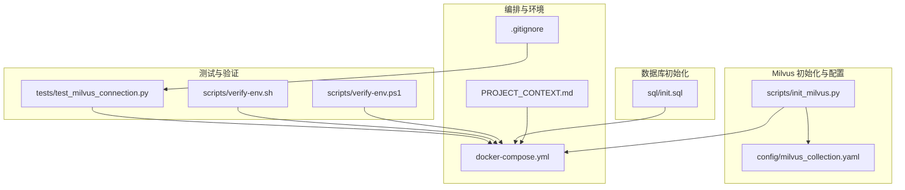
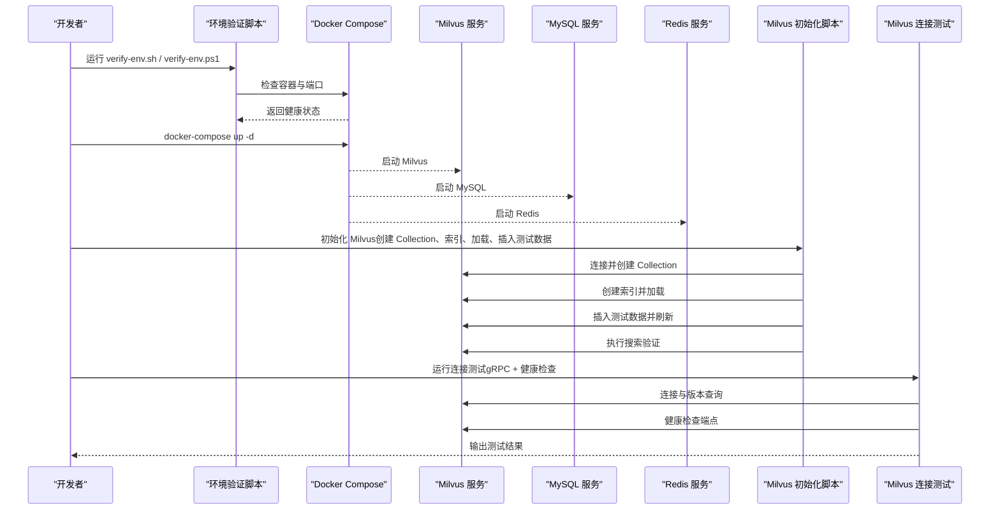
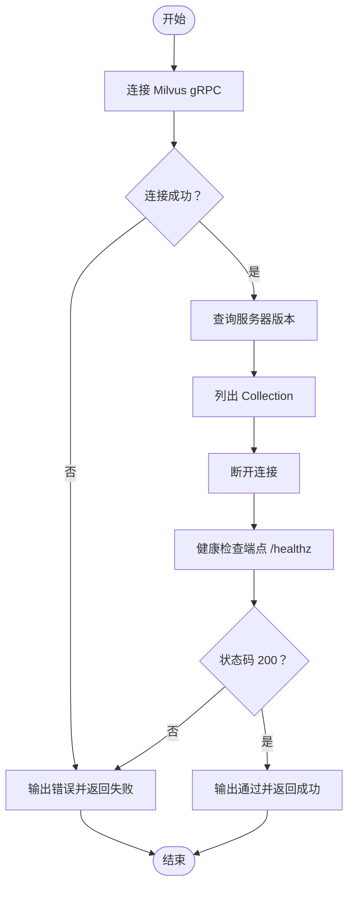
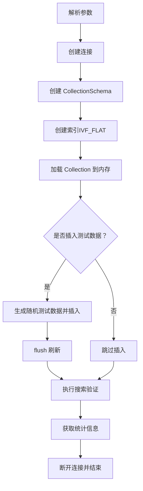
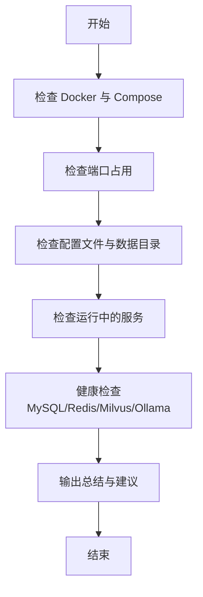
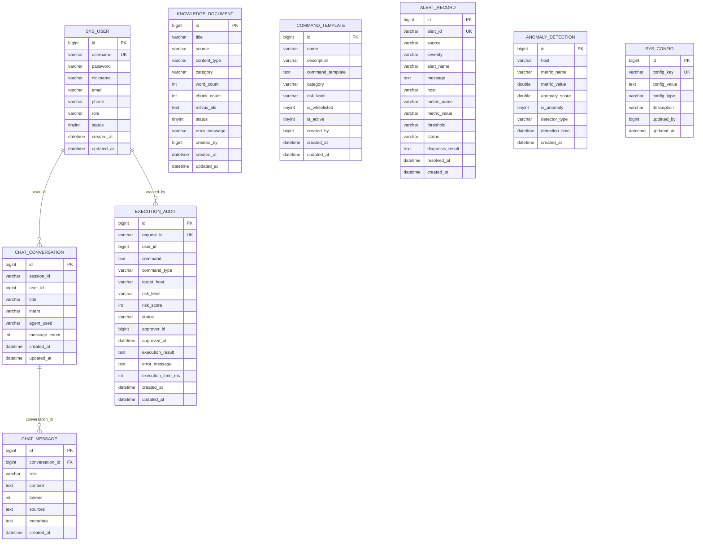
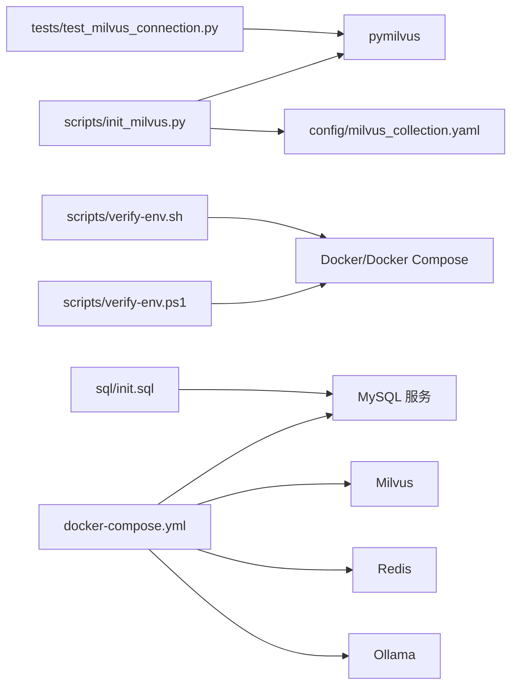

# 测试与质量保证

<cite>
**本文引用的文件**
- [test_milvus_connection.py](file://tests/test_milvus_connection.py)
- [init_milvus.py](file://scripts/init_milvus.py)
- [milvus_collection.yaml](file://config/milvus_collection.yaml)
- [docker-compose.yml](file://docker-compose.yml)
- [init.sql](file://sql/init.sql)
- [verify-env.sh](file://scripts/verify-env.sh)
- [verify-env.ps1](file://scripts/verify-env.ps1)
- [PROJECT_CONTEXT.md](file://PROJECT_CONTEXT.md)
- [.gitignore](file://.gitignore)
</cite>

## 目录
1. [简介](#简介)
2. [项目结构](#项目结构)
3. [核心组件](#核心组件)
4. [架构总览](#架构总览)
5. [详细组件分析](#详细组件分析)
6. [依赖分析](#依赖分析)
7. [性能考虑](#性能考虑)
8. [故障排查指南](#故障排查指南)
9. [结论](#结论)
10. [附录](#附录)

## 简介
本文件为“智能运维系统”提供全面的测试与质量保证文档，聚焦以下方面：
- 单元测试框架设计与实现：测试用例设计思路、Mock 数据准备、测试覆盖率分析方法
- 集成测试策略：端到端测试流程、性能测试方案、回归测试机制
- Milvus 连接测试与数据库连接稳定性保障
- 代码质量保证：代码审查标准、静态分析工具使用、持续集成配置
- 测试环境搭建与测试数据管理策略
- 测试自动化与测试报告生成

## 项目结构
项目采用多服务容器化架构，核心服务包括 Milvus 向量数据库、MySQL 关系数据库、Redis 缓存、Ollama 本地推理服务，并通过 Docker Compose 一键编排。测试与质量保证围绕以下关键文件展开：
- 测试脚本：tests/test_milvus_connection.py
- 初始化与验证脚本：scripts/init_milvus.py、scripts/verify-env.sh、scripts/verify-env.ps1
- 配置与初始化：config/milvus_collection.yaml、sql/init.sql
- 项目上下文：PROJECT_CONTEXT.md
- 通用忽略规则：.gitignore

图表来源
- [test_milvus_connection.py:1-148](file://tests/test_milvus_connection.py#L1-L148)
- [init_milvus.py:1-516](file://scripts/init_milvus.py#L1-L516)
- [milvus_collection.yaml:1-186](file://config/milvus_collection.yaml#L1-L186)
- [docker-compose.yml:1-357](file://docker-compose.yml#L1-L357)
- [init.sql:1-274](file://sql/init.sql#L1-L274)
- [verify-env.sh:1-318](file://scripts/verify-env.sh#L1-L318)
- [verify-env.ps1:1-251](file://scripts/verify-env.ps1#L1-L251)
- [PROJECT_CONTEXT.md:1-166](file://PROJECT_CONTEXT.md#L1-L166)
- [.gitignore:51-132](file://.gitignore#L51-L132)

章节来源
- [PROJECT_CONTEXT.md:120-149](file://PROJECT_CONTEXT.md#L120-L149)
- [docker-compose.yml:1-357](file://docker-compose.yml#L1-L357)

## 核心组件
- Milvus 连接测试：验证 gRPC 连接与健康检查端点，评估连接性能与可用性
- Milvus 初始化脚本：创建 Collection、配置索引、加载到内存、插入测试数据、执行搜索验证
- 环境验证脚本：跨平台检查 Docker 环境、端口占用、配置文件、数据目录与服务健康状态
- MySQL 初始化脚本：创建系统表、命令模板、告警记录、异常检测结果等表结构与基础数据
- 配置文件：Milvus Collection 结构与索引参数的 YAML 配置
- 项目上下文：明确技术栈、Agent 架构、RAG 方案与开发阶段

章节来源
- [test_milvus_connection.py:33-78](file://tests/test_milvus_connection.py#L33-L78)
- [init_milvus.py:106-131](file://scripts/init_milvus.py#L106-L131)
- [verify-env.sh:63-121](file://scripts/verify-env.sh#L63-L121)
- [init.sql:22-246](file://sql/init.sql#L22-L246)
- [milvus_collection.yaml:19-185](file://config/milvus_collection.yaml#L19-L185)
- [PROJECT_CONTEXT.md:25-61](file://PROJECT_CONTEXT.md#L25-L61)

## 架构总览
测试与质量保证贯穿系统生命周期，从环境搭建、服务健康检查、Milvus 连接与初始化、数据库初始化，到性能与稳定性评估。

图表来源
- [verify-env.sh:63-260](file://scripts/verify-env.sh#L63-L260)
- [docker-compose.yml:23-154](file://docker-compose.yml#L23-L154)
- [init_milvus.py:457-512](file://scripts/init_milvus.py#L457-L512)
- [test_milvus_connection.py:118-143](file://tests/test_milvus_connection.py#L118-L143)

## 详细组件分析

### Milvus 连接测试组件
- 功能概述：验证 Milvus 服务连通性、健康检查端点可用性、连接耗时与版本信息
- 关键流程：
  - gRPC 连接测试：建立连接、记录耗时、查询版本、列出 Collection、断开连接
  - 健康检查端点：HTTP GET /healthz，校验状态码与响应时间
- 设计要点：
  - 超时控制（连接与 HTTP 请求）
  - 异常捕获与错误输出
  - 结果汇总与退出码

图表来源
- [test_milvus_connection.py:33-78](file://tests/test_milvus_connection.py#L33-L78)
- [test_milvus_connection.py:81-115](file://tests/test_milvus_connection.py#L81-L115)
- [test_milvus_connection.py:118-143](file://tests/test_milvus_connection.py#L118-L143)

章节来源
- [test_milvus_connection.py:33-143](file://tests/test_milvus_connection.py#L33-L143)

### Milvus 初始化组件
- 功能概述：创建 Collection、配置索引、加载到内存、插入测试数据、执行搜索验证
- 关键流程：
  - 建立连接
  - 创建 Collection（字段、Schema、分片）
  - 创建索引（IVF_FLAT 参数）
  - 加载 Collection 到内存
  - 插入测试数据（随机向量）
  - 搜索验证（Top-K）
  - 统计信息输出
- 设计要点：
  - 配置类封装 CollectionConfig，统一管理维度、度量、索引参数
  - 日志记录关键步骤与异常
  - 命令行参数支持覆盖行为（重建、跳过搜索、测试数据数量）

图表来源
- [init_milvus.py:457-512](file://scripts/init_milvus.py#L457-L512)
- [init_milvus.py:133-241](file://scripts/init_milvus.py#L133-L241)
- [init_milvus.py:244-293](file://scripts/init_milvus.py#L244-L293)
- [init_milvus.py:296-318](file://scripts/init_milvus.py#L296-L318)
- [init_milvus.py:321-377](file://scripts/init_milvus.py#L321-L377)
- [init_milvus.py:380-432](file://scripts/init_milvus.py#L380-L432)
- [init_milvus.py:435-454](file://scripts/init_milvus.py#L435-L454)

章节来源
- [init_milvus.py:75-104](file://scripts/init_milvus.py#L75-L104)
- [init_milvus.py:106-131](file://scripts/init_milvus.py#L106-L131)
- [init_milvus.py:133-241](file://scripts/init_milvus.py#L133-L241)
- [init_milvus.py:244-293](file://scripts/init_milvus.py#L244-L293)
- [init_milvus.py:296-318](file://scripts/init_milvus.py#L296-L318)
- [init_milvus.py:321-377](file://scripts/init_milvus.py#L321-L377)
- [init_milvus.py:380-432](file://scripts/init_milvus.py#L380-L432)
- [init_milvus.py:435-454](file://scripts/init_milvus.py#L435-L454)

### 环境验证组件
- 功能概述：跨平台检查 Docker 环境、端口占用、配置文件、数据目录与服务健康状态
- 关键流程：
  - 检查 Docker 与 Compose
  - 检查端口占用（MySQL、Redis、Milvus、Ollama、MinIO）
  - 检查配置文件与数据目录
  - 查询运行中的服务并进行健康检查
  - 输出总结与后续操作建议

图表来源
- [verify-env.sh:63-121](file://scripts/verify-env.sh#L63-L121)
- [verify-env.sh:128-150](file://scripts/verify-env.sh#L128-L150)
- [verify-env.sh:156-185](file://scripts/verify-env.sh#L156-L185)
- [verify-env.sh:218-230](file://scripts/verify-env.sh#L218-L230)
- [verify-env.sh:235-260](file://scripts/verify-env.sh#L235-L260)
- [verify-env.ps1:35-80](file://scripts/verify-env.ps1#L35-L80)
- [verify-env.ps1:86-106](file://scripts/verify-env.ps1#L86-L106)
- [verify-env.ps1:113-139](file://scripts/verify-env.ps1#L113-L139)
- [verify-env.ps1:160-169](file://scripts/verify-env.ps1#L160-L169)
- [verify-env.ps1:178-196](file://scripts/verify-env.ps1#L178-L196)

章节来源
- [verify-env.sh:63-260](file://scripts/verify-env.sh#L63-L260)
- [verify-env.ps1:35-196](file://scripts/verify-env.ps1#L35-L196)

### 数据库初始化组件
- 功能概述：创建系统用户、知识库文档、对话历史、命令执行审计、告警记录、异常检测结果等表结构与基础数据
- 关键流程：
  - 设置字符集与外键约束
  - 创建各业务表（含索引）
  - 插入默认管理员与常用命令模板
  - 创建统计视图（告警与执行）

图表来源
- [init.sql:22-246](file://sql/init.sql#L22-L246)

章节来源
- [init.sql:22-246](file://sql/init.sql#L22-L246)

## 依赖分析
- 组件耦合关系：
  - 测试脚本依赖 Milvus SDK 与健康检查端点
  - 初始化脚本依赖 Milvus SDK 与配置文件
  - 环境验证脚本依赖 Docker 与系统命令
  - MySQL 初始化脚本依赖数据库服务
- 外部依赖：
  - Milvus 2.4+（pymilvus）
  - Docker 与 Docker Compose
  - Python 标准库与第三方库（如 requests、urllib）

图表来源
- [test_milvus_connection.py:25-30](file://tests/test_milvus_connection.py#L25-L30)
- [init_milvus.py:40-54](file://scripts/init_milvus.py#L40-L54)
- [milvus_collection.yaml:1-186](file://config/milvus_collection.yaml#L1-L186)
- [verify-env.sh:68-97](file://scripts/verify-env.sh#L68-L97)
- [verify-env.ps1:39-71](file://scripts/verify-env.ps1#L39-L71)
- [init.sql:1-274](file://sql/init.sql#L1-L274)
- [docker-compose.yml:23-154](file://docker-compose.yml#L23-L154)

章节来源
- [test_milvus_connection.py:25-30](file://tests/test_milvus_connection.py#L25-L30)
- [init_milvus.py:40-54](file://scripts/init_milvus.py#L40-L54)
- [docker-compose.yml:23-154](file://docker-compose.yml#L23-L154)

## 性能考虑
- Milvus 连接性能：
  - 记录连接耗时，便于评估网络与服务延迟
  - 健康检查端点状态码与响应时间用于快速判定服务可用性
- Milvus 初始化性能：
  - 索引类型选择（IVF_FLAT）平衡检索精度与速度
  - nlist 与 nprobe 参数对检索性能与精度的影响
  - 数据量预估与内存占用估算
- 环境资源：
  - Docker 内存分配建议至少 8GB，满足 Milvus 需求
  - 端口占用检查避免冲突导致启动失败

章节来源
- [test_milvus_connection.py:46-60](file://tests/test_milvus_connection.py#L46-L60)
- [test_milvus_connection.py:98-104](file://tests/test_milvus_connection.py#L98-L104)
- [init_milvus.py:244-293](file://scripts/init_milvus.py#L244-L293)
- [init_milvus.py:435-454](file://scripts/init_milvus.py#L435-L454)
- [milvus_collection.yaml:167-184](file://config/milvus_collection.yaml#L167-L184)
- [verify-env.sh:109-121](file://scripts/verify-env.sh#L109-L121)

## 故障排查指南
- Milvus 连接失败：
  - 检查 gRPC 端口（默认 19530）与健康检查端点（默认 9091）
  - 查看 Milvus 容器日志：docker-compose logs milvus-standalone
  - 确认 Docker 资源分配充足
- 环境验证失败：
  - Docker 未安装或未运行：安装并启动 Docker Desktop
  - 端口被占用：关闭占用服务或修改 .env 中端口配置
  - 缺少配置文件：复制 .env.example 为 .env 并修改密码
- 数据库初始化失败：
  - 检查 MySQL 服务健康状态与凭据
  - 确认 init.sql 已挂载并执行
- 初始化脚本失败：
  - 确认 pymilvus 已安装且版本符合要求
  - 检查 Milvus 服务状态与网络连通性

章节来源
- [test_milvus_connection.py:137-143](file://tests/test_milvus_connection.py#L137-L143)
- [verify-env.sh:78-97](file://scripts/verify-env.sh#L78-L97)
- [verify-env.sh:128-150](file://scripts/verify-env.sh#L128-L150)
- [verify-env.sh:179-185](file://scripts/verify-env.sh#L179-L185)
- [docker-compose.yml:132-138](file://docker-compose.yml#L132-L138)
- [init.sql:1-274](file://sql/init.sql#L1-L274)
- [init_milvus.py:50-54](file://scripts/init_milvus.py#L50-L54)

## 结论
本测试与质量保证文档围绕 Milvus 连接测试、初始化脚本、环境验证与数据库初始化，提供了从单元到集成的测试策略与稳定性保障方法。通过健康检查端点、超时控制、日志记录与资源检查，能够有效提升系统的可维护性与可靠性。建议在后续阶段引入单元测试框架（如 pytest）、覆盖率工具与 CI/CD 流水线，进一步完善自动化测试体系。

## 附录

### 单元测试框架设计与实现
- 测试用例设计思路：
  - 针对 Milvus 连接与健康检查端点的关键路径进行断言
  - 使用超时控制与异常捕获确保测试鲁棒性
  - 输出连接耗时与版本信息，便于性能评估
- Mock 数据准备：
  - 初始化脚本中使用随机向量模拟嵌入向量
  - 测试数据插入后 flush，确保持久化与可见性
- 测试覆盖率分析方法：
  - 建议引入 pytest 与覆盖率工具（如 coverage.py）
  - 针对 Milvus 初始化脚本的关键函数（创建 Collection、创建索引、加载、搜索）编写单元测试
  - 使用 .gitignore 中的覆盖率相关忽略规则，避免污染仓库

章节来源
- [test_milvus_connection.py:33-115](file://tests/test_milvus_connection.py#L33-L115)
- [init_milvus.py:321-377](file://scripts/init_milvus.py#L321-L377)
- [.gitignore:88-91](file://.gitignore#L88-L91)

### 集成测试策略
- 端到端测试流程：
  - 环境验证：verify-env.sh/verify-env.ps1
  - 启动服务：docker-compose up -d
  - Milvus 初始化：init_milvus.py
  - 连接测试：test_milvus_connection.py
  - 数据库初始化：init.sql
- 性能测试方案：
  - 连接耗时与健康检查响应时间
  - 搜索性能（Top-K、nprobe 调参）
  - 数据量增长下的索引与检索表现
- 回归测试机制：
  - 将 Milvus 初始化与连接测试纳入每日流水线
  - 健康检查端点作为服务可用性回归指标

章节来源
- [verify-env.sh:63-260](file://scripts/verify-env.sh#L63-L260)
- [verify-env.ps1:35-196](file://scripts/verify-env.ps1#L35-L196)
- [docker-compose.yml:132-138](file://docker-compose.yml#L132-L138)
- [init_milvus.py:457-512](file://scripts/init_milvus.py#L457-L512)
- [test_milvus_connection.py:118-143](file://tests/test_milvus_connection.py#L118-L143)
- [init.sql:1-274](file://sql/init.sql#L1-L274)

### Milvus 连接测试实现与数据库连接稳定性保障
- 连接测试实现：
  - gRPC 连接与版本查询
  - 健康检查端点状态码校验
  - 超时控制与异常处理
- 数据库连接稳定性保障：
  - 环境验证脚本检查端口占用与服务健康
  - Docker Compose 健康检查配置
  - 初始化脚本的日志记录与错误回退

章节来源
- [test_milvus_connection.py:33-115](file://tests/test_milvus_connection.py#L33-L115)
- [docker-compose.yml:132-138](file://docker-compose.yml#L132-L138)
- [verify-env.sh:235-260](file://scripts/verify-env.sh#L235-L260)
- [verify-env.ps1:178-196](file://scripts/verify-env.ps1#L178-L196)

### 代码质量保证措施
- 代码审查标准：
  - 关键路径添加日志与异常处理
  - 配置集中化（YAML/环境变量）
  - 超时与重试策略明确
- 静态分析工具使用：
  - 建议引入 flake8、black、isort 等工具
  - 在 CI 中执行静态检查
- 持续集成配置：
  - 在 CI 中执行环境验证、Milvus 初始化与连接测试
  - 生成测试报告与覆盖率报告

章节来源
- [init_milvus.py:59-64](file://scripts/init_milvus.py#L59-L64)
- [milvus_collection.yaml:1-186](file://config/milvus_collection.yaml#L1-L186)
- [.gitignore:88-91](file://.gitignore#L88-L91)

### 测试环境搭建与测试数据管理策略
- 测试环境搭建：
  - 使用 verify-env.sh/verify-env.ps1 进行跨平台环境验证
  - 通过 docker-compose 一键启动 Milvus、MySQL、Redis、Ollama
- 测试数据管理：
  - 初始化脚本插入测试数据并 flush
  - 使用 YAML 配置管理 Milvus Collection 结构与索引参数
  - MySQL 初始化脚本提供基础业务数据

章节来源
- [verify-env.sh:63-260](file://scripts/verify-env.sh#L63-L260)
- [verify-env.ps1:35-196](file://scripts/verify-env.ps1#L35-L196)
- [docker-compose.yml:23-154](file://docker-compose.yml#L23-L154)
- [init_milvus.py:321-377](file://scripts/init_milvus.py#L321-L377)
- [milvus_collection.yaml:19-185](file://config/milvus_collection.yaml#L19-L185)
- [init.sql:1-274](file://sql/init.sql#L1-L274)

### 测试自动化与测试报告生成
- 测试自动化：
  - 环境验证脚本与 Milvus 初始化脚本可直接集成到 CI
  - 连接测试作为服务可用性检查步骤
- 测试报告生成：
  - 建议引入 pytest-html 或 junit-xml 生成报告
  - 覆盖率报告与日志收集纳入 CI Artifacts

章节来源
- [verify-env.sh:265-286](file://scripts/verify-env.sh#L265-L286)
- [verify-env.ps1:200-227](file://scripts/verify-env.ps1#L200-L227)
- [.gitignore:88-91](file://.gitignore#L88-L91)