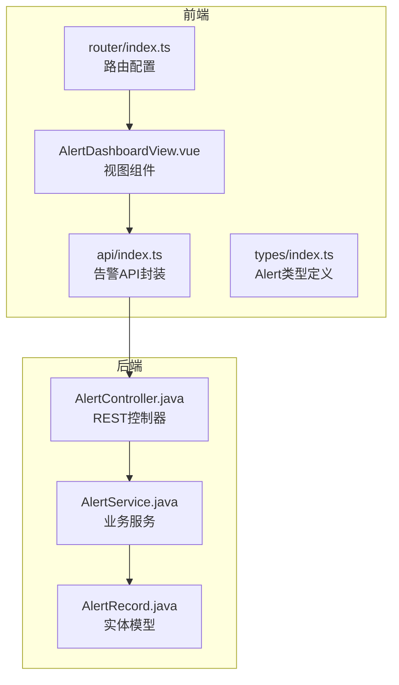
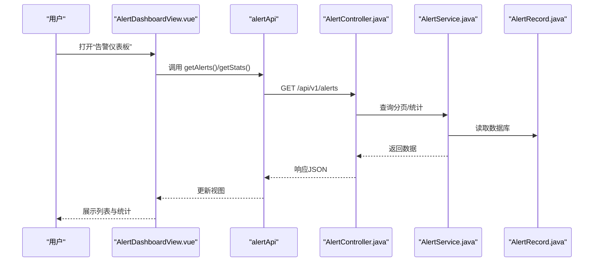
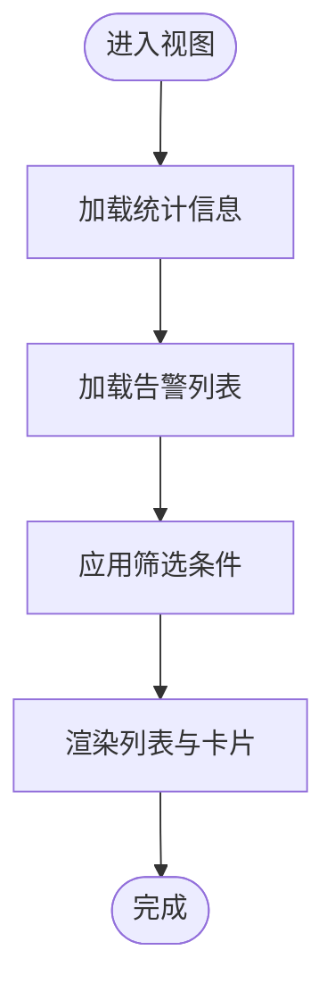
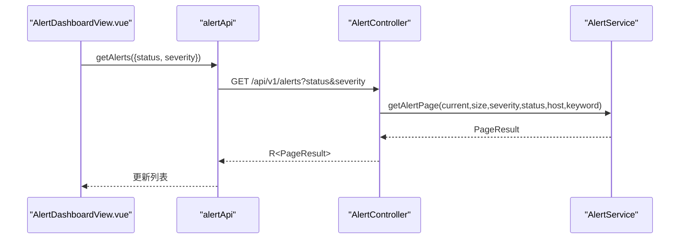
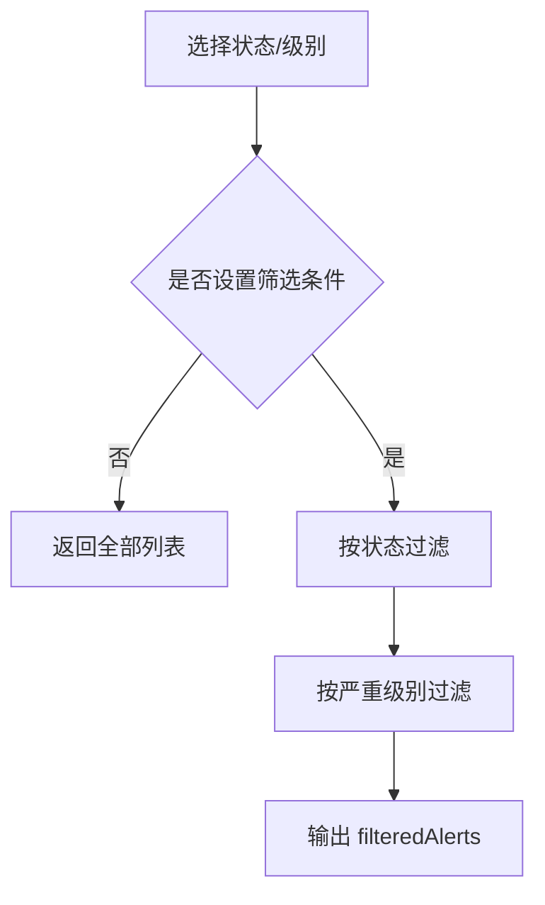
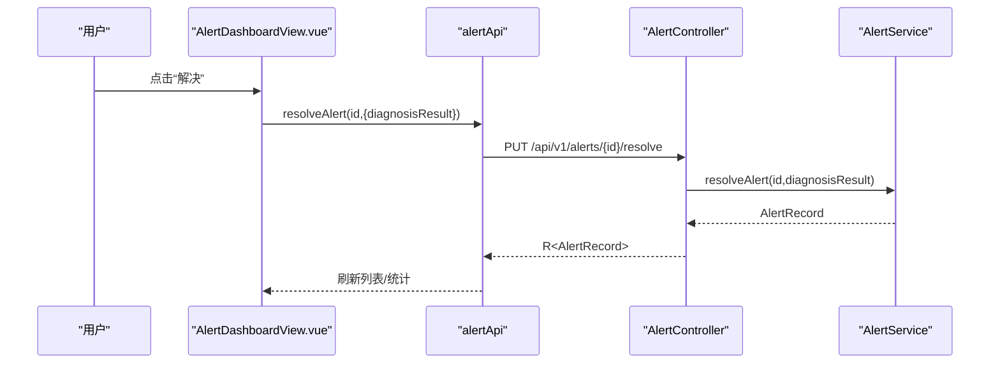
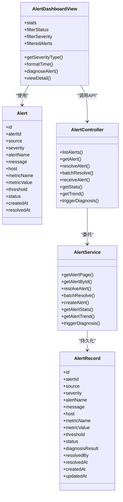

# 告警面板组件

<cite>
**本文引用的文件**
- [AlertDashboardView.vue](file://netdata-ai-frontend/src/views/AlertDashboardView.vue)
- [index.ts](file://netdata-ai-frontend/src/types/index.ts)
- [index.ts](file://netdata-ai-frontend/src/api/index.ts)
- [AlertController.java](file://netdata-ai-backend/src/main/java/com/netdata/ops/controller/AlertController.java)
- [AlertService.java](file://netdata-ai-backend/src/main/java/com/netdata/ops/service/AlertService.java)
- [AlertRecord.java](file://netdata-ai-backend/src/main/java/com/netdata/ops/entity/AlertRecord.java)
- [index.ts](file://netdata-ai-frontend/src/router/index.ts)
- [main.ts](file://netdata-ai-frontend/src/main.ts)
</cite>

## 目录
1. [简介](#简介)
2. [项目结构](#项目结构)
3. [核心组件](#核心组件)
4. [架构总览](#架构总览)
5. [详细组件分析](#详细组件分析)
6. [依赖关系分析](#依赖关系分析)
7. [性能考虑](#性能考虑)
8. [故障排查指南](#故障排查指南)
9. [结论](#结论)
10. [附录](#附录)

## 简介
本文件为告警面板组件的详细技术文档，聚焦于前端组件 AlertDashboardView.vue 的布局与交互设计、告警数据的获取与处理流程、状态管理与筛选机制、实时更新能力、告警详情与操作功能、过滤与搜索逻辑，以及统计图表与趋势分析的可视化实现。同时结合后端 API 的实现，说明从数据采集、存储、统计到前端展示的完整链路。

## 项目结构
告警面板位于前端工程的视图层，采用 Vue 3 + TypeScript + Element Plus 构建；后端提供 REST API，负责告警数据的持久化、统计与趋势计算。路由系统将 /alerts 映射到告警仪表板视图。

**图表来源**
- [AlertDashboardView.vue:1-235](file://netdata-ai-frontend/src/views/AlertDashboardView.vue#L1-L235)
- [index.ts:172-189](file://netdata-ai-frontend/src/api/index.ts#L172-L189)
- [index.ts:109-124](file://netdata-ai-frontend/src/types/index.ts#L109-L124)
- [index.ts:23-27](file://netdata-ai-frontend/src/router/index.ts#L23-L27)
- [AlertController.java:21-107](file://netdata-ai-backend/src/main/java/com/netdata/ops/controller/AlertController.java#L21-L107)
- [AlertService.java:27-236](file://netdata-ai-backend/src/main/java/com/netdata/ops/service/AlertService.java#L27-L236)
- [AlertRecord.java:11-55](file://netdata-ai-backend/src/main/java/com/netdata/ops/entity/AlertRecord.java#L11-L55)

**章节来源**
- [AlertDashboardView.vue:1-235](file://netdata-ai-frontend/src/views/AlertDashboardView.vue#L1-L235)
- [index.ts:23-27](file://netdata-ai-frontend/src/router/index.ts#L23-L27)

## 核心组件
- 告警统计卡片：展示总告警数、正在告警、已恢复、严重告警等关键指标。
- 告警列表表格：展示告警名称、主机、指标、严重级别、状态、时间等字段，并提供“诊断”“详情”操作入口。
- 筛选器：支持按状态（告警中/已恢复）与严重级别（严重/警告/信息）进行筛选。
- 时间格式化：使用 dayjs 对告警创建时间进行本地化格式化。
- 路由跳转：点击“诊断”按钮跳转至聊天视图并携带查询参数。

上述功能均在前端组件中实现，当前组件尚未接入真实数据源与实时推送，仅包含静态模拟数据与占位逻辑。

**章节来源**
- [AlertDashboardView.vue:5-87](file://netdata-ai-frontend/src/views/AlertDashboardView.vue#L5-L87)
- [AlertDashboardView.vue:98-181](file://netdata-ai-frontend/src/views/AlertDashboardView.vue#L98-L181)
- [index.ts:103-124](file://netdata-ai-frontend/src/types/index.ts#L103-L124)

## 架构总览
前端通过封装的 alertApi 获取告警列表与统计信息；后端提供 REST 接口，业务层进行数据聚合与趋势统计，实体层映射数据库表结构。路由系统将 /alerts 映射到告警仪表板视图。

**图表来源**
- [AlertDashboardView.vue:178-181](file://netdata-ai-frontend/src/views/AlertDashboardView.vue#L178-L181)
- [index.ts:172-189](file://netdata-ai-frontend/src/api/index.ts#L172-L189)
- [AlertController.java:27-38](file://netdata-ai-backend/src/main/java/com/netdata/ops/controller/AlertController.java#L27-L38)
- [AlertService.java:34-57](file://netdata-ai-backend/src/main/java/com/netdata/ops/service/AlertService.java#L34-L57)
- [AlertRecord.java:11-55](file://netdata-ai-backend/src/main/java/com/netdata/ops/entity/AlertRecord.java#L11-L55)

## 详细组件分析

### 布局与展示
- 统计卡片：四个卡片分别展示总告警数、正在告警、已恢复、严重告警，使用 scoped 样式区分不同状态的颜色。
- 列表表格：包含告警名称、主机、指标、严重级别、状态、时间列；严重级别与状态使用标签样式高亮显示。
- 卡片头部：右侧提供状态与严重级别的下拉筛选器，支持多条件组合过滤。
- 操作列：提供“诊断”“详情”按钮，其中“诊断”会跳转到聊天视图并附带查询参数。

**图表来源**
- [AlertDashboardView.vue:31-86](file://netdata-ai-frontend/src/views/AlertDashboardView.vue#L31-L86)
- [AlertDashboardView.vue:143-149](file://netdata-ai-frontend/src/views/AlertDashboardView.vue#L143-L149)

**章节来源**
- [AlertDashboardView.vue:5-87](file://netdata-ai-frontend/src/views/AlertDashboardView.vue#L5-L87)

### 数据获取与处理流程
- 前端 API 封装：
  - getAlerts(params)：支持按状态、严重级别等参数查询告警列表。
  - getStats()：获取告警统计概览。
- 后端控制器：
  - GET /alerts：分页查询，支持按严重级别、状态、主机、关键词过滤。
  - GET /alerts/stats：返回正在告警数、今日已恢复数、按严重级别分布等。
- 后端服务：
  - 分页查询与关键词模糊匹配（告警名或消息）。
  - 统计方法：正在告警数、今日已恢复数、按严重级别分布、受影响主机数。
  - 趋势分析：最近7天按天统计各严重级别数量。

**图表来源**
- [index.ts:172-189](file://netdata-ai-frontend/src/api/index.ts#L172-L189)
- [AlertController.java:27-38](file://netdata-ai-backend/src/main/java/com/netdata/ops/controller/AlertController.java#L27-L38)
- [AlertService.java:34-57](file://netdata-ai-backend/src/main/java/com/netdata/ops/service/AlertService.java#L34-L57)

**章节来源**
- [index.ts:172-189](file://netdata-ai-frontend/src/api/index.ts#L172-L189)
- [AlertController.java:27-38](file://netdata-ai-backend/src/main/java/com/netdata/ops/controller/AlertController.java#L27-L38)
- [AlertService.java:154-170](file://netdata-ai-backend/src/main/java/com/netdata/ops/service/AlertService.java#L154-L170)

### 状态管理与筛选
- 状态类型：firing（告警中）、resolved（已恢复）。
- 严重级别：info（信息）、warning（警告）、critical（严重）。
- 筛选逻辑：基于 computed 计算属性对 alerts 进行过滤，支持状态与严重级别双重筛选。
- 已读/未读：当前组件未体现“已读/未读”状态字段与标记逻辑，可在后端实体与前端状态中扩展。

**图表来源**
- [AlertDashboardView.vue:107-108](file://netdata-ai-frontend/src/views/AlertDashboardView.vue#L107-L108)
- [AlertDashboardView.vue:143-149](file://netdata-ai-frontend/src/views/AlertDashboardView.vue#L143-L149)

**章节来源**
- [AlertDashboardView.vue:107-149](file://netdata-ai-frontend/src/views/AlertDashboardView.vue#L107-L149)
- [index.ts:103-107](file://netdata-ai-frontend/src/types/index.ts#L103-L107)

### 实时更新机制
- 当前前端组件在 mounted 阶段预留了加载数据的占位逻辑，尚未集成 WebSocket 或轮询机制。
- 后端未发现 WebSocket 相关实现文件，事件总线用于内部 Agent 通信，不直接暴露给前端。
- 建议方案：
  - WebSocket：后端新增 WebSocket 端点，推送新增/变更的告警事件；前端订阅并更新本地状态。
  - 轮询：前端定时调用 getAlerts/getStats，增量对比并局部刷新。
  - SSE：后端以 Server-Sent Events 推送增量数据，前端以 EventSource 接收。

**章节来源**
- [AlertDashboardView.vue:178-181](file://netdata-ai-frontend/src/views/AlertDashboardView.vue#L178-L181)
- [AgentEventBus.java:1-155](file://netdata-ai-backend/src/main/java/com/netdata/ops/core/agent/event/AgentEventBus.java#L1-L155)

### 告警详情展示
- 当前组件提供“详情”按钮的占位逻辑，未实现具体详情弹窗或抽屉。
- 后端提供 GET /alerts/{id} 获取告警详情，可用于补充前端详情展示。
- 可扩展：在详情中展示指标图表（如折线图）、诊断结果、处理记录等。

**章节来源**
- [AlertDashboardView.vue:174-176](file://netdata-ai-frontend/src/views/AlertDashboardView.vue#L174-L176)
- [AlertController.java:40-45](file://netdata-ai-backend/src/main/java/com/netdata/ops/controller/AlertController.java#L40-L45)

### 告警操作功能
- 确认/解决：后端提供 PUT /api/v1/alerts/{id}/resolve，前端可调用对应 API 完成解决并记录诊断结果。
- 批量处理：后端提供 PUT /api/v1/alerts/batch-resolve，支持传入 ID 列表与诊断结果，返回解决数量。
- 忽略：当前组件未提供“忽略”操作；可在后端新增忽略状态或删除接口，前端增加按钮与确认流程。

**图表来源**
- [AlertController.java:47-54](file://netdata-ai-backend/src/main/java/com/netdata/ops/controller/AlertController.java#L47-L54)
- [AlertService.java:73-92](file://netdata-ai-backend/src/main/java/com/netdata/ops/service/AlertService.java#L73-L92)
- [index.ts:172-189](file://netdata-ai-frontend/src/api/index.ts#L172-L189)

**章节来源**
- [AlertController.java:47-67](file://netdata-ai-backend/src/main/java/com/netdata/ops/controller/AlertController.java#L47-L67)
- [AlertService.java:73-150](file://netdata-ai-backend/src/main/java/com/netdata/ops/service/AlertService.java#L73-L150)

### 过滤与搜索
- 前端筛选：状态与严重级别下拉选择，computed 过滤。
- 后端筛选：GET /alerts 支持 severity、status、host、keyword 参数；keyword 支持对告警名与消息进行模糊匹配。
- 建议：前端可扩展时间范围筛选（开始/结束时间），后端相应增加 createdAt 范围查询。

**章节来源**
- [AlertDashboardView.vue:37-47](file://netdata-ai-frontend/src/views/AlertDashboardView.vue#L37-L47)
- [AlertController.java:30-37](file://netdata-ai-backend/src/main/java/com/netdata/ops/controller/AlertController.java#L30-L37)
- [AlertService.java:34-57](file://netdata-ai-backend/src/main/java/com/netdata/ops/service/AlertService.java#L34-L57)

### 统计图表与趋势分析
- 统计概览：后端提供 getAlertStats，包含正在告警数、今日已恢复数、严重级别分布、受影响主机数。
- 趋势分析：后端提供 getAlertTrend，返回最近7天按天统计的严重级别分布，可用于绘制折线图。
- 前端建议：引入图表库（如 ECharts/Chart.js），在组件中渲染统计卡片与趋势折线图。

**章节来源**
- [AlertController.java:87-99](file://netdata-ai-backend/src/main/java/com/netdata/ops/controller/AlertController.java#L87-L99)
- [AlertService.java:154-202](file://netdata-ai-backend/src/main/java/com/netdata/ops/service/AlertService.java#L154-L202)

## 依赖关系分析
- 组件依赖：
  - Element Plus：卡片、表格、标签、选择器等 UI 组件。
  - dayjs：时间格式化。
  - Vue Router：导航与参数传递。
- 类型依赖：
  - Alert 接口定义了告警字段与状态/严重级别枚举。
- API 依赖：
  - alertApi 提供告警列表、统计、解决、批量解决等接口。
- 后端依赖：
  - AlertController 暴露 REST 端点。
  - AlertService 实现查询、统计、趋势与诊断逻辑。
  - AlertRecord 映射数据库表结构。

**图表来源**
- [AlertDashboardView.vue:90-181](file://netdata-ai-frontend/src/views/AlertDashboardView.vue#L90-L181)
- [index.ts:109-124](file://netdata-ai-frontend/src/types/index.ts#L109-L124)
- [AlertController.java:23-107](file://netdata-ai-backend/src/main/java/com/netdata/ops/controller/AlertController.java#L23-L107)
- [AlertService.java:27-236](file://netdata-ai-backend/src/main/java/com/netdata/ops/service/AlertService.java#L27-L236)
- [AlertRecord.java:11-55](file://netdata-ai-backend/src/main/java/com/netdata/ops/entity/AlertRecord.java#L11-L55)

**章节来源**
- [index.ts:103-124](file://netdata-ai-frontend/src/types/index.ts#L103-L124)
- [index.ts:172-189](file://netdata-ai-frontend/src/api/index.ts#L172-L189)
- [AlertController.java:23-107](file://netdata-ai-backend/src/main/java/com/netdata/ops/controller/AlertController.java#L23-L107)
- [AlertService.java:27-236](file://netdata-ai-backend/src/main/java/com/netdata/ops/service/AlertService.java#L27-L236)
- [AlertRecord.java:11-55](file://netdata-ai-backend/src/main/java/com/netdata/ops/entity/AlertRecord.java#L11-L55)

## 性能考虑
- 前端：
  - 使用 computed 缓存过滤结果，避免重复计算。
  - 列表分页与筛选参数化，减少一次性传输大量数据。
  - 图表渲染建议节流/防抖，避免频繁重绘。
- 后端：
  - 分页查询与排序（按创建时间倒序）降低数据库压力。
  - 统计与趋势聚合在服务层完成，减少前端复杂计算。
  - 关键查询添加索引（如 status、severity、host、createdAt）提升检索效率。

## 故障排查指南
- 401 未认证：前端拦截器会尝试刷新 token 并重试；若刷新失败则跳转登录页。
- 403 权限不足：提示权限不足，需检查用户角色与权限配置。
- 429 请求频繁：提示限流，建议前端增加退避策略或合并请求。
- 数据不一致：确认后端是否正确去重（同一 alertId 且状态为 firing 的重复告警不会重复创建）。

**章节来源**
- [index.ts:44-112](file://netdata-ai-frontend/src/api/index.ts#L44-L112)
- [AlertService.java:96-128](file://netdata-ai-backend/src/main/java/com/netdata/ops/service/AlertService.java#L96-L128)

## 结论
AlertDashboardView.vue 提供了告警面板的基础布局与筛选能力，当前尚未接入真实数据源与实时推送。结合后端提供的 REST API，可逐步完善数据获取、实时更新、详情展示与操作流程。建议优先实现 WebSocket 或轮询机制，补充“忽略”与“已读/未读”状态，并扩展趋势图表与更丰富的过滤条件。

## 附录
- 路由映射：/alerts → AlertDashboardView.vue
- 主应用初始化：注册 Element Plus、路由、Pinia、权限指令与认证初始化

**章节来源**
- [index.ts:23-27](file://netdata-ai-frontend/src/router/index.ts#L23-L27)
- [main.ts:15-35](file://netdata-ai-frontend/src/main.ts#L15-L35)