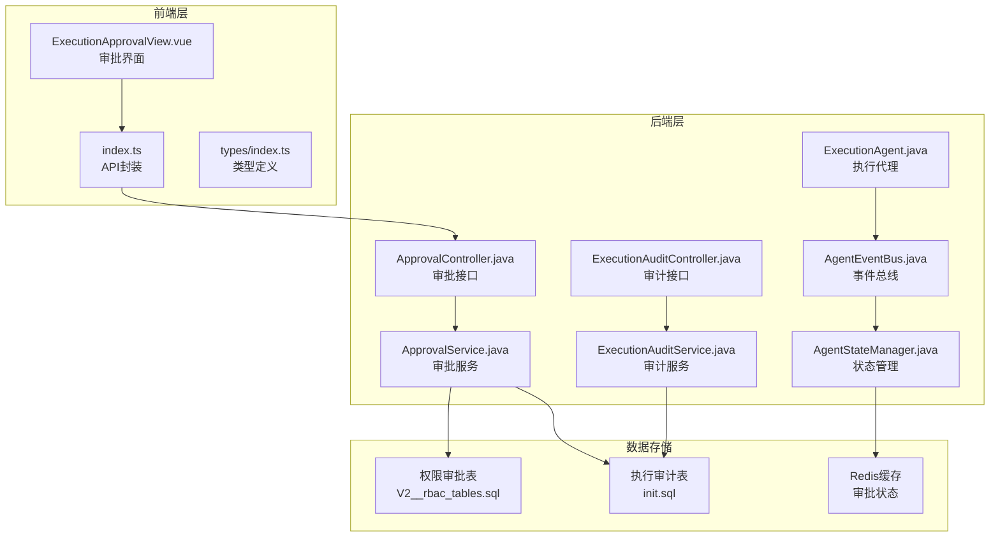
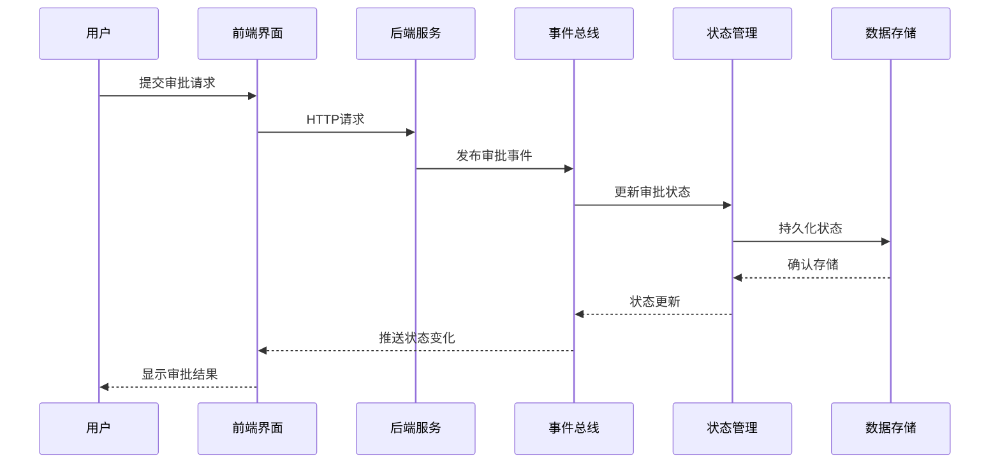
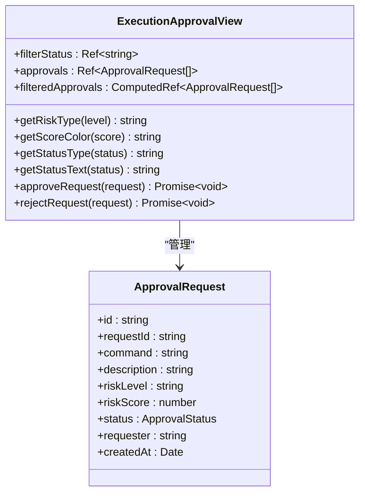
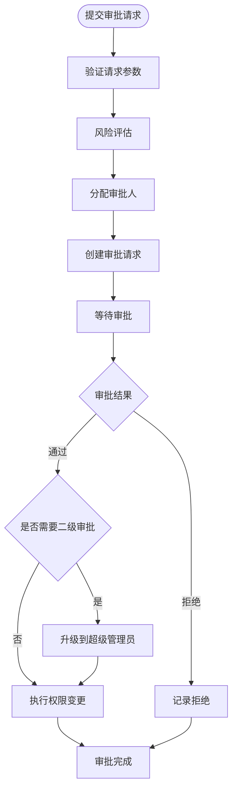
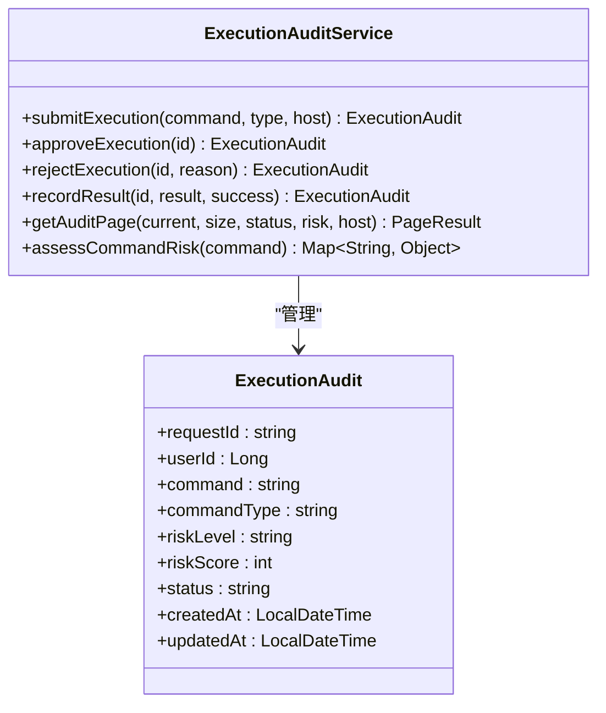
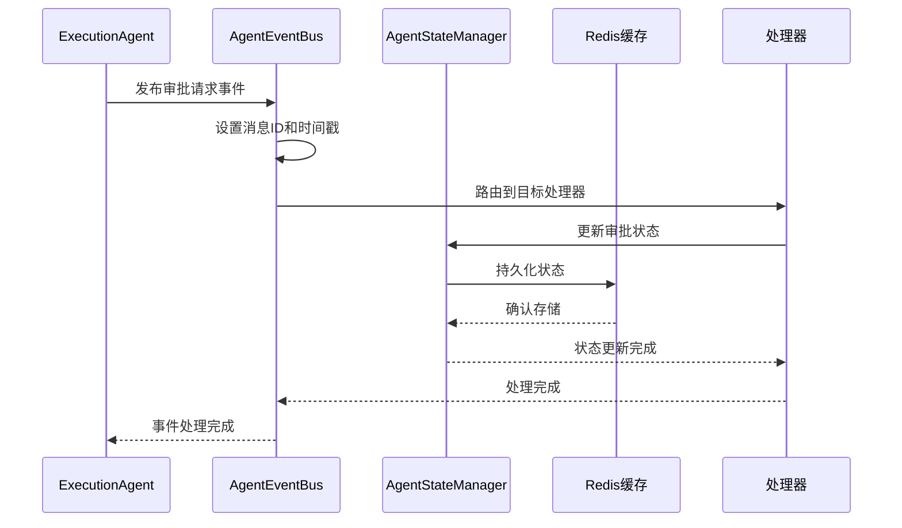
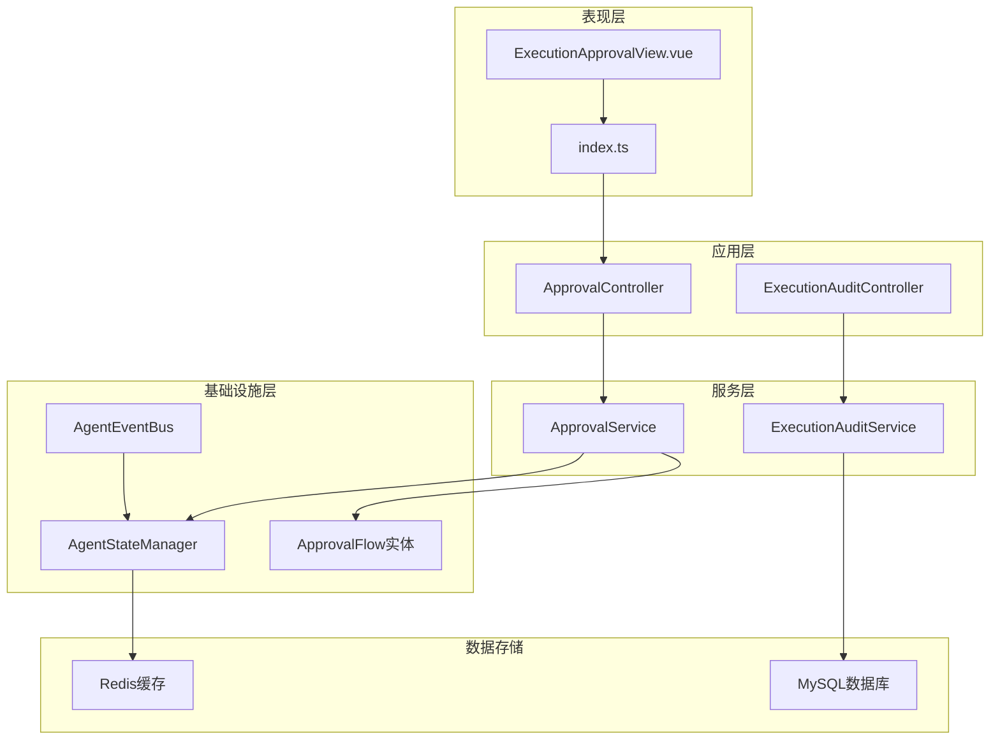

# 执行审批组件

<cite>
**本文引用的文件**
- [ExecutionApprovalView.vue](file://netdata-ai-frontend/src/views/ExecutionApprovalView.vue)
- [index.ts（前端API封装）](file://netdata-ai-frontend/src/api/index.ts)
- [index.ts（前端类型定义）](file://netdata-ai-frontend/src/types/index.ts)
- [ApprovalController.java（后端审批接口）](file://netdata-ai-backend/src/main/java/com/netdata/ops/controller/ApprovalController.java)
- [ApprovalService.java（后端审批服务）](file://netdata-ai-backend/src/main/java/com/netdata/ops/service/ApprovalService.java)
- [ExecutionAuditController.java（执行审计接口）](file://netdata-ai-backend/src/main/java/com/netdata/ops/controller/ExecutionAuditController.java)
- [ExecutionAuditService.java（执行审计服务）](file://netdata-ai-backend/src/main/java/com/netdata/ops/service/ExecutionAuditService.java)
- [AgentEventBus.java（事件总线）](file://netdata-ai-backend/src/main/java/com/netdata/ops/core/agent/event/AgentEventBus.java)
- [AgentStateManager.java（审批状态管理）](file://netdata-ai-backend/src/main/java/com/netdata/ops/core/agent/AgentStateManager.java)
- [ExecutionAgent.java（执行代理）](file://netdata-ai-backend/src/main/java/com/netdata/ops/core/agent/ExecutionAgent.java)
- [ApprovalFlow.java（审批流程实体）](file://netdata-ai-backend/src/main/java/com/netdata/ops/entity/ApprovalFlow.java)
- [application.yml（WebSocket配置）](file://netdata-ai-backend/src/main/resources/application.yml)
- [V2__rbac_tables.sql（权限审批表结构）](file://sql/V2__rbac_tables.sql)
- [init.sql（执行审计表结构）](file://sql/init.sql)
</cite>

## 目录
1. [简介](#简介)
2. [项目结构](#项目结构)
3. [核心组件](#核心组件)
4. [架构概览](#架构概览)
5. [详细组件分析](#详细组件分析)
6. [依赖关系分析](#依赖关系分析)
7. [性能考虑](#性能考虑)
8. [故障排除指南](#故障排除指南)
9. [结论](#结论)

## 简介
执行审批组件是智能运维系统中的关键安全控制模块，负责管理高风险运维命令的审批流程。该组件实现了完整的审批生命周期管理，包括命令风险评估、审批任务分发、审批决策处理、执行结果跟踪等功能。系统采用前后端分离架构，前端使用Vue.js构建交互界面，后端基于Spring Boot提供RESTful API服务。

## 项目结构
执行审批组件跨越前端和后端两个主要部分，形成了完整的审批生态系统：

**图表来源**
- [ExecutionApprovalView.vue:1-200](file://netdata-ai-frontend/src/views/ExecutionApprovalView.vue#L1-L200)
- [ApprovalController.java:1-110](file://netdata-ai-backend/src/main/java/com/netdata/ops/controller/ApprovalController.java#L1-L110)
- [ExecutionAuditController.java:1-93](file://netdata-ai-backend/src/main/java/com/netdata/ops/controller/ExecutionAuditController.java#L1-L93)

**章节来源**
- [ExecutionApprovalView.vue:1-200](file://netdata-ai-frontend/src/views/ExecutionApprovalView.vue#L1-L200)
- [index.ts（前端API封装）:1-290](file://netdata-ai-frontend/src/api/index.ts#L1-L290)
- [ApprovalController.java:1-110](file://netdata-ai-backend/src/main/java/com/netdata/ops/controller/ApprovalController.java#L1-L110)

## 核心组件
执行审批组件由多个相互协作的核心组件构成，每个组件都有明确的职责分工：

### 前端审批界面组件
- **ExecutionApprovalView.vue**: 主要的审批任务展示界面，提供任务列表、状态筛选和操作按钮
- **API封装**: 提供统一的HTTP请求接口，处理认证和错误响应
- **类型定义**: 定义审批请求的数据结构和状态枚举

### 后端审批服务组件
- **ApprovalController**: RESTful API接口，处理审批相关的HTTP请求
- **ApprovalService**: 核心业务逻辑，实现审批流程的完整控制
- **ExecutionAuditController**: 执行审计接口，管理命令执行的历史记录
- **ExecutionAuditService**: 执行审计业务逻辑，提供风险评估和统计分析

### 事件驱动组件
- **AgentEventBus**: 事件总线系统，实现组件间的异步通信
- **AgentStateManager**: 审批状态管理，维护审批请求的生命周期
- **ExecutionAgent**: 执行代理，处理命令执行和审批请求的创建

**章节来源**
- [ExecutionApprovalView.vue:68-179](file://netdata-ai-frontend/src/views/ExecutionApprovalView.vue#L68-L179)
- [index.ts（前端API封装）:194-215](file://netdata-ai-frontend/src/api/index.ts#L194-L215)
- [ApprovalController.java:22-110](file://netdata-ai-backend/src/main/java/com/netdata/ops/controller/ApprovalController.java#L22-L110)

## 架构概览
执行审批组件采用事件驱动的微服务架构，实现了松耦合的设计模式：

**图表来源**
- [AgentEventBus.java:73-92](file://netdata-ai-backend/src/main/java/com/netdata/ops/core/agent/event/AgentEventBus.java#L73-L92)
- [AgentStateManager.java:113-131](file://netdata-ai-backend/src/main/java/com/netdata/ops/core/agent/AgentStateManager.java#L113-L131)
- [ExecutionAgent.java:342-380](file://netdata-ai-backend/src/main/java/com/netdata/ops/core/agent/ExecutionAgent.java#L342-L380)

系统架构特点：
- **事件驱动**: 使用AgentEventBus实现组件间解耦
- **状态管理**: AgentStateManager集中管理审批状态
- **持久化存储**: 结合MySQL和Redis实现数据持久化
- **实时通信**: 支持WebSocket实现实时状态更新

## 详细组件分析

### 审批界面组件分析
ExecutionApprovalView.vue实现了完整的审批任务管理界面：

#### 界面布局设计
- **顶部筛选区**: 提供状态筛选功能，支持"全部"、"待审批"、"已通过"、"已拒绝"四种状态
- **主表格区域**: 展示审批任务的详细信息，包括命令内容、风险等级、申请人等
- **操作按钮区**: 针对不同状态显示相应的操作按钮

#### 数据展示机制
- **风险等级展示**: 使用标签组件和进度条可视化风险评分
- **状态标识**: 通过不同颜色区分审批状态
- **命令预览**: 使用代码格式展示命令内容

#### 操作流程实现
- **审批通过**: 通过确认对话框确保操作安全性
- **审批拒绝**: 支持输入拒绝原因并进行验证
- **详情查看**: 对于已完成的审批任务提供详情查看功能

**图表来源**
- [ExecutionApprovalView.vue:68-179](file://netdata-ai-frontend/src/views/ExecutionApprovalView.vue#L68-L179)
- [index.ts（前端类型定义）:131-145](file://netdata-ai-frontend/src/types/index.ts#L131-L145)

**章节来源**
- [ExecutionApprovalView.vue:1-200](file://netdata-ai-frontend/src/views/ExecutionApprovalView.vue#L1-L200)

### 审批服务组件分析
后端审批服务提供了完整的业务逻辑实现：

#### 审批流程控制
- **请求提交**: 验证用户权限和目标对象有效性
- **风险评估**: 根据请求类型和持续时间评估风险等级
- **审批人分配**: 基于风险等级自动分配审批人
- **状态流转**: 严格控制审批状态的合法转换

#### 多级审批机制
- **高风险升级**: 高风险请求需要二级审批
- **超级管理员**: 通过升级机制引入超级管理员审批
- **审批流记录**: 完整记录每次审批操作的详细信息

**图表来源**
- [ApprovalService.java:39-94](file://netdata-ai-backend/src/main/java/com/netdata/ops/service/ApprovalService.java#L39-L94)
- [ApprovalService.java:99-130](file://netdata-ai-backend/src/main/java/com/netdata/ops/service/ApprovalService.java#L99-L130)

**章节来源**
- [ApprovalService.java:1-200](file://netdata-ai-backend/src/main/java/com/netdata/ops/service/ApprovalService.java#L1-L200)

### 执行审计组件分析
执行审计组件负责管理命令执行的完整生命周期：

#### 风险评估机制
- **模式匹配**: 使用正则表达式识别高危命令模式
- **风险等级**: 将命令分为低、中、高、危急四个等级
- **自动处理**: 低风险命令自动执行，其他命令进入审批流程

#### 审计记录管理
- **执行状态**: 跟踪命令执行的各个阶段状态
- **结果记录**: 记录执行结果和错误信息
- **统计分析**: 提供执行统计和趋势分析

**图表来源**
- [ExecutionAuditService.java:65-103](file://netdata-ai-backend/src/main/java/com/netdata/ops/service/ExecutionAuditService.java#L65-L103)
- [init.sql:114-127](file://sql/init.sql#L114-L127)

**章节来源**
- [ExecutionAuditService.java:1-200](file://netdata-ai-backend/src/main/java/com/netdata/ops/service/ExecutionAuditService.java#L1-L200)

### 事件驱动架构分析
系统采用事件驱动架构实现组件间的松耦合通信：

#### 事件总线机制
- **消息发布**: 统一的消息发布接口，自动设置消息元数据
- **处理器注册**: 支持动态注册和注销消息处理器
- **异步处理**: 使用@Async注解实现异步事件处理

#### 审批状态管理
- **Redis存储**: 使用Redis缓存审批请求的实时状态
- **超时处理**: 自动检测和处理超时的审批请求
- **状态同步**: 确保审批状态在分布式环境下的一致性

**图表来源**
- [AgentEventBus.java:73-92](file://netdata-ai-backend/src/main/java/com/netdata/ops/core/agent/event/AgentEventBus.java#L73-L92)
- [AgentStateManager.java:179-204](file://netdata-ai-backend/src/main/java/com/netdata/ops/core/agent/AgentStateManager.java#L179-L204)

**章节来源**
- [AgentEventBus.java:1-154](file://netdata-ai-backend/src/main/java/com/netdata/ops/core/agent/event/AgentEventBus.java#L1-L154)
- [AgentStateManager.java:102-258](file://netdata-ai-backend/src/main/java/com/netdata/ops/core/agent/AgentStateManager.java#L102-L258)

## 依赖关系分析
执行审批组件的依赖关系体现了清晰的分层架构：

**图表来源**
- [index.ts（前端API封装）:194-215](file://netdata-ai-frontend/src/api/index.ts#L194-L215)
- [ApprovalController.java:22-110](file://netdata-ai-backend/src/main/java/com/netdata/ops/controller/ApprovalController.java#L22-L110)
- [ApprovalService.java:29-35](file://netdata-ai-backend/src/main/java/com/netdata/ops/service/ApprovalService.java#L29-L35)

**章节来源**
- [index.ts（前端类型定义）:1-169](file://netdata-ai-frontend/src/types/index.ts#L1-L169)
- [ApprovalFlow.java:1-36](file://netdata-ai-backend/src/main/java/com/netdata/ops/entity/ApprovalFlow.java#L1-L36)

## 性能考虑
执行审批组件在设计时充分考虑了性能优化：

### 前端性能优化
- **虚拟滚动**: 对于大量审批记录，可考虑实现虚拟滚动提升渲染性能
- **懒加载**: 审批详情内容采用懒加载方式，减少初始加载时间
- **缓存策略**: 利用浏览器缓存机制提升重复访问速度

### 后端性能优化
- **连接池配置**: MySQL和Redis连接池参数经过优化配置
- **异步处理**: 事件处理采用异步方式，避免阻塞主线程
- **缓存机制**: Redis缓存高频访问的审批状态信息

### 数据库优化
- **索引设计**: 审批表和审计表建立了合适的索引以提升查询性能
- **分页查询**: 所有列表查询都支持分页，避免大数据量查询
- **事务管理**: 审批操作使用事务保证数据一致性

## 故障排除指南
针对执行审批组件可能出现的问题提供解决方案：

### 常见问题诊断
- **审批状态异常**: 检查AgentEventBus的事件处理是否正常
- **Redis连接失败**: 验证Redis配置和网络连接状态
- **审批超时**: 检查AgentStateManager的状态检查逻辑

### 错误处理机制
- **前端错误提示**: 使用Element Plus的消息组件提供友好的错误反馈
- **后端异常捕获**: 统一的异常处理机制，返回标准的错误响应
- **日志记录**: 详细的日志记录便于问题定位和调试

### 性能监控
- **指标收集**: 使用Actuator暴露系统运行指标
- **健康检查**: 提供完整的健康检查接口
- **告警机制**: 集成告警系统及时发现性能问题

**章节来源**
- [index.ts（前端API封装）:44-112](file://netdata-ai-frontend/src/api/index.ts#L44-L112)
- [application.yml:206-237](file://netdata-ai-backend/src/main/resources/application.yml#L206-L237)

## 结论
执行审批组件是一个设计完善的审批管理系统，具有以下特点：

### 技术优势
- **事件驱动架构**: 实现了组件间的松耦合和高内聚
- **完整的生命周期管理**: 从风险评估到执行结果的全流程覆盖
- **安全可靠**: 多层安全控制和审计机制确保系统安全

### 功能完整性
- **审批流程**: 支持多级审批和自动升级机制
- **统计分析**: 提供丰富的统计报表和趋势分析
- **实时通信**: 支持WebSocket实现实时状态更新

### 扩展性设计
- **模块化架构**: 清晰的分层设计便于功能扩展
- **插件机制**: 支持添加新的风险评估规则和审批策略
- **配置灵活**: 通过配置文件实现功能开关和参数调整

该组件为智能运维系统提供了坚实的安全基础，确保高风险操作得到适当的审批和监督，同时保持了良好的用户体验和系统性能。