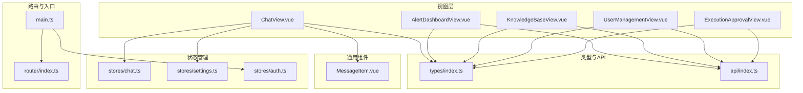
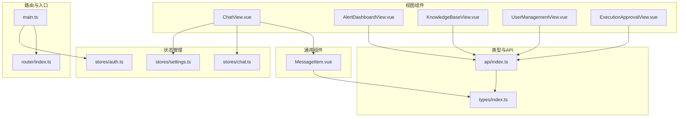
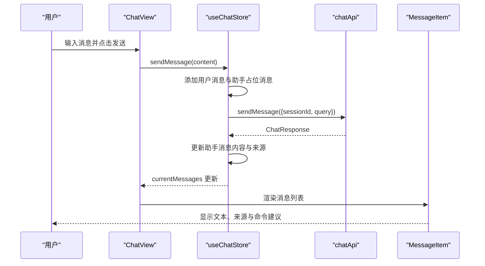
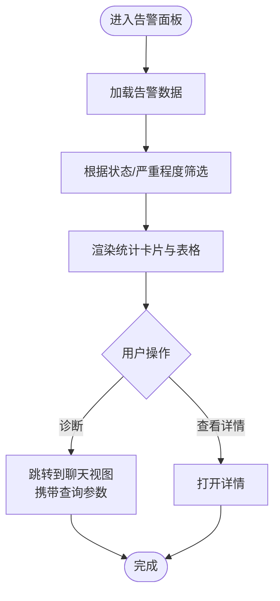
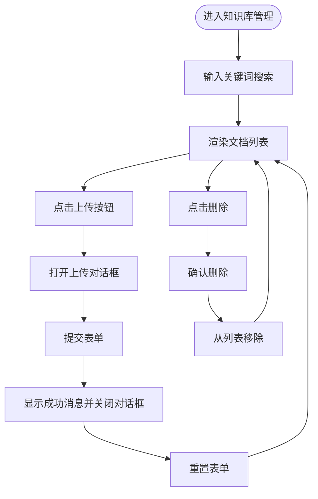
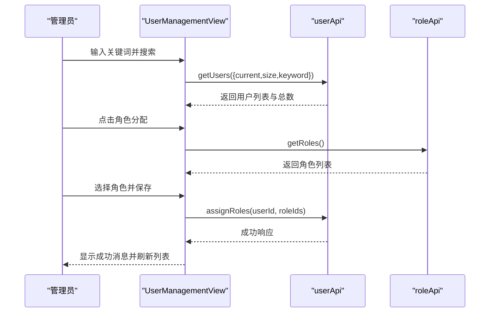
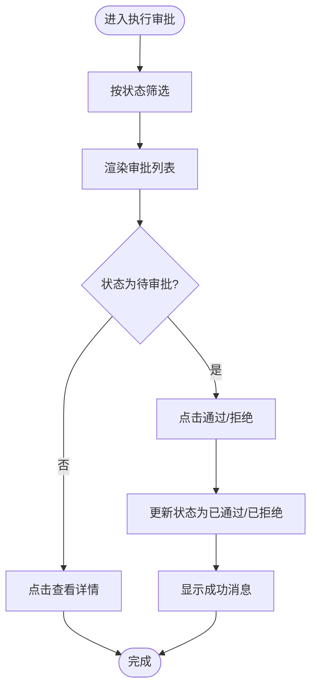
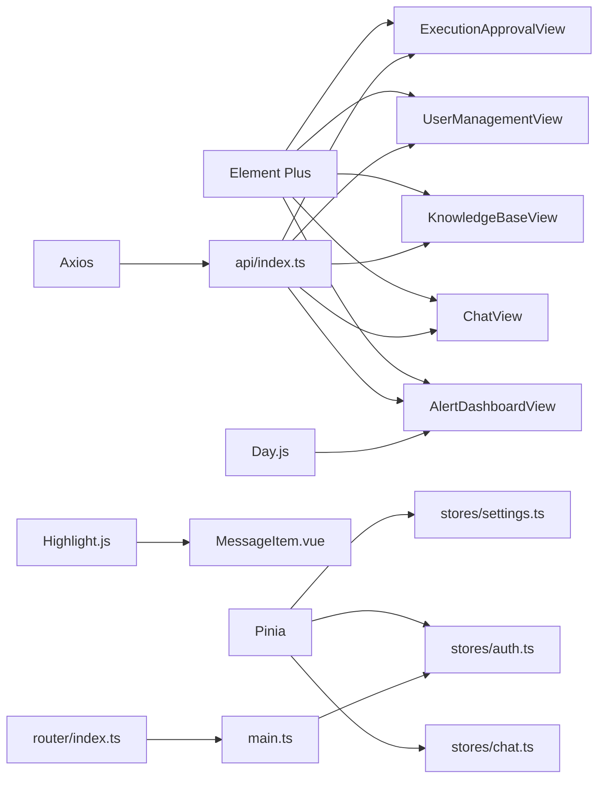

# 用户界面组件

<cite>
**本文档引用的文件**
- [ChatView.vue](file://netdata-ai-frontend/src/views/ChatView.vue)
- [AlertDashboardView.vue](file://netdata-ai-frontend/src/views/AlertDashboardView.vue)
- [KnowledgeBaseView.vue](file://netdata-ai-frontend/src/views/KnowledgeBaseView.vue)
- [UserManagementView.vue](file://netdata-ai-frontend/src/views/UserManagementView.vue)
- [ExecutionApprovalView.vue](file://netdata-ai-frontend/src/views/ExecutionApprovalView.vue)
- [MessageItem.vue](file://netdata-ai-frontend/src/components/MessageItem.vue)
- [chat.ts](file://netdata-ai-frontend/src/stores/chat.ts)
- [settings.ts](file://netdata-frontend/src/stores/settings.ts)
- [auth.ts](file://netdata-ai-frontend/src/stores/auth.ts)
- [index.ts](file://netdata-ai-frontend/src/types/index.ts)
- [index.ts](file://netdata-ai-frontend/src/api/index.ts)
- [index.ts](file://netdata-ai-frontend/src/router/index.ts)
- [main.ts](file://netdata-ai-frontend/src/main.ts)
</cite>

## 目录
1. [简介](#简介)
2. [项目结构](#项目结构)
3. [核心组件](#核心组件)
4. [架构总览](#架构总览)
5. [详细组件分析](#详细组件分析)
6. [依赖分析](#依赖分析)
7. [性能考虑](#性能考虑)
8. [故障排除指南](#故障排除指南)
9. [结论](#结论)
10. [附录](#附录)

## 简介
本文件为用户界面组件的详细技术文档，覆盖以下五大组件：
- 聊天界面组件：负责消息列表渲染、用户输入处理与实时消息推送机制
- 告警面板组件：负责告警数据展示、状态管理与实时更新机制
- 知识库管理组件：负责文档上传、分类管理与搜索功能
- 用户管理组件：负责用户列表展示、权限分配与角色管理
- 执行审批组件：负责审批流程展示、操作按钮与状态跟踪

文档将从架构设计、数据流、组件间通信、事件与props定义、样式定制指南等方面进行深入解析，并提供可视化图示帮助理解。

## 项目结构
前端采用 Vue 3 + TypeScript + Pinia + Element Plus 技术栈，组件按功能模块划分在 views 目录下，通用组件位于 components 目录，状态管理位于 stores 目录，类型定义位于 types 目录，API 封装位于 api 目录，路由配置位于 router 目录，入口文件位于 main.ts。

图表来源
- [ChatView.vue:1-335](file://netdata-ai-frontend/src/views/ChatView.vue#L1-L335)
- [AlertDashboardView.vue:1-235](file://netdata-ai-frontend/src/views/AlertDashboardView.vue#L1-L235)
- [KnowledgeBaseView.vue:1-209](file://netdata-ai-frontend/src/views/KnowledgeBaseView.vue#L1-L209)
- [UserManagementView.vue:1-303](file://netdata-ai-frontend/src/views/UserManagementView.vue#L1-L303)
- [ExecutionApprovalView.vue:1-200](file://netdata-ai-frontend/src/views/ExecutionApprovalView.vue#L1-L200)
- [MessageItem.vue:1-381](file://netdata-ai-frontend/src/components/MessageItem.vue#L1-L381)
- [chat.ts:1-210](file://netdata-ai-frontend/src/stores/chat.ts#L1-L210)
- [settings.ts:1-32](file://netdata-ai-frontend/src/stores/settings.ts#L1-L32)
- [auth.ts:1-119](file://netdata-ai-frontend/src/stores/auth.ts#L1-L119)
- [index.ts:1-169](file://netdata-ai-frontend/src/types/index.ts#L1-L169)
- [index.ts:1-290](file://netdata-ai-frontend/src/api/index.ts#L1-L290)
- [index.ts:1-70](file://netdata-ai-frontend/src/router/index.ts#L1-L70)
- [main.ts:1-35](file://netdata-ai-frontend/src/main.ts#L1-L35)

章节来源
- [main.ts:1-35](file://netdata-ai-frontend/src/main.ts#L1-L35)
- [router/index.ts:1-70](file://netdata-ai-frontend/src/router/index.ts#L1-L70)

## 核心组件
本节概述五大组件的核心职责与交互关系：
- 聊天界面组件：维护对话列表与当前对话，处理用户输入，调用聊天API，渲染消息与建议命令，支持重试与清空
- 告警面板组件：展示告警统计卡片与列表，支持状态与严重程度筛选，提供诊断与详情操作
- 知识库管理组件：提供文档上传对话框、搜索栏、文档列表与删除操作
- 用户管理组件：用户列表展示、分页与搜索、角色分配、密码重置与删除
- 执行审批组件：审批请求列表、风险等级与分数展示、审批操作按钮与状态跟踪

章节来源
- [ChatView.vue:1-335](file://netdata-ai-frontend/src/views/ChatView.vue#L1-L335)
- [AlertDashboardView.vue:1-235](file://netdata-ai-frontend/src/views/AlertDashboardView.vue#L1-L235)
- [KnowledgeBaseView.vue:1-209](file://netdata-ai-frontend/src/views/KnowledgeBaseView.vue#L1-L209)
- [UserManagementView.vue:1-303](file://netdata-ai-frontend/src/views/UserManagementView.vue#L1-L303)
- [ExecutionApprovalView.vue:1-200](file://netdata-ai-frontend/src/views/ExecutionApprovalView.vue#L1-L200)

## 架构总览
前端采用“视图层 + 通用组件 + 状态管理 + 类型与API + 路由”的分层架构。视图组件通过 Pinia Store 管理状态，通过 API 客户端与后端交互；Element Plus 提供UI能力；路由负责页面导航与鉴权控制。

图表来源
- [ChatView.vue:1-335](file://netdata-ai-frontend/src/views/ChatView.vue#L1-L335)
- [AlertDashboardView.vue:1-235](file://netdata-ai-frontend/src/views/AlertDashboardView.vue#L1-L235)
- [KnowledgeBaseView.vue:1-209](file://netdata-ai-frontend/src/views/KnowledgeBaseView.vue#L1-L209)
- [UserManagementView.vue:1-303](file://netdata-ai-frontend/src/views/UserManagementView.vue#L1-L303)
- [ExecutionApprovalView.vue:1-200](file://netdata-ai-frontend/src/views/ExecutionApprovalView.vue#L1-L200)
- [MessageItem.vue:1-381](file://netdata-ai-frontend/src/components/MessageItem.vue#L1-L381)
- [chat.ts:1-210](file://netdata-ai-frontend/src/stores/chat.ts#L1-L210)
- [settings.ts:1-32](file://netdata-ai-frontend/src/stores/settings.ts#L1-L32)
- [auth.ts:1-119](file://netdata-ai-frontend/src/stores/auth.ts#L1-L119)
- [index.ts:1-169](file://netdata-ai-frontend/src/types/index.ts#L1-L169)
- [index.ts:1-290](file://netdata-ai-frontend/src/api/index.ts#L1-L290)
- [index.ts:1-70](file://netdata-ai-frontend/src/router/index.ts#L1-L70)
- [main.ts:1-35](file://netdata-ai-frontend/src/main.ts#L1-L35)

## 详细组件分析

### 聊天界面组件（ChatView）
- 设计目标：提供多对话管理、消息渲染、用户输入与实时消息推送体验
- 关键特性
  - 侧边栏对话列表：支持新建、切换、删除对话
  - 主聊天区：消息容器、空态占位、快速示例、输入区与发送按钮
  - 消息渲染：通过 MessageItem 组件渲染文本、来源引用与建议命令
  - 实时推送：isLoading 控制加载态，支持重试与清空当前对话
- 数据流
  - 视图组件通过 useChatStore 管理 conversations、currentConversationId、isLoading
  - sendMessage 调用 chatApi.sendMessage，返回 ChatResponse 后更新 assistant 消息
  - MessageItem 接收 message 并渲染 Markdown、来源与命令建议
- Props 与事件
  - MessageItem 接收 message: Message，触发 retry 事件
  - ChatView 接收 MessageItem 的 retry 事件并调用 regenerateLastReply
- 样式定制
  - 支持侧边栏折叠、滚动条样式、消息气泡背景与高亮
  - 通过 SCSS 变量与类名控制布局与主题

图表来源
- [ChatView.vue:127-138](file://netdata-ai-frontend/src/views/ChatView.vue#L127-L138)
- [chat.ts:82-138](file://netdata-ai-frontend/src/stores/chat.ts#L82-L138)
- [index.ts:123-144](file://netdata-ai-frontend/src/api/index.ts#L123-L144)
- [MessageItem.vue:119-126](file://netdata-ai-frontend/src/components/MessageItem.vue#L119-L126)

章节来源
- [ChatView.vue:1-335](file://netdata-ai-frontend/src/views/ChatView.vue#L1-L335)
- [chat.ts:1-210](file://netdata-ai-frontend/src/stores/chat.ts#L1-L210)
- [MessageItem.vue:1-381](file://netdata-ai-frontend/src/components/MessageItem.vue#L1-L381)
- [index.ts:36-99](file://netdata-ai-frontend/src/types/index.ts#L36-L99)
- [index.ts:123-144](file://netdata-ai-frontend/src/api/index.ts#L123-L144)

### 告警面板组件（AlertDashboardView）
- 设计目标：集中展示告警统计与列表，支持状态与严重程度筛选，提供诊断与详情入口
- 关键特性
  - 统计卡片：总告警数、正在告警、已恢复、严重告警
  - 告警列表：按状态与严重程度筛选，显示告警名称、主机、指标、时间
  - 操作列：诊断与详情按钮，诊断时跳转到聊天视图并带查询参数
- 数据流
  - 使用本地模拟数据（alerts），通过 computed 过滤 filteredAlerts
  - formatTime 使用 dayjs 格式化时间
  - diagnoseAlert 跳转至 /chat?q=...
- Props 与事件
  - 无外部 props，内部通过本地状态管理筛选与格式化
- 样式定制
  - 卡片布局、筛选区对齐、标签颜色区分严重程度

图表来源
- [AlertDashboardView.vue:143-170](file://netdata-ai-frontend/src/views/AlertDashboardView.vue#L143-L170)
- [index.ts:101-124](file://netdata-ai-frontend/src/types/index.ts#L101-L124)

章节来源
- [AlertDashboardView.vue:1-235](file://netdata-ai-frontend/src/views/AlertDashboardView.vue#L1-L235)
- [index.ts:101-124](file://netdata-ai-frontend/src/types/index.ts#L101-L124)

### 知识库管理组件（KnowledgeBaseView）
- 设计目标：提供文档上传、分类管理与搜索功能
- 关键特性
  - 上传对话框：标题、来源、分类、内容
  - 文档列表：标题、来源、分类、字数、切片数、状态、创建时间
  - 操作列：查看与删除
- 数据流
  - 使用本地模拟数据（documents），通过上传表单提交后弹出成功消息并重置表单
  - 删除操作通过 ElMessageBox 确认后从列表移除
- Props 与事件
  - 无外部 props，内部通过本地状态管理上传与删除
- 样式定制
  - 卡片头部对齐、搜索栏与上传按钮布局

图表来源
- [KnowledgeBaseView.vue:157-191](file://netdata-ai-frontend/src/views/KnowledgeBaseView.vue#L157-L191)
- [index.ts:147-168](file://netdata-ai-frontend/src/types/index.ts#L147-L168)

章节来源
- [KnowledgeBaseView.vue:1-209](file://netdata-ai-frontend/src/views/KnowledgeBaseView.vue#L1-L209)
- [index.ts:147-168](file://netdata-ai-frontend/src/types/index.ts#L147-L168)

### 用户管理组件（UserManagementView）
- 设计目标：用户列表展示、分页与搜索、角色分配、密码重置与删除
- 关键特性
  - 搜索栏：支持关键词过滤
  - 用户列表：ID、用户名、昵称、邮箱、角色、状态、最后登录时间
  - 操作列：编辑、角色分配、重置密码、删除
  - 对话框：新建/编辑用户、分配角色
- 数据流
  - 分页参数与搜索关键词组合后调用 userApi.getUsers 获取数据
  - 角色分配通过 userApi.assignRoles 更新用户角色
  - 密码重置与删除通过 ElMessageBox 确认后调用对应 API
- Props 与事件
  - 无外部 props，内部通过本地状态管理表单与对话框
- 样式定制
  - 卡片阴影、分页居右、角色标签样式

图表来源
- [UserManagementView.vue:163-187](file://netdata-ai-frontend/src/views/UserManagementView.vue#L163-L187)
- [UserManagementView.vue:232-243](file://netdata-ai-frontend/src/views/UserManagementView.vue#L232-L243)
- [index.ts:238-257](file://netdata-ai-frontend/src/api/index.ts#L238-L257)
- [index.ts:262-275](file://netdata-ai-frontend/src/api/index.ts#L262-L275)

章节来源
- [UserManagementView.vue:1-303](file://netdata-ai-frontend/src/views/UserManagementView.vue#L1-L303)
- [index.ts:238-257](file://netdata-ai-frontend/src/api/index.ts#L238-L257)
- [index.ts:262-275](file://netdata-ai-frontend/src/api/index.ts#L262-L275)

### 执行审批组件（ExecutionApprovalView）
- 设计目标：展示待审批命令请求、风险等级与分数、审批操作与状态跟踪
- 关键特性
  - 状态筛选：全部、待审批、已通过、已拒绝
  - 列表字段：审批ID、命令、描述、风险等级、风险分数、状态、申请人
  - 操作列：待审批时显示通过与拒绝按钮，否则显示详情
- 数据流
  - 使用本地模拟数据（approvals），通过 filterStatus 过滤 filteredApprovals
  - approveRequest 与 rejectRequest 更新状态并弹出消息
  - 风险分数使用进度条展示，颜色随分数变化
- Props 与事件
  - 无外部 props，内部通过本地状态管理筛选与操作
- 样式定制
  - 命令代码块样式、进度条高度与颜色映射

图表来源
- [ExecutionApprovalView.vue:102-178](file://netdata-ai-frontend/src/views/ExecutionApprovalView.vue#L102-L178)
- [index.ts:126-145](file://netdata-ai-frontend/src/types/index.ts#L126-L145)

章节来源
- [ExecutionApprovalView.vue:1-200](file://netdata-ai-frontend/src/views/ExecutionApprovalView.vue#L1-L200)
- [index.ts:126-145](file://netdata-ai-frontend/src/types/index.ts#L126-L145)

## 依赖分析
- 组件间依赖
  - ChatView 依赖 MessageItem、useChatStore、useSettingsStore
  - 其余视图组件直接依赖 API 客户端与类型定义
- 外部依赖
  - Element Plus 提供图标、表格、输入、按钮、消息、对话框等组件
  - Day.js 用于时间格式化
  - Highlight.js 用于代码高亮
  - Axios 用于 HTTP 请求封装与拦截器
- 状态管理
  - Pinia Store 管理聊天、设置与认证状态，提供 getters 与 actions
- 路由与鉴权
  - 路由守卫检查访问令牌，公开页面无需认证
  - 权限指令用于按钮级权限控制

图表来源
- [index.ts:1-290](file://netdata-ai-frontend/src/api/index.ts#L1-L290)
- [MessageItem.vue:115-142](file://netdata-ai-frontend/src/components/MessageItem.vue#L115-L142)
- [chat.ts:1-210](file://netdata-ai-frontend/src/stores/chat.ts#L1-L210)
- [settings.ts:1-32](file://netdata-ai-frontend/src/stores/settings.ts#L1-L32)
- [auth.ts:1-119](file://netdata-ai-frontend/src/stores/auth.ts#L1-L119)
- [index.ts:1-70](file://netdata-ai-frontend/src/router/index.ts#L1-L70)
- [main.ts:1-35](file://netdata-ai-frontend/src/main.ts#L1-L35)

章节来源
- [index.ts:1-290](file://netdata-ai-frontend/src/api/index.ts#L1-L290)
- [MessageItem.vue:115-142](file://netdata-ai-frontend/src/components/MessageItem.vue#L115-L142)
- [chat.ts:1-210](file://netdata-ai-frontend/src/stores/chat.ts#L1-L210)
- [settings.ts:1-32](file://netdata-ai-frontend/src/stores/settings.ts#L1-L32)
- [auth.ts:1-119](file://netdata-ai-frontend/src/stores/auth.ts#L1-L119)
- [index.ts:1-70](file://netdata-ai-frontend/src/router/index.ts#L1-L70)
- [main.ts:1-35](file://netdata-ai-frontend/src/main.ts#L1-L35)

## 性能考虑
- 聊天消息渲染
  - 使用虚拟滚动与懒加载减少 DOM 数量（建议：在消息量大时启用）
  - 合理拆分 Markdown 渲染与代码高亮，避免主线程阻塞
- API 请求
  - 使用请求拦截器统一处理 401/403/429 等错误，减少重复逻辑
  - 对高频搜索与分页请求增加防抖策略
- 组件更新
  - 使用 computed 缓存过滤结果，避免不必要的重渲染
  - 在大量数据场景下，优先使用分页而非全量加载

## 故障排除指南
- 登录与鉴权
  - 若出现 401 未认证，检查本地存储中的 access_token 与 refresh_token 是否存在
  - 若出现 403 权限不足，确认用户角色与权限集合
- 请求失败
  - 查看响应拦截器中的错误消息，确认接口路径与参数
  - 对于 429 限流，适当降低请求频率或增加等待时间
- 聊天消息异常
  - 确认 chatApi.sendMessage 返回的 ChatResponse 字段完整
  - 检查 MessageItem 的 Markdown 渲染与代码高亮是否报错
- 用户管理
  - 表单校验失败时，检查 userFormRules 的规则与触发时机
  - 角色分配后需刷新用户列表以看到最新状态

章节来源
- [index.ts:44-112](file://netdata-ai-frontend/src/api/index.ts#L44-L112)
- [auth.ts:81-93](file://netdata-ai-frontend/src/stores/auth.ts#L81-L93)
- [MessageItem.vue:129-142](file://netdata-ai-frontend/src/components/MessageItem.vue#L129-L142)
- [UserManagementView.vue:152-156](file://netdata-ai-frontend/src/views/UserManagementView.vue#L152-L156)

## 结论
本文档系统性地梳理了五大用户界面组件的设计与实现，明确了各组件的职责边界、数据流与组件间通信方式。通过 Pinia 状态管理与 Element Plus UI 组件，结合路由与鉴权机制，构建了清晰、可扩展且易维护的前端架构。后续可在性能优化、实时推送与权限控制方面进一步增强。

## 附录

### 组件 Props、事件与样式定制指南
- 聊天界面组件（ChatView）
  - Props：无
  - 事件：MessageItem.retry -> ChatView.retryMessage(regenerateLastReply)
  - 样式：侧边栏宽度、折叠动画、消息容器滚动条、输入区提示文字
- 告警面板组件（AlertDashboardView）
  - Props：无
  - 事件：diagnoseAlert -> 路由跳转 /chat?q=...
  - 样式：统计卡片颜色映射、筛选区对齐、标签类型
- 知识库管理组件（KnowledgeBaseView）
  - Props：无
  - 事件：uploadDocument -> 成功消息与表单重置
  - 样式：卡片头部对齐、上传对话框宽度、状态标签类型
- 用户管理组件（UserManagementView）
  - Props：无
  - 事件：角色分配 -> assignRoles(userId, roleIds)
  - 样式：分页居右、角色标签间距
- 执行审批组件（ExecutionApprovalView）
  - Props：无
  - 事件：approveRequest/rejectRequest -> 更新状态
  - 样式：命令代码块字体与背景、进度条颜色映射

章节来源
- [ChatView.vue:63-68](file://netdata-ai-frontend/src/views/ChatView.vue#L63-L68)
- [ChatView.vue:147-149](file://netdata-ai-frontend/src/views/ChatView.vue#L147-L149)
- [AlertDashboardView.vue:166-170](file://netdata-ai-frontend/src/views/AlertDashboardView.vue#L166-L170)
- [KnowledgeBaseView.vue:157-174](file://netdata-ai-frontend/src/views/KnowledgeBaseView.vue#L157-L174)
- [UserManagementView.vue:232-243](file://netdata-ai-frontend/src/views/UserManagementView.vue#L232-L243)
- [ExecutionApprovalView.vue:149-178](file://netdata-ai-frontend/src/views/ExecutionApprovalView.vue#L149-L178)