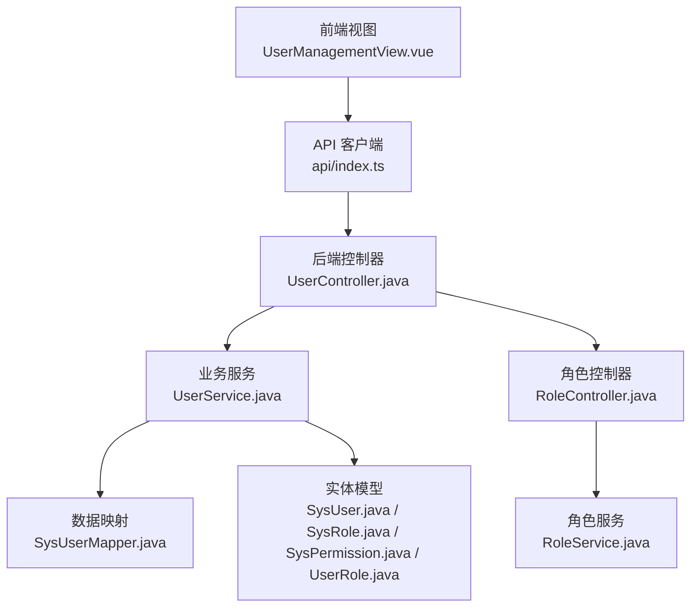
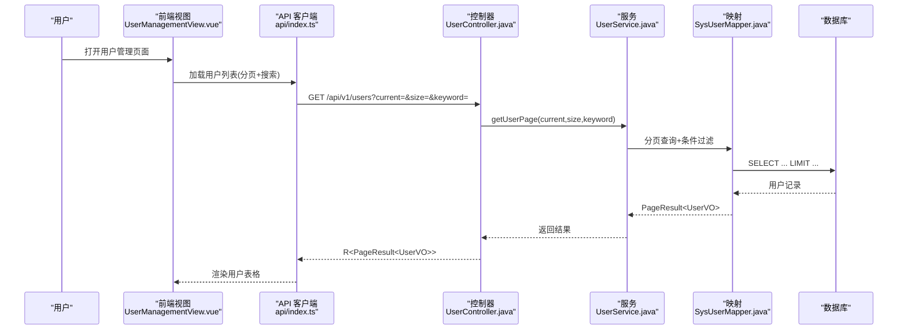
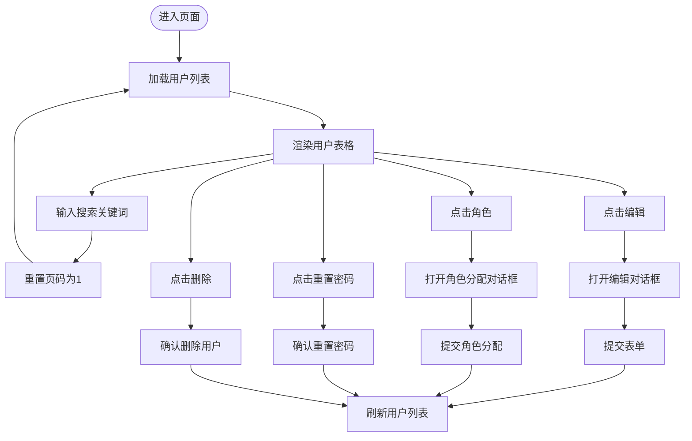
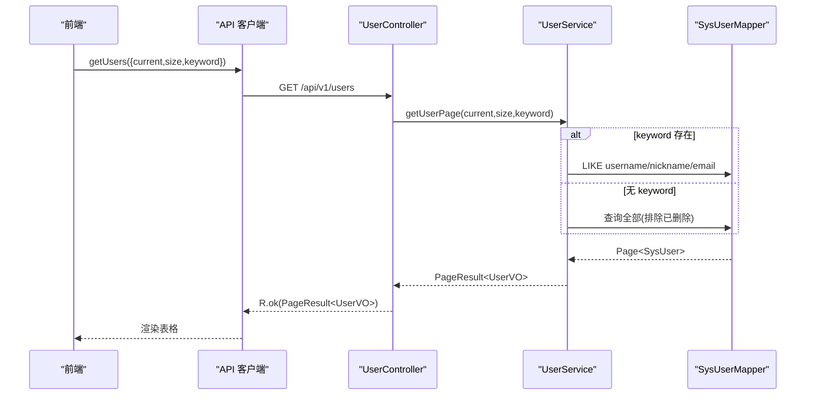
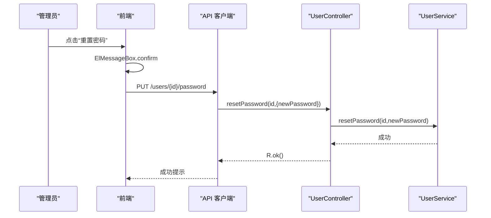
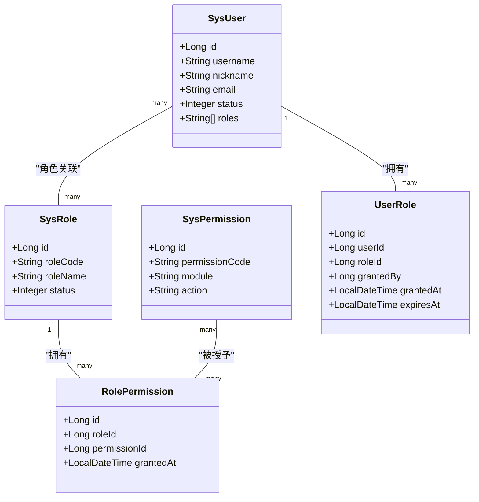
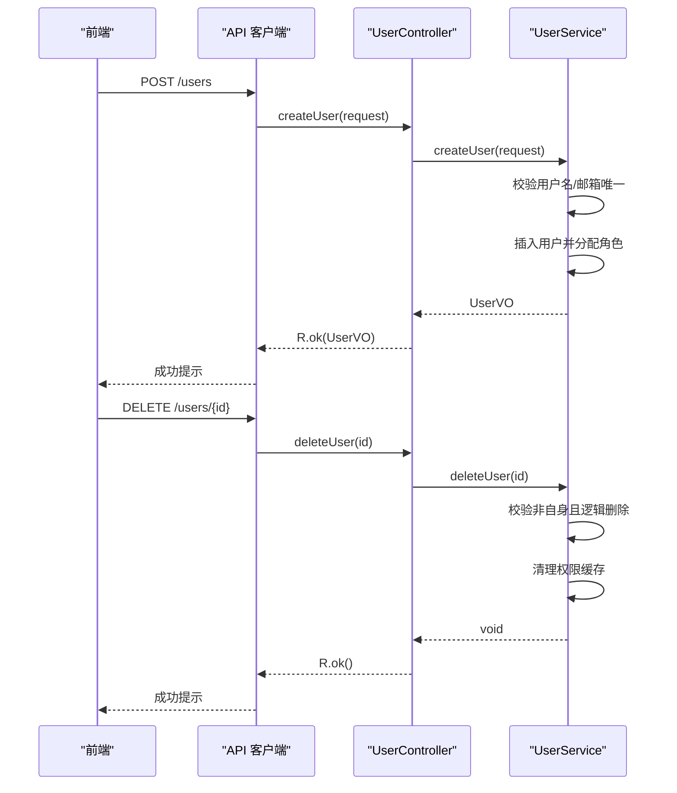
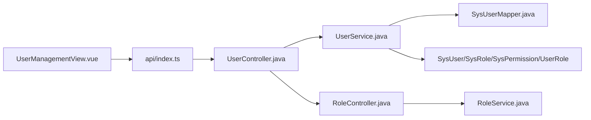

# 用户管理组件

<cite>
**本文档引用的文件**
- [UserManagementView.vue](file://netdata-ai-frontend/src/views/UserManagementView.vue)
- [index.ts](file://netdata-ai-frontend/src/api/index.ts)
- [UserController.java](file://netdata-ai-backend/src/main/java/com/netdata/ops/controller/UserController.java)
- [UserService.java](file://netdata-ai-backend/src/main/java/com/netdata/ops/service/UserService.java)
- [SysUser.java](file://netdata-ai-backend/src/main/java/com/netdata/ops/entity/SysUser.java)
- [UserCreateRequest.java](file://netdata-ai-backend/src/main/java/com/netdata/ops/dto/request/UserCreateRequest.java)
- [UserUpdateRequest.java](file://netdata-ai-backend/src/main/java/com/netdata/ops/dto/request/UserUpdateRequest.java)
- [UserVO.java](file://netdata-ai-backend/src/main/java/com/netdata/ops/dto/response/UserVO.java)
- [SysUserMapper.java](file://netdata-ai-backend/src/main/java/com/netdata/ops/mapper/SysUserMapper.java)
- [RoleController.java](file://netdata-ai-backend/src/main/java/com/netdata/ops/controller/RoleController.java)
- [RoleService.java](file://netdata-ai-backend/src/main/java/com/netdata/ops/service/RoleService.java)
- [SysRole.java](file://netdata-ai-backend/src/main/java/com/netdata/ops/entity/SysRole.java)
- [SysPermission.java](file://netdata-ai-backend/src/main/java/com/netdata/ops/entity/SysPermission.java)
- [UserRole.java](file://netdata-ai-backend/src/main/java/com/netdata/ops/entity/UserRole.java)
</cite>

## 目录
1. [简介](#简介)
2. [项目结构](#项目结构)
3. [核心组件](#核心组件)
4. [架构总览](#架构总览)
5. [详细组件分析](#详细组件分析)
6. [依赖关系分析](#依赖关系分析)
7. [性能考虑](#性能考虑)
8. [故障排除指南](#故障排除指南)
9. [结论](#结论)

## 简介
本组件为用户管理功能，提供完整的用户生命周期管理能力，包括用户列表展示、搜索与分页、基本信息编辑、角色权限分配、密码重置、用户删除等。前端采用 Vue 3 + Element Plus 构建交互界面，后端基于 Spring Boot + MyBatis-Plus 提供 REST API 与业务逻辑，支持 RBAC 权限模型与操作审计。

## 项目结构
用户管理组件由前后端协同实现：
- 前端：UserManagementView.vue 负责界面渲染与交互；api/index.ts 提供统一 API 客户端与拦截器。
- 后端：UserController 提供 REST 接口；UserService 实现业务逻辑；SysUser 及相关实体、Mapper、Service 层支撑数据访问与权限计算。

图表来源
- [UserManagementView.vue:1-303](file://netdata-ai-frontend/src/views/UserManagementView.vue#L1-L303)
- [index.ts:235-275](file://netdata-ai-frontend/src/api/index.ts#L235-L275)
- [UserController.java:23-94](file://netdata-ai-backend/src/main/java/com/netdata/ops/controller/UserController.java#L23-L94)
- [UserService.java:30-252](file://netdata-ai-backend/src/main/java/com/netdata/ops/service/UserService.java#L30-L252)
- [SysUserMapper.java:11-33](file://netdata-ai-backend/src/main/java/com/netdata/ops/mapper/SysUserMapper.java#L11-L33)
- [SysUser.java:11-56](file://netdata-ai-backend/src/main/java/com/netdata/ops/entity/SysUser.java#L11-L56)
- [RoleController.java:19-72](file://netdata-ai-backend/src/main/java/com/netdata/ops/controller/RoleController.java#L19-L72)
- [RoleService.java:24-135](file://netdata-ai-backend/src/main/java/com/netdata/ops/service/RoleService.java#L24-L135)

章节来源
- [UserManagementView.vue:1-303](file://netdata-ai-frontend/src/views/UserManagementView.vue#L1-L303)
- [index.ts:1-290](file://netdata-ai-frontend/src/api/index.ts#L1-L290)
- [UserController.java:23-94](file://netdata-ai-backend/src/main/java/com/netdata/ops/controller/UserController.java#L23-L94)
- [UserService.java:30-252](file://netdata-ai-backend/src/main/java/com/netdata/ops/service/UserService.java#L30-L252)
- [SysUserMapper.java:11-33](file://netdata-ai-backend/src/main/java/com/netdata/ops/mapper/SysUserMapper.java#L11-L33)
- [SysUser.java:11-56](file://netdata-ai-backend/src/main/java/com/netdata/ops/entity/SysUser.java#L11-L56)
- [RoleController.java:19-72](file://netdata-ai-backend/src/main/java/com/netdata/ops/controller/RoleController.java#L19-L72)
- [RoleService.java:24-135](file://netdata-ai-backend/src/main/java/com/netdata/ops/service/RoleService.java#L24-L135)

## 核心组件
- 前端视图组件：负责用户列表展示、搜索、分页、对话框交互、表单校验与提交。
- API 客户端：封装统一的请求/响应拦截、鉴权、错误处理与重试刷新。
- 控制器层：暴露 REST 接口，标注权限注解，进行参数绑定与返回包装。
- 服务层：实现业务规则、事务控制、权限缓存清理、实体转换。
- 数据访问层：MyBatis-Plus Mapper，提供分页查询、唯一性校验、权限/角色查询。
- 实体模型：SysUser、SysRole、SysPermission、UserRole，支撑 RBAC 数据结构。

章节来源
- [UserManagementView.vue:120-270](file://netdata-ai-frontend/src/views/UserManagementView.vue#L120-L270)
- [index.ts:235-275](file://netdata-ai-frontend/src/api/index.ts#L235-L275)
- [UserController.java:23-94](file://netdata-ai-backend/src/main/java/com/netdata/ops/controller/UserController.java#L23-L94)
- [UserService.java:30-252](file://netdata-ai-backend/src/main/java/com/netdata/ops/service/UserService.java#L30-L252)
- [SysUser.java:11-56](file://netdata-ai-backend/src/main/java/com/netdata/ops/entity/SysUser.java#L11-L56)
- [SysRole.java:11-38](file://netdata-ai-backend/src/main/java/com/netdata/ops/entity/SysRole.java#L11-L38)
- [SysPermission.java:11-45](file://netdata-ai-backend/src/main/java/com/netdata/ops/entity/SysPermission.java#L11-L45)
- [UserRole.java:11-33](file://netdata-ai-backend/src/main/java/com/netdata/ops/entity/UserRole.java#L11-L33)

## 架构总览
用户管理采用前后端分离架构，前端通过 API 客户端调用后端接口，后端控制器接收请求，服务层执行业务逻辑，数据层持久化到数据库。权限控制通过注解与切面实现，统一在响应拦截器中处理错误与权限不足提示。

图表来源
- [UserManagementView.vue:163-178](file://netdata-ai-frontend/src/views/UserManagementView.vue#L163-L178)
- [index.ts:239-241](file://netdata-ai-frontend/src/api/index.ts#L239-L241)
- [UserController.java:31-39](file://netdata-ai-backend/src/main/java/com/netdata/ops/controller/UserController.java#L31-L39)
- [UserService.java:45-63](file://netdata-ai-backend/src/main/java/com/netdata/ops/service/UserService.java#L45-L63)
- [SysUserMapper.java:14-32](file://netdata-ai-backend/src/main/java/com/netdata/ops/mapper/SysUserMapper.java#L14-L32)

## 详细组件分析

### 前端界面设计与交互
- 页面布局：标题区包含“新建用户”按钮；搜索栏支持按用户名/昵称/邮箱模糊搜索；用户表格展示 ID、用户名、昵称、邮箱、角色标签、状态、最后登录时间及操作列。
- 操作按钮：编辑、角色分配、重置密码、删除；删除与重置密码均弹出确认框。
- 对话框：创建/编辑对话框用于新增或更新用户基本信息；角色分配对话框用于勾选角色并提交。
- 表单校验：用户名、密码、昵称必填，密码长度限制；邮箱格式校验；手机号格式校验。
- 分页与搜索：分页组件触发分页变更与大小变更事件，重新加载用户列表；搜索输入防抖式触发。

图表来源
- [UserManagementView.vue:158-264](file://netdata-ai-frontend/src/views/UserManagementView.vue#L158-L264)

章节来源
- [UserManagementView.vue:1-118](file://netdata-ai-frontend/src/views/UserManagementView.vue#L1-L118)
- [UserManagementView.vue:120-270](file://netdata-ai-frontend/src/views/UserManagementView.vue#L120-L270)

### 用户数据获取与展示机制
- 分页加载：前端通过分页参数 current、size 请求后端；后端使用 MyBatis-Plus Page 进行分页查询，并按创建时间倒序。
- 搜索功能：关键词支持用户名、昵称、邮箱模糊匹配；空关键词时忽略搜索条件。
- 数据展示：后端将 SysUser 映射为 UserVO，包含角色列表（通过用户ID查询角色编码），前端以标签形式展示角色。

图表来源
- [UserController.java:31-39](file://netdata-ai-backend/src/main/java/com/netdata/ops/controller/UserController.java#L31-L39)
- [UserService.java:45-63](file://netdata-ai-backend/src/main/java/com/netdata/ops/service/UserService.java#L45-L63)
- [SysUserMapper.java:14-32](file://netdata-ai-backend/src/main/java/com/netdata/ops/mapper/SysUserMapper.java#L14-L32)
- [UserManagementView.vue:163-178](file://netdata-ai-frontend/src/views/UserManagementView.vue#L163-L178)

章节来源
- [UserController.java:31-39](file://netdata-ai-backend/src/main/java/com/netdata/ops/controller/UserController.java#L31-L39)
- [UserService.java:45-63](file://netdata-ai-backend/src/main/java/com/netdata/ops/service/UserService.java#L45-L63)
- [SysUserMapper.java:14-32](file://netdata-ai-backend/src/main/java/com/netdata/ops/mapper/SysUserMapper.java#L14-L32)
- [UserManagementView.vue:163-178](file://netdata-ai-frontend/src/views/UserManagementView.vue#L163-L178)

### 用户信息编辑功能
- 基本信息修改：编辑对话框仅允许修改昵称、邮箱、手机号、头像、状态；提交后调用 updateUser 接口。
- 密码重置：管理员可一键重置为默认密码，前端弹出确认框，后端清除登录失败计数与锁定时间。
- 头像上传：UserUpdateRequest 支持 avatar 字段；前端未内置上传组件，可在表单中传入头像 URL 或结合文件上传组件扩展。

图表来源
- [UserManagementView.vue:245-253](file://netdata-ai-frontend/src/views/UserManagementView.vue#L245-L253)
- [UserController.java:79-85](file://netdata-ai-backend/src/main/java/com/netdata/ops/controller/UserController.java#L79-L85)
- [UserService.java:192-205](file://netdata-ai-backend/src/main/java/com/netdata/ops/service/UserService.java#L192-L205)

章节来源
- [UserManagementView.vue:200-243](file://netdata-ai-frontend/src/views/UserManagementView.vue#L200-L243)
- [UserController.java:55-60](file://netdata-ai-backend/src/main/java/com/netdata/ops/controller/UserController.java#L55-L60)
- [UserService.java:117-137](file://netdata-ai-backend/src/main/java/com/netdata/ops/service/UserService.java#L117-L137)
- [UserUpdateRequest.java:11-29](file://netdata-ai-backend/src/main/java/com/netdata/ops/dto/request/UserUpdateRequest.java#L11-L29)

### 角色权限管理
- 角色分配：前端打开角色分配对话框，选择角色后提交；后端先清空旧关联，再批量插入新关联，并清理用户权限缓存。
- 权限模型：SysRole 与 SysPermission 通过 RolePermission 关联；用户权限通过用户ID查询角色编码与权限集合。
- 权限继承：通过角色层级与角色权限关联实现；临时授权可通过 UserRole 的过期时间字段控制。

图表来源
- [SysUser.java:11-56](file://netdata-ai-backend/src/main/java/com/netdata/ops/entity/SysUser.java#L11-L56)
- [SysRole.java:11-38](file://netdata-ai-backend/src/main/java/com/netdata/ops/entity/SysRole.java#L11-L38)
- [SysPermission.java:11-45](file://netdata-ai-backend/src/main/java/com/netdata/ops/entity/SysPermission.java#L11-L45)
- [UserRole.java:11-33](file://netdata-ai-backend/src/main/java/com/netdata/ops/entity/UserRole.java#L11-L33)

章节来源
- [UserService.java:163-187](file://netdata-ai-backend/src/main/java/com/netdata/ops/service/UserService.java#L163-L187)
- [RoleService.java:94-127](file://netdata-ai-backend/src/main/java/com/netdata/ops/service/RoleService.java#L94-L127)
- [SysUserMapper.java:20-32](file://netdata-ai-backend/src/main/java/com/netdata/ops/mapper/SysUserMapper.java#L20-L32)
- [RoleController.java:27-65](file://netdata-ai-backend/src/main/java/com/netdata/ops/controller/RoleController.java#L27-L65)

### 用户状态管理
- 启用/禁用：状态字段 0/1，前端开关控件直接提交；后端 updateUser 支持状态更新。
- 在线状态：当前未实现在线状态实时检测，可在前端通过 WebSocket 或定时轮询扩展。
- 最后登录时间：UserVO 包含 lastLoginAt 字段，前端表格直接展示。

章节来源
- [SysUser.java:35-46](file://netdata-ai-backend/src/main/java/com/netdata/ops/entity/SysUser.java#L35-L46)
- [UserUpdateRequest.java:25-29](file://netdata-ai-backend/src/main/java/com/netdata/ops/dto/request/UserUpdateRequest.java#L25-L29)
- [UserManagementView.vue:43-49](file://netdata-ai-frontend/src/views/UserManagementView.vue#L43-L49)

### 用户创建与删除
- 创建流程：前端表单校验用户名、密码、昵称；提交 createUser，后端校验唯一性并创建用户，可同时分配角色。
- 删除流程：管理员不可删除自身；删除为逻辑删除（deleted=1），并清理权限缓存。
- 表单验证：前端校验必填与格式；后端 DTO 校验长度与格式。
- 操作日志：服务层记录创建/更新/删除日志，便于审计。

图表来源
- [UserManagementView.vue:194-264](file://netdata-ai-frontend/src/views/UserManagementView.vue#L194-L264)
- [UserController.java:48-68](file://netdata-ai-backend/src/main/java/com/netdata/ops/controller/UserController.java#L48-L68)
- [UserService.java:76-161](file://netdata-ai-backend/src/main/java/com/netdata/ops/service/UserService.java#L76-L161)
- [UserCreateRequest.java:14-39](file://netdata-ai-backend/src/main/java/com/netdata/ops/dto/request/UserCreateRequest.java#L14-L39)

章节来源
- [UserManagementView.vue:194-264](file://netdata-ai-frontend/src/views/UserManagementView.vue#L194-L264)
- [UserController.java:48-68](file://netdata-ai-backend/src/main/java/com/netdata/ops/controller/UserController.java#L48-L68)
- [UserService.java:76-161](file://netdata-ai-backend/src/main/java/com/netdata/ops/service/UserService.java#L76-L161)
- [UserCreateRequest.java:14-39](file://netdata-ai-backend/src/main/java/com/netdata/ops/dto/request/UserCreateRequest.java#L14-L39)

### 用户统计功能
- 活跃用户统计：可基于 lastLoginAt 时间范围统计近期登录用户数量。
- 新用户趋势：按创建时间分组统计月度/周度新增用户数。
- 权限分布：按角色统计用户数量，或按权限统计拥有该权限的用户数。
- 实现建议：后端提供统计接口，前端使用 ECharts 或类似图表库展示。

[本节为概念性内容，无需文件引用]

## 依赖关系分析
- 前端依赖：Element Plus 组件库、Axios、Vue 3 Composition API。
- 后端依赖：Spring Boot、MyBatis-Plus、Spring Security、Redis（权限缓存）。
- 权限控制：RequirePermission 注解配合切面实现方法级权限校验。
- 错误处理：统一响应包装 R<T>，拦截器集中处理 401/403/429 等错误。

图表来源
- [UserManagementView.vue:120-123](file://netdata-ai-frontend/src/views/UserManagementView.vue#L120-L123)
- [index.ts:235-275](file://netdata-ai-frontend/src/api/index.ts#L235-L275)
- [UserController.java:23-94](file://netdata-ai-backend/src/main/java/com/netdata/ops/controller/UserController.java#L23-L94)
- [UserService.java:30-252](file://netdata-ai-backend/src/main/java/com/netdata/ops/service/UserService.java#L30-L252)
- [SysUserMapper.java:11-33](file://netdata-ai-backend/src/main/java/com/netdata/ops/mapper/SysUserMapper.java#L11-L33)
- [RoleController.java:19-72](file://netdata-ai-backend/src/main/java/com/netdata/ops/controller/RoleController.java#L19-L72)
- [RoleService.java:24-135](file://netdata-ai-backend/src/main/java/com/netdata/ops/service/RoleService.java#L24-L135)

章节来源
- [index.ts:29-118](file://netdata-ai-frontend/src/api/index.ts#L29-L118)
- [UserController.java:3-27](file://netdata-ai-backend/src/main/java/com/netdata/ops/controller/UserController.java#L3-L27)
- [RoleController.java:3-23](file://netdata-ai-backend/src/main/java/com/netdata/ops/controller/RoleController.java#L3-L23)

## 性能考虑
- 分页与排序：后端按创建时间倒序，避免全表扫描；建议对 username、nickname、email 建立索引以提升搜索性能。
- 缓存策略：用户权限缓存前缀 USER_PERMS_CACHE_PREFIX，角色/权限变更时及时清理，避免脏读。
- 并发控制：角色分配与权限变更使用事务，确保一致性。
- 前端优化：搜索输入防抖、分页懒加载、对话框异步加载角色列表。

[本节为通用指导，无需文件引用]

## 故障排除指南
- 权限不足：响应拦截器捕获 403，提示“权限不足，无法执行此操作”，需检查当前用户角色与目标权限。
- 登录失效：401 时自动刷新令牌，若刷新失败则跳转登录页。
- 参数错误：DTO 校验失败会返回具体错误信息，前端根据规则提示。
- 业务异常：如用户名/邮箱重复、用户不存在、不能删除自身等，服务层抛出业务异常并记录日志。

章节来源
- [index.ts:94-118](file://netdata-ai-frontend/src/api/index.ts#L94-L118)
- [UserService.java:80-92](file://netdata-ai-backend/src/main/java/com/netdata/ops/service/UserService.java#L80-L92)
- [UserService.java:142-156](file://netdata-ai-backend/src/main/java/com/netdata/ops/service/UserService.java#L142-L156)

## 结论
用户管理组件提供了完善的用户生命周期管理能力，从前端交互到后端权限控制形成闭环。通过 RBAC 模型与角色权限继承机制，满足多场景下的权限需求。建议后续增强在线状态检测、头像上传组件集成与统计可视化，进一步提升用户体验与可观测性。