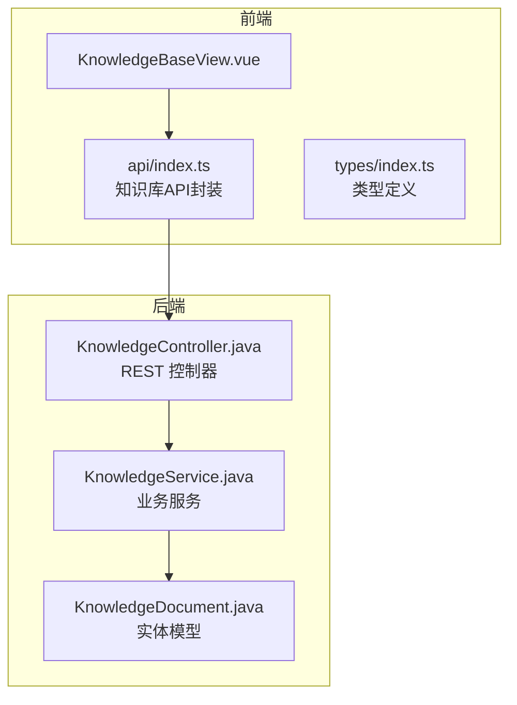
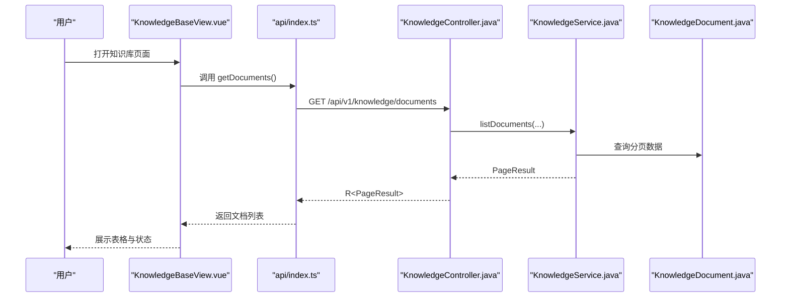
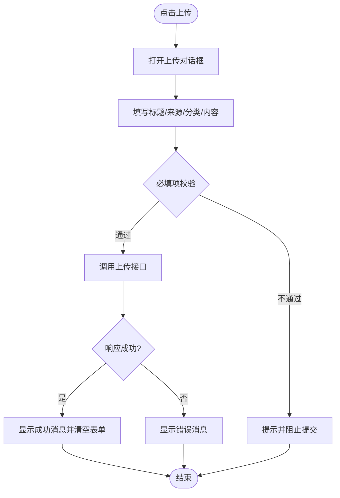
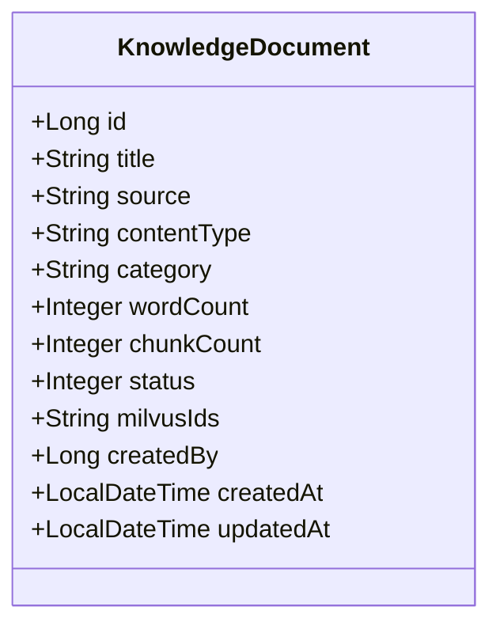
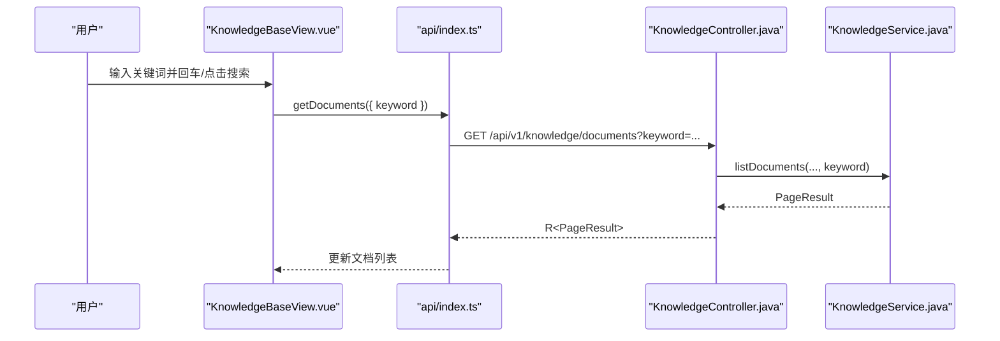
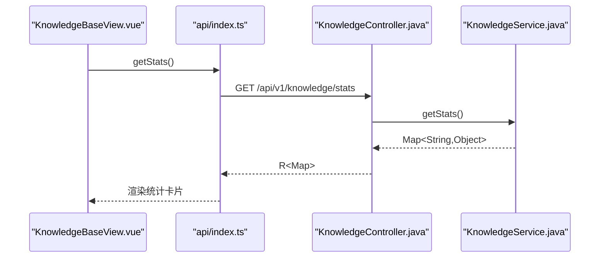
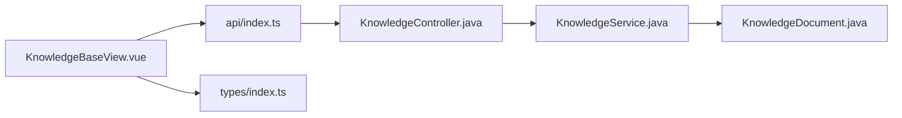

# 知识库管理组件

<cite>
**本文引用的文件**
- [KnowledgeBaseView.vue](file://netdata-ai-frontend/src/views/KnowledgeBaseView.vue)
- [index.ts](file://netdata-ai-frontend/src/types/index.ts)
- [index.ts](file://netdata-ai-frontend/src/api/index.ts)
- [KnowledgeController.java](file://netdata-ai-backend/src/main/java/com/netdata/ops/controller/KnowledgeController.java)
- [KnowledgeService.java](file://netdata-ai-backend/src/main/java/com/netdata/ops/service/KnowledgeService.java)
- [KnowledgeDocument.java](file://netdata-ai-backend/src/main/java/com/netdata/ops/entity/KnowledgeDocument.java)
</cite>

## 目录
1. [简介](#简介)
2. [项目结构](#项目结构)
3. [核心组件](#核心组件)
4. [架构总览](#架构总览)
5. [详细组件分析](#详细组件分析)
6. [依赖分析](#依赖分析)
7. [性能考虑](#性能考虑)
8. [故障排除指南](#故障排除指南)
9. [结论](#结论)
10. [附录](#附录)

## 简介
本文件为“知识库管理组件”的详细技术文档，围绕前端视图组件 KnowledgeBaseView.vue 的功能架构展开，涵盖文档上传、分类管理、搜索与筛选、文档详情展示、编辑与删除、权限控制与版本管理、以及知识库统计等能力。由于当前前端实现仍以本地模拟数据为主，本文在描述具体实现时明确标注“当前实现”与“后端接口”，并在可行范围内给出对接后端接口后的预期行为与流程。

## 项目结构
知识库管理组件位于前端工程的视图层，采用 Vue 3 + TypeScript + Element Plus 构建；后端提供 REST 接口，负责文档的增删改查、分类统计与权限校验。

图表来源
- [KnowledgeBaseView.vue:1-209](file://netdata-ai-frontend/src/views/KnowledgeBaseView.vue#L1-L209)
- [index.ts:147-170](file://netdata-ai-frontend/src/api/index.ts#L147-L170)
- [KnowledgeController.java:19-81](file://netdata-ai-backend/src/main/java/com/netdata/ops/controller/KnowledgeController.java#L19-L81)
- [KnowledgeService.java:34-52](file://netdata-ai-backend/src/main/java/com/netdata/ops/service/KnowledgeService.java#L34-L52)
- [KnowledgeDocument.java:11-46](file://netdata-ai-backend/src/main/java/com/netdata/ops/entity/KnowledgeDocument.java#L11-L46)

章节来源
- [KnowledgeBaseView.vue:1-209](file://netdata-ai-frontend/src/views/KnowledgeBaseView.vue#L1-L209)
- [index.ts:147-170](file://netdata-ai-frontend/src/api/index.ts#L147-L170)
- [KnowledgeController.java:19-81](file://netdata-ai-backend/src/main/java/com/netdata/ops/controller/KnowledgeController.java#L19-L81)
- [KnowledgeService.java:34-52](file://netdata-ai-backend/src/main/java/com/netdata/ops/service/KnowledgeService.java#L34-L52)
- [KnowledgeDocument.java:11-46](file://netdata-ai-backend/src/main/java/com/netdata/ops/entity/KnowledgeDocument.java#L11-L46)

## 核心组件
- 前端视图组件：负责用户交互、表单输入、表格展示、对话框弹出与消息提示。
- 知识库 API：封装 /api/v1/knowledge 下的文档 CRUD、分类与统计接口。
- 后端控制器：暴露文档列表、详情、上传、删除、分类与统计等接口，并进行权限注解校验。
- 服务层：实现分页查询、创建文档、删除文档、分类聚合与统计逻辑。
- 实体模型：映射数据库表 knowledge_document，承载文档字段与状态。

章节来源
- [KnowledgeBaseView.vue:90-191](file://netdata-ai-frontend/src/views/KnowledgeBaseView.vue#L90-L191)
- [index.ts:147-170](file://netdata-ai-frontend/src/api/index.ts#L147-L170)
- [KnowledgeController.java:27-80](file://netdata-ai-backend/src/main/java/com/netdata/ops/controller/KnowledgeController.java#L27-L80)
- [KnowledgeService.java:34-146](file://netdata-ai-backend/src/main/java/com/netdata/ops/service/KnowledgeService.java#L34-L146)
- [KnowledgeDocument.java:11-46](file://netdata-ai-backend/src/main/java/com/netdata/ops/entity/KnowledgeDocument.java#L11-L46)

## 架构总览
前端通过知识库 API 调用后端控制器，控制器委托服务层执行业务逻辑，服务层与数据库实体交互。权限通过注解 RequirePermission 校验，确保仅具备相应权限的用户可访问。

图表来源
- [KnowledgeBaseView.vue:29-53](file://netdata-ai-frontend/src/views/KnowledgeBaseView.vue#L29-L53)
- [index.ts:150-155](file://netdata-ai-frontend/src/api/index.ts#L150-L155)
- [KnowledgeController.java:27-37](file://netdata-ai-backend/src/main/java/com/netdata/ops/controller/KnowledgeController.java#L27-L37)
- [KnowledgeService.java:34-52](file://netdata-ai-backend/src/main/java/com/netdata/ops/service/KnowledgeService.java#L34-L52)
- [KnowledgeDocument.java:11-46](file://netdata-ai-backend/src/main/java/com/netdata/ops/entity/KnowledgeDocument.java#L11-L46)

## 详细组件分析

### 文档上传流程
- 当前实现（前端）：打开上传对话框，填写标题与内容后提交，前端弹出成功提示并清空表单。该流程目前为本地模拟，未实际调用后端上传接口。
- 后端接口（计划对接）：POST /api/v1/knowledge/documents，接收标题、来源、内容与分类等字段，返回创建成功的文档对象。
- 文件格式验证、大小限制与上传进度：当前前端未实现文件选择与进度条，建议在表单中增加文件域，并在上传时进行类型与大小校验，结合后端流式或分片上传实现进度反馈。

图表来源
- [KnowledgeBaseView.vue:56-86](file://netdata-ai-frontend/src/views/KnowledgeBaseView.vue#L56-L86)
- [index.ts:158-162](file://netdata-ai-frontend/src/api/index.ts#L158-L162)
- [KnowledgeController.java:46-58](file://netdata-ai-backend/src/main/java/com/netdata/ops/controller/KnowledgeController.java#L46-L58)

章节来源
- [KnowledgeBaseView.vue:56-86](file://netdata-ai-frontend/src/views/KnowledgeBaseView.vue#L56-L86)
- [index.ts:158-162](file://netdata-ai-frontend/src/api/index.ts#L158-L162)
- [KnowledgeController.java:46-58](file://netdata-ai-backend/src/main/java/com/netdata/ops/controller/KnowledgeController.java#L46-L58)

### 文档分类管理机制
- 分类选项（当前前端）：手动选择“运维手册/故障案例/最佳实践/其他”。建议改为从后端接口动态拉取分类列表，以支持统一维护与扩展。
- 分类树形结构：当前未实现树形结构，可在后端提供分类层级数据（父级/子级），前端渲染为树形控件。
- 元数据管理：文档实体包含标题、来源、内容类型、分类、字数、切片数、状态、创建时间等字段。建议在后端完善分类与标签的统一管理与关联。

图表来源
- [KnowledgeDocument.java:11-46](file://netdata-ai-backend/src/main/java/com/netdata/ops/entity/KnowledgeDocument.java#L11-L46)

章节来源
- [KnowledgeBaseView.vue:65-72](file://netdata-ai-frontend/src/views/KnowledgeBaseView.vue#L65-L72)
- [KnowledgeController.java:68-73](file://netdata-ai-backend/src/main/java/com/netdata/ops/controller/KnowledgeController.java#L68-L73)
- [KnowledgeService.java:112-124](file://netdata-ai-backend/src/main/java/com/netdata/ops/service/KnowledgeService.java#L112-L124)
- [KnowledgeDocument.java:11-46](file://netdata-ai-backend/src/main/java/com/netdata/ops/entity/KnowledgeDocument.java#L11-L46)

### 全文搜索与筛选
- 搜索栏（当前前端）：支持关键词输入，但未触发实际搜索请求。建议绑定搜索关键词到分页查询参数，调用后端接口按标题模糊匹配。
- 后端接口：GET /api/v1/knowledge/documents 支持 keyword 参数，服务层对标题进行模糊匹配并按创建时间倒序。

图表来源
- [KnowledgeBaseView.vue:14-26](file://netdata-ai-frontend/src/views/KnowledgeBaseView.vue#L14-L26)
- [index.ts:150-155](file://netdata-ai-frontend/src/api/index.ts#L150-L155)
- [KnowledgeController.java:27-37](file://netdata-ai-backend/src/main/java/com/netdata/ops/controller/KnowledgeController.java#L27-L37)
- [KnowledgeService.java:34-52](file://netdata-ai-backend/src/main/java/com/netdata/ops/service/KnowledgeService.java#L34-L52)

章节来源
- [KnowledgeBaseView.vue:14-26](file://netdata-ai-frontend/src/views/KnowledgeBaseView.vue#L14-L26)
- [index.ts:150-155](file://netdata-ai-frontend/src/api/index.ts#L150-L155)
- [KnowledgeController.java:27-37](file://netdata-ai-backend/src/main/java/com/netdata/ops/controller/KnowledgeController.java#L27-L37)
- [KnowledgeService.java:34-52](file://netdata-ai-backend/src/main/java/com/netdata/ops/service/KnowledgeService.java#L34-L52)

### 文档详情展示
- 当前实现：表格操作列提供“查看/删除”按钮，但“查看”按钮未绑定具体详情展示逻辑。建议在点击“查看”时打开详情弹窗或跳转详情页，调用后端 GET /api/v1/knowledge/documents/{id} 获取详情。
- 元信息显示：基于文档实体字段展示标题、来源、分类、字数、切片数、状态与创建时间。
- 下载功能：当前未实现，可在详情页提供下载入口，调用后端对应接口或直接从内容字段导出。

章节来源
- [KnowledgeBaseView.vue:47-52](file://netdata-ai-frontend/src/views/KnowledgeBaseView.vue#L47-L52)
- [index.ts:150-155](file://netdata-ai-frontend/src/api/index.ts#L150-L155)
- [KnowledgeController.java:39-44](file://netdata-ai-backend/src/main/java/com/netdata/ops/controller/KnowledgeController.java#L39-L44)
- [KnowledgeDocument.java:11-46](file://netdata-ai-backend/src/main/java/com/netdata/ops/entity/KnowledgeDocument.java#L11-L46)

### 编辑与删除功能
- 删除：当前实现通过 ElMessageBox 确认后，前端直接从本地数组移除并提示成功。建议改为调用后端 DELETE /api/v1/knowledge/documents/{id}，并在成功后刷新列表。
- 编辑：当前未实现。建议新增编辑对话框，支持修改标题、来源、分类与内容，调用后端更新接口（若存在）或重新上传覆盖。

章节来源
- [KnowledgeBaseView.vue:176-191](file://netdata-ai-frontend/src/views/KnowledgeBaseView.vue#L176-L191)
- [index.ts:164-169](file://netdata-ai-frontend/src/api/index.ts#L164-L169)
- [KnowledgeController.java:60-66](file://netdata-ai-backend/src/main/java/com/netdata/ops/controller/KnowledgeController.java#L60-L66)

### 权限控制与版本管理
- 权限控制：后端控制器使用 @RequirePermission 注解，分别对读取、写入与删除进行权限校验，确保安全访问。
- 版本管理：当前未实现版本字段与版本对比功能。建议在实体中增加版本号与版本历史表，支持版本切换与差异对比。

章节来源
- [KnowledgeController.java:27-66](file://netdata-ai-backend/src/main/java/com/netdata/ops/controller/KnowledgeController.java#L27-L66)
- [KnowledgeDocument.java:11-46](file://netdata-ai-backend/src/main/java/com/netdata/ops/entity/KnowledgeDocument.java#L11-L46)

### 知识库统计
- 当前实现：前端未调用统计接口。建议在页面初始化时调用 GET /api/v1/knowledge/stats，展示总文档数、已完成与处理中数量等指标。
- 后端接口：服务层计算总数、已完成与处理中数量，返回统计结果。

图表来源
- [KnowledgeBaseView.vue:1-209](file://netdata-ai-frontend/src/views/KnowledgeBaseView.vue#L1-L209)
- [index.ts:170-170](file://netdata-ai-frontend/src/api/index.ts#L170-L170)
- [KnowledgeController.java:75-80](file://netdata-ai-backend/src/main/java/com/netdata/ops/controller/KnowledgeController.java#L75-L80)
- [KnowledgeService.java:129-140](file://netdata-ai-backend/src/main/java/com/netdata/ops/service/KnowledgeService.java#L129-L140)

章节来源
- [KnowledgeBaseView.vue:1-209](file://netdata-ai-frontend/src/views/KnowledgeBaseView.vue#L1-L209)
- [index.ts:170-170](file://netdata-ai-frontend/src/api/index.ts#L170-L170)
- [KnowledgeController.java:75-80](file://netdata-ai-backend/src/main/java/com/netdata/ops/controller/KnowledgeController.java#L75-L80)
- [KnowledgeService.java:129-140](file://netdata-ai-backend/src/main/java/com/netdata/ops/service/KnowledgeService.java#L129-L140)

## 依赖分析
- 前端依赖关系：KnowledgeBaseView.vue 依赖 Element Plus 组件与 dayjs 进行时间格式化；通过 api/index.ts 的知识库 API 封装与后端交互；类型定义来自 types/index.ts。
- 后端依赖关系：KnowledgeController 依赖 KnowledgeService；服务层依赖 KnowledgeDocumentMapper 与实体类；实体类映射数据库表字段。

图表来源
- [KnowledgeBaseView.vue:90-191](file://netdata-ai-frontend/src/views/KnowledgeBaseView.vue#L90-L191)
- [index.ts:147-170](file://netdata-ai-frontend/src/api/index.ts#L147-L170)
- [KnowledgeController.java:23-80](file://netdata-ai-backend/src/main/java/com/netdata/ops/controller/KnowledgeController.java#L23-L80)
- [KnowledgeService.java:27-146](file://netdata-ai-backend/src/main/java/com/netdata/ops/service/KnowledgeService.java#L27-L146)
- [KnowledgeDocument.java:11-46](file://netdata-ai-backend/src/main/java/com/netdata/ops/entity/KnowledgeDocument.java#L11-L46)

章节来源
- [KnowledgeBaseView.vue:90-191](file://netdata-ai-frontend/src/views/KnowledgeBaseView.vue#L90-L191)
- [index.ts:147-170](file://netdata-ai-frontend/src/api/index.ts#L147-L170)
- [KnowledgeController.java:23-80](file://netdata-ai-backend/src/main/java/com/netdata/ops/controller/KnowledgeController.java#L23-L80)
- [KnowledgeService.java:27-146](file://netdata-ai-backend/src/main/java/com/netdata/ops/service/KnowledgeService.java#L27-L146)
- [KnowledgeDocument.java:11-46](file://netdata-ai-backend/src/main/java/com/netdata/ops/entity/KnowledgeDocument.java#L11-L46)

## 性能考虑
- 列表分页：后端已提供分页查询接口，前端应配合分页参数使用，避免一次性加载过多数据。
- 搜索优化：后端对标题进行模糊匹配，建议在高频场景下引入索引或搜索引擎（如 ES/Milvus）提升检索性能。
- 上传优化：大文件上传建议采用断点续传与分片上传策略，结合后端流式处理与进度回调。
- 图标与样式：Element Plus 图标与样式按需引入，减少首屏体积。

## 故障排除指南
- 401 未认证：前端拦截器检测到 401 时尝试刷新令牌，若失败则跳转登录页。请检查本地存储中的 access_token 与 refresh_token。
- 403 权限不足：当前端统一提示“权限不足”。请确认用户是否具备 knowledge:read/knowledge:write/knowledge:delete 权限。
- 429 请求频繁：前端统一提示“请求过于频繁，请稍后再试”。请降低请求频率或增加节流。
- 删除异常：当前前端直接移除本地数据，建议改为调用后端接口并捕获异常，提示用户重试。

章节来源
- [index.ts:43-112](file://netdata-ai-frontend/src/api/index.ts#L43-L112)
- [KnowledgeController.java:27-66](file://netdata-ai-backend/src/main/java/com/netdata/ops/controller/KnowledgeController.java#L27-L66)

## 结论
当前知识库管理组件以本地模拟数据为主，实现了基础的上传对话框、表格展示与删除交互。为满足生产需求，建议尽快对接后端接口，完善文档上传（含格式与大小校验、进度反馈）、全文搜索（关键词匹配与排序）、分类树形结构、文档详情与下载、编辑与删除、权限控制与版本管理、以及知识库统计等能力。

## 附录
- 类型定义参考：文档实体与上传请求类型定义见 types/index.ts。
- API 接口参考：知识库相关接口定义见 api/index.ts。

章节来源
- [index.ts:147-170](file://netdata-ai-frontend/src/api/index.ts#L147-L170)
- [index.ts:149-169](file://netdata-ai-frontend/src/types/index.ts#L149-L169)