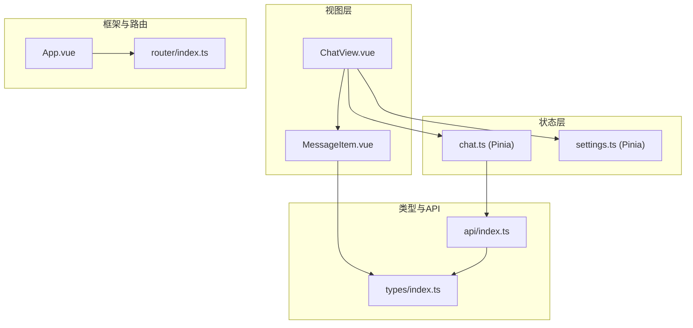
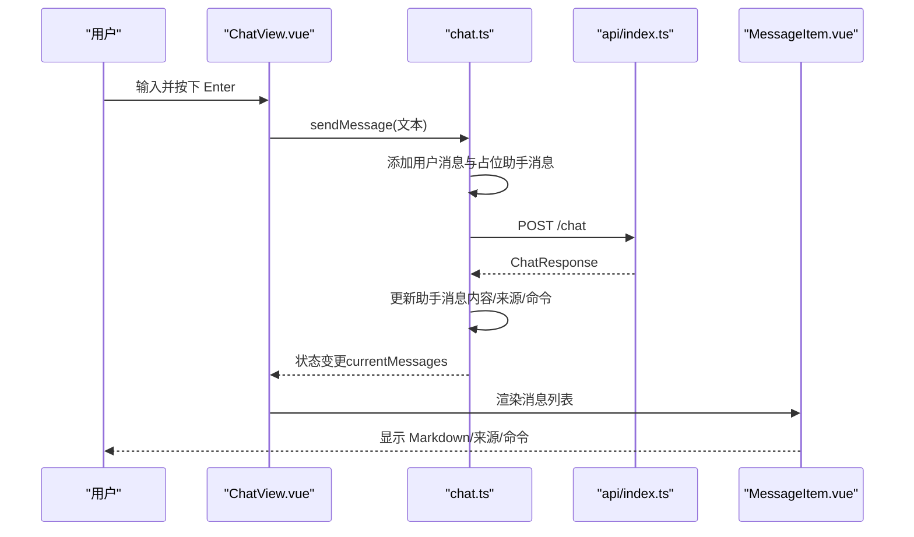
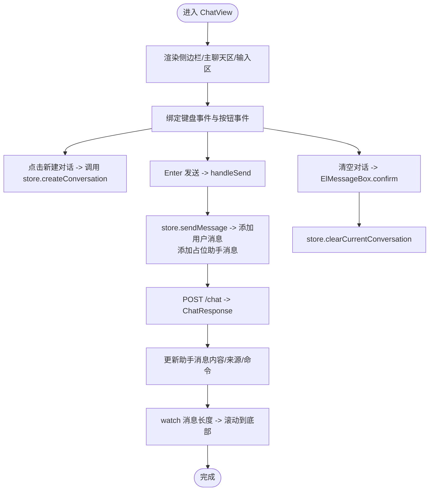
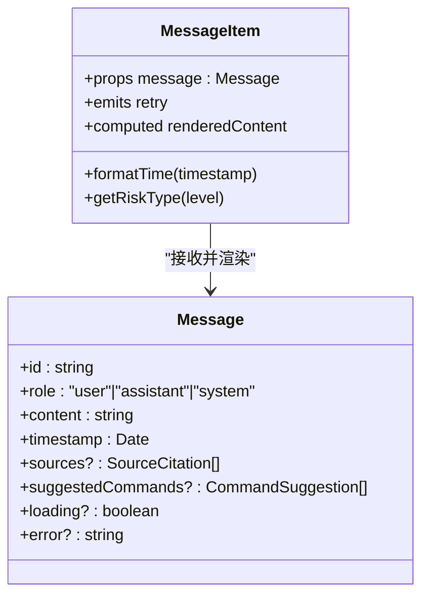
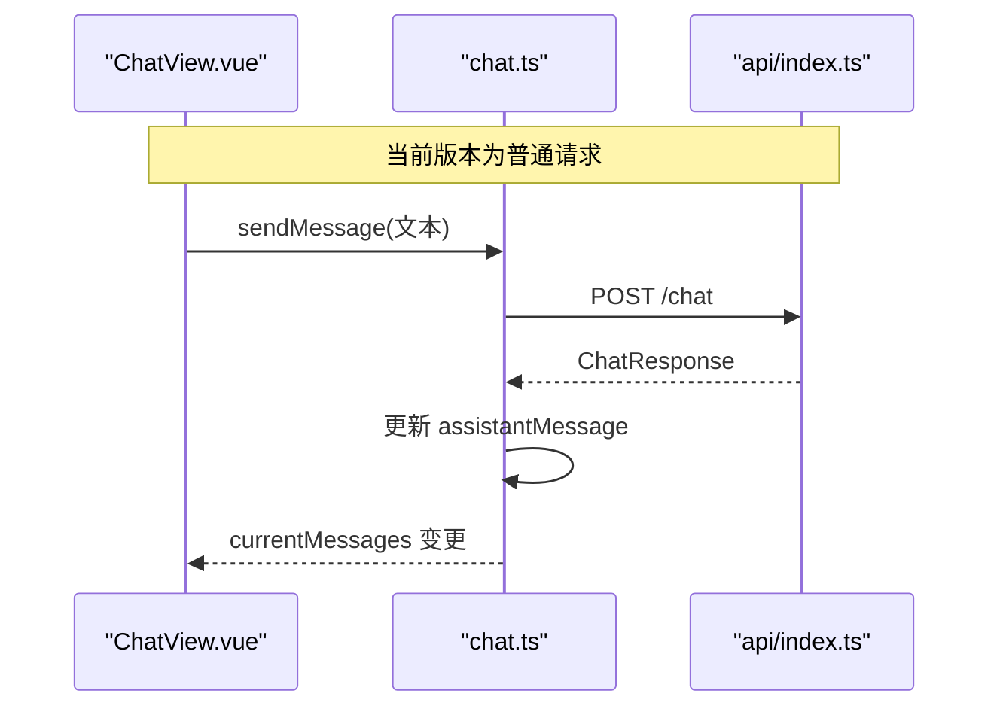
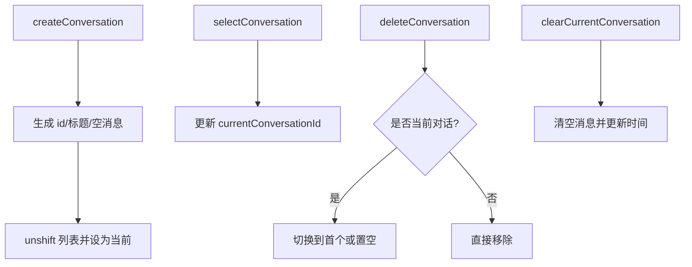
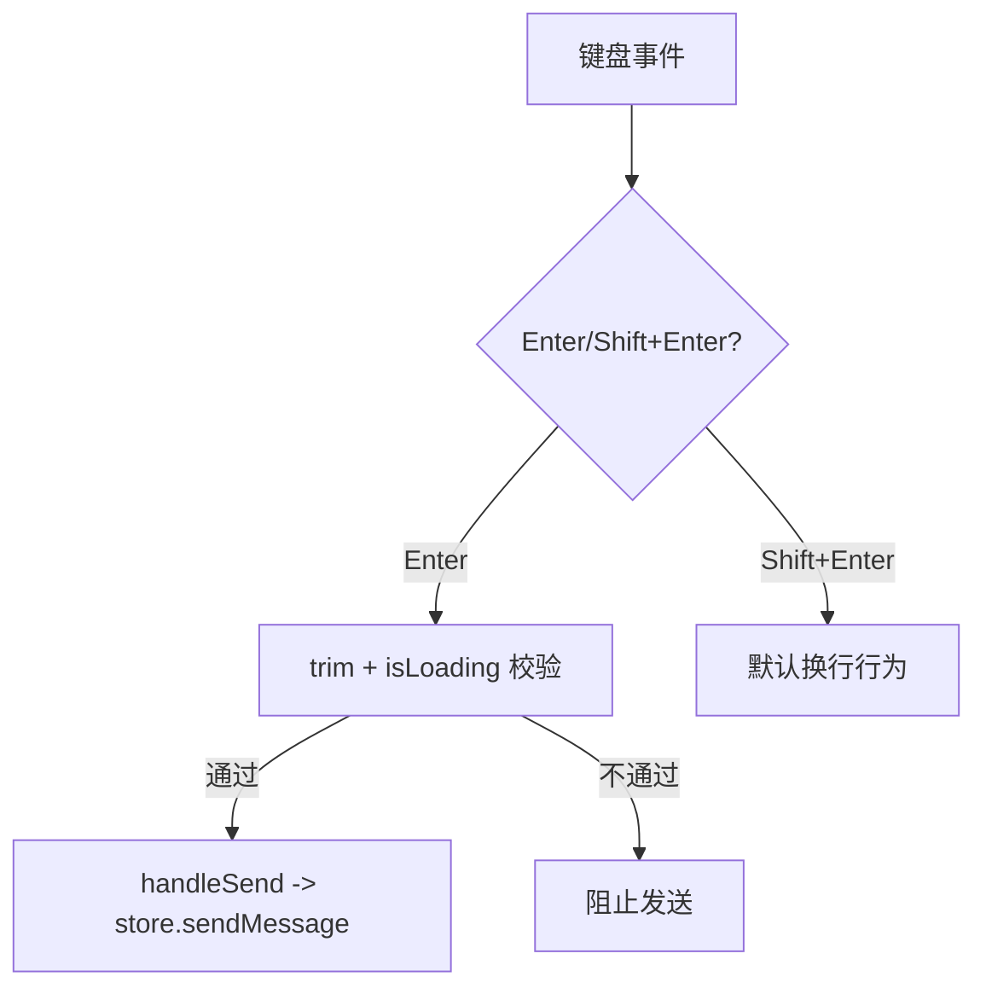
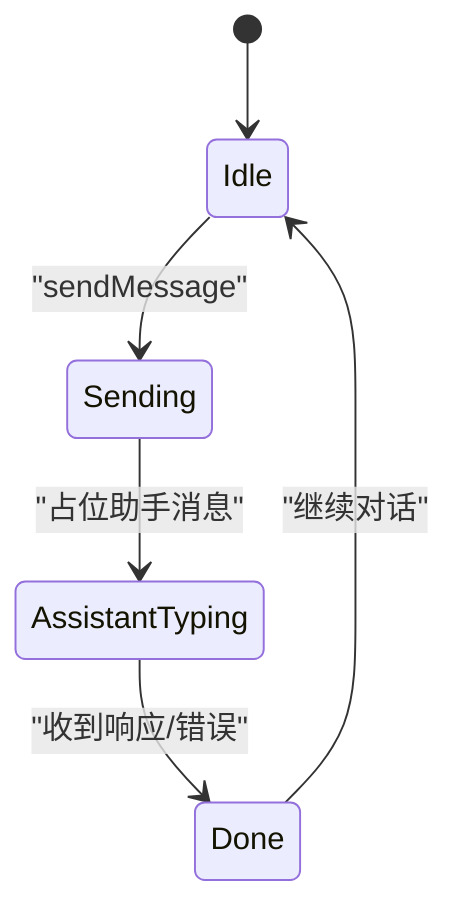
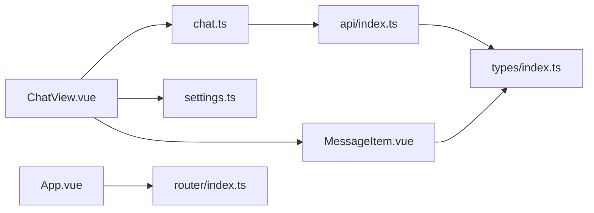

# 聊天界面组件

<cite>
**本文引用的文件**
- [ChatView.vue](file://netdata-ai-frontend/src/views/ChatView.vue)
- [MessageItem.vue](file://netdata-ai-frontend/src/components/MessageItem.vue)
- [chat.ts](file://netdata-ai-frontend/src/stores/chat.ts)
- [settings.ts](file://netdata-ai-frontend/src/stores/settings.ts)
- [index.ts](file://netdata-ai-frontend/src/stores/index.ts)
- [index.ts](file://netdata-ai-frontend/src/types/index.ts)
- [index.ts](file://netdata-ai-frontend/src/api/index.ts)
- [index.ts](file://netdata-ai-frontend/src/router/index.ts)
- [App.vue](file://netdata-ai-frontend/src/App.vue)
</cite>

## 目录
1. [简介](#简介)
2. [项目结构](#项目结构)
3. [核心组件](#核心组件)
4. [架构总览](#架构总览)
5. [详细组件分析](#详细组件分析)
6. [依赖关系分析](#依赖关系分析)
7. [性能考量](#性能考量)
8. [故障排查指南](#故障排查指南)
9. [结论](#结论)
10. [附录](#附录)

## 简介
本文件为聊天界面组件的详细技术文档，围绕 ChatView.vue 的设计与实现进行系统性解析，涵盖：
- 侧边栏对话列表、主聊天区域与输入区域的布局设计
- 消息列表渲染机制与 MessageItem 组件的复用策略
- 实时消息推送与 WebSocket 连接管理（当前版本采用普通请求，后续可升级为 SSE）
- 对话管理功能：新建、删除、切换与清空
- 键盘快捷键支持（Shift+Enter 换行，Enter 发送）与输入验证
- 组件状态管理：Pinia 聊天 store 的状态流转与数据持久化
- 样式定制指南与响应式设计实现

## 项目结构
该聊天界面位于前端工程 netdata-ai-frontend 中，采用 Vue 3 + TypeScript + Element Plus + Pinia 架构。核心文件组织如下：
- 视图层：ChatView.vue（主聊天界面）、MessageItem.vue（消息项渲染）
- 状态层：stores/chat.ts（聊天 store）、stores/settings.ts（应用设置 store）
- 类型定义：types/index.ts（消息、对话、API 响应等类型）
- API 层：api/index.ts（Axios 客户端与拦截器、聊天接口封装）
- 路由层：router/index.ts（路由配置与守卫）
- 应用入口：App.vue（Element Plus 国际化配置）

图表来源
- [ChatView.vue:1-335](file://netdata-ai-frontend/src/views/ChatView.vue#L1-L335)
- [MessageItem.vue:1-381](file://netdata-ai-frontend/src/components/MessageItem.vue#L1-L381)
- [chat.ts:1-210](file://netdata-ai-frontend/src/stores/chat.ts#L1-L210)
- [settings.ts:1-32](file://netdata-ai-frontend/src/stores/settings.ts#L1-L32)
- [index.ts:1-169](file://netdata-ai-frontend/src/types/index.ts#L1-L169)
- [index.ts:1-290](file://netdata-ai-frontend/src/api/index.ts#L1-L290)
- [index.ts:1-70](file://netdata-ai-frontend/src/router/index.ts#L1-L70)
- [App.vue:1-19](file://netdata-ai-frontend/src/App.vue#L1-L19)

章节来源
- [ChatView.vue:1-335](file://netdata-ai-frontend/src/views/ChatView.vue#L1-L335)
- [MessageItem.vue:1-381](file://netdata-ai-frontend/src/components/MessageItem.vue#L1-L381)
- [chat.ts:1-210](file://netdata-ai-frontend/src/stores/chat.ts#L1-L210)
- [settings.ts:1-32](file://netdata-ai-frontend/src/stores/settings.ts#L1-L32)
- [index.ts:1-169](file://netdata-ai-frontend/src/types/index.ts#L1-L169)
- [index.ts:1-290](file://netdata-ai-frontend/src/api/index.ts#L1-L290)
- [index.ts:1-70](file://netdata-ai-frontend/src/router/index.ts#L1-L70)
- [App.vue:1-19](file://netdata-ai-frontend/src/App.vue#L1-L19)

## 核心组件
- ChatView.vue：负责整体布局、事件绑定、快捷键处理、滚动控制与对话管理调用
- MessageItem.vue：负责单条消息的渲染，含 Markdown 渲染、来源引用、命令建议、加载与错误态
- chat.ts：Pinia 聊天 store，管理对话列表、当前对话、消息发送、重新生成回复、清空对话等
- settings.ts：Pinia 设置 store，管理主题与侧边栏折叠状态
- types/index.ts：定义消息、对话、来源引用、命令建议、聊天请求/响应等类型
- api/index.ts：Axios 客户端与拦截器，封装聊天 API 与通用错误处理
- router/index.ts：路由配置与鉴权守卫
- App.vue：全局国际化配置

章节来源
- [ChatView.vue:99-177](file://netdata-ai-frontend/src/views/ChatView.vue#L99-L177)
- [MessageItem.vue:110-163](file://netdata-ai-frontend/src/components/MessageItem.vue#L110-L163)
- [chat.ts:12-209](file://netdata-ai-frontend/src/stores/chat.ts#L12-L209)
- [settings.ts:7-31](file://netdata-ai-frontend/src/stores/settings.ts#L7-L31)
- [index.ts:36-99](file://netdata-ai-frontend/src/types/index.ts#L36-L99)
- [index.ts:123-144](file://netdata-ai-frontend/src/api/index.ts#L123-L144)
- [index.ts:1-70](file://netdata-ai-frontend/src/router/index.ts#L1-L70)
- [App.vue:1-19](file://netdata-ai-frontend/src/App.vue#L1-L19)

## 架构总览
整体采用“视图-状态-类型-API-路由”的分层架构：
- 视图层通过组合式 API 与 Pinia store 交互
- store 负责业务状态与副作用（如 API 调用）
- 类型定义确保前后端契约一致
- API 层统一处理鉴权、错误与重试
- 路由层控制访问与页面标题

图表来源
- [ChatView.vue:128-138](file://netdata-ai-frontend/src/views/ChatView.vue#L128-L138)
- [chat.ts:82-138](file://netdata-ai-frontend/src/stores/chat.ts#L82-L138)
- [index.ts:127-129](file://netdata-ai-frontend/src/api/index.ts#L127-L129)
- [MessageItem.vue:145-147](file://netdata-ai-frontend/src/components/MessageItem.vue#L145-L147)

## 详细组件分析

### ChatView.vue 设计与布局
- 布局结构
  - 侧边栏：包含“新建对话”按钮与对话列表，支持折叠；点击项触发 store 的对话切换
  - 主聊天区：顶部工具栏（折叠侧边栏、清空对话），消息容器（空态与消息列表），底部输入区
  - 输入区：多行文本框、快捷键监听（Enter 发送、Shift+Enter 换行）、发送按钮与加载态
- 关键交互
  - 新建对话：调用 store 的 createConversation
  - 发送消息：handleSend 中校验输入与加载态，调用 store 的 sendMessage，并滚动到底部
  - 清空对话：弹窗确认后调用 store 的 clearCurrentConversation
  - 重试消息：从 MessageItem 接收 retry 事件，调用 store 的 regenerateLastReply
- 响应式与滚动
  - 监听 currentMessages.length，nextTick 后滚动到底部
  - 侧边栏宽度与标题显示随 settings.sidebarCollapsed 动态切换

图表来源
- [ChatView.vue:123-161](file://netdata-ai-frontend/src/views/ChatView.vue#L123-L161)
- [ChatView.vue:171-176](file://netdata-ai-frontend/src/views/ChatView.vue#L171-L176)
- [chat.ts:82-138](file://netdata-ai-frontend/src/stores/chat.ts#L82-L138)

章节来源
- [ChatView.vue:1-97](file://netdata-ai-frontend/src/views/ChatView.vue#L1-L97)
- [ChatView.vue:99-177](file://netdata-ai-frontend/src/views/ChatView.vue#L99-L177)

### MessageItem.vue 渲染机制与复用
- 组件职责
  - 根据消息角色渲染头像与背景
  - 时间戳格式化
  - Markdown 渲染（含代码高亮）
  - 来源引用展示（标题、相关度）
  - 建议命令展示（命令、描述、风险等级、是否需审批）
  - 加载态与错误态处理，支持重试事件
- 复用策略
  - ChatView.vue 通过 v-for 遍历 currentMessages，每个消息实例化一个 MessageItem
  - props 传入 message，子组件内部计算 renderedContent，避免父组件重复渲染
- 性能与复杂度
  - 渲染函数为 O(n)（n 为消息数量），Markdown 渲染与代码高亮在子组件内缓存
  - 按需渲染来源与命令区块，减少 DOM 负担

图表来源
- [MessageItem.vue:119-126](file://netdata-ai-frontend/src/components/MessageItem.vue#L119-L126)
- [index.ts:41-55](file://netdata-ai-frontend/src/types/index.ts#L41-L55)

章节来源
- [MessageItem.vue:1-381](file://netdata-ai-frontend/src/components/MessageItem.vue#L1-L381)
- [index.ts:36-99](file://netdata-ai-frontend/src/types/index.ts#L36-L99)

### 实时消息推送与 WebSocket 管理
- 当前实现
  - 使用普通 POST 请求发送消息，等待一次性响应
  - 在 chat.ts 的 sendMessage 中处理 loading/error/content/sources/suggestedCommands 更新
- WebSocket 升级路径
  - api/index.ts 已预留 sendMessageStream 接口注释，示意未来可升级为 SSE 或 WebSocket
  - 建议在 store 中引入流式更新队列，按块更新 assistantMessage.content
- 连接与断线重连
  - Axios 拦截器已实现 401 自动刷新 token 与统一错误提示
  - WebSocket 场景下需补充心跳、重连指数退避与离线缓冲

图表来源
- [chat.ts:120-138](file://netdata-ai-frontend/src/stores/chat.ts#L120-L138)
- [index.ts:127-143](file://netdata-ai-frontend/src/api/index.ts#L127-L143)

章节来源
- [chat.ts:82-138](file://netdata-ai-frontend/src/stores/chat.ts#L82-L138)
- [index.ts:123-144](file://netdata-ai-frontend/src/api/index.ts#L123-L144)

### 对话管理功能
- 新建对话
  - 自动生成唯一 id，初始化标题与空消息列表，置为当前对话
- 删除对话
  - 从列表移除，若删除的是当前对话则切换到下一个或置空
- 切换对话
  - 更新 currentConversationId，驱动消息列表渲染
- 清空对话
  - 清空当前对话消息数组，更新时间戳

图表来源
- [chat.ts:44-77](file://netdata-ai-frontend/src/stores/chat.ts#L44-L77)
- [chat.ts:61-63](file://netdata-ai-frontend/src/stores/chat.ts#L61-L63)
- [chat.ts:164-169](file://netdata-ai-frontend/src/stores/chat.ts#L164-L169)

章节来源
- [chat.ts:44-77](file://netdata-ai-frontend/src/stores/chat.ts#L44-L77)
- [chat.ts:61-63](file://netdata-ai-frontend/src/stores/chat.ts#L61-L63)
- [chat.ts:164-169](file://netdata-ai-frontend/src/stores/chat.ts#L164-L169)

### 键盘快捷键与输入验证
- 快捷键
  - Enter：发送消息（exact 修饰符确保仅 Enter，不包含其他按键）
  - Shift+Enter：在 textarea 内换行（prevent 默认行为）
- 输入验证
  - 发送前 trim 并检查 isLoading
  - 发送按钮 disabled 依赖 inputText.trim() 与 isLoading
  - 清空对话前弹窗确认

图表来源
- [ChatView.vue:79-81](file://netdata-ai-frontend/src/views/ChatView.vue#L79-L81)
- [ChatView.vue:128-138](file://netdata-ai-frontend/src/views/ChatView.vue#L128-L138)

章节来源
- [ChatView.vue:79-81](file://netdata-ai-frontend/src/views/ChatView.vue#L79-L81)
- [ChatView.vue:128-138](file://netdata-ai-frontend/src/views/ChatView.vue#L128-L138)

### 组件状态管理与数据持久化
- 状态来源
  - conversations：对话列表
  - currentConversationId：当前选中对话
  - isLoading：发送中状态
  - sessionId：会话标识（每次刷新生成）
- 数据持久化
  - 当前版本未实现本地持久化
  - 建议在 pinia 插件中集成持久化（如 pinia-plugin-persistedstate），将 conversations 与 settings 持久化
- 状态流转
  - 用户输入 -> sendMessage -> 添加用户消息 -> 添加占位助手消息 -> API 响应 -> 更新助手消息 -> 视图渲染

图表来源
- [chat.ts:82-138](file://netdata-ai-frontend/src/stores/chat.ts#L82-L138)

章节来源
- [chat.ts:12-209](file://netdata-ai-frontend/src/stores/chat.ts#L12-L209)
- [index.ts:1-4](file://netdata-ai-frontend/src/stores/index.ts#L1-L4)

### 样式定制与响应式设计
- 布局
  - 整体布局使用 Flex，侧边栏固定宽度，主区域自适应
  - 侧边栏折叠时隐藏标题与按钮文字，保留图标
- 消息样式
  - 用户消息与助手消息分别设置头像颜色与内容背景
  - Markdown 渲染采用深色代码块背景与等宽字体
  - 来源与命令区块独立样式，带分割线与标签
- 响应式
  - 侧边栏宽度与标题显示通过类名切换实现
  - 消息容器启用垂直滚动条
  - 输入区在小屏设备上保持紧凑间距

章节来源
- [ChatView.vue:179-334](file://netdata-ai-frontend/src/views/ChatView.vue#L179-L334)
- [MessageItem.vue:165-380](file://netdata-ai-frontend/src/components/MessageItem.vue#L165-L380)

## 依赖关系分析
- 组件耦合
  - ChatView.vue 依赖 chat.ts 与 settings.ts，依赖 MessageItem.vue 渲染消息
  - MessageItem.vue 依赖 types/index.ts 的类型定义
  - chat.ts 依赖 api/index.ts 的聊天接口
- 外部依赖
  - Element Plus 提供 UI 组件与图标
  - Day.js 用于时间格式化
  - MarkdownIt + highlight.js 用于 Markdown 渲染与代码高亮
- 路由与鉴权
  - router/index.ts 控制访问与页面标题
  - api/index.ts 的拦截器统一处理 401/403/429 等错误

图表来源
- [ChatView.vue:103-104](file://netdata-ai-frontend/src/views/ChatView.vue#L103-L104)
- [MessageItem.vue:112-116](file://netdata-ai-frontend/src/components/MessageItem.vue#L112-L116)
- [chat.ts:4](file://netdata-ai-frontend/src/stores/chat.ts#L4)
- [index.ts:1-290](file://netdata-ai-frontend/src/api/index.ts#L1-L290)
- [App.vue:2](file://netdata-ai-frontend/src/App.vue#L2)
- [index.ts:1-70](file://netdata-ai-frontend/src/router/index.ts#L1-L70)

章节来源
- [ChatView.vue:103-104](file://netdata-ai-frontend/src/views/ChatView.vue#L103-L104)
- [MessageItem.vue:112-116](file://netdata-ai-frontend/src/components/MessageItem.vue#L112-L116)
- [chat.ts:4](file://netdata-ai-frontend/src/stores/chat.ts#L4)
- [index.ts:1-290](file://netdata-ai-frontend/src/api/index.ts#L1-L290)
- [App.vue:2](file://netdata-ai-frontend/src/App.vue#L2)
- [index.ts:1-70](file://netdata-ai-frontend/src/router/index.ts#L1-L70)

## 性能考量
- 渲染优化
  - MessageItem 内部计算 renderedContent，避免父组件重复渲染
  - 按需渲染来源与命令区块，减少 DOM 结构
- 滚动性能
  - 使用 nextTick 确保 DOM 更新后再滚动，避免闪烁
- 网络与状态
  - isLoading 控制发送按钮与输入框禁用，防止并发请求
  - Axios 拦截器统一错误提示，减少重复错误处理代码
- 可扩展性
  - 建议引入虚拟滚动以支持长对话
  - 建议将聊天 store 持久化，提升用户体验

## 故障排查指南
- 发送按钮不可用
  - 检查 isLoading 与 inputText.trim()，确认未处于加载态且输入非空
- 发送失败
  - 查看 assistantMessage.error，确认后点击重试
  - 检查网络与后端返回，关注 401/403/429 等状态码
- 消息不显示
  - 确认 currentMessages 是否为空，检查 store 的 currentConversationId
- 侧边栏无法折叠
  - 检查 settings.sidebarCollapsed 的值与类名切换逻辑
- Markdown 渲染异常
  - 检查 MarkdownIt 配置与代码高亮库是否正确引入

章节来源
- [ChatView.vue:128-138](file://netdata-ai-frontend/src/views/ChatView.vue#L128-L138)
- [chat.ts:132-137](file://netdata-ai-frontend/src/stores/chat.ts#L132-L137)
- [index.ts:44-112](file://netdata-ai-frontend/src/api/index.ts#L44-L112)

## 结论
ChatView.vue 通过清晰的布局与完善的交互，构建了易用的聊天界面。配合 Pinia 状态管理与类型约束，实现了稳定的对话与消息管理。当前版本采用普通请求实现消息推送，具备平滑升级至 WebSocket/SSE 的能力。建议后续引入持久化、虚拟滚动与更多无障碍特性，进一步提升性能与可用性。

## 附录
- 类型定义参考
  - 消息、对话、来源引用、命令建议、聊天请求/响应等类型定义
- API 接口参考
  - 聊天接口封装与拦截器配置
- 路由与鉴权
  - 路由守卫与页面标题设置

章节来源
- [index.ts:36-99](file://netdata-ai-frontend/src/types/index.ts#L36-L99)
- [index.ts:123-144](file://netdata-ai-frontend/src/api/index.ts#L123-L144)
- [index.ts:49-67](file://netdata-ai-frontend/src/router/index.ts#L49-L67)