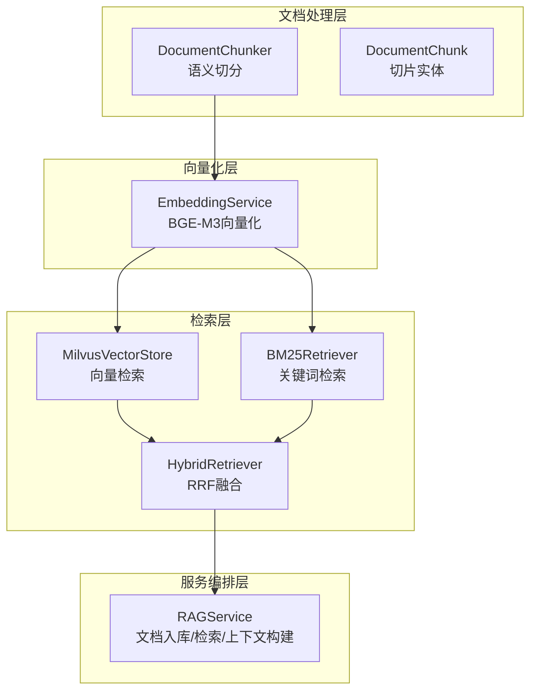
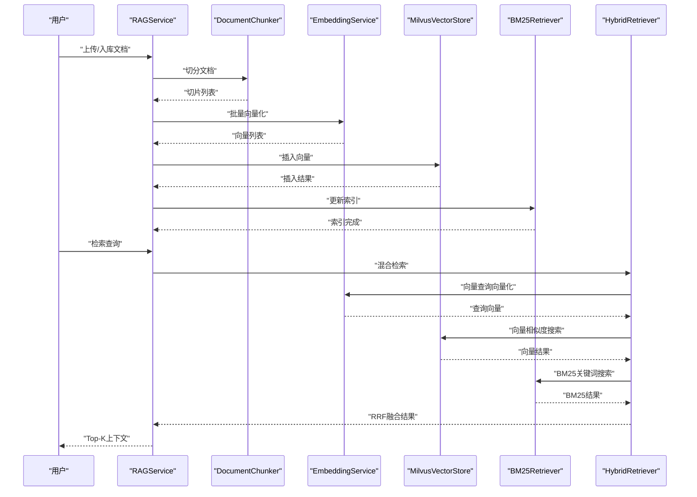
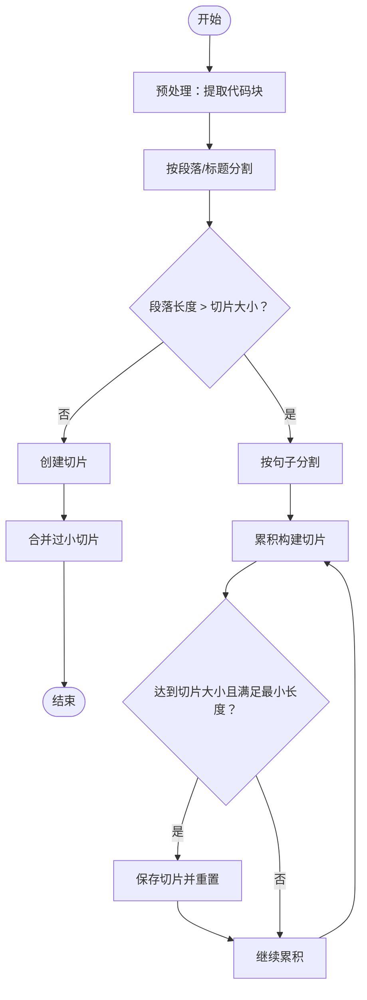
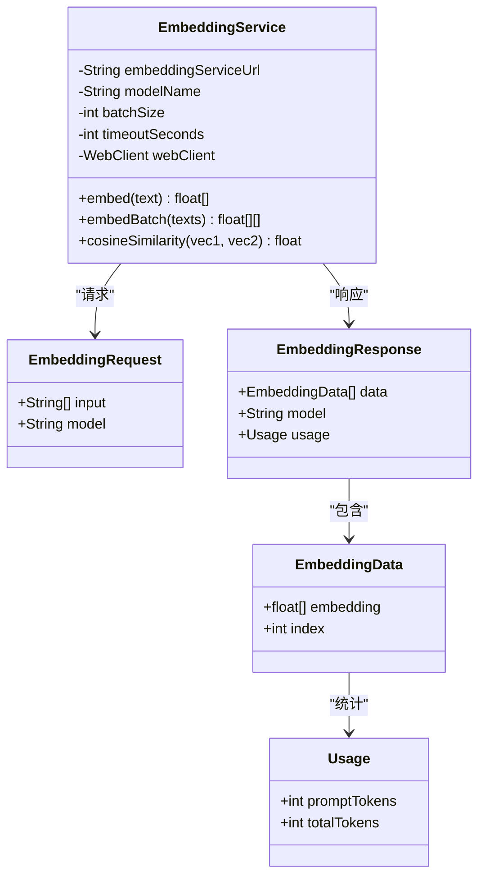
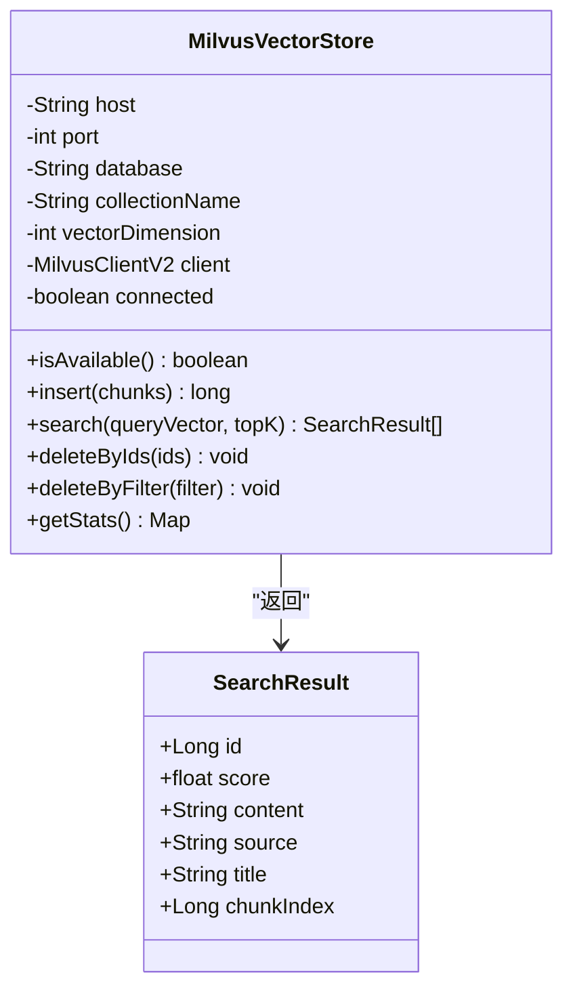
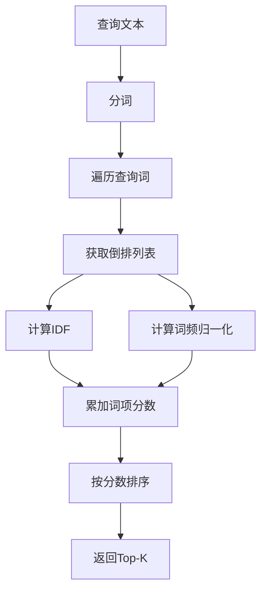
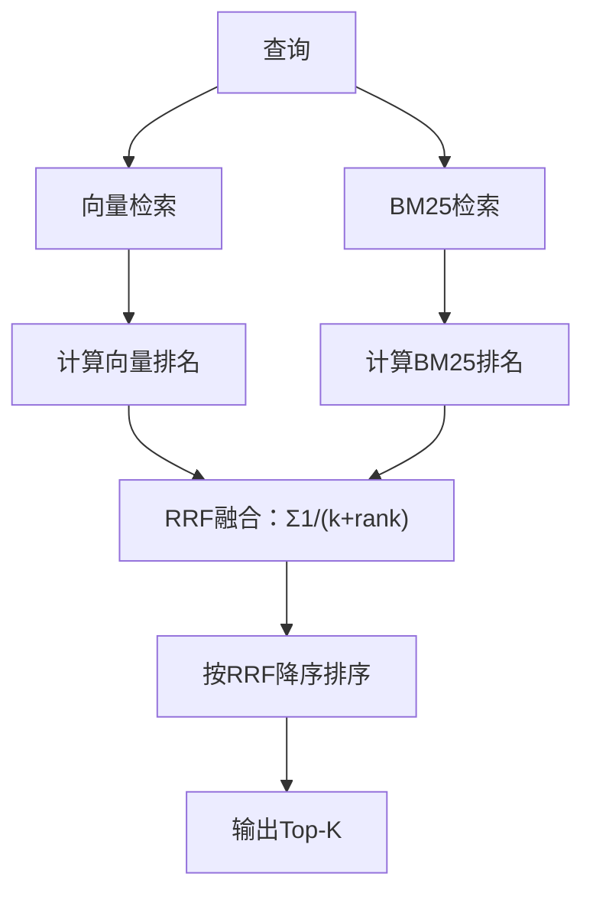
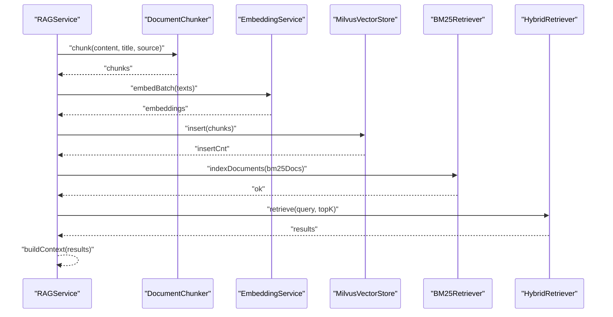
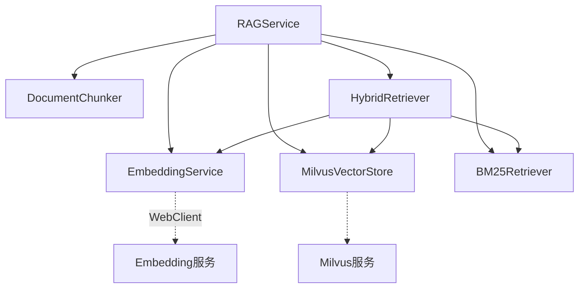

# RAG检索增强架构设计

<cite>
**本文档引用的文件**
- [BM25Retriever.java](file://netdata-ai-backend/src/main/java/com/netdata/ops/core/rag/BM25Retriever.java)
- [EmbeddingService.java](file://netdata-ai-backend/src/main/java/com/netdata/ops/core/rag/EmbeddingService.java)
- [HybridRetriever.java](file://netdata-ai-backend/src/main/java/com/netdata/ops/core/rag/HybridRetriever.java)
- [MilvusVectorStore.java](file://netdata-ai-backend/src/main/java/com/netdata/ops/core/rag/MilvusVectorStore.java)
- [RAGService.java](file://netdata-ai-backend/src/main/java/com/netdata/ops/core/rag/RAGService.java)
- [DocumentChunker.java](file://netdata-ai-backend/src/main/java/com/netdata/ops/core/rag/DocumentChunker.java)
- [DocumentChunk.java](file://netdata-ai-backend/src/main/java/com/netdata/ops/core/rag/DocumentChunk.java)
- [application.yml](file://netdata-ai-backend/src/main/resources/application.yml)
- [milvus_collection.yaml](file://config/milvus_collection.yaml)
- [milvus.yaml](file://config/milvus/milvus.yaml)
- [init_milvus.py](file://scripts/init_milvus.py)
- [system_architecture.md](file://docs/system_architecture.md)
</cite>

## 目录
1. [简介](#简介)
2. [项目结构](#项目结构)
3. [核心组件](#核心组件)
4. [架构概览](#架构概览)
5. [详细组件分析](#详细组件分析)
6. [依赖关系分析](#依赖关系分析)
7. [性能考量](#性能考量)
8. [故障排除指南](#故障排除指南)
9. [结论](#结论)
10. [附录](#附录)

## 简介
本文件为智能运维系统RAG（检索增强生成）架构设计文档，围绕文档预处理、向量化、检索与生成的完整流程展开。重点阐述混合检索器的设计原理（BM25关键词检索与向量相似度检索的融合策略）、Milvus向量数据库的集成与索引管理机制、EmbeddingService的文本向量化与相似度计算、以及RRF（Reciprocal Rank Fusion）融合算法的实现与参数调优。同时提供架构流程图、检索融合算法图与数据处理流水线图，并给出性能优化策略与检索质量评估方法。

## 项目结构
RAG系统位于后端工程的`core.rag`包内，采用分层设计：
- 文档处理层：DocumentChunker（语义切分）、DocumentChunk（切片实体）
- 向量化层：EmbeddingService（BGE-M3模型调用）
- 检索层：MilvusVectorStore（向量检索）、BM25Retriever（关键词检索）、HybridRetriever（RRF融合）
- 服务编排层：RAGService（文档入库、检索、上下文构建）

**图表来源**
- [RAGService.java:35-212](file://netdata-ai-backend/src/main/java/com/netdata/ops/core/rag/RAGService.java#L35-L212)
- [DocumentChunker.java:32-312](file://netdata-ai-backend/src/main/java/com/netdata/ops/core/rag/DocumentChunker.java#L32-L312)
- [EmbeddingService.java:36-190](file://netdata-ai-backend/src/main/java/com/netdata/ops/core/rag/EmbeddingService.java#L36-L190)
- [MilvusVectorStore.java:42-406](file://netdata-ai-backend/src/main/java/com/netdata/ops/core/rag/MilvusVectorStore.java#L42-L406)
- [BM25Retriever.java:38-257](file://netdata-ai-backend/src/main/java/com/netdata/ops/core/rag/BM25Retriever.java#L38-L257)
- [HybridRetriever.java:40-247](file://netdata-ai-backend/src/main/java/com/netdata/ops/core/rag/HybridRetriever.java#L40-L247)

**章节来源**
- [RAGService.java:35-212](file://netdata-ai-backend/src/main/java/com/netdata/ops/core/rag/RAGService.java#L35-L212)
- [system_architecture.md:322-407](file://docs/system_architecture.md#L322-L407)

## 核心组件
- 文档切分器（DocumentChunker）：基于语义相似度的分块策略，保持代码块、表格等结构完整性，支持最小切片长度与重叠控制。
- 文档切片实体（DocumentChunk）：承载切片内容、向量、元数据与类型信息。
- 向量化服务（EmbeddingService）：封装BGE-M3模型调用，支持批量向量化与余弦相似度计算。
- 向量存储（MilvusVectorStore）：封装Milvus客户端，提供Collection创建、向量插入、相似度搜索、删除与统计。
- BM25检索器（BM25Retriever）：基于词频与IDF的关键词检索，解决专有名词与精确匹配问题。
- 混合检索器（HybridRetriever）：整合向量与BM25结果，使用RRF融合算法进行排序。
- RAG服务（RAGService）：统一编排文档入库、检索与上下文构建。

**章节来源**
- [DocumentChunker.java:32-312](file://netdata-ai-backend/src/main/java/com/netdata/ops/core/rag/DocumentChunker.java#L32-L312)
- [DocumentChunk.java:29-120](file://netdata-ai-backend/src/main/java/com/netdata/ops/core/rag/DocumentChunk.java#L29-L120)
- [EmbeddingService.java:36-190](file://netdata-ai-backend/src/main/java/com/netdata/ops/core/rag/EmbeddingService.java#L36-L190)
- [MilvusVectorStore.java:42-406](file://netdata-ai-backend/src/main/java/com/netdata/ops/core/rag/MilvusVectorStore.java#L42-L406)
- [BM25Retriever.java:38-257](file://netdata-ai-backend/src/main/java/com/netdata/ops/core/rag/BM25Retriever.java#L38-L257)
- [HybridRetriever.java:40-247](file://netdata-ai-backend/src/main/java/com/netdata/ops/core/rag/HybridRetriever.java#L40-L247)
- [RAGService.java:35-212](file://netdata-ai-backend/src/main/java/com/netdata/ops/core/rag/RAGService.java#L35-L212)

## 架构概览
RAG系统整体流程包括文档入库与知识检索两大阶段：
- 文档入库：切分 → 向量化 → 存储到Milvus → 更新BM25索引
- 知识检索：混合检索（向量+BM25）→ RRF融合 → Top-K上下文构建 → LLM生成

**图表来源**
- [RAGService.java:57-130](file://netdata-ai-backend/src/main/java/com/netdata/ops/core/rag/RAGService.java#L57-L130)
- [HybridRetriever.java:64-100](file://netdata-ai-backend/src/main/java/com/netdata/ops/core/rag/HybridRetriever.java#L64-L100)
- [MilvusVectorStore.java:274-324](file://netdata-ai-backend/src/main/java/com/netdata/ops/core/rag/MilvusVectorStore.java#L274-L324)
- [BM25Retriever.java:132-178](file://netdata-ai-backend/src/main/java/com/netdata/ops/core/rag/BM25Retriever.java#L132-L178)
- [EmbeddingService.java:72-93](file://netdata-ai-backend/src/main/java/com/netdata/ops/core/rag/EmbeddingService.java#L72-L93)

**章节来源**
- [system_architecture.md:322-407](file://docs/system_architecture.md#L322-L407)

## 详细组件分析

### 文档切分器（DocumentChunker）
- 切分策略：先按段落/标题分割，再基于嵌入相似度在语义断点处分割，最后合并过小切片。
- 代码块与表格保护：通过正则提取与占位替换，保证结构完整性。
- 参数配置：切片大小、重叠大小、最小切片长度、是否启用语义切分。
- 输出：DocumentChunk列表，包含内容、标题、来源、索引与类型。

**图表来源**
- [DocumentChunker.java:81-104](file://netdata-ai-backend/src/main/java/com/netdata/ops/core/rag/DocumentChunker.java#L81-L104)
- [DocumentChunker.java:152-197](file://netdata-ai-backend/src/main/java/com/netdata/ops/core/rag/DocumentChunker.java#L152-L197)
- [DocumentChunker.java:267-297](file://netdata-ai-backend/src/main/java/com/netdata/ops/core/rag/DocumentChunker.java#L267-L297)

**章节来源**
- [DocumentChunker.java:32-312](file://netdata-ai-backend/src/main/java/com/netdata/ops/core/rag/DocumentChunker.java#L32-L312)
- [DocumentChunk.java:29-120](file://netdata-ai-backend/src/main/java/com/netdata/ops/core/rag/DocumentChunk.java#L29-L120)

### 向量化服务（EmbeddingService）
- 模型选择：BGE-M3（中文优化、1024维、开源可私有化部署）。
- 批量处理：按batch-size分批，避免内存溢出；支持超时控制。
- 相似度计算：余弦相似度，公式为向量点积除以范数乘积。
- 外部服务：通过WebClient调用本地Embedding服务（默认端口8002）。

**图表来源**
- [EmbeddingService.java:36-190](file://netdata-ai-backend/src/main/java/com/netdata/ops/core/rag/EmbeddingService.java#L36-L190)

**章节来源**
- [EmbeddingService.java:36-190](file://netdata-ai-backend/src/main/java/com/netdata/ops/core/rag/EmbeddingService.java#L36-L190)

### Milvus向量数据库集成
- 连接管理：Spring生命周期初始化，检查Collection是否存在并创建；连接失败不中断系统，提供可用性检查。
- Collection结构：包含自增主键、内容、1024维向量、来源、标题、切片索引等字段。
- 索引配置：IVF_FLAT索引，COSINE度量，nlist参数可调；支持按ID与过滤条件删除。
- 搜索能力：支持Top-K搜索与输出字段定制，一致性级别为BOUNDED。

**图表来源**
- [MilvusVectorStore.java:42-406](file://netdata-ai-backend/src/main/java/com/netdata/ops/core/rag/MilvusVectorStore.java#L42-L406)

**章节来源**
- [MilvusVectorStore.java:42-406](file://netdata-ai-backend/src/main/java/com/netdata/ops/core/rag/MilvusVectorStore.java#L42-L406)
- [milvus_collection.yaml:19-186](file://config/milvus_collection.yaml#L19-L186)
- [milvus.yaml:1-583](file://config/milvus/milvus.yaml#L1-L583)
- [init_milvus.py:142-303](file://scripts/init_milvus.py#L142-L303)

### BM25关键词检索器
- 倒排索引：以词为键，记录包含该词的文档及其词频。
- 分数计算：基于TF-IDF与文档长度归一化，支持自定义k1与b参数。
- 分词策略：按空格与标点分割，转小写并过滤单字；生产环境建议使用IK/Jieba等专业分词器。
- 统计信息：维护文档总数、总词数与平均文档长度。

**图表来源**
- [BM25Retriever.java:132-178](file://netdata-ai-backend/src/main/java/com/netdata/ops/core/rag/BM25Retriever.java#L132-L178)
- [BM25Retriever.java:188-190](file://netdata-ai-backend/src/main/java/com/netdata/ops/core/rag/BM25Retriever.java#L188-L190)
- [BM25Retriever.java:201-212](file://netdata-ai-backend/src/main/java/com/netdata/ops/core/rag/BM25Retriever.java#L201-L212)

**章节来源**
- [BM25Retriever.java:38-257](file://netdata-ai-backend/src/main/java/com/netdata/ops/core/rag/BM25Retriever.java#L38-L257)

### 混合检索器与RRF融合
- 检索流程：向量检索（EmbeddingService + Milvus）→ BM25检索 → RRF融合 → Top-K。
- RRF公式：对每个文档d，其RRF分数为Σ(1/(k+rank_i(d)))，k为平滑参数，默认60。
- 融合策略：分别计算向量与BM25的排名贡献，合并后按RRF分数降序排序。

**图表来源**
- [HybridRetriever.java:64-100](file://netdata-ai-backend/src/main/java/com/netdata/ops/core/rag/HybridRetriever.java#L64-L100)
- [HybridRetriever.java:134-193](file://netdata-ai-backend/src/main/java/com/netdata/ops/core/rag/HybridRetriever.java#L134-L193)

**章节来源**
- [HybridRetriever.java:40-247](file://netdata-ai-backend/src/main/java/com/netdata/ops/core/rag/HybridRetriever.java#L40-L247)

### RAG服务编排
- 文档入库：切分 → 向量化 → Milvus存储 → 更新BM25索引。
- 知识检索：委托HybridRetriever执行混合检索。
- 上下文构建：将检索结果格式化为提示上下文，便于LLM生成。
- 统计查询：聚合Milvus与BM25统计信息。

**图表来源**
- [RAGService.java:57-130](file://netdata-ai-backend/src/main/java/com/netdata/ops/core/rag/RAGService.java#L57-L130)

**章节来源**
- [RAGService.java:35-212](file://netdata-ai-backend/src/main/java/com/netdata/ops/core/rag/RAGService.java#L35-L212)

## 依赖关系分析
- 组件耦合：RAGService聚合各组件；HybridRetriever依赖EmbeddingService、MilvusVectorStore与BM25Retriever；EmbeddingService与MilvusVectorStore相互独立。
- 外部依赖：Milvus（向量检索）、BGE-M3（文本向量化）、Spring WebClient（Embedding服务调用）。
- 配置依赖：application.yml提供RAG参数（chunk、retrieval）、Milvus连接参数；milvus_collection.yaml定义Collection结构与索引参数。

**图表来源**
- [RAGService.java:37-41](file://netdata-ai-backend/src/main/java/com/netdata/ops/core/rag/RAGService.java#L37-L41)
- [HybridRetriever.java:42-44](file://netdata-ai-backend/src/main/java/com/netdata/ops/core/rag/HybridRetriever.java#L42-L44)
- [application.yml:101-137](file://netdata-ai-backend/src/main/resources/application.yml#L101-L137)
- [milvus_collection.yaml:19-186](file://config/milvus_collection.yaml#L19-L186)

**章节来源**
- [application.yml:101-137](file://netdata-ai-backend/src/main/resources/application.yml#L101-L137)
- [milvus_collection.yaml:19-186](file://config/milvus_collection.yaml#L19-L186)

## 性能考量
- 向量维度与索引：Milvus使用1024维向量与COSINE度量，IVF_FLAT索引的nlist需结合数据规模调优（建议sqrt(N)到N/100区间）。
- 搜索参数：nprobe越大越准确但越慢，建议按nlist的10%-20%设置。
- 批量向量化：EmbeddingService按batch-size分批，避免内存峰值；timeout适当放大以应对批量请求。
- 缓存策略：可引入Redis缓存向量检索结果与嵌入向量，降低重复查询开销。
- 并发与异步：利用线程池与异步批量处理提升吞吐，注意限流与熔断。
- 数据预热：首次加载Collection到内存，确保搜索性能稳定。

[本节为通用性能指导，无需具体文件引用]

## 故障排除指南
- Milvus连接失败：检查host/port/database配置，确认服务可用性；RAGService在不可用时会降级为无知识库模式。
- 向量化服务异常：确认Embedding服务URL与端口，检查网络连通与超时设置；关注空响应与维度不匹配异常。
- BM25索引问题：分词器需适配中文与特殊符号；若召回不足，调整k1/b参数或切换更专业的分词器。
- RRF融合异常：检查rank计算与k参数设置；确保向量与BM25结果均存在，避免空结果导致排序异常。
- 检索质量评估：通过人工抽样与指标（准确率、召回率、MRR）评估；结合相似度阈值与Top-K调优。

**章节来源**
- [MilvusVectorStore.java:80-103](file://netdata-ai-backend/src/main/java/com/netdata/ops/core/rag/MilvusVectorStore.java#L80-L103)
- [EmbeddingService.java:72-93](file://netdata-ai-backend/src/main/java/com/netdata/ops/core/rag/EmbeddingService.java#L72-L93)
- [HybridRetriever.java:116-120](file://netdata-ai-backend/src/main/java/com/netdata/ops/core/rag/HybridRetriever.java#L116-L120)

## 结论
本RAG架构通过语义切分、BGE-M3向量化与Milvus向量检索相结合，辅以BM25关键词检索与RRF融合，实现了兼顾语义理解与精确匹配的混合检索方案。系统具备良好的可扩展性与可维护性，可通过参数调优与缓存策略进一步提升性能与稳定性。建议在生产环境中结合业务数据规模与硬件资源，持续优化索引参数与检索策略。

[本节为总结性内容，无需具体文件引用]

## 附录

### RAG参数配置清单
- 文档切分：semantic-chunking、chunk-size、chunk-overlap、min-chunk-size
- 检索配置：vector-top-k、bm25-top-k、final-top-k、rrf-k、similarity-threshold
- Milvus连接：host、port、database、collection-name、vector-dimension

**章节来源**
- [application.yml:114-137](file://netdata-ai-backend/src/main/resources/application.yml#L114-L137)
- [milvus_collection.yaml:19-186](file://config/milvus_collection.yaml#L19-L186)