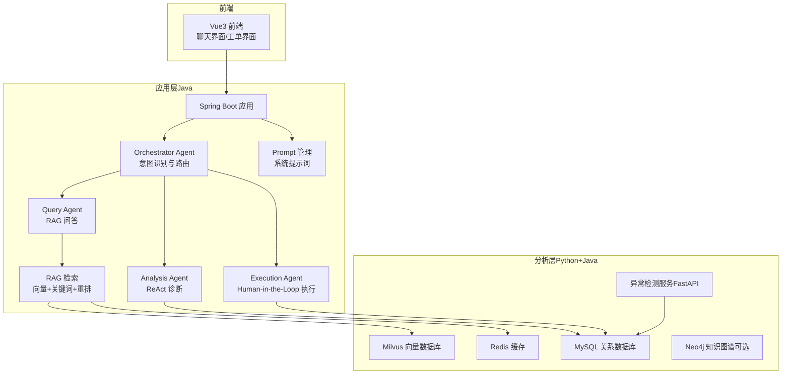
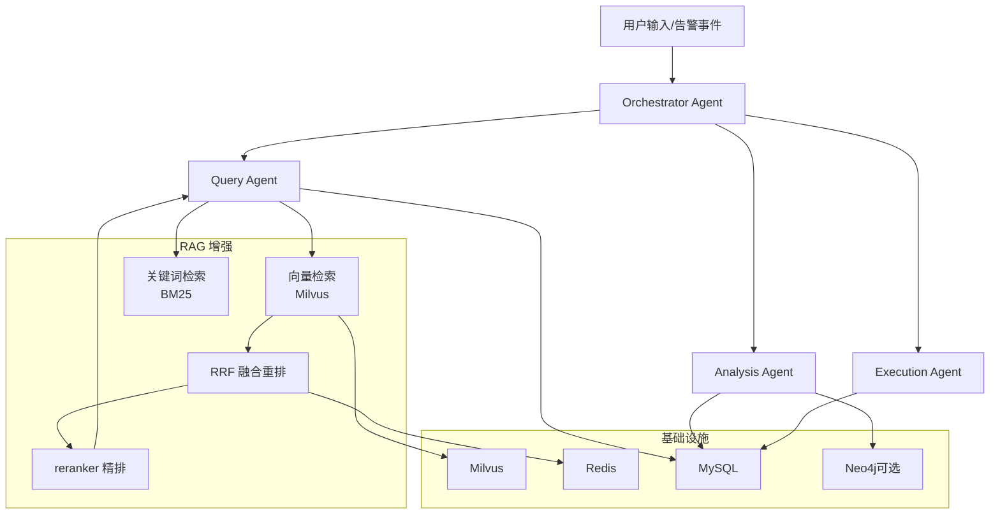
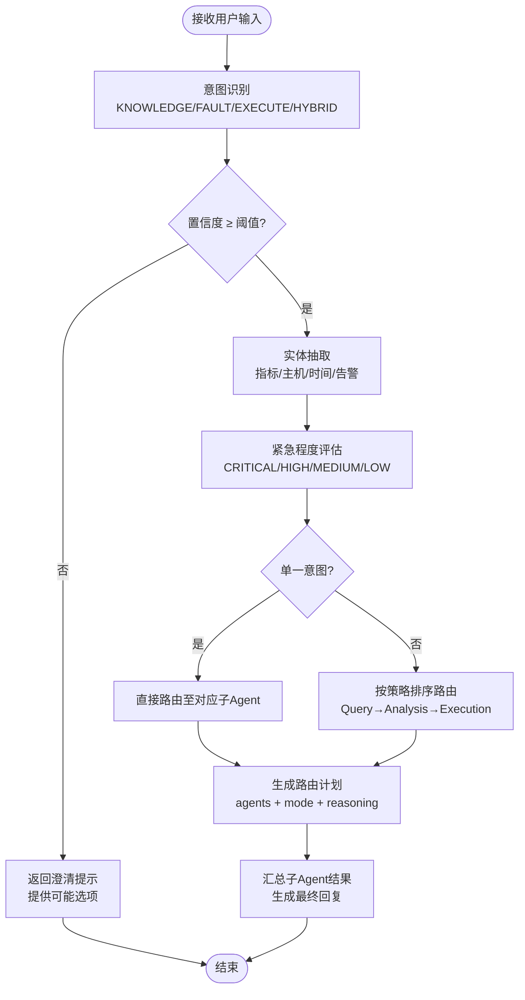
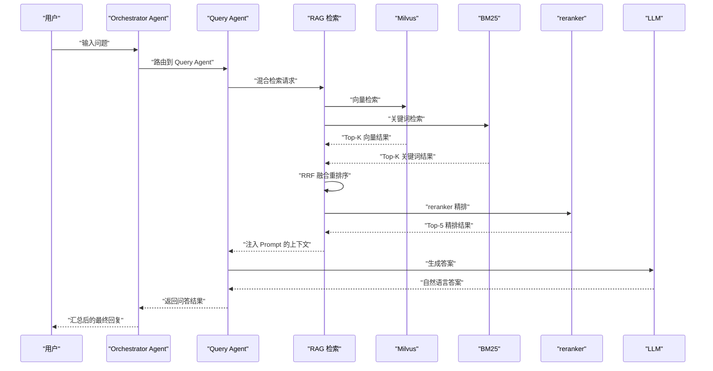
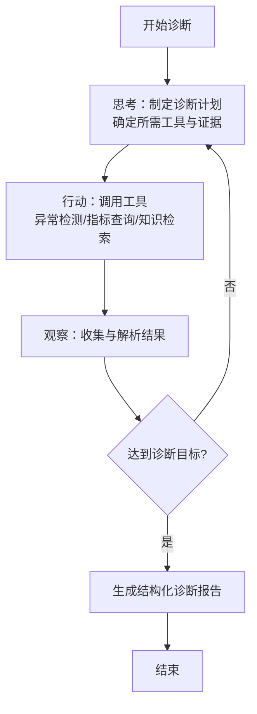
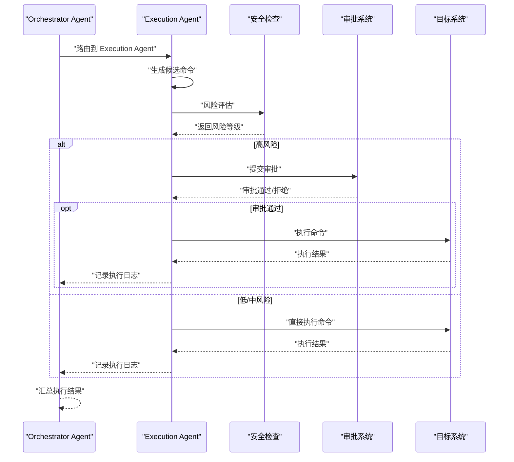
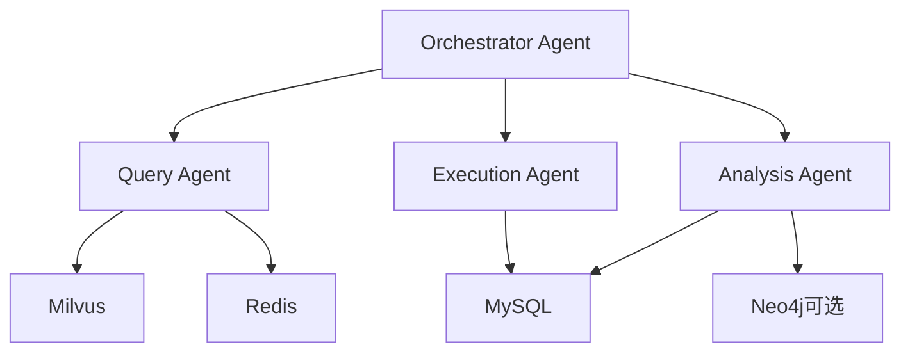

# 多 Agent 协作模式

<cite>
**本文引用的文件**
- [PROJECT_CONTEXT.md](file://PROJECT_CONTEXT.md)
- [开题报告_精简版.md](file://开题报告_精简版.md)
- [docker-compose.yml](file://docker-compose.yml)
- [milvus_collection.yaml](file://config/milvus_collection.yaml)
- [init_milvus.py](file://scripts/init_milvus.py)
- [test_milvus_connection.py](file://tests/test_milvus_connection.py)
- [orchestrator-system-prompt.md](file://docs/prompts/orchestrator-system-prompt.md)
- [init.sql](file://sql/init.sql)
</cite>

## 目录
1. [简介](#简介)
2. [项目结构](#项目结构)
3. [核心组件](#核心组件)
4. [架构总览](#架构总览)
5. [详细组件分析](#详细组件分析)
6. [依赖分析](#依赖分析)
7. [性能考虑](#性能考虑)
8. [故障排查指南](#故障排查指南)
9. [结论](#结论)
10. [附录](#附录)

## 简介
本文件围绕“智能运维问答系统”的多 Agent 协作模式展开，重点阐述 Orchestrator-Subagent 模式在系统中的落地实现。该模式以 Orchestrator Agent 为核心编排节点，负责意图识别、任务路由与结果汇总；三大子 Agent 分别承担 RAG 问答、ReAct 诊断与 Human-in-the-Loop 执行流程。文档同时给出 Agent 间的通信机制、状态管理与协作协议，并通过流程图与示例路径帮助读者从用户输入到最终响应完整理解协作过程。

## 项目结构
系统采用前后端分离与多层架构设计，后端以 Spring Boot 为基础，结合 Spring AI、Milvus、MySQL、Redis、Neo4j 等组件，形成“前端 + 应用层 + 分析层 + 数据层”的整体布局。其中应用层负责多 Agent 的编排与协调，分析层负责异常检测与 RAG 检索，数据层提供持久化与缓存支撑。

图表来源
- [PROJECT_CONTEXT.md:120-149](file://PROJECT_CONTEXT.md#L120-L149)
- [开题报告_精简版.md:118-152](file://开题报告_精简版.md#L118-L152)

章节来源
- [PROJECT_CONTEXT.md:120-149](file://PROJECT_CONTEXT.md#L120-L149)
- [开题报告_精简版.md:118-152](file://开题报告_精简版.md#L118-L152)

## 核心组件
- Orchestrator Agent：负责意图识别、实体抽取、路由决策、紧急程度评估与结果汇总，确保多 Agent 协作有序进行。
- Query Agent：基于混合检索 RAG（向量 + 关键词 + 重排）生成运维问答结果。
- Analysis Agent：采用 ReAct 思维-行动-观察循环，进行多步工具调用与结构化诊断。
- Execution Agent：生成命令 → 风险评估 → 人工审批 → 执行 → 记录，确保高危操作安全可控。

章节来源
- [PROJECT_CONTEXT.md:43-61](file://PROJECT_CONTEXT.md#L43-L61)
- [开题报告_精简版.md:191-221](file://开题报告_精简版.md#L191-L221)

## 架构总览
系统采用 Orchestrator-Subagent 模式，用户输入或告警事件经由 Orchestrator Agent 进行意图识别与路由，随后由相应子 Agent 执行任务，最终由 Orchestrator Agent 汇总输出。系统还通过 Prompt 管理、RAG 检索、异常检测服务与数据库/缓存等基础设施提供支撑。

图表来源
- [PROJECT_CONTEXT.md:43-61](file://PROJECT_CONTEXT.md#L43-L61)
- [PROJECT_CONTEXT.md:64-82](file://PROJECT_CONTEXT.md#L64-L82)
- [开题报告_精简版.md:191-221](file://开题报告_精简版.md#L191-L221)

## 详细组件分析

### Orchestrator Agent：意图识别与任务路由
- 意图分类与路由
  - 单一意图路由：知识问答 → Query Agent；故障诊断 → Analysis Agent；命令执行 → Execution Agent。
  - 混合意图路由：诊断+执行 → Analysis→Execution；问答+诊断 → Query→Analysis；诊断+问答+执行 → Query→Analysis→Execution。
- 实体抽取与紧急程度
  - 抽取指标、时间范围、主机、告警 ID 等实体，结合告警上下文与对话历史评估紧急程度（CRITICAL/HIGH/MEDIUM/LOW）。
- 输出规范
  - 必须输出 JSON 结构，包含 intent、confidence、routing_plan（agents、execution_mode、reasoning）、extracted_entities、urgency_level，以及可选 response_to_user。
- 安全边界与约束
  - 涉及删除、修改、重启等操作必须路由至 Execution Agent；禁止直接生成执行命令；置信度低于阈值时请求用户澄清；限制单次请求最多路由 3 个 Agent。

图表来源
- [orchestrator-system-prompt.md:26-106](file://docs/prompts/orchestrator-system-prompt.md#L26-L106)
- [orchestrator-system-prompt.md:109-136](file://docs/prompts/orchestrator-system-prompt.md#L109-L136)

章节来源
- [orchestrator-system-prompt.md:16-106](file://docs/prompts/orchestrator-system-prompt.md#L16-L106)
- [orchestrator-system-prompt.md:109-136](file://docs/prompts/orchestrator-system-prompt.md#L109-L136)

### Query Agent：RAG 问答流程
- RAG 主方案：混合检索（向量检索 + 关键词检索）→ RRF 融合重排序 → reranker 精排 → Top-K 注入 Prompt → LLM 生成答案。
- 文档切分：采用语义切分（Semantic Chunking），避免固定长度带来的语义割裂。
- 进阶可选：Graph RAG（Neo4j）用于多跳推理。
- 数据通路：向量检索依赖 Milvus，关键词检索依赖 BM25，重排与注入 Prompt 由应用层完成。

图表来源
- [PROJECT_CONTEXT.md:64-82](file://PROJECT_CONTEXT.md#L64-L82)
- [开题报告_精简版.md:191-221](file://开题报告_精简版.md#L191-L221)

章节来源
- [PROJECT_CONTEXT.md:64-82](file://PROJECT_CONTEXT.md#L64-L82)
- [开题报告_精简版.md:191-221](file://开题报告_精简版.md#L191-L221)

### Analysis Agent：ReAct 诊断模式
- ReAct 循环：思考（Plan）→ 行动（Tool）→ 观察（Observe）→ 再思考（Reflexion），直至达成诊断目标。
- 工具调用：结合异常检测结果、历史告警、指标趋势与知识库信息，进行多步推理与证据收集。
- 结果输出：结构化诊断报告，包含根因分析、影响面评估与建议措施。

图表来源
- [开题报告_精简版.md:191-221](file://开题报告_精简版.md#L191-L221)

章节来源
- [开题报告_精简版.md:191-221](file://开题报告_精简版.md#L191-L221)

### Execution Agent：Human-in-the-Loop 执行流程
- 命令生成：基于诊断结果与知识库生成可执行命令。
- 风险评估：对命令进行风险等级判定（低/中/高）。
- 人工审批：高风险命令进入审批流程，等待运维人员确认。
- 执行与记录：审批通过后执行命令，记录执行结果与审计日志。

图表来源
- [开题报告_精简版.md:275-301](file://开题报告_精简版.md#L275-L301)

章节来源
- [开题报告_精简版.md:275-301](file://开题报告_精简版.md#L275-L301)

### Agent 间通信机制、状态管理与协作协议
- 通信机制
  - 应用层内部：通过服务调用与消息队列（可选）实现子 Agent 间的状态传递与结果汇总。
  - Python-应用层：通过 REST API 传递异常检测结果与告警上下文。
- 状态管理
  - 会话与对话历史：通过 MySQL 表结构记录会话 ID、消息内容、引用来源与元数据，便于上下文延续与审计。
  - 缓存：Redis 用于检索结果缓存、分布式锁与实时告警去重。
- 协作协议
  - 路由协议：Orchestrator Agent 输出的 routing_plan 决定执行顺序与并发模式（串行/并行）。
  - 安全协议：高危操作必须进入审批流程，禁止直接生成与执行命令。
  - 超时与回退：单次请求最多路由 3 个 Agent，避免长时间等待，优先返回部分结果。

章节来源
- [init.sql:72-106](file://sql/init.sql#L72-L106)
- [docker-compose.yml:23-357](file://docker-compose.yml#L23-L357)

## 依赖分析
- 向量数据库与检索
  - Milvus 配置：Collection 名称、字段定义、索引类型（IVF_FLAT）、nlist/nprobe 参数、输出字段等。
  - 初始化脚本：连接、创建 Collection、创建索引、加载、插入测试数据、搜索测试与统计信息。
- 基础设施依赖
  - MySQL：会话与消息表、知识库文档表等。
  - Redis：缓存、分布式锁、去重。
  - Neo4j（可选）：知识图谱与多跳推理。
  - Docker Compose：一键编排 Milvus、MySQL、Redis、Ollama 等服务。

图表来源
- [milvus_collection.yaml:22-139](file://config/milvus_collection.yaml#L22-L139)
- [init_milvus.py:133-242](file://scripts/init_milvus.py#L133-L242)
- [docker-compose.yml:23-357](file://docker-compose.yml#L23-L357)

章节来源
- [milvus_collection.yaml:22-139](file://config/milvus_collection.yaml#L22-L139)
- [init_milvus.py:133-242](file://scripts/init_milvus.py#L133-L242)
- [docker-compose.yml:23-357](file://docker-compose.yml#L23-L357)

## 性能考虑
- 检索性能
  - Milvus 索引参数：nlist 与 nprobe 的权衡，建议根据数据规模与延迟目标调整；输出字段仅返回必要字段以减少传输开销。
  - RRF 融合与 reranker：在准确率与延迟之间取得平衡，优先返回 Top-5 注入 Prompt。
- 缓存策略
  - Redis 缓存检索结果与会话上下文，降低重复请求的延迟。
- 并发与超时
  - Orchestrator Agent 控制单次请求最多路由 3 个 Agent，避免长时间等待；对高危命令采用异步审批与执行，提升吞吐。
- 容器资源
  - Docker Compose 为 Milvus、Ollama 等服务分配适当内存，确保稳定运行。

章节来源
- [milvus_collection.yaml:70-101](file://config/milvus_collection.yaml#L70-L101)
- [init_milvus.py:244-294](file://scripts/init_milvus.py#L244-L294)
- [docker-compose.yml:100-154](file://docker-compose.yml#L100-L154)

## 故障排查指南
- Milvus 连接与健康检查
  - 使用连接测试脚本验证 gRPC 连接与健康检查端点，若失败检查容器日志与端口映射。
- 初始化与验证
  - 使用初始化脚本创建 Collection、建立索引、加载数据并进行搜索测试，确保配置正确。
- 数据库与缓存
  - 检查 MySQL 表结构与索引，确认会话与消息表可用；验证 Redis 连接与键空间。
- 常见问题
  - 向量维度不匹配：BGE-M3 固定 1024 维，创建 Collection 后不可更改。
  - 索引参数不当：nlist 过小导致召回不足，nprobe 过大导致延迟上升。
  - 审批流程阻塞：检查审批系统状态与人工处理时效。

章节来源
- [test_milvus_connection.py:33-116](file://tests/test_milvus_connection.py#L33-L116)
- [init_milvus.py:457-516](file://scripts/init_milvus.py#L457-L516)
- [init.sql:58-106](file://sql/init.sql#L58-L106)

## 结论
本系统通过 Orchestrator-Subagent 模式实现了智能运维问答与执行的闭环：Orchestrator Agent 负责意图识别与路由，Query Agent 以混合检索 RAG 提供知识问答，Analysis Agent 以 ReAct 模式进行诊断，Execution Agent 以 Human-in-the-Loop 确保安全执行。配合完善的 Prompt 管理、RAG 检索、异常检测与数据库/缓存基础设施，系统在准确性、安全性与可扩展性上均具备良好基础。后续可在前端集成、系统联调与性能评估方面继续完善。

## 附录
- 系统目录结构概览与职责划分
  - 后端：netdata-ai-backend（Agent 实现、AI 客户端、RAG、控制器、服务、WebSocket、配置）
  - 异常检测服务：anomaly-detection-service（FastAPI + PyOD/PySAD）
  - 前端：netdata-ai-frontend（聊天界面、告警面板、知识库、执行审批）
  - 配置与脚本：docker-compose.yml、init_milvus.py、milvus_collection.yaml、init.sql、测试脚本

章节来源
- [PROJECT_CONTEXT.md:120-149](file://PROJECT_CONTEXT.md#L120-L149)