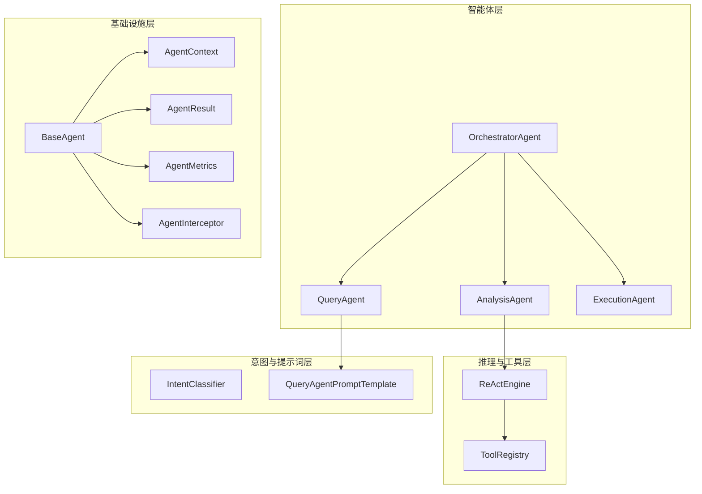
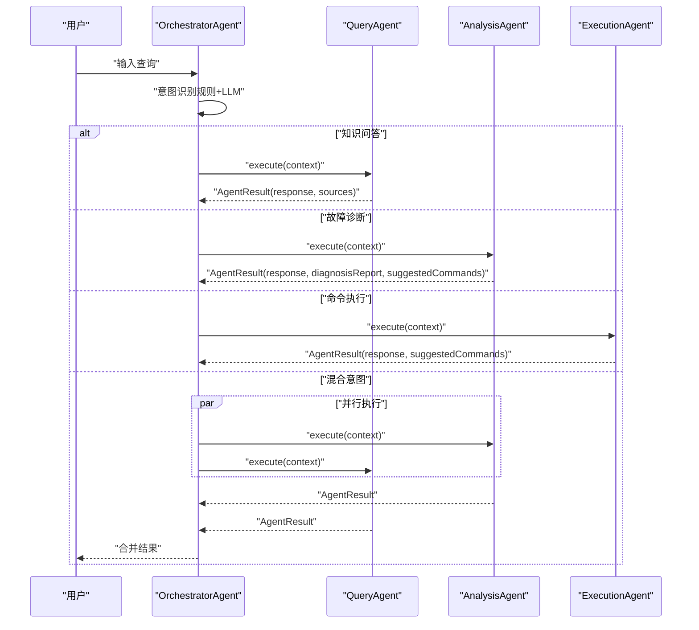
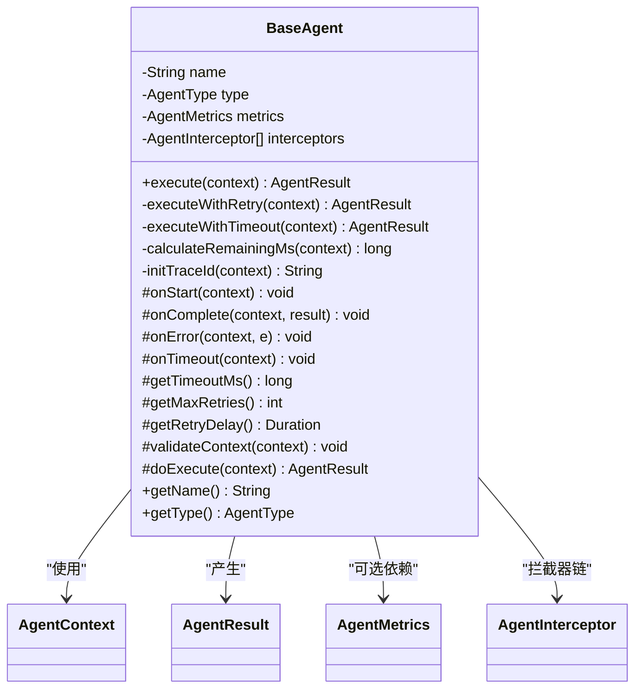
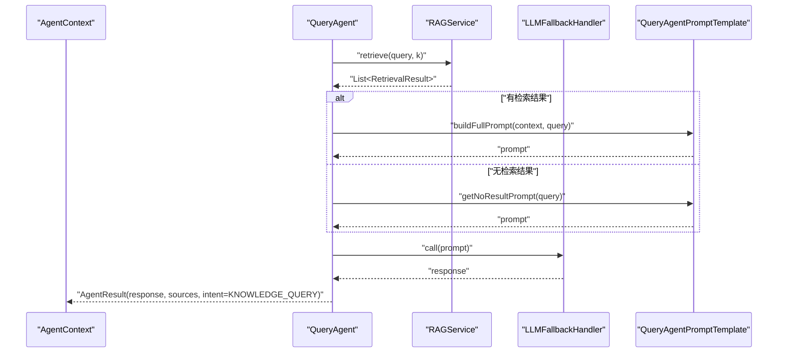
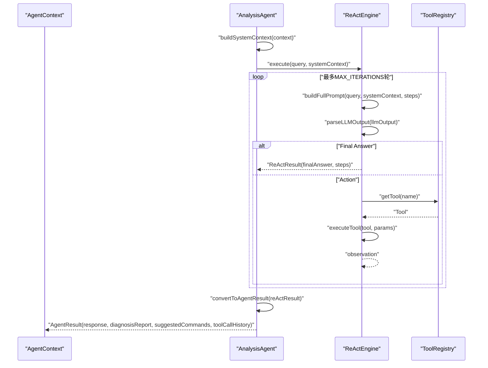
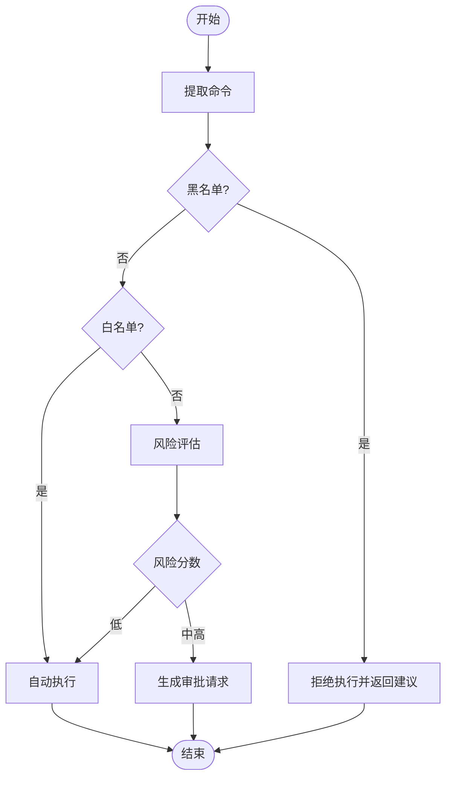
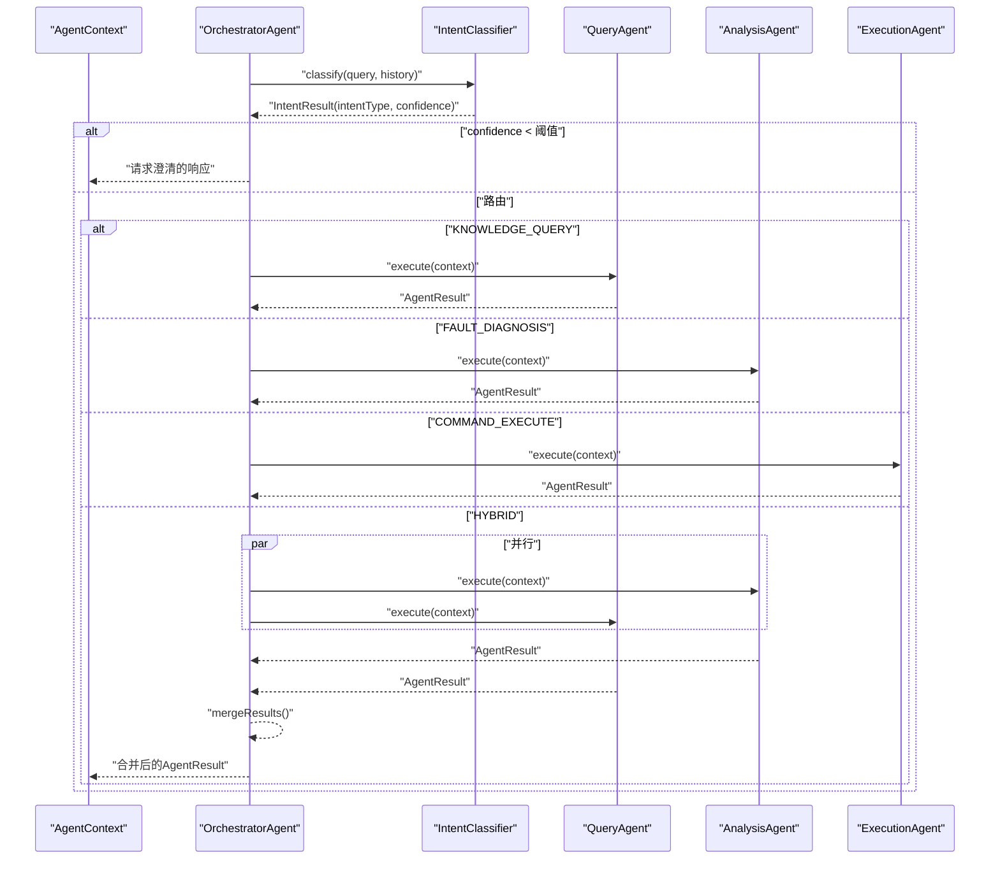
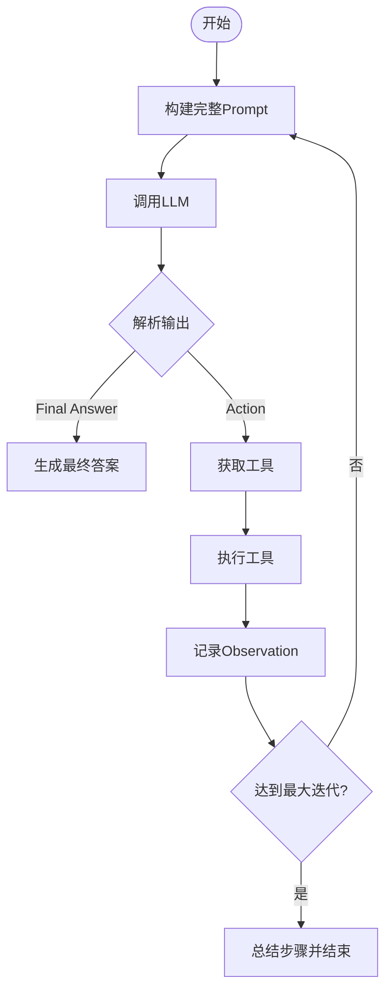
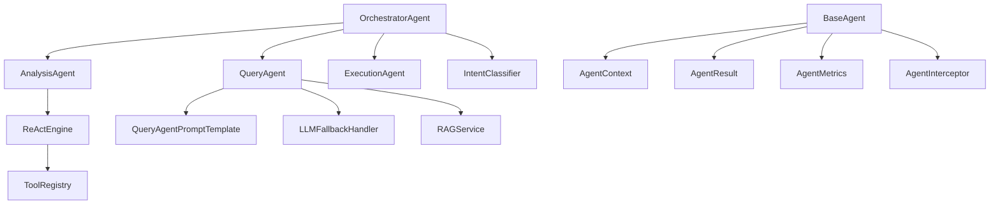
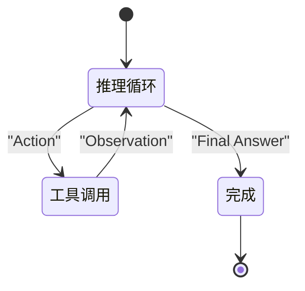

# 多智能体架构设计

<cite>
**本文档引用的文件**
- [BaseAgent.java](file://netdata-ai-backend/src/main/java/com/netdata/ops/core/agent/BaseAgent.java)
- [AgentContext.java](file://netdata-ai-backend/src/main/java/com/netdata/ops/core/agent/AgentContext.java)
- [AgentResult.java](file://netdata-ai-backend/src/main/java/com/netdata/ops/core/agent/AgentResult.java)
- [AgentMetrics.java](file://netdata-ai-backend/src/main/java/com/netdata/ops/core/agent/AgentMetrics.java)
- [AgentInterceptor.java](file://netdata-ai-backend/src/main/java/com/netdata/ops/core/agent/AgentInterceptor.java)
- [QueryAgent.java](file://netdata-ai-backend/src/main/java/com/netdata/ops/core/agent/QueryAgent.java)
- [AnalysisAgent.java](file://netdata-ai-backend/src/main/java/com/netdata/ops/core/agent/AnalysisAgent.java)
- [ExecutionAgent.java](file://netdata-ai-backend/src/main/java/com/netdata/ops/core/agent/ExecutionAgent.java)
- [OrchestratorAgent.java](file://netdata-ai-backend/src/main/java/com/netdata/ops/core/agent/OrchestratorAgent.java)
- [ReActEngine.java](file://netdata-ai-backend/src/main/java/com/netdata/ops/core/agent/tools/ReActEngine.java)
- [ToolRegistry.java](file://netdata-ai-backend/src/main/java/com/netdata/ops/core/agent/tools/ToolRegistry.java)
- [IntentClassifier.java](file://netdata-ai-backend/src/main/java/com/netdata/ops/core/agent/intent/IntentClassifier.java)
- [QueryAgentPromptTemplate.java](file://netdata-ai-backend/src/main/java/com/netdata/ops/core/agent/QueryAgentPromptTemplate.java)
</cite>

## 目录
1. [简介](#简介)
2. [项目结构](#项目结构)
3. [核心组件](#核心组件)
4. [架构总览](#架构总览)
5. [详细组件分析](#详细组件分析)
6. [依赖关系分析](#依赖关系分析)
7. [性能考量](#性能考量)
8. [故障排查指南](#故障排查指南)
9. [结论](#结论)
10. [附录](#附录)

## 简介
本设计文档面向智能运维系统，提出一套基于多智能体的架构方案。系统围绕四个核心智能体展开：QueryAgent（问答）、AnalysisAgent（根因分析）、ExecutionAgent（命令执行）、OrchestratorAgent（任务编排）。它们通过统一的BaseAgent抽象基类实现一致的生命周期、超时控制、重试、链路追踪与指标采集；通过AgentContext传递上下文，通过AgentResult标准化输出；通过ReAct推理引擎实现AnalysisAgent的动态工具选择与推理循环；通过意图分类器实现OrchestratorAgent的路由与混合意图并行执行。

## 项目结构
后端采用Java/Spring Boot实现，Agent相关代码集中在netdata-ai-backend模块的core.agent包及其子包中。核心文件包括：
- 抽象基类与基础设施：BaseAgent、AgentContext、AgentResult、AgentMetrics、AgentInterceptor
- 智能体实现：QueryAgent、AnalysisAgent、ExecutionAgent、OrchestratorAgent
- 推理与工具：ReActEngine、ToolRegistry
- 意图分类：IntentClassifier接口及其实现
- 提示词模板：QueryAgentPromptTemplate

**图表来源**
- [BaseAgent.java:1-480](file://netdata-ai-backend/src/main/java/com/netdata/ops/core/agent/BaseAgent.java#L1-L480)
- [AgentContext.java:1-131](file://netdata-ai-backend/src/main/java/com/netdata/ops/core/agent/AgentContext.java#L1-L131)
- [AgentResult.java:1-194](file://netdata-ai-backend/src/main/java/com/netdata/ops/core/agent/AgentResult.java#L1-L194)
- [AgentMetrics.java:1-113](file://netdata-ai-backend/src/main/java/com/netdata/ops/core/agent/AgentMetrics.java#L1-L113)
- [AgentInterceptor.java:1-48](file://netdata-ai-backend/src/main/java/com/netdata/ops/core/agent/AgentInterceptor.java#L1-L48)
- [QueryAgent.java:1-179](file://netdata-ai-backend/src/main/java/com/netdata/ops/core/agent/QueryAgent.java#L1-L179)
- [AnalysisAgent.java:1-260](file://netdata-ai-backend/src/main/java/com/netdata/ops/core/agent/AnalysisAgent.java#L1-L260)
- [ExecutionAgent.java:1-335](file://netdata-ai-backend/src/main/java/com/netdata/ops/core/agent/ExecutionAgent.java#L1-L335)
- [OrchestratorAgent.java:1-254](file://netdata-ai-backend/src/main/java/com/netdata/ops/core/agent/OrchestratorAgent.java#L1-L254)
- [ReActEngine.java:1-421](file://netdata-ai-backend/src/main/java/com/netdata/ops/core/agent/tools/ReActEngine.java#L1-L421)
- [ToolRegistry.java:1-130](file://netdata-ai-backend/src/main/java/com/netdata/ops/core/agent/tools/ToolRegistry.java#L1-L130)
- [IntentClassifier.java:1-31](file://netdata-ai-backend/src/main/java/com/netdata/ops/core/agent/intent/IntentClassifier.java#L1-L31)
- [QueryAgentPromptTemplate.java:1-143](file://netdata-ai-backend/src/main/java/com/netdata/ops/core/agent/QueryAgentPromptTemplate.java#L1-L143)

**章节来源**
- [BaseAgent.java:1-480](file://netdata-ai-backend/src/main/java/com/netdata/ops/core/agent/BaseAgent.java#L1-L480)
- [AgentContext.java:1-131](file://netdata-ai-backend/src/main/java/com/netdata/ops/core/agent/AgentContext.java#L1-L131)
- [AgentResult.java:1-194](file://netdata-ai-backend/src/main/java/com/netdata/ops/core/agent/AgentResult.java#L1-L194)
- [AgentMetrics.java:1-113](file://netdata-ai-backend/src/main/java/com/netdata/ops/core/agent/AgentMetrics.java#L1-L113)
- [AgentInterceptor.java:1-48](file://netdata-ai-backend/src/main/java/com/netdata/ops/core/agent/AgentInterceptor.java#L1-L48)
- [QueryAgent.java:1-179](file://netdata-ai-backend/src/main/java/com/netdata/ops/core/agent/QueryAgent.java#L1-L179)
- [AnalysisAgent.java:1-260](file://netdata-ai-backend/src/main/java/com/netdata/ops/core/agent/AnalysisAgent.java#L1-L260)
- [ExecutionAgent.java:1-335](file://netdata-ai-backend/src/main/java/com/netdata/ops/core/agent/ExecutionAgent.java#L1-L335)
- [OrchestratorAgent.java:1-254](file://netdata-ai-backend/src/main/java/com/netdata/ops/core/agent/OrchestratorAgent.java#L1-L254)
- [ReActEngine.java:1-421](file://netdata-ai-backend/src/main/java/com/netdata/ops/core/agent/tools/ReActEngine.java#L1-L421)
- [ToolRegistry.java:1-130](file://netdata-ai-backend/src/main/java/com/netdata/ops/core/agent/tools/ToolRegistry.java#L1-L130)
- [IntentClassifier.java:1-31](file://netdata-ai-backend/src/main/java/com/netdata/ops/core/agent/intent/IntentClassifier.java#L1-L31)
- [QueryAgentPromptTemplate.java:1-143](file://netdata-ai-backend/src/main/java/com/netdata/ops/core/agent/QueryAgentPromptTemplate.java#L1-L143)

## 核心组件
- BaseAgent：提供模板方法执行流程、超时控制、重试、链路追踪、生命周期钩子、拦截器链与指标采集，子类仅需实现doExecute()。
- AgentContext：封装会话、用户、查询、意图、历史、元数据、traceId、deadline、retryCount、priority、startTime等执行上下文。
- AgentResult：统一输出结构，包含success、response、intentType、confidence、sources、suggestedCommands、diagnosisReport、errorMessage、executionTimeMs、traceId、toolCallHistory、tokenUsage、cacheHit、retryCount等。
- AgentMetrics：基于Micrometer采集执行耗时、成功/失败计数、超时事件、活跃并发数等指标。
- AgentInterceptor：AOP风格拦截器接口，支持preExecute/postExecute/onError三个阶段。
- QueryAgent：RAG检索+LLM问答，支持无结果兜底提示词与引用标注。
- AnalysisAgent：ReAct推理循环，动态工具选择，生成诊断报告与命令建议。
- ExecutionAgent：命令解析、黑白名单、风险评估、审批与执行。
- OrchestratorAgent：意图识别（规则+LLM）、任务路由、混合意图并行执行与结果合并。
- ReActEngine：推理循环引擎，解析Thought/Action/FinalAnswer，调用ToolRegistry注册的工具。
- ToolRegistry：自动扫描并注册带AgentTool注解的工具Bean，提供工具描述列表。
- IntentClassifier：意图分类接口，支持规则、LLM与混合策略。
- QueryAgentPromptTemplate：提示词模板管理，支持系统提示与用户提示的拼装与覆盖。

**章节来源**
- [BaseAgent.java:38-480](file://netdata-ai-backend/src/main/java/com/netdata/ops/core/agent/BaseAgent.java#L38-L480)
- [AgentContext.java:25-131](file://netdata-ai-backend/src/main/java/com/netdata/ops/core/agent/AgentContext.java#L25-L131)
- [AgentResult.java:23-194](file://netdata-ai-backend/src/main/java/com/netdata/ops/core/agent/AgentResult.java#L23-L194)
- [AgentMetrics.java:30-113](file://netdata-ai-backend/src/main/java/com/netdata/ops/core/agent/AgentMetrics.java#L30-L113)
- [AgentInterceptor.java:17-48](file://netdata-ai-backend/src/main/java/com/netdata/ops/core/agent/AgentInterceptor.java#L17-L48)
- [QueryAgent.java:34-179](file://netdata-ai-backend/src/main/java/com/netdata/ops/core/agent/QueryAgent.java#L34-L179)
- [AnalysisAgent.java:31-260](file://netdata-ai-backend/src/main/java/com/netdata/ops/core/agent/AnalysisAgent.java#L31-L260)
- [ExecutionAgent.java:35-335](file://netdata-ai-backend/src/main/java/com/netdata/ops/core/agent/ExecutionAgent.java#L35-L335)
- [OrchestratorAgent.java:35-254](file://netdata-ai-backend/src/main/java/com/netdata/ops/core/agent/OrchestratorAgent.java#L35-L254)
- [ReActEngine.java:36-421](file://netdata-ai-backend/src/main/java/com/netdata/ops/core/agent/tools/ReActEngine.java#L36-L421)
- [ToolRegistry.java:36-130](file://netdata-ai-backend/src/main/java/com/netdata/ops/core/agent/tools/ToolRegistry.java#L36-L130)
- [IntentClassifier.java:20-31](file://netdata-ai-backend/src/main/java/com/netdata/ops/core/agent/intent/IntentClassifier.java#L20-L31)
- [QueryAgentPromptTemplate.java:21-143](file://netdata-ai-backend/src/main/java/com/netdata/ops/core/agent/QueryAgentPromptTemplate.java#L21-L143)

## 架构总览
系统采用“编排-路由-执行”的三层架构：
- 编排层：OrchestratorAgent负责意图识别与任务路由，支持混合意图的并行执行与降级串行。
- 路由层：根据意图类型将请求分发至QueryAgent、AnalysisAgent或ExecutionAgent。
- 执行层：各Agent在BaseAgent的统一生命周期内执行，AnalysisAgent通过ReActEngine进行动态推理，QueryAgent通过RAG检索与LLM生成答案，ExecutionAgent进行命令安全评估与审批。

**图表来源**
- [OrchestratorAgent.java:70-254](file://netdata-ai-backend/src/main/java/com/netdata/ops/core/agent/OrchestratorAgent.java#L70-L254)
- [QueryAgent.java:61-179](file://netdata-ai-backend/src/main/java/com/netdata/ops/core/agent/QueryAgent.java#L61-L179)
- [AnalysisAgent.java:46-260](file://netdata-ai-backend/src/main/java/com/netdata/ops/core/agent/AnalysisAgent.java#L46-L260)
- [ExecutionAgent.java:80-335](file://netdata-ai-backend/src/main/java/com/netdata/ops/core/agent/ExecutionAgent.java#L80-L335)

## 详细组件分析

### BaseAgent抽象基类与通用接口
BaseAgent采用模板方法+策略+拦截器链模式，提供：
- 统一执行流程：初始化traceId、deadline、活跃计数、前置拦截器、上下文验证、doExecute()、后置拦截器、生命周期钩子、指标上报、清理。
- 超时控制：基于CompletableFuture与剩余时间计算，支持嵌套调用的时间预算传递。
- 重试机制：可配置最大重试次数与延迟，异常路径与超时路径分别处理。
- 指标采集：通过AgentMetrics上报执行耗时、成功/失败、超时与活跃并发。
- 生命周期钩子：onStart/onComplete/onError/onTimeout可选覆盖。
- 上下文验证：默认校验上下文与查询内容。

**图表来源**
- [BaseAgent.java:38-480](file://netdata-ai-backend/src/main/java/com/netdata/ops/core/agent/BaseAgent.java#L38-L480)
- [AgentContext.java:25-131](file://netdata-ai-backend/src/main/java/com/netdata/ops/core/agent/AgentContext.java#L25-L131)
- [AgentResult.java:23-194](file://netdata-ai-backend/src/main/java/com/netdata/ops/core/agent/AgentResult.java#L23-L194)
- [AgentMetrics.java:30-113](file://netdata-ai-backend/src/main/java/com/netdata/ops/core/agent/AgentMetrics.java#L30-L113)
- [AgentInterceptor.java:17-48](file://netdata-ai-backend/src/main/java/com/netdata/ops/core/agent/AgentInterceptor.java#L17-L48)

**章节来源**
- [BaseAgent.java:89-310](file://netdata-ai-backend/src/main/java/com/netdata/ops/core/agent/BaseAgent.java#L89-L310)
- [BaseAgent.java:327-416](file://netdata-ai-backend/src/main/java/com/netdata/ops/core/agent/BaseAgent.java#L327-L416)

### QueryAgent：问答处理能力
职责：
- RAG混合检索（向量+BM25+RRF融合）
- 构建带编号引用的Prompt上下文
- LLM生成答案（DeepSeek→Ollama降级）
- 无结果兜底策略与引用列表

关键流程：
- 检索→选择Prompt策略→调用LLM→构建引用→返回AgentResult

**图表来源**
- [QueryAgent.java:61-98](file://netdata-ai-backend/src/main/java/com/netdata/ops/core/agent/QueryAgent.java#L61-L98)
- [QueryAgentPromptTemplate.java:96-141](file://netdata-ai-backend/src/main/java/com/netdata/ops/core/agent/QueryAgentPromptTemplate.java#L96-L141)

**章节来源**
- [QueryAgent.java:51-98](file://netdata-ai-backend/src/main/java/com/netdata/ops/core/agent/QueryAgent.java#L51-L98)
- [QueryAgentPromptTemplate.java:21-143](file://netdata-ai-backend/src/main/java/com/netdata/ops/core/agent/QueryAgentPromptTemplate.java#L21-L143)

### AnalysisAgent：根因分析功能
职责：
- 构建系统上下文（意图、置信度、历史、元数据）
- 委托ReActEngine执行推理循环
- 将ReActResult转换为AgentResult（诊断报告、命令建议、工具调用历史）

ReAct推理循环：
- 构建包含工具列表的Prompt
- 解析Thought/Action/ActionInput或FinalAnswer
- 调用ToolRegistry注册的工具并记录Observation
- 最终生成结论

**图表来源**
- [AnalysisAgent.java:46-132](file://netdata-ai-backend/src/main/java/com/netdata/ops/core/agent/AnalysisAgent.java#L46-L132)
- [ReActEngine.java:69-143](file://netdata-ai-backend/src/main/java/com/netdata/ops/core/agent/tools/ReActEngine.java#L69-L143)
- [ToolRegistry.java:74-105](file://netdata-ai-backend/src/main/java/com/netdata/ops/core/agent/tools/ToolRegistry.java#L74-L105)

**章节来源**
- [AnalysisAgent.java:46-260](file://netdata-ai-backend/src/main/java/com/netdata/ops/core/agent/AnalysisAgent.java#L46-L260)
- [ReActEngine.java:36-421](file://netdata-ai-backend/src/main/java/com/netdata/ops/core/agent/tools/ReActEngine.java#L36-L421)
- [ToolRegistry.java:36-130](file://netdata-ai-backend/src/main/java/com/netdata/ops/core/agent/tools/ToolRegistry.java#L36-L130)

### ExecutionAgent：命令执行能力
职责：
- 命令提取
- 黑名单/白名单检查
- 风险评估（命令类型、影响范围、可逆性、执行频率）
- 自动执行/审批请求生成

风险评估维度与阈值：
- 命令类型（40%）
- 影响范围（30%）
- 可逆性（20%）
- 执行频率（10%）
- 低风险阈值、中风险阈值、高风险阈值

**图表来源**
- [ExecutionAgent.java:80-335](file://netdata-ai-backend/src/main/java/com/netdata/ops/core/agent/ExecutionAgent.java#L80-L335)

**章节来源**
- [ExecutionAgent.java:14-335](file://netdata-ai-backend/src/main/java/com/netdata/ops/core/agent/ExecutionAgent.java#L14-L335)

### OrchestratorAgent：任务编排机制
职责：
- 意图识别：双级分类器（规则快速路径+LLM语义分类）
- 任务路由：根据意图类型分发到子Agent
- 混合意图：并行执行AnalysisAgent与QueryAgent，合并结果
- 低置信度：请求用户澄清

混合意图并行执行：
- 使用CompletableFuture并行调用子Agent
- 超时控制与异常降级为串行执行

**图表来源**
- [OrchestratorAgent.java:70-254](file://netdata-ai-backend/src/main/java/com/netdata/ops/core/agent/OrchestratorAgent.java#L70-L254)
- [IntentClassifier.java:20-31](file://netdata-ai-backend/src/main/java/com/netdata/ops/core/agent/intent/IntentClassifier.java#L20-L31)

**章节来源**
- [OrchestratorAgent.java:70-254](file://netdata-ai-backend/src/main/java/com/netdata/ops/core/agent/OrchestratorAgent.java#L70-L254)
- [IntentClassifier.java:20-31](file://netdata-ai-backend/src/main/java/com/netdata/ops/core/agent/intent/IntentClassifier.java#L20-L31)

### ReAct推理循环实现原理
ReActEngine核心流程：
- 构建包含工具列表与格式要求的Prompt
- 调用LLM，解析输出中的Thought/Action/ActionInput或FinalAnswer
- 执行Action对应的工具，将Observation追加到历史
- 重复直到Final Answer或达到最大迭代次数

**图表来源**
- [ReActEngine.java:69-143](file://netdata-ai-backend/src/main/java/com/netdata/ops/core/agent/tools/ReActEngine.java#L69-L143)

**章节来源**
- [ReActEngine.java:18-421](file://netdata-ai-backend/src/main/java/com/netdata/ops/core/agent/tools/ReActEngine.java#L18-L421)

### 智能体间协作流程、消息传递与状态管理
- 消息传递：AgentContext承载查询、意图、历史、元数据、traceId、deadline等；AgentResult承载执行结果、诊断报告、命令建议、工具调用历史等。
- 状态管理：BaseAgent维护活跃计数、重试次数、开始时间；AgentMetrics记录执行耗时与并发；AgentInterceptor支持跨Agent的横切逻辑。
- 协作流程：OrchestratorAgent根据意图路由到子Agent；AnalysisAgent通过ReActEngine动态选择工具；QueryAgent与ExecutionAgent分别处理问答与命令执行；混合意图通过并行执行与结果合并提升响应速度。

**章节来源**
- [AgentContext.java:25-131](file://netdata-ai-backend/src/main/java/com/netdata/ops/core/agent/AgentContext.java#L25-L131)
- [AgentResult.java:23-194](file://netdata-ai-backend/src/main/java/com/netdata/ops/core/agent/AgentResult.java#L23-L194)
- [AgentMetrics.java:30-113](file://netdata-ai-backend/src/main/java/com/netdata/ops/core/agent/AgentMetrics.java#L30-L113)
- [AgentInterceptor.java:17-48](file://netdata-ai-backend/src/main/java/com/netdata/ops/core/agent/AgentInterceptor.java#L17-L48)

### 智能体扩展机制与自定义Agent开发指南
- 扩展BaseAgent：继承BaseAgent并实现doExecute()，可覆盖getTimeoutMs()/getMaxRetries()/getRetryDelay()与生命周期钩子。
- 自定义拦截器：实现AgentInterceptor接口，在preExecute/postExecute/onError插入审计、限流、权限校验等逻辑。
- 自定义工具：实现Tool接口并在类上标注AgentTool注解，ToolRegistry会自动注册；ReActEngine通过工具名动态调用。
- 自定义意图分类器：实现IntentClassifier接口，支持规则快速路径与LLM语义分类的组合策略。
- 自定义提示词：通过QueryAgentPromptTemplate的配置项覆盖系统提示与无结果提示，便于A/B测试与调优。

**章节来源**
- [BaseAgent.java:327-416](file://netdata-ai-backend/src/main/java/com/netdata/ops/core/agent/BaseAgent.java#L327-L416)
- [AgentInterceptor.java:17-48](file://netdata-ai-backend/src/main/java/com/netdata/ops/core/agent/AgentInterceptor.java#L17-L48)
- [ToolRegistry.java:36-130](file://netdata-ai-backend/src/main/java/com/netdata/ops/core/agent/tools/ToolRegistry.java#L36-L130)
- [IntentClassifier.java:20-31](file://netdata-ai-backend/src/main/java/com/netdata/ops/core/agent/intent/IntentClassifier.java#L20-L31)
- [QueryAgentPromptTemplate.java:21-143](file://netdata-ai-backend/src/main/java/com/netdata/ops/core/agent/QueryAgentPromptTemplate.java#L21-L143)

## 依赖关系分析
- 组件耦合：OrchestratorAgent依赖QueryAgent、AnalysisAgent、ExecutionAgent与IntentClassifier；AnalysisAgent依赖ReActEngine；ReActEngine依赖ToolRegistry；QueryAgent依赖RAGService与LLMFallbackHandler；QueryAgent与AnalysisAgent均继承BaseAgent。
- 外部依赖：AgentMetrics基于Micrometer；Spring容器负责组件装配与工具自动发现。
- 潜在循环依赖：当前设计通过接口与注入避免循环依赖；ReActEngine与ToolRegistry通过注册表解耦。

**图表来源**
- [OrchestratorAgent.java:35-254](file://netdata-ai-backend/src/main/java/com/netdata/ops/core/agent/OrchestratorAgent.java#L35-L254)
- [AnalysisAgent.java:31-260](file://netdata-ai-backend/src/main/java/com/netdata/ops/core/agent/AnalysisAgent.java#L31-L260)
- [ReActEngine.java:36-421](file://netdata-ai-backend/src/main/java/com/netdata/ops/core/agent/tools/ReActEngine.java#L36-L421)
- [ToolRegistry.java:36-130](file://netdata-ai-backend/src/main/java/com/netdata/ops/core/agent/tools/ToolRegistry.java#L36-L130)
- [QueryAgent.java:34-179](file://netdata-ai-backend/src/main/java/com/netdata/ops/core/agent/QueryAgent.java#L34-L179)
- [BaseAgent.java:38-480](file://netdata-ai-backend/src/main/java/com/netdata/ops/core/agent/BaseAgent.java#L38-L480)

**章节来源**
- [OrchestratorAgent.java:35-254](file://netdata-ai-backend/src/main/java/com/netdata/ops/core/agent/OrchestratorAgent.java#L35-L254)
- [AnalysisAgent.java:31-260](file://netdata-ai-backend/src/main/java/com/netdata/ops/core/agent/AnalysisAgent.java#L31-L260)
- [ReActEngine.java:36-421](file://netdata-ai-backend/src/main/java/com/netdata/ops/core/agent/tools/ReActEngine.java#L36-L421)
- [ToolRegistry.java:36-130](file://netdata-ai-backend/src/main/java/com/netdata/ops/core/agent/tools/ToolRegistry.java#L36-L130)
- [QueryAgent.java:34-179](file://netdata-ai-backend/src/main/java/com/netdata/ops/core/agent/QueryAgent.java#L34-L179)
- [BaseAgent.java:38-480](file://netdata-ai-backend/src/main/java/com/netdata/ops/core/agent/BaseAgent.java#L38-L480)

## 性能考量
- 超时与重试：BaseAgent统一处理超时与重试，AnalysisAgent延长超时时间以适应ReAct循环。
- 并行执行：混合意图使用CompletableFuture并行执行，提升吞吐；异常时降级为串行。
- 指标采集：AgentMetrics基于Micrometer上报执行耗时、成功/失败、超时与活跃并发，便于容量规划与性能优化。
- 缓存与降级：QueryAgent在无检索结果时仍调用LLM并明确标注无佐证，体现“宁可降级也不能报错”的设计原则。

**章节来源**
- [BaseAgent.java:224-310](file://netdata-ai-backend/src/main/java/com/netdata/ops/core/agent/BaseAgent.java#L224-L310)
- [AnalysisAgent.java:252-259](file://netdata-ai-backend/src/main/java/com/netdata/ops/core/agent/AnalysisAgent.java#L252-L259)
- [OrchestratorAgent.java:120-145](file://netdata-ai-backend/src/main/java/com/netdata/ops/core/agent/OrchestratorAgent.java#L120-L145)
- [AgentMetrics.java:30-113](file://netdata-ai-backend/src/main/java/com/netdata/ops/core/agent/AgentMetrics.java#L30-L113)
- [QueryAgent.java:100-124](file://netdata-ai-backend/src/main/java/com/netdata/ops/core/agent/QueryAgent.java#L100-L124)

## 故障排查指南
- 链路追踪：BaseAgent在MDC中写入traceId与agentName，便于日志关联与问题定位。
- 超时与异常：超时路径触发onTimeout钩子并记录超时指标；异常路径触发onError钩子与异常拦截器，并记录失败指标。
- 指标监控：通过AgentMetrics暴露agent.execution.duration、agent.execution.count、agent.execution.timeout、agent.active.count等指标，对接Prometheus/Grafana。
- 拦截器：通过AgentInterceptor在preExecute/postExecute/onError插入审计与告警逻辑，便于快速定位问题。

**章节来源**
- [BaseAgent.java:107-222](file://netdata-ai-backend/src/main/java/com/netdata/ops/core/agent/BaseAgent.java#L107-L222)
- [AgentMetrics.java:45-112](file://netdata-ai-backend/src/main/java/com/netdata/ops/core/agent/AgentMetrics.java#L45-L112)
- [AgentInterceptor.java:17-48](file://netdata-ai-backend/src/main/java/com/netdata/ops/core/agent/AgentInterceptor.java#L17-L48)

## 结论
本多智能体架构以BaseAgent为核心，统一了生命周期、超时控制、重试、链路追踪与指标采集；通过OrchestratorAgent实现意图识别与任务路由，支持混合意图的并行执行；AnalysisAgent借助ReActEngine实现动态推理与工具调用；QueryAgent与ExecutionAgent分别承担问答与命令执行的安全控制。该设计具备良好的扩展性与可观测性，适合在智能运维场景中落地。

## 附录
- 状态转换图（AnalysisAgent）

**图表来源**
- [ReActEngine.java:69-143](file://netdata-ai-backend/src/main/java/com/netdata/ops/core/agent/tools/ReActEngine.java#L69-L143)