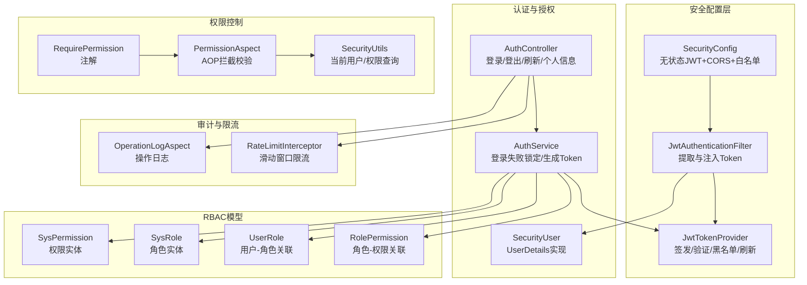
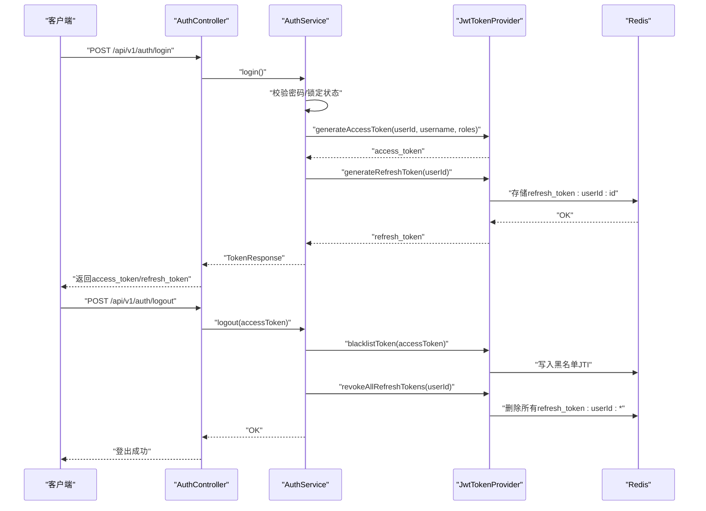
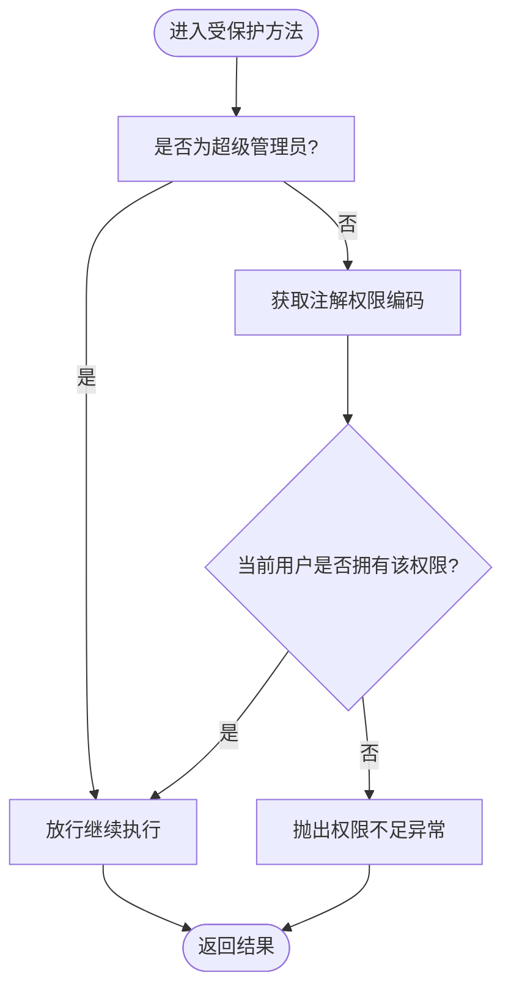
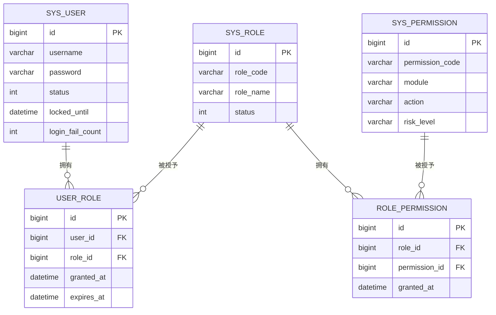
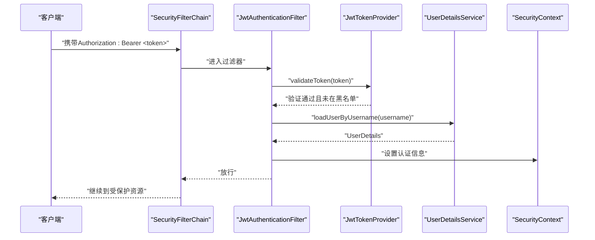
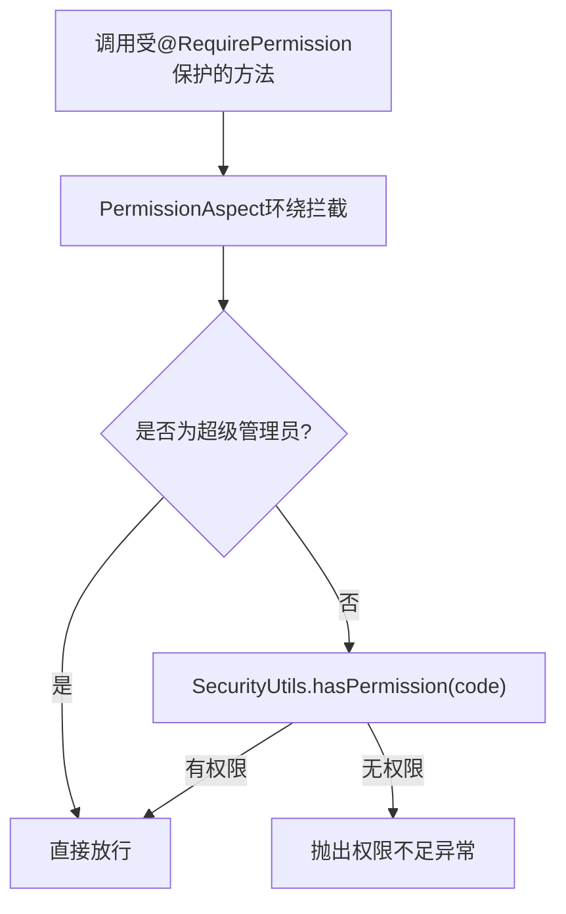
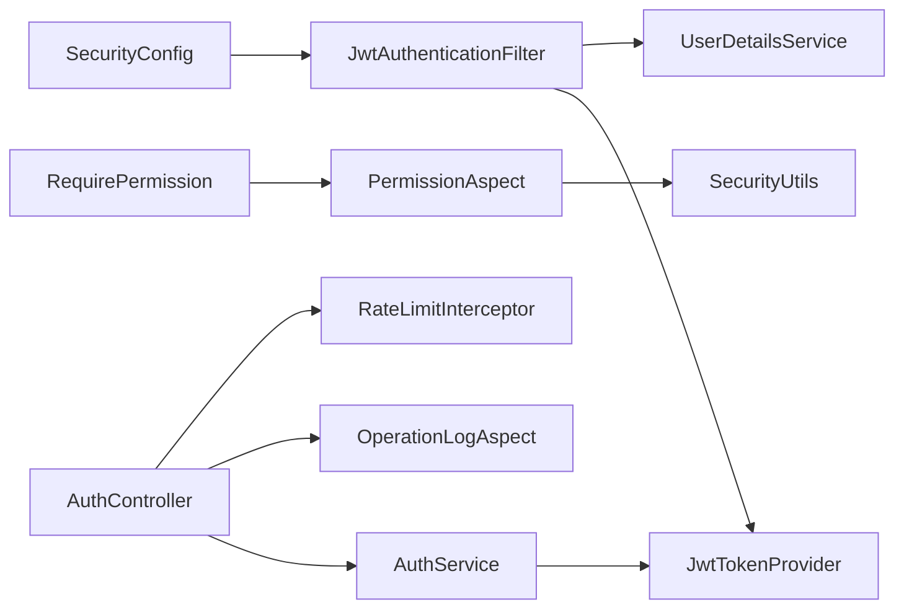

# 安全架构设计

<cite>
**本文引用的文件**
- [JwtTokenProvider.java](file://netdata-ai-backend/src/main/java/com/netdata/ops/security/JwtTokenProvider.java)
- [JwtAuthenticationFilter.java](file://netdata-ai-backend/src/main/java/com/netdata/ops/security/JwtAuthenticationFilter.java)
- [AuthService.java](file://netdata-ai-backend/src/main/java/com/netdata/ops/service/AuthService.java)
- [AuthController.java](file://netdata-ai-backend/src/main/java/com/netdata/ops/controller/AuthController.java)
- [SecurityConfig.java](file://netdata-ai-backend/src/main/java/com/netdata/ops/config/SecurityConfig.java)
- [SecurityUtils.java](file://netdata-ai-backend/src/main/java/com/netdata/ops/util/SecurityUtils.java)
- [RequirePermission.java](file://netdata-ai-backend/src/main/java/com/netdata/ops/annotation/RequirePermission.java)
- [PermissionAspect.java](file://netdata-ai-backend/src/main/java/com/netdata/ops/aspect/PermissionAspect.java)
- [SysPermission.java](file://netdata-ai-backend/src/main/java/com/netdata/ops/entity/SysPermission.java)
- [SysRole.java](file://netdata-ai-backend/src/main/java/com/netdata/ops/entity/SysRole.java)
- [UserRole.java](file://netdata-ai-backend/src/main/java/com/netdata/ops/entity/UserRole.java)
- [RolePermission.java](file://netdata-ai-backend/src/main/java/com/netdata/ops/entity/RolePermission.java)
- [application.yml](file://netdata-ai-backend/src/main/resources/application.yml)
- [V2__rbac_tables.sql](file://sql/V2__rbac_tables.sql)
- [SecurityUser.java](file://netdata-ai-backend/src/main/java/com/netdata/ops/security/SecurityUser.java)
- [OperationLogAspect.java](file://netdata-ai-backend/src/main/java/com/netdata/ops/aspect/OperationLogAspect.java)
- [R.java](file://netdata-ai-backend/src/main/java/com/netdata/ops/dto/response/R.java)
- [RateLimitInterceptor.java](file://netdata-ai-backend/src/main/java/com/netdata/ops/interceptor/RateLimitInterceptor.java)
</cite>

## 目录
1. [引言](#引言)
2. [项目结构](#项目结构)
3. [核心组件](#核心组件)
4. [架构总览](#架构总览)
5. [详细组件分析](#详细组件分析)
6. [依赖分析](#依赖分析)
7. [性能考虑](#性能考虑)
8. [故障排查指南](#故障排查指南)
9. [结论](#结论)
10. [附录](#附录)

## 引言
本文件为智能运维系统提供安全架构设计文档，聚焦多层次安全防护体系，覆盖认证授权、权限控制、数据安全、命令执行安全评估与审计追踪。文档详细解释JWT令牌的生成、验证与刷新机制（含签名、过期处理与安全存储），阐述基于注解的权限拦截器实现（@RequirePermission注解与权限校验流程），说明RBAC权限模型（用户角色、权限分配与动态授权），并给出命令执行安全评估机制（危险命令识别、风险评分与人工审批）。同时提供安全架构图、认证流程图与权限控制流程图，并总结安全最佳实践、漏洞防护与合规性要求。

## 项目结构
后端采用Spring Boot + Spring Security + JWT + RBAC + AOP + Redis限流与黑名单的组合架构。关键安全相关模块分布如下：
- 安全配置与过滤器：SecurityConfig、JwtAuthenticationFilter、JwtTokenProvider
- 认证服务：AuthService、AuthController
- 权限控制：RequirePermission注解、PermissionAspect、SecurityUtils
- RBAC模型：SysPermission、SysRole、UserRole、RolePermission（数据库与实体）
- 审计与日志：OperationLogAspect
- 速率限制：RateLimitInterceptor
- 配置中心：application.yml（JWT密钥、过期时间、命令执行安全策略）

图表来源
- [SecurityConfig.java:44-77](file://netdata-ai-backend/src/main/java/com/netdata/ops/config/SecurityConfig.java#L44-L77)
- [JwtAuthenticationFilter.java:27-75](file://netdata-ai-backend/src/main/java/com/netdata/ops/security/JwtAuthenticationFilter.java#L27-L75)
- [JwtTokenProvider.java:23-204](file://netdata-ai-backend/src/main/java/com/netdata/ops/security/JwtTokenProvider.java#L23-L204)
- [AuthService.java:29-193](file://netdata-ai-backend/src/main/java/com/netdata/ops/service/AuthService.java#L29-L193)
- [AuthController.java:26-78](file://netdata-ai-backend/src/main/java/com/netdata/ops/controller/AuthController.java#L26-L78)
- [RequirePermission.java:12-19](file://netdata-ai-backend/src/main/java/com/netdata/ops/annotation/RequirePermission.java#L12-L19)
- [PermissionAspect.java:20-40](file://netdata-ai-backend/src/main/java/com/netdata/ops/aspect/PermissionAspect.java#L20-L40)
- [SecurityUtils.java:10-61](file://netdata-ai-backend/src/main/java/com/netdata/ops/util/SecurityUtils.java#L10-L61)
- [SysPermission.java:11-46](file://netdata-ai-backend/src/main/java/com/netdata/ops/entity/SysPermission.java#L11-L46)
- [SysRole.java:11-39](file://netdata-ai-backend/src/main/java/com/netdata/ops/entity/SysRole.java#L11-L39)
- [UserRole.java:11-34](file://netdata-ai-backend/src/main/java/com/netdata/ops/entity/UserRole.java#L11-L34)
- [RolePermission.java:11-24](file://netdata-ai-backend/src/main/java/com/netdata/ops/entity/RolePermission.java#L11-L24)
- [OperationLogAspect.java:32-127](file://netdata-ai-backend/src/main/java/com/netdata/ops/aspect/OperationLogAspect.java#L32-L127)
- [RateLimitInterceptor.java:24-100](file://netdata-ai-backend/src/main/java/com/netdata/ops/interceptor/RateLimitInterceptor.java#L24-L100)

章节来源
- [SecurityConfig.java:36-123](file://netdata-ai-backend/src/main/java/com/netdata/ops/config/SecurityConfig.java#L36-L123)
- [application.yml:193-202](file://netdata-ai-backend/src/main/resources/application.yml#L193-L202)

## 核心组件
- JWT令牌提供者：负责访问令牌与刷新令牌的生成、验证、解析、黑名单与撤销；使用对称密钥签名，结合Redis存储刷新令牌与黑名单。
- 认证过滤器：从请求头提取Bearer Token，验证有效性后将用户身份注入Spring Security上下文。
- 认证服务：处理登录、登出、刷新Token；集成账户锁定与失败计数；生成访问与刷新令牌。
- 权限注解与切面：通过@RequirePermission标注方法，AOP环绕拦截校验当前用户是否具备所需权限。
- 安全工具：提供获取当前用户、判断角色与权限的能力。
- RBAC模型：以SysPermission、SysRole、UserRole、RolePermission为核心，支持角色继承与动态授权。
- 审计与日志：自动记录操作日志，包含模块、动作、请求参数、执行时间、结果状态等。
- 速率限制：基于Redis的滑动窗口实现请求频率限制，防止暴力破解与滥用。

章节来源
- [JwtTokenProvider.java:23-204](file://netdata-ai-backend/src/main/java/com/netdata/ops/security/JwtTokenProvider.java#L23-L204)
- [JwtAuthenticationFilter.java:27-75](file://netdata-ai-backend/src/main/java/com/netdata/ops/security/JwtAuthenticationFilter.java#L27-L75)
- [AuthService.java:29-193](file://netdata-ai-backend/src/main/java/com/netdata/ops/service/AuthService.java#L29-L193)
- [AuthController.java:26-78](file://netdata-ai-backend/src/main/java/com/netdata/ops/controller/AuthController.java#L26-L78)
- [RequirePermission.java:12-19](file://netdata-ai-backend/src/main/java/com/netdata/ops/annotation/RequirePermission.java#L12-L19)
- [PermissionAspect.java:20-40](file://netdata-ai-backend/src/main/java/com/netdata/ops/aspect/PermissionAspect.java#L20-L40)
- [SecurityUtils.java:10-61](file://netdata-ai-backend/src/main/java/com/netdata/ops/util/SecurityUtils.java#L10-L61)
- [OperationLogAspect.java:32-127](file://netdata-ai-backend/src/main/java/com/netdata/ops/aspect/OperationLogAspect.java#L32-L127)
- [RateLimitInterceptor.java:24-100](file://netdata-ai-backend/src/main/java/com/netdata/ops/interceptor/RateLimitInterceptor.java#L24-L100)

## 架构总览
系统采用无状态JWT认证，禁用Session与CSRF，通过白名单放行登录、刷新与健康检查接口，其余接口均需认证。权限控制采用方法级注解与AOP切面相结合，RBAC模型由数据库与实体支撑，审计与限流贯穿业务流程。

```mermaid
graph TB
C["客户端"] --> F["网关/反向代理"]
F --> SEC["SecurityFilterChain<br/>白名单/认证/鉴权"]
SEC --> AF["JwtAuthenticationFilter<br/>提取并验证Token"]
AF --> UDS["UserDetailsService<br/>加载用户详情"]
AF --> CTX["SecurityContext<br/>注入认证信息"]
SEC --> ANNO["@RequirePermission<br/>方法级权限校验"]
ANNO --> ASPECT["PermissionAspect<br/>AOP拦截"]
ASPECT --> UTIL["SecurityUtils<br/>获取当前用户/权限"]
SEC --> CTRL["控制器层"]
CTRL --> SVC["服务层"]
SVC --> DB[("MySQL<br/>RBAC表/用户表")]
SVC --> REDIS[("Redis<br/>JWT刷新/黑名单/限流")]
CTRL --> AUDIT["OperationLogAspect<br/>异步入库"]
CTRL --> RATE["RateLimitInterceptor<br/>滑动窗口限流"]
```

图表来源
- [SecurityConfig.java:44-77](file://netdata-ai-backend/src/main/java/com/netdata/ops/config/SecurityConfig.java#L44-L77)
- [JwtAuthenticationFilter.java:35-62](file://netdata-ai-backend/src/main/java/com/netdata/ops/security/JwtAuthenticationFilter.java#L35-L62)
- [PermissionAspect.java:22-38](file://netdata-ai-backend/src/main/java/com/netdata/ops/aspect/PermissionAspect.java#L22-L38)
- [SecurityUtils.java:17-59](file://netdata-ai-backend/src/main/java/com/netdata/ops/util/SecurityUtils.java#L17-L59)
- [OperationLogAspect.java:37-53](file://netdata-ai-backend/src/main/java/com/netdata/ops/aspect/OperationLogAspect.java#L37-L53)
- [RateLimitInterceptor.java:35-68](file://netdata-ai-backend/src/main/java/com/netdata/ops/interceptor/RateLimitInterceptor.java#L35-L68)

## 详细组件分析

### JWT令牌生成、验证与刷新机制
- 令牌生成
  - 访问令牌：包含用户ID、用户名、角色列表，带过期时间，使用对称密钥签名。
  - 刷新令牌：包含用户ID与类型标识，过期时间更长，存储于Redis，键前缀区分用户与ID。
- 令牌验证
  - 验证签名与过期；检查JTI是否在黑名单中；刷新令牌需匹配Redis中的有效键。
- 黑名单与撤销
  - 登出时将访问令牌的JTI加入黑名单，存活时间为剩余有效期；支持撤销用户所有刷新令牌。
- 刷新流程
  - 使用有效的刷新令牌换取新的访问与刷新令牌；账户状态需正常。

图表来源
- [AuthController.java:30-57](file://netdata-ai-backend/src/main/java/com/netdata/ops/controller/AuthController.java#L30-L57)
- [AuthService.java:51-106](file://netdata-ai-backend/src/main/java/com/netdata/ops/service/AuthService.java#L51-L106)
- [JwtTokenProvider.java:47-84](file://netdata-ai-backend/src/main/java/com/netdata/ops/security/JwtTokenProvider.java#L47-L84)
- [JwtTokenProvider.java:153-194](file://netdata-ai-backend/src/main/java/com/netdata/ops/security/JwtTokenProvider.java#L153-L194)

章节来源
- [JwtTokenProvider.java:23-204](file://netdata-ai-backend/src/main/java/com/netdata/ops/security/JwtTokenProvider.java#L23-L204)
- [AuthService.java:51-153](file://netdata-ai-backend/src/main/java/com/netdata/ops/service/AuthService.java#L51-L153)
- [AuthController.java:30-57](file://netdata-ai-backend/src/main/java/com/netdata/ops/controller/AuthController.java#L30-L57)

### 基于注解的权限拦截器实现
- 注解定义：@RequirePermission用于声明方法所需的权限编码（module:action）。
- 切面拦截：PermissionAspect环绕标注方法，先检查是否为超级管理员（拥有全部权限），再调用SecurityUtils.hasPermission进行细粒度校验。
- 当前用户与权限：SecurityUtils从SecurityContext中获取SecurityUser，提取角色与权限集合，进行匹配判断。

图表来源
- [RequirePermission.java:12-19](file://netdata-ai-backend/src/main/java/com/netdata/ops/annotation/RequirePermission.java#L12-L19)
- [PermissionAspect.java:22-38](file://netdata-ai-backend/src/main/java/com/netdata/ops/aspect/PermissionAspect.java#L22-L38)
- [SecurityUtils.java:44-59](file://netdata-ai-backend/src/main/java/com/netdata/ops/util/SecurityUtils.java#L44-L59)

章节来源
- [RequirePermission.java:12-19](file://netdata-ai-backend/src/main/java/com/netdata/ops/annotation/RequirePermission.java#L12-L19)
- [PermissionAspect.java:20-40](file://netdata-ai-backend/src/main/java/com/netdata/ops/aspect/PermissionAspect.java#L20-L40)
- [SecurityUtils.java:10-61](file://netdata-ai-backend/src/main/java/com/netdata/ops/util/SecurityUtils.java#L10-L61)

### RBAC权限模型设计与实现
- 实体关系
  - SysPermission：权限编码（module:action）、模块、操作、风险等级。
  - SysRole：角色编码、名称、状态、排序。
  - UserRole：用户-角色关联，支持授权人、授权时间、过期时间。
  - RolePermission：角色-权限关联，授予时间。
- 数据初始化
  - 默认角色：超级管理员、管理员、运维操作员、只读观察者。
  - 默认权限：用户管理、知识库、告警、执行、对话、系统、审批等模块权限。
  - 角色继承：上级角色自动继承下级权限。
- 动态授权
  - 用户登录时加载角色与权限列表，注入到SecurityUser，后续权限校验基于此集合。

图表来源
- [SysPermission.java:11-46](file://netdata-ai-backend/src/main/java/com/netdata/ops/entity/SysPermission.java#L11-L46)
- [SysRole.java:11-39](file://netdata-ai-backend/src/main/java/com/netdata/ops/entity/SysRole.java#L11-L39)
- [UserRole.java:11-34](file://netdata-ai-backend/src/main/java/com/netdata/ops/entity/UserRole.java#L11-L34)
- [RolePermission.java:11-24](file://netdata-ai-backend/src/main/java/com/netdata/ops/entity/RolePermission.java#L11-L24)
- [V2__rbac_tables.sql:38-155](file://sql/V2__rbac_tables.sql#L38-L155)

章节来源
- [SysPermission.java:11-46](file://netdata-ai-backend/src/main/java/com/netdata/ops/entity/SysPermission.java#L11-L46)
- [SysRole.java:11-39](file://netdata-ai-backend/src/main/java/com/netdata/ops/entity/SysRole.java#L11-L39)
- [UserRole.java:11-34](file://netdata-ai-backend/src/main/java/com/netdata/ops/entity/UserRole.java#L11-L34)
- [RolePermission.java:11-24](file://netdata-ai-backend/src/main/java/com/netdata/ops/entity/RolePermission.java#L11-L24)
- [V2__rbac_tables.sql:188-253](file://sql/V2__rbac_tables.sql#L188-L253)

### 命令执行安全评估机制
- 黑名单命令：禁止执行如“rm -rf /*”、“mkfs”、“> /dev/sd”等高危命令。
- 白名单命令：允许系统状态查询与基础运维命令，自动放行。
- 风险评估阈值：低风险（≤30）、中风险（31-60）、高风险（60-80）。
- 审批流程：高风险命令需走审批流程，审批通过后方可执行。

章节来源
- [application.yml:157-189](file://netdata-ai-backend/src/main/resources/application.yml#L157-L189)

### 认证流程图

图表来源
- [SecurityConfig.java:44-77](file://netdata-ai-backend/src/main/java/com/netdata/ops/config/SecurityConfig.java#L44-L77)
- [JwtAuthenticationFilter.java:35-62](file://netdata-ai-backend/src/main/java/com/netdata/ops/security/JwtAuthenticationFilter.java#L35-L62)
- [JwtTokenProvider.java:89-107](file://netdata-ai-backend/src/main/java/com/netdata/ops/security/JwtTokenProvider.java#L89-L107)

### 权限控制流程图

图表来源
- [PermissionAspect.java:22-38](file://netdata-ai-backend/src/main/java/com/netdata/ops/aspect/PermissionAspect.java#L22-L38)
- [SecurityUtils.java:44-59](file://netdata-ai-backend/src/main/java/com/netdata/ops/util/SecurityUtils.java#L44-L59)

## 依赖分析
- 组件耦合
  - SecurityConfig与JwtAuthenticationFilter强耦合，确保过滤器在用户名密码过滤器之前执行。
  - JwtAuthenticationFilter依赖JwtTokenProvider与UserDetailsService。
  - PermissionAspect依赖SecurityUtils与@RequirePermission注解。
  - AuthService依赖JwtTokenProvider与用户/角色/权限查询接口。
- 外部依赖
  - Redis：存储刷新令牌、黑名单、限流计数。
  - MySQL：RBAC与审计日志数据持久化。
- 潜在循环依赖
  - 当前模块间无明显循环依赖；若未来扩展服务间调用，应避免双向依赖。

图表来源
- [SecurityConfig.java:38-74](file://netdata-ai-backend/src/main/java/com/netdata/ops/config/SecurityConfig.java#L38-L74)
- [JwtAuthenticationFilter.java:29-30](file://netdata-ai-backend/src/main/java/com/netdata/ops/security/JwtAuthenticationFilter.java#L29-L30)
- [PermissionAspect.java:22-23](file://netdata-ai-backend/src/main/java/com/netdata/ops/aspect/PermissionAspect.java#L22-L23)
- [OperationLogAspect.java:34-35](file://netdata-ai-backend/src/main/java/com/netdata/ops/aspect/OperationLogAspect.java#L34-L35)
- [RateLimitInterceptor.java:26-27](file://netdata-ai-backend/src/main/java/com/netdata/ops/interceptor/RateLimitInterceptor.java#L26-L27)

章节来源
- [SecurityConfig.java:36-123](file://netdata-ai-backend/src/main/java/com/netdata/ops/config/SecurityConfig.java#L36-L123)
- [JwtAuthenticationFilter.java:27-75](file://netdata-ai-backend/src/main/java/com/netdata/ops/security/JwtAuthenticationFilter.java#L27-L75)
- [PermissionAspect.java:20-40](file://netdata-ai-backend/src/main/java/com/netdata/ops/aspect/PermissionAspect.java#L20-L40)
- [OperationLogAspect.java:32-127](file://netdata-ai-backend/src/main/java/com/netdata/ops/aspect/OperationLogAspect.java#L32-L127)
- [RateLimitInterceptor.java:24-100](file://netdata-ai-backend/src/main/java/com/netdata/ops/interceptor/RateLimitInterceptor.java#L24-L100)

## 性能考虑
- 无状态认证：JWT避免服务器端会话存储，降低内存压力；但需注意令牌大小与网络传输开销。
- Redis热点：刷新令牌与黑名单键存在热点写入，建议合理设置TTL与分区策略。
- AOP与反射：权限校验与日志记录在高频接口上可能带来额外开销，建议开启必要的缓存与异步落库。
- 限流策略：滑动窗口限流基于ZSET，窗口期内统计成本较低；需根据业务峰值调整配额。

## 故障排查指南
- 登录失败与账户锁定
  - AuthService在密码错误时累计失败次数并可能锁定账户；检查用户表的登录失败计数与锁定截止时间。
- Token无效或过期
  - JwtTokenProvider.validateToken会捕获过期与签名异常；确认JWT密钥一致、时间同步与Redis可用。
- 权限不足
  - PermissionAspect在权限不足时抛出业务异常；检查SecurityUtils当前用户权限集合与注解权限编码。
- 登出失效
  - 登出会将访问令牌加入黑名单并撤销刷新令牌；确认Redis中黑名单与刷新键状态。
- 审计日志缺失
  - OperationLogAspect异步入库，若异常被捕获不会影响主流程；检查数据库连接与异步线程池配置。
- 限流触发
  - RateLimitInterceptor返回429并写入统一响应；检查Redis中限流键与客户端标识（X-User-Id/IP）。

章节来源
- [AuthService.java:181-191](file://netdata-ai-backend/src/main/java/com/netdata/ops/service/AuthService.java#L181-L191)
- [JwtTokenProvider.java:89-107](file://netdata-ai-backend/src/main/java/com/netdata/ops/security/JwtTokenProvider.java#L89-L107)
- [PermissionAspect.java:32-35](file://netdata-ai-backend/src/main/java/com/netdata/ops/aspect/PermissionAspect.java#L32-L35)
- [OperationLogAspect.java:104-109](file://netdata-ai-backend/src/main/java/com/netdata/ops/aspect/OperationLogAspect.java#L104-L109)
- [RateLimitInterceptor.java:92-98](file://netdata-ai-backend/src/main/java/com/netdata/ops/interceptor/RateLimitInterceptor.java#L92-L98)

## 结论
本安全架构以无状态JWT认证为基础，结合RBAC模型与方法级权限注解，辅以Redis黑名单与刷新令牌管理、滑动窗口限流、统一响应与操作审计，形成完整的多层防护体系。通过明确的令牌生命周期管理、严格的权限校验与可追溯的操作审计，系统在保障安全性的同时兼顾了可维护性与可扩展性。

## 附录
- 安全最佳实践
  - 使用高强度对称密钥并定期轮换；敏感配置通过环境变量注入。
  - 严格区分白名单与黑名单，定期审查权限与角色映射。
  - 启用HTTPS与CORS白名单，避免凭证泄露。
  - 对高风险操作强制审批与双因子认证（建议）。
- 漏洞防护
  - 防止JWT重放：使用黑名单与短有效期访问令牌。
  - 防暴力破解：基于用户ID与IP的限流策略。
  - 防SQL注入：MyBatis-Plus与参数绑定默认防护。
- 合规性要求
  - 审计日志保留与可追溯；最小权限原则；数据脱敏与加密存储。