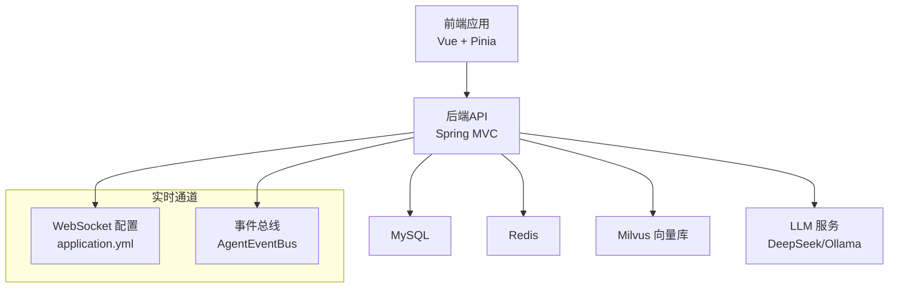
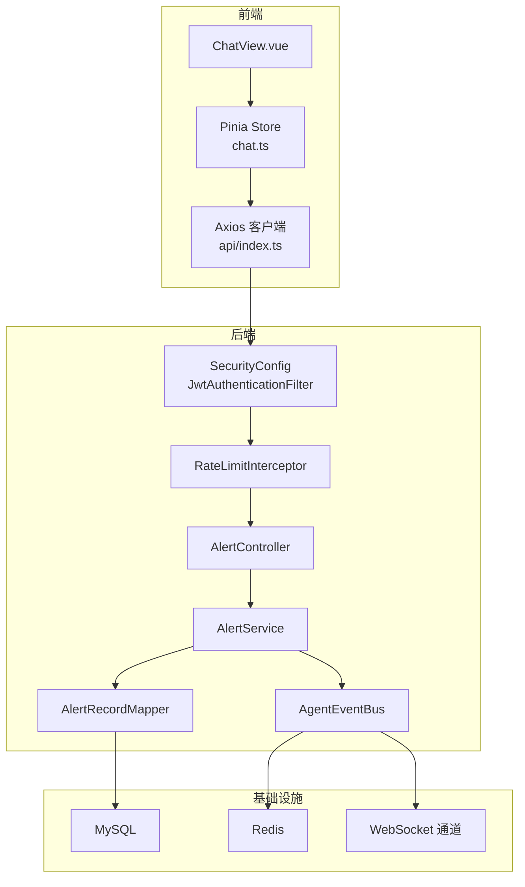
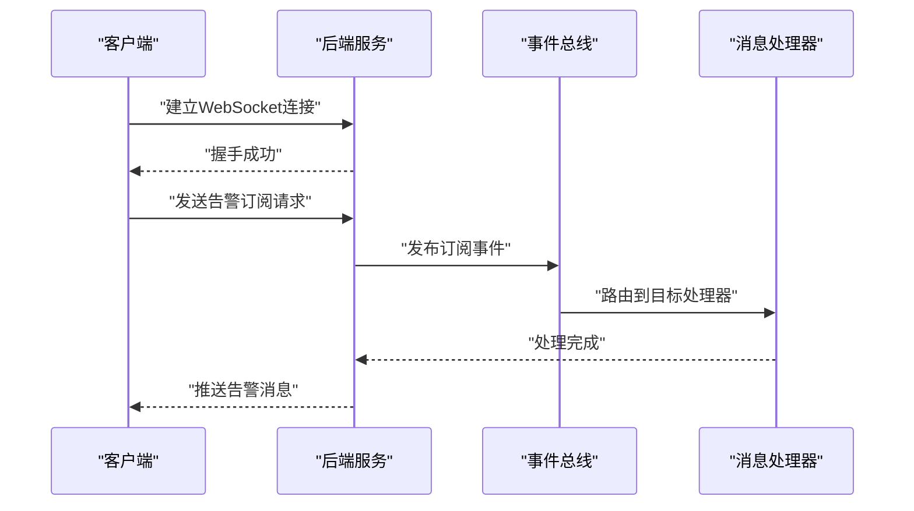
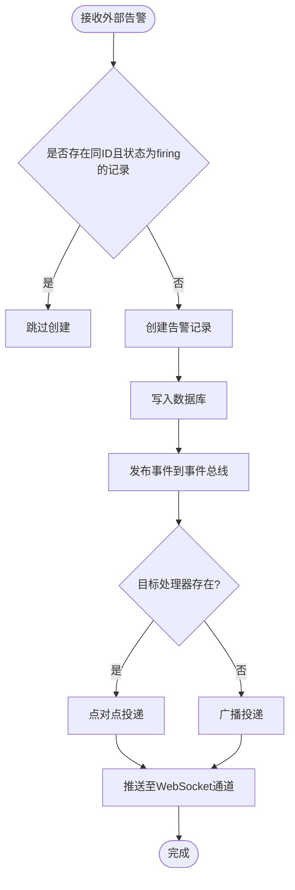
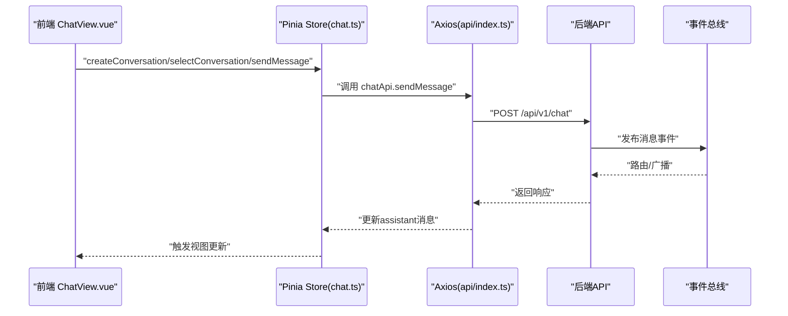
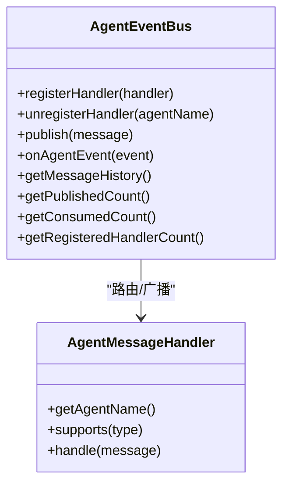
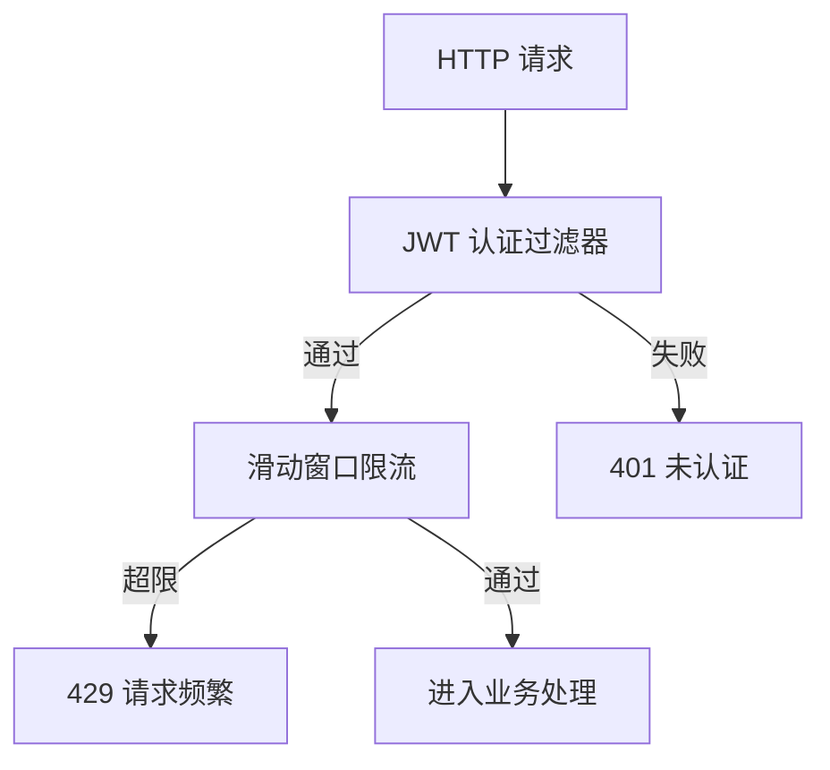
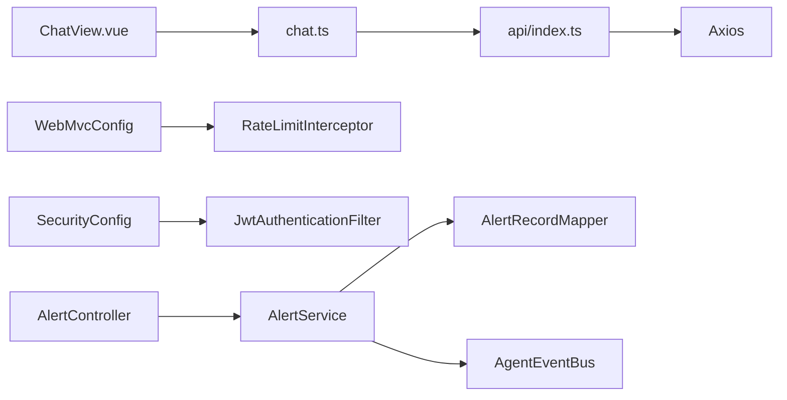

# 实时通信架构设计

<cite>
**本文引用的文件**
- [application.yml](file://netdata-ai-backend/src/main/resources/application.yml)
- [WebMvcConfig.java](file://netdata-ai-backend/src/main/java/com/netdata/ops/config/WebMvcConfig.java)
- [RateLimitInterceptor.java](file://netdata-ai-backend/src/main/java/com/netdata/ops/interceptor/RateLimitInterceptor.java)
- [SecurityConfig.java](file://netdata-ai-backend/src/main/java/com/netdata/ops/config/SecurityConfig.java)
- [JwtAuthenticationFilter.java](file://netdata-ai-backend/src/main/java/com/netdata/ops/security/JwtAuthenticationFilter.java)
- [JwtTokenProvider.java](file://netdata-ai-backend/src/main/java/com/netdata/ops/security/JwtTokenProvider.java)
- [AlertController.java](file://netdata-ai-backend/src/main/java/com/netdata/ops/controller/AlertController.java)
- [AlertService.java](file://netdata-ai-backend/src/main/java/com/netdata/ops/service/AlertService.java)
- [AlertRecordMapper.java](file://netdata-ai-backend/src/main/java/com/netdata/ops/mapper/AlertRecordMapper.java)
- [AgentEventBus.java](file://netdata-ai-backend/src/main/java/com/netdata/ops/core/agent/event/AgentEventBus.java)
- [AgentMessageHandler.java](file://netdata-ai-backend/src/main/java/com/netdata/ops/core/agent/event/AgentMessageHandler.java)
- [index.ts](file://netdata-ai-frontend/src/api/index.ts)
- [chat.ts](file://netdata-ai-frontend/src/stores/chat.ts)
- [ChatView.vue](file://netdata-ai-frontend/src/views/ChatView.vue)
</cite>

## 目录
1. [引言](#引言)
2. [项目结构](#项目结构)
3. [核心组件](#核心组件)
4. [架构总览](#架构总览)
5. [详细组件分析](#详细组件分析)
6. [依赖关系分析](#依赖关系分析)
7. [性能考虑](#性能考虑)
8. [故障排查指南](#故障排查指南)
9. [结论](#结论)
10. [附录](#附录)

## 引言
本设计文档聚焦智能运维系统的实时通信架构，围绕 WebSocket 实时通信、实时告警推送、前后端状态同步、消息队列与事件驱动、安全机制（认证、加密、防刷）展开，提供架构图、消息流转图与状态同步流程图，并给出性能优化、连接池管理与错误处理策略，帮助读者快速理解并落地该系统。

## 项目结构
后端采用 Spring Boot，前端采用 Vue + Pinia，整体遵循“后端无状态 REST API + 前端状态管理”的分层设计；实时能力通过 WebSocket 配置与事件总线实现，配合限流与安全策略保障稳定性与安全性。

图表来源
- [application.yml:250-255](file://netdata-ai-backend/src/main/resources/application.yml#L250-L255)
- [AgentEventBus.java:1-154](file://netdata-ai-backend/src/main/java/com/netdata/ops/core/agent/event/AgentEventBus.java#L1-L154)

章节来源
- [application.yml:1-314](file://netdata-ai-backend/src/main/resources/application.yml#L1-L314)

## 核心组件
- WebSocket 与实时通道
  - 后端在配置文件中启用 WebSocket 路径与跨域策略，为实时告警与通知提供基础通道。
- 事件驱动与消息总线
  - 基于 Spring 的 ApplicationEvent 实现 Agent 间事件总线，支持异步发布、路由与历史记录。
- 前后端状态同步
  - 前端使用 Pinia 管理对话与消息状态；后端通过事件总线驱动状态变更。
- 安全与限流
  - 基于 JWT 的无状态认证；基于 Redis 的滑动窗口限流；全局拦截器链统一处理。
- 实时告警推送
  - 告警接收、去重、统计与趋势计算；结合事件总线实现跨模块联动。

章节来源
- [application.yml:250-255](file://netdata-ai-backend/src/main/resources/application.yml#L250-L255)
- [AgentEventBus.java:1-154](file://netdata-ai-backend/src/main/java/com/netdata/ops/core/agent/event/AgentEventBus.java#L1-L154)
- [chat.ts:1-210](file://netdata-ai-frontend/src/stores/chat.ts#L1-L210)

## 架构总览
下图展示了从用户交互到后端处理、事件总线与实时通道的整体流转。

图表来源
- [ChatView.vue:1-252](file://netdata-ai-frontend/src/views/ChatView.vue#L1-L252)
- [chat.ts:1-210](file://netdata-ai-frontend/src/stores/chat.ts#L1-L210)
- [index.ts:1-290](file://netdata-ai-frontend/src/api/index.ts#L1-L290)
- [AlertController.java:1-108](file://netdata-ai-backend/src/main/java/com/netdata/ops/controller/AlertController.java#L1-L108)
- [AlertService.java:1-237](file://netdata-ai-backend/src/main/java/com/netdata/ops/service/AlertService.java#L1-L237)
- [AlertRecordMapper.java:1-24](file://netdata-ai-backend/src/main/java/com/netdata/ops/mapper/AlertRecordMapper.java#L1-L24)
- [AgentEventBus.java:1-154](file://netdata-ai-backend/src/main/java/com/netdata/ops/core/agent/event/AgentEventBus.java#L1-L154)
- [SecurityConfig.java:1-56](file://netdata-ai-backend/src/main/java/com/netdata/ops/config/SecurityConfig.java#L1-L56)
- [RateLimitInterceptor.java:1-100](file://netdata-ai-backend/src/main/java/com/netdata/ops/interceptor/RateLimitInterceptor.java#L1-L100)

## 详细组件分析

### WebSocket 实时通信与连接管理
- 连接建立
  - 后端通过配置文件声明 WebSocket 路径与允许的来源，前端通过标准 WebSocket 客户端连接至该路径。
- 消息传输
  - 事件总线负责将内部消息发布为 Spring 事件，监听器异步路由至目标处理器或广播至所有处理器。
- 连接管理
  - 事件总线维护处理器注册表与消息历史，提供发布/消费计数与处理器数量统计，便于监控与排障。

图表来源
- [application.yml:250-255](file://netdata-ai-backend/src/main/resources/application.yml#L250-L255)
- [AgentEventBus.java:96-133](file://netdata-ai-backend/src/main/java/com/netdata/ops/core/agent/event/AgentEventBus.java#L96-L133)

章节来源
- [application.yml:250-255](file://netdata-ai-backend/src/main/resources/application.yml#L250-L255)
- [AgentEventBus.java:1-154](file://netdata-ai-backend/src/main/java/com/netdata/ops/core/agent/event/AgentEventBus.java#L1-L154)

### 实时告警推送系统
- 告警事件触发
  - 外部 Webhook 或定时拉取触发创建告警记录，服务层进行去重与入库。
- 消息格式定义
  - 告警实体包含标识、来源、严重级别、主机、指标、阈值、状态与时间戳等字段。
- 推送策略
  - 通过事件总线发布告警消息，监听器根据目标处理器进行点对点或广播推送。

图表来源
- [AlertController.java:69-85](file://netdata-ai-backend/src/main/java/com/netdata/ops/controller/AlertController.java#L69-L85)
- [AlertService.java:94-128](file://netdata-ai-backend/src/main/java/com/netdata/ops/service/AlertService.java#L94-L128)
- [AlertRecordMapper.java:1-24](file://netdata-ai-backend/src/main/java/com/netdata/ops/mapper/AlertRecordMapper.java#L1-L24)
- [AgentEventBus.java:96-133](file://netdata-ai-backend/src/main/java/com/netdata/ops/core/agent/event/AgentEventBus.java#L96-L133)

章节来源
- [AlertController.java:1-108](file://netdata-ai-backend/src/main/java/com/netdata/ops/controller/AlertController.java#L1-L108)
- [AlertService.java:1-237](file://netdata-ai-backend/src/main/java/com/netdata/ops/service/AlertService.java#L1-L237)
- [AlertRecordMapper.java:1-24](file://netdata-ai-backend/src/main/java/com/netdata/ops/mapper/AlertRecordMapper.java#L1-L24)

### 前后端状态同步机制
- 聊天状态
  - 前端使用 Pinia 管理对话列表、当前对话与消息集合；发送消息时添加用户消息与助手占位消息，成功后更新内容与来源。
- 在线状态与系统状态
  - 通过事件总线与 WebSocket 通道实现系统状态变更的实时广播，前端订阅并更新界面状态。
- 状态一致性
  - 事件总线记录消息历史，便于审计与调试；前端通过拦截器统一处理认证与限流响应。

图表来源
- [ChatView.vue:127-138](file://netdata-ai-frontend/src/views/ChatView.vue#L127-L138)
- [chat.ts:82-138](file://netdata-ai-frontend/src/stores/chat.ts#L82-L138)
- [index.ts:123-144](file://netdata-ai-frontend/src/api/index.ts#L123-L144)
- [AgentEventBus.java:96-133](file://netdata-ai-backend/src/main/java/com/netdata/ops/core/agent/event/AgentEventBus.java#L96-L133)

章节来源
- [chat.ts:1-210](file://netdata-ai-frontend/src/stores/chat.ts#L1-L210)
- [index.ts:1-290](file://netdata-ai-frontend/src/api/index.ts#L1-L290)
- [ChatView.vue:1-252](file://netdata-ai-frontend/src/views/ChatView.vue#L1-L252)

### 消息队列与事件驱动架构
- 事件总线
  - 基于 Spring ApplicationEvent 的异步事件总线，支持消息元数据补全、历史记录与统计指标。
- 处理器注册与路由
  - 处理器按名称注册，事件总线根据目标处理器进行点对点路由，或广播给所有支持该类型的消息处理器。
- 监控与可观测性
  - 提供发布/消费计数与处理器数量统计，便于运行时监控。

图表来源
- [AgentEventBus.java:1-154](file://netdata-ai-backend/src/main/java/com/netdata/ops/core/agent/event/AgentEventBus.java#L1-L154)
- [AgentMessageHandler.java:1-19](file://netdata-ai-backend/src/main/java/com/netdata/ops/core/agent/event/AgentMessageHandler.java#L1-L19)

章节来源
- [AgentEventBus.java:1-154](file://netdata-ai-backend/src/main/java/com/netdata/ops/core/agent/event/AgentEventBus.java#L1-L154)
- [AgentMessageHandler.java:1-19](file://netdata-ai-backend/src/main/java/com/netdata/ops/core/agent/event/AgentMessageHandler.java#L1-L19)

### 实时通信安全机制
- 连接认证
  - 基于 JWT 的无状态认证，过滤器从请求头提取令牌并设置安全上下文；禁用 CSRF 与 Session，确保 RESTful 无状态特性。
- 消息加密
  - 通过 HTTPS 与 WebSocket TLS 保障传输层安全；后端配置允许来源，避免跨域风险。
- 防刷策略
  - 基于 Redis 的滑动窗口限流，按用户 ID 或 IP 维度统计请求次数，超过阈值返回 429 并提示稍后再试。
- 速率限制配置
  - 支持默认限流、聊天限流与登录限流，可通过配置文件调整。

图表来源
- [JwtAuthenticationFilter.java:1-36](file://netdata-ai-backend/src/main/java/com/netdata/ops/security/JwtAuthenticationFilter.java#L1-L36)
- [SecurityConfig.java:1-56](file://netdata-ai-backend/src/main/java/com/netdata/ops/config/SecurityConfig.java#L1-L56)
- [RateLimitInterceptor.java:1-100](file://netdata-ai-backend/src/main/java/com/netdata/ops/interceptor/RateLimitInterceptor.java#L1-L100)
- [application.yml:190-202](file://netdata-ai-backend/src/main/resources/application.yml#L190-L202)

章节来源
- [SecurityConfig.java:1-56](file://netdata-ai-backend/src/main/java/com/netdata/ops/config/SecurityConfig.java#L1-L56)
- [JwtAuthenticationFilter.java:1-36](file://netdata-ai-backend/src/main/java/com/netdata/ops/security/JwtAuthenticationFilter.java#L1-L36)
- [RateLimitInterceptor.java:1-100](file://netdata-ai-backend/src/main/java/com/netdata/ops/interceptor/RateLimitInterceptor.java#L1-L100)
- [application.yml:190-202](file://netdata-ai-backend/src/main/resources/application.yml#L190-L202)

## 依赖关系分析
- 前端依赖
  - Axios 客户端封装统一请求与响应拦截，内置 401 自动刷新与 429 限流提示。
  - Pinia 管理聊天状态，视图组件通过 store 动作触发 API 调用。
- 后端依赖
  - WebMvcConfig 注册拦截器链，先注入 TraceId 再进行限流。
  - SecurityConfig 配置无状态 JWT 认证与 CORS。
  - RateLimitInterceptor 基于 Redis ZSET 实现滑动窗口限流。
  - AlertController/AlertService/AlertRecordMapper 形成告警闭环。
  - AgentEventBus 提供事件总线能力，支撑实时通道与跨模块通信。

图表来源
- [index.ts:1-290](file://netdata-ai-frontend/src/api/index.ts#L1-L290)
- [chat.ts:1-210](file://netdata-ai-frontend/src/stores/chat.ts#L1-L210)
- [ChatView.vue:1-252](file://netdata-ai-frontend/src/views/ChatView.vue#L1-L252)
- [WebMvcConfig.java:1-39](file://netdata-ai-backend/src/main/java/com/netdata/ops/config/WebMvcConfig.java#L1-L39)
- [RateLimitInterceptor.java:1-100](file://netdata-ai-backend/src/main/java/com/netdata/ops/interceptor/RateLimitInterceptor.java#L1-L100)
- [SecurityConfig.java:1-56](file://netdata-ai-backend/src/main/java/com/netdata/ops/config/SecurityConfig.java#L1-L56)
- [JwtAuthenticationFilter.java:1-36](file://netdata-ai-backend/src/main/java/com/netdata/ops/security/JwtAuthenticationFilter.java#L1-L36)
- [AlertController.java:1-108](file://netdata-ai-backend/src/main/java/com/netdata/ops/controller/AlertController.java#L1-L108)
- [AlertService.java:1-237](file://netdata-ai-backend/src/main/java/com/netdata/ops/service/AlertService.java#L1-L237)
- [AlertRecordMapper.java:1-24](file://netdata-ai-backend/src/main/java/com/netdata/ops/mapper/AlertRecordMapper.java#L1-L24)
- [AgentEventBus.java:1-154](file://netdata-ai-backend/src/main/java/com/netdata/ops/core/agent/event/AgentEventBus.java#L1-L154)

章节来源
- [WebMvcConfig.java:1-39](file://netdata-ai-backend/src/main/java/com/netdata/ops/config/WebMvcConfig.java#L1-L39)
- [SecurityConfig.java:1-56](file://netdata-ai-backend/src/main/java/com/netdata/ops/config/SecurityConfig.java#L1-L56)
- [RateLimitInterceptor.java:1-100](file://netdata-ai-backend/src/main/java/com/netdata/ops/interceptor/RateLimitInterceptor.java#L1-L100)
- [AlertController.java:1-108](file://netdata-ai-backend/src/main/java/com/netdata/ops/controller/AlertController.java#L1-L108)
- [AlertService.java:1-237](file://netdata-ai-backend/src/main/java/com/netdata/ops/service/AlertService.java#L1-L237)
- [AlertRecordMapper.java:1-24](file://netdata-ai-backend/src/main/java/com/netdata/ops/mapper/AlertRecordMapper.java#L1-L24)
- [AgentEventBus.java:1-154](file://netdata-ai-backend/src/main/java/com/netdata/ops/core/agent/event/AgentEventBus.java#L1-L154)
- [index.ts:1-290](file://netdata-ai-frontend/src/api/index.ts#L1-L290)
- [chat.ts:1-210](file://netdata-ai-frontend/src/stores/chat.ts#L1-L210)
- [ChatView.vue:1-252](file://netdata-ai-frontend/src/views/ChatView.vue#L1-L252)

## 性能考虑
- 连接池与线程池
  - 数据库连接池与最大并发连接数已在配置中设定；事件总线使用异步执行器处理消息，避免阻塞主线程。
- 限流与背压
  - 滑动窗口限流防止突发流量冲击；前端拦截器对 429 进行友好提示，避免重复重试。
- 缓存与持久化
  - Redis 用于限流与令牌黑名单；MySQL 存储告警与用户数据；Milvus 用于向量检索。
- 传输优化
  - WebSocket 通道与事件总线减少轮询开销；HTTPS/TLS 保障传输安全。

章节来源
- [application.yml:36-42](file://netdata-ai-backend/src/main/resources/application.yml#L36-L42)
- [RateLimitInterceptor.java:1-100](file://netdata-ai-backend/src/main/java/com/netdata/ops/interceptor/RateLimitInterceptor.java#L1-L100)
- [AgentEventBus.java:96-133](file://netdata-ai-backend/src/main/java/com/netdata/ops/core/agent/event/AgentEventBus.java#L96-L133)

## 故障排查指南
- 认证失败（401）
  - 检查请求头 Authorization 是否携带有效 Bearer Token；确认刷新流程是否正确执行。
- 请求过于频繁（429）
  - 检查限流配置与 Redis 中的 ZSET 计数；确认客户端是否在等待刷新回调后重试。
- 事件未到达
  - 检查事件总线处理器是否注册、消息类型是否匹配、目标处理器是否存在。
- 告警未推送
  - 检查告警去重逻辑与数据库状态；确认事件总线已发布并路由成功。

章节来源
- [index.ts:48-112](file://netdata-ai-frontend/src/api/index.ts#L48-L112)
- [RateLimitInterceptor.java:92-99](file://netdata-ai-backend/src/main/java/com/netdata/ops/interceptor/RateLimitInterceptor.java#L92-L99)
- [AgentEventBus.java:111-118](file://netdata-ai-backend/src/main/java/com/netdata/ops/core/agent/event/AgentEventBus.java#L111-L118)
- [AlertService.java:101-109](file://netdata-ai-backend/src/main/java/com/netdata/ops/service/AlertService.java#L101-L109)

## 结论
本实时通信架构以 WebSocket 为基础通道，结合事件驱动与消息总线实现跨模块解耦与高效通信；通过 JWT 无状态认证与 Redis 限流构建安全稳定的接入层；前端以 Pinia 管理状态，实现流畅的聊天与告警体验。整体方案具备良好的扩展性与可观测性，适合在智能运维场景中持续演进。

## 附录
- 关键配置项
  - WebSocket 路径与允许来源：参见配置文件中 WebSocket 配置段。
  - JWT 密钥与过期时间：参见安全配置段。
  - 限流阈值：参见速率限制配置段。
- 前端 API 与状态
  - Axios 客户端与拦截器：参见前端 API 客户端文件。
  - Pinia 聊天状态：参见前端聊天状态文件。

章节来源
- [application.yml:250-255](file://netdata-ai-backend/src/main/resources/application.yml#L250-L255)
- [application.yml:190-202](file://netdata-ai-backend/src/main/resources/application.yml#L190-L202)
- [index.ts:1-290](file://netdata-ai-frontend/src/api/index.ts#L1-L290)
- [chat.ts:1-210](file://netdata-ai-frontend/src/stores/chat.ts#L1-L210)