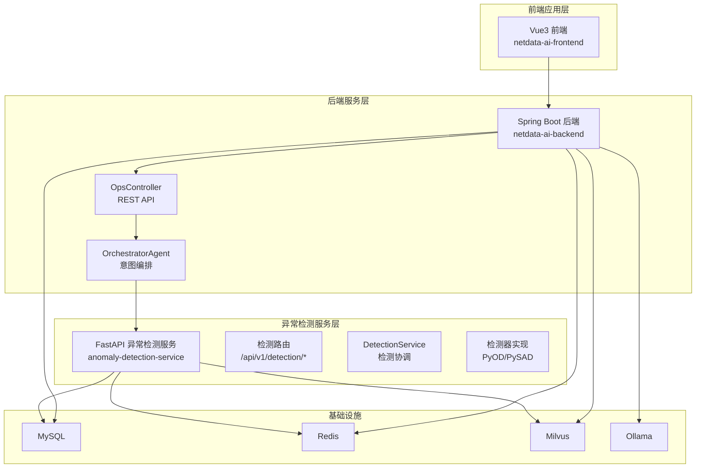
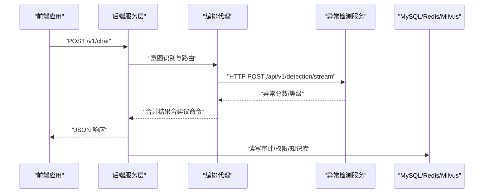
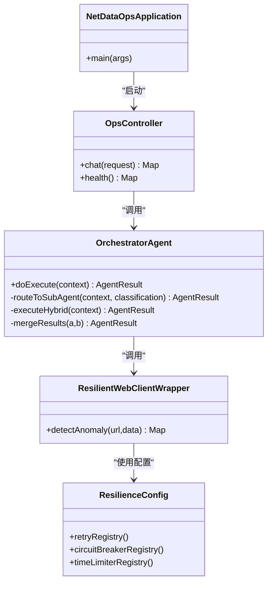
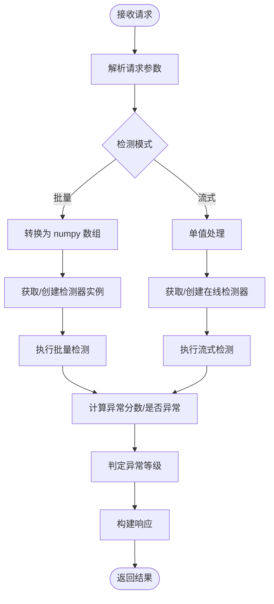
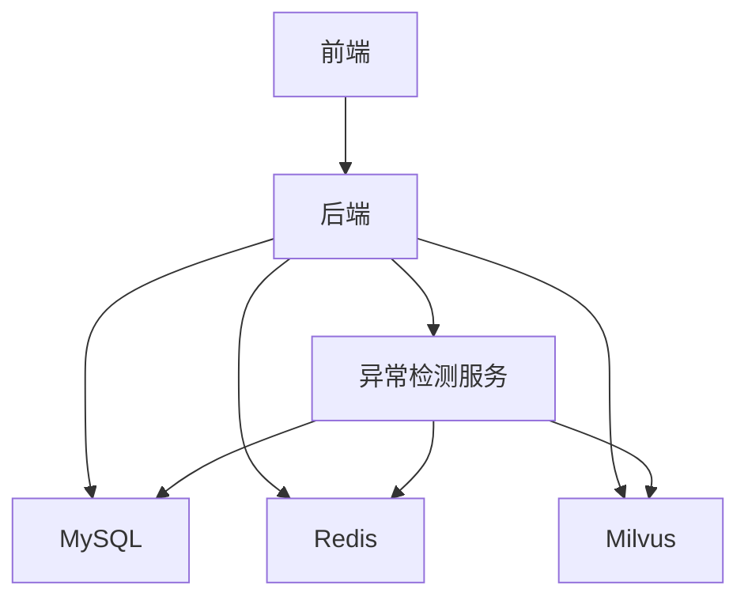

# 微服务架构设计

<cite>
**本文引用的文件**
- [docker-compose.yml](file://docker-compose.yml)
- [Dockerfile（异常检测服务）](file://anomaly-detection-service/Dockerfile)
- [application.yml（后端配置）](file://netdata-ai-backend/src/main/resources/application.yml)
- [main.py（异常检测服务入口）](file://anomaly-detection-service/app/main.py)
- [detection.py（异常检测路由）](file://anomaly-detection-service/app/api/routes/detection.py)
- [detection_service.py（异常检测服务层）](file://anomaly-detection-service/app/services/detection_service.py)
- [pyod_detector.py（离线检测器实现）](file://anomaly-detection-service/app/core/pyod_detector.py)
- [pysad_detector.py（在线检测器实现）](file://anomaly-detection-service/app/core/pysad_detector.py)
- [NetDataOpsApplication.java（后端入口）](file://netdata-ai-backend/src/main/java/com/netdata/ops/NetDataOpsApplication.java)
- [OpsController.java（后端控制器）](file://netdata-ai-backend/src/main/java/com/netdata/ops/controller/OpsController.java)
- [OrchestratorAgent.java（编排代理）](file://netdata-ai-backend/src/main/java/com/netdata/ops/core/agent/OrchestratorAgent.java)
- [ResilientWebClientWrapper.java（弹性封装）](file://netdata-ai-backend/src/main/java/com/netdata/ops/core/ai/ResilientWebClientWrapper.java)
- [ResilienceConfig.java（弹性配置）](file://netdata-ai-backend/src/main/java/com/netdata/ops/config/ResilienceConfig.java)
- [deployment_guide.md（部署指南）](file://docs/deployment_guide.md)
- [package.json（前端依赖）](file://netdata-ai-frontend/package.json)
</cite>

## 目录
1. [引言](#引言)
2. [项目结构](#项目结构)
3. [核心组件](#核心组件)
4. [架构总览](#架构总览)
5. [详细组件分析](#详细组件分析)
6. [依赖分析](#依赖分析)
7. [性能考量](#性能考量)
8. [故障排查指南](#故障排查指南)
9. [结论](#结论)
10. [附录](#附录)

## 引言
本设计文档面向“面向 NetData 监控数据的智能运维问答与执行系统”，提出一套完整的微服务架构方案。系统以三层分层为核心：后端服务层（Spring Boot）、异常检测服务层（FastAPI + PyOD/PySAD）、前端应用层（Vue3）。围绕服务间通信、数据流转、服务治理（服务发现、负载均衡、容错）、容器化编排（Docker Compose）以及监控与日志，给出从架构到落地的完整说明。

## 项目结构
系统采用多模块组织：
- 后端服务层：Spring Boot 应用，提供 API、RAG、意图识别、命令执行审批、WebSocket 实时通知等能力。
- 异常检测服务层：独立的 FastAPI 微服务，提供批量/流式异常检测与模型训练能力。
- 前端应用层：Vue3 + TypeScript 前端，通过代理访问后端与异常检测服务。
- 基础设施：Docker Compose 编排 MySQL、Redis、Milvus、Ollama 等依赖服务。

图表来源
- [docker-compose.yml](file://docker-compose.yml)
- [application.yml（后端配置）](file://netdata-ai-backend/src/main/resources/application.yml)
- [main.py（异常检测服务入口）](file://anomaly-detection-service/app/main.py)
- [detection.py（异常检测路由）](file://anomaly-detection-service/app/api/routes/detection.py)
- [detection_service.py（异常检测服务层）](file://anomaly-detection-service/app/services/detection_service.py)
- [pyod_detector.py（离线检测器实现）](file://anomaly-detection-service/app/core/pyod_detector.py)
- [pysad_detector.py（在线检测器实现）](file://anomaly-detection-service/app/core/pysad_detector.py)
- [OpsController.java（后端控制器）](file://netdata-ai-backend/src/main/java/com/netdata/ops/controller/OpsController.java)
- [OrchestratorAgent.java（编排代理）](file://netdata-ai-backend/src/main/java/com/netdata/ops/core/agent/OrchestratorAgent.java)

章节来源
- [docker-compose.yml](file://docker-compose.yml)
- [application.yml（后端配置）](file://netdata-ai-backend/src/main/resources/application.yml)

## 核心组件
- 后端服务层（Spring Boot）
  - 入口类负责应用启动与异步调度启用。
  - 控制器提供对外 API，如智能问答、健康检查等。
  - 编排代理负责意图识别与任务路由，支持混合意图并行执行。
  - 配置文件集中管理数据源、缓存、AI 模型、RAG、安全与监控指标暴露。
- 异常检测服务层（FastAPI）
  - 提供批量检测、流式检测、模型训练与 NetData 数据抓取接口。
  - 检测服务层统一管理离线/在线检测器实例池与模型持久化。
  - 检测器实现封装 PyOD（离线）与 PySAD（在线）算法。
- 前端应用层（Vue3）
  - 依赖管理与构建脚本，通过代理访问后端与异常检测服务。

章节来源
- [NetDataOpsApplication.java（后端入口）](file://netdata-ai-backend/src/main/java/com/netdata/ops/NetDataOpsApplication.java)
- [OpsController.java（后端控制器）](file://netdata-ai-backend/src/main/java/com/netdata/ops/controller/OpsController.java)
- [OrchestratorAgent.java（编排代理）](file://netdata-ai-backend/src/main/java/com/netdata/ops/core/agent/OrchestratorAgent.java)
- [application.yml（后端配置）](file://netdata-ai-backend/src/main/resources/application.yml)
- [main.py（异常检测服务入口）](file://anomaly-detection-service/app/main.py)
- [detection.py（异常检测路由）](file://anomaly-detection-service/app/api/routes/detection.py)
- [detection_service.py（异常检测服务层）](file://anomaly-detection-service/app/services/detection_service.py)
- [pyod_detector.py（离线检测器实现）](file://anomaly-detection-service/app/core/pyod_detector.py)
- [pysad_detector.py（在线检测器实现）](file://anomaly-detection-service/app/core/pysad_detector.py)
- [package.json（前端依赖）](file://netdata-ai-frontend/package.json)

## 架构总览
系统采用“后端 + 异常检测 + 基础设施”的微服务架构，服务间通过 REST/WebSocket 与内部 HTTP 调用交互；异常检测服务通过 Resilience4j 实现弹性与降级；容器化编排通过 Docker Compose 统一管理。

图表来源
- [OpsController.java（后端控制器）](file://netdata-ai-backend/src/main/java/com/netdata/ops/controller/OpsController.java)
- [OrchestratorAgent.java（编排代理）](file://netdata-ai-backend/src/main/java/com/netdata/ops/core/agent/OrchestratorAgent.java)
- [detection.py（异常检测路由）](file://anomaly-detection-service/app/api/routes/detection.py)
- [application.yml（后端配置）](file://netdata-ai-backend/src/main/resources/application.yml)

## 详细组件分析

### 后端服务层（Spring Boot）
- 入口与启动
  - 应用入口启用异步调度，便于并行执行混合意图。
- 控制器与 API
  - 提供智能问答、健康检查等端点，统一返回结构化结果。
- 编排代理（OrchestratorAgent）
  - 双级意图分类：规则快速路径 + LLM 语义分类，支持低置信度澄清。
  - 混合意图并行执行，通过 CompletableFuture 实现非阻塞并行，失败时降级为串行。
  - 结果合并：整合故障诊断与知识查询，附加建议命令列表。
- 容错与弹性
  - Resilience4j 编程式配置：重试、熔断、超时、并发限制。
  - 弹性封装：对异常检测服务调用进行装饰，失败时返回降级结果。
- 配置与监控
  - 多环境配置（dev/prod），AI 模型切换（DeepSeek/Ollama），RAG 参数，安全与速率限制。
  - Actuator 暴露健康、指标、熔断器与重试状态，集成 Prometheus。

图表来源
- [NetDataOpsApplication.java（后端入口）](file://netdata-ai-backend/src/main/java/com/netdata/ops/NetDataOpsApplication.java)
- [OpsController.java（后端控制器）](file://netdata-ai-backend/src/main/java/com/netdata/ops/controller/OpsController.java)
- [OrchestratorAgent.java（编排代理）](file://netdata-ai-backend/src/main/java/com/netdata/ops/core/agent/OrchestratorAgent.java)
- [ResilientWebClientWrapper.java（弹性封装）](file://netdata-ai-backend/src/main/java/com/netdata/ops/core/ai/ResilientWebClientWrapper.java)
- [ResilienceConfig.java（弹性配置）](file://netdata-ai-backend/src/main/java/com/netdata/ops/config/ResilienceConfig.java)

章节来源
- [NetDataOpsApplication.java（后端入口）](file://netdata-ai-backend/src/main/java/com/netdata/ops/NetDataOpsApplication.java)
- [OpsController.java（后端控制器）](file://netdata-ai-backend/src/main/java/com/netdata/ops/controller/OpsController.java)
- [OrchestratorAgent.java（编排代理）](file://netdata-ai-backend/src/main/java/com/netdata/ops/core/agent/OrchestratorAgent.java)
- [ResilientWebClientWrapper.java（弹性封装）](file://netdata-ai-backend/src/main/java/com/netdata/ops/core/ai/ResilientWebClientWrapper.java)
- [ResilienceConfig.java（弹性配置）](file://netdata-ai-backend/src/main/java/com/netdata/ops/config/ResilienceConfig.java)
- [application.yml（后端配置）](file://netdata-ai-backend/src/main/resources/application.yml)

### 异常检测服务层（FastAPI）
- 应用入口与生命周期
  - FastAPI 应用创建、CORS 中间件、请求日志中间件、全局异常处理。
  - 生命周期钩子中进行日志配置与检测器预加载。
- 路由与接口
  - 批量检测：离线算法（Isolation Forest、LOF、KNN）。
  - 流式检测：在线算法（Half-Space Trees、xStream）。
  - 训练接口：使用历史数据训练并持久化模型。
  - NetData 集成：直接抓取指标并检测。
- 服务层与检测器
  - DetectionService 统一管理检测器实例池与在线检测器状态。
  - 支持模型加载/保存、统计信息导出。
  - 检测器实现封装 PyOD（离线）与 PySAD（在线）。

图表来源
- [main.py（异常检测服务入口）](file://anomaly-detection-service/app/main.py)
- [detection.py（异常检测路由）](file://anomaly-detection-service/app/api/routes/detection.py)
- [detection_service.py（异常检测服务层）](file://anomaly-detection-service/app/services/detection_service.py)
- [pyod_detector.py（离线检测器实现）](file://anomaly-detection-service/app/core/pyod_detector.py)
- [pysad_detector.py（在线检测器实现）](file://anomaly-detection-service/app/core/pysad_detector.py)

章节来源
- [main.py（异常检测服务入口）](file://anomaly-detection-service/app/main.py)
- [detection.py（异常检测路由）](file://anomaly-detection-service/app/api/routes/detection.py)
- [detection_service.py（异常检测服务层）](file://anomaly-detection-service/app/services/detection_service.py)
- [pyod_detector.py（离线检测器实现）](file://anomaly-detection-service/app/core/pyod_detector.py)
- [pysad_detector.py（在线检测器实现）](file://anomaly-detection-service/app/core/pysad_detector.py)

### 前端应用层（Vue3）
- 依赖与构建
  - 使用 Vue3、Pinia、Element Plus、Axios 等生态，支持 TypeScript。
  - 构建脚本与开发服务器配置，适配 Vite。
- 代理与访问
  - 部署指南提供 Nginx 代理配置，将 /api 代理至后端，/detect 代理至异常检测服务。
  - WebSocket 代理用于实时告警与审批通知。

章节来源
- [package.json（前端依赖）](file://netdata-ai-frontend/package.json)
- [deployment_guide.md（部署指南）](file://docs/deployment_guide.md)

## 依赖分析
- 服务间依赖
  - 后端调用异常检测服务进行实时/批量异常检测。
  - 后端读写 MySQL、Redis、Milvus，支撑权限、缓存、RAG 向量检索。
  - 前端通过反向代理访问后端与异常检测服务。
- 外部依赖
  - LLM：DeepSeek API（生产）或 Ollama（开发）。
  - 向量数据库：Milvus 2.4，集合 ops_knowledge_base，维度 1024。
- 容器编排
  - Docker Compose 统一管理服务生命周期、健康检查、资源限制与网络隔离。

图表来源
- [docker-compose.yml](file://docker-compose.yml)
- [application.yml（后端配置）](file://netdata-ai-backend/src/main/resources/application.yml)

章节来源
- [docker-compose.yml](file://docker-compose.yml)
- [application.yml（后端配置）](file://netdata-ai-backend/src/main/resources/application.yml)

## 性能考量
- 异常检测
  - 离线检测器（PyOD）支持并行计算与批处理，适合历史数据分析。
  - 在线检测器（PySAD）支持流式单值评分，低延迟、固定内存占用。
  - 检测器实例池与模型持久化减少重复初始化成本。
- 后端弹性
  - Resilience4j 重试、熔断、超时与并发限制，保障外部依赖波动下的稳定性。
  - 混合意图并行执行，缩短响应时间。
- 基础设施
  - Docker Compose 为 Milvus、MySQL、Redis、Ollama 分配合理内存，避免资源争用。
  - 健康检查与优雅关闭，提升部署可靠性。

## 故障排查指南
- 健康检查
  - 后端：Actuator 健康端点暴露详细状态，便于快速定位。
  - 异常检测服务：健康检查端点与 gunicorn + uvicorn worker 配置。
- 日志
  - 后端：控制台与文件日志，支持结构化 JSON，便于 ELK/日志平台检索。
  - 前端：Nginx 访问日志与后端 API 日志联动。
- 容错降级
  - 当异常检测服务不可用时，弹性封装返回降级结果，保证系统基本可用。
- 配置校验
  - application.yml 中的 LLM、Milvus、RAG 参数需与实际环境一致。
  - Docker Compose 环境变量与卷挂载需正确。

章节来源
- [application.yml（后端配置）](file://netdata-ai-backend/src/main/resources/application.yml)
- [Dockerfile（异常检测服务）](file://anomaly-detection-service/Dockerfile)
- [deployment_guide.md（部署指南）](file://docs/deployment_guide.md)
- [ResilientWebClientWrapper.java（弹性封装）](file://netdata-ai-backend/src/main/java/com/netdata/ops/core/ai/ResilientWebClientWrapper.java)

## 结论
本方案以清晰的三层分层与微服务架构为基础，结合 Resilience4j 弹性设计、Docker Compose 容器编排与完善的监控日志体系，实现了从智能问答、故障诊断到命令执行的闭环运维能力。通过实例池、流式检测与并行执行等技术手段，兼顾性能与稳定性，满足开发与生产的多样化需求。

## 附录
- 部署与访问
  - 一键启动：docker-compose up -d。
  - 访问地址：前端、后端 API、异常检测服务、Milvus、Redis。
- 生产化建议
  - 使用 Kubernetes 进行服务编排与水平扩展。
  - 配置 Ingress 与证书，启用 HTTPS。
  - 建立 Prometheus + Grafana 监控与 ELK 日志聚合。

章节来源
- [deployment_guide.md（部署指南）](file://docs/deployment_guide.md)
- [docker-compose.yml](file://docker-compose.yml)