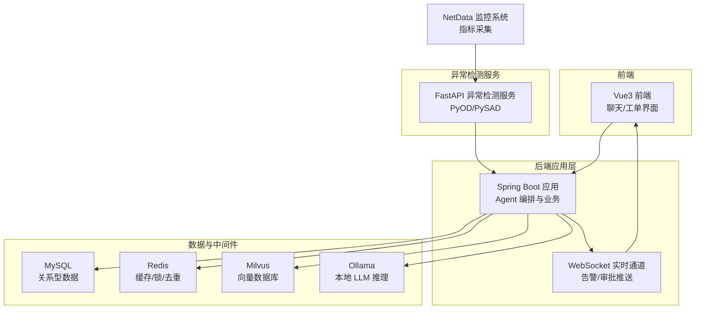
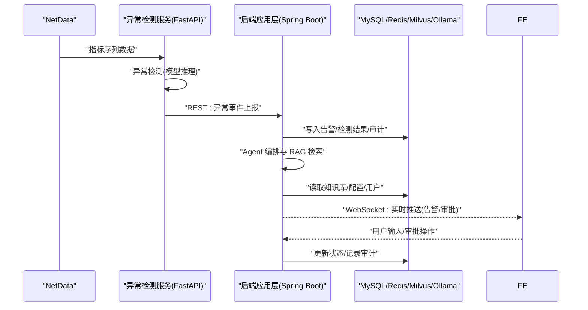
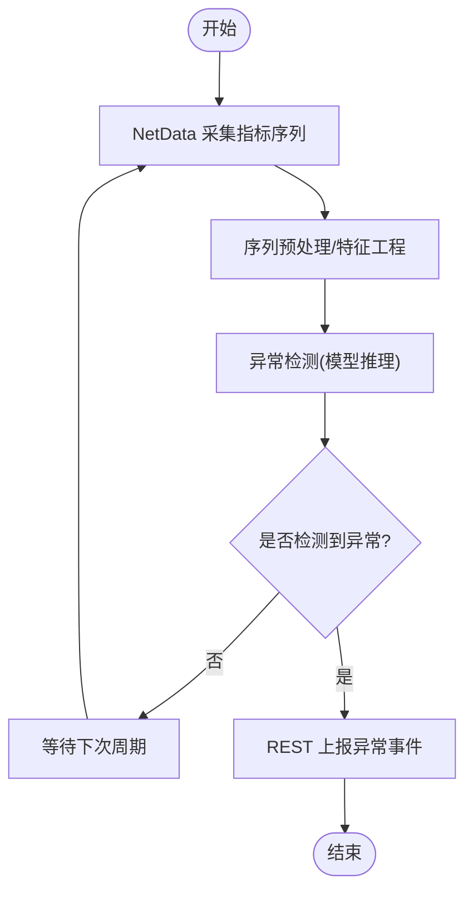
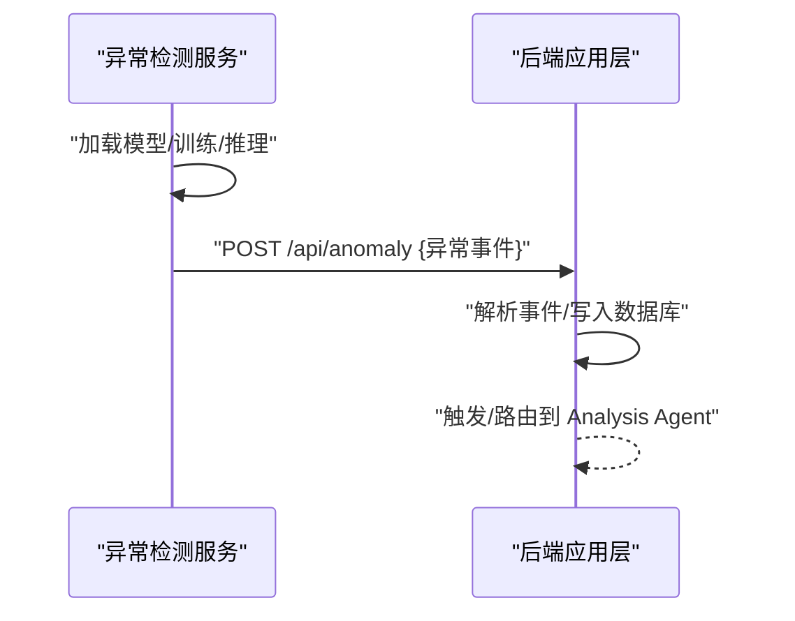
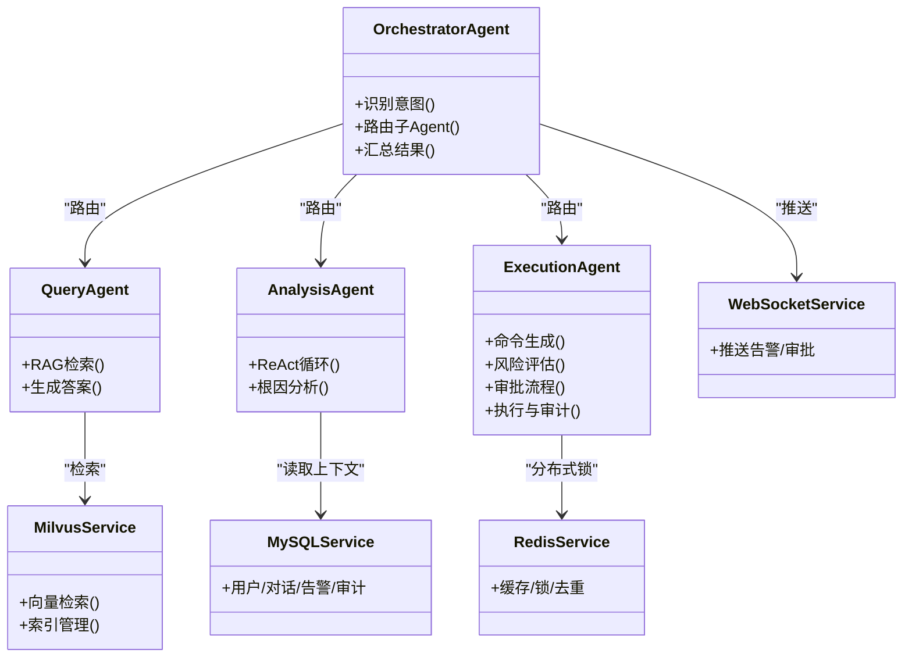
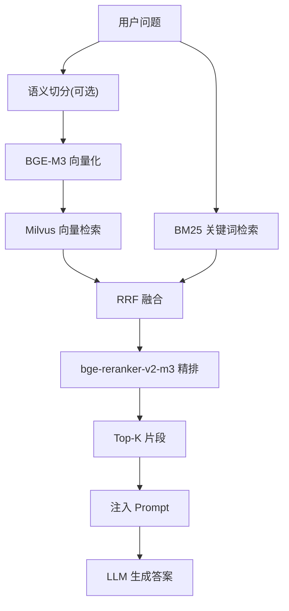
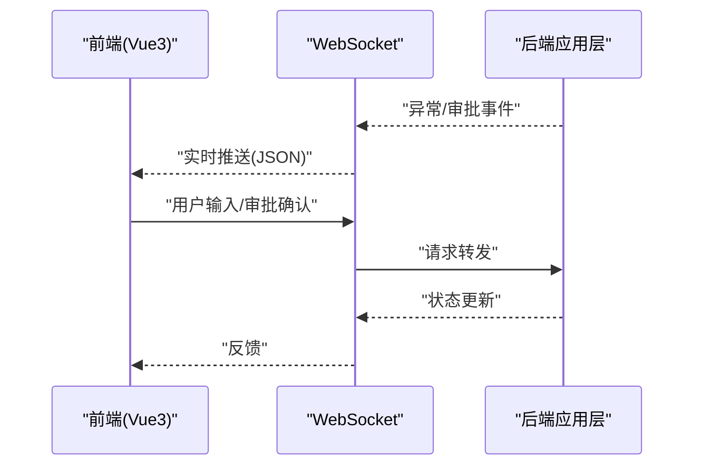
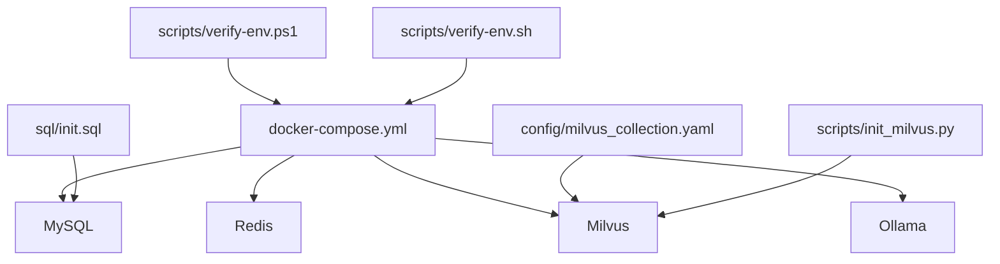

# 数据流设计

<cite>
**本文引用的文件**
- [PROJECT_CONTEXT.md](file://PROJECT_CONTEXT.md)
- [开题报告_精简版.md](file://开题报告_精简版.md)
- [docker-compose.yml](file://docker-compose.yml)
- [config/milvus_collection.yaml](file://config/milvus_collection.yaml)
- [sql/init.sql](file://sql/init.sql)
- [scripts/init_milvus.py](file://scripts/init_milvus.py)
- [docs/prompts/orchestrator-system-prompt.md](file://docs/prompts/orchestrator-system-prompt.md)
- [docs/prompts/query-agent-system-prompt.md](file://docs/prompts/query-agent-system-prompt.md)
- [docs/prompts/analysis-agent-system-prompt.md](file://docs/prompts/analysis-agent-system-prompt.md)
- [docs/prompts/execution-agent-system-prompt.md](file://docs/prompts/execution-agent-system-prompt.md)
- [docs/prompts/shared-safety-constraints.md](file://docs/prompts/shared-safety-constraints.md)
- [scripts/verify-env.ps1](file://scripts/verify-env.ps1)
- [scripts/verify-env.sh](file://scripts/verify-env.sh)
</cite>

## 目录
1. [简介](#简介)
2. [项目结构](#项目结构)
3. [核心组件](#核心组件)
4. [架构总览](#架构总览)
5. [详细组件分析](#详细组件分析)
6. [依赖分析](#依赖分析)
7. [性能考虑](#性能考虑)
8. [故障排查指南](#故障排查指南)
9. [结论](#结论)
10. [附录](#附录)

## 简介
本文件面向“面向 NetData 监控数据的智能运维问答与执行系统”，聚焦系统内数据的完整流转路径与转换过程，覆盖从 NetData 监控数据采集与处理、异常检测服务、后端应用层数据处理，到前端界面用户展示的全过程。文档同时解释各组件间的数据传递格式与协议（REST API、WebSocket、数据库操作等），并给出数据流图与时序图，帮助开发者快速理解系统数据处理逻辑。

## 项目结构
系统采用多服务容器化编排，后端 Java 应用、异常检测 Python 服务、前端 Vue3 应用与基础中间件（MySQL、Redis、Milvus、Ollama）共同构成整体架构。项目上下文明确了 Agent 架构（Orchestrator-Subagent）、RAG 方案（混合检索 + 重排）与技术栈，为数据流设计提供了高层约束。

图表来源
- [PROJECT_CONTEXT.md:120-149](file://PROJECT_CONTEXT.md#L120-L149)
- [开题报告_精简版.md:118-152](file://开题报告_精简版.md#L118-L152)

章节来源
- [PROJECT_CONTEXT.md:120-149](file://PROJECT_CONTEXT.md#L120-L149)
- [开题报告_精简版.md:118-152](file://开题报告_精简版.md#L118-L152)

## 核心组件
- NetData 监控系统：提供高频指标采集（1 秒级），作为异常检测与诊断的数据来源。
- 异常检测服务（Python FastAPI）：使用 PyOD/PySAD 对指标序列进行异常检测，将异常事件通过 REST API 发送至后端 Java 应用。
- 后端应用层（Java Spring Boot）：负责 Agent 编排、RAG 检索、LLM 推理、命令执行与审批、数据库与缓存交互、WebSocket 实时推送。
- 前端（Vue3）：用户交互界面，支持聊天问答、告警看板、知识库浏览、执行审批等。
- 基础中间件：MySQL（关系数据）、Redis（缓存/锁/去重）、Milvus（向量检索）、Ollama（本地 LLM）。

章节来源
- [PROJECT_CONTEXT.md:16-61](file://PROJECT_CONTEXT.md#L16-L61)
- [开题报告_精简版.md:156-168](file://开题报告_精简版.md#L156-L168)

## 架构总览
系统采用“前端 → 后端应用层 → 异常检测服务/中间件”的分层数据流。异常检测服务与后端应用层通过 REST API 通信；后端应用层与前端通过 WebSocket 实时通信；后端应用层与 MySQL、Redis、Milvus、Ollama 通过各自协议与 SDK/驱动交互。

图表来源
- [开题报告_精简版.md:163-189](file://开题报告_精简版.md#L163-L189)
- [PROJECT_CONTEXT.md:120-149](file://PROJECT_CONTEXT.md#L120-L149)

## 详细组件分析

### 组件 A：NetData 监控数据采集与处理
- 数据来源：NetData 提供指标数据（CPU、内存、磁盘、网络等），采集频率为 1 秒。
- 数据格式：指标序列（时间戳、指标值）。
- 传输协议：HTTP REST API 与 WebSocket（用于实时事件）。
- 处理要点：异常检测服务接收原始序列，进行特征工程与模型推理，输出异常事件。

图表来源
- [开题报告_精简版.md:157-168](file://开题报告_精简版.md#L157-L168)

章节来源
- [开题报告_精简版.md:157-168](file://开题报告_精简版.md#L157-L168)

### 组件 B：异常检测服务（Python FastAPI）
- 职责：接收指标序列，使用 PyOD/PySAD 进行异常检测，输出异常事件。
- 数据格式：输入为指标序列数组；输出为异常事件对象（异常时间、指标、异常值、历史基线等）。
- 通信协议：REST API（POST /api/anomaly）。
- 与后端集成：后端应用层定时拉取或接收推送的异常事件，进入 Agent 编排与诊断流程。

图表来源
- [开题报告_精简版.md:163-189](file://开题报告_精简版.md#L163-L189)

章节来源
- [开题报告_精简版.md:163-189](file://开题报告_精简版.md#L163-L189)

### 组件 C：后端应用层（Spring Boot）
- 职责：Agent 编排（Orchestrator-Subagent）、RAG 检索、LLM 推理、命令执行与审批、数据库与缓存交互、WebSocket 实时推送。
- 数据流关键节点：
  - 接收异常事件与用户输入，进行意图识别与任务路由。
  - RAG 检索：向量检索（Milvus）+ 关键词检索（BM25）+ RRF 融合 + reranker 精排。
  - LLM 推理：通过 Spring AI ChatClient 调用 Ollama 或 DeepSeek API。
  - 命令执行：安全检查、风险评估、审批流程、执行与审计。
  - 实时通信：WebSocket 推送告警与审批状态。
  - 数据持久化：MySQL 存储用户、对话、告警、执行审计、配置等。

图表来源
- [PROJECT_CONTEXT.md:43-61](file://PROJECT_CONTEXT.md#L43-L61)
- [开题报告_精简版.md:191-221](file://开题报告_精简版.md#L191-L221)

章节来源
- [PROJECT_CONTEXT.md:43-61](file://PROJECT_CONTEXT.md#L43-L61)
- [开题报告_精简版.md:191-221](file://开题报告_精简版.md#L191-L221)

### 组件 D：RAG 知识库与检索
- 向量数据库：Milvus，BGE-M3 1024 维向量，COSINE 相似度，IVF_FLAT 索引。
- 检索流程：向量检索 + BM25 关键词检索 → RRF 融合 → bge-reranker-v2-m3 精排 → Top-K 注入 Prompt → LLM 生成答案。
- 数据模型：文档片段（content、embedding、source、title、chunk_index、created_at）。

图表来源
- [开题报告_精简版.md:64-78](file://开题报告_精简版.md#L64-L78)
- [config/milvus_collection.yaml:105-140](file://config/milvus_collection.yaml#L105-L140)
- [scripts/init_milvus.py:133-242](file://scripts/init_milvus.py#L133-L242)

章节来源
- [开题报告_精简版.md:64-78](file://开题报告_精简版.md#L64-L78)
- [config/milvus_collection.yaml:105-140](file://config/milvus_collection.yaml#L105-L140)
- [scripts/init_milvus.py:133-242](file://scripts/init_milvus.py#L133-L242)

### 组件 E：前端界面与实时通信
- 前端：Vue3 + Element Plus，提供聊天界面、告警看板、知识库浏览、执行审批等。
- 实时通信：WebSocket 推送异常事件与审批状态，支持双向交互。
- 数据格式：后端推送 JSON 结构（告警、审批请求、执行结果等）。

图表来源
- [开题报告_精简版.md:120-152](file://开题报告_精简版.md#L120-L152)

章节来源
- [开题报告_精简版.md:120-152](file://开题报告_精简版.md#L120-L152)

## 依赖分析
- 容器编排：docker-compose 统一管理 Milvus、MySQL、Redis、Ollama 等服务，定义网络与健康检查。
- 数据库：MySQL 初始化脚本定义用户、对话、告警、执行审计、命令模板、系统配置等表结构。
- 向量数据库：Milvus Collection 配置与索引参数，确保检索性能与精度。
- 环境验证：PowerShell/Bash 脚本检查 Docker、端口占用、配置文件、数据目录与服务健康状态。

图表来源
- [docker-compose.yml:23-357](file://docker-compose.yml#L23-L357)
- [sql/init.sql:18-274](file://sql/init.sql#L18-L274)
- [config/milvus_collection.yaml:19-186](file://config/milvus_collection.yaml#L19-L186)
- [scripts/init_milvus.py:457-516](file://scripts/init_milvus.py#L457-L516)
- [scripts/verify-env.ps1:1-251](file://scripts/verify-env.ps1#L1-L251)
- [scripts/verify-env.sh:1-318](file://scripts/verify-env.sh#L1-L318)

章节来源
- [docker-compose.yml:23-357](file://docker-compose.yml#L23-L357)
- [sql/init.sql:18-274](file://sql/init.sql#L18-L274)
- [config/milvus_collection.yaml:19-186](file://config/milvus_collection.yaml#L19-L186)
- [scripts/init_milvus.py:457-516](file://scripts/init_milvus.py#L457-L516)
- [scripts/verify-env.ps1:1-251](file://scripts/verify-env.ps1#L1-L251)
- [scripts/verify-env.sh:1-318](file://scripts/verify-env.sh#L1-L318)

## 性能考虑
- 异常检测与推理：Python 服务与 Java 应用间通信需设置合理超时与重试，避免大数据量下 REST 超时。
- Milvus 检索：根据数据规模调整 nlist/nprobe，平衡精度与性能；使用 COSINE 距离与 IVF_FLAT 索引。
- RAG 精排：bge-reranker-v2-m3 作为精排器，Top-K 控制在 5 左右可兼顾性能与质量。
- 缓存策略：Redis 用于检索结果缓存、分布式锁与实时告警去重，减少重复计算与并发冲突。
- LLM 推理：通过 Ollama 本地推理或 DeepSeek API，结合温度与最大 Token 参数，控制响应时延与稳定性。

章节来源
- [PROJECT_CONTEXT.md:110-117](file://PROJECT_CONTEXT.md#L110-L117)
- [开题报告_精简版.md:64-78](file://开题报告_精简版.md#L64-L78)
- [config/milvus_collection.yaml:70-101](file://config/milvus_collection.yaml#L70-L101)

## 故障排查指南
- 环境检查：使用 verify-env.ps1/verify-env.sh 检查 Docker、端口占用、配置文件、数据目录与服务健康状态。
- Milvus 初始化：通过 scripts/init_milvus.py 创建 Collection、建立索引、加载数据并进行搜索测试。
- 数据库初始化：执行 sql/init.sql 初始化表结构与基础数据。
- Agent 提示词：核对 Orchestrator、Query、Analysis、Execution Agent 的系统提示词，确保意图识别与输出格式一致。
- 安全约束：遵循共享安全约束，检查命令黑名单、审批流程与审计日志记录。

章节来源
- [scripts/verify-env.ps1:1-251](file://scripts/verify-env.ps1#L1-L251)
- [scripts/verify-env.sh:1-318](file://scripts/verify-env.sh#L1-L318)
- [scripts/init_milvus.py:457-516](file://scripts/init_milvus.py#L457-L516)
- [sql/init.sql:18-274](file://sql/init.sql#L18-L274)
- [docs/prompts/orchestrator-system-prompt.md:1-291](file://docs/prompts/orchestrator-system-prompt.md#L1-L291)
- [docs/prompts/query-agent-system-prompt.md:1-253](file://docs/prompts/query-agent-system-prompt.md#L1-L253)
- [docs/prompts/analysis-agent-system-prompt.md:1-441](file://docs/prompts/analysis-agent-system-prompt.md#L1-L441)
- [docs/prompts/execution-agent-system-prompt.md:1-377](file://docs/prompts/execution-agent-system-prompt.md#L1-L377)
- [docs/prompts/shared-safety-constraints.md:1-396](file://docs/prompts/shared-safety-constraints.md#L1-L396)

## 结论
本数据流设计文档梳理了从 NetData 监控数据采集、异常检测、后端应用层处理到前端展示的完整路径，明确了各组件间的数据传递格式与协议，并给出了关键流程的时序图与数据流图。通过合理的中间件配置与性能优化策略，系统可在保证安全性的前提下实现低延迟的智能运维问答与执行闭环。

## 附录
- Agent 架构与提示词：Orchestrator-Subagent 模式与各 Agent 的系统提示词定义，确保意图识别、检索与执行的一致性。
- 环境与部署：docker-compose 编排与环境验证脚本，便于快速搭建与健康检查。

章节来源
- [PROJECT_CONTEXT.md:43-61](file://PROJECT_CONTEXT.md#L43-L61)
- [开题报告_精简版.md:118-152](file://开题报告_精简版.md#L118-L152)
- [docs/prompts/orchestrator-system-prompt.md:1-291](file://docs/prompts/orchestrator-system-prompt.md#L1-L291)
- [docs/prompts/query-agent-system-prompt.md:1-253](file://docs/prompts/query-agent-system-prompt.md#L1-L253)
- [docs/prompts/analysis-agent-system-prompt.md:1-441](file://docs/prompts/analysis-agent-system-prompt.md#L1-L441)
- [docs/prompts/execution-agent-system-prompt.md:1-377](file://docs/prompts/execution-agent-system-prompt.md#L1-L377)
- [docs/prompts/shared-safety-constraints.md:1-396](file://docs/prompts/shared-safety-constraints.md#L1-L396)